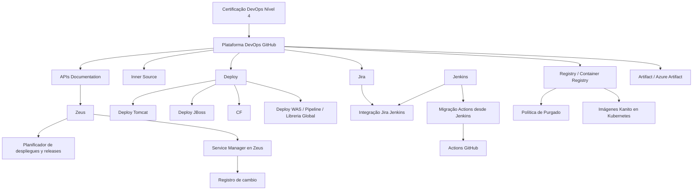

# Certificação DevOps Nível 4 — Plataforma DevOps GitHub, Deploys, Registry e Zeus

## 1. Metadados do Documento
- **Arquivo de Origem:** `Não identificado`
- **Tipo de Documento:** `Apresentação Executiva`
- **Domínio / Sistema:** `Certificação DevOps Nível 4, Plataforma DevOps GitHub e Zeus`
- **Público-Alvo:** `Desenvolvedores, Arquitetos, Operação e equipes DevOps`
- **Data/Versão Identificada:** `Não identificada`

---

## 2. Resumo Executivo & Contexto de Negócio

O documento apresenta tópicos associados à **Certificação DevOps Nível 4** e à **Plataforma DevOps GitHub**. O conteúdo aborda capacidades de documentação, APIs, práticas de Inner Source, mecanismos de deploy, automação de releases, registro de artefatos e gestão de mudanças.

A Plataforma DevOps é relacionada a fluxos de deploy para **Tomcat**, **JBoss**, **CF** e **WAS**, além de referências a pipeline, biblioteca global e imagens executadas em Kubernetes. O documento também cita um **Container Registry**, uma política de purga e **Azure Artifact**, indicando componentes voltados ao armazenamento e gerenciamento de imagens e artefatos.

A integração entre **Jira** e **Jenkins** é explicitamente mencionada. Também é apresentada a migração para **GitHub Actions** a partir do Jenkins, sem detalhamento sobre escopo, cronograma, mecanismos técnicos ou critérios de migração.

O sistema **Zeus** aparece associado à documentação de APIs, a um planejador de deploys e releases e ao registro de mudanças por meio de Service Manager. O conteúdo é predominantemente composto por tópicos; não há detalhamento adicional sobre contratos de integração, responsabilidades operacionais, URLs, métodos HTTP, ambientes ou configurações técnicas.

---

## 3. Arquitetura, Componentes & Tecnologias Envolvidas

| Componente / Tecnologia | Relação ou finalidade explicitamente apresentada |
| :--- | :--- |
| Certificação DevOps Nível 4 | Tema central da apresentação. |
| Plataforma DevOps GitHub | Plataforma citada no contexto de DevOps. |
| Home Solutions | Item citado junto de APIs Documentation e Zeus. |
| APIs Documentation | Documentação de APIs citada no documento. |
| Zeus | Associado à documentação de APIs, planejador de deploys e releases e Service Manager. |
| Inner Source | Prática ou tópico listado na apresentação. |
| Tomcat | Destino ou contexto de deploy citado. |
| JBoss | Destino ou contexto de deploy citado. |
| CF | Item citado no contexto de deploy; o documento não expande a sigla. |
| WAS | Item citado no contexto de pipeline de deploy; o documento não expande a sigla. |
| Pipeline | Citado no contexto de deploy WAS. |
| Libreria Global | Item citado junto de pipeline e deploy WAS. |
| Jira | Ferramenta citada em integração com Jenkins. |
| Jenkins | Ferramenta citada em integração com Jira e como origem de migração para Actions GitHub. |
| Actions GitHub | Tecnologia citada para migração a partir do Jenkins. |
| Registry | Repositório ou capacidade citada no documento. |
| Container Registry | Registro de containers explicitamente citado. |
| Política de Purgado | Política de purga associada ao Registry/Container Registry. |
| Imágenes Kanito en Kubernetes | Imagens citadas em contexto Kubernetes; o termo “Kanito” não é explicado. |
| Artifact | Item listado no documento. |
| Azure Artifact | Serviço ou item citado para artefatos. |
| Planificador | Associado ao planejamento de deploys e releases. |
| Service Manager | Associado ao registro de mudança em Zeus. |
| Registro de cambio | Registro de mudança citado em conjunto com Service Manager. |



> **Nota de Análise:** O diagrama representa somente associações e fluxos explicitamente sugeridos pelos tópicos do documento. O material não detalha protocolos, interfaces, contratos JSON, métodos HTTP, versões, servidores ou responsabilidades entre os componentes.

---

## 4. Regras de Negócio, Especificações Funcionais & Processos

### 4.1 Capacidades e tópicos apresentados

1. A apresentação referencia a **Certificação DevOps Nível 4**.
2. A **Plataforma DevOps GitHub** é listada como elemento central do conteúdo.
3. O documento cita **paginação de API**, incluindo as grafias “Paginación API” e “Páginación API”.
4. O documento lista **Inner Source** e “Inner source”, sem apresentar definição, governança, processo de contribuição ou regras de acesso.
5. São citados deploys para **Tomcat**, **JBoss**, **CF** e **WAS**.
6. O deploy WAS é apresentado junto de **pipeline** e **Libreria Global**.
7. Há referência explícita à **integração Jira Jenkins**.
8. O documento menciona **Release note**, sem definir o conteúdo, o responsável pela publicação ou o vínculo com processos de release.
9. A apresentação cita **Actions GitHub** e uma **migração Actions desde Jenkins**.
10. São apresentados **Registry**, **Container Registry**, **Purgado** e **Política de Purgado**.
11. O documento menciona **imagens Kanito em Kubernetes**, sem explicar o termo “Kanito”, o tipo das imagens ou o processo de implantação.
12. São citados **Artifact** e **Azure Artifact**.
13. O sistema **Zeus** é associado a um **planificador de deploys e releases**.
14. O documento associa **registro de mudança** a **Service Manager em Zeus**.

### 4.2 Fluxo conceitual identificado

1. A Plataforma DevOps GitHub reúne tópicos de documentação de APIs, práticas de Inner Source, deploys, automação, registros e artefatos.
2. O documento indica integração entre Jira e Jenkins.
3. O documento indica uma migração de Actions GitHub a partir do Jenkins.
4. O fluxo de deploy possui referências a Tomcat, JBoss, CF e WAS.
5. O Registry/Container Registry está associado a uma política de purga e a imagens em Kubernetes.
6. Zeus é relacionado ao planejamento de deploys e releases e ao Service Manager para registro de mudanças.

> **Nota de Análise:** O documento não especifica sequência obrigatória, regras de aprovação, papéis, critérios de sucesso, rollback, janelas de mudança, gatilhos de pipeline ou tratamento de falhas.

---

## 5. Tabelas de Parâmetros, Ambientes e Estruturas de Dados

| Item / Parâmetro | Descrição / Função | Tipo / Valores / Formato | Ambiente / Observações |
| :--- | :--- | :--- | :--- |
| Certificação DevOps Nível 4 | Tema de certificação citado. | Tópico de apresentação. | Não detalhado. |
| Plataforma DevOps GitHub | Plataforma DevOps mencionada. | Plataforma. | Não detalhado. |
| Paginação API | Capacidade ou tema de APIs listado. | “Paginación API” e “Páginación API”. | Não há regra de paginação informada. |
| Inner Source | Tópico de colaboração listado. | “Inner Source” / “Inner source”. | Não há definição adicional. |
| Home Solutions | Item listado junto da documentação de APIs e Zeus. | Nome apresentado no documento. | Não detalhado. |
| APIs Documentation | Documentação de APIs. | Capacidade/documentação. | Associada textualmente a Home Solutions e Zeus. |
| Deploy Tomcat | Deploy para Tomcat. | Destino de deploy. | Não há ambiente ou procedimento informado. |
| Deploy JBoss | Deploy para JBoss. | Destino de deploy. | Não há ambiente ou procedimento informado. |
| CF | Item associado ao deploy. | Sigla não expandida. | Não detalhado. |
| Deploy WAS | Deploy associado a pipeline e Libreria Global. | Destino/processo de deploy. | Não há ambiente ou procedimento informado. |
| Pipeline | Elemento associado ao deploy WAS. | Pipeline. | Não há etapas descritas. |
| Libreria Global | Item associado ao pipeline de deploy WAS. | Nome apresentado no documento. | Não detalhado. |
| Integração Jira Jenkins | Integração explicitamente citada. | Integração entre ferramentas. | Não há descrição da direção, eventos ou dados integrados. |
| Release note | Item associado ao processo de release. | Documento ou artefato de release. | Não detalhado. |
| Actions GitHub | Ferramenta ou capacidade de automação citada. | GitHub Actions. | Associada à migração desde Jenkins. |
| Migração Actions desde Jenkins | Migração citada da ferramenta Jenkins para Actions GitHub. | Iniciativa/processo. | Escopo e status não detalhados. |
| Registry | Registro citado. | Registry. | Não há endereço ou credenciais informados. |
| Container Registry | Registro de containers citado. | Registro de imagens de container. | Associado à política de purga. |
| Purgado | Operação citada. | Purga. | Critérios não informados. |
| Política de Purgado | Política relacionada ao Registry. | Política. | Retenção, periodicidade e responsáveis não informados. |
| Imágenes Kanito en Kubernetes | Imagens citadas em Kubernetes. | Imagens em Kubernetes. | “Kanito” não é definido no documento. |
| Artifact | Item relacionado a artefatos. | Artefato. | Não detalhado. |
| Azure Artifact | Item citado para artefatos. | Serviço ou repositório de artefatos. | Não há URL, organização ou feed informado. |
| Zeus | Sistema citado. | Sistema/plataforma. | Associado a APIs Documentation, planejamento e Service Manager. |
| Planificador | Planejador citado. | Planejador. | Associado a deploys e releases. |
| Planificador de despliegues y releases | Capacidade de planejamento. | Planejamento de deploys e releases. | Não há calendário, regras ou interface informados. |
| Registro de cambio | Registro de mudança. | Registro/processo. | Associado ao Service Manager. |
| Service Manager en Zeus | Service Manager no contexto Zeus. | Sistema/capacidade. | Associado ao registro de mudanças. |

---

## 6. Bateria de Perguntas & Respostas para RAG (FAQ Sintético)

### P1: Qual é o tema central do documento?
**R:** O documento apresenta tópicos relacionados à **Certificação DevOps Nível 4** e à **Plataforma DevOps GitHub**, incluindo documentação de APIs, deploys, integração Jira Jenkins, GitHub Actions, registries, artefatos, Kubernetes e Zeus.

### P2: Quais destinos de deploy são citados na apresentação?
**R:** A apresentação cita **Deploy Tomcat**, **Deploy JBoss**, **CF** e **Deploy WAS**. O conteúdo não fornece procedimentos, comandos, configurações, servidores ou ambientes para esses deploys.

### P3: O que o documento informa sobre a integração entre Jira e Jenkins?
**R:** O documento lista explicitamente a **Integração Jira Jenkins**. Não são detalhados os eventos integrados, o sentido da integração, os dados sincronizados, credenciais, endpoints ou regras operacionais.

### P4: Qual é a relação entre Jenkins e GitHub Actions no documento?
**R:** O documento cita **Actions GitHub** e **Migración Actions desde Jenkins**, indicando uma migração relacionada à adoção de GitHub Actions a partir do Jenkins. O escopo, o status, os pipelines afetados e a estratégia de transição não são informados.

### P5: O documento apresenta alguma política para Container Registry?
**R:** Sim. O documento lista **Registry**, **Container Registry**, **Purgado** e **Política de Purgado**. Contudo, não define período de retenção, critérios de exclusão, frequência de execução, exceções ou responsáveis pela política.

### P6: O que é informado sobre imagens em Kubernetes?
**R:** O documento contém o tópico **“Imágenes Kanito en Kubernetes”**. Não há detalhamento sobre a origem das imagens, manifests, namespaces, clusters, versionamento, processo de deploy ou o significado do termo “Kanito”.

### P7: Qual é o papel de Zeus no material apresentado?
**R:** Zeus é citado em associação com **APIs Documentation**, com um **Planificador de despliegues y releases** e com **Service Manager en Zeus**. O documento não descreve arquitetura, integrações, perfis de acesso ou funcionalidades adicionais de Zeus.

### P8: O que o planejador de Zeus realiza?
**R:** O documento menciona um **Planificador de despliegues y releases**, associado a Zeus. A apresentação não explica como o planejamento é criado, quais dados são usados, quais regras de agendamento existem ou quem pode operar esse planejador.

### P9: Como o registro de mudanças é tratado?
**R:** O documento cita **Registro de cambio Service Manager** e **Service manager en Zeus**. Isso indica uma associação entre registro de mudança, Service Manager e Zeus, mas não há fluxo de aprovação, categorização, auditoria ou integração técnica detalhada.

### P10: Quais recursos de documentação de APIs são mencionados?
**R:** O documento lista **Home Solutions APIs Documentation Zeus**. A relação textual indica referências a Home Solutions, documentação de APIs e Zeus, mas não há URLs, estrutura de navegação, especificações de API ou método de publicação descritos.

### P11: O documento define regras para paginação de API?
**R:** Não. O material apenas cita **Paginación API** e **Páginación API**. Não são especificados parâmetros de paginação, tamanho de página, tokens, limites, ordenação ou contratos de resposta.

### P12: O que é informado sobre Azure Artifact?
**R:** O documento cita **Artifact** e **Azure Artifact**. Não são informados feeds, pacotes, tipos de artefato, políticas de retenção, permissões, URLs ou procedimento de publicação e consumo.

---

## 7. Glossário de Termos, Siglas & Conceitos-Chave

- **Actions GitHub:** Item denominado “Actions GitHub”, citado no contexto de migração desde Jenkins.
- **APIs Documentation:** Documentação de APIs citada no documento.
- **Artifact:** Item de artefato listado na apresentação.
- **Azure Artifact:** Item denominado “Azure Artifact”, citado junto de Artifact.
- **CF:** Sigla citada no contexto de deploy; o documento não apresenta expansão.
- **Container Registry:** Registro de containers citado junto a política de purga.
- **Deploy:** Processo ou tópico de implantação citado para Tomcat, JBoss, CF e WAS.
- **GitHub:** Plataforma mencionada como parte da Plataforma DevOps GitHub e de Actions GitHub.
- **Inner Source:** Tópico listado como “Inner Source” e “Inner source”; não há definição adicional.
- **Jenkins:** Ferramenta citada em integração com Jira e como origem de migração para Actions GitHub.
- **Jira:** Ferramenta citada em integração com Jenkins.
- **Kubernetes:** Plataforma citada no tópico de imagens Kanito.
- **Libreria Global:** Termo citado junto de pipeline e deploy WAS; não há definição adicional.
- **Planificador:** Planejador citado para deploys e releases.
- **Purgado:** Operação de purga citada no contexto de Registry.
- **Release note:** Item citado no contexto de releases; não há detalhamento adicional.
- **Registry:** Registro citado junto de Container Registry.
- **Service Manager:** Sistema ou capacidade citada no contexto Zeus e registro de mudança.
- **Tomcat:** Destino ou contexto de deploy citado.
- **WAS:** Sigla citada em “Deploy WAS pipeline Libreria Global”; o documento não apresenta expansão.
- **Zeus:** Sistema citado junto de documentação de APIs, planejamento de deploys/releases e Service Manager.

---

## 8. Notas Críticas, Riscos & Limitações

- O conteúdo original é composto predominantemente por tópicos resumidos de apresentação, sem explicações operacionais detalhadas.
- Não foram identificados URLs, endereços de servidores, portas, credenciais, variáveis de ambiente, nomes de repositórios ou configurações de pipeline.
- Não há especificação de contratos de API, métodos HTTP, esquemas JSON, regras de autenticação ou parâmetros de paginação.
- A migração de Jenkins para GitHub Actions é citada, mas não há escopo, estratégia, cronograma, status ou critérios de aceite.
- A política de purga para Registry/Container Registry é mencionada sem regras de retenção, exclusão ou recuperação.
- O documento menciona “Kanito” em “Imágenes Kanito en Kubernetes”, mas não define o termo.
- As siglas **CF** e **WAS** não são expandidas no conteúdo fornecido.
- Há variações ortográficas preservadas do original, como “Paginación API” e “Páginación API”, além de “Inner Source” e “Inner source”.

---

## 9. Conteúdo Bruto Estruturado (Referência Fiel)

```text
--- [PÁGINA 1 DE 2] ---

CERTIFICACIÓN - DevOps Nivel 4
CERTIFICACIÓN nivel 4
DevOps
Plataforma DevOps GitHub
Paginación API
Páginación API
Inner Source
Inner source
Plataforma DevOps
 Deploy
Deploy Tomcat
Deploy JBoss
 / 
 CF
Home Solutions APIs Documentation Zeus
EN


--- [PÁGINA 2 DE 2] ---

Deploy WAS pileline Libreria Global
Jira Jenkins
Integración Jira Jenkins
Release note
Actions GitHub
Migración Actions desde Jenkins
Registry
Container Registry
Purgado
Politica de Purgado
Imagenes
Imágenes Kanito en Kubernetes
Artifact
Azure Artifact
Zeus
Planificador
Planificador de despliegues y releases
Registro de cambio Service Manager
Service manager en Zeus
Contenido relevante
```
