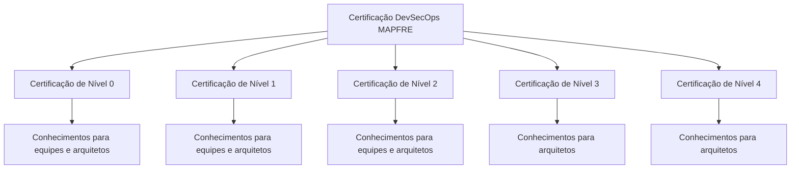
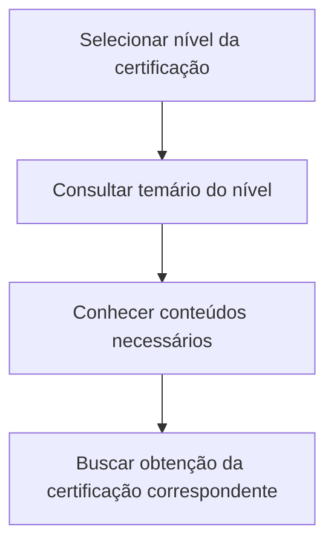

# Certificação DevSecOps MAPFRE — Temários por Nível para Equipes e Arquitetos

## 1. Metadados do Documento
- **Arquivo de Origem:** `Não identificado`
- **Tipo de Documento:** `Apresentação Executiva`
- **Domínio / Sistema:** `Certificação DevSecOps MAPFRE`
- **Público-Alvo:** `Equipes e arquitetos; arquitetos nos níveis 3 e 4`
- **Data/Versão Identificada:** `Não identificada`

---

## 2. Resumo Executivo & Contexto de Negócio

O documento apresenta a estrutura de níveis da **Certificação DevSecOps MAPFRE**. O conteúdo informa que cada nível de certificação possui um temário com os conhecimentos necessários para obtenção da respectiva certificação.

A certificação é organizada nos níveis **0, 1, 2, 3 e 4**. Os níveis 0, 1 e 2 são descritos como destinados a equipes e arquitetos. Os níveis 3 e 4 são descritos especificamente como destinados a arquitetos.

O material não descreve conteúdos programáticos concretos, critérios de aprovação, duração, avaliações, pré-requisitos, plataformas de treinamento ou responsáveis pela certificação. A finalidade explícita é indicar a existência de temários por nível.

O documento também exibe os termos `CF`, `Home`, `Solutions`, `APIs`, `Documentation`, `Zeus` e `EN`; entretanto, não apresenta explicação que permita determinar se representam navegação, produtos, sistemas, áreas ou recursos associados à certificação.

---

## 3. Arquitetura, Componentes & Tecnologias Envolvidas

O conteúdo não descreve uma arquitetura de software, integrações, APIs, microsserviços, tecnologias, ambientes ou fluxo de dados. A estrutura apresentada é uma hierarquia de certificação DevSecOps MAPFRE dividida em cinco níveis.



**Nota de Análise:** O documento apresenta a sequência de níveis da Certificação DevSecOps MAPFRE, mas não detalha dependências formais, pré-requisitos entre níveis ou mecanismos de progressão.

---

## 4. Regras de Negócio, Especificações Funcionais & Processos

### Estrutura de certificação identificada

1. A **Certificação DevSecOps MAPFRE** possui temários organizados por níveis.
2. O **Nível 0** reúne conteúdos necessários para a certificação de nível zero de DevOps.
3. O **Nível 1** reúne conteúdos necessários para o primeiro nível de certificação de DevOps.
4. O **Nível 2** reúne conteúdos necessários para o segundo nível de certificação de DevOps.
5. O **Nível 3** reúne conteúdos necessários para o terceiro nível de certificação de DevOps para arquitetos.
6. O **Nível 4** reúne conteúdos necessários para o quarto nível de certificação de DevOps para arquitetos.
7. Os níveis 0, 1 e 2 mencionam explicitamente **equipes e arquitetos**.
8. Os níveis 3 e 4 mencionam explicitamente **arquitetos**.

### Processo inferível a partir do texto

O documento permite identificar apenas o seguinte processo de alto nível:



**Nota de Análise:** Não há detalhamento sobre inscrição, treinamento, provas, notas mínimas, emissão de certificado, validade da certificação ou renovação.

---

## 5. Tabelas de Parâmetros, Ambientes e Estruturas de Dados

| Item / Parâmetro | Descrição / Função | Tipo / Valores / Formato | Ambiente / Observações |
| :--- | :--- | :--- | :--- |
| Certificação DevSecOps MAPFRE | Estrutura de certificação apresentada pelo documento | Certificação organizada por níveis | Não são informados plataforma, ambiente ou processo operacional |
| Certificação de Nível 0 | Temário com conteúdos necessários para obter o nível zero de certificação DevOps | Nível `0` | Destinado a equipes e arquitetos |
| Certificação de Nível 1 | Temário com conteúdos necessários para obter o primeiro nível de certificação DevOps | Nível `1` | Destinado a equipes e arquitetos |
| Certificação de Nível 2 | Temário com conteúdos necessários para obter o segundo nível de certificação DevOps | Nível `2` | Destinado a equipes e arquitetos |
| Certificação de Nível 3 | Temário com conteúdos necessários para obter o terceiro nível de certificação DevOps | Nível `3` | Destinado a arquitetos |
| Certificação de Nível 4 | Temário com conteúdos necessários para obter o quarto nível de certificação DevOps | Nível `4` | Destinado a arquitetos |
| CF | Termo exibido no documento | Não detalhado | Não é possível determinar o significado pelo conteúdo fornecido |
| Home | Termo exibido no documento | Não detalhado | Pode corresponder a navegação, mas o documento não confirma |
| Solutions | Termo exibido no documento | Não detalhado | Não é possível determinar o significado pelo conteúdo fornecido |
| APIs | Termo exibido no documento | Não detalhado | O documento não descreve APIs, contratos ou métodos |
| Documentation | Termo exibido no documento | Não detalhado | Não é possível determinar o significado pelo conteúdo fornecido |
| Zeus | Termo exibido no documento | Não detalhado | Não é possível determinar se é sistema, produto ou área |
| EN | Termo exibido no documento | Não detalhado | Não é possível determinar o significado pelo conteúdo fornecido |

---

## 6. Bateria de Perguntas & Respostas para RAG (FAQ Sintético)

### P1: Qual é o objetivo do documento sobre Certificação DevSecOps MAPFRE?
**R:** O documento informa que a Certificação DevSecOps MAPFRE possui temários organizados por níveis e que esses temários apresentam os conteúdos necessários para a obtenção de cada nível de certificação.

### P2: Quantos níveis de Certificação DevSecOps MAPFRE são mencionados?
**R:** São mencionados cinco níveis: Certificação de Nível 0, Nível 1, Nível 2, Nível 3 e Nível 4.

### P3: Para quem é destinada a Certificação DevSecOps de Nível 0?
**R:** A Certificação de Nível 0 é apresentada como destinada a equipes e arquitetos, com conteúdos necessários para obter o nível zero de certificação DevOps.

### P4: Qual é a finalidade do temário da Certificação DevSecOps de Nível 1?
**R:** O temário da Certificação de Nível 1 contém os conhecimentos necessários para obter o primeiro nível de certificação de DevOps para equipes e arquitetos.

### P5: O que o documento diz sobre a Certificação DevSecOps de Nível 2?
**R:** O documento afirma que a Certificação de Nível 2 contém os conteúdos necessários para obter o segundo nível de certificação de DevOps para equipes e arquitetos.

### P6: Quem é o público indicado para a Certificação DevSecOps de Nível 3?
**R:** A Certificação de Nível 3 é indicada para arquitetos. O documento afirma que o nível contém os conhecimentos necessários para obter o terceiro nível de certificação de DevOps para arquitetos.

### P7: Quem é o público indicado para a Certificação DevSecOps de Nível 4?
**R:** A Certificação de Nível 4 é indicada para arquitetos. O documento afirma que o nível contém os conhecimentos necessários para obter o quarto nível de certificação de DevOps para arquitetos.

### P8: O documento descreve os conteúdos específicos de cada nível de certificação?
**R:** Não. O documento afirma que existem conteúdos ou temários necessários para cada nível, mas não lista disciplinas, tecnologias, competências, módulos ou materiais de estudo específicos.

### P9: O documento estabelece pré-requisitos entre os níveis 0, 1, 2, 3 e 4?
**R:** Não. Embora os níveis estejam organizados numericamente de 0 a 4, o documento não declara que a conclusão de um nível seja pré-requisito formal para outro.

### P10: O documento informa como realizar a avaliação ou aprovação na certificação DevSecOps MAPFRE?
**R:** Não. Não há informações sobre provas, avaliações práticas, notas mínimas, critérios de aprovação, duração, inscrição ou emissão de certificados.

### P11: O que significam os termos CF, Home, Solutions, APIs, Documentation, Zeus e EN?
**R:** O documento exibe esses termos, mas não fornece contexto suficiente para definir seus significados ou relacioná-los formalmente à Certificação DevSecOps MAPFRE.

---

## 7. Glossário de Termos, Siglas & Conceitos-Chave

- **DevSecOps:** Termo citado como contexto da certificação; o documento não fornece uma definição formal.
- **MAPFRE:** Nome presente no título da Certificação DevSecOps; o documento não detalha a organização ou unidade responsável.
- **Certificação de Nível 0:** Certificação cujo temário contém conteúdos necessários para equipes e arquitetos obterem o nível zero de DevOps.
- **Certificação de Nível 1:** Certificação cujo temário contém conteúdos necessários para equipes e arquitetos obterem o primeiro nível de DevOps.
- **Certificação de Nível 2:** Certificação cujo temário contém conteúdos necessários para equipes e arquitetos obterem o segundo nível de DevOps.
- **Certificação de Nível 3:** Certificação cujo temário contém conteúdos necessários para arquitetos obterem o terceiro nível de DevOps.
- **Certificação de Nível 4:** Certificação cujo temário contém conteúdos necessários para arquitetos obterem o quarto nível de DevOps.
- **CF:** Termo presente no documento sem definição.
- **Zeus:** Termo presente no documento sem definição.
- **EN:** Termo presente no documento sem definição.

---

## 8. Notas Críticas, Riscos & Limitações

- O documento não fornece o conteúdo programático efetivo de nenhum dos níveis de certificação.
- Não há critérios de elegibilidade, avaliação, aprovação, emissão, validade ou renovação da certificação.
- Não são especificados responsáveis, canais de suporte, plataforma de aprendizagem ou procedimentos de inscrição.
- Não são descritas relações obrigatórias de progressão entre os níveis 0 a 4.
- Os termos `CF`, `Home`, `Solutions`, `APIs`, `Documentation`, `Zeus` e `EN` não possuem definição contextual no conteúdo fornecido.
- Não há detalhes técnicos sobre ferramentas DevSecOps, pipelines, arquitetura, APIs, integrações ou ambientes.
- **Nota de Análise:** O documento lista a Certificação DevSecOps MAPFRE e seus níveis, porém não detalha os tópicos, requisitos ou mecanismos de avaliação associados a cada nível.

---

## 9. Conteúdo Bruto Estruturado (Referência Fiel)

```text
--- [PÁGINA 1 DE 2] ---

CERTIFICACIÓN DevSecOps MAPFRE
 En este apartado se encuentran los temarios de cada uno de los niveles de
certificación.
Arquitecto
CERTIFICACIÓN DE NIVEL 0
En este apartado se encuentran los contenidos que se necesita conocer para obtener el nivel
cero de certificación de DevOps para equipos y arquitectos.
CERTIFICACIÓN DE NIVEL 1
En este apartado se encuentran los
contenidos que se necesita conocer para
obtener el primer nivel de certificación de
DevOps para equipos y arquitectos.
CERTIFICACIÓN DE NIVEL 2
En este apartado se encuentran los
contenidos que se necesita conocer para
obtener el segundo nivel de certificación de
DevOps para equipos y arquitectos.
CERTIFICACIÓN DE NIVEL 3
 CERTIFICACIÓN DE NIVEL 4
 / 
 CF
Home Solutions APIs Documentation Zeus
EN


--- [PÁGINA 2 DE 2] ---

En este apartado se encuentran los
contenidos que se necesita conocer para
obtener el tercer nivel de certificación de
DevOps para arquitectos.
En este apartado se encuentran los
contenidos que se necesita conocer para
obtener el cuarto nivel de certificación de
DevOps para arquitectos.
```
