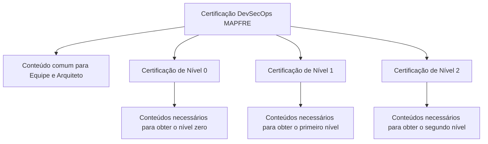

# Certificação DevSecOps MAPFRE — Conteúdos dos Níveis 0, 1 e 2 para Equipes e Arquitetos

## 1. Metadados do Documento
- **Arquivo de Origem:** Não identificado no conteúdo fornecido
- **Tipo de Documento:** Procedimento
- **Domínio / Sistema:** Certificação DevSecOps MAPFRE
- **Público-Alvo:** Equipes e arquitetos
- **Data/Versão Identificada:** Não identificada

---

## 2. Resumo Executivo & Contexto de Negócio

O documento apresenta a estrutura da **Certificação DevSecOps MAPFRE**, organizando os conteúdos necessários para certificação de equipes e arquitetos. O material indica que existem níveis progressivos de certificação, denominados Nível 0, Nível 1 e Nível 2.

A certificação possui uma seção comum direcionada simultaneamente a equipes e arquitetos. Para cada nível, o documento informa que há conteúdos a serem conhecidos para a obtenção da respectiva certificação DevOps.

O conteúdo fornecido não especifica os temas, critérios de aprovação, metodologia de avaliação, duração, pré-requisitos, ferramentas, responsáveis ou evidências exigidas para cada nível. Também não detalha a relação operacional entre DevOps, DevSecOps, equipes, arquitetos e os itens textuais “CF”, “Home Solutions”, “APIs Documentation” e “Zeus”.

A finalidade identificável do documento é servir como índice ou ponto de acesso aos conteúdos curriculares associados aos níveis de certificação DevOps para equipes e arquitetos da MAPFRE.

---

## 3. Arquitetura, Componentes & Tecnologias Envolvidas

O documento não descreve uma arquitetura de software, infraestrutura, integração entre sistemas, microsserviços ou tecnologias implementadas. Os elementos identificados são organizacionais e curriculares:

- Certificação DevSecOps MAPFRE.
- Certificação de Nível 0.
- Certificação de Nível 1.
- Certificação de Nível 2.
- Público comum: equipes e arquitetos.
- Termos citados sem detalhamento contextual: `CF`, `Home Solutions`, `APIs Documentation` e `Zeus`.



> **Nota de Análise:** O documento não descreve dependências entre os níveis, critérios de progressão, obrigatoriedade de conclusão sequencial ou mecanismos de avaliação.

---

## 4. Regras de Negócio, Especificações Funcionais & Processos

### Estrutura de certificação identificada

1. A Certificação DevSecOps MAPFRE possui conteúdos organizados por níveis.
2. O documento apresenta uma seção comum para **Equipe e Arquiteto**.
3. A Certificação de Nível 0 contém os conteúdos que precisam ser conhecidos para obter o nível zero de certificação DevOps para equipes e arquitetos.
4. A Certificação de Nível 1 contém os conteúdos que precisam ser conhecidos para obter o primeiro nível de certificação DevOps para equipes e arquitetos.
5. A Certificação de Nível 2 contém os conteúdos que precisam ser conhecidos para obter o segundo nível de certificação DevOps para equipes e arquitetos.

### Restrições e ausência de detalhamento

- Não há lista dos temas curriculares de nenhum nível.
- Não há definição de notas mínimas, provas, exames, exercícios ou avaliações.
- Não há definição de pré-requisitos para acesso ao Nível 0, Nível 1 ou Nível 2.
- Não há informação sobre certificação individual, certificação de equipe ou certificação por papel.
- Não há informação sobre validade, renovação ou expiração das certificações.
- Não há detalhamento sobre os termos “CF”, “Home Solutions”, “APIs Documentation” e “Zeus”.

---

## 5. Tabelas de Parâmetros, Ambientes e Estruturas de Dados

| Item / Parâmetro | Descrição / Função | Tipo / Valores / Formato | Ambiente / Observações |
| :--- | :--- | :--- | :--- |
| Certificação DevSecOps MAPFRE | Estrutura de certificação apresentada pelo documento | Certificação | Associada a equipes e arquitetos |
| Conteúdo comum para Equipe e Arquiteto | Seção comum identificada no documento | Seção curricular | Não possui conteúdos detalhados no trecho fornecido |
| Certificação de Nível 0 | Nível zero da certificação DevOps | Nível de certificação | Requer conhecimento dos conteúdos associados ao nível zero |
| Certificação de Nível 1 | Primeiro nível da certificação DevOps | Nível de certificação | Requer conhecimento dos conteúdos associados ao primeiro nível |
| Certificação de Nível 2 | Segundo nível da certificação DevOps | Nível de certificação | Requer conhecimento dos conteúdos associados ao segundo nível |
| CF | Termo listado no conteúdo bruto | Texto sem contexto | Significado não detalhado |
| Home Solutions | Termo listado no conteúdo bruto | Texto sem contexto | Significado não detalhado |
| APIs Documentation | Termo listado no conteúdo bruto | Texto sem contexto | Significado não detalhado |
| Zeus | Termo listado no conteúdo bruto | Texto sem contexto | Significado não detalhado |

---

## 6. Bateria de Perguntas & Respostas para RAG (FAQ Sintético)

### P1: Qual é o objetivo do documento de Certificação DevSecOps MAPFRE?
**R:** O documento apresenta os conteúdos que devem ser conhecidos para obter certificações DevOps nos níveis 0, 1 e 2, destinadas a equipes e arquitetos da MAPFRE.

### P2: Quais públicos são explicitamente mencionados na Certificação DevSecOps MAPFRE?
**R:** O documento menciona explicitamente equipes e arquitetos como públicos da certificação e da seção comum de conteúdo.

### P3: Quais níveis de certificação são apresentados no documento?
**R:** O documento apresenta a Certificação de Nível 0, a Certificação de Nível 1 e a Certificação de Nível 2.

### P4: O que é necessário para obter a Certificação de Nível 0?
**R:** Segundo o documento, é necessário conhecer os conteúdos definidos para a obtenção do nível zero de certificação DevOps para equipes e arquitetos. O trecho fornecido não lista quais são esses conteúdos.

### P5: O que é necessário para obter a Certificação de Nível 1?
**R:** Segundo o documento, é necessário conhecer os conteúdos definidos para a obtenção do primeiro nível de certificação DevOps para equipes e arquitetos. Os temas específicos não são detalhados no conteúdo fornecido.

### P6: O que é necessário para obter a Certificação de Nível 2?
**R:** Segundo o documento, é necessário conhecer os conteúdos definidos para a obtenção do segundo nível de certificação DevOps para equipes e arquitetos. O documento não informa os conteúdos específicos do nível.

### P7: O documento informa se os níveis de certificação precisam ser realizados em ordem?
**R:** Não. O documento apresenta os níveis 0, 1 e 2, mas não especifica se há progressão obrigatória, pré-requisitos ou dependência formal entre os níveis.

### P8: Existem critérios de avaliação ou aprovação para a Certificação DevSecOps MAPFRE?
**R:** Não há critérios de avaliação, nota mínima, tipo de exame, duração de prova ou procedimento de aprovação descritos no conteúdo fornecido.

### P9: O documento detalha o significado de CF, Home Solutions, APIs Documentation e Zeus?
**R:** Não. Esses termos aparecem no conteúdo bruto, mas o documento fornecido não explica sua função, relação com a certificação ou significado.

### P10: A certificação apresentada é exclusivamente DevSecOps ou DevOps?
**R:** O título do documento é “CERTIFICACIÓN DevSecOps MAPFRE”, enquanto as descrições dos níveis referem-se à “certificación de DevOps”. O documento não explica a distinção entre esses termos.

---

## 7. Glossário de Termos, Siglas & Conceitos-Chave

- **API:** Termo presente na expressão “APIs Documentation”. O documento não expande a sigla nem descreve APIs específicas.
- **APIs Documentation:** Termo citado no conteúdo bruto sem explicação adicional.
- **CF:** Sigla ou termo citado no conteúdo bruto sem significado definido.
- **DevOps:** Termo utilizado para descrever a certificação dos níveis 0, 1 e 2. O documento não fornece uma definição conceitual.
- **DevSecOps:** Termo utilizado no título da certificação MAPFRE. O documento não fornece uma definição conceitual nem detalha práticas de segurança.
- **Home Solutions:** Termo citado no conteúdo bruto sem explicação adicional.
- **MAPFRE:** Organização identificada no título da certificação.
- **Zeus:** Termo citado no conteúdo bruto sem explicação adicional.

---

## 8. Notas Críticas, Riscos & Limitações

- O conteúdo fornecido funciona como uma visão introdutória ou índice de níveis de certificação, sem detalhamento curricular.
- Não há critérios verificáveis para determinar a conclusão ou aprovação em qualquer nível de certificação.
- Não há indicação de responsáveis, proprietários do processo, instrutores ou áreas de suporte.
- Não há informação sobre ambientes, URLs, repositórios, ferramentas DevOps, pipelines, controles de segurança ou plataformas de aprendizagem.
- A coexistência dos termos “DevSecOps” no título e “DevOps” nas descrições dos níveis não é explicada pelo documento.
- Os termos “CF”, “Home Solutions”, “APIs Documentation” e “Zeus” não possuem contexto suficiente para interpretação confiável.
- **Nota de Análise:** O documento lista os níveis 0, 1 e 2, porém não detalha os conteúdos, avaliações ou pré-requisitos associados a cada nível.

---

## 9. Conteúdo Bruto Estruturado (Referência Fiel)

```text
--- [PÁGINA 1 DE 2] ---

CERTIFICACIÓN DevSecOps MAPFRE
 En este apartado se encuentran los temarios de cada uno de los niveles de
certificación.
Común para Equipo y Arquitecto
CERTIFICACIÓN DE NIVEL 0
En este apartado se encuentran los contenidos que se necesita conocer para obtener el nivel
cero de certificación de DevOps para equipos y arquitectos.
CERTIFICACIÓN DE NIVEL 1
En este apartado se encuentran los contenidos que se necesita conocer para obtener el primer
nivel de certificación de DevOps para equipos y arquitectos.
CERTIFICACIÓN DE NIVEL 2
 / 
 CF
Home Solutions APIs Documentation Zeus
EN


--- [PÁGINA 2 DE 2] ---

En este apartado se encuentran los contenidos que se necesita conocer para obtener el segundo
nivel de certificación de DevOps para equipos y arquitectos.
```
