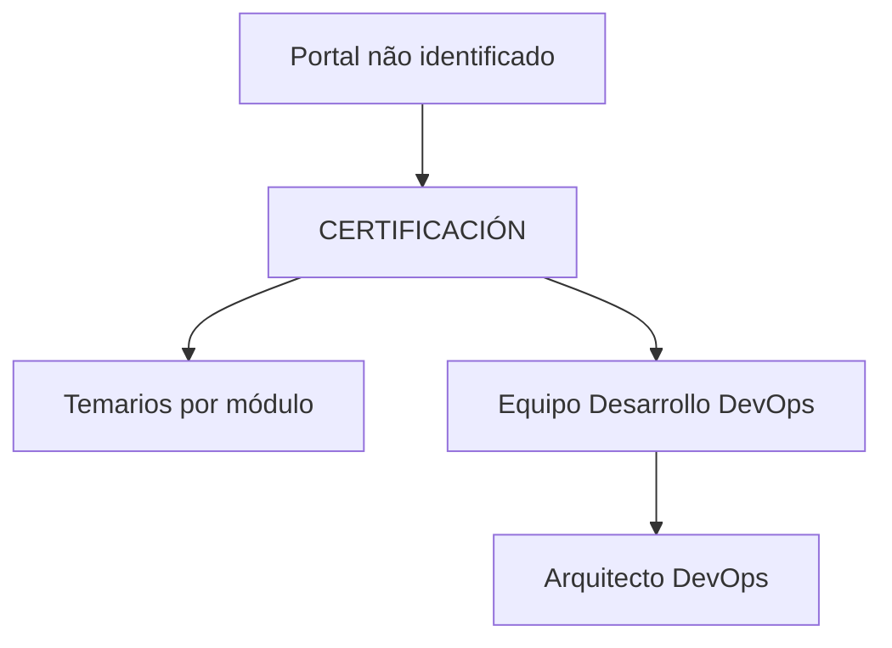

# Certificación — Temarios por Módulo para Equipo Desarrollo DevOps

## 1. Metadados do Documento
- **Arquivo de Origem:** Não identificado
- **Tipo de Documento:** Apresentação Executiva
- **Domínio / Sistema:** Certificación / Equipo Desarrollo DevOps
- **Público-Alvo:** Desenvolvedores e Arquitetos DevOps
- **Data/Versão Identificada:** Não identificada

---

## 2. Resumo Executivo & Contexto de Negócio

O documento apresenta uma seção intitulada **“CERTIFICACIÓN”** destinada a disponibilizar os temários associados aos diferentes níveis de certificação. O conteúdo informa que os temários estão organizados por módulo.

O público explicitamente citado é o **Equipo Desarrollo DevOps**. Dentro desse contexto, o documento também referencia o papel de **Arquitecto DevOps**.

A página parece pertencer a um ambiente de navegação ou portal que contém as opções “Home”, “Solutions”, “APIs”, “Documentation” e “Zeus”, além da indicação de idioma “EN”. Não há descrição adicional sobre o funcionamento do portal, critérios de certificação, módulos disponíveis ou requisitos para cada nível.

---

## 3. Arquitetura, Componentes & Tecnologias Envolvidas

O conteúdo não descreve arquitetura de software, integrações, microsserviços, tecnologias, ambientes ou fluxos técnicos. Os únicos elementos identificáveis são referências de navegação e papéis organizacionais.



**Nota de Análise:** o documento não detalha componentes técnicos, métodos de integração, URLs, tecnologias de implementação ou contratos de APIs.

---

## 4. Regras de Negócio, Especificações Funcionais & Processos

1. A seção **CERTIFICACIÓN** reúne os temários de cada nível de certificação.
2. Os temários de certificação estão divididos por módulo.
3. O conteúdo referencia o **Equipo Desarrollo DevOps**.
4. O documento menciona o perfil ou papel **Arquitecto DevOps**.

Não foram identificados critérios de aprovação, pré-requisitos, carga horária, módulos específicos, regras de pontuação, responsáveis, workflow de inscrição ou processo operacional de certificação.

---

## 5. Tabelas de Parâmetros, Ambientes e Estruturas de Dados

| Item / Parâmetro | Descrição / Função | Tipo / Valores / Formato | Ambiente / Observações |
| :--- | :--- | :--- | :--- |
| CERTIFICACIÓN | Seção que contém os temários de certificação. | Título de seção | Sem detalhamento adicional. |
| Temarios | Conteúdos previstos para cada nível de certificação. | Organizados por módulo | Os módulos não são enumerados no texto. |
| Equipo Desarrollo DevOps | Equipe citada no documento. | Público ou contexto organizacional | Não há descrição de responsabilidades. |
| Arquitecto DevOps | Papel citado no documento. | Perfil profissional | Não há descrição de atribuições ou requisitos. |
| Home | Item de navegação citado. | Menu | Sem URL identificada. |
| Solutions | Item de navegação citado. | Menu | Sem URL identificada. |
| APIs | Item de navegação citado. | Menu | Sem API ou contrato descrito. |
| Documentation | Item de navegação citado. | Menu | Sem documentação adicional transcrita. |
| Zeus | Item citado no cabeçalho ou navegação. | Nome próprio / possível seção | O documento não define o termo. |
| EN | Indicador de idioma. | Inglês | Não há informação sobre idiomas alternativos. |

---

## 6. Bateria de Perguntas & Respostas para RAG (FAQ Sintético)

### P1: Qual é o objetivo da seção “CERTIFICACIÓN”?
**R:** A seção “CERTIFICACIÓN” contém os temários associados aos diferentes níveis de certificação.

### P2: Como os temários de certificação estão organizados?
**R:** O documento informa que os temários estão divididos por módulo. Os nomes, conteúdos ou quantidade dos módulos não são apresentados.

### P3: Qual equipe é mencionada no documento de certificação?
**R:** O documento menciona o **Equipo Desarrollo DevOps** como equipe associada ao conteúdo.

### P4: O documento cita algum perfil profissional específico?
**R:** Sim. O texto cita o perfil **Arquitecto DevOps**, mas não descreve responsabilidades, competências, trilhas ou critérios de certificação relacionados a esse perfil.

### P5: Quais são os níveis de certificação disponíveis?
**R:** O documento afirma que existem temários para cada nível de certificação, mas não identifica os nomes nem a quantidade desses níveis.

### P6: Quais módulos compõem os temários de certificação?
**R:** O documento somente informa que os temários são divididos por módulo. Os módulos não são listados no conteúdo fornecido.

### P7: O documento define critérios de aprovação para a certificação?
**R:** Não. Não há critérios de aprovação, notas mínimas, avaliações, prazos, requisitos ou condições de elegibilidade descritos no texto.

### P8: Quais opções de navegação aparecem no conteúdo?
**R:** O conteúdo apresenta as opções “Home”, “Solutions”, “APIs”, “Documentation” e “Zeus”, além do indicador “EN”.

### P9: O que significa “Zeus” no contexto do documento?
**R:** O termo “Zeus” é citado no cabeçalho ou navegação, porém o documento não fornece uma definição para ele.

### P10: Existem APIs ou contratos técnicos documentados?
**R:** Não. Embora “APIs” apareça como item de navegação, o documento não apresenta endpoints, métodos HTTP, autenticação, parâmetros ou contratos de integração.

---

## 7. Glossário de Termos, Siglas & Conceitos-Chave

- **CERTIFICACIÓN:** Seção que disponibiliza os temários dos níveis de certificação.
- **Temarios:** Conteúdos programáticos ou ementas associados à certificação.
- **DevOps:** Termo citado na denominação “Equipo Desarrollo DevOps”; o documento não apresenta definição expandida.
- **Arquitecto DevOps:** Perfil profissional mencionado sem detalhamento de responsabilidades.
- **APIs:** Item de navegação citado; o documento não detalha interfaces de programação.
- **EN:** Indicador de idioma em inglês.
- **Zeus:** Termo citado sem definição contextual.

---

## 8. Notas Críticas, Riscos & Limitações

- O documento contém apenas uma página de conteúdo extraído.
- Não há identificação do arquivo de origem, data, versão, autor ou sistema proprietário.
- Não há detalhamento dos níveis de certificação, módulos, requisitos, avaliações ou critérios de aprovação.
- Não há especificações técnicas, URLs, ambientes, credenciais, parâmetros, APIs ou diagramas originais.
- **Nota de Análise:** o documento menciona “Arquitecto DevOps”, porém não detalha competências, responsabilidades ou requisitos de certificação para esse perfil.
- **Nota de Análise:** o documento apresenta “APIs” e “Documentation” como itens de navegação, porém não fornece documentação técnica ou contratos associados.

---

## 9. Conteúdo Bruto Estruturado (Referência Fiel)

```text
--- [PÁGINA 1 DE 1] ---

CERTIFICACIÓN
 En este apartado se encuentran los temarios de cada uno de los niveles de
certificación. Los temarios están divididas por módulo.
 Equipo Desarrollo DevOps
  Arquitecto DevOps
 / 
 CF
Home Solutions APIs Documentation Zeus
EN
```
