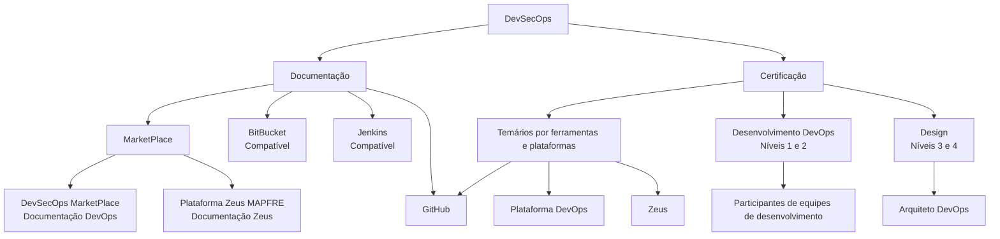

# Documentação e Certificação DevSecOps — MarketPlace, Zeus e Ferramentas Relacionadas

## 1. Metadados do Documento
- **Arquivo de Origem:** Não identificado
- **Tipo de Documento:** Apresentação Executiva
- **Domínio / Sistema:** DevSecOps, Plataforma DevOps e Plataforma Zeus MAPFRE
- **Público-Alvo:** Desenvolvedores, Arquitetos DevOps e participantes de equipes de desenvolvimento
- **Data/Versão Identificada:** Não identificada

---

## 2. Resumo Executivo & Contexto de Negócio

O documento apresenta referências de documentação e certificação relacionadas a DevSecOps. O conteúdo está organizado em duas perspectivas: documentação e certificação, com o objetivo declarado de permitir a aquisição de conhecimentos funcionais e técnicos relativos a DevSecOps.

A documentação de referência da plataforma DevSecOps é indicada como disponível no MarketPlace. O documento também aponta locais distintos para conteúdos de DevOps e da plataforma Zeus: **DevSecOps MarketPlace** e **Plataforma Zeus MAPFRE**, respectivamente.

Além das plataformas citadas, o material lista ferramentas de mercado incluídas na plataforma, especificamente GitHub. BitBucket e Jenkins são citados como ferramentas relacionadas que continuam compatíveis com a plataforma.

A seção de certificação descreve temários segmentados por ferramentas e plataformas relevantes para DevOps — GitHub, Plataforma DevOps e Zeus — e por função. Há níveis 1 e 2 para Desenvolvimento DevOps, comuns a participantes de equipes de desenvolvimento integradas à plataforma DevOps, e níveis 3 e 4 de Design destinados a funções de Arquiteto DevOps.

---

## 3. Arquitetura, Componentes & Tecnologias Envolvidas

| Componente / Tecnologia | Papel descrito no documento |
| :--- | :--- |
| DevSecOps | Tema central da documentação e certificação. |
| MarketPlace | Local indicado para documentação de referência da plataforma DevSecOps. |
| DevSecOps MarketPlace | Local indicado para conteúdos de DevOps. |
| Plataforma Zeus MAPFRE | Local indicado para conteúdos da plataforma Zeus. |
| GitHub | Ferramenta de mercado incluída na plataforma e relevante para os temários de certificação. |
| BitBucket | Ferramenta relacionada compatível com a plataforma. |
| Jenkins | Ferramenta relacionada compatível com a plataforma. |
| Plataforma DevOps | Plataforma relevante para os temários de certificação e para a integração de equipes de desenvolvimento. |
| Zeus | Plataforma relevante para os temários de certificação. |
| Home Solutions APIs Documentation Zeus | Texto listado no material sem detalhamento de função ou relação arquitetural. |
| CF | Sigla listada no material sem expansão ou contexto adicional. |



> *Nota de Análise: O documento não detalha integrações técnicas, protocolos, métodos HTTP, contratos de API, topologia de infraestrutura, versões de ferramentas ou fluxos de CI/CD entre GitHub, BitBucket, Jenkins, Plataforma DevOps e Zeus.*

---

## 4. Regras de Negócio, Especificações Funcionais & Processos

### Organização do conteúdo DevSecOps
1. O conteúdo DevSecOps é organizado em duas perspectivas: **Documentação** e **Certificação**.
2. A finalidade declarada é permitir a aquisição de conhecimentos funcionais e técnicos relativos a DevSecOps.

### Documentação
1. A documentação de referência da plataforma DevSecOps encontra-se no **MarketPlace**.
2. O conteúdo de DevOps encontra-se no **DevSecOps MarketPlace**.
3. O conteúdo de Zeus encontra-se na **Plataforma Zeus MAPFRE**.
4. GitHub é listado como ferramenta de mercado incluída na plataforma.
5. BitBucket e Jenkins são listados como ferramentas relacionadas compatíveis com a plataforma.

### Certificação
1. Os temários de certificação são divididos por ferramentas e plataformas relevantes utilizadas em DevOps:
   - GitHub;
   - Plataforma DevOps;
   - Zeus.
2. Os temários também são divididos por função.
3. **Desenvolvimento DevOps — níveis 1 e 2**:
   - são comuns para todos os participantes de equipes de desenvolvimento;
   - aplicam-se a participantes integrados dentro da plataforma DevOps.
4. **Design — níveis 3 e 4**:
   - são destinados aos papéis de Arquiteto DevOps.

> *Nota de Análise: O documento não apresenta critérios de aprovação, carga horária, pré-requisitos, conteúdo programático detalhado, método de avaliação ou regras de progressão entre os níveis de certificação.*

---

## 5. Tabelas de Parâmetros, Ambientes e Estruturas de Dados

| Item / Parâmetro | Descrição / Função | Tipo / Valores / Formato | Ambiente / Observações |
| :--- | :--- | :--- | :--- |
| Perspectivas do conteúdo | Organização do conteúdo DevSecOps | Documentação; Certificação | Não há detalhamento adicional sobre navegação ou acesso. |
| Documentação de referência DevSecOps | Referência documental da plataforma DevSecOps | MarketPlace | O documento não fornece URL. |
| Documentação DevOps | Local de documentação relacionado a DevOps | DevSecOps MarketPlace | Nome citado literalmente no documento. |
| Documentação Zeus | Local de documentação relacionado a Zeus | Plataforma Zeus MAPFRE | Nome citado literalmente no documento. |
| Ferramenta incluída | Ferramenta de mercado incluída na plataforma | GitHub | Não há versão ou configuração informada. |
| Ferramentas compatíveis | Ferramentas relacionadas compatíveis com a plataforma | BitBucket; Jenkins | Não há detalhes de integração ou compatibilidade. |
| Certificação Desenvolvimento DevOps | Formação comum para participantes de equipes de desenvolvimento integradas à plataforma DevOps | Níveis 1 e 2 | Não há ementa detalhada. |
| Certificação Design | Formação destinada a funções de Arquiteto DevOps | Níveis 3 e 4 | Não há ementa detalhada. |
| Plataformas relevantes à certificação | Plataformas e ferramentas usadas como referência para os temários | GitHub; Plataforma DevOps; Zeus | Segmentação também ocorre por função. |
| Home Solutions APIs Documentation Zeus | Texto listado no material | Não especificado | Função e relação com os demais componentes não detalhadas. |
| CF | Sigla listada no material | Não especificado | Significado não informado. |
| URLs de ambiente | Endereços de acesso | Não informado | O documento não apresenta URLs. |
| Servidores, portas e logs | Dados operacionais | Não informado | O documento não apresenta servidores, portas ou caminhos de log. |

---

## 6. Bateria de Perguntas & Respostas para RAG (FAQ Sintético)

### P1: Quais são as duas perspectivas de organização do conteúdo DevSecOps?
**R:** O conteúdo DevSecOps é organizado nas perspectivas de **Documentação** e **Certificação**. O objetivo indicado é permitir a aquisição de conhecimentos funcionais e técnicos relativos a DevSecOps.

### P2: Onde está a documentação de referência da plataforma DevSecOps?
**R:** A documentação de referência da plataforma DevSecOps é indicada como disponível no **MarketPlace**. O documento não informa uma URL, credenciais de acesso ou estrutura de navegação.

### P3: Onde devo procurar a documentação de DevOps?
**R:** O documento indica que DevOps se encontra no **DevSecOps MarketPlace**. Não há detalhamento adicional sobre os documentos, categorias ou conteúdos disponíveis nesse local.

### P4: Onde está a documentação relacionada à plataforma Zeus?
**R:** O conteúdo relacionado a Zeus é indicado como disponível na **Plataforma Zeus MAPFRE**. O documento não fornece uma URL nem descreve a arquitetura ou os serviços da plataforma Zeus.

### P5: Quais ferramentas de mercado são mencionadas no conteúdo DevSecOps?
**R:** GitHub é mencionado como ferramenta de mercado incluída na plataforma. BitBucket e Jenkins são mencionados como ferramentas relacionadas que ainda são compatíveis com a plataforma.

### P6: Quais plataformas e ferramentas são relevantes para os temários de certificação?
**R:** Os temários de certificação são divididos por ferramentas e plataformas relevantes utilizadas em DevOps: **GitHub**, **Plataforma DevOps** e **Zeus**. O documento também informa que a divisão ocorre por função.

### P7: A quem se destinam os níveis 1 e 2 da certificação?
**R:** Os níveis 1 e 2 correspondem à formação de **Desenvolvimento DevOps**. Esses níveis são comuns a todos os participantes de equipes de desenvolvimento que estejam integrados dentro da plataforma DevOps.

### P8: A quem se destinam os níveis 3 e 4 da certificação?
**R:** Os níveis 3 e 4 correspondem à formação de **Design** e são destinados aos papéis de **Arquiteto DevOps**.

### P9: O documento informa o conteúdo programático de cada nível de certificação?
**R:** Não. O documento apenas identifica os níveis 1 e 2 para Desenvolvimento DevOps e os níveis 3 e 4 para Design destinado a Arquiteto DevOps. Não são descritos temas, avaliações, carga horária, pré-requisitos ou critérios de aprovação.

### P10: O documento define como GitHub, BitBucket e Jenkins se integram à plataforma?
**R:** Não. GitHub é listado como ferramenta incluída, enquanto BitBucket e Jenkins são listados como ferramentas relacionadas compatíveis. O documento não descreve métodos de integração, pipelines, repositórios, permissões, versões ou configurações.

---

## 7. Glossário de Termos, Siglas & Conceitos-Chave

- **DevSecOps:** Tema da documentação e certificação apresentada; o documento associa DevSecOps à aquisição de conhecimentos funcionais e técnicos.
- **MarketPlace:** Local indicado para a documentação de referência da plataforma DevSecOps.
- **DevSecOps MarketPlace:** Local indicado para documentação de DevOps.
- **Plataforma DevOps:** Plataforma referenciada para integração de participantes de equipes de desenvolvimento e para temários de certificação.
- **Zeus:** Plataforma relevante para documentação e certificação; o documento também cita a Plataforma Zeus MAPFRE.
- **Plataforma Zeus MAPFRE:** Local indicado para a documentação de Zeus.
- **GitHub:** Ferramenta de mercado incluída na plataforma e relevante para os temários de certificação.
- **BitBucket:** Ferramenta relacionada compatível com a plataforma.
- **Jenkins:** Ferramenta relacionada compatível com a plataforma.
- **Arquiteto DevOps:** Papel destinatário dos níveis 3 e 4 de Design.
- **CF:** Sigla presente no documento sem significado identificado.
- **Home Solutions APIs Documentation Zeus:** Texto presente no documento sem definição adicional.

---

## 8. Notas Críticas, Riscos & Limitações

- O arquivo de origem, a data e a versão do documento não foram identificados no conteúdo fornecido.
- O documento não apresenta URLs, ambientes, servidores, portas, caminhos de logs, credenciais ou procedimentos de acesso.
- O documento não detalha a arquitetura técnica, os mecanismos de integração ou a interoperabilidade entre GitHub, BitBucket, Jenkins, Plataforma DevOps e Zeus.
- Não há especificação de conteúdo programático, carga horária, avaliação, pré-requisitos ou critérios de aprovação para os níveis de certificação.
- As siglas e textos **CF** e **Home Solutions APIs Documentation Zeus** não possuem explicação contextual suficiente no material.
- Há textos com possíveis inconsistências de escrita no conteúdo bruto, como “encuetra” e “integrado”; esta estrutura preserva o significado aparente sem corrigir ou inferir informações ausentes.

---

## 9. Conteúdo Bruto Estruturado (Referência Fiel)

```text
--- [PÁGINA 1 DE 2] ---

DevSecOps
 En este apartado se encuentra la documentación que permite adquirir
conocimientos tanto funcionales como técnicos relativos a DevSecOps. La
información está organizada en dos perspectivas:
Documentación
Certificación
DOCUMENTACIÓN
La documentación de referencia de la plataforma DevSecOps se encuentra en MarketPlace:
DevOps se encuetra: 🧰  DevSecOps MarketPlace
Zeus se encuentra:🧰  Plataforma Zeus MAPFRE
Adicionalmente, hay una serie de herramientas de mercado incluidas en la plataforma:
GitHub
Herramientas relacionadas compatibles aún con la plataforma:
- BitBucket - Jenkins
CERTIFICACIÓN
 / 
 CF
Home Solutions APIs Documentation Zeus
EN


--- [PÁGINA 2 DE 2] ---

Aquí se encuentran los temarios de los distintos niveles de certificación divididos por herramientas y
plataformas relevantes utilizadas en DevOps (GitHub, Plataforma DevOps y Zeus) y por función
Desarrollo DevOps: niveles 1 y 2 comunes para todos los participantes de equipos de desarrollo
que estén integrado dentro de la plataforma DevOps.
Diseño: niveles 3 y 4 destinado a los roles de Arquitecto DevOps.
```
