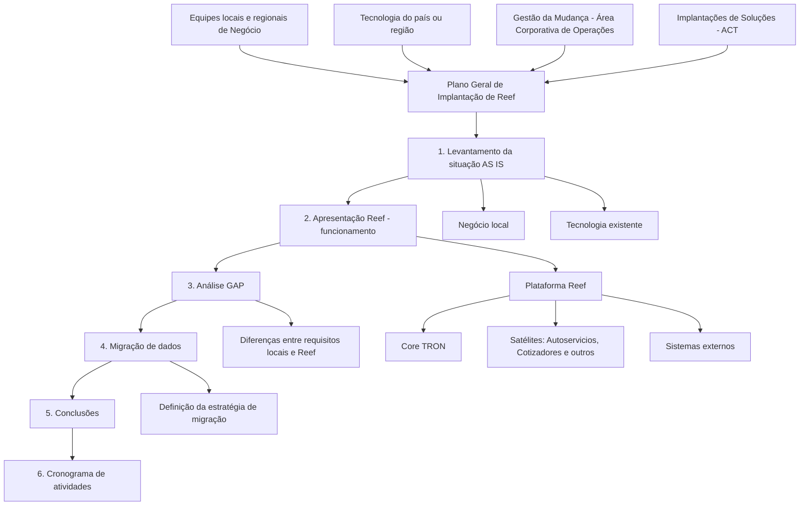

# Plano Geral de Implantação da Plataforma Seguradora Reef em Países

## 1. Metadados do Documento
- **Arquivo de Origem:** Não identificado no conteúdo fornecido
- **Tipo de Documento:** Procedimento
- **Domínio / Sistema:** Plataforma seguradora Reef; Core TRON
- **Público-Alvo:** Negócio, Tecnologia, Operação, Gestão de Mudança, Implantações e Governança de Projeto
- **Data/Versão Identificada:** Não identificada

---

## 2. Resumo Executivo & Contexto de Negócio

O documento descreve a metodologia para elaborar o Plano Geral de Implantação da Plataforma Reef em um país. O objetivo da Área de Implantações de Soluções é implantar, nas regiões de Mapfre, os ativos corporativos da plataforma seguradora Reef — incluindo ativos de Vida, Não Vida e Saúde — e estabelecer a operação e a governança necessárias para suportar a implantação.

A implantação é concebida como uma iniciativa conjunta. Participam equipes locais e regionais de Negócio, Tecnologia do país ou região, representantes de Gestão da Mudança da Área Corporativa de Operações e representantes de Implantações de Soluções da Área Corporativa de Tecnologia (ACT).

A metodologia parte de uma análise inicial da situação atual do negócio segurador e de seu suporte tecnológico. Essa análise cobre processos de negócio, linhas e ramos de negócio, volumetrias, origens de dados, requisitos legais, aplicações existentes, integrações e necessidades de reporte interno e externo.

Após conhecer o cenário local, o processo inclui a apresentação do funcionamento da Plataforma Reef, a comparação entre requisitos locais e capacidades já implementadas, a definição da estratégia de migração de dados e a consolidação de conclusões sobre escopo, objetivos, benefícios, governança, dependências, segurança e proteção de dados.

O cronograma definitivo de cada implantação depende das conclusões da fase inicial de análise, denominada no documento como *inception phase*. O documento informa que existe uma relação de tarefas e durações aproximadas como referência, mas essa relação não está presente no conteúdo bruto fornecido.

---

## 3. Arquitetura, Componentes & Tecnologias Envolvidas

A Plataforma Reef é apresentada como uma plataforma seguradora composta pelo Core **TRON** e por satélites, incluindo **Autoservicios** e **Cotizadores**. O documento também afirma que Reef interage com sistemas externos e que as características técnicas dessa integração serão apresentadas durante a implantação.

Não são fornecidos detalhes sobre métodos HTTP, contratos de integração, formatos de mensagens, protocolos, URLs, ambientes, portas, ferramentas, linguagens, infraestrutura ou mecanismos específicos de segurança.



| Componente / Entidade | Descrição sustentada pelo documento | Relação no processo |
| :--- | :--- | :--- |
| Plataforma Reef | Plataforma seguradora a ser implantada nas regiões de Mapfre. | Objeto central da implantação. |
| TRON | Core da Plataforma Reef. | Parte do funcionamento apresentado durante a implantação. |
| Autoservicios | Satélite que compõe a Plataforma Reef. | Parte do funcionamento apresentado. |
| Cotizadores | Satélite que compõe a Plataforma Reef. | Parte do funcionamento apresentado. |
| Sistemas externos | Sistemas com os quais Reef interage. | Devem ser considerados na apresentação de funcionamento e no levantamento de integrações existentes. |
| Aplicações locais existentes | Soluções e aplicações que dão suporte ao negócio segurador local. | Devem ser identificadas no levantamento tecnológico AS IS. |
| ACT | Área Corporativa de Tecnologia. | Área com representantes do time de Implantações de Soluções. |
| Área Corporativa de Operações | Área que inclui representantes de Gestão da Mudança. | Participa conjuntamente da implantação. |

> **Nota de Análise:** O documento menciona o Core TRON, Autoservicios, Cotizadores e sistemas externos, mas não detalha interfaces, contratos, métodos, tecnologias de comunicação ou topologia técnica.

---

## 4. Regras de Negócio, Especificações Funcionais & Processos

### 4.1. Objetivo da implantação

A implantação deve disponibilizar, nas regiões de Mapfre, os ativos corporativos da Plataforma Reef para os domínios de Vida, Não Vida e Saúde. O processo também deve estabelecer operação e governança para apoiar a implementação da plataforma.

### 4.2. Participação organizacional obrigatória

A implantação deve contar com participação conjunta dos seguintes grupos:

1. Equipes das áreas locais e regionais de Negócio envolvidas.
2. Área de Tecnologia do país ou região.
3. Representantes do time de Gestão da Mudança da Área Corporativa de Operações.
4. Representantes do time de Implantações de Soluções da Área Corporativa de Tecnologia (ACT).

### 4.3. Fase 1 — Levantamento da situação atual (AS IS)

A fase AS IS deve estudar a situação atual da gestão do negócio segurador no país sob duas perspectivas: Negócio e suporte tecnológico às operações.

#### Perspectiva de Negócio

O levantamento deve:

1. Aprofundar o entendimento do programa de seguros do país.
2. Identificar todos os processos de negócio estabelecidos, incluindo:
   - Emissão;
   - Sinistros;
   - Cobranças;
   - Resseguro;
   - Administração;
   - Tesouraria;
   - Outros processos existentes no país.
3. Identificar as linhas de negócio operadas e suas características.
4. Estudar os ramos de negócio.
5. Analisar volumetrias.
6. Identificar origens de dados.
7. Identificar requisitos legais.
8. Levantar outros requisitos necessários para a correta gestão do negócio.
9. Analisar os processos de administração e de fechamento da companhia.
10. Identificar necessidades de reporte informacional para organismos internos e externos.

#### Perspectiva de Tecnologia

O levantamento tecnológico deve:

1. Identificar a plataforma tecnológica existente no país.
2. Identificar cada solução ou aplicação que gerencia e suporta o negócio segurador em todos os seus âmbitos.
3. Cobrir aplicações de pré-venda, venda e pós-venda.
4. Levantar a situação das integrações existentes entre soluções e aplicações do ecossistema tecnológico.

### 4.4. Fase 2 — Apresentação Reef: funcionamento

A fase de apresentação deve mostrar:

1. O funcionamento da Plataforma Reef.
2. O funcionamento do Core TRON.
3. Os satélites que formam a Plataforma Reef, incluindo Autoservicios e Cotizadores.
4. As funcionalidades e características da plataforma.
5. A forma como Reef interage com sistemas externos.
6. As características técnicas da integração.

> **Nota de Análise:** O conteúdo fornecido determina que as características técnicas de integração devem ser apresentadas, mas não especifica quais são essas características.

### 4.5. Fase 3 — Análise GAP

A análise GAP deve realizar uma comparação entre:

- Requisitos locais; e
- Requisitos já implementados na Plataforma Reef.

A comparação deve abranger requisitos:

- Funcionais; e
- Não funcionais.

Como resultado, a análise GAP deve:

1. Produzir um inventário de diferenças entre o ambiente local e o ambiente Reef.
2. Identificar requisitos ausentes que precisam ser implementados em Reef.

### 4.6. Fase 4 — Migração de dados

A fase de migração de dados deve estudar a migração dos sistemas locais para Reef e definir uma estratégia que assegure a continuidade do negócio na plataforma.

A definição deve considerar:

1. A carteira que será migrada.
2. A possibilidade de migração de carteira viva ou outros critérios.
3. O momento de migração.
4. A diferença entre negócios de cauda longa e negócios de cauda curta.
5. Os controles necessários para garantir:
   - Integridade dos dados;
   - Precisão dos dados;
   - Consistência dos dados;
   - Controles na extração de dados;
   - Controles na carga de dados.
6. O critério de migração da carteira entre:
   - Modelo *big bang*; ou
   - Migração no vencimento da carteira vigente.

### 4.7. Fase 5 — Conclusões

Após a fase de análise, devem ser definidos:

1. O escopo da implantação da Plataforma Reef.
2. Os objetivos da implantação.
3. Os benefícios esperados.
4. O enfoque e os aspectos organizacionais.
5. As fases, resultados e metas.
6. Os usuários envolvidos.
7. A estrutura de governança do projeto.
8. O entendimento preliminar das interrelações com outras soluções.
9. Possíveis limitações.
10. Requisitos de segurança.
11. Requisitos de proteção de dados.

### 4.8. Fase 6 — Cronograma de atividades

O cronograma definitivo de implantação em cada país depende das conclusões da fase inicial de análise ou *inception phase*.

O documento declara que inclui, como referência, uma relação de tarefas e duração aproximada para a implantação da solução. Essa relação de tarefas e durações não consta no conteúdo bruto disponibilizado.

---

## 5. Tabelas de Parâmetros, Ambientes e Estruturas de Dados

| Item / Parâmetro | Descrição / Função | Tipo / Valores / Formato | Ambiente / Observações |
| :--- | :--- | :--- | :--- |
| Ativos corporativos Reef | Ativos a implantar nas regiões de Mapfre. | Vida, Não Vida e Saúde. | A implantação ocorre em um país, com participação de equipes locais, regionais e corporativas. |
| Perspectiva de análise AS IS | Visão usada para estudar a situação atual. | Negócio; Tecnologia. | Fase inicial do plano de implantação. |
| Processos de negócio | Processos estabelecidos no negócio segurador local. | Emissão, sinistros, cobranças, resseguro, administração, tesouraria e outros. | Devem ser identificados na perspectiva de Negócio. |
| Linhas de negócio | Linhas operadas pelo país e suas características. | Não detalhado. | Devem ser identificadas no levantamento AS IS. |
| Ramos de negócio | Ramos analisados no estudo do negócio segurador. | Não detalhado. | Devem ser estudados no levantamento AS IS. |
| Volumetrias | Volume associado ao negócio segurador. | Não detalhado. | Deve ser estudado na perspectiva de Negócio. |
| Origens de dados | Fontes de dados utilizadas no negócio. | Não detalhado. | Devem ser identificadas na perspectiva de Negócio. |
| Requisitos legais | Exigências legais necessárias à correta gestão do negócio. | Não detalhado. | Devem ser estudados no levantamento AS IS. |
| Reporte informacional | Necessidades de reporte da companhia. | Organismos internos e externos. | Deve considerar processos de administração e fechamento. |
| Plataforma tecnológica existente | Situação tecnológica atual do país. | Soluções e aplicações existentes. | Deve cobrir suporte ao negócio segurador. |
| Frentes de suporte tecnológico | Âmbitos do negócio suportados por aplicações. | Pré-venda, venda e pós-venda. | Devem ser cobertos no levantamento tecnológico. |
| Integrações existentes | Integrações entre soluções e aplicações do ecossistema local. | Não detalhado. | Devem ser levantadas na fase AS IS. |
| Requisitos comparados no GAP | Requisitos confrontados entre contexto local e Reef. | Funcionais e não funcionais. | Resultado esperado: inventário de diferenças e requisitos ausentes. |
| Carteira a migrar | Conjunto de negócios ou carteira considerado na migração. | Carteira viva ou outros critérios. | Critério deve ser definido no estudo de migração. |
| Momento de migração | Horizonte ou momento de execução da migração. | Negócios de cauda longa; negócios de cauda curta. | Deve ser definido na estratégia de migração. |
| Estratégia de migração | Forma de transição da carteira para Reef. | Big bang; vencimento da carteira vigente. | Deve garantir continuidade do negócio. |
| Controles de migração | Controles sobre extração e carga de dados. | Integridade, precisão e consistência. | Aplicáveis à extração e carga dos dados. |
| Cronograma definitivo | Planejamento final da implantação no país. | Não detalhado. | Depende das conclusões da *inception phase*. |
| Segurança e proteção de dados | Requisitos a definir após a análise. | Não detalhado. | Associados às interrelações com outras soluções e possíveis limitações. |

> **Nota de Análise:** O documento não fornece URLs, servidores, portas, nomes de ambientes, formatos de dados, layouts de arquivos, campos, contratos JSON ou parâmetros de configuração.

---

## 6. Bateria de Perguntas & Respostas para RAG (FAQ Sintético)

### P1: Qual é o objetivo do Plano Geral de Implantação da Plataforma Reef?
**R:** O objetivo é definir a metodologia para elaborar a implantação da Plataforma Reef em um país. A Área de Implantações de Soluções busca implementar, nas regiões de Mapfre, os ativos corporativos Reef de Vida, Não Vida e Saúde, além de estabelecer a operação e a governança que suportarão a implementação.

### P2: Quais equipes devem participar da implantação da Plataforma Reef?
**R:** A implantação deve contar com equipes locais e regionais de Negócio envolvidas, a área de Tecnologia do país ou região, representantes de Gestão da Mudança da Área Corporativa de Operações e representantes do time de Implantações de Soluções da Área Corporativa de Tecnologia (ACT).

### P3: O que deve ser analisado no levantamento AS IS sob a perspectiva de Negócio?
**R:** A análise de Negócio deve aprofundar o entendimento do programa de seguros do país, identificar processos como emissão, sinistros, cobranças, resseguro, administração e tesouraria, além das linhas e ramos de negócio, volumetrias, origens de dados, requisitos legais, processos de administração e fechamento da companhia e necessidades de reporte a organismos internos e externos.

### P4: O que deve ser levantado na análise AS IS sob a perspectiva de Tecnologia?
**R:** A análise tecnológica deve levantar a plataforma tecnológica existente no país, identificar todas as soluções e aplicações que suportam o negócio segurador em pré-venda, venda e pós-venda, e identificar a situação das integrações existentes entre as soluções e aplicações do ecossistema tecnológico.

### P5: Quais componentes da Plataforma Reef são mencionados no documento?
**R:** O documento menciona a Plataforma Reef, o Core TRON e satélites como Autoservicios e Cotizadores. Também afirma que Reef interage com sistemas externos, porém não fornece detalhes de interfaces, protocolos ou contratos técnicos.

### P6: O que a análise GAP deve comparar?
**R:** A análise GAP deve comparar os requisitos locais com os requisitos já implementados em Reef, cobrindo requisitos funcionais e não funcionais. O resultado deve ser um inventário das diferenças entre os ambientes e dos requisitos ausentes que precisam ser implementados em Reef.

### P7: Quais decisões devem ser tomadas na estratégia de migração de dados?
**R:** A estratégia deve definir a carteira a migrar, como carteira viva ou outros critérios; o momento de migração, considerando negócios de cauda longa e cauda curta; os controles de integridade, precisão e consistência na extração e carga; e o critério de migração entre *big bang* e vencimento da carteira vigente.

### P8: Como o documento orienta a garantia da qualidade dos dados durante a migração?
**R:** O documento determina que sejam definidos controles para garantir integridade, precisão e consistência dos dados nos processos de extração e carga. Não detalha ferramentas, métricas, regras de reconciliação ou mecanismos técnicos específicos para esses controles.

### P9: O que deve ser definido após a fase de análise inicial?
**R:** Após a análise devem ser definidos o escopo, os objetivos e os benefícios esperados da implantação; o enfoque organizacional; as fases, resultados e metas; os usuários; a estrutura de governança; as interrelações preliminares com outras soluções; possíveis limitações; e requisitos de segurança e proteção de dados.

### P10: O cronograma de implantação é igual para todos os países?
**R:** Não. O documento estabelece que o cronograma definitivo de implantação em cada país depende das conclusões da fase inicial de análise, também chamada de *inception phase*. Há referência a tarefas e durações aproximadas, mas elas não aparecem no conteúdo fornecido.

### P11: O documento define os detalhes técnicos de integração entre Reef e sistemas externos?
**R:** Não. O documento afirma que serão apresentadas a forma de interação de Reef com sistemas externos e as características técnicas da integração, mas o conteúdo disponível não especifica protocolos, APIs, métodos HTTP, contratos, URLs, autenticação ou formatos de mensagem.

### P12: Quais domínios de seguros são explicitamente contemplados pelos ativos corporativos Reef?
**R:** O documento menciona explicitamente os ativos de Vida, Não Vida e Saúde como ativos corporativos da Plataforma Reef a serem implementados nas regiões de Mapfre.

---

## 7. Glossário de Termos, Siglas & Conceitos-Chave

- **ACT:** Área Corporativa de Tecnologia; área da qual participam representantes do time de Implantações de Soluções.
- **Análise GAP:** Análise comparativa entre requisitos locais e requisitos já implementados em Reef, incluindo requisitos funcionais e não funcionais.
- **AS IS:** Levantamento da situação atual da gestão do negócio segurador e de seu suporte tecnológico no país.
- **Autoservicios:** Satélites da Plataforma Reef mencionados no documento.
- **Big bang:** Critério de migração da carteira citado como alternativa ao vencimento da carteira vigente; o documento não oferece definição adicional.
- **Carteira viva:** Possível critério para identificar a carteira a migrar; o documento não oferece definição adicional.
- **Cotizadores:** Satélites da Plataforma Reef mencionados no documento.
- **Inception phase:** Fase inicial de análise cujas conclusões determinam o cronograma definitivo de implantação de cada país.
- **Mapfre:** Organização/regiões nas quais o documento prevê a implantação dos ativos corporativos da Plataforma Reef.
- **Não Vida:** Um dos domínios de ativos corporativos Reef citados no documento.
- **Plataforma Reef:** Plataforma seguradora composta pelo Core TRON e por satélites, como Autoservicios e Cotizadores.
- **Reef:** Nome da plataforma seguradora objeto do plano de implantação.
- **Saúde:** Um dos domínios de ativos corporativos Reef citados no documento.
- **TRON:** Core da Plataforma Reef.
- **Vida:** Um dos domínios de ativos corporativos Reef citados no documento.
- **Vencimento da carteira vigente:** Critério alternativo ao *big bang* para migração da carteira; o documento não apresenta detalhamento adicional.

---

## 8. Notas Críticas, Riscos & Limitações

1. O documento não identifica nome de arquivo, versão, data, autor ou responsável pela aprovação.
2. A relação de tarefas e durações aproximadas citada para a implantação não está presente no conteúdo bruto fornecido.
3. O cronograma definitivo depende das conclusões da fase inicial de análise; portanto, o documento não estabelece prazos finais aplicáveis de forma uniforme a todos os países.
4. A estratégia de migração deve assegurar continuidade do negócio e preservar integridade, precisão e consistência dos dados, mas o documento não detalha mecanismos técnicos, critérios de aceite, reconciliação ou plano de reversão.
5. A análise GAP deve identificar requisitos funcionais e não funcionais ausentes, indicando potencial dependência de implementações adicionais em Reef.
6. Existem dependências explícitas de equipes locais, regionais e corporativas de Negócio, Tecnologia, Gestão da Mudança e Implantações de Soluções.
7. O entendimento de interrelações com outras soluções é inicialmente preliminar, o que indica que dependências e limitações podem ser identificadas ou refinadas após a análise.
8. Requisitos de segurança e proteção de dados devem ser definidos após a análise, mas não são especificados no documento.
9. O documento menciona integração com sistemas externos, mas não oferece detalhes técnicos sobre interfaces, protocolos, contratos, autenticação, disponibilidade ou tratamento de falhas.
10. O documento não apresenta matriz de responsabilidades, critérios de entrada e saída das fases, indicadores, riscos formalizados, critérios de priorização ou plano de contingência.

---

## 9. Conteúdo Bruto Estruturado (Referência Fiel)

```text
--- [PÁGINA 1 DE 3] ---

PLAN GENERAL DE IMPLANTACIÓN
INTRODUCCIÓN
El objetivo del Área de Implantaciones de Soluciones es implementar en las regiones de Mapfre los
activos corporativos de la Plataforma aseguradora Reef: activos Vida, No Vida, Salud, así como
establecer la operación y gobierno de la Plataforma dando soporte a la implementación.
El presente documento establece la metodología a seguir para elaborar el "Plan general de
Implantación de Reef" en un país:
Fases de trabajo / etapas a realizar con una breve descripción de las actividades realizadas en
cada fase.
Elaboración del cronograma de actividades general del proyecto de implantación, identificando
las fases del proyecto y plazos aproximados de ejecución.
PLAN GENERAL - FASES PRINCIPALES
La implantación de Reef en los países se llevará a cabo mediante la participación conjunta de
equipos de las áreas de Negocio locales / regionales involucradas, el área de Tecnología del
país/región, representantes del equipo de Gestión del Cambio del Área Corporativa de Operaciones y
representantes del equipo de Implantaciones de Soluciones del Área Corporativa de Tecnología
(ACT).
Las principales actividades a llevar a cabo son:
1. Levantamiento de la situación (AS IS)
 / 
 CF
Home Solutions APIs Documentation Zeus
EN


--- [PÁGINA 2 DE 3] ---

Se llevará a cabo un estudio de situación actual de la gestión del negocio asegurador en el país
desde las perspectivas de Negocio y de soporte tecnológico a las operaciones:
Negocio:
- se profundizará en el entendimiento del programa de seguros del país, identificando todos los
procesos de negocio que están establecidos (emisión, siniestros, cobranzas, reaseguro,
administración, tesorería, etc.), así como las líneas de negocio que son operados por el mismo y
sus características,
- se estudiarán los ramos de negocio, volumetrías, orígenes de datos, requerimientos legales y
otros necesarios para la correcta gestión del negocio,
- se analizarán los procesos de administración y cierre de la compañía, así como necesidades de
reporte informacional a organismos internos y externos.
Tecnología:
- se levantará la situación de la plataforma tecnológica existente en el país, identificando cada
una de las soluciones / aplicaciones que están gestionando y dando soporte al negocio
asegurador en todos sus frentes (preventa / venta y postventa),
- se levantará la situación en cuanto a la integración existente entre cada una de las
soluciones/aplicaciones del ecosistema tecnológico.
2. Presentación Reef - funcionamiento
Se mostrará el funcionamiento de Reef, tanto del Core (TRON) como de los satélites que conforman
la Plataforma Reef (Autoservicios, Cotizadores, etc.), sus funcionalidades y características.
Asimismo, se presentará la forma en la que Reef interactúa con los sistemas externos, así como las
características técnicas de la integración.
3. Análisis GAP
Se llevará a cabo un análisis comparativo entre los requisitos locales y los requisitos ya
implementados en Reef (funcionales y no funcionales).
Se realizará un inventario de diferencias entre ambos ambientes, así como los requisitos faltantes
que serán necesarios implementar en Reef.
4. Migración de datos
Se llevará a cabo un estudio acerca de la migración de datos desde los sistemas locales al sistema
Reef, determinando la estrategia a seguir, de tal manera que se garantice la continuidad del negocio
en la Plataforma. Se identificará la cartera que se debe migrar (cartera viva u otros criterios), desde
cuándo (negocios de cola larga vs cola corta) y qué controles llevar a cabo para garantizar la
integridad, precisión, consistencia, etc. en la extracción y carga de los datos.
En definitiva, se establecerá el criterio de migración de la cartera en modo big bang versus
vencimiento de la cartera vigente.
5. Conclusiones


--- [PÁGINA 3 DE 3] ---

Tras esta fase de análisis se definirán:
el alcance, los objetivos y los beneficios esperados de la implantación de la Plataforma Reef,
el enfoque y los aspectos organizativos: fases, resultados y metas, los usuarios y la estructura de
gobierno del proyecto,
entendimiento preliminar de las interrelaciones con otras soluciones, posibles limitaciones y
requisitos de seguridad y de protección de datos.
6. Cronograma de actividades
El cronograma de implantación definitivo en cada país dependerá de las conclusiones de la fase de
análisis inicial o inception phase.
No obstante, incluimos a continuación, como referencia, la relación de tareas y su duración
aproximada para la implantación de la solución.
```
