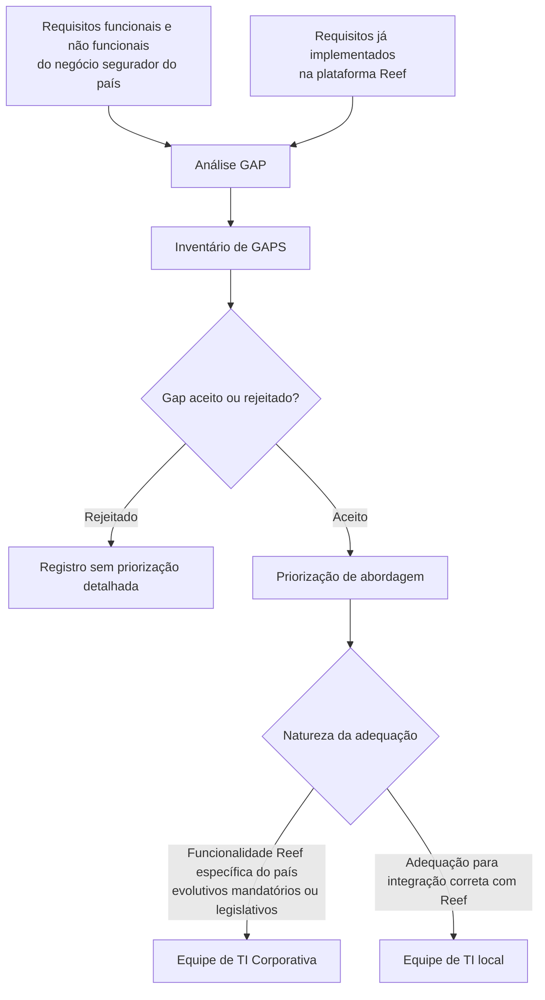

# Análise GAP de Requisitos Funcionais e Não Funcionais para a Plataforma Reef

## 1. Metadados do Documento
- **Arquivo de Origem:** `Não identificado no conteúdo fornecido`
- **Tipo de Documento:** `Procedimento`
- **Domínio / Sistema:** `Reef / negócio segurador`
- **Público-Alvo:** `Negócio, equipes de TI locais e equipes de TI Corporativas`
- **Data/Versão Identificada:** `Não identificada`

---

## 2. Resumo Executivo & Contexto de Negócio

O documento descreve a fase de **Gap Análisis** para comparar requisitos funcionais e não funcionais do negócio segurador de um país com os requisitos já implementados na plataforma Reef. O objetivo é identificar diferenças entre o ambiente de negócio local e as capacidades existentes em Reef.

A análise deve gerar um inventário de requisitos que não existam em Reef ou que sejam atendidos apenas parcialmente pela plataforma. Cada item do inventário deve registrar a área ou processo de negócio, uma descrição funcional breve, uma possível solução em Reef, o grau de cobertura, a necessidade e o tipo de requisito.

Os gaps identificados serão submetidos a aceite ou rejeição. Os gaps aceitos deverão ser priorizados para definição da ordem de abordagem. O documento não detalha critérios de priorização, responsáveis pela aprovação ou prazos para tratamento dos gaps.

Também existe uma divisão inicial de responsabilidades entre equipes de TI Corporativas e equipes de TI locais. A equipe Corporativa trata adequações e incorporações às funcionalidades de Reef relacionadas a características específicas do negócio do país, incluindo evolutivos mandatórios e legislativos. A equipe local trata adequações necessárias para a integração correta com Reef.

---

## 3. Arquitetura, Componentes & Tecnologias Envolvidas

Os componentes, contextos e equipes explicitamente citados são:

| Componente / Entidade | Papel identificado no documento |
| :--- | :--- |
| Reef | Plataforma cujas funcionalidades implementadas são comparadas com os requisitos do negócio segurador do país. |
| Negócio segurador do país | Fonte dos requisitos funcionais e não funcionais a serem analisados. |
| Inventário de GAPS | Registro dos requisitos ausentes ou parcialmente atendidos por Reef. |
| Equipe de TI Corporativa | Responsável por adequações e incorporações em Reef associadas a características específicas do negócio local, evolutivos mandatórios e requisitos legislativos. |
| Equipe de TI local | Responsável por adequações necessárias à integração correta com Reef. |
| Plantilla de inventario de GAPS | Modelo anexado para inventário, catalogação e acompanhamento dos gaps. |
| Home Solutions APIs Documentation Zeus | Termo listado no conteúdo bruto, sem explicação de função, integração ou relação operacional com Reef. |



**Nota de Análise:** O documento não apresenta arquitetura técnica de infraestrutura, protocolos, URLs, contratos de APIs, métodos HTTP, bancos de dados, linguagens, versões ou ambientes de implantação.

---

## 4. Regras de Negócio, Especificações Funcionais & Processos

### 4.1 Objetivo da Análise GAP

A análise deve:

1. Levantar requisitos funcionais e não funcionais do negócio segurador do país.
2. Comparar os requisitos levantados com requisitos já implementados em Reef.
3. Criar um inventário das diferenças entre o negócio local e a plataforma Reef.
4. Identificar necessidades funcionais e não funcionais que precisam ser incorporadas à plataforma Reef.

### 4.2 Critérios para Inclusão no Inventário de GAPS

Um requisito deve ser inventariado quando:

- Não existir como funcionalidade em Reef; ou
- Existir parcialmente em Reef, atendendo somente parte da funcionalidade solicitada.

### 4.3 Informações Obrigatórias por Gap

O inventário de cada gap deve conter:

1. Área de negócio ou processo de negócio associado ao requisito.
2. Informação breve ou descrição da funcionalidade requerida.
3. Possível solução em Reef e o respectivo grau de cobertura.
4. Necessidade classificada como `must have`, `should have` ou `nice to have`.
5. Tipo de requisito classificado como `Mejora` ou `personalización`.

### 4.4 Aceite, Rejeição e Priorização

1. Os gaps identificados devem ser aceitos ou rejeitados.
2. Os gaps aceitos devem ser priorizados para definir sua abordagem.
3. O documento não define critérios, pesos, workflow de aprovação ou responsáveis pelo aceite, rejeição e priorização.

### 4.5 Distribuição Inicial de Responsabilidades de Desenvolvimento

| Equipe | Responsabilidade |
| :--- | :--- |
| Equipe de TI Corporativa | Desenvolver adequações e incorporações às funcionalidades oferecidas por Reef que sejam necessárias devido às características específicas do negócio do país. O documento cita como exemplos evolutivos mandatórios e requisitos legislativos. |
| Equipe de TI local | Desenvolver adequações necessárias para a correta integração com Reef. |

---

## 5. Tabelas de Parâmetros, Ambientes e Estruturas de Dados

| Item / Parâmetro | Descrição / Função | Tipo / Valores / Formato | Ambiente / Observações |
| :--- | :--- | :--- | :--- |
| Área de negócio / processo de negócio | Identifica a área ou processo ao qual o requisito pertence. | Texto descritivo. | Campo obrigatório do inventário de gaps. |
| Informação breve / descrição da funcionalidade | Registra a funcionalidade solicitada pelo negócio. | Texto descritivo. | Campo obrigatório do inventário de gaps. |
| Possível solução em Reef | Descreve a alternativa de solução na plataforma Reef. | Texto descritivo. | Deve ser registrada juntamente com o grau de cobertura. |
| Grau de cobertura do requisito | Indica o nível de atendimento de Reef à funcionalidade solicitada. | Não especificado. | O documento não define escala, percentual ou valores permitidos. |
| Necessidade | Classifica a importância do requisito. | `must have`; `should have`; `nice to have`. | Campo obrigatório do inventário de gaps. |
| Tipo de requisito | Classifica a natureza do gap. | `Mejora`; `personalización`. | Campo obrigatório do inventário de gaps. |
| Situação do gap | Resultado da avaliação do gap identificado. | Aceito ou rejeitado. | Critérios de decisão não especificados. |
| Priorização | Ordena a abordagem dos gaps aceitos. | Não especificado. | Aplica-se somente aos gaps aceitos. |
| Responsável pelo desenvolvimento | Define a equipe inicialmente responsável pela adequação. | Equipe de TI Corporativa ou equipe de TI local. | Depende da natureza da adequação. |
| Plantilla de inventario de GAPS | Modelo para inventário, catalogação e acompanhamento. | Anexo. | O conteúdo da plantilla não foi incluído no texto fornecido. |

---

## 6. Bateria de Perguntas & Respostas para RAG (FAQ Sintético)

### P1: Qual é o objetivo da fase de Gap Análisis no contexto da plataforma Reef?
**R:** A fase de Gap Análisis tem o objetivo de analisar os requisitos funcionais e não funcionais do negócio segurador de um país e compará-los com os requisitos já implementados na plataforma Reef. O resultado esperado é um inventário das diferenças entre ambos os ambientes.

### P2: Quando um requisito deve ser registrado no inventário de GAPS?
**R:** Um requisito deve ser registrado quando não existir em Reef ou quando Reef atender apenas parte da funcionalidade solicitada. O inventário deve representar tanto lacunas completas quanto coberturas parciais da plataforma.

### P3: Quais informações devem constar obrigatoriamente em cada item do inventário de GAPS?
**R:** Cada item deve conter a área ou processo de negócio, uma descrição breve da funcionalidade requerida, uma possível solução em Reef com o grau de cobertura, a classificação de necessidade e o tipo de requisito.

### P4: Quais valores de necessidade são previstos para catalogar um gap?
**R:** O documento prevê três classificações de necessidade: `must have`, `should have` e `nice to have`.

### P5: Quais tipos de requisito podem ser registrados no inventário de GAPS?
**R:** O documento define os tipos `Mejora` e `personalización` para classificar os requisitos inventariados.

### P6: O que acontece após a identificação dos gaps?
**R:** Os gaps identificados devem ser aceitos ou rejeitados. Os gaps aceitos devem passar por uma priorização de abordagem. O documento não detalha o processo decisório, os responsáveis ou os critérios de priorização.

### P7: Qual é a responsabilidade da equipe de TI Corporativa?
**R:** A equipe de TI Corporativa deve desenvolver adequações e incorporações às funcionalidades de Reef que sejam necessárias devido às características específicas do negócio do país. O documento menciona evolutivos mandatórios e requisitos legislativos como exemplos.

### P8: Qual é a responsabilidade da equipe de TI local?
**R:** A equipe de TI local deve desenvolver as adequações necessárias para assegurar a correta integração com Reef.

### P9: O documento define como medir o grau de cobertura de Reef para um requisito?
**R:** Não. O documento exige o registro do grau de cobertura do requisito pela possível solução em Reef, mas não define escala, percentual, níveis de cobertura ou critérios de medição.

### P10: O documento especifica APIs, URLs, contratos técnicos ou tecnologias utilizadas por Reef?
**R:** Não. O conteúdo fornecido não detalha métodos HTTP, contratos JSON, URLs, ambientes, infraestrutura, linguagens, bancos de dados ou tecnologias específicas da plataforma Reef.

---

## 7. Glossário de Termos, Siglas & Conceitos-Chave

- **GAP / GAPS:** Diferença identificada entre um requisito do negócio segurador do país e a funcionalidade existente na plataforma Reef.
- **Gap Análisis:** Fase de análise destinada a identificar, inventariar, avaliar e priorizar diferenças entre necessidades do negócio e capacidades de Reef.
- **Reef:** Plataforma comparada com os requisitos funcionais e não funcionais do negócio segurador do país.
- **Must have:** Classificação de necessidade prevista no inventário de gaps.
- **Should have:** Classificação de necessidade prevista no inventário de gaps.
- **Nice to have:** Classificação de necessidade prevista no inventário de gaps.
- **Mejora:** Tipo de requisito listado pelo documento.
- **Personalización:** Tipo de requisito listado pelo documento.
- **Evolutivos mandatórios:** Adequações ou incorporações necessárias em Reef, citadas como responsabilidade inicial da equipe de TI Corporativa.
- **Requisitos legislativos:** Adequações ou incorporações relacionadas à legislação, citadas como responsabilidade inicial da equipe de TI Corporativa.
- **TI:** Tecnologia da Informação.
- **Home Solutions APIs Documentation Zeus:** Termo presente no conteúdo original, sem definição adicional.

---

## 8. Notas Críticas, Riscos & Limitações

- O documento não apresenta critérios para aceitar ou rejeitar gaps.
- O documento não define método, escala ou indicadores para mensurar o grau de cobertura de um requisito por Reef.
- O documento não descreve critérios de priorização para os gaps aceitos.
- O documento não atribui responsáveis específicos pela aprovação, rejeição ou priorização dos gaps.
- A distribuição entre equipe de TI Corporativa e equipe de TI local é apresentada como inicial, usando a expressão “En principio”.
- O conteúdo da plantilla de inventário, catalogação e acompanhamento de GAPS não foi disponibilizado.
- Não há detalhamento técnico sobre integrações, APIs, contratos, ambientes, segurança, infraestrutura ou tecnologias utilizadas.
- **Nota de Análise:** O documento cita “Home Solutions APIs Documentation Zeus”, mas não explica sua relação com Reef, com o processo de Gap Análisis ou com as responsabilidades das equipes de TI.

---

## 9. Conteúdo Bruto Estruturado (Referência Fiel)

```text
--- [PÁGINA 1 DE 2] ---

ANÁLISIS GAP
INTRODUCCIÓN
El objetivo es llevar a cabo un análisis de requisitos funcionales / no funcionales del negocio
asegurador del país y compararlos con los requisitos ya implementados en Reef. Realizar un
inventario de diferencias entre ambos ambientes.
GAP ANÁLISIS
La fase de Gap Análisis es de suma importancia para detectar aquellas necesidades funcionales / no
funcionales que requieren ser incorporadas en la plataforma Reef.
Para ello, se realizará un inventario de requerimientos que, o bien no existen como tal en Reef, o
bien cumplen con parte de la funcionalidad solicitada. Dicho inventario deberá contener la siguiente
información:
Área de negocio/proceso de negocio del requerimiento
Información breve / descripción funcionalidad del requerimiento
Posible solución en Reef y grado de cobertura del requerimiento
Necesidad (must have / should have / nice to have)
Tipo requerimiento: Mejora / personalización
En base a este inventario, se aceptarán / rechazarán los gaps identificados. Sobre los gaps
aceptados, se realizará una priorización de abordaje de los mismos.
 /
 CF
Home Solutions APIs Documentation Zeus
EN


--- [PÁGINA 2 DE 2] ---

Por otra parte, se deberá identificar qué parte de los desarrollos se deberán abordar por los equipos
de TI locales y por los equipos de TI Corporativos.
En principio, el equipo Corporativo será el encargado de desarrollar todas aquellas adecuaciones y/o
incorporaciones a las funcionalidades que ofrece Reef que sean necesarias por las características
específicas del negocio del país (evolutivos mandatorios, legislativos, etc.). El equipo TI local será el
encargado de desarrollar aquellas adecuaciones necesarias para la correcta integración con Reef.
ANEXO
Se adjunto plantilla de inventario de GAPS, catalogación y seguimiento:
Lista de GAPS
```
