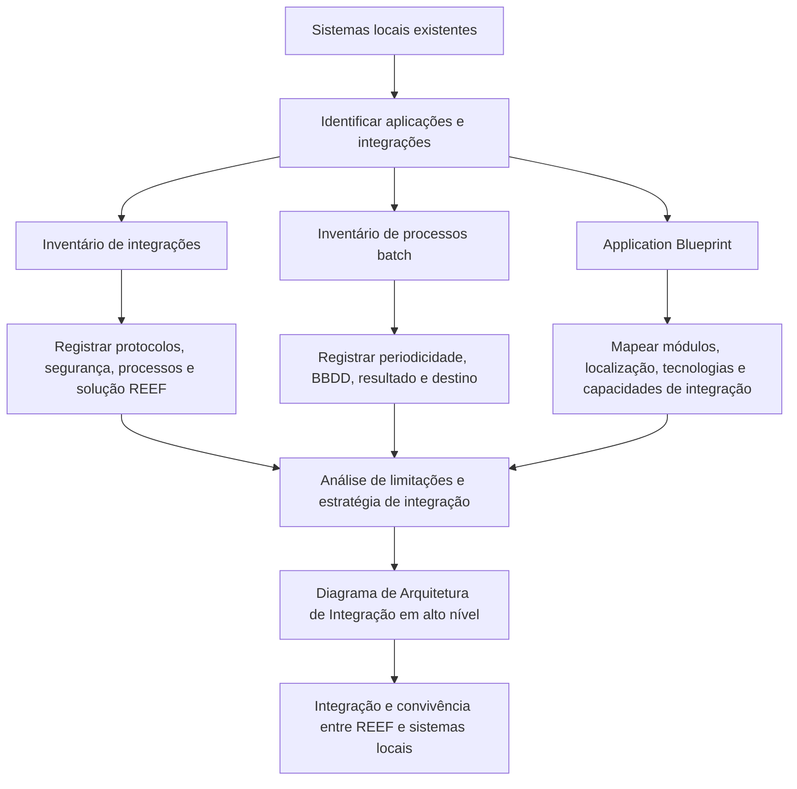
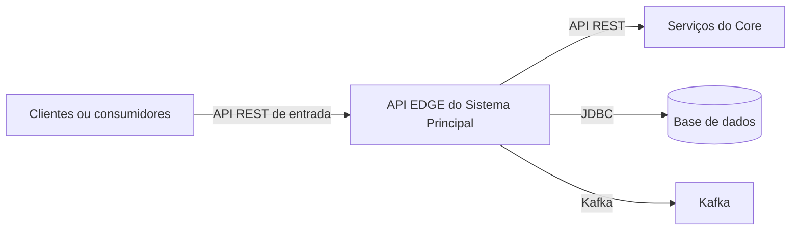

# Inventário de Integrações e Application Blueprint para Integração com REEF

## 1. Metadados do Documento
- **Arquivo de Origem:** Não identificado
- **Tipo de Documento:** Arquitetura de Software / Procedimento
- **Domínio / Sistema:** REEF e sistemas locais de gestão de seguros
- **Público-Alvo:** Arquitetos, desenvolvedores, analistas funcionais e equipes de integração
- **Data/Versão Identificada:** Não identificada

---

## 2. Resumo Executivo & Contexto de Negócio

O documento define um procedimento para identificar o mapa de aplicações e as integrações existentes entre sistemas locais de um país. O propósito é adequar, restabelecer e manter as integrações que devem continuar existindo durante a convivência do sistema REEF com o ecossistema local.

A abordagem prevê a criação de um inventário detalhado de integrações. Cada integração deve registrar as aplicações relacionadas, o produto suportado, o tipo de processamento, o sentido da comunicação, o tipo de relação técnica, o processo de negócio suportado e a solução REEF correspondente — incluindo a identificação explícita das capacidades que precisam ser construídas quando não existirem no REEF.

O documento também estabelece a elaboração de um *Application Blueprint*: um diagrama de alto nível da arquitetura atual, acompanhado de informações detalhadas para cada módulo ou aplicação. O levantamento deve cobrir localização, arquitetura, tecnologias, funcionalidades, capacidades de integração, protocolos de comunicação, mecanismos de segurança, estratégia de integração e possível substituição por solução REEF.

A compreensão das capacidades de integração é apontada como especialmente importante. Esse levantamento permite antecipar limitações técnicas na integração entre o sistema atual e o REEF, incluindo protocolos disponíveis, canais de entrada e saída, autenticação e segurança.

Por fim, o documento solicita um diagrama de Arquitetura de Integração em alto nível para representar como processos e sistemas se conectarão e interagirão com o REEF. Uma planilha ou modelo denominado **Inventario Integraciones** é anexado para catalogação e acompanhamento.

---

## 3. Arquitetura, Componentes & Tecnologias Envolvidas

### Componentes e conceitos identificados

| Componente / Conceito | Papel descrito no documento |
| :--- | :--- |
| REEF | Sistema de destino da estratégia de integração; deve coexistir com sistemas locais e, quando aplicável, substituir módulos existentes. |
| Sistemas locais | Aplicações existentes no país que devem ser mapeadas, avaliadas e integradas ou mantidas durante a convivência com REEF. |
| Sistema principal de gestão de seguros | Sistema central citado no exemplo de Blueprint; é composto por múltiplos componentes e recebe integrações de aplicações ao redor. |
| API EDGE do Sistema Principal | Exemplo de API REST que atua como camada de abstração e fornece uma interface unificada e controlada para acessar serviços do Core do sistema principal de gestão de seguros. |
| Core | Serviços do sistema principal de gestão de seguros acessados pela API EDGE. O documento não detalha contratos, endpoints ou métodos HTTP do Core. |
| Aplicações cliente | Agrupamento de componentes apresentado no exemplo de Blueprint. |
| Aplicações satélite | Agrupamento de componentes apresentado no exemplo de Blueprint. |
| Processos de suporte | Agrupamento de componentes apresentado no exemplo de Blueprint. |
| Gestão econômica | Agrupamento de componentes apresentado no exemplo de Blueprint. |
| Processos batch | Processos cuja execução deve ser inventariada com processo suportado, periodicidade, banco de dados, resultado e destino. |
| Inventario Integraciones | Modelo anexo destinado à catalogação e ao acompanhamento das integrações. |

### Tecnologias, protocolos e mecanismos citados

| Categoria | Itens citados |
| :--- | :--- |
| Arquitetura e tecnologias do exemplo API EDGE | GAIA, Spring, Java |
| Protocolos de integração | API REST, SOAP, JDBC, Apache Kafka, outros |
| Entrada do exemplo API EDGE | API REST |
| Saída do exemplo API EDGE | API REST, JDBC, Kafka |
| Protocolos de segurança e autenticação | HTTPS, LDAP, OAuth, SAML |
| Tipos de relação de integração | Frontal, ETL, web service |
| Tipos de processamento | On-line e batch |
| Sentido de integração | Unidirecional e bidirecional |

### Fluxo conceitual de levantamento e estratégia de integração



### Fluxo do exemplo API EDGE



> **Nota de Análise:** O fluxo da API EDGE é apresentado como exemplo. O documento não especifica endpoints, métodos HTTP, formatos JSON, tópicos Kafka, esquemas de base de dados ou contratos de serviço.

---

## 4. Regras de Negócio, Especificações Funcionais & Processos

### 4.1 Identificação de integrações existentes

O mapa de aplicações existente no país deve ser analisado para identificar e relacionar todas as integrações entre aplicações. Para cada integração, devem ser registrados os seguintes elementos:

1. Aplicação de origem e aplicação com a qual se relaciona.
2. Produto específico suportado pela aplicação.
3. Tipo de processamento: **on-line** ou **batch**.
4. Sentido da integração: **unidirecional** ou **bidirecional**.
5. Tipo de relação técnica, como frontal, ETL ou web service.
6. Processo suportado pela integração.
7. Solução em REEF: informar se a solução já existe; caso não exista, informar o que deve ser construído.

### 4.2 Inventário de processos batch

Deve ser realizado um inventário específico dos processos batch. Para cada processo batch, devem ser especificados:

1. Processo suportado.
2. Periodicidade de execução.
3. Base de dados utilizada.
4. Resultado produzido.
5. Destino do resultado.

### 4.3 Elaboração do Application Blueprint

Deve ser produzido um diagrama de todos os componentes do sistema atual, reunindo as informações disponíveis sobre esses componentes. O diagrama de arquitetura deve representar, em alto nível:

- As peças que compõem o sistema.
- A organização das peças.
- A estrutura do sistema vigente.
- O funcionamento geral do sistema vigente.

Cada módulo deve possuir uma descrição complementar, contendo os atributos definidos na seção de parâmetros deste documento.

### 4.4 Levantamento de capacidades de integração

As capacidades de integração de cada aplicação devem ser levantadas tanto para protocolos atualmente utilizados quanto para protocolos que a aplicação poderia usar potencialmente. O levantamento deve identificar se os protocolos são utilizados para entrada, saída ou ambos.

O documento destaca que esse levantamento é especialmente importante para identificar limitações que possam impactar a integração entre o sistema atual e o REEF nas etapas posteriores.

### 4.5 Estratégia de integração com REEF

Após examinar processos e sistemas que precisam se integrar ao REEF, a estratégia deve:

1. Compreender como os processos e sistemas funcionam.
2. Compreender como processos e sistemas interagem entre si.
3. Consolidar os detalhes no inventário de integrações.
4. Registrar protocolos utilizados, medidas de segurança e demais aspectos relevantes.
5. Criar um diagrama de Arquitetura de Integração em alto nível.
6. Detalhar uma estratégia específica de integração para cada bloco ou componente.

### 4.6 Exemplo funcional: API EDGE do Sistema Principal

A API EDGE do Sistema Principal é descrita como uma API REST que atua como camada de abstração do sistema. A API EDGE fornece uma interface unificada e controlada para acesso aos serviços do Core e gerencia solicitações direcionadas ao sistema principal de gestão de seguros.

> **Nota de Análise:** O documento fornece atributos de exemplo para a API EDGE, mas não informa a estratégia de integração, a solução REEF correspondente, o link de documentação existente ou observações técnicas adicionais.

---

## 5. Tabelas de Parâmetros, Ambientes e Estruturas de Dados

### 5.1 Campos obrigatórios do inventário de integrações

| Item / Parâmetro | Descrição / Função | Tipo / Valores / Formato | Ambiente / Observações |
| :--- | :--- | :--- | :--- |
| Aplicação relacionada | Identifica as aplicações que se relacionam por meio da integração. | Nome das aplicações | Deve indicar aplicação e aplicação com a qual se relaciona. |
| Produto específico | Produto suportado pela aplicação. | Descrição textual | Associado à aplicação ou integração identificada. |
| Processamento | Classifica o modo de processamento da integração. | On-line ou batch | Obrigatório no inventário. |
| Sentido da integração | Define a direção da troca de informações. | Unidirecional ou bidirecional | Obrigatório no inventário. |
| Tipo de relação | Define a natureza técnica da relação. | Frontal, ETL, web service ou outro | O documento cita exemplos, sem limitar a lista. |
| Processo suportado | Identifica o processo atendido pela integração. | Descrição textual | Obrigatório no inventário. |
| Solução REEF | Informa a solução REEF associada à integração. | Solução existente ou item a construir | Quando não houver solução REEF existente, deve ser informado o que precisa ser construído. |

### 5.2 Campos obrigatórios do inventário de processos batch

| Item / Parâmetro | Descrição / Função | Tipo / Valores / Formato | Ambiente / Observações |
| :--- | :--- | :--- | :--- |
| Processo suportado | Processo atendido pelo job batch. | Descrição textual | Obrigatório. |
| Periodicidade de execução | Frequência de execução do processo batch. | Não especificado | O documento exige o registro, mas não define valores permitidos. |
| BBDD | Base de dados relacionada ao processo batch. | Não especificado | O documento utiliza o termo “bbdd”. |
| Resultado | Saída ou resultado gerado pelo processo batch. | Não especificado | Obrigatório no inventário. |
| Destino | Destino do resultado do processo batch. | Não especificado | Obrigatório no inventário. |

### 5.3 Informações obrigatórias por módulo do Application Blueprint

| Item / Parâmetro | Descrição / Função | Tipo / Valores / Formato | Ambiente / Observações |
| :--- | :--- | :--- | :--- |
| Nome | Nome do módulo ou aplicação. | Texto | Obrigatório. |
| Grupo | Agrupação na qual a aplicação foi incluída. | Texto | Obrigatório. |
| Subgrupo | Agrupação dentro do grupo, quando aplicável. | Texto ou N/A | Opcional quando não aplicável. |
| Localização | Indica se a aplicação é interna ou externa e onde está hospedada. | Interna ou externa; datacenter ou cloud | Deve registrar datacenter ou cloud quando disponível. |
| Arquitetura e tecnologias | Descreve a arquitetura de camadas, linguagens e frameworks. | Texto | Deve incluir tecnologias utilizadas. |
| Capacidades de integração | Registra protocolos atuais e protocolos potencialmente suportados. | Protocolos de integração | Deve contemplar capacidades atuais e potenciais. |
| Protocolos de integração | Define protocolos utilizados e o sentido de uso. | API REST, SOAP, JDBC, Apache Kafka, outros; entrada/saída | Deve informar entrada e saída. |
| Protocolos de segurança e autenticação | Registra mecanismos de segurança e autenticação. | HTTPS, LDAP, OAuth, SAML | O documento não restringe a lista a esses exemplos. |
| Descrição da funcionalidade | Resume características e funções oferecidas pelo módulo. | Texto | Deve indicar se é aplicação web, API, módulo ou outro tipo. |
| Enlace a documentação existente | Referência para documentação já disponível. | URL ou referência documental | Não preenchido no exemplo API EDGE. |
| Observações | Informações relevantes sobre o componente. | Texto | Campo livre para aspectos importantes. |
| Estratégia de integração | Define se o módulo será mantido na futura integração com REEF. | Texto | Obrigatório no Blueprint. |
| Solução REEF | Solução REEF que substitui o módulo. | Texto | Obrigatório no Blueprint. |

### 5.4 Exemplo de registro: API EDGE do Sistema Principal

| Item / Parâmetro | Descrição / Função | Tipo / Valores / Formato | Ambiente / Observações |
| :--- | :--- | :--- | :--- |
| Nome | API EDGE do Sistema Principal | Nome do componente | Exemplo fornecido pelo documento. |
| Grupo | Sistema principal | Grupo | — |
| Subgrupo | N/A | Subgrupo | Não aplicável no exemplo. |
| Localização | Aplicação interna | Localização | Não há datacenter ou cloud informado. |
| Arquitetura e tecnologias | GAIA, Spring, Java | Tecnologias | Não há detalhamento de versões. |
| Protocolo de entrada | API REST | Entrada | — |
| Protocolos de saída | API REST, JDBC, Kafka | Saída | O texto menciona “Kafka”; a lista geral cita “Apache Kafka”. |
| Segurança e autenticação | HTTPS, LDAP, OAuth, SAML | Protocolos | — |
| Funcionalidade | Camada de abstração com interface unificada e controlada para acesso aos serviços do Core. | API REST | Gerencia solicitações ao sistema principal de gestão de seguros. |
| Enlace a documentação existente | Não informado | — | Campo listado, sem valor no exemplo. |
| Observações | Não informado | — | Campo listado, sem valor no exemplo. |
| Estratégia de integração | Não informada | — | Campo listado, sem valor no exemplo. |
| Solução REEF | Não informada | — | Campo listado, sem valor no exemplo. |

---

## 6. Bateria de Perguntas & Respostas para RAG (FAQ Sintético)

### P1: Qual é o objetivo do levantamento de integrações para REEF?
**R:** O objetivo é identificar o mapa de aplicações e todas as integrações existentes entre os sistemas locais, para adequar e restabelecer as integrações que precisam permanecer durante a convivência entre REEF e os demais sistemas locais.

### P2: Quais informações devem ser registradas para cada integração?
**R:** Cada integração deve registrar as aplicações relacionadas, o produto específico suportado, o tipo de processamento — on-line ou batch —, o sentido da integração — unidirecional ou bidirecional —, o tipo de relação técnica, o processo suportado e a solução REEF existente ou necessária.

### P3: O que deve ser feito quando não existir uma solução REEF para uma integração?
**R:** O inventário deve indicar que não existe solução REEF para a integração e registrar o que deve ser construído para atender a necessidade identificada.

### P4: Quais dados devem constar no inventário de processos batch?
**R:** O inventário de processos batch deve especificar o processo suportado, a periodicidade de execução, a base de dados, o resultado produzido e o destino desse resultado.

### P5: Qual é a finalidade do Application Blueprint?
**R:** O Application Blueprint deve apresentar um diagrama de alto nível dos componentes do sistema atual, mostrando suas peças, organização, estrutura e funcionamento geral. Cada componente deve ser complementado por uma descrição detalhada de arquitetura, tecnologias, integração, segurança, funcionalidade e estratégia relacionada ao REEF.

### P6: Quais protocolos de integração devem ser avaliados para cada aplicação?
**R:** O documento cita API REST, SOAP, JDBC, Apache Kafka e outros protocolos. A avaliação deve cobrir protocolos já utilizados pela aplicação e protocolos que a aplicação potencialmente suporta, identificando se são usados para entrada, saída ou ambos.

### P7: Por que as capacidades de integração das aplicações são importantes?
**R:** As capacidades de integração são importantes porque permitem identificar limitações técnicas que poderão impactar a integração do sistema atual com REEF nas etapas posteriores do trabalho.

### P8: Quais mecanismos de segurança e autenticação são citados no documento?
**R:** O documento cita HTTPS, LDAP, OAuth e SAML como protocolos ou mecanismos de segurança e autenticação a serem registrados para os módulos e aplicações.

### P9: Qual é a função da API EDGE apresentada como exemplo?
**R:** A API EDGE do Sistema Principal é uma API REST que funciona como camada de abstração. Ela oferece uma interface unificada e controlada para acessar os serviços do Core e gerencia solicitações ao sistema principal de gestão de seguros.

### P10: Quais tecnologias são citadas para a API EDGE do Sistema Principal?
**R:** O exemplo informa as tecnologias GAIA, Spring e Java. O documento não fornece versões, configurações de implantação ou detalhes adicionais sobre essas tecnologias.

### P11: Quais protocolos de entrada e saída são indicados para a API EDGE?
**R:** A API EDGE recebe chamadas por API REST. Para saída, o exemplo informa API REST, JDBC e Kafka.

### P12: O que deve representar o Diagrama de Arquitetura de Integração?
**R:** O Diagrama de Arquitetura de Integração deve representar, em alto nível, como os diferentes processos e sistemas se conectarão e interagirão com REEF.

### P13: O que significa a estratégia de integração de um módulo?
**R:** A estratégia de integração deve indicar se o módulo será mantido na futura integração com REEF. Também deve ser informada a solução REEF que substitui o módulo quando houver substituição prevista.

---

## 7. Glossário de Termos, Siglas & Conceitos-Chave

- **API:** Interface de programação utilizada para expor ou consumir serviços. O documento cita API REST e apresenta a API EDGE como exemplo.
- **API EDGE:** Componente de exemplo denominado “API EDGE do Sistema Principal”, descrito como camada de abstração e interface controlada para acesso aos serviços do Core.
- **API REST:** Protocolo ou estilo de integração citado como opção de entrada e saída.
- **Apache Kafka / Kafka:** Tecnologia ou protocolo de integração citado para troca de informações. O documento não detalha tópicos, produtores, consumidores ou configurações.
- **Application Blueprint:** Diagrama e descrição detalhada dos componentes do sistema atual, sua organização, arquitetura, tecnologias, integração e estratégia futura com REEF.
- **Batch:** Tipo de processamento executado de forma não on-line. Deve ser inventariado com periodicidade, BBDD, resultado e destino.
- **BBDD:** Termo usado no documento para base de dados.
- **Core:** Serviços do sistema principal de gestão de seguros acessados pela API EDGE no exemplo.
- **ETL:** Tipo de relação de integração citado no documento. O texto não apresenta expansão ou detalhamento operacional da sigla.
- **Frontal:** Tipo de relação de integração citado no documento, sem detalhamento adicional.
- **GAIA:** Tecnologia citada na arquitetura do exemplo API EDGE. O documento não explica seu significado ou função.
- **HTTPS:** Protocolo de segurança citado para segurança e autenticação.
- **JDBC:** Protocolo ou tecnologia de integração citado, incluindo como saída da API EDGE.
- **LDAP:** Protocolo citado para segurança e autenticação.
- **OAuth:** Protocolo ou mecanismo citado para segurança e autenticação.
- **On-line:** Tipo de processamento realizado em tempo de interação, em contraste com processamento batch.
- **REEF:** Sistema de destino da estratégia de integração, que deve coexistir com sistemas locais e pode substituir módulos existentes.
- **SAML:** Protocolo citado para segurança e autenticação.
- **SOAP:** Protocolo de integração citado como capacidade a ser levantada.
- **Spring:** Framework ou tecnologia citada na arquitetura do exemplo API EDGE.
- **Web service:** Tipo de relação de integração citado no documento.

---

## 8. Notas Críticas, Riscos & Limitações

- O documento define o processo de levantamento e os campos de catalogação, mas não fornece o inventário efetivamente preenchido de aplicações, integrações ou processos batch.
- Não foram identificados URLs, nomes de ambientes, servidores, portas, credenciais, esquemas de base de dados ou parâmetros de infraestrutura.
- O exemplo da API EDGE informa tecnologias e protocolos, mas não detalha métodos HTTP, endpoints, contratos JSON, tópicos Kafka, tabelas, consultas JDBC ou mecanismos de tratamento de falhas.
- A estratégia de integração e a solução REEF do exemplo API EDGE estão listadas como campos, mas não possuem valores preenchidos.
- O documento solicita um diagrama de Arquitetura de Integração, porém o conteúdo bruto não contém o diagrama ilustrativo mencionado após “Ejemplo:”.
- O modelo **Inventario Integraciones** é mencionado como anexo, mas sua estrutura completa não foi disponibilizada no texto extraído.
- A expressão “BBDD” é utilizada para a base de dados dos processos batch, sem indicar produtos de banco de dados, conectividade ou responsabilidades operacionais.
- A capacidade de integração deve incluir protocolos atualmente usados e potencialmente suportados; isso pode exigir validação técnica com equipes responsáveis por cada sistema.

---

## 9. Conteúdo Bruto Estruturado (Referência Fiel)

```text
--- [PÁGINA 1 DE 5] ---

INTEGRACIONES
INTRODUCCIÓN
El objetivo es llevar a cabo la identificación del mapa de aplicaciones e integraciones existentes entre
las mismas, con el objeto de adecuar y reestablecer aquellas que definitivamente deben seguir
existiendo para la convivencia de Reef con el resto de sistemas locales.
INTEGRACIONES
Atendiendo al mapa de aplicaciones existente en el país, se deben identificar y relacionar todas y
cada una de las integraciones, especificando:
• Aplicación / aplicación con la que se relaciona
• Producto específico que soporta la aplicación
• Procesamiento (on line/batch)
• Sentido integración (unidireccional / bidireccional)
• Tipo de relación (frontal, ETL, web Service..)
• Proceso que soporta
• Solución en Reef (se indica si existe, de lo contrario se indica qué se debe construir)
Se realizará un inventario de los procesos batch especificando el proceso que soporta, periodicidad
de ejecución, bbdd, resultado y destino.
 / 
 CF
Home Solutions APIs Documentation Zeus
EN


--- [PÁGINA 2 DE 5] ---

Application Blueprint
Se elaborará un diagrama de todos los componentes del sistema actual, obteniendo toda información
de los mismos.
El diagrama de arquitectura del sistema actual mostrará una vista de alto nivel de las diferentes
piezas que componen el sistema y cómo están organizadas. El objetivo es brindar una visión general
de la estructura y funcionamiento del sistema vigente.
Para cada módulo del sistema se deberá recoger la siguiente información:
Nombre.
Grupo. Agrupación en la que hemos incluido la aplicación.
Subgrupo. Agrupación dentro del grupo si procede.
Localización. Si se trata de una aplicación interna o externa. En qué datacenter o cloud se
encuentra.
Arquitectura y tecnologías. Información sobre la arquitectura de capas y tecnologías utilizadas
como lenguaje de programación y frameworks.
Capacidades de Integración: Qué protocolos es capaz de utilizar la aplicación, tanto las que
utiliza actualmente como para las que está preparado y podría utilizar potencialmente.
Protocolos de integración: API REST, SOAP, JDBC, Apache Kafka, otros. Entrada / Salida
Protocolos de seguridad y autenticación: HTTPS, LDAP, OAuth, SAML.
Descripción de la funcionalidad. Principales características y funciones que ofrece la aplicación.
Si se trata de una aplicación web, un API, un módulo, …
Enlace a documentación existente.
Observaciones. Aquí se pueden indicar aquellos aspectos que consideremos importante indicar
con respecto al componente.
Estrategia de integración. Se indica si el módulo se mantendrá en la futura integración con REEF.
Solución REEF. Qué solución de REEF sustituye al módulo.
Es especialmente importante conocer las capacidades de integración de las aplicaciones para que en
los siguientes pasos se pueda saber las limitaciones que podemos tener a la hora de integrar el
sistema actual con REEF.


--- [PÁGINA 3 DE 5] ---

Ejemplo Blueprint
En el siguiente ejemplo podemos ver un diagrama en el que tenemos:
varios componentes que conforman el sistema principal de gestión de seguros del país (centro),
y alrededor distintas agrupaciones: Aplicaciones cliente, Aplicaciones satélite, Procesos de
soporte, Gestión económica, en las que se incluirían los distintos componentes que intervienen
en el sistema completo.
Acompañando este diagrama debemos incluir una descripción de cada uno de los componentes.
Se añade en el ejemplo la descripción de uno de los módulos.
Blueprint de aplicaciones
Detalle de las aplicaciones


--- [PÁGINA 4 DE 5] ---

Ejemplo API EDGE:
Nombre. API EDGE del Sistema Principal
Grupo. Sistema principal.
Subgrupo. N/A.
Localización. Aplicación interna.
Arquitectura y tecnologías. GAIA, Spring, Java.
Capacidades de Integración:
Protocolos de integración:
Entrada. API REST
Salida. API REST, JDBC, Kafka.
Protocolos de seguridad y autenticación: HTTPS, LDAP, OAuth, SAML.
Descripción de la funcionalidad. API REST que sirve como capa de abstracción del sistema.
Proporciona una interfaz unificada y controlada para acceder a los servicios del Core
gestionando las solicitudes al sistema principal de gestión de seguro.
Enlace a documentación existente.
Observaciones.
Estrategia de integración.
Solución REEF.
ESTRATEGIA DE INTEGRACIÓN CON REEF
Una vez examinados los diferentes procesos y sistemas que necesitan ser integrados con REEF, el
objetivo es entender cómo funcionan estos procesos y sistemas y cómo interactúan entre sí.
Basándonos en el análisis, se crea el inventario mencionado en el apartado anterior y que contiene
los detalles sobre cada integración. Esto permitirá tener a mano toda la información relevante sobre
los protocolos empleados, las medidas de seguridad aplicadas y otros aspectos cruciales para
entender cómo funcionan las integraciones.
Se elaborará el diagrama de Arquitectura de Integración a alto nivel. Este diagrama visualiza cómo
los diferentes procesos y sistemas se conectarán e interactuarán con REEF.
Ejemplo:


--- [PÁGINA 5 DE 5] ---

Para cada bloque o componente se detallará la estrategia espcífica de integración.
ANEXO
Se anexa plantilla para Inventario de Integraciones: catalogación y seguimiento:
Inventario Integraciones
```
