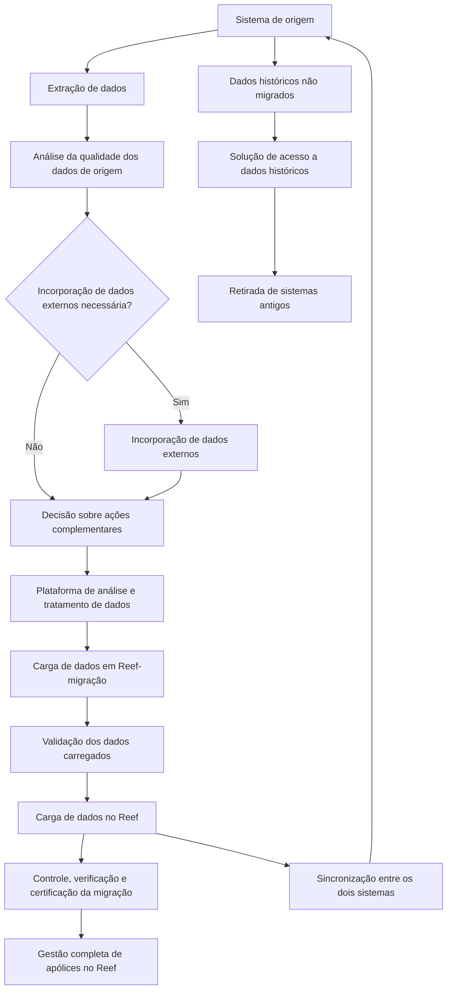

# Estratégia, Processo, Planejamento e Riscos de Migração de Dados para Reef

## 1. Metadados do Documento
- **Arquivo de Origem:** `Não identificado — conteúdo bruto fornecido na solicitação`
- **Tipo de Documento:** `Procedimento / Estratégia de Migração de Dados`
- **Domínio / Sistema:** `Reef — migração de dados, apólices e sinistros`
- **Público-Alvo:** `Arquitetos, equipes de TI, desenvolvedores, operação, responsáveis por dados e negócio`
- **Data/Versão Identificada:** `Não identificada`

---

## 2. Resumo Executivo & Contexto de Negócio

O documento define uma estratégia de migração de dados para o sistema Reef. A migração é caracterizada como o processo de seleção, preparação, extração, transformação e carga de dados apropriados, com a qualidade correta, no local e momento adequados. O escopo também inclui o descomissionamento de bases de dados e sistemas legados.

A estratégia deve garantir que os dados incorporados ao Reef atendam aos requisitos esperados de completude e qualidade. Além da migração de dados ativos, o documento exige uma solução de acesso aos dados históricos não migrados, especialmente para apólices anuladas, permitindo a retirada dos sistemas antigos com custo inferior ao das aplicações existentes e reduzindo problemas de obsolescência.

A continuidade do negócio no Reef é um requisito central. As apólices migradas devem ser gerenciadas integralmente no Reef, sem necessidade de utilização do sistema antigo. O documento também prevê suporte à tramitação de expedientes de sinistros de automóveis no Reef sem exigir a migração completa desses dados.

São apresentadas duas alternativas principais de estratégia: migração em carga única, ou *Big Bang*, e migração por ondas, ou *Run Off*. A primeira é indicada para dados que precisam estar disponíveis simultaneamente no novo sistema; a segunda está relacionada ao momento de renovação anual ou aniversário de apólices e é aplicável apenas a dados de apólices e suas operações.

O documento estabelece um processo de carga com extração, análise de qualidade, eventual incorporação de dados externos, complementação de dados, carga em Reef-migração, validação, carga final no Reef e atividades de controle, verificação e certificação. Também identifica riscos relevantes, como perda de dados, interrupção de serviço, incompatibilidades, desvios de prazo e orçamento, resistência à mudança, vulnerabilidades de segurança e perda de funcionalidades.

---

## 3. Arquitetura, Componentes & Tecnologias Envolvidas

Os componentes e contextos explicitamente citados são:

| Componente / Entidade | Papel no processo de migração |
| :--- | :--- |
| **Reef** | Sistema de destino para dados, apólices e operações migradas. |
| **Reef-migração** | Ambiente ou etapa intermediária de carga de dados antes da carga final no Reef. |
| **Sistema de origem** | Sistema que contém os dados a serem extraídos e analisados. |
| **Sistema antigo / legado** | Sistema a ser retirado após a migração e após a disponibilização de acesso aos dados históricos não migrados. |
| **Plataforma de análise de dados** | Plataforma para análise, estatísticas, relatórios, incorporação de dados externos e tratamento de dados entre extração e incorporação no Reef. |
| **Plataforma de migração de dados** | Plataforma prevista para suportar a migração, a atualização de dados e a carga final. |
| **Solução de tratamento de sinistros** | Solução prevista no planejamento para viabilizar o tratamento de sinistros. |
| **Dados históricos** | Dados não necessariamente migrados, que exigem definição de retenção legal, cópias de segurança, formato, período de retenção, acesso e perfis de acesso. |
| **Apólices** | Dados principais sujeitos a migração e gestão integral no Reef. |
| **Sinistros de automóveis** | Expedientes que devem poder ser tratados no Reef sem exigir migração completa. |
| **Dados externos** | Informações que podem ser incorporadas ao processo quando aplicável. |

> **Nota de Análise:** O documento não detalha tecnologias de implementação, bancos de dados, protocolos, APIs, formatos de arquivo, contratos de integração, métodos HTTP, URLs, servidores ou ferramentas específicas da plataforma de migração.



---

## 4. Regras de Negócio, Especificações Funcionais & Processos

### 4.1 Objetivo da migração de dados

A migração de dados deve contemplar:

1. Seleção dos dados apropriados.
2. Preparação dos dados.
3. Extração dos dados.
4. Transformação dos dados.
5. Carga dos dados.
6. Garantia de qualidade correta.
7. Garantia de destino correto.
8. Garantia do momento correto de carga.
9. Descomissionamento de bases de dados e sistemas legados.

### 4.2 Requisitos de migração para Reef

A estratégia de migração deve garantir a continuidade do negócio no Reef e deve:

1. Garantir que as apólices incorporadas ao Reef possuam dados completos e com a qualidade mínima necessária.
2. Facilitar a verificação da funcionalidade das apólices no Reef.
3. Fornecer solução de acesso a dados históricos não migrados referentes a apólices anuladas.
4. Permitir a retirada dos sistemas antigos com custo inferior ao das aplicações existentes.
5. Resolver problemas de obsolescência associados aos sistemas antigos.
6. Fornecer solução de nivelamento de dados entre os dois ambientes, denominada no documento como “sincronização de dados”.
7. Garantir que uma modificação de dados em um dos sistemas seja replicada no outro quando os dados existirem em ambos os sistemas.
8. Manter os dados iguais nos dois sistemas durante o cenário de coexistência.
9. Permitir que apólices já migradas sejam gerenciadas completamente no Reef, sem uso do sistema antigo.
10. Facilitar a tramitação de expedientes de sinistros de automóveis no Reef sem realizar a migração completa.

### 4.3 Estratégias de migração avaliadas

#### Migração em carga única — Big Bang

A migração em uma única carga é recomendada quando todos os dados devem estar disponíveis ao mesmo tempo no novo sistema. O documento indica esta modalidade como necessária para:

- Dados de parâmetros.
- Dados de configuração.
- Estruturas comerciais.
- Definição de produtos.
- Figuras intervenientes nas apólices:
  - Agentes.
  - Corretores.
  - Mediadores.
  - Equipes comerciais.
  - Outros intervenientes citados pelo documento como “etc.”.

#### Migração por ondas — Run Off

A migração por ondas ocorre:

- No momento da renovação anual das apólices; ou
- No aniversário da apólice, quando a apólice for plurianual ou não tiver renovação.

A migração por ondas é adequada apenas para:

- Dados de apólices.
- Operações associadas às apólices, incluindo:
  - Sinistros.
  - Subscrições.
  - Suplementos.
  - Outras operações indicadas pelo documento como “etc.”.

### 4.4 Processo de carga de dados

O processo de carga deve seguir os oito passos definidos:

1. **Extração de dados:** obtenção dos dados do sistema de origem.
2. **Análise da qualidade dos dados de origem:** avaliação da qualidade antes da carga.
3. **Incorporação de dados externos, se aplicável:** inclusão de informações externas quando necessária.
4. **Decisão sobre ações complementares:** decisão de atividades para complementar os dados quando aplicável.
5. **Carga dos dados em Reef-migração:** carga inicial em ambiente ou etapa de migração.
6. **Validação dos dados carregados:** validação dos dados inseridos em Reef-migração.
7. **Carga dos dados no Reef:** carga dos dados validados no sistema Reef.
8. **Controle, verificação e certificação da migração:** execução das atividades de confirmação e certificação da migração.

### 4.5 Capacidades requeridas da plataforma

A plataforma disponibilizada para o processo deve suportar:

- Análise de dados.
- Obtenção de estatísticas.
- Emissão de relatórios.
- Incorporação de informação externa.
- Tratamento dos dados desde a extração até a incorporação no Reef.

### 4.6 Atividades a realizar

As atividades identificadas no documento são:

1. Identificar os dados necessários no Reef.
2. Identificar características e validações a realizar sobre os dados.
3. Identificar conversões de códigos e campos entre os dois sistemas.
4. Identificar os dados históricos necessários.
5. Identificar o tempo mínimo de retenção legal dos dados históricos.
6. Definir a ferramenta para acesso aos dados históricos.
7. Avaliar a possível integração da ferramenta de acesso histórico com os sistemas atuais.
8. Definir os perfis de acesso necessários aos dados históricos.
9. Definir cópias de segurança dos dados históricos.
10. Definir o formato das cópias de segurança.
11. Definir o período de retenção das cópias de segurança.
12. Definir testes, verificações e validações dos dados migrados.
13. Estabelecer correspondência entre dados de origem e dados do Reef.
14. Analisar diferenças entre dados de origem e dados do Reef.
15. Analisar alternativas de solução para as diferenças identificadas.
16. Definir a plataforma de análise e manipulação de dados anterior à carga final no Reef.
17. Definir equipe e responsabilidades.
18. Definir relatórios necessários de qualidade dos dados.
19. Definir relatórios de avanço do processo de migração.
20. Estabelecer o orçamento do projeto de migração.
21. Estabelecer o orçamento da plataforma de migração de dados.
22. Planejar detalhadamente todas as atividades necessárias.

### 4.7 Atividades de planejamento citadas

O planejamento inclui:

1. Reunião de comunicação da iniciativa.
2. Reunião de arranque com a equipe de TI.
3. Implementação da plataforma local de análise.
4. Emissão dos primeiros relatórios de qualidade de dados do sistema de origem.
5. Implementação da plataforma de migração.
6. Implementação da solução de tratamento de sinistros.
7. Implementação da solução de atualização de dados na plataforma de migração.

---

## 5. Tabelas de Parâmetros, Ambientes e Estruturas de Dados

| Item / Parâmetro | Descrição / Função | Tipo / Valores / Formato | Ambiente / Observações |
| :--- | :--- | :--- | :--- |
| Sistema de origem | Fonte para extração e análise dos dados. | Não especificado. | Dados devem ser analisados quanto à qualidade antes da carga. |
| Reef-migração | Destino da primeira carga de dados. | Ambiente ou etapa de migração; detalhes não especificados. | Deve receber os dados antes da validação e da carga final no Reef. |
| Reef | Sistema de destino da migração. | Sistema corporativo; detalhes tecnológicos não especificados. | Deve permitir gestão completa de apólices migradas. |
| Sistema antigo | Sistema legado em coexistência ou em retirada. | Não especificado. | Deve ser retirado após solução de acesso a históricos e migração aplicável. |
| Dados de parâmetros | Dados que precisam estar disponíveis simultaneamente no novo sistema. | Dados de negócio/configuração. | Indicados para migração Big Bang. |
| Dados de configuração | Dados de configuração necessários no novo sistema. | Dados de configuração. | Indicados para migração Big Bang. |
| Estruturas comerciais | Estruturas comerciais do domínio de apólices. | Dados organizacionais/comerciais. | Indicadas para migração Big Bang. |
| Definição de produtos | Dados de definição de produtos. | Dados de produto. | Indicados para migração Big Bang. |
| Agentes | Figuras intervenientes nas apólices. | Cadastro de intervenientes. | Indicados para migração Big Bang. |
| Corretores | Figuras intervenientes nas apólices. | Cadastro de intervenientes. | Indicados para migração Big Bang. |
| Mediadores | Figuras intervenientes nas apólices. | Cadastro de intervenientes. | Indicados para migração Big Bang. |
| Equipes comerciais | Figuras ou estruturas intervenientes nas apólices. | Cadastro/estrutura comercial. | Indicadas para migração Big Bang. |
| Dados de apólices | Dados relacionados a apólices. | Dados de negócio. | Adequados à migração por ondas. |
| Sinistros | Operações relacionadas às apólices. | Operação de negócio. | Adequados à migração por ondas; sinistros de automóveis podem ser tratados no Reef sem migração completa. |
| Subscrições | Operações relacionadas às apólices. | Operação de negócio. | Adequadas à migração por ondas. |
| Suplementos | Operações relacionadas às apólices. | Operação de negócio. | Adequados à migração por ondas. |
| Dados históricos não migrados | Dados que permanecerão fora da carga principal. | Não especificado. | Exigem acesso, retenção legal, backup, formato, período de retenção e perfis de acesso. |
| Dados históricos de apólices anuladas | Dados históricos explicitamente mencionados. | Não especificado. | Devem permanecer acessíveis por solução específica. |
| Dados externos | Informações complementares ao processo de migração. | Não especificado. | Devem ser incorporados somente se aplicável. |
| Sincronização de dados | Nivelamento entre os dois ambientes. | Replicação de modificações entre sistemas. | Quando dados existirem nos dois sistemas, alterações em um devem ser replicadas no outro. |
| Conversões de códigos e campos | Mapeamentos entre o sistema de origem e Reef. | Regras de correspondência. | Devem ser identificadas antes da carga final. |
| Relatórios de qualidade | Relatórios sobre qualidade dos dados. | Relatório; formato não especificado. | Devem ser definidos e emitidos, incluindo primeiros relatórios do sistema de origem. |
| Relatórios de avanço | Relatórios sobre progresso do processo de migração. | Relatório; formato não especificado. | Devem ser definidos como atividade do projeto. |
| Cópias de segurança históricas | Backups de dados históricos. | Formato e período de retenção a definir. | Devem ser definidos para dados históricos. |
| Perfis de acesso | Perfis necessários para acesso aos dados históricos. | Controle de acesso; detalhes não especificados. | Devem ser identificados durante o planejamento. |
| Orçamento do projeto | Recursos financeiros para o projeto de migração. | Valor não informado. | Deve ser estabelecido. |
| Orçamento da plataforma | Recursos financeiros para a plataforma de migração. | Valor não informado. | Deve ser estabelecido separadamente. |

---

## 6. Bateria de Perguntas & Respostas para RAG (FAQ Sintético)

### P1: Qual é o objetivo principal da estratégia de migração para Reef?
**R:** A estratégia busca selecionar, preparar, extrair, transformar e carregar dados apropriados no Reef, garantindo qualidade, completude, local e momento corretos. A estratégia também deve suportar o descomissionamento de bases de dados e sistemas legados, assegurar continuidade de negócio, permitir gestão integral das apólices migradas no Reef e disponibilizar acesso aos dados históricos não migrados.

### P2: Quais requisitos devem ser atendidos pelas apólices migradas para Reef?
**R:** As apólices incorporadas ao Reef devem conter dados completos e com a qualidade mínima necessária. A estratégia também deve facilitar a verificação da funcionalidade das apólices no Reef e permitir que apólices já migradas sejam administradas integralmente no Reef, sem necessidade de utilizar o sistema antigo.

### P3: Quando a estratégia Big Bang deve ser utilizada?
**R:** A migração em carga única, denominada Big Bang, é recomendada quando todos os dados precisam estar disponíveis ao mesmo tempo no novo sistema. O documento a indica para dados de parâmetros, configuração, estruturas comerciais, definição de produtos e figuras intervenientes nas apólices, como agentes, corretores, mediadores e equipes comerciais.

### P4: Quando a migração por ondas, ou Run Off, é aplicável?
**R:** A migração por ondas ocorre na renovação anual das apólices ou no aniversário de apólices plurianuais ou sem renovação. Essa estratégia é adequada apenas para dados de apólices e suas operações, incluindo sinistros, subscrições e suplementos.

### P5: Quais são as etapas do processo de carga de dados para Reef?
**R:** O processo possui oito etapas: extração de dados; análise de qualidade dos dados de origem; incorporação de dados externos quando aplicável; decisão de ações complementares para completar dados quando aplicável; carga em Reef-migração; validação dos dados carregados; carga no Reef; e processos de controle, verificação e certificação da migração.

### P6: Qual é a finalidade do ambiente ou etapa Reef-migração?
**R:** Reef-migração é o destino da quinta etapa do processo de carga. Os dados são carregados em Reef-migração, validados na etapa seguinte e, após validação, são carregados no Reef. O documento não fornece detalhes técnicos adicionais sobre a implementação de Reef-migração.

### P7: Como deve funcionar a sincronização de dados entre os dois sistemas?
**R:** O documento exige uma solução de nivelamento de dados entre os dois ambientes, denominada sincronização de dados. Quando existirem dados nos dois sistemas, qualquer modificação realizada em um deles deve ser replicada no outro, mantendo os dados iguais durante a coexistência dos sistemas.

### P8: Como os dados históricos não migrados devem ser tratados?
**R:** Os dados históricos não migrados, especialmente os relacionados a apólices anuladas, devem permanecer acessíveis por uma solução específica. Devem ser identificados os dados necessários, a retenção legal mínima, a ferramenta de acesso, a possível integração com sistemas atuais, os perfis de acesso, as cópias de segurança, o formato dos backups e o período de retenção.

### P9: A migração completa é necessária para tramitar sinistros de automóveis no Reef?
**R:** Não. Um dos requisitos da estratégia é facilitar a tramitação de expedientes de sinistros de automóveis no Reef sem realizar a migração completa.

### P10: Quais atividades devem ser executadas antes da carga final no Reef?
**R:** Antes da carga final, devem ser identificados os dados necessários, características e validações, conversões de códigos e campos, correspondência entre dados de origem e dados do Reef, diferenças e alternativas de solução. Também deve ser definida uma plataforma de análise e manipulação de dados antes da carga final no Reef, além de testes, verificações e validações dos dados migrados.

### P11: Quais capacidades a plataforma de migração deve fornecer?
**R:** A plataforma deve fornecer ferramentas para análise, obtenção de estatísticas, emissão de relatórios, incorporação de informação externa e tratamento dos dados desde sua extração até a incorporação no Reef.

### P12: Quais riscos operacionais são destacados no documento?
**R:** O documento destaca riscos de perda ou corrupção de dados, interrupção de serviço, problemas de compatibilidade, desvios de orçamento e prazo, falta de capacitação e resistência à mudança, vulnerabilidades de segurança e perda de funcionalidades dos sistemas antigos durante ou após a migração.

---

## 7. Glossário de Termos, Siglas & Conceitos-Chave

- **Reef:** Sistema de destino da migração de dados, apólices e operações mencionado no documento.
- **Reef-migração:** Ambiente ou etapa intermediária para carga e validação de dados antes da carga final no Reef.
- **Big Bang:** Modalidade de migração em uma única carga, recomendada quando todos os dados precisam estar disponíveis simultaneamente no novo sistema.
- **Run Off:** Modalidade de migração por ondas, realizada na renovação anual ou aniversário de apólices aplicáveis.
- **Migração de dados:** Processo de seleção, preparação, extração, transformação e carga de dados apropriados, incluindo descomissionamento de sistemas legados.
- **Sincronização de dados:** Solução de nivelamento entre dois ambientes para replicar alterações e manter os dados iguais.
- **Apólice:** Entidade de negócio mencionada como objeto de migração e gestão no Reef.
- **Apólice anulada:** Apólice cujos dados históricos não migrados devem permanecer acessíveis.
- **Sinistro:** Operação relacionada a apólices; o documento cita especificamente expedientes de sinistros de automóveis.
- **Subscrição:** Operação de apólice citada como adequada à migração por ondas.
- **Suplemento:** Operação de apólice citada como adequada à migração por ondas.
- **Dados históricos:** Dados que podem não ser migrados integralmente e que exigem política de acesso, retenção legal e backup.
- **Descomissionamento:** Retirada de bases de dados e sistemas legados.
- **Figuras intervenientes:** Participantes associados às apólices, como agentes, corretores, mediadores e equipes comerciais.

---

## 8. Notas Críticas, Riscos & Limitações

- O documento não identifica arquivo de origem, data, versão, autoria, responsáveis nominais, cronograma, orçamento ou métricas de sucesso.
- O documento cita Reef, Reef-migração, uma plataforma de análise e uma plataforma de migração, mas não detalha arquitetura tecnológica, tecnologias, integrações, interfaces, bancos de dados, contratos, servidores, URLs, mecanismos de autenticação ou ferramentas específicas.
- A sincronização de dados é um requisito relevante, mas o documento não especifica direção de replicação, frequência, tratamento de conflitos, modelo de consistência ou mecanismos de monitoramento.
- O acesso a dados históricos é requerido, mas não são definidos critérios de consulta, tecnologia de arquivamento, responsáveis pelo acesso ou política concreta de retenção.
- A migração por ondas é limitada aos dados de apólices e suas operações; dados de parâmetros, configuração, estruturas comerciais, produtos e intervenientes são indicados para Big Bang.
- Há risco explícito de perda ou corrupção de dados por erros no processo, incompatibilidades ou falhas de backup.
- Há risco explícito de interrupção de serviço e indisponibilidade que pode afetar a continuidade do negócio.
- Há risco explícito de incompatibilidades entre dependências de hardware, software e infraestrutura subjacente.
- Há risco explícito de desvios de orçamento e prazos devido à complexidade dos sistemas existentes, integrações, testes e ajustes.
- Há risco explícito de resistência à mudança e baixa adoção caso usuários e equipes não recebam capacitação adequada.
- Há risco explícito de vulnerabilidades de segurança, intrusões, filtramento de informação e perda de integridade durante a migração.
- Há risco explícito de perda de funcionalidades específicas dos sistemas antigos no sistema migrado.

---

## 9. Conteúdo Bruto Estruturado (Referência Fiel)

```text
--- [PÁGINA 1 DE 4] ---

MIGRACIÓN
INTRODUCCIÓN
La migración de datos es la selección, preparación, extracción, transformación y carga de los datos
apropiados, de la calidad correcta, al lugar correcto, en el momento correcto, así como el
decomisado de las bases de datos y sistemas heredados.
Por tanto, la estrategia de migración debe garantizar que los datos que se incorporen a Reef cumplen
con los requisitos esperados con completitud y calidad, así como dar accesibilidad a los datos
históricos.
REQUISITOS MIGRACIÓN
La estrategia de migración debe garantizar la continuidad del negocio en Reef.
Por ello, debe:
Garantizar que las pólizas incorporadas a Reef tienen los datos con la calidad mínima necesaria
y son completos.
Facilitar la verificación de la funcionalidad de las pólizas en Reef.
Proporcionar una solución para el acceso a los datos históricos no migrados correspondientes a
pólizas anuladas y que permita retirar los sistemas antiguos con un coste inferior a las
aplicaciones existentes y que además resuelva los problemas de obsolescencia.
Proporcionar una solución a la nivelación de datos entre los dos entornos (“sincronización de
datos”), de manera que cuando existen datos en los dos sistemas se garantice que una
 / 
 CF
Home Solutions APIs Documentation Zeus
EN


--- [PÁGINA 2 DE 4] ---

modificación de los datos en uno de ellos se replique en el otro, manteniéndolos iguales.
Permitir que las pólizas ya migradas a Reef se gestionen completamente en Reef, sin necesidad
de utilizar el sistema antiguo.
Facilitar la tramitación de expedientes de siniestros de autos en Reef, sin realizar la migración
completa.
ESTRATEGIA DE MIGRACIÓN
Para definir la estrategia de migración existen varias alternativas que se deben evaluar:
Migración en una sola carga (en “Big Bang”): opción recomendada cuando se deben disponer
de todos los datos a la vez en el sistema nuevo. Necesario para todos los datos de parámetros,
configuración, estructuras comerciales, definición de productos, figuras intervinientes en las
pólizas (agentes, corredores, mediadores, equipos comerciales, etc.)
Migración por oleadas (“Run Off”): esta migración se produce en el momento de renovación
anual de las pólizas, o en su aniversario, si es que son pólizas plurianuales o que no tienen
renovación. Este tipo de migración es adecuado solo para los datos de las pólizas y sus
operaciones (siniestros, suscripciones, suplementos, etc.).
PROCESO DE CARGA DE DATOS
El proceso de carga de los datos contendrá los siguientes pasos:
1. Extracción de datos.
2. Análisis de la calidad de los datos de origen.
3. Incorporación de datos externos, si procede.
4. Decisión de acciones complementarias a realizar para complementar datos, si procede.
5. Carga de los datos en Reef-migración.
6. Validación de los datos cargados.
7. Carga de los datos en Reef.
8. Procesos de control, verificación y certificación de la migración.
Para el análisis, obtención de estadísticas, informes, incorporación de información externa y
tratamiento de los datos desde su extracción hasta su incorporación a Reef se proporcionará una
plataforma que contará con las herramientas necesarias para estas tareas.
ACTIVIDADES A REALIZAR Y PLANIFICACIÓN
Acciones


--- [PÁGINA 3 DE 4] ---

Identificar qué datos son los necesarios en Reef y que características y validaciones se deben
realizar.
Identificar las conversiones de códigos y campos entre los dos sistemas.
Identificar que datos históricos son necesarios, el tiempo de retención legal mínimo y que
herramienta se va a utilizar para estos accesos, así como su posible integración con los sistemas
actuales y los perfiles de acceso necesarios.
Definir las copias de seguridad necesarias de los datos históricos, el formato de la copia y el
periodo de retención.
Definir las pruebas, chequeos y validaciones de los datos migrados.
Correspondencia entre los datos de origen y de Reef. Análisis de las diferencias y alternativas de
solución.
Definir la plataforma para el análisis y manipulación de datos previa a la carga final en Reef.
Definir el equipo y las responsabilidades.
Definir los informes necesarios de calidad de los datos
Definir los informes de avance del proceso de migración.
Establecer el presupuesto del proyecto de migración.
Establecer el presupuesto de la plataforma de migración de datos.
Planificar en detalle todas las actividades necesarias.
Planificación
Reunión de comunicación de la iniciativa
Reunión arranque con equipo de TI.
Implementar plataforma análisis local
Emisión primeros informes de calidad de datos del sistema origen
Implementación de la plataforma de migración.
Implementación solución tratamiento siniestros
Implementación solución actualización datos en plataforma de migración
RIESGOS
La migración de sistemas informáticos conlleva ciertos riesgos que pueden afectar el éxito y la
estabilidad de la operación de una organización.


--- [PÁGINA 4 DE 4] ---

Algunos de los riesgos comunes asociados con la migración de sistemas informáticos incluyen:
Pérdida de datos: Durante la migración, existe el riesgo de pérdida o corrupción de datos. Esto puede
ocurrir debido a errores en el proceso de migración, problemas de compatibilidad entre sistemas o
fallas en el respaldo adecuado de los datos.
Interrupción del servicio: Durante la migración, es posible que el servicio o sistema en proceso de
migración experimente interrupciones o tiempos de inactividad. Esto puede afectar la continuidad del
negocio y causar inconvenientes para los usuarios o clientes.
Problemas de compatibilidad: Los sistemas y aplicaciones pueden tener dependencias complejas, y
la migración puede exponer problemas de compatibilidad con hardware, software o infraestructura
subyacente. Esto puede llevar a errores, inestabilidad o funcionamiento incorrecto de los sistemas
migrados.
Desviación de presupuesto y plazos: Las migraciones de sistemas a menudo pueden requerir más
recursos, tiempo y esfuerzo de lo inicialmente previsto. Los riesgos de desviación de presupuesto y
plazos son comunes debido a la complejidad de los sistemas existentes, la integración con otros
sistemas y la necesidad de pruebas y ajustes exhaustivos.
Falta de capacitación y resistencia al cambio: Si los usuarios o el personal no están adecuadamente
capacitados en el nuevo sistema, pueden surgir dificultades y resistencia al cambio. Esto puede
afectar la adopción y el rendimiento del sistema migrado.
Vulnerabilidades de seguridad: Durante la migración, los sistemas pueden ser más susceptibles a
vulnerabilidades de seguridad, especialmente si se descuidan las medidas de seguridad durante el
proceso. Esto puede exponer los datos y sistemas a riesgos de intrusiones, filtración de información
o pérdida de integridad.
Pérdida de funcionalidades: Existe el riesgo de que algunas funcionalidades o características
específicas de los sistemas antiguos no se transfieran correctamente o no estén disponibles en los
sistemas migrados. Esto puede afectar la eficiencia y la productividad de los usuarios.
```
