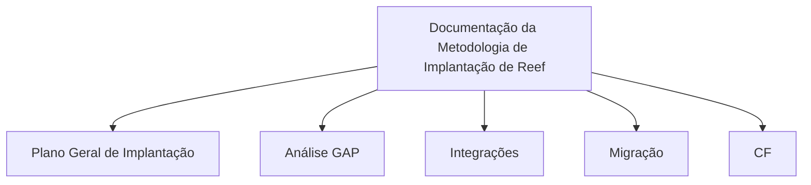

# Documentação da Metodologia de Implantação de Reef

## 1. Metadados do Documento
- **Arquivo de Origem:** `Não identificado`
- **Tipo de Documento:** `Documentação de metodologia de implantação`
- **Domínio / Sistema:** `Reef`
- **Público-Alvo:** `Não identificado`
- **Data/Versão Identificada:** `Não identificada`

---

## 2. Resumo Executivo & Contexto de Negócio

O trecho disponibilizado apresenta documentação sobre a metodologia de implantação de Reef. O conteúdo informa que a documentação está organizada por módulos, indicando uma estrutura de referência para conduzir ou consultar atividades de implantação.

Os módulos explicitamente listados são: Plano Geral de Implantação, Análise GAP, Integrações, Migração e CF. O documento não descreve objetivos operacionais, responsáveis, pré-requisitos, critérios de aceite, cronogramas ou procedimentos detalhados para esses módulos.

Também são apresentados os termos “Home Solutions APIs Documentation Zeus” e “EN”. O trecho não esclarece se esses termos representam sistemas, áreas funcionais, links, categorias de documentação, ambiente, idioma ou elementos de navegação.

> *Nota de Análise: O conteúdo fornecido contém somente uma visão resumida da estrutura documental da implantação de Reef. Não há detalhamento suficiente para identificar arquitetura técnica, contratos de integração, tecnologias, fluxos operacionais ou regras de negócio.*

---

## 3. Arquitetura, Componentes & Tecnologias Envolvidas

O trecho não apresenta uma arquitetura de software, componentes técnicos, microsserviços, tecnologias, ambientes, protocolos, APIs, URLs ou contratos de dados.

Os únicos elementos nomeados são Reef e os módulos documentais Plano Geral de Implantação, Análise GAP, Integrações, Migração e CF.



> *Nota de Análise: O diagrama representa exclusivamente a organização modular declarada no texto. Não representa uma arquitetura técnica ou fluxo de integração entre sistemas.*

---

## 4. Regras de Negócio, Especificações Funcionais & Processos

O documento estabelece que a metodologia de implantação de Reef é abordada em uma documentação organizada pelos seguintes módulos:

1. **Plano Geral de Implantação**
2. **Análise GAP**
3. **Integrações**
4. **Migração**
5. **CF**

Não foram identificadas regras de negócio, critérios de validação, fórmulas, condições de aprovação, sequências de execução, responsabilidades, SLAs, exceções ou restrições técnicas.

> *Nota de Análise: O trecho cita o módulo “Integrações”, mas não detalha sistemas envolvidos, métodos HTTP, APIs, protocolos, formatos de mensagem ou contratos de dados.*

> *Nota de Análise: O trecho cita o módulo “Migração”, mas não detalha origem, destino, regras de transformação, volumes, janelas operacionais ou mecanismos de reconciliação de dados.*

> *Nota de Análise: O significado de “CF” não é definido no conteúdo fornecido.*

---

## 5. Tabelas de Parâmetros, Ambientes e Estruturas de Dados

| Item / Parâmetro | Descrição / Função | Tipo / Valores / Formato | Ambiente / Observações |
| :--- | :--- | :--- | :--- |
| Reef | Sistema ou domínio associado à metodologia de implantação. | Nome próprio citado no documento. | Não há ambiente identificado. |
| Plano Geral de Implantação | Módulo listado como parte da organização da documentação. | Módulo documental. | Sem detalhamento adicional. |
| Análise GAP | Módulo listado como parte da organização da documentação. | Módulo documental. | Sem detalhamento adicional. |
| Integrações | Módulo listado como parte da organização da documentação. | Módulo documental. | Não há sistemas, APIs ou protocolos descritos. |
| Migração | Módulo listado como parte da organização da documentação. | Módulo documental. | Não há dados de origem, destino ou processo descritos. |
| CF | Módulo listado como parte da organização da documentação. | Sigla ou módulo não definido. | Significado não identificado. |
| Home Solutions APIs Documentation Zeus | Termos apresentados no trecho bruto. | Não identificado. | O relacionamento com Reef não é explicado. |
| EN | Termo apresentado no trecho bruto. | Não identificado. | Pode representar um marcador de idioma, mas o documento não confirma essa interpretação. |

---

## 6. Bateria de Perguntas & Respostas para RAG (FAQ Sintético)

### P1: Qual é o tema principal da documentação apresentada?
**R:** A documentação aborda a metodologia de implantação de Reef.

### P2: Quais módulos organizam a documentação da metodologia de implantação de Reef?
**R:** A documentação está organizada pelos módulos Plano Geral de Implantação, Análise GAP, Integrações, Migração e CF.

### P3: O documento detalha o conteúdo do módulo Plano Geral de Implantação?
**R:** Não. O trecho apenas lista Plano Geral de Implantação como um módulo da documentação, sem fornecer atividades, responsáveis, cronograma ou critérios de execução.

### P4: Quais integrações são descritas para Reef?
**R:** Nenhuma integração específica é descrita. O documento apenas menciona um módulo denominado “Integrações”.

### P5: O documento informa métodos HTTP, endpoints ou contratos JSON das integrações?
**R:** Não. Não há métodos HTTP, endpoints, URLs, protocolos, formatos de mensagem ou contratos JSON no conteúdo fornecido.

### P6: O que o documento informa sobre migração?
**R:** O documento lista “Migração” como um dos módulos da documentação de implantação de Reef, sem detalhar dados, sistemas de origem e destino, regras de transformação ou etapas operacionais.

### P7: Qual é o significado da sigla CF no documento?
**R:** O significado de CF não é definido no trecho disponibilizado. CF aparece somente como um módulo da documentação.

### P8: Há informações sobre ambientes de desenvolvimento, homologação ou produção?
**R:** Não. O documento não identifica ambientes, servidores, URLs, portas, credenciais ou configurações de implantação.

### P9: O documento apresenta uma arquitetura técnica do sistema Reef?
**R:** Não. O conteúdo fornecido descreve apenas a organização documental da metodologia de implantação e não apresenta componentes, tecnologias ou relacionamentos técnicos.

### P10: O que significam os termos Home Solutions APIs Documentation Zeus?
**R:** O trecho apresenta os termos “Home Solutions APIs Documentation Zeus”, mas não explica seu significado, função ou relação com Reef.

### P11: O documento identifica uma versão ou data da metodologia de implantação?
**R:** Não. Nenhuma data, versão, revisão ou histórico de alterações é identificado no conteúdo fornecido.

### P12: Existem regras de negócio ou critérios de validação documentados?
**R:** Não. O trecho não apresenta regras de negócio, critérios de validação, restrições ou condições de aprovação.

---

## 7. Glossário de Termos, Siglas & Conceitos-Chave

- **Reef:** Sistema ou domínio citado como objeto da metodologia de implantação.
- **Plano Geral de Implantação:** Módulo documental listado para a metodologia de implantação de Reef.
- **Análise GAP:** Módulo documental listado; o documento não define o significado ou método aplicado.
- **Integrações:** Módulo documental listado; não há detalhamento técnico de integrações.
- **Migração:** Módulo documental listado; não há detalhamento de movimentação ou transformação de dados.
- **CF:** Sigla ou módulo listado sem definição no conteúdo.
- **Home Solutions APIs Documentation Zeus:** Conjunto de termos citados sem definição contextual.
- **EN:** Termo citado sem definição contextual.

---

## 8. Notas Críticas, Riscos & Limitações

- O conteúdo fornecido é resumido e não contém detalhamento operacional dos módulos de implantação.
- Não há arquitetura técnica, diagramas originais, componentes, APIs, tecnologias, ambientes ou configurações de infraestrutura.
- Não há definição para a sigla **CF**.
- Não há explicação sobre “Home Solutions APIs Documentation Zeus” nem sobre “EN”.
- Não há informações sobre responsáveis, governança, cronograma, dependências, riscos, critérios de aceite ou planos de contingência.
- A ausência de detalhamento sobre integrações e migração impede a derivação de contratos técnicos ou procedimentos operacionais confiáveis.

---

## 9. Conteúdo Bruto Estruturado (Referência Fiel)

```text
--- [PÁGINA 1 DE 1] ---

DOCUMENTACIÓN
 En este apartado se aborda la metodología de Implantación de Reef.
La información está organizada por los siguientes módulos.
 PLAN GENERAL DE
IMPLANTACIÓN
 ANÁLISIS GAP
 INTEGRACIONES
  MIGRACIÓN
 / 
 CF
Home Solutions APIs Documentation Zeus
EN
```
