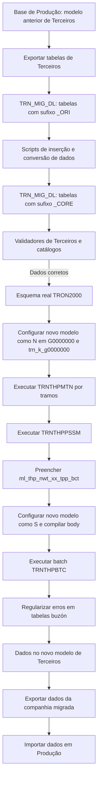

# SET UP REEF — Migração de Terceiros para REEF em Países que Utilizam TRON

## 1. Metadados do Documento
- **Arquivo de Origem:** Não identificado no conteúdo fornecido
- **Tipo de Documento:** Procedimento
- **Domínio / Sistema:** REEF, TRON, TRON2000, migração de modelo de dados de Terceiros
- **Público-Alvo:** Desenvolvedores, Arquitetos, Operação, Administração de Banco de Dados
- **Data/Versão Identificada:** Não identificada

---

## 2. Resumo Executivo & Contexto de Negócio

O documento descreve o procedimento de migração do modelo de dados de **Terceiros** para o modelo utilizado pelo **REEF**, no cenário em que o país já utiliza **TRON** e possui uma versão anterior do modelo de dados de Terceiros.

O REEF utiliza um novo modelo de dados de Terceiros, que incorpora funcionalidades como a **multiocorrência de contatos, endereços e meios de pagamento**. A migração é necessária para adequar os dados legados ao formato esperado pelo novo modelo.

O processo parte da extração de tabelas da base de produção, da importação dessas tabelas para o esquema técnico `TRN_MIG_DL` com o sufixo `_ORI` e da preparação de tabelas de destino vazias com o sufixo `_CORE`. Scripts de inserção transferem e adaptam os registros das tabelas `_ORI` para as tabelas `_CORE`.

A etapa de transformação inclui o preenchimento de novos campos obrigatórios com valores genéricos e a conversão de valores legados quando houver alteração de nomenclatura ou domínio, como a alteração de um tipo de documento de `ID` para `DNI`. Depois das validações contra catálogos, os dados são carregados no esquema real `TRON2000`.

A migração do modelo é concluída pela execução controlada das tarefas `TRNTHPMTN`, `TRNTHPPSSM` e do batch `TRNTHPBTC`, alternando a marca de novo modelo de dados de Terceiros entre `N` e `S` na tabela `G0000000` e no body do programa `trn_k_g0000000`. O resultado é exportado do ambiente de migração e importado em Produção.

---

## 3. Arquitetura, Componentes & Tecnologias Envolvidas

| Componente / Sistema | Papel no processo |
| :--- | :--- |
| REEF | Sistema que utiliza o novo modelo de dados de Terceiros. |
| TRON | Sistema existente no país antes da implantação ou migração para REEF. |
| TRON2000 | Esquema que recebe as tabelas reais carregadas após validação. |
| `TRN_MIG_DL` | Esquema técnico utilizado para importar dados de origem e preparar tabelas de conversão. |
| Tabelas `_ORI` | Tabelas importadas a partir da extração da base de produção; representam a origem da migração. |
| Tabelas `_CORE` | Tabelas vazias com a estrutura do núcleo de destino; recebem os dados convertidos e enriquecidos. |
| Validadores de Terceiros | Validam se os dados presentes nas tabelas `_CORE` possuem definições correspondentes nos catálogos. |
| `G0000000` | Tabela cuja marca de novo modelo de dados de Terceiros é configurada como `N` e posteriormente como `S`. |
| `trn_k_g0000000` | Programa cujo body deve receber a marca de novo modelo e ser compilado. |
| `ZZZZZZZZZZ_0_GENERA_BODY_TRN_K_G0000000` | Script usado para gerar e compilar somente o body de `trn_k_g0000000`. |
| `TRNTHPMTN` | Tarefa executada por tramos, com indicação `N` para não realizar mudança de ambiente. |
| `TRNTHPPSSM` | Segunda cadeia do processo, executada com os mesmos dados da tarefa anterior para preencher a tabela mestra de batch. |
| `ml_thp_nwt_xx_tpp_bct` | Tabela mestra do batch de Terceiros preenchida pela execução de `TRNTHPPSSM`. |
| `TRNTHPBTC` | Batch de Terceiros executado com a data de início de cada tramo processado anteriormente. |
| Tabelas buzón | Tabelas sujeitas a regularizações para correção de erros produzidos durante a execução do batch. |



**Nota de Análise:** O documento menciona REEF, TRON, TRON2000, tarefas e batches de migração, mas não detalha versões de banco de dados, tecnologias de execução, métodos de conexão, contratos de integração ou mecanismos específicos de rollback.

---

## 4. Regras de Negócio, Especificações Funcionais & Processos

### 4.1 Escopo da migração

A migração é aplicável quando:

1. O país em que REEF será instalado já utiliza TRON.
2. O país possui o modelo de dados de Terceiros anterior ao modelo utilizado por REEF.
3. É necessário converter os dados de Terceiros para suportar funcionalidades do novo modelo, incluindo multiocorrência de contatos, endereços e meios de pagamento.

### 4.2 Extração inicial de dados

Deve ser realizado um export da base de produção das tabelas de Terceiros listadas no documento. A extração ocorre na base de dados em que será realizado o traspaso ou conversão de modelo.

### 4.3 Importação para o esquema de migração

As tabelas extraídas devem ser importadas no esquema `TRN_MIG_DL`, com o sufixo `_ORI`.

A finalidade das tabelas `_ORI` é preservar os dados do modelo de origem para posterior transferência e conversão ao modelo de núcleo.

### 4.4 Preparação das tabelas de núcleo

Devem existir tabelas vazias, com sufixo `_CORE`, no esquema `TRN_MIG_DL`. Essas tabelas devem possuir a mesma estrutura esperada para as tabelas de destino.

### 4.5 Inserção, enriquecimento e conversão de dados

Devem ser executados scripts de inserção das tabelas `_ORI` para as tabelas `_CORE`.

Durante esse processo:

1. Novos campos obrigatórios devem ser preenchidos com valores genéricos.
2. Para campos do tipo `MARCA`, o documento apresenta `N` como valor padrão.
3. Conversões de dados legados devem ser realizadas nas tabelas `_CORE`.
4. Um exemplo apresentado é a alteração de um tipo documental anteriormente denominado `ID` para `DNI`.
5. A atualização de valores convertidos deve ocorrer na tabela `_CORE`, e não diretamente na tabela `_ORI`.

### 4.6 Validação de Terceiros

Após o preenchimento das tabelas `XXXX_CORE`, devem ser executados os validadores de Terceiros.

A finalidade dos validadores é verificar se todos os dados das tabelas `_CORE` possuem as definições correspondentes nos catálogos.

### 4.7 Carga no esquema TRON2000 e migração do modelo

Após validação bem-sucedida, os dados das tabelas `XXX_CORE` devem ser carregados nas tabelas reais do esquema `TRON2000`.

Em seguida, o processo de migração de modelo deve seguir esta sequência:

1. Configurar a marca de novo modelo de dados de Terceiros como `N`:
   - Na tabela `G0000000`.
   - No body do programa `trn_k_g0000000`.
   - Compilar somente o body utilizando o script `ZZZZZZZZZZ_0_GENERA_BODY_TRN_K_G0000000`.

2. Executar a tarefa `TRNTHPMTN` por tramos:
   - Informar `N` para indicar que não há alteração de ambiente.
   - Preencher os demais dados necessários para a companhia.

3. Executar a segunda cadeia do processo `TRNTHPPSSM`:
   - Utilizar os mesmos dados da tarefa anterior.
   - Preencher a tabela mestra do batch de Terceiros `ml_thp_nwt_xx_tpp_bct`.

4. Configurar a marca de novo modelo de dados de Terceiros como `S`:
   - Na tabela `G0000000`.
   - No body do programa `trn_k_g0000000`.
   - Compilar o body utilizando o mesmo script empregado na primeira etapa.

5. Executar o batch `TRNTHPBTC`:
   - Utilizar como data de processo a data de início de cada tramo das tarefas anteriores.
   - Realizar regularizações de dados nas tabelas buzón, quando necessário, para corrigir erros produzidos durante o processamento.

### 4.8 Exportação final e promoção para Produção

Após a execução do processo no ambiente de migração:

1. Os dados estarão gravados no formato do novo modelo de dados de Terceiros.
2. Deve ser realizado um export das tabelas indicadas para a companhia em migração.
3. Os dados exportados devem ser importados em Produção.

### 4.9 Regra condicional para países sem uso anterior de Newtron

Se o país não utilizava anteriormente **Newtron**, determinadas tabelas não devem ser tratadas, pois não fazem parte do modelo de dados de Terceiros anterior:

- `RL_THP_NWT_XX_TXL_CNY`
- `RL_THP_NWT_XX_TMN`
- `RL_THP_NWT_XX_ARM`
- `RL_THP_NWT_XX_LGR`
- `RL_THP_NWT_XX_SHL`

---

## 5. Tabelas de Parâmetros, Ambientes e Estruturas de Dados

### 5.1 Tabelas de origem exportadas e importadas como `_ORI`

| Item / Parâmetro | Descrição / Função | Tipo / Valores / Formato | Ambiente / Observações |
| :--- | :--- | :--- | :--- |
| `A1001331` | Asegurados | Tabela de Terceiros | Exportar da Produção; importar como `trn_mig_dl.A1001331_ORI` |
| `A1001332` | Agentes | Tabela de Terceiros | Exportar da Produção; importar como `trn_mig_dl.A1001332_ORI` |
| `A1001337` | Subagentes | Tabela de Terceiros | Exportar da Produção; importar como `trn_mig_dl.A1001337_ORI` |
| `A1001338` | Supervisores | Tabela de Terceiros | Exportar da Produção; importar como `trn_mig_dl.A1001338_ORI` |
| `A1001339` | Tramitadores | Tabela de Terceiros | Exportar da Produção; importar como `trn_mig_dl.A1001339_ORI` |
| `A1001300` | Terceros Genéricos | Tabela de Terceiros | Exportar da Produção; importar como `trn_mig_dl.A1001300_ORI` |
| `A1000600` | Aseguradoras | Tabela de Terceiros | Exportar da Produção; importar como `trn_mig_dl.A1000600_ORI` |
| `G2000157` | Reaseguradoras | Tabela de Terceiros | Exportar da Produção; importar como `trn_mig_dl.G2000157_ORI` |
| `G2000158` | Contactos de Reaseguradoras | Tabela de Terceiros | Exportar da Produção; importar como `trn_mig_dl.G2000158_ORI` |
| `G2000155` | Brokers | Tabela de Terceiros | Exportar da Produção; importar como `trn_mig_dl.G2000155_ORI` |
| `G2000156` | Contactos de Brokers | Tabela de Terceiros | Exportar da Produção; importar como `trn_mig_dl.G2000156_ORI` |
| `A5020900` | Entidades Bancarias | Tabela de Terceiros | Exportar da Produção; importar como `trn_mig_dl.A5020900_ORI` |
| `A5020910` | Oficinas Bancarias | Tabela de Terceiros | Exportar da Produção; importar como `trn_mig_dl.A5020910_ORI` |
| `A1001390` | Terceros por actividad | Tabela de Terceiros | Exportar da Produção; importar como `trn_mig_dl.A1001390_ORI` |
| `A1001399` | Datos Fijos de Terceros | Tabela de Terceiros | Exportar da Produção; importar como `trn_mig_dl.A1001399_ORI` |
| `A1002201` | Cuentas Bancarias | Tabela de Terceiros | Exportar da Produção; importar como `trn_mig_dl.A1002201_ORI` |
| `A1001320` | Terceros No Deseados | Tabela de Terceiros | Exportar da Produção; importar como `trn_mig_dl.A1001320_ORI` |
| `A1001710` | Oficinas por Agente | Tabela de Terceiros | Exportar da Produção; importar como `trn_mig_dl.A1001710_ORI` |
| `A1000724` | Fuentes de Producción por Agente | Tabela de Terceiros | Exportar da Produção; importar como `trn_mig_dl.A1000724_ORI` |

### 5.2 Tabelas `_CORE` de destino no esquema de migração

| Item / Parâmetro | Descrição / Função | Tipo / Valores / Formato | Ambiente / Observações |
| :--- | :--- | :--- | :--- |
| `trn_mig_dl.A1001331_CORE` | Tabela de núcleo para Asegurados | Estrutura de destino | Deve permanecer em branco antes da carga de conversão |
| `trn_mig_dl.A1001332_CORE` | Tabela de núcleo para Agentes | Estrutura de destino | Deve permanecer em branco antes da carga de conversão |
| `trn_mig_dl.A1001337_CORE` | Tabela de núcleo para Subagentes | Estrutura de destino | Deve permanecer em branco antes da carga de conversão |
| `trn_mig_dl.A1001338_CORE` | Tabela de núcleo para Supervisores | Estrutura de destino | Deve permanecer em branco antes da carga de conversão |
| `trn_mig_dl.A1001339_CORE` | Tabela de núcleo para Tramitadores | Estrutura de destino | Deve permanecer em branco antes da carga de conversão |
| `trn_mig_dl.A1001300_CORE` | Tabela de núcleo para Terceros Genéricos | Estrutura de destino | Deve permanecer em branco antes da carga de conversão |
| `trn_mig_dl.A1000600_CORE` | Tabela de núcleo para Aseguradoras | Estrutura de destino | Deve permanecer em branco antes da carga de conversão |
| `trn_mig_dl.G2000157_CORE` | Tabela de núcleo para Reaseguradoras | Estrutura de destino | Deve permanecer em branco antes da carga de conversão |
| `trn_mig_dl.G2000158_CORE` | Tabela de núcleo para Contactos de Reaseguradoras | Estrutura de destino | Deve permanecer em branco antes da carga de conversão |
| `trn_mig_dl.G2000155_CORE` | Tabela de núcleo para Brokers | Estrutura de destino | Deve permanecer em branco antes da carga de conversão |
| `trn_mig_dl.G2000156_CORE` | Tabela de núcleo para Contactos de Brokers | Estrutura de destino | Deve permanecer em branco antes da carga de conversão |
| `trn_mig_dl.A5020900_CORE` | Tabela de núcleo para Entidades Bancarias | Estrutura de destino | Deve permanecer em branco antes da carga de conversão |
| `trn_mig_dl.A5020910_CORE` | Tabela de núcleo para Oficinas Bancarias | Estrutura de destino | Deve permanecer em branco antes da carga de conversão |
| `trn_mig_dl.A1001390_CORE` | Tabela de núcleo para Terceros por actividad | Estrutura de destino | Deve permanecer em branco antes da carga de conversão |
| `trn_mig_dl.A1001399_CORE` | Tabela de núcleo para Datos Fijos de Terceros | Estrutura de destino | Deve permanecer em branco antes da carga de conversão |
| `trn_mig_dl.A1002201_CORE` | Tabela de núcleo para Cuentas Bancarias | Estrutura de destino | Deve permanecer em branco antes da carga de conversão |
| `trn_mig_dl.A1001320_CORE` | Tabela de núcleo para Terceros No Deseados | Estrutura de destino | Deve permanecer em branco antes da carga de conversão |
| `trn_mig_dl.A1001710_CORE` | Tabela de núcleo para Oficinas por Agente | Estrutura de destino | Deve permanecer em branco antes da carga de conversão |
| `trn_mig_dl.A1000724_CORE` | Tabela de núcleo para Fuentes de Producción por Agente | Estrutura de destino | Deve permanecer em branco antes da carga de conversão |

### 5.3 Parâmetros e controles operacionais

| Item / Parâmetro | Descrição / Função | Tipo / Valores / Formato | Ambiente / Observações |
| :--- | :--- | :--- | :--- |
| Marca de novo modelo em `G0000000` | Controla o estado do novo modelo de dados de Terceiros | `N` ou `S` | Deve ser atualizada também no body de `trn_k_g0000000` |
| Marca no body de `trn_k_g0000000` | Deve refletir a marca configurada em `G0000000` | `N` ou `S` | Compilar somente o body |
| `ZZZZZZZZZZ_0_GENERA_BODY_TRN_K_G0000000` | Script de geração e compilação do body | Nome de script | Utilizado nas etapas de marca `N` e `S` |
| Campo tipo `MARCA` | Campo obrigatório novo citado como exemplo | Valor padrão `N` | Preenchido durante carga de `_ORI` para `_CORE` |
| Conversão documental | Conversão de valor legado de tipo documental | Exemplo: `ID` para `DNI` | Atualizar a tabela `_CORE` |
| Indicador de mudança de ambiente em `TRNTHPMTN` | Informa se ocorre mudança de ambiente | `N` | O procedimento exige indicar `N`, significando que não ocorre mudança de ambiente |
| Data de processo de `TRNTHPBTC` | Data usada na execução do batch de Terceiros | Data de início de cada tramo | Deve corresponder aos tramos executados anteriormente |
| `ml_thp_nwt_xx_tpp_bct` | Tabela mestra do batch de Terceiros | Tabela mestra | Preenchida pela segunda cadeia `TRNTHPPSSM` |

### 5.4 Tabelas adicionais para exportação após a migração

| Item / Parâmetro | Descrição / Função | Tipo / Valores / Formato | Ambiente / Observações |
| :--- | :--- | :--- | :--- |
| `DF_THP_NWT_XX_CNT` | Contactos | Tabela do novo modelo | Exportar para a companhia migrada e importar em Produção |
| `DF_THP_NWT_XX_ADR` | Direcciones | Tabela do novo modelo | Exportar para a companhia migrada e importar em Produção |
| `DF_THP_NWT_XX_PCM` | Medios de Pago | Tabela do novo modelo | Exportar para a companhia migrada e importar em Produção |
| `DF_THP_NWT_XX_PCM_ECR` | Medios de Pago | Tabela do novo modelo | Exportar para a companhia migrada e importar em Produção |
| `RL_THP_NWT_XX_PRS_PCE` | Personas Políticamente Expuestas | Tabela do novo modelo | Exportar para a companhia migrada e importar em Produção |

### 5.5 Tabelas que não devem ser tratadas quando o país não utilizava Newtron

| Item / Parâmetro | Descrição / Função | Tipo / Valores / Formato | Ambiente / Observações |
| :--- | :--- | :--- | :--- |
| `RL_THP_NWT_XX_TXL_CNY` | Obligaciones Fiscales | Tabela do novo modelo | Não tratar se o país não utilizava Newtron anteriormente |
| `RL_THP_NWT_XX_TMN` | Consentimientos | Tabela do novo modelo | Não tratar se o país não utilizava Newtron anteriormente |
| `RL_THP_NWT_XX_ARM` | Documentos Alternativos | Tabela do novo modelo | Não tratar se o país não utilizava Newtron anteriormente |
| `RL_THP_NWT_XX_LGR` | Representantes Legales | Tabela do novo modelo | Não tratar se o país não utilizava Newtron anteriormente |
| `RL_THP_NWT_XX_SHL` | Accionistas | Tabela do novo modelo | Não tratar se o país não utilizava Newtron anteriormente |

---

## 6. Bateria de Perguntas & Respostas para RAG (FAQ Sintético)

### P1: Em que cenário o procedimento de migração de Terceiros para REEF deve ser utilizado?
**R:** O procedimento deve ser utilizado quando o país em que REEF será instalado já utiliza TRON e mantém o modelo de dados de Terceiros anterior ao modelo adotado por REEF.

### P2: Qual é o objetivo das tabelas com sufixo `_ORI` no esquema `TRN_MIG_DL`?
**R:** As tabelas com sufixo `_ORI` recebem os dados extraídos da base de produção. Elas representam a origem da migração e servem como fonte para os scripts de inserção e conversão que alimentarão as tabelas `_CORE`.

### P3: Para que servem as tabelas com sufixo `_CORE`?
**R:** As tabelas `_CORE` devem existir vazias no esquema `TRN_MIG_DL` e possuir a mesma estrutura das tabelas de destino. Elas recebem os dados provenientes das tabelas `_ORI`, incluindo valores para campos obrigatórios novos e conversões de dados legados.

### P4: Onde devem ser aplicadas conversões de valores legados, como a mudança de `ID` para `DNI`?
**R:** As conversões devem ser aplicadas sobre as tabelas `_CORE`. O documento exemplifica que, se um tipo documental anteriormente chamado `ID` passou a ser denominado `DNI`, o update correspondente deve ocorrer na tabela `_CORE`.

### P5: Qual valor padrão é indicado para novos campos obrigatórios do tipo `MARCA`?
**R:** O documento informa que, para campos do tipo `MARCA`, o valor padrão utilizado como exemplo é `N`.

### P6: Qual é a finalidade dos validadores de Terceiros após o preenchimento das tabelas `_CORE`?
**R:** Os validadores de Terceiros verificam se todos os dados presentes nas tabelas `XXXX_CORE` possuem as definições correspondentes nos catálogos. A carga no esquema real deve ocorrer somente depois que essa validação estiver correta.

### P7: Quais ações devem ser realizadas antes de executar a tarefa `TRNTHPMTN`?
**R:** Antes de executar `TRNTHPMTN`, a marca de novo modelo de dados de Terceiros deve ser configurada como `N` tanto na tabela `G0000000` quanto no body do programa `trn_k_g0000000`. Em seguida, deve-se compilar somente o body usando o script `ZZZZZZZZZZ_0_GENERA_BODY_TRN_K_G0000000`.

### P8: Como a tarefa `TRNTHPMTN` deve ser executada?
**R:** A tarefa `TRNTHPMTN` deve ser executada por tramos. Deve ser informado `N` para indicar que não ocorre mudança de ambiente, além do preenchimento dos demais dados requeridos para a companhia em migração.

### P9: Qual é a responsabilidade da cadeia `TRNTHPPSSM`?
**R:** A segunda cadeia do processo `TRNTHPPSSM` deve ser executada com os mesmos dados da tarefa anterior. Sua finalidade é preencher a tabela mestra do batch de Terceiros `ml_thp_nwt_xx_tpp_bct`.

### P10: Quando a marca de novo modelo de dados deve ser alterada para `S`?
**R:** A marca deve ser alterada para `S` após a execução de `TRNTHPMTN` e `TRNTHPPSSM`. A alteração deve ser realizada tanto na tabela `G0000000` quanto no body de `trn_k_g0000000`, seguido da compilação do body com o mesmo script usado na etapa inicial.

### P11: Que data deve ser informada ao executar o batch `TRNTHPBTC`?
**R:** O batch `TRNTHPBTC` deve ser executado utilizando como data de processo a data de início de cada um dos tramos das tarefas executadas anteriormente.

### P12: O que fazer se ocorrerem erros durante a execução do batch de Terceiros?
**R:** O documento determina que poderão ser necessárias regularizações de dados nas próprias tabelas buzón para corrigir os erros produzidos durante a execução de `TRNTHPBTC`.

### P13: Quais tabelas adicionais devem ser exportadas após a migração para suportar o novo modelo de Terceiros?
**R:** Além das tabelas principais de Terceiros, devem ser exportadas `DF_THP_NWT_XX_CNT` para contatos, `DF_THP_NWT_XX_ADR` para endereços, `DF_THP_NWT_XX_PCM` e `DF_THP_NWT_XX_PCM_ECR` para meios de pagamento, e `RL_THP_NWT_XX_PRS_PCE` para Pessoas Politicamente Expostas.

### P14: Quais tabelas não devem ser tratadas se o país não usava Newtron anteriormente?
**R:** Se o país não utilizava Newtron, não é necessário tratar `RL_THP_NWT_XX_TXL_CNY`, `RL_THP_NWT_XX_TMN`, `RL_THP_NWT_XX_ARM`, `RL_THP_NWT_XX_LGR` e `RL_THP_NWT_XX_SHL`, pois elas não são utilizadas no modelo de dados de Terceiros anterior.

---

## 7. Glossário de Termos, Siglas & Conceitos-Chave

- **REEF:** Sistema que utiliza o novo modelo de dados de Terceiros.
- **TRON:** Sistema utilizado previamente pelo país no cenário de migração descrito.
- **TRON2000:** Esquema real que recebe os dados carregados após as validações.
- **Newtron:** Termo usado para determinar se determinadas tabelas devem ou não ser tratadas; o documento não fornece expansão da denominação.
- **Terceiros:** Entidades de negócio tratadas pelo modelo de dados, incluindo segurados, agentes, subagentes, supervisores, tramitadores, seguradoras, resseguradoras, brokers e entidades bancárias.
- **`TRN_MIG_DL`:** Esquema de migração que armazena tabelas de origem `_ORI` e tabelas de núcleo `_CORE`.
- **`_ORI`:** Sufixo atribuído às tabelas importadas a partir da base de produção e usadas como origem da transformação.
- **`_CORE`:** Sufixo atribuído às tabelas com a estrutura do núcleo de destino, preenchidas durante a conversão.
- **Catálogos:** Definições de referência usadas pelos validadores de Terceiros para verificar a consistência dos dados.
- **MARCA:** Tipo de campo citado no documento; o valor padrão exemplificado é `N`.
- **`G0000000`:** Tabela em que é configurada a marca do novo modelo de dados de Terceiros.
- **`trn_k_g0000000`:** Programa cujo body deve conter a marca de novo modelo e ser compilado durante o processo.
- **`TRNTHPMTN`:** Tarefa executada por tramos no processo de migração.
- **`TRNTHPPSSM`:** Segunda cadeia do processo que preenche a tabela mestra do batch de Terceiros.
- **`TRNTHPBTC`:** Batch de Terceiros executado após a ativação da marca de novo modelo.
- **Tabelas buzón:** Tabelas em que podem ser realizadas regularizações de dados para corrigir erros do processamento.
- **PCE:** Pessoas Politicamente Expostas, conforme a descrição de `RL_THP_NWT_XX_PRS_PCE`.

---

## 8. Notas Críticas, Riscos & Limitações

- A integridade da migração depende de uma extração correta das tabelas de Produção e da importação correspondente no esquema `TRN_MIG_DL`.
- Os scripts de inserção entre `_ORI` e `_CORE` devem preencher todos os novos campos obrigatórios. O documento somente exemplifica o valor `N` para campos tipo `MARCA`; não especifica regras para os demais campos.
- Conversões semânticas de valores legados, como `ID` para `DNI`, precisam ser identificadas e aplicadas nas tabelas `_CORE`. O documento não fornece uma matriz completa de conversões.
- A validação depende da existência das definições correspondentes nos catálogos. O documento não detalha os catálogos, suas estruturas ou como tratar falhas específicas de validação.
- A execução de `TRNTHPBTC` pode produzir erros que exigem regularizações diretamente nas tabelas buzón.
- A marca de novo modelo deve ser mantida de forma consistente entre `G0000000` e o body de `trn_k_g0000000`.
- O documento não descreve plano de rollback, backup, janela de execução, critérios de reconciliação, métricas de sucesso ou validação pós-importação em Produção.
- O documento não detalha os métodos HTTP, contratos JSON, interfaces externas, permissões, credenciais ou tecnologias de banco de dados associadas ao processo.
- As tabelas relacionadas a obrigações fiscais, consentimentos, documentos alternativos, representantes legais e acionistas somente devem ser ignoradas quando o país não utilizava Newtron anteriormente.

---

## 9. Conteúdo Bruto Estruturado (Referência Fiel)

```text
--- [PÁGINA 1 DE 5] ---

SET UP REEF - MIGRACIÓN TERCEROS
 En este apartado se indican los pasos a realizar en un proceso de
migración de Terceros a Reef bajo el escenario de que el país en el que se instale
Reef esté utilizando TRON.
INTRODUCCIÓN
REEF utiliza el nuevo modelo de datos de Terceros que ofrece nuevas funcionalidades (como por
ejemplo la multiocurrencia de contactos, direcciones y medios de pago).
Este documento indica los pasos a realizar en el caso de que el país en el que se instale esté
utilizando ya TRON y tenga el modelo de datos de Terceros con la versión anterior a REEF.
PASOS A REALIZAR
Se define a continuación el proceso para realizar la migración del modelo de datos de Terceros al
nuevo modelo.
Extracción de datos
Para migrar los Terceros hay que hacer un export de la base de producción de las siguientes tablas
de la base de datos en el que se vaya a ejecutar el traspaso de modelo:
 / 
 CF
Home Solutions APIs Documentation Zeus
EN


--- [PÁGINA 2 DE 5] ---

• A1001331 – Asegurados
• A1001332 – Agentes
• A1001337 – Subagentes
• A1001338 – Supervisores
• A1001339 – Tramitadores
• A1001300 – Terceros Genéricos
• A1000600 – Aseguradoras
• G2000157 – Reaseguradoras
• G2000158 – Contactos de Reaseguradoras
• G2000155 – Brokers
• G2000156 – Contactos de Brokers
• A5020900 – Entidades Bancarias
• A5020910 – Oficinas Bancarias
• A1001390 – Terceros por actividad
• A1001399 – Datos Fijos de Terceros
• A1002201 – Cuentas Bancarias
• A1001320 – Terceros No Deseados
• A1001710 – Oficinas por Agente
• A1000724 – Fuentes de Producción por Agente
Importación de datos
Hay que realizar el IMPORT de estas tablas en el esquema TRN_MIG_DL añadiendo el sufijo _ORI.
• trn_mig_dl.A1001331_ORI
• trn_mig_dl.A1001332_ORI
• trn_mig_dl.A1001337_ORI
• trn_mig_dl.A1001338_ORI
• trn_mig_dl.A1001339_ORI
• trn_mig_dl.A1001300_ORI
• trn_mig_dl.A1000600_ORI
• trn_mig_dl.G2000157_ORI
• trn_mig_dl.G2000158_ORI
• trn_mig_dl.G2000155_ORI
• trn_mig_dl.G2000156_ORI
• trn_mig_dl.A5020900_ORI
• trn_mig_dl.A5020910_ORI
• trn_mig_dl.A1001390_ORI
• trn_mig_dl.A1001399_ORI
• trn_mig_dl.A1002201_ORI
• trn_mig_dl.A1001320_ORI
• trn_mig_dl.A1001710_ORI
• trn_mig_dl.A1000724_ORI


--- [PÁGINA 3 DE 5] ---

Por otro lado es necesario tener en blanco unas tablas “copia” de las tablas actuales de núcleo y con
sufijo _CORE para tener unas tablas con la misma estructura que tendrán las tablas destino.
• trn_mig_dl.A1001331_CORE
• trn_mig_dl.A1001332_CORE
• trn_mig_dl.A1001337_CORE
• trn_mig_dl.A1001338_CORE
• trn_mig_dl.A1001339_CORE
• trn_mig_dl.A1001300_CORE
• trn_mig_dl.A1000600_CORE
• trn_mig_dl.G2000157_CORE
• trn_mig_dl.G2000158_CORE
• trn_mig_dl.G2000155_CORE
• trn_mig_dl.G2000156_CORE
• trn_mig_dl.A5020900_CORE
• trn_mig_dl.A5020910_CORE
• trn_mig_dl.A1001390_CORE
• trn_mig_dl.A1001399_CORE
• trn_mig_dl.A1002201_CORE
• trn_mig_dl.A1001320_CORE
• trn_mig_dl.A1001710_CORE
• trn_mig_dl.A1000724_CORE
Se realizarán y ejecutarán scripts de inserción desde las tablas origen (ORI) a las tablas con el
modelo de núcleo (CORE) de manera que se rellenan los nuevos campos que se han añadido y que
son obligatorios con valores genéricos para los mismos. Por ejemplo en el caso de campos tipo
MARCA el valor por defecto sería “N”.
En este punto es dónde también habría que hacer posibles conversiones de datos. Ejemplo: si un
tipo de documento antes se llamaba ID oficialmente y ahora se llama DNI, habrá que realizar el
update, siempre sobre la tabla CORE, de los valores correspondientes.
Validaciones
Una vez que estén las tablas XXXX_CORE rellenas, se ejecutan los validadores de terceros sobre
estas tablas para comprobar que todos los datos tienen las correspondientes definiciones en los
catálogos.
Carga de datos
Cuando esté todo correcto, se realiza la carga de las tablas reales del esquema TRON2000 con los
datos de las tablas XXX_CORE y una vez cargadas, lanzaremos el proceso de migración de modelo
de datos:
1. Se pone la marca de nuevo modelo de datos de terceros a "N" tanto en la tabla G0000000 como
en el body del programa trn_k_g0000000, compilando únicamente el body (se usa el script


--- [PÁGINA 4 DE 5] ---

ZZZZZZZZZZ_0_GENERA_BODY_TRN_K_G0000000 incluido en ANEXO)
2. Se ejecuta por tramos la tarea TRNTHPMTN indicando con una "N" que no se realiza cambio de
entorno y rellenando el resto de los datos para la compañía.
3. Se ejecuta la segunda cadena del proceso TRNTHPPSSM, con los mismos datos de la tarea
anterior, para que se rellene la tabla maestra del batch de terceros ml_thp_nwt_xx_tpp_bct.
4. Se pone la marca de nuevo modelo de datos de terceros a "S" tanto en la tabla G0000000 como
en el body del programa trn_k_g0000000, compilando el body con el mismo script que se ha
utilizado en el punto 1.
5. Posteriormente se ejecuta el batch de terceros TRNTHPBTC poniendo como fecha de proceso la
fecha de inicio de cada uno de los tramos de las tareas anteriores. Será necesario realizar
regularizaciones de datos sobre las propias tablas buzón, para corregir los errores que se
puedan producir.
En el entorno donde se haya ejecutado el proceso se tendrán todos los datos grabados en el formato
del nuevo modelo de datos de terceros. Habrá que hacer un EXPORT de las siguientes tablas para
los datos de la compañía que se esté migrando y posteriormente el IMPORT de estos datos en
Producción:
• A1001331 – Asegurados
• A1001332 – Agentes
• A1001337 – Subagentes
• A1001338 – Supervisores
• A1001339 – Tramitadores
• A1001300 – Terceros Genéricos
• A1000600 – Aseguradoras
• G2000157 – Reaseguradoras
• G2000158 – Contactos de Reaseguradoras
• G2000155 – Brokers
• G2000156 – Contactos de Brokers
• A5020900 – Entidades Bancarias
• A5020910 – Oficinas Bancarias
• A1001390 – Terceros por actividad
• A1001399 – Datos Fijos de Terceros
• A1002201 – Cuentas Bancarias
• A1001320 – Terceros No Deseados
• A1001710 – Oficinas por Agente
• A1000724 – Fuentes de Producción por Agente
• DF_THP_NWT_XX_CNT – Contactos
• DF_THP_NWT_XX_ADR – Direcciones
• DF_THP_NWT_XX_PCM y DF_THP_NWT_XX_PCM_ECR – Medios de Pago
• RL_THP_NWT_XX_PRS_PCE – Personas Políticamente Expuestas


--- [PÁGINA 5 DE 5] ---

Si el país no está usando anteriormente Newtron, no será necesario tratar las siguientes tablas ya
que no se usan en el modelo de datos de terceros anterior :
• RL_THP_NWT_XX_TXL_CNY – Obligaciones Fiscales
• RL_THP_NWT_XX_TMN – Consentimientos
• RL_THP_NWT_XX_ARM – Documentos Alternativos
• RL_THP_NWT_XX_LGR – Representantes Legales
• RL_THP_NWT_XX_SHL - Accionistas
ANEXO
Script de generación del body de trn_k_g0000000:
descarga script
```
