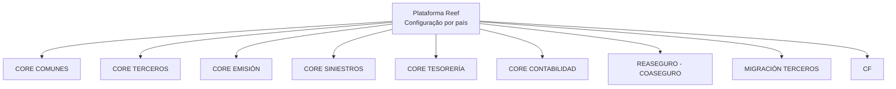

# Documentação da Configuração da Plataforma Reef por País

## 1. Metadados do Documento
- **Arquivo de Origem:** `Não identificado`
- **Tipo de Documento:** `Procedimento`
- **Domínio / Sistema:** `Plataforma Reef`
- **Público-Alvo:** `Não identificado`
- **Data/Versão Identificada:** `Não identificada`

---

## 2. Resumo Executivo & Contexto de Negócio

O documento apresenta a documentação do processo de configuração da Plataforma Reef em um país. O conteúdo informa que a configuração é organizada por módulos funcionais.

Os módulos relacionados abrangem capacidades Core, Terceiros, Emissão, Sinistros, Tesouraria, Contabilidade, Resseguro/Co-seguro e Migração de Terceiros. O documento também cita os termos `CF`, `Home Solutions`, `APIs Documentation`, `Zeus` e `EN`.

O material não descreve etapas de configuração, responsabilidades, parâmetros, integrações, contratos de API ou critérios de validação. Portanto, a principal informação recuperável é a estrutura modular declarada para a documentação da Plataforma Reef.

---

## 3. Arquitetura, Componentes & Tecnologias Envolvidas

A fonte cita a Plataforma Reef e lista módulos de organização da documentação. Não há descrição de arquitetura técnica, tecnologias implementadas, ambientes, fluxos de dados ou relações de integração entre os módulos.



> **Nota de Análise:** O diagrama representa exclusivamente a organização modular indicada no documento. A fonte não detalha dependências, protocolos, APIs, tecnologias ou comunicação entre os módulos.

---

## 4. Regras de Negócio, Especificações Funcionais & Processos

O documento estabelece que o processo de configuração da Plataforma Reef em um país é tratado por módulos.

Os módulos apresentados são:

1. `CORE COMUNES`
2. `CORE TERCEROS`
3. `CORE EMISIÓN`
4. `CORE SINIESTROS`
5. `CORE TESORERÍA`
6. `CORE CONTABILIDAD`
7. `REASEGURO - COASEGURO`
8. `MIGRACIÓN TERCEROS`
9. `CF`

Não foram fornecidas regras de negócio, fórmulas, validações, sequências operacionais, critérios de aprovação, responsabilidades ou restrições técnicas adicionais.

---

## 5. Tabelas de Parâmetros, Ambientes e Estruturas de Dados

| Item / Parâmetro | Descrição / Função | Tipo / Valores / Formato | Ambiente / Observações |
| :--- | :--- | :--- | :--- |
| Plataforma Reef | Plataforma cujo processo de configuração por país é abordado. | Sistema / plataforma | Não especificado |
| CORE COMUNES | Módulo listado na organização da documentação. | Módulo | Sem detalhamento adicional |
| CORE TERCEROS | Módulo listado na organização da documentação. | Módulo | Sem detalhamento adicional |
| CORE EMISIÓN | Módulo listado na organização da documentação. | Módulo | Sem detalhamento adicional |
| CORE SINIESTROS | Módulo listado na organização da documentação. | Módulo | Sem detalhamento adicional |
| CORE TESORERÍA | Módulo listado na organização da documentação. | Módulo | Sem detalhamento adicional |
| CORE CONTABILIDAD | Módulo listado na organização da documentação. | Módulo | Sem detalhamento adicional |
| REASEGURO - COASEGURO | Módulo listado na organização da documentação. | Módulo | Sem detalhamento adicional |
| MIGRACIÓN TERCEROS | Módulo listado na organização da documentação. | Módulo | Sem detalhamento adicional |
| CF | Item listado na organização da documentação. | Não especificado | O significado não é definido na fonte |
| Home Solutions | Termo presente no rodapé/conteúdo extraído. | Não especificado | Sem contexto adicional |
| APIs Documentation | Termo presente no rodapé/conteúdo extraído. | Não especificado | Sem URLs, contratos ou métodos de API |
| Zeus | Termo presente no rodapé/conteúdo extraído. | Não especificado | Sem contexto adicional |
| EN | Termo presente no rodapé/conteúdo extraído. | Não especificado | Sem contexto adicional |

---

## 6. Bateria de Perguntas & Respostas para RAG (FAQ Sintético)

### P1: Qual é o tema central da documentação?
**R:** A documentação aborda o processo de configuração da Plataforma Reef em um país.

### P2: Como a informação de configuração da Plataforma Reef é organizada?
**R:** A informação é organizada em módulos: CORE COMUNES, CORE TERCEROS, CORE EMISIÓN, CORE SINIESTROS, CORE TESORERÍA, CORE CONTABILIDAD, REASEGURO - COASEGURO, MIGRACIÓN TERCEROS e CF.

### P3: O documento descreve como configurar o módulo CORE EMISIÓN?
**R:** Não. O documento apenas lista `CORE EMISIÓN` como um dos módulos da organização da documentação, sem apresentar etapas, parâmetros ou regras de configuração.

### P4: Quais módulos relacionados a terceiros são citados?
**R:** O documento cita os módulos `CORE TERCEROS` e `MIGRACIÓN TERCEROS`.

### P5: Quais módulos financeiros ou contábeis são listados?
**R:** O documento lista `CORE TESORERÍA` e `CORE CONTABILIDAD`. Também cita `REASEGURO - COASEGURO`, mas não detalha seu escopo funcional.

### P6: Há informações sobre APIs da Plataforma Reef?
**R:** O termo `APIs Documentation` aparece no conteúdo extraído, porém não há URLs, métodos HTTP, contratos, autenticação, payloads ou especificações técnicas de APIs.

### P7: O que significa CF na documentação da Plataforma Reef?
**R:** O documento lista `CF`, mas não fornece a expansão da sigla nem descreve sua finalidade.

### P8: O documento identifica ambientes, servidores ou URLs?
**R:** Não. Não há ambientes, servidores, endereços, portas, URLs ou rotas de log descritos no conteúdo fornecido.

### P9: Existe um fluxo de integração entre os módulos CORE?
**R:** Não. A fonte apenas apresenta os módulos como organização da documentação; não descreve fluxos, dependências ou comunicação entre componentes.

### P10: O documento detalha regras de negócio para sinistros, emissão ou tesouraria?
**R:** Não. `CORE SINIESTROS`, `CORE EMISIÓN` e `CORE TESORERÍA` são somente listados como módulos, sem regras ou especificações funcionais adicionais.

---

## 7. Glossário de Termos, Siglas & Conceitos-Chave

- **Plataforma Reef:** Plataforma cujo processo de configuração por país é abordado no documento.
- **CORE COMUNES:** Módulo listado na documentação; a fonte não define o escopo.
- **CORE TERCEROS:** Módulo listado na documentação; a fonte não define o escopo.
- **CORE EMISIÓN:** Módulo listado na documentação; a fonte não define o escopo.
- **CORE SINIESTROS:** Módulo listado na documentação; a fonte não define o escopo.
- **CORE TESORERÍA:** Módulo listado na documentação; a fonte não define o escopo.
- **CORE CONTABILIDAD:** Módulo listado na documentação; a fonte não define o escopo.
- **REASEGURO - COASEGURO:** Módulo listado na documentação; a fonte não define o escopo.
- **MIGRACIÓN TERCEROS:** Módulo listado na documentação; a fonte não define o escopo.
- **CF:** Sigla ou item listado sem significado definido na fonte.
- **Zeus:** Termo citado sem definição ou contexto adicional.
- **EN:** Termo citado sem definição ou contexto adicional.

---

## 8. Notas Críticas, Riscos & Limitações

- O documento não identifica o arquivo de origem, data, versão, autoria ou público-alvo.
- Não há detalhamento de procedimentos de configuração, parâmetros, permissões, ambientes ou responsáveis.
- Não há contratos de integração, endpoints, tecnologias, mecanismos de autenticação ou fluxos entre módulos.
- Os termos `CF`, `Home Solutions`, `APIs Documentation`, `Zeus` e `EN` são citados sem definição contextual.
- A estrutura modular não permite inferir dependências funcionais ou técnicas entre os módulos.

---

## 9. Conteúdo Bruto Estruturado (Referência Fiel)

```text
--- [PÁGINA 1 DE 1] ---

DOCUMENTACIÓN
 En este apartado se aborda el proceso de configuración de la Plataforma
Reef en el país.
La información está organizada en los siguientes módulos.
 CORE COMUNES
  CORE TERCEROS
 CORE EMISIÓN
  CORE SINIESTROS
 CORE TESORERÍA
  CORE CONTABILIDAD
 REASEGURO - COASEGURO
  MIGRACIÓN TERCEROS
 / 
 CF
Home Solutions APIs Documentation Zeus
EN
```
