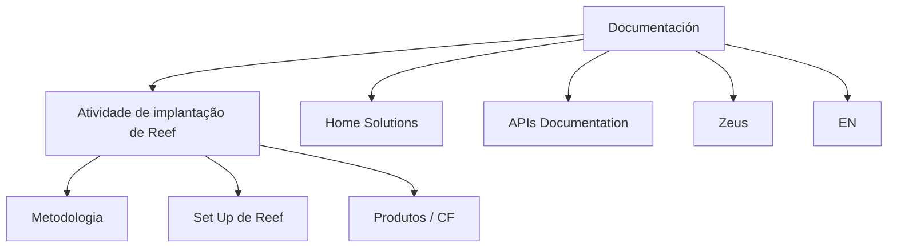

# Documentación — Implantação de Reef

## 1. Metadados do Documento
- **Arquivo de Origem:** Não identificado
- **Tipo de Documento:** Procedimento
- **Domínio / Sistema:** Reef
- **Público-Alvo:** Não identificado
- **Data/Versão Identificada:** Não identificada

---

## 2. Resumo Executivo & Contexto de Negócio

O documento introduz conteúdos relacionados à atividade de implantação de Reef. A documentação informa que a organização das informações ocorre por módulos, sem detalhar a estrutura, a sequência de implantação ou os responsáveis por cada módulo.

Os tópicos explicitamente relacionados à implantação de Reef são **Metodologia**, **Set Up de Reef** e **Produtos / CF**. O trecho também apresenta referências textuais a **Home Solutions**, **APIs Documentation**, **Zeus** e **EN**.

Não há descrição funcional, técnica ou operacional dos módulos citados. O conteúdo fornecido não especifica arquitetura, integrações, tecnologias, URLs, ambientes, contratos de API, parâmetros ou critérios de validação.

---

## 3. Arquitetura, Componentes & Tecnologias Envolvidas

Os elementos identificados no conteúdo são:

| Componente / Termo | Evidência no Documento | Detalhamento Disponível |
| :--- | :--- | :--- |
| Reef | Atividade de implantação e “Set Up de Reef” | Não detalhado |
| Metodologia | Seção listada no documento | Não detalhado |
| Produtos / CF | Seção listada no documento | Não detalhado |
| Home Solutions | Referência textual | Não detalhado |
| APIs Documentation | Referência textual | Não detalhado |
| Zeus | Referência textual | Não detalhado |
| EN | Referência textual | Não detalhado |



> **Nota de Análise:** O documento não descreve relações técnicas, fluxo de dados ou dependências entre Reef, Home Solutions, APIs Documentation, Zeus e EN. O diagrama representa somente a organização textual identificada.

---

## 4. Regras de Negócio, Especificações Funcionais & Processos

O conteúdo fornecido estabelece apenas os seguintes pontos:

1. O escopo abordado está relacionado à atividade de implantação de Reef.
2. As informações da documentação são organizadas por módulos.
3. Os módulos ou tópicos apresentados são:
   - Metodologia;
   - Set Up de Reef;
   - Produtos / CF.
4. O documento também contém as referências: Home Solutions, APIs Documentation, Zeus e EN.

> **Nota de Análise:** Não foram identificadas regras de negócio, critérios de elegibilidade, cálculos, validações, etapas operacionais detalhadas, contratos de integração ou procedimentos de execução.

---

## 5. Tabelas de Parâmetros, Ambientes e Estruturas de Dados

| Item / Parâmetro | Descrição / Função | Tipo / Valores / Formato | Ambiente / Observações |
| :--- | :--- | :--- | :--- |
| Reef | Sistema ou domínio associado à atividade de implantação | Termo textual | Não detalhado |
| Metodologia | Tópico organizado por módulo | Título de seção | Não detalhado |
| Set Up de Reef | Tópico relacionado à configuração ou implantação de Reef | Título de seção | Não detalhado |
| Produtos / CF | Tópico ou agrupamento de conteúdo | Título de seção | O significado de “CF” não é definido |
| Home Solutions | Referência textual | Não especificado | Não detalhado |
| APIs Documentation | Referência textual | Não especificado | Não detalhado |
| Zeus | Referência textual | Não especificado | Não detalhado |
| EN | Referência textual | Não especificado | Não detalhado |

---

## 6. Bateria de Perguntas & Respostas para RAG (FAQ Sintético)

### P1: Qual é o tema central da documentação apresentada?
**R:** A documentação aborda conteúdos relacionados à atividade de implantação de Reef.

### P2: Como as informações sobre a implantação de Reef estão organizadas?
**R:** O documento informa que as informações estão organizadas por módulos, mas não detalha a estrutura interna desses módulos.

### P3: Quais módulos ou tópicos são explicitamente listados no documento?
**R:** Os tópicos explicitamente listados são Metodologia, Set Up de Reef e Produtos / CF.

### P4: O documento descreve o procedimento passo a passo para implantar Reef?
**R:** Não. O texto apenas informa que trata da atividade de implantação de Reef e lista tópicos, sem apresentar etapas operacionais detalhadas.

### P5: Quais informações o documento fornece sobre o Set Up de Reef?
**R:** O documento apenas apresenta “Set Up de Reef” como um tópico. Não há parâmetros, instruções, requisitos técnicos ou sequência de configuração descritos.

### P6: O que significa a sigla CF no tópico “Produtos / CF”?
**R:** O significado de CF não é definido no conteúdo fornecido.

### P7: Há especificações de APIs na documentação?
**R:** O texto contém a expressão “APIs Documentation”, mas não apresenta endpoints, métodos HTTP, contratos, autenticação, formatos de payload ou qualquer especificação técnica de API.

### P8: Qual é a relação entre Reef e Zeus?
**R:** O documento menciona Reef e Zeus, mas não descreve qualquer relação funcional, técnica ou arquitetural entre os dois termos.

### P9: O documento identifica ambientes, servidores ou URLs de acesso?
**R:** Não. Não há URLs, nomes de servidores, portas, credenciais, ambientes ou configurações de infraestrutura no conteúdo fornecido.

### P10: Existem tecnologias ou ferramentas explicitamente especificadas para a implantação de Reef?
**R:** Não. O texto não identifica linguagens, frameworks, bancos de dados, plataformas, ferramentas de CI/CD ou tecnologias de integração.

---

## 7. Glossário de Termos, Siglas & Conceitos-Chave

- **Reef:** Sistema ou domínio referido no contexto de atividade de implantação. Não há definição adicional.
- **Set Up:** Termo usado como título de tópico relacionado a Reef; o documento não detalha seu significado operacional.
- **CF:** Sigla presente em “Produtos / CF”; significado não identificado.
- **Home Solutions:** Referência textual sem definição no conteúdo fornecido.
- **APIs Documentation:** Referência textual a documentação de APIs; não há especificações de API apresentadas.
- **Zeus:** Referência textual sem definição no conteúdo fornecido.
- **EN:** Referência textual sem definição no conteúdo fornecido.

---

## 8. Notas Críticas, Riscos & Limitações

- O conteúdo disponível é resumido e não fornece detalhamento técnico suficiente para execução de uma implantação de Reef.
- Não foram identificados requisitos, pré-requisitos, responsáveis, cronogramas, critérios de aceite ou procedimentos de reversão.
- Não há informações sobre ambientes, integrações, APIs, contratos de dados, segurança ou observabilidade.
- Os termos Home Solutions, APIs Documentation, Zeus, EN e CF são citados sem definição contextual.
- **Nota de Análise:** O documento lista “Set Up de Reef”, porém não detalha configurações, ferramentas, parâmetros ou passos necessários para realizá-lo.

---

## 9. Conteúdo Bruto Estruturado (Referência Fiel)

```text
--- [PÁGINA 1 DE 1] ---

DOCUMENTACIÓN
 En este apartado se aborda todo aquello relacionado con la actividad de
implantación de Reef.
La información está organizada por módulos.
 METODOLOGIA
  SET UP DE REEF
 PRODUCTOS
 / 
 CF
Home Solutions APIs Documentation Zeus
EN
```
