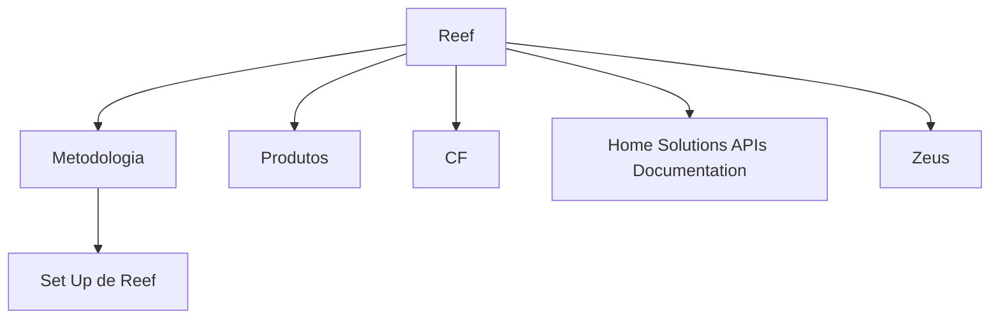

# Documentação de Implantação do Reef

## 1. Metadados do Documento
- **Arquivo de Origem:** `Não identificado`
- **Tipo de Documento:** `Procedimento`
- **Domínio / Sistema:** `Reef`
- **Público-Alvo:** `Não identificado`
- **Data/Versão Identificada:** `Não identificada`

---

## 2. Resumo Executivo & Contexto de Negócio

O conteúdo apresentado introduz a documentação relacionada à atividade de implantação do sistema Reef. A informação é declarada como organizada por módulos, indicando uma estrutura documental modular.

O documento cita uma metodologia associada ao processo de implantação, incluindo o tópico “Set Up de Reef”. Também relaciona os temas “Produtos”, “CF”, “Home Solutions APIs Documentation” e “Zeus”.

Não há detalhamento funcional, técnico, operacional ou arquitetural dos módulos, produtos, APIs, integrações, ambientes, responsáveis ou procedimentos de implantação.

---

## 3. Arquitetura, Componentes & Tecnologias Envolvidas

Os elementos explicitamente citados são: Reef, metodologia, Set Up de Reef, produtos, CF, Home Solutions APIs Documentation e Zeus. O texto não especifica relacionamentos, protocolos, tecnologias, contratos de API ou fluxos entre esses elementos.



> **Nota de Análise:** O diagrama representa apenas a associação temática observada no conteúdo. O documento não descreve integrações técnicas ou dependências entre Reef, CF, Home Solutions APIs Documentation e Zeus.

---

## 4. Regras de Negócio, Especificações Funcionais & Processos

O conteúdo estabelece os seguintes fatos:

1. A documentação abrange assuntos relacionados à atividade de implantação de Reef.
2. A informação está organizada por módulos.
3. Existe uma seção ou tópico denominado “Metodologia”.
4. Existe uma seção ou tópico denominado “Set Up de Reef”.
5. O conteúdo menciona “Produtos”.
6. O conteúdo menciona “CF”.
7. O conteúdo menciona “Home Solutions APIs Documentation”.
8. O conteúdo menciona “Zeus”.

> **Nota de Análise:** Não foram identificadas regras de negócio, critérios de validação, sequências operacionais, parâmetros de cálculo, responsabilidades, contratos de integração ou especificações funcionais adicionais.

---

## 5. Tabelas de Parâmetros, Ambientes e Estruturas de Dados

| Item / Parâmetro | Descrição / Função | Tipo / Valores / Formato | Ambiente / Observações |
| :--- | :--- | :--- | :--- |
| Reef | Sistema ou domínio citado na documentação | Nome próprio | Relacionado à atividade de implantação |
| Metodologia | Tópico citado no documento | Seção documental | Não detalhada |
| Set Up de Reef | Tópico relacionado à preparação ou configuração de Reef | Seção documental | Não detalhado |
| Produtos | Tema citado | Categoria ou módulo não especificado | Não detalhado |
| CF | Sigla ou identificador citado | Não identificado | Significado não informado |
| Home Solutions APIs Documentation | Referência a documentação de APIs | Nome de documentação ou componente | Não detalhado |
| Zeus | Nome próprio citado | Sistema, módulo ou componente não identificado | Não detalhado |

---

## 6. Bateria de Perguntas & Respostas para RAG (FAQ Sintético)

### P1: Qual é o assunto central da documentação?
**R:** A documentação aborda assuntos relacionados à atividade de implantação do Reef.

### P2: Como a informação sobre a implantação de Reef está organizada?
**R:** O documento informa que a informação está organizada por módulos, mas não apresenta a estrutura detalhada desses módulos.

### P3: O documento descreve uma metodologia para implantação de Reef?
**R:** O conteúdo cita o tópico “Metodologia”, porém não apresenta etapas, responsáveis, critérios ou procedimentos dessa metodologia.

### P4: O que é o “Set Up de Reef” segundo a documentação?
**R:** “Set Up de Reef” é um tópico explicitamente listado no documento. Não há explicação adicional sobre configurações, pré-requisitos ou atividades incluídas nesse set up.

### P5: Quais elementos são mencionados na documentação de implantação de Reef?
**R:** O conteúdo menciona Reef, metodologia, Set Up de Reef, produtos, CF, Home Solutions APIs Documentation e Zeus.

### P6: Quais APIs são documentadas no conteúdo?
**R:** O conteúdo menciona “Home Solutions APIs Documentation”, mas não identifica endpoints, métodos HTTP, contratos, autenticação, payloads ou versões de API.

### P7: O documento informa ambientes, servidores ou URLs para Reef?
**R:** Não. Não há ambientes, endereços, servidores, portas, URLs ou parâmetros técnicos explícitos no conteúdo fornecido.

### P8: O que significa a sigla CF no documento?
**R:** O documento cita “CF”, mas não fornece sua expansão ou definição contextual.

### P9: Qual é a relação entre Zeus e Reef?
**R:** Zeus é citado no conteúdo associado à documentação, mas o documento não especifica se Zeus é um sistema, módulo, integração, produto ou dependência de Reef.

### P10: Existem procedimentos operacionais detalhados para implantação?
**R:** Não. O conteúdo informa que trata da atividade de implantação de Reef, mas não descreve procedimentos passo a passo, validações ou critérios de conclusão.

---

## 7. Glossário de Termos, Siglas & Conceitos-Chave

- **Reef:** Sistema ou domínio associado à atividade de implantação.
- **Set Up de Reef:** Tópico citado relacionado ao Reef; sem detalhamento adicional.
- **CF:** Sigla citada sem expansão ou definição no conteúdo.
- **Home Solutions APIs Documentation:** Referência a documentação de APIs; sem especificação de interfaces ou contratos.
- **Zeus:** Nome citado sem definição de função, natureza ou relacionamento técnico.

---

## 8. Notas Críticas, Riscos & Limitações

- O documento não identifica arquivo de origem, versão, data, autor ou público-alvo.
- Não há descrição de arquitetura, componentes técnicos, integrações ou tecnologias.
- Não há procedimentos detalhados para implantação do Reef.
- A sigla **CF** não é definida.
- A relação entre **Reef**, **Home Solutions APIs Documentation** e **Zeus** não é explicada.
- Não são apresentados parâmetros de configuração, ambientes, URLs, logs, credenciais, contratos de API ou critérios de validação.
- O conteúdo é resumido e não sustenta inferências sobre métodos HTTP, estruturas JSON, infraestrutura ou regras de negócio.

---

## 9. Conteúdo Bruto Estruturado (Referência Fiel)

```text
--- [PÁGINA 1 DE 1] ---

DOCUMENTACIÓN
 En este apartado se aborda todo aquello relacionado con la actividad de
implantación de Reef.
La información está organizada por módulos.
 METODOLOGIA
  SET UP DE REEF
 PRODUCTOS
 / 
 CF
Home Solutions APIs Documentation Zeus
EN
```
