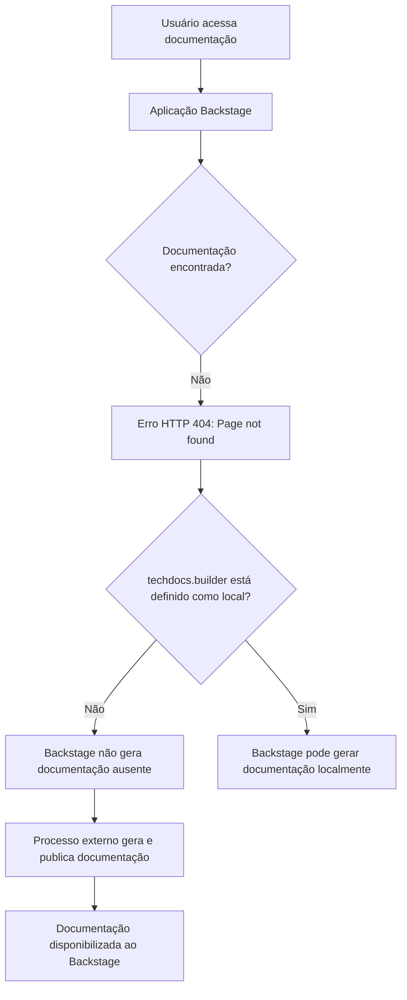

# Página de Erro 404 da Documentação Zeus no Backstage

## 1. Metadados do Documento
- **Arquivo de Origem:** `Não identificado`
- **Tipo de Documento:** `Procedimento / Página de erro de documentação`
- **Domínio / Sistema:** `Backstage TechDocs; Zeus; CF`
- **Público-Alvo:** `Usuários de documentação, suporte, operação e equipes de CI/CD`
- **Data/Versão Identificada:** `Não identificada`

---

## 2. Resumo Executivo & Contexto de Negócio

O conteúdo registra uma página de erro HTTP 404 indicando que uma página de documentação não foi encontrada no ambiente de documentação associado a `Zeus`, dentro de uma aplicação Backstage. A página apresenta a mensagem “Page not found” e sugere retorno à navegação anterior ou contato com o suporte caso o problema seja considerado um defeito.

A mensagem técnica informa que a configuração `techdocs.builder` não está definida como `local`. Nessa condição, a instância Backstage não gera documentação ausente localmente. A disponibilidade da documentação depende, portanto, de um processo externo responsável por gerar e publicar os artefatos documentais.

O conteúdo cita explicitamente um processo de CI/CD como exemplo de mecanismo externo de geração e publicação de documentação. Como alternativa, a mensagem recomenda alterar `techdocs.builder` para `local`, permitindo que a própria instância Backstage gere a documentação.

Não há especificação de APIs, contratos, microsserviços, versões, endereços de ambiente, responsáveis operacionais ou procedimento detalhado de correção. O documento é limitado à condição de erro e às opções gerais de geração de documentação.

---

## 3. Arquitetura, Componentes & Tecnologias Envolvidas

Os elementos identificados são:

- **Backstage:** aplicação que exibe a página de erro e hospeda a navegação de documentação.
- **TechDocs:** componente de documentação citado pela configuração `techdocs.builder`.
- **`techdocs.builder`:** configuração que determina, conforme a mensagem, se a instância Backstage gera documentação localmente.
- **Processo externo de publicação:** mecanismo necessário quando `techdocs.builder` não está configurado como `local`.
- **Pipeline de CI/CD:** citado como exemplo de processo externo capaz de gerar e publicar documentação.
- **Zeus:** nome presente na trilha de navegação da documentação.
- **CF:** item presente na trilha de navegação.
- **Home / Solutions / APIs / Documentation:** categorias ou elementos de navegação exibidos na página.



> **Nota de Análise:** O conteúdo não detalha a configuração efetiva de `techdocs.builder`, o sistema de CI/CD utilizado, os repositórios de origem, os comandos de publicação nem os locais onde os artefatos de documentação são hospedados.

---

## 4. Regras de Negócio, Especificações Funcionais & Processos

1. A página apresentada corresponde a uma condição de erro `404`, identificada como “Page not found”.
2. Quando a documentação não é encontrada e `techdocs.builder` não está configurado como `local`, a aplicação Backstage não gera automaticamente a documentação ausente.
3. Nessa configuração, a documentação deve ser gerada e publicada por um processo externo.
4. Um pipeline de CI/CD é indicado como exemplo de processo externo que pode gerar e publicar a documentação.
5. A mensagem apresenta duas alternativas gerais:
   - Garantir que a documentação do projeto seja gerada e publicada externamente.
   - Alterar a configuração `techdocs.builder` para `local`, permitindo geração pela instância Backstage.
6. A página orienta o usuário a retornar à navegação anterior ou contatar o suporte caso a ausência de documentação seja considerada um defeito.

> **Nota de Análise:** Não foram fornecidos critérios de autenticação, autorização, validação de publicação, frequência de execução do pipeline, formato de documentação ou regras de versionamento.

---

## 5. Tabelas de Parâmetros, Ambientes e Estruturas de Dados

| Item / Parâmetro | Descrição / Função | Tipo / Valores / Formato | Ambiente / Observações |
| :--- | :--- | :--- | :--- |
| `ERROR 404` | Indica que a página solicitada não foi encontrada. | Código HTTP `404` | Exibido na página de documentação. |
| `techdocs.builder` | Configuração relacionada à geração de documentação pelo Backstage. | Valor citado: `local` | Quando não definido como `local`, a aplicação não gera documentos ausentes. |
| Backstage | Aplicação que apresenta a página de documentação e o erro. | Plataforma de documentação citada no texto | Não há versão identificada. |
| TechDocs | Recurso de documentação referido pela configuração `techdocs.builder`. | Componente citado | Não há detalhes de instalação ou configuração. |
| Processo externo | Responsável por gerar e publicar documentação quando o Backstage não o faz localmente. | Processo não especificado | CI/CD é citado como exemplo. |
| CI/CD pipeline | Exemplo de processo externo de geração e publicação de documentação. | Pipeline de integração e entrega contínuas | Ferramenta, gatilhos e comandos não identificados. |
| Zeus | Elemento exibido na trilha de navegação. | Nome de domínio, sistema ou área não detalhada | Sem descrição adicional. |
| CF | Elemento exibido na trilha de navegação. | Sigla ou área não detalhada | Sem significado expandido no conteúdo. |
| Idioma `EN` | Indicador de idioma mostrado na página. | `EN` | Presente na interface exibida. |

---

## 6. Bateria de Perguntas & Respostas para RAG (FAQ Sintético)

### P1: O que significa o erro 404 exibido na documentação Zeus?
**R:** O erro `404` indica que a página solicitada não foi encontrada. A página apresenta explicitamente a mensagem “Page not found”.

### P2: Por que a instância Backstage não gera a documentação ausente?
**R:** A mensagem informa que `techdocs.builder` não está definido como `local`. Nessa condição, a instância Backstage não gera documentação quando os documentos não são encontrados.

### P3: Qual configuração é citada para permitir a geração local de documentação?
**R:** A configuração citada é `techdocs.builder` com o valor `local`. A mensagem indica que alterar essa configuração para `local` permite a geração de documentação pela instância Backstage.

### P4: Como a documentação deve ser disponibilizada quando `techdocs.builder` não é `local`?
**R:** A documentação do projeto deve ser gerada e publicada por algum processo externo. A página cita um pipeline de CI/CD como exemplo desse processo externo.

### P5: O conteúdo identifica qual ferramenta de CI/CD deve publicar a documentação?
**R:** Não. O conteúdo apenas menciona “CI/CD pipeline” como exemplo de processo externo, sem identificar ferramenta, fornecedor, pipeline específico ou comandos de publicação.

### P6: Quais sistemas ou áreas aparecem na trilha de navegação da página?
**R:** A trilha apresenta `Home`, `Solutions`, `APIs`, `Documentation`, `Zeus` e `CF`. O conteúdo não explica a função ou o significado detalhado de cada item.

### P7: O que o usuário deve fazer se acreditar que o erro 404 é um defeito?
**R:** A página orienta o usuário a voltar à navegação anterior ou contatar o suporte caso considere que a ausência da página é um bug.

### P8: O documento informa a URL da página ausente?
**R:** Não. O conteúdo bruto não apresenta URL, host, caminho de rota ou identificador de recurso da página que retornou o erro 404.

### P9: O documento descreve como configurar o processo externo de publicação?
**R:** Não. A mensagem afirma que um processo externo deve gerar e publicar a documentação, mas não detalha repositório, configuração, credenciais, artefatos, etapas ou responsáveis.

### P10: Há informações sobre métodos de API, contratos JSON ou endpoints do Zeus?
**R:** Não. Embora a navegação contenha o item `APIs` e o nome `Zeus`, o conteúdo não especifica endpoints, métodos HTTP, payloads, contratos ou integrações.

---

## 7. Glossário de Termos, Siglas & Conceitos-Chave

- **404:** Código HTTP que indica que o recurso ou página solicitada não foi encontrado.
- **Backstage:** Aplicação mencionada como responsável por apresentar a página de documentação e o erro.
- **TechDocs:** Recurso de documentação mencionado na mensagem de configuração.
- **`techdocs.builder`:** Parâmetro de configuração citado como determinante para a geração local de documentação.
- **`local`:** Valor de configuração citado para habilitar a geração de documentação pela instância Backstage.
- **CI/CD:** Sigla presente no conteúdo como exemplo de pipeline externo para geração e publicação de documentação. O texto não expande a sigla.
- **Zeus:** Nome presente na navegação da documentação; significado não detalhado.
- **CF:** Sigla ou identificador presente na navegação; significado não detalhado.

---

## 8. Notas Críticas, Riscos & Limitações

- A documentação solicitada não estava disponível no momento do acesso, resultando em erro `404`.
- A geração e publicação da documentação podem depender de um processo externo quando `techdocs.builder` não está definido como `local`.
- A indisponibilidade ou falha do processo externo de CI/CD pode impedir a publicação da documentação no Backstage.
- Não há detalhes suficientes para determinar a causa raiz da ausência da página.
- Não há identificação de responsável, time proprietário, ambiente, URL, pipeline ou repositório associado ao conteúdo ausente.
- Não há detalhamento técnico adicional sobre `Zeus`, `CF`, APIs ou os documentos que deveriam estar publicados.

---

## 9. Conteúdo Bruto Estruturado (Referência Fiel)

```text
--- [PÁGINA 1 DE 1] ---

ERROR 404: j: Page not found.
Note that techdocs.builder is not set to 'local' in
your config, which means this Backstage app will
not generate docs if they are not found. Make sure
the project's docs are generated and published by
some external process (e.g. CI/CD pipeline). Or
change techdocs.builder to 'local' to generate docs
from this Backstage instance.
Looks like someone
dropped the mic!
Go back... or please  if you
think this is a bug.
contact support
 / 
 CF
Home Solutions APIs Documentation Zeus
EN
```
