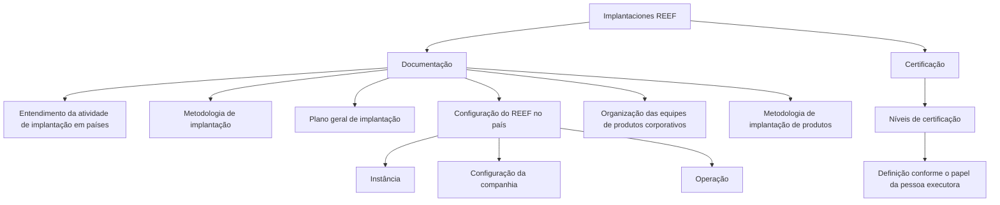

# Documentação de Implantaciones REEF: Documentação e Certificação

## 1. Metadados do Documento
- **Arquivo de Origem:** Não informado; conteúdo bruto fornecido como página 1 de 1.
- **Tipo de Documento:** Procedimento / documentação de implantação.
- **Domínio / Sistema:** REEF.
- **Público-Alvo:** Pessoas que realizam tarefas de implantação e participantes dos níveis de certificação por função.
- **Data/Versão Identificada:** Não identificada.

---

## 2. Resumo Executivo & Contexto de Negócio

O documento “IMPLANTACIONES REEF” centraliza documentação destinada à aquisição de conhecimento sobre a atividade de implantação do REEF em países. O conteúdo está organizado em duas perspectivas explícitas: **Documentação** e **Certificação**.

A perspectiva de Documentação descreve o entendimento da atividade de implantação do REEF, a metodologia a ser seguida e o plano geral para executar uma implantação. Também relaciona as atividades necessárias para configurar o REEF em um país, incluindo instância, configuração da companhia e operação.

O documento também aborda a organização das equipes de produtos corporativos e a metodologia de implantação desses produtos. A perspectiva de Certificação reúne os programas dos diferentes níveis de certificação, definidos conforme o papel da pessoa que executa as tarefas.

---

## 3. Arquitetura, Componentes & Tecnologias Envolvidas

Os elementos identificados no conteúdo são:

- **REEF:** Sistema ou domínio objeto das atividades de implantação.
- **País:** Contexto geográfico onde a implantação do REEF é realizada.
- **Instância:** Elemento a ser configurado durante a implantação.
- **Companhia:** Elemento cuja configuração faz parte da implantação.
- **Operação:** Elemento contemplado nas atividades de configuração.
- **Equipes de produtos corporativos:** Equipes cuja organização é abordada pela documentação.
- **Certificação:** Estrutura de conteúdos e níveis de capacitação vinculados ao papel da pessoa executora.



> **Nota de Análise:** O conteúdo não detalha tecnologias, protocolos, integrações, interfaces, contratos, URLs, ambientes técnicos ou componentes de software específicos do REEF.

---

## 4. Regras de Negócio, Especificações Funcionais & Processos

1. A documentação existe para permitir a aquisição de conhecimento sobre a atividade de implantação do REEF em países.
2. A informação sobre Implantaciones REEF é organizada em duas perspectivas: **Documentação** e **Certificação**.
3. A perspectiva de Documentação deve abranger:
   - Entendimento da atividade de implantação do REEF.
   - Metodologia a seguir durante a implantação.
   - Plano geral para realizar uma implantação.
   - Relação de atividades necessárias para configurar o REEF no país.
   - Configuração de instância.
   - Configuração da companhia.
   - Configuração ou consideração da operação.
   - Organização das equipes de produtos corporativos.
   - Metodologia de implantação de produtos.
4. A perspectiva de Certificação deve disponibilizar os programas dos diferentes níveis de certificação.
5. Os níveis de certificação são estabelecidos em função do papel da pessoa que realiza as tarefas.

> **Nota de Análise:** O documento não especifica a sequência operacional das atividades, critérios de aprovação, responsáveis, prazos, artefatos obrigatórios ou parâmetros de configuração para instância, companhia e operação.

---

## 5. Tabelas de Parâmetros, Ambientes e Estruturas de Dados

| Item / Parâmetro | Descrição / Função | Tipo / Valores / Formato | Ambiente / Observações |
| :--- | :--- | :--- | :--- |
| Implantaciones REEF | Área documental sobre a atividade de implantação do REEF em países. | Organização documental. | O documento não informa ambientes técnicos. |
| Documentação | Perspectiva que reúne entendimento, metodologia, plano geral, atividades de configuração e organização de equipes. | Perspectiva de conteúdo. | Inclui implantação, instância, companhia, operação e produtos corporativos. |
| Certificação | Perspectiva que reúne os programas dos níveis de certificação. | Perspectiva de conteúdo. | Os níveis dependem do papel da pessoa executora. |
| País | Contexto onde ocorre a implantação e a configuração do REEF. | Localização de implantação. | Países específicos não são identificados. |
| Instância | Elemento mencionado como parte da configuração do REEF no país. | Item de configuração. | Parâmetros não detalhados. |
| Companhia | Elemento mencionado como parte da configuração do REEF no país. | Item de configuração. | Parâmetros não detalhados. |
| Operação | Elemento mencionado na relação de atividades de configuração do REEF. | Atividade ou escopo operacional. | Fluxos operacionais não detalhados. |
| Equipes de produtos corporativos | Equipes cuja organização é tratada pela documentação. | Estrutura organizacional. | Equipes e responsabilidades não identificadas. |
| Níveis de certificação | Níveis estabelecidos segundo o papel da pessoa responsável pelas tarefas. | Capacitação por papel. | Nomes, critérios e conteúdos dos níveis não detalhados. |

---

## 6. Bateria de Perguntas & Respostas para RAG (FAQ Sintético)

### P1: Qual é o objetivo da documentação de Implantaciones REEF?
**R:** O objetivo é permitir a aquisição de conhecimento sobre a atividade de implantação do REEF em países.

### P2: Como o conteúdo de Implantaciones REEF está organizado?
**R:** O conteúdo está organizado em duas perspectivas: Documentação e Certificação.

### P3: O que a perspectiva de Documentação aborda na implantação do REEF?
**R:** A perspectiva de Documentação aborda o entendimento da atividade de implantação do REEF, a metodologia a seguir, o plano geral de implantação, as atividades para configurar o REEF no país, a configuração de instância, a configuração da companhia, a operação, a organização das equipes de produtos corporativos e a metodologia de implantação de produtos.

### P4: Quais elementos devem ser configurados durante a implantação do REEF em um país?
**R:** O documento cita a configuração do REEF no país, incluindo instância, configuração da companhia e operação. Não são fornecidos parâmetros ou procedimentos detalhados para essas configurações.

### P5: O documento apresenta uma metodologia para implantação do REEF?
**R:** Sim. O documento afirma que a Documentação contém a metodologia a seguir e um plano geral para executar uma implantação, mas não apresenta as etapas detalhadas dessa metodologia no conteúdo fornecido.

### P6: Qual é o papel das equipes de produtos corporativos no documento?
**R:** O documento menciona a organização das equipes de produtos corporativos e a metodologia de implantação de produtos, sem identificar as equipes, funções, responsabilidades ou produtos específicos.

### P7: O que está incluído na perspectiva de Certificação?
**R:** A perspectiva de Certificação reúne os programas dos diferentes níveis de certificação estabelecidos de acordo com o papel da pessoa que realiza as tarefas.

### P8: Como são definidos os níveis de certificação?
**R:** Os níveis de certificação são estabelecidos em função do papel da pessoa que executa as tarefas. O documento não informa os nomes dos níveis, requisitos ou critérios de aprovação.

### P9: O documento identifica países específicos para implantação do REEF?
**R:** Não. O documento menciona a implantação do REEF em países, mas não identifica países específicos.

### P10: O documento define ambientes, URLs ou integrações técnicas do REEF?
**R:** Não. O conteúdo fornecido não apresenta ambientes, URLs, protocolos, integrações, portas, serviços, APIs ou contratos técnicos.

---

## 7. Glossário de Termos, Siglas & Conceitos-Chave

- **REEF:** Sistema ou domínio mencionado como objeto das atividades de implantação em países.
- **Implantaciones REEF:** Conjunto de documentação relacionado à implantação do REEF.
- **Documentação:** Perspectiva que reúne conhecimento, metodologia, plano e atividades de implantação.
- **Certificação:** Perspectiva que reúne programas de capacitação organizados por níveis conforme o papel da pessoa executora.
- **Instância:** Elemento mencionado como parte da configuração do REEF em um país.
- **Companhia:** Elemento cuja configuração é mencionada no contexto da implantação do REEF.
- **Produtos corporativos:** Produtos associados a equipes corporativas e à respectiva metodologia de implantação.

---

## 8. Notas Críticas, Riscos & Limitações

- O conteúdo é resumido e não detalha procedimentos técnicos, sequência de atividades, responsáveis, prazos ou critérios de conclusão.
- Não há informações sobre versões, datas, países, ambientes, servidores, URLs, APIs, integrações ou tecnologias.
- A documentação cita configuração de instância, companhia e operação, mas não fornece parâmetros, valores permitidos ou dependências.
- A certificação é mencionada por níveis e papel do participante, mas não detalha trilhas, conteúdos programáticos, avaliações ou regras de aprovação.
- O conteúdo inclui as expressões “Home”, “Solutions”, “APIs”, “Documentation”, “Zeus”, “EN” e “CF”, porém não fornece contexto suficiente para classificá-las como sistemas, módulos, links, siglas ou itens de navegação.

---

## 9. Conteúdo Bruto Estruturado (Referência Fiel)

```text
--- [PÁGINA 1 DE 1] ---

IMPLANTACIONES REEF
 En este apartado se encuentra la documentación que permite adquirir
conocimientos acerca de la actividad que conlleva la implantación de Reef en
países. La información está organizada en dos perspectivas:
Documentación
Certificación
DOCUMENTACIÓN
Entendimiento de la actividad de Implantaciones Reef, metodología a seguir y plan general para
llevar a cabo una implantación.
Relación de actividades a llevar a cabo en el momento de configurar Reef en el país, instancia,
configuración de la compañía y operación.
Organización de los equipos de productos corporativos. Metodología de despliegue de productos.
CERTIFICACIÓN
Aquí se encuentran los temarios de los distintos niveles de certificación establecidos en función del
rol de la persona que realiza las tareas.
 / 
 CF
Home Solutions APIs Documentation Zeus
EN
```
