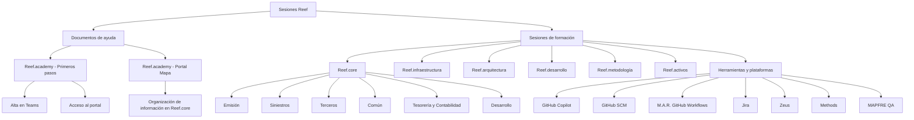

# Sessões Reef: Documentação de Apoio e Calendário de Formação 2023–2024

## 1. Metadados do Documento
- **Arquivo de Origem:** `Não identificado no conteúdo extraído`
- **Tipo de Documento:** `Apresentação Executiva / Catálogo de Formação`
- **Domínio / Sistema:** `Reef, Reef.core, Reef.academy, Zeus, Methods`
- **Público-Alvo:** `Desenvolvedores, Arquitetos, Operação, Negócio e participantes de formação`
- **Data/Versão Identificada:** `Sessões entre 14/09/2023 e 12/12/2024; versão do documento não identificada`

---

## 2. Resumo Executivo & Contexto de Negócio

O documento apresenta a seção **“Sesiones Reef”**, organizada como um ponto de acesso a documentos de ajuda e sessões de formação relacionadas ao ecossistema Reef. A página inicial também evidencia navegação ou referências para **Home**, **Solutions**, **APIs**, **Documentation**, **Zeus**, além do indicador `EN`.

A documentação de ajuda citada tem dois objetivos explícitos: orientar os primeiros passos no Reef.academy — incluindo cadastro no Teams e acesso ao portal — e apresentar o mapa de organização das informações no Reef.core. Os arquivos estão disponíveis em formatos PPTX e PDF, embora os respectivos links estejam representados apenas como “descarga” na extração.

A maior parte do documento é composta por um calendário de sessões formativas. Cada sessão contém data, tema, conteúdo, nível e idioma. As formações cobrem assuntos funcionais e técnicos de Reef.core, com destaque para Emissão, Sinistros, Terceiros, Tesouraria, Contabilidade, Comum, Desenvolvimento, Infraestrutura e Arquitetura.

O calendário também inclui tópicos transversais, como UX, observabilidade, DevOps, GitHub Copilot, GitHub SCM, M.A.R. Workflows, Methods, Jira, qualidade e a Plataforma Corporativa de Chatbots. A predominância é de sessões em espanhol, com duas sessões de GitHack em inglês.

O documento não fornece arquitetura detalhada, contratos de integração, URLs operacionais, métodos HTTP, versões de componentes, responsáveis, duração das sessões, gravações ou materiais associados às sessões de formação. Portanto, este artefato preserva os fatos disponíveis e sinaliza explicitamente as lacunas documentais.

---

## 3. Arquitetura, Componentes & Tecnologias Envolvidas

### Componentes, sistemas e referências identificados

| Componente / Termo | Papel identificado no documento | Detalhamento disponível |
| :--- | :--- | :--- |
| Reef | Ecossistema principal das sessões e temas de formação. | Não detalhado. |
| Reef.core | Sistema ou domínio recorrente nas formações funcionais e técnicas. | Abrange Emissão, Sinistros, Terceiros, Comum, Tesouraria, Contabilidade e Desenvolvimento. |
| Reef.academy | Referência de documentação de primeiros passos. | Inclui cadastro no Teams e acesso ao portal. |
| Reef.academy-Portal-Mapa | Documento de ajuda sobre a organização das informações em Reef.core. | Disponível como referência em PPTX e PDF. |
| Reef.infraestructura | Tema de formação para introdução à observabilidade e DevOps. | Não detalha ferramentas, infraestrutura ou plataformas. |
| Reef.arquitectura | Tema de formação sobre Arquitetura Reef. | Não detalha componentes, padrões ou diagramas técnicos. |
| Reef.desarrollo | Tema de formação sobre API de Canal, rastreamentos backend, frontend e API. | Não detalha contratos, tecnologias ou rotas de logs. |
| Reef.core.desarrollo | Tema sobre nova versão e aspectos funcionais e técnicos de interesse. | Versão não identificada. |
| Reef.metodología | Tema de formação sobre portal Methods e metodologia de ideias e projeto simplificada. | Não detalhado. |
| Reef.activos - Autoservicio | Tema sobre autosserviço de cliente. | Não detalhado. |
| Reef.activos - Chatbots | Tema sobre Plataforma Corporativa de Chatbots. | Não detalha arquitetura ou integrações. |
| Zeus | Referência de navegação e sessão de formação. | Não detalhado. |
| GitHub Copilot | Tema das sessões GitHack. | Não detalha configuração, políticas ou integração. |
| GitHub SCM | Tema de onboarding e uso. | Não detalha processos ou permissões. |
| M.A.R. - GitHub Workflows | Tema de sessão de formação. | A sigla M.A.R. não é expandida no documento. |
| MAPFRE QA | Referência associada à sessão “Calidad Framework MAPFRE QA”. | Não detalhado. |
| Jira | Tema de conhecimentos básicos. | Não detalhado. |
| Methods | Referência a fases de análise tecnológica e onboarding. | Não detalha metodologia. |



> **Nota de Análise:** O documento relaciona diversos domínios do ecossistema Reef, mas não descreve arquitetura de software, integrações entre sistemas, microsserviços, bancos de dados, APIs, protocolos, topologia de infraestrutura ou fluxos de dados.

---

## 4. Regras de Negócio, Especificações Funcionais & Processos

### Documentos de ajuda

1. O documento **Reef.academy-Primeros-pasos** pretende explicar ações como:
   - Cadastro no Teams.
   - Acesso ao portal.
   - Outras atividades representadas por “Etc.” no conteúdo original.

2. O documento **Reef.academy-Portal-Mapa** mostra como a informação está organizada no **Reef.core**.

3. Os documentos de ajuda possuem referências de download para os formatos:
   - PPTX.
   - PDF.

### Organização das sessões de formação

1. Cada sessão de formação possui os campos:
   - Data.
   - Tema.
   - Conteúdo.
   - Nível.
   - Idioma.

2. Os níveis explicitamente identificados são:
   - `N.A.`
   - `BAJO`
   - `BÁSICO`
   - `MEDIO`
   - `AVANZADO`
   - `MEDIUM`

3. O idioma predominante é `ESPAÑOL`.

4. As sessões de GitHack de 10/07/2024 e 17/07/2024 estão identificadas com:
   - Nível: `MEDIUM`.
   - Idioma: `ENGLISH`.

5. O documento apresenta sessões repetidas ou sequenciais, identificadas no conteúdo com sufixos como:
   - `(2)`
   - `(3)`
   - `(4)`
   - `- 1`

6. O documento não define critérios de inscrição, público obrigatório, pré-requisitos, carga horária, formato de participação, disponibilidade de gravações, avaliação ou certificação.

### Tópicos funcionais e técnicos explicitamente programados

- **Emissão:** criação de processo massivo, introdução à emissão, conceitos de desglose/detalhe de importes, mudanças de plano de pagamento e definição de plano de pagamento.
- **Sinistros:** criação de processo massivo, introdução, definição de plano de tramitação, ferramentas do plano, definição de liquidações, definição de tipo de expediente e I.Q.R.F.’s.
- **Terceiros:** criação de processo massivo, novo modelo de terceiros e criação de agente.
- **Comum:** introdução geral e definições do módulo, incluindo “Ramos Técnicos”.
- **Tesouraria e Contabilidade:** introdução a tesouraria/contabilidade.
- **Desenvolvimento:** API de Canal, rastreamentos backend, frontend e API, além de aspectos funcionais e técnicos de nova versão.
- **Infraestrutura:** introdução à observabilidade e DevOps.
- **Outros temas:** UX, autosserviço de cliente, chatbots, Methods, GitHub Copilot, GitHub SCM, M.A.R. Workflows, Zeus, MAPFRE QA e Jira.

> **Nota de Análise:** O documento enumera assuntos de formação, porém não detalha regras de negócio executáveis, fórmulas de cálculo, campos de entrada, critérios de validação, planos de tramitação, contratos de API ou procedimentos operacionais completos.

---

## 5. Tabelas de Parâmetros, Ambientes e Estruturas de Dados

### Documentos de ajuda

| Item / Parâmetro | Descrição / Função | Tipo / Valores / Formato | Ambiente / Observações |
| :--- | :--- | :--- | :--- |
| Reef.academy-Primeros-pasos | Documento para explicar cadastro no Teams, acesso ao portal e outros primeiros passos. | PPTX e PDF; links indicados como “descarga”. | Referência de ajuda. |
| Reef.academy-Portal-Mapa | Documento que mostra como as informações estão organizadas no Reef.core. | PPTX e PDF; links indicados como “descarga”. | Referência de ajuda. |
| Home | Item apresentado na navegação. | Texto de navegação. | Sem URL identificada. |
| Solutions | Item apresentado na navegação. | Texto de navegação. | Sem URL identificada. |
| APIs | Item apresentado na navegação. | Texto de navegação. | Sem URL identificada. |
| Documentation | Item apresentado na navegação. | Texto de navegação. | Sem URL identificada. |
| Zeus | Item apresentado na navegação e tema de sessão. | Texto de navegação / sessão. | Sem detalhamento adicional. |
| EN | Indicador apresentado na navegação. | Código textual. | Sem explicação no documento. |

### Sessões de formação

| Data | Tema | Conteúdo | Nível | Idioma |
| :--- | :--- | :--- | :--- | :--- |
| 14/09/2023 | Reef.core - Emisión | Reef.core - Emisión - CREAR proceso masivo | N.A. | ESPAÑOL |
| 19/09/2023 | Reef.core - Emisión | Reef.core - Emisión - CREAR proceso masivo (2) | N.A. | ESPAÑOL |
| 21/09/2023 | Reef.core - Terceros | Reef.core - Clientes - CREAR proceso masivo | N.A. | ESPAÑOL |
| 26/09/2023 | Reef.core - Emisión | Reef.core - Emisión - CREAR proceso masivo (3) | N.A. | ESPAÑOL |
| 28/09/2023 | Reef.core - Emisión | Reef.core - Siniestros - CREAR proceso masivo | N.A. | ESPAÑOL |
| 03/10/2023 | Reef.core - Emisión | Reef.core - Emisión - CREAR proceso masivo (4) | N.A. | ESPAÑOL |
| 05/10/2023 | Reef | REEF - Presentación | N.A. | ESPAÑOL |
| 10/10/2023 | Reef.infraestructura | REEF - Introducción a observabilidad | N.A. | ESPAÑOL |
| 19/10/2023 | UX - Experiencia de usuario | REEF - UX - Experiencia de Usuario | N.A. | ESPAÑOL |
| 26/10/2023 | Reef.arquitectura | Arquitectura Reef | N.A. | ESPAÑOL |
| 02/11/2023 | Reef.infraestructura | Reef.infraestructura - DevOps | BÁSICO | ESPAÑOL |
| 07/11/2023 | Reef.core - Común | Reef.core - Introducción general | BÁSICO | ESPAÑOL |
| 14/11/2023 | Reef.core - Común | Reef.core - Introducción general (2) | BÁSICO | ESPAÑOL |
| 16/11/2023 | Reef.core - Emisión | Reef.core - Introducción emisión | BÁSICO | ESPAÑOL |
| 21/11/2023 | Reef.core - Emisión | Reef.core - Introducción emisión (2) | BÁSICO | ESPAÑOL |
| 23/11/2023 | Reef.core - Siniestros | Reef.core - Introducción siniestros | BÁSICO | ESPAÑOL |
| 30/11/2023 | Reef.core - Tesorería | Reef.core - Introducción tesorería/contabilidad | BÁSICO | ESPAÑOL |
| 05/12/2023 | Reef.core - Emisión | Reef.core - Emisión - Conceptos de desglose - Detalle de importes | AVANZADO | ESPAÑOL |
| 12/12/2023 | Reef.core - Contabilidad | Reef.core - Introducción tesorería/contabilidad (2) | BÁSICO | ESPAÑOL |
| 14/12/2023 | Reef.core - Siniestros | Reef.core - Siniestros - Definición plan de tramitación | MEDIO | ESPAÑOL |
| 11/01/2024 | Reef.core - Emisión | Reef.core - Emisión - Conceptos de desglose - Detalle de importes (2) | AVANZADO | ESPAÑOL |
| 18/01/2024 | Reef.core - Siniestros | Reef.core - Siniestros - Definición plan de tramitación (2) | MEDIO | ESPAÑOL |
| 25/01/2024 | Reef.core - Terceros | Reef.core - Terceros - Nuevo modelo de Terceros | MEDIO | ESPAÑOL |
| 01/02/2024 | Reef.core - Siniestros | Reef.core - Siniestros - Plan tramitación Herramientas-Definición - 1 | MEDIO | ESPAÑOL |
| 08/02/2024 | Reef.core - Siniestros | Reef.core - Siniestros - Herramientas del Plan - Definición - (2) | MEDIO | ESPAÑOL |
| 15/02/2024 | Reef.core - Común | Reef.core - Comunes - Definiciones del Módulo | MEDIO | ESPAÑOL |
| 22/02/2024 | Reef.core - Común | Reef.core - Comunes - Definiciones del módulo (2) | MEDIO | ESPAÑOL |
| 27/02/2024 | Reef.core - Común | Reef.core - Comunes - Definiciones del Módulo (Ramos Técnicos) | MEDIO | ESPAÑOL |
| 29/02/2024 | Reef.core - Emisión | Reef.core - Emisión - Cambios de plan de pago | MEDIO | ESPAÑOL |
| 07/03/2024 | Reef.core - Terceros | Reef.core - Terceros - Nuevo Modelo de Terceros (2) | MEDIO | ESPAÑOL |
| 14/03/2024 | Reef.desarrollo | Reef.core - API - Emisión - API de Canal | AVANZADO | ESPAÑOL |
| 21/03/2024 | Reef.core - Emisión | Reef.core - Emisión - Definición de plan de pago | MEDIO | ESPAÑOL |
| 04/04/2024 | Reef.core - Siniestros | Reef.core - Siniestros - Definición de liquidaciones | MEDIO | ESPAÑOL |
| 11/04/2024 | Reef.desarrollo | Reef.core - Trazas backend | BAJO | ESPAÑOL |
| 18/04/2024 | Reef.desarrollo | Reef.core - Trazas frontal | BAJO | ESPAÑOL |
| 25/04/2024 | Reef.desarrollo | Reef.core - Trazas A.P.I. | BAJO | ESPAÑOL |
| 07/05/2024 | Reef.core - Emisión | Reef.core - Emisión - Cambios de plan de pago - Visión técnica | AVANZADO | ESPAÑOL |
| 09/05/2024 | Reef.core - Emisión | Reef.core - Emisión - Cambios de plan de pago - Visión técnica(2) | AVANZADO | ESPAÑOL |
| 16/05/2024 | Reef.core - Emisión | Reef.core - Emisión - Definición de plan de pago (2) | MEDIO | ESPAÑOL |
| 23/05/2024 | Reef.core - Terceros | Reef.core - Terceros - CREAR agente | BAJO | ESPAÑOL |
| 30/05/2024 | Reef.metodología | Metodología - portal Methods | BAJO | ESPAÑOL |
| 06/06/2024 | Reef.core - Emisión | Reef.core - Emisión - Definición de plan de pago (3) | MEDIO | ESPAÑOL |
| 13/06/2024 | Reef | GitHack: Eleva tus skills con GitHub Copilot | BAJO | ESPAÑOL |
| 20/06/2024 | Reef.activos - Autoservicio | Reef - Autoservicio Cliente | BAJO | ESPAÑOL |
| 27/06/2024 | Reef.activos - Chatbots | Plataforma Corporativa de Chatbots | BAJO | ESPAÑOL |
| 04/07/2024 | Reef.core.desarrollo | Reef.core.desarrollo - Nueva versión - Aspectos de interés funcionales y técnicos | BAJO | ESPAÑOL |
| 10/07/2024 | Reef | GitHack: Grow your skills with GitHub Copilot | MEDIUM | ENGLISH |
| 11/07/2024 | Reef.metodología | Metodología de Ideas y Proyecto Simplificada | BAJO | ESPAÑOL |
| 17/07/2024 | Reef | GitHack: Grow your skills with GitHub Copilot | MEDIUM | ENGLISH |
| 18/07/2024 | Zeus | Zeus | MEDIO | ESPAÑOL |
| 23/07/2024 | Reef.core - Siniestros | Reef.core - Siniestros - Definición de liquidaciones (2) | BAJO | ESPAÑOL |
| 12/09/2024 | Reef.core - Siniestros | Reef.core - Siniestros - Definición de liquidaciones (3) | BAJO | ESPAÑOL |
| 19/09/2024 | GitHub SCM | GitHub SCM - OnBoarding y uso | BAJO | ESPAÑOL |
| 26/09/2024 | M.A.R. - GitHub | M.A.R. - GitHub Workflows | MEDIO | ESPAÑOL |
| 03/10/2024 | Methods | METHODS fases de Análisis Tecnológico y OnBoarding | BAJO | ESPAÑOL |
| 10/10/2024 | Reef.core - Siniestros | Reef.core - Siniestros - Definición de tipo de expediente (1) | BAJO | ESPAÑOL |
| 17/10/2024 | Reef.core - Siniestros | Reef.core - Siniestros - Definición de tipo de expediente (2) | BAJO | ESPAÑOL |
| 24/10/2024 | Reef.core - Desarrollo | Reef.core - Desarrollo - Nueva versión - Aspectos de interés funcionales y técnicos | BAJO | ESPAÑOL |
| 31/10/2024 | Reef.core - Siniestros | Reef.core - Siniestros - Definición de tipo de expediente (3) | BAJO | ESPAÑOL |
| 07/11/2024 | Reef.core - Terceros | Reef.core - Terceros - CREAR agente | BAJO | ESPAÑOL |
| 14/11/2024 | Calidad | Framework MAPFRE QA | MEDIO | ESPAÑOL |
| 21/11/2024 | Jira | Jira - Conocimientos básicos | BAJO | ESPAÑOL |
| 28/11/2024 | Reef.core - Terceros | Reef.core - Terceros - CREAR agente (2) | BAJO | ESPAÑOL |
| 05/12/2024 | Reef.core | Reef.core - I.Q.R.F's (Incidencias, Quejas, Reclamaciones y Felicitaciones) | BAJO | ESPAÑOL |
| 12/12/2024 | Reef.core | Reef.core - Siniestros I.Q.R.F's (Incidencias, Quejas, Reclamaciones y Felicitaciones) | BAJO | ESPAÑOL |

---

## 6. Bateria de Perguntas & Respostas para RAG (FAQ Sintético)

### P1: Quais documentos de ajuda estão disponíveis na seção Sesiones Reef?
**R:** A seção Sesiones Reef lista dois documentos de ajuda: `Reef.academy-Primeros-pasos`, destinado a explicar ações como cadastro no Teams e acesso ao portal, e `Reef.academy-Portal-Mapa`, que mostra como as informações estão organizadas no Reef.core. Ambos possuem referências de download em PPTX e PDF.

### P2: Qual sessão apresenta a introdução à observabilidade no ecossistema Reef?
**R:** A introdução à observabilidade aparece na sessão de `10/10/2023`, com tema `Reef.infraestructura` e conteúdo `REEF - Introducción a observabilidad`. O nível indicado é `N.A.` e o idioma é `ESPAÑOL`.

### P3: Quando ocorreu a sessão sobre Arquitetura Reef?
**R:** A sessão `Arquitectura Reef` ocorreu em `26/10/2023`. O tema é `Reef.arquitectura`, o nível é `N.A.` e o idioma é `ESPAÑOL`.

### P4: Quais sessões abordam mudanças de plano de pagamento em Reef.core - Emisión?
**R:** O calendário lista quatro sessões relacionadas a mudanças de plano de pagamento: `29/02/2024` com conteúdo `Cambios de plan de pago`, de nível `MEDIO`; `07/05/2024` com `Cambios de plan de pago - Visión técnica`, de nível `AVANZADO`; e `09/05/2024` com `Cambios de plan de pago - Visión técnica(2)`, também de nível `AVANZADO`. O documento não fornece o detalhamento funcional ou técnico dessas alterações.

### P5: Em quais datas foram realizadas sessões sobre definição de plano de pagamento?
**R:** As sessões de `Reef.core - Emisión - Definición de plan de pago` foram realizadas em `21/03/2024`, `16/05/2024` e `06/06/2024`. Todas são de nível `MEDIO` e idioma `ESPAÑOL`.

### P6: Existe formação sobre API de Canal?
**R:** Sim. Em `14/03/2024`, houve uma sessão com tema `Reef.desarrollo` e conteúdo `Reef.core - API - Emisión - API de Canal`. O nível é `AVANZADO` e o idioma é `ESPAÑOL`. O documento não descreve endpoints, métodos HTTP, autenticação ou contratos JSON dessa API.

### P7: Quais sessões cobrem rastreamentos ou logs no Reef.core?
**R:** O documento registra três sessões de rastreamento sob o tema `Reef.desarrollo`: `Reef.core - Trazas backend` em `11/04/2024`, `Reef.core - Trazas frontal` em `18/04/2024` e `Reef.core - Trazas A.P.I.` em `25/04/2024`. As três são de nível `BAJO` e em `ESPAÑOL`. Não há caminhos de log, ferramentas ou procedimentos de consulta documentados.

### P8: Quando foram realizadas as sessões sobre o novo modelo de Terceiros?
**R:** As sessões sobre `Reef.core - Terceros - Nuevo modelo de Terceros` ocorreram em `25/01/2024` e `07/03/2024`. Ambas possuem nível `MEDIO` e idioma `ESPAÑOL`.

### P9: Há formação sobre criação de agente no módulo de Terceiros?
**R:** Sim. O conteúdo `Reef.core - Terceros - CREAR agente` aparece em `23/05/2024` e `07/11/2024`; a continuação `CREAR agente (2)` aparece em `28/11/2024`. Todas as sessões são de nível `BAJO` e em `ESPAÑOL`.

### P10: Quais sessões abordam a definição de liquidações em Sinistros?
**R:** A definição de liquidações em Sinistros aparece em três sessões: `04/04/2024`, de nível `MEDIO`; `23/07/2024`, identificada como `(2)` e de nível `BAJO`; e `12/09/2024`, identificada como `(3)` e de nível `BAJO`. Todas estão em `ESPAÑOL`.

### P11: Quais formações relacionadas ao GitHub Copilot foram listadas?
**R:** Foram listadas três sessões GitHack relacionadas ao GitHub Copilot: em `13/06/2024`, `GitHack: Eleva tus skills con GitHub Copilot`, nível `BAJO`, idioma `ESPAÑOL`; em `10/07/2024` e `17/07/2024`, `GitHack: Grow your skills with GitHub Copilot`, nível `MEDIUM`, idioma `ENGLISH`.

### P12: O documento contém sessões de onboarding para GitHub SCM e Methods?
**R:** Sim. Em `19/09/2024`, há `GitHub SCM - OnBoarding y uso`, de nível `BAJO`, em `ESPAÑOL`. Em `03/10/2024`, há `METHODS fases de Análisis Tecnológico y OnBoarding`, também de nível `BAJO`, em `ESPAÑOL`.

### P13: Quais sessões tratam de I.Q.R.F.’s no Reef.core?
**R:** Em `05/12/2024`, foi realizada a sessão `Reef.core - I.Q.R.F's (Incidencias, Quejas, Reclamaciones y Felicitaciones)`. Em `12/12/2024`, foi realizada `Reef.core - Siniestros I.Q.R.F's (Incidencias, Quejas, Reclamaciones y Felicitaciones)`. Ambas são de nível `BAJO` e em `ESPAÑOL`.

---

## 7. Glossário de Termos, Siglas & Conceitos-Chave

- **A.P.I.:** Termo apresentado no conteúdo `Reef.core - Trazas A.P.I.`; o documento não fornece sua expansão.
- **DevOps:** Tema de formação em `Reef.infraestructura - DevOps`; o documento não apresenta definição adicional.
- **GitHack:** Nome atribuído às sessões sobre desenvolvimento de habilidades com GitHub Copilot.
- **GitHub Copilot:** Ferramenta mencionada nas sessões GitHack.
- **GitHub SCM:** Tema de formação referente a onboarding e uso.
- **I.Q.R.F.’s:** `Incidencias, Quejas, Reclamaciones y Felicitaciones`.
- **M.A.R.:** Sigla apresentada em `M.A.R. - GitHub Workflows`; significado não expandido no documento.
- **MAPFRE QA:** Referência do tema `Framework MAPFRE QA`; não detalhada.
- **Methods / METHODS:** Termo associado ao portal Methods, à metodologia de ideias e projeto simplificada e às fases de análise tecnológica e onboarding.
- **Reef:** Ecossistema principal ao qual as sessões de ajuda e formação se referem.
- **Reef.academy:** Referência de documentação de primeiros passos e portal.
- **Reef.core:** Sistema ou domínio associado às formações de Emissão, Sinistros, Terceiros, Comum, Tesouraria, Contabilidade e Desenvolvimento.
- **Trazas:** Termo usado para sessões de rastreamento de backend, frontend e API.
- **UX:** `Experiencia de usuario`, conforme tema de sessão de 19/10/2023.
- **Zeus:** Item de navegação e tema de sessão em 18/07/2024; não detalhado.

---

## 8. Notas Críticas, Riscos & Limitações

- O conteúdo é um catálogo de referências e calendário de formações, não uma especificação técnica detalhada.
- Não foram identificados URLs completos, nomes de host, portas, credenciais, rotas de API, métodos HTTP, esquemas JSON, bancos de dados, filas, tecnologias de implementação ou versões de software.
- Os links de documentos são apresentados somente como `descarga`; os destinos reais não estão presentes na extração.
- Não há material detalhado sobre o conteúdo das sessões, responsáveis, duração, público por sessão, pré-requisitos, gravações ou evidências de conclusão.
- A sigla `M.A.R.` não é expandida no documento.
- O documento cita tópicos técnicos como API de Canal, rastreamentos e observabilidade, mas não descreve sua implementação.
- O termo `Reef.core - Clientes - CREAR proceso masivo`, datado de 21/09/2023, aparece sob o tema `Reef.core - Terceros`; o documento não esclarece a relação entre Clientes e Terceiros.
- Há sessões classificadas como `N.A.`, sem explicação sobre o significado dessa classificação.
- A classificação de nível `MEDIUM` é usada nas sessões em inglês, enquanto as sessões em espanhol usam `MEDIO`; o documento não define se ambas representam a mesma equivalência pedagógica.

---

## 9. Conteúdo Bruto Estruturado (Referência Fiel)

```text
--- [PÁGINA 1 DE 9] ---

Sesiones Reef
 En este apartado se encuentran documentos o referencias de dos tipos:
Documentos de ayuda
Sesiones de formación
Documentos de ayuda
ARCHIVO DESCRIPCIÓN VERSIÓN
pptx
VERSIÓN
pdf
Reef.academy-
Primeros-pasos
Documento que pretende explicar
como realizar temas como:
- Darse de alta en Teams
- Acceder al portal
- Etc.
descarga descarga
Reef.academy-
Portal-Mapa
Documento que muestra como
está organizada la información en
Reef.core
descarga descarga
 / 
 CF
Home Solutions APIs Documentation Zeus
EN


--- [PÁGINA 2 DE 9] ---

Sesiones de formación
FECHA TEMA CONTENIDO NIVEL IDIOMA
14/09/2023 Reef.core - Emisión Reef.core - Emisión -
CREAR proceso
masivo
N.A. ESPAÑOL
19/09/2023 Reef.core - Emisión Reef.core - Emisión -
CREAR proceso
masivo (2)
N.A. ESPAÑOL
21/09/2023 Reef.core -
Terceros
Reef.core - Clientes -
CREAR proceso
masivo
N.A. ESPAÑOL
26/09/2023 Reef.core - Emisión Reef.core - Emisión -
CREAR proceso
masivo (3)
N.A. ESPAÑOL
28/09/2023 Reef.core - Emisión Reef.core -
Siniestros - CREAR
proceso masivo
N.A. ESPAÑOL
03/10/2023 Reef.core - Emisión Reef.core - Emisión -
CREAR proceso
masivo (4)
N.A. ESPAÑOL
05/10/2023 Reef REEF - Presentación N.A. ESPAÑOL
10/10/2023 Reef.infraestructura REEF - Introducción
a observabilidad
N.A. ESPAÑOL
19/10/2023 UX - Experiencia de
usuario
REEF - UX -
Experiencia de
Usuario
N.A. ESPAÑOL


--- [PÁGINA 3 DE 9] ---

FECHA TEMA CONTENIDO NIVEL IDIOMA
26/10/2023 Reef.arquitectura Arquitectura Reef N.A. ESPAÑOL
02/11/2023 Reef.infraestructura Reef.infraestructura -
DevOps
BÁSICO ESPAÑOL
07/11/2023 Reef.core - Común Reef.core -
Introducción general
BÁSICO ESPAÑOL
14/11/2023 Reef.core - Común Reef.core -
Introducción general
(2)
BÁSICO ESPAÑOL
16/11/2023 Reef.core - Emisión Reef.core -
Introducción emisión
BÁSICO ESPAÑOL
21/11/2023 Reef.core - Emisión Reef.core -
Introducción emisión
(2)
BÁSICO ESPAÑOL
23/11/2023 Reef.core -
Siniestros
Reef.core -
Introducción
siniestros
BÁSICO ESPAÑOL
30/11/2023 Reef.core -
Tesorería
Reef.core -
Introducción
tesorería/contabilidad
BÁSICO ESPAÑOL
05/12/2023 Reef.core - Emisión Reef.core - Emisión -
Conceptos de
desglose - Detalle de
importes
AVANZADO ESPAÑOL


--- [PÁGINA 4 DE 9] ---

FECHA TEMA CONTENIDO NIVEL IDIOMA
12/12/2023 Reef.core -
Contabilidad
Reef.core -
Introducción
tesorería/contabilidad
(2)
BÁSICO ESPAÑOL
14/12/2023 Reef.core -
Siniestros
Reef.core -
Siniestros -
Definición plan de
tramitación
MEDIO ESPAÑOL
11/01/2024 Reef.core - Emisión Reef.core - Emisión -
Conceptos de
desglose - Detalle de
importes (2)
AVANZADO ESPAÑOL
18/01/2024 Reef.core -
Siniestros
Reef.core -
Siniestros -
Definición plan de
tramitación (2)
MEDIO ESPAÑOL
25/01/2024 Reef.core -
Terceros
Reef.core - Terceros
- Nuevo modelo de
Terceros
MEDIO ESPAÑOL
01/02/2024 Reef.core -
Siniestros
Reef.core -
Siniestros - Plan
tramitación
Herramientas-
Definición - 1
MEDIO ESPAÑOL
08/02/2024 Reef.core -
Siniestros
Reef.core -
Siniestros -
Herramientas del
Plan - Definición - (2)
MEDIO ESPAÑOL
15/02/2024 Reef.core - Común Reef.core - Comunes
- Definiciones del
MEDIO ESPAÑOL


--- [PÁGINA 5 DE 9] ---

FECHA TEMA CONTENIDO NIVEL IDIOMA
Módulo
22/02/2024 Reef.core - Común Reef.core - Comunes
- Definiciones del
módulo (2)
MEDIO ESPAÑOL
27/02/2024 Reef.core - Común Reef.core - Comunes
- Definiciones del
Módulo (Ramos
Técnicos)
MEDIO ESPAÑOL
29/02/2024 Reef.core - Emisión Reef.core - Emisión -
Cambios de plan de
pago
MEDIO ESPAÑOL
07/03/2024 Reef.core -
Terceros
Reef.core - Terceros
- Nuevo Modelo de
Terceros (2)
MEDIO ESPAÑOL
14/03/2024 Reef.desarrollo Reef.core - API -
Emisión - API de
Canal
AVANZADO ESPAÑOL
21/03/2024 Reef.core - Emisión Reef.core - Emisión -
Definición de plan de
pago
MEDIO ESPAÑOL
04/04/2024 Reef.core -
Siniestros
Reef.core -
Siniestros -
Definición de
liquidaciones
MEDIO ESPAÑOL
11/04/2024 Reef.desarrollo Reef.core - Trazas
backend
BAJO ESPAÑOL


--- [PÁGINA 6 DE 9] ---

FECHA TEMA CONTENIDO NIVEL IDIOMA
18/04/2024 Reef.desarrollo Reef.core - Trazas
frontal
BAJO ESPAÑOL
25/04/2024 Reef.desarrollo Reef.core - Trazas
A.P.I.
BAJO ESPAÑOL
07/05/2024 Reef.core - Emisión Reef.core - Emisión -
Cambios de plan de
pago - Visión técnica
AVANZADO ESPAÑOL
09/05/2024 Reef.core - Emisión Reef.core - Emisión -
Cambios de plan de
pago - Visión
técnica(2)
AVANZADO ESPAÑOL
16/05/2024 Reef.core - Emisión Reef.core - Emisión -
Definición de plan de
pago (2)
MEDIO ESPAÑOL
23/05/2024 Reef.core -
Terceros
Reef.core - Terceros
- CREAR agente
BAJO ESPAÑOL
30/05/2024 Reef.metodología Metodología - portal
Methods
BAJO ESPAÑOL
06/06/2024 Reef.core - Emisión Reef.core - Emisión -
Definición de plan de
pago (3)
MEDIO ESPAÑOL
13/06/2024 Reef GitHack: Eleva tus
skills con GitHub
Copilot
BAJO ESPAÑOL


--- [PÁGINA 7 DE 9] ---

FECHA TEMA CONTENIDO NIVEL IDIOMA
20/06/2024 Reef.activos -
Autoservicio
Reef - Autoservicio
Cliente
BAJO ESPAÑOL
27/06/2024 Reef.activos -
Chatbots
Plataforma
Corporativa de
Chatbots
BAJO ESPAÑOL
04/07/2024 Reef.core.desarrollo Reef.core.desarrollo
- Nueva versión -
Aspectos de interés
funcionales y
técnicos
BAJO ESPAÑOL
10/07/2024 Reef GitHack: Grow your
skills with GitHub
Copilot
MEDIUM ENGLISH
11/07/2024 Reef.metodología Metodología de
Ideas y Proyecto
Simplificada
BAJO ESPAÑOL
17/07/2024 Reef GitHack: Grow your
skills with GitHub
Copilot
MEDIUM ENGLISH
18/07/2024 Zeus Zeus MEDIO ESPAÑOL
23/07/2024 Reef.core -
Siniestros
Reef.core -
Siniestros -
Definición de
liquidaciones (2)
BAJO ESPAÑOL


--- [PÁGINA 8 DE 9] ---

FECHA TEMA CONTENIDO NIVEL IDIOMA
12/09/2024 Reef.core -
Siniestros
Reef.core -
Siniestros -
Definición de
liquidaciones (3)
BAJO ESPAÑOL
19/09/2024 GitHub SCM GitHub SCM -
OnBoarding y uso
BAJO ESPAÑOL
26/09/2024 M.A.R. - GitHub M.A.R. - GitHub
Workflows
MEDIO ESPAÑOL
03/10/2024 Methods METHODS fases de
Análisis Tecnológico
y OnBoarding
BAJO ESPAÑOL
10/10/2024 Reef.core -
Siniestros
Reef.core -
Siniestros -
Definición de tipo de
expediente (1)
BAJO ESPAÑOL
17/10/2024 Reef.core -
Siniestros
Reef.core -
Siniestros -
Definición de tipo de
expediente (2)
BAJO ESPAÑOL
24/10/2024 Reef.core -
Desarrollo
Reef.core -
Desarrollo - Nueva
versión - Aspectos de
interés funcionales y
técnicos
BAJO ESPAÑOL


--- [PÁGINA 9 DE 9] ---

FECHA TEMA CONTENIDO NIVEL IDIOMA
31/10/2024 Reef.core -
Siniestros
Reef.core -
Siniestros -
Definición de tipo de
expediente (3)
BAJO ESPAÑOL
07/11/2024 Reef.core -
Terceros
Reef.core - Terceros
- CREAR agente
BAJO ESPAÑOL
14/11/2024 Calidad Framework MAPFRE
QA
MEDIO ESPAÑOL
21/11/2024 Jira Jira - Conocimientos
básicos
BAJO ESPAÑOL
28/11/2024 Reef.core -
Terceros
Reef.core - Terceros
- CREAR agente (2)
BAJO ESPAÑOL
05/12/2024 Reef.core Reef.core - I.Q.R.F's
(Incidencias, Quejas,
Reclamaciones y
Felicitaciones)
BAJO ESPAÑOL
12/12/2024 Reef.core Reef.core -
Siniestros I.Q.R.F's
(Incidencias, Quejas,
Reclamaciones y
Felicitaciones)
BAJO ESPAÑOL
```
