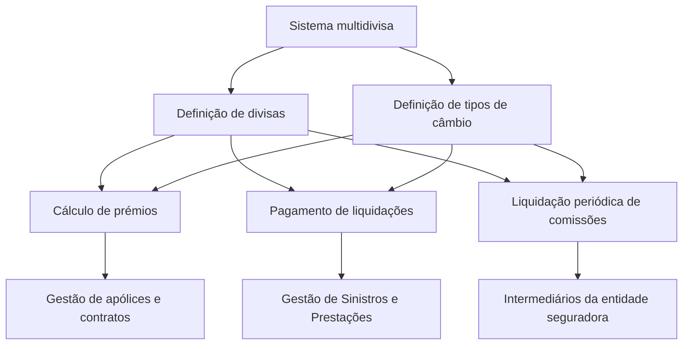

# Definição de Moedas — Documentação Reef

## 1. Metadados do Documento
- **Arquivo de Origem:** Não identificado
- **Tipo de Documento:** Especificação Técnica
- **Domínio / Sistema:** Reef / entidade seguradora
- **Público-Alvo:** Não identificado
- **Data/Versão Identificada:** Não identificada

---

## 2. Resumo Executivo & Contexto de Negócio

O documento descreve a funcionalidade de definição de moedas em um sistema multidivisa no contexto da documentação Reef. O sistema permite codificar a relação de divisas que podem ser utilizadas em operações corporativas.

As divisas configuradas suportam, entre outros exemplos citados, o cálculo de prémios durante a gestão de apólices e contratos. O documento também relaciona a definição de moedas ao pagamento de liquidações de expedientes de sinistros no processo de Gestão de Sinistros e Prestações.

Outro uso informado para moedas e tipos de câmbio é a liquidação periódica de comissões destinadas aos intermediários da entidade seguradora. Para viabilizar esses processos, o documento estabelece a necessidade de definir quais divisas serão utilizadas e quais serão os respetivos tipos de câmbio.

O conteúdo disponível é resumido e apresenta os tópicos “Moedas do Sistema”, “Definição de Moedas” e “Tipos de Câmbio”, sem detalhar campos, regras de validação, métodos, fórmulas de conversão, periodicidade ou interfaces operacionais.

---

## 3. Arquitetura, Componentes & Tecnologias Envolvidas

Os elementos explicitamente citados são:

- **Sistema multidivisa:** sistema que permite codificar relações de divisas para processos corporativos.
- **Reef:** domínio/documentação identificada no cabeçalho.
- **Gestão de apólices e contratos:** processo que pode utilizar divisas no cálculo de prémios.
- **Gestão de Sinistros e Prestações:** processo que pode utilizar divisas no pagamento de liquidações de expedientes de sinistros.
- **Intermediários da entidade seguradora:** destinatários da liquidação periódica de comissões.
- **Tipos de câmbio:** informação que deve ser definida juntamente com as divisas.



**Nota de Análise:** o documento não detalha a arquitetura técnica, tecnologias de implementação, integrações, APIs, bases de dados, contratos JSON, ambientes ou mecanismos de cálculo dos tipos de câmbio.

---

## 4. Regras de Negócio, Especificações Funcionais & Processos

1. O sistema é descrito como **multidivisa**.
2. O sistema permite codificar a relação de divisas nas quais determinados processos podem ser efetuados.
3. As divisas podem ser utilizadas para cálculos de prémios no processo de gestão de apólices e contratos.
4. As divisas podem ser utilizadas para pagamento de liquidações de expedientes de sinistros no processo de Gestão de Sinistros e Prestações.
5. As divisas podem ser utilizadas para liquidação periódica de comissões destinadas aos intermediários da entidade seguradora.
6. Devem ser definidas as divisas que serão utilizadas pelo sistema.
7. Devem ser definidos os tipos de câmbio das divisas.

**Nota de Análise:** o documento não informa critérios para inclusão, alteração, inativação ou exclusão de moedas. Também não especifica a origem dos tipos de câmbio, a fórmula de conversão, a data de vigência, arredondamentos, casas decimais, moeda-base ou responsáveis pela manutenção cadastral.

---

## 5. Tabelas de Parâmetros, Ambientes e Estruturas de Dados

| Item / Parâmetro | Descrição / Função | Tipo / Valores / Formato | Ambiente / Observações |
| :--- | :--- | :--- | :--- |
| Divisas | Relação de moedas que podem ser utilizadas nas operações do sistema multidivisa. | Não detalhado | Devem ser definidas. |
| Tipos de câmbio | Informação cambial associada às divisas utilizadas pelo sistema. | Não detalhado | Devem ser definidos. |
| Cálculo de prémios | Exemplo de processo que pode utilizar divisas. | Processo de gestão de apólices e contratos | Não há fórmula, campos ou regras adicionais. |
| Pagamento de liquidações | Exemplo de processo que pode utilizar divisas. | Processo de Gestão de Sinistros e Prestações | Refere-se a expedientes de sinistros. |
| Liquidação de comissões | Exemplo de processo que pode utilizar divisas. | Processo periódico | Destinado a intermediários da entidade seguradora. |
| Reef | Identificação exibida na documentação. | Domínio / documentação | O documento contém as expressões “Documentation / DOCUMENTACIÓN Reef” e “DOCUMENTACIÓN Reef”. |
| Owner | Proprietário exibido no conteúdo bruto. | `user:agonzalez_mapfre.com` | Valor reproduzido literalmente do texto extraído. |
| Lifecycle | Estado de ciclo de vida exibido no conteúdo bruto. | `Approved Source` | Não há detalhamento adicional. |

---

## 6. Bateria de Perguntas & Respostas para RAG (FAQ Sintético)

### P1: Qual é o objetivo da definição de moedas no sistema Reef?
**R:** O objetivo é definir as divisas e os respetivos tipos de câmbio utilizados por um sistema multidivisa em processos como cálculo de prémios, pagamento de liquidações de sinistros e liquidação periódica de comissões.

### P2: Em quais processos as divisas podem ser utilizadas?
**R:** O documento cita três exemplos: cálculos de prémios na gestão de apólices e contratos, pagamento de liquidações de expedientes de sinistros na Gestão de Sinistros e Prestações e liquidação periódica de comissões para intermediários da entidade seguradora.

### P3: O documento confirma que o sistema suporta múltiplas moedas?
**R:** Sim. O texto caracteriza explicitamente o sistema como “multidivisa” e informa que ele permite codificar a relação de divisas em que operações podem ser efetuadas.

### P4: O que precisa ser definido para a operação multidivisa?
**R:** Devem ser definidas as divisas que serão utilizadas e os tipos de câmbio dessas divisas.

### P5: Como as moedas se relacionam ao cálculo de prémios?
**R:** As moedas podem ser utilizadas nos cálculos de prémios realizados durante o processo de gestão de apólices e contratos. O documento não apresenta fórmulas, moeda-base, arredondamentos ou regras de conversão.

### P6: Qual é o uso das moedas no processo de sinistros?
**R:** As moedas podem ser usadas no pagamento das liquidações dos expedientes de sinistros, dentro do processo de Gestão de Sinistros e Prestações.

### P7: As moedas são utilizadas na liquidação de comissões?
**R:** Sim. O documento indica que as divisas podem ser usadas na liquidação periódica de comissões que deve ser realizada para os intermediários da entidade seguradora.

### P8: Quais detalhes existem sobre os tipos de câmbio?
**R:** O documento apenas estabelece que os tipos de câmbio das divisas devem ser definidos. Não informa fonte cambial, periodicidade de atualização, vigência, método de cálculo ou critérios de validação.

### P9: O documento define APIs ou contratos técnicos para o cadastro de moedas?
**R:** Não. O conteúdo disponível não descreve métodos HTTP, APIs, contratos JSON, modelos de dados, campos de cadastro ou integrações técnicas.

### P10: O documento informa quais moedas específicas devem ser cadastradas?
**R:** Não. O texto afirma que é necessário definir quais serão as divisas, mas não lista códigos, nomes ou moedas específicas.

---

## 7. Glossário de Termos, Siglas & Conceitos-Chave

- **Divisas:** moedas cuja relação pode ser codificada no sistema multidivisa para uso em processos corporativos.
- **Sistema multidivisa:** sistema que permite trabalhar com uma relação de divisas e respetivos tipos de câmbio.
- **Tipos de câmbio:** informação cambial das divisas que deve ser definida para o funcionamento descrito.
- **Prémios:** valores calculados no processo de gestão de apólices e contratos, conforme o exemplo citado.
- **Apólices:** elemento mencionado no processo de gestão de apólices e contratos.
- **Sinistros:** contexto de expedientes cujas liquidações podem ser pagas com utilização de divisas.
- **Gestão de Sinistros e Prestações:** processo citado para pagamento das liquidações dos expedientes de sinistros.
- **Intermediários:** destinatários da liquidação periódica de comissões da entidade seguradora.
- **Reef:** identificação da documentação exibida no conteúdo original.

---

## 8. Notas Críticas, Riscos & Limitações

- O conteúdo é resumido e não apresenta detalhamento operacional para “Moedas do Sistema”, “Definição de Moedas” ou “Tipos de Câmbio”.
- Não foram identificadas moedas concretas, códigos de moeda, moeda-base, taxas, vigências, datas de referência ou regras de arredondamento.
- Não foram identificados campos de cadastro, validações, permissões, fluxos de aprovação, trilha de auditoria ou responsabilidades de manutenção.
- Não foram identificados ambientes, URLs, servidores, rotas de logs, APIs, métodos HTTP, contratos de integração ou tecnologias de implementação.
- A extração bruta contém caracteres aparentando problema de codificação, como `codicar` e `denir`; esta análise preserva o conteúdo original na seção de referência.
- **Nota de Análise:** o documento lista processos de negócio relacionados a moedas, mas não detalha como os tipos de câmbio são aplicados em cada processo.

---

## 9. Conteúdo Bruto Estruturado (Referência Fiel)

```text
--- [PÁGINA 1 DE 1] ---

DEFINICIÓN de las MONEDAS
Contexto
El sistema por ser multidivisa, permite codicar la relación de Divisas en los que se podrán efectuar, por ejemplo, los cálculos de las primas
en el proceso de gestión de pólizas y contratos, el pago de las liquidaciones de los expedientes de Siniestros en el Proceso de Gestión de
Siniestros y Prestaciones, la liquidación de comisiones periódica que se ha de realizar a los intermediarios de la entidad aseguradora ...
Para ello se deben denir cuales van a ser éstas divisas y los tipos de cambio de las mismas.
Monedas del Sistema
Denición de Monedas
Tipos de Cambio
Tipos de Cambio
Documentation / DOCUMENTACIÓN Reef
DOCUMENTACIÓN Reef
Mapfredocument
DOCUMENTACIÓN Reef
Owner
user:agonzalez_mapfre.com
Lifecycle
Approved Source
 /
 VL
Buscar Inicio Soluciones Arquitecturas APIs Componentes Cloud Documentación Zeus Reef Ayuda
ES
```
