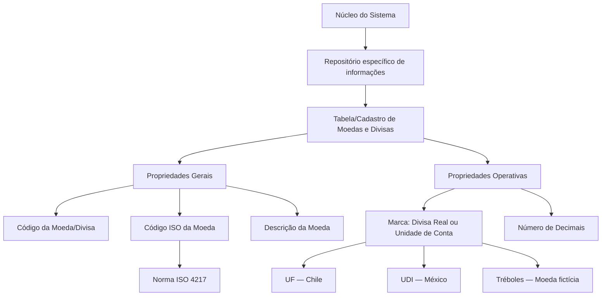

# Definição das Moedas/Divisas do Sistema — Propriedades Gerais e Operativas

## 1. Metadados do Documento
- **Arquivo de Origem:** Não identificado no conteúdo fornecido
- **Tipo de Documento:** Especificação Funcional
- **Domínio / Sistema:** Sistema / documentação Reef
- **Público-Alvo:** Negócio, analistas funcionais, desenvolvedores e equipes de operação
- **Data/Versão Identificada:** Não identificada

---

## 2. Resumo Executivo & Contexto de Negócio

O documento define as propriedades funcionais para cadastro de moedas ou divisas no núcleo do Sistema. O cadastro é realizado em um repositório de informações específico, que é inicialmente entregue às instalações sem conteúdo.

A estrutura de moedas/divisas possui propriedades gerais e propriedades operativas. As propriedades gerais identificam a moeda por meio de código interno, código ISO e descrição. As propriedades operativas determinam se o cadastro representa uma divisa real ou uma unidade de conta, além da quantidade de casas decimais utilizada em cálculos internos.

A principal regra de conformidade indicada é o respeito à norma ISO 4217 na definição das moedas. A norma ISO 4217 é apresentada como a referência para códigos de três letras das divisas do mundo.

O documento também estabelece exemplos de unidades de conta cujo valor é reajustado periodicamente segundo o aumento dos preços: UF, no Chile, e UDI, no México. Adicionalmente, menciona os “Tréboles” como moeda fictícia utilizada no plano de fidelização da entidade.

---

## 3. Arquitetura, Componentes & Tecnologias Envolvidas

Os elementos identificados no conteúdo são:

| Componente / Conceito | Papel identificado no documento |
| :--- | :--- |
| Núcleo do Sistema | Possui a capacidade funcional de codificar moedas/divisas. |
| Repositório de informações específico | Repositório no qual moedas/divisas são cadastradas. É inicialmente entregue vazio às instalações. |
| Tabela de Moedas do Sistema | Estrutura funcional cuja definição deve respeitar a norma ISO 4217. |
| Documentação Reef | Área de documentação mencionada nos vínculos do conteúdo original. |
| Norma ISO 4217 | Referência normativa para códigos de três letras de moedas/divisas. |
| UF | Unidade de Fomento do Chile, citada como exemplo de unidade de conta. |
| UDI | Unidade de Inversão do México, citada como exemplo de unidade de conta. |
| Tréboles | Moeda fictícia utilizada no plano de fidelização da entidade. |

O conteúdo não descreve microsserviços, APIs, protocolos, bancos de dados, integrações técnicas, métodos HTTP, contratos JSON, servidores ou tecnologias de infraestrutura.



> **Nota de Análise:** O diagrama representa apenas a relação conceitual explicitamente descrita no documento. Não há detalhamento de arquitetura física, componentes de software, interfaces ou fluxo de integração.

---

## 4. Regras de Negócio, Especificações Funcionais & Processos

### 4.1 Cadastro de moedas/divisas

1. O núcleo do Sistema permite codificar moedas/divisas.
2. As moedas/divisas são mantidas em um repositório de informações específico.
3. O repositório é entregue inicialmente às instalações vazio de conteúdo.
4. A definição de uma moeda/divisa utiliza propriedades gerais e propriedades operativas.

### 4.2 Propriedades gerais

1. **Código da Moeda/Divisa**
   - Indica o código da divisa no Sistema.

2. **Código ISO da Moeda**
   - Indica o código da moeda ou divisa que está sendo definida.
   - O código deve estar de acordo com a norma ISO 4217.
   - A norma ISO 4217 define códigos de três letras para as divisas do mundo.

3. **Descrição da Moeda**
   - Indica a descrição da moeda ou divisa cadastrada no Sistema.

### 4.3 Propriedades operativas

1. **Marca Divisa Real ou Unidade de Conta**
   - Indica se o código de moeda/divisa definido corresponde a uma moeda real.
   - Também pode indicar que o código corresponde a uma unidade de conta.
   - Uma unidade de conta possui valor reajustado periodicamente de acordo com o incremento dos preços.
   - Exemplos apresentados:
     - UF — Unidades de Fomento no Chile.
     - UDI — Unidades de Inversión no México.
   - Caso particular:
     - Tréboles são tratados como moeda fictícia utilizada no plano de fidelização da entidade.

2. **Número de Decimais**
   - Modula o comportamento do Sistema para realizar cálculos internos com uma quantidade determinada de decimais.

### 4.4 Regra de conformidade normativa

- A definição das moedas na tabela de Moedas do Sistema deve respeitar a norma ISO 4217.

### 4.5 Documentação relacionada

O documento recomenda a leitura de diretrizes e documentos funcionais relacionados para evitar interpretações incorretas causadas pela análise isolada deste material. Entre os conteúdos relacionados, é citado:

- **Tipos de Cambio de las Divisas**

> **Nota de Análise:** O documento não especifica o fluxo operacional de criação, alteração, exclusão, aprovação ou validação de registros de moeda/divisa. Também não detalha regras para conversão cambial, arredondamento, armazenamento de valores ou periodicidade de reajuste de unidades de conta.

---

## 5. Tabelas de Parâmetros, Ambientes e Estruturas de Dados

| Item / Parâmetro | Descrição / Função | Tipo / Valores / Formato | Ambiente / Observações |
| :--- | :--- | :--- | :--- |
| Repositório de informações específico | Armazena a codificação das moedas/divisas do Sistema. | Repositório de informação; estrutura não detalhada. | Entregue inicialmente às instalações vazio de conteúdo. |
| Código da Moeda/Divisa | Indica o código da divisa no Sistema. | Formato não especificado. | Propriedade geral. |
| Código ISO da Moeda | Identifica a moeda/divisa conforme a norma ISO 4217. | Código de três letras, conforme ISO 4217. | Propriedade geral; uso obrigatório segundo a FAQ do documento. |
| Descrição da Moeda | Indica a descrição da moeda/divisa cadastrada. | Texto; formato não especificado. | Propriedade geral. |
| Marca Divisa Real ou Unidade de Conta | Classifica o código como moeda real ou unidade de conta. | Valores conceituais: Divisa Real ou Unidade de Conta. | Propriedade operativa. |
| UF | Exemplo de unidade de conta reajustada periodicamente conforme incremento dos preços. | Unidades de Fomento. | Chile. |
| UDI | Exemplo de unidade de conta reajustada periodicamente conforme incremento dos preços. | Unidades de Inversión. | México. |
| Tréboles | Moeda fictícia utilizada no plano de fidelização da entidade. | Moeda fictícia. | Caso particular citado no documento. |
| Número de Decimais | Define a quantidade de decimais empregada pelo Sistema nos cálculos internos. | Número determinado de decimais; intervalo não especificado. | Propriedade operativa. |
| Tipos de Cambio de las Divisas | Documento funcional relacionado cuja leitura é recomendada. | Referência documental. | Não detalhado no conteúdo fornecido. |

---

## 6. Bateria de Perguntas & Respostas para RAG (FAQ Sintético)

### P1: Qual é o objetivo do repositório de moedas/divisas do Sistema?
**R:** O repositório específico de informações permite ao núcleo do Sistema codificar moedas ou divisas. O documento informa que esse repositório é inicialmente entregue às instalações vazio de conteúdo.

### P2: Quais propriedades gerais devem ser definidas para uma moeda ou divisa?
**R:** As propriedades gerais são Código da Moeda/Divisa, Código ISO da Moeda e Descrição da Moeda. O Código da Moeda/Divisa identifica a divisa no Sistema, o Código ISO identifica a moeda conforme a norma ISO 4217 e a Descrição da Moeda registra a descrição da moeda/divisa cadastrada.

### P3: Qual norma deve ser respeitada na definição de moedas na tabela do Sistema?
**R:** A definição das moedas deve respeitar a norma ISO 4217. O documento informa que a ISO 4217 define códigos de três letras para as divisas do mundo.

### P4: O que representa o Código ISO da Moeda?
**R:** O Código ISO da Moeda representa o código da moeda ou divisa que está sendo definida no Sistema, de acordo com a norma ISO 4217. O documento caracteriza esse padrão como códigos de três letras para as moedas/divisas mundiais.

### P5: Qual é a diferença entre uma divisa real e uma unidade de conta?
**R:** A marca “Divisa Real ou Unidade de Conta” indica se o código cadastrado representa uma moeda real ou uma unidade de conta. A unidade de conta tem valor reajustado periodicamente conforme o incremento dos preços.

### P6: Quais exemplos de unidades de conta são apresentados no documento?
**R:** O documento apresenta a UF, Unidades de Fomento no Chile, e a UDI, Unidades de Inversión no México, como exemplos de unidades de conta cujo valor é reajustado periodicamente de acordo com o incremento dos preços.

### P7: O que são os Tréboles no contexto da definição de moedas?
**R:** Os Tréboles são um caso particular citado no documento: uma moeda fictícia utilizada no plano de fidelização da entidade.

### P8: Para que serve o atributo Número de Decimais?
**R:** O atributo Número de Decimais modula o comportamento do Sistema para que os cálculos internos sejam realizados com uma quantidade determinada de casas decimais.

### P9: O documento define quantos decimais cada moeda deve possuir?
**R:** Não. O documento informa que o atributo Número de Decimais determina a quantidade de decimais usada nos cálculos internos, mas não define valores permitidos, mínimos, máximos ou uma quantidade específica por moeda/divisa.

### P10: O documento especifica como cadastrar ou alterar uma moeda na tabela de Moedas?
**R:** Não. O conteúdo descreve as propriedades da moeda/divisa e a obrigatoriedade de respeitar a norma ISO 4217, mas não detalha telas, APIs, permissões, etapas de aprovação, métodos de inclusão, alteração ou exclusão.

### P11: Existe uma documentação funcional relacionada à definição de moedas?
**R:** Sim. O documento recomenda a leitura de diretrizes e documentos funcionais relacionados para evitar interpretações incorretas. “Tipos de Cambio de las Divisas” é citado como material relacionado.

### P12: O documento fornece regras de conversão de câmbio ou cálculo de taxas?
**R:** Não. Embora cite “Tipos de Cambio de las Divisas” como documento relacionado, o conteúdo fornecido não apresenta fórmulas, taxas, fontes de cotação, periodicidade de atualização ou regras de conversão cambial.

---

## 7. Glossário de Termos, Siglas & Conceitos-Chave

- **Código da Moeda/Divisa:** Código que identifica a divisa no Sistema.
- **Código ISO da Moeda:** Código de moeda/divisa definido conforme a norma ISO 4217.
- **Divisa Real:** Classificação para um código que representa uma moeda real.
- **ISO 4217:** Norma citada pelo documento para a definição de códigos de três letras das divisas do mundo.
- **Moeda Fictícia:** Moeda não real; no documento, os Tréboles são citados como moeda fictícia do plano de fidelização.
- **Número de Decimais:** Atributo que determina a quantidade de decimais empregada pelo Sistema em cálculos internos.
- **UDI:** Unidades de Inversión no México; exemplo de unidade de conta citado no documento.
- **UF:** Unidades de Fomento no Chile; exemplo de unidade de conta citado no documento.
- **Unidade de Conta:** Código cujo valor é reajustado periodicamente de acordo com o incremento dos preços.

---

## 8. Notas Críticas, Riscos & Limitações

- O repositório de moedas/divisas é entregue inicialmente sem conteúdo; portanto, sua utilização depende de carga ou cadastro inicial, embora o procedimento dessa carga não seja descrito.
- A conformidade com a ISO 4217 é uma regra explícita para a definição de moedas, mas o documento não especifica mecanismos de validação automática ou governança para assegurar essa conformidade.
- O atributo Número de Decimais influencia os cálculos internos, porém o documento não especifica os valores permitidos nem regras de arredondamento.
- O conteúdo não detalha como unidades de conta são reajustadas, não informa a origem dos índices de preços e não estabelece periodicidade de atualização.
- Não há informação sobre permissões de acesso, trilha de auditoria, aprovação de cadastros, APIs, estruturas de persistência, integrações ou ambientes.
- A leitura isolada do documento pode conduzir a erro, conforme advertência explícita do próprio conteúdo. O documento recomenda consultar diretrizes e documentos funcionais relacionados, especialmente “Tipos de Cambio de las Divisas”.
- **Nota de Análise:** O documento lista elementos de navegação e vínculos da documentação Reef, mas não fornece detalhes técnicos adicionais sobre a plataforma Reef, “Mapfredocument”, “VL” ou o proprietário identificado.

---

## 9. Conteúdo Bruto Estruturado (Referência Fiel)

```text
--- [PÁGINA 1 DE 2] ---

DEFINICIÓN de Las Monedas del Sistema
Objetivo
Funcionalmente, el núcleo del Sistema cuenta con la posibilidad de codicar las Monedas en un repositorio de información especíco que se
entrega inicialmente a las instalaciones vacío de contenido y cuyas propiedades son:
Propiedades Generales
Propiedades Operativas
Propiedades Generales
Código de la Moneda/Divisa
Esta propiedad indica el código de la Divisa en el Sistema.
Código ISO de la Moneda
Esta propiedad indica el código de la Moneda o Divisa que se está deniendo de acuerdo con la Norma ISO 4217 que dene con códigos de
tres letras las divisas del mundo.
Descripción de la Moneda
Esta propiedad indica la descripción de la Moneda o Divisa que se está capturando en el Sistema.
Propiedades Operativas
Marca Divisa Real o Unidad de Cuenta
Esta propiedad indica si el código de la Moneda o Divisa que se está deniendo es una Moneda Real o es en cambio una Unidad de Cuenta
cuyo valor se reajusta periódicamente de acuerdo con el incremento de los precios, como por ejemplo:
UF / Unidades de Fomento en Chile.
UDI / Unidades de Inversión en México.
Un caso particular son los Tréboles como Moneda cticia utilizada en el Plan de Fidelización de la entidad.
Número de Decimales
Este Atributo modula el comportamiento del Sistema para realizar los cálculos internamente con un número determinado de decimales.
Vínculos
Documentation / DOCUMENTACIÓN Reef
DOCUMENTACIÓN Reef
Mapfredocument
DOCUMENTACIÓN Reef
Owner
user:agonzalez_mapfre.com
Lifecycle
Approved Source
 /
 VL
Buscar Inicio Soluciones Arquitecturas APIs Componentes Cloud Documentación Zeus Reef Ayuda
ES


--- [PÁGINA 2 DE 2] ---

Relación de Directrices y Documentos funcionales cuya lectura recomendada para evitar que la interpretación aislada del presente
documento pueda conducir a error.
Tipos de Cambio de las Divisas
Preguntas frecuentes
1. ¿Existe alguna aclaración operativa que deba ser tomada en consideración en el uso y denición de la tabla de Monedas del Sistema?
Se tiene que respetar la Norma ISO 4217 en la denición de las Monedas.
```
