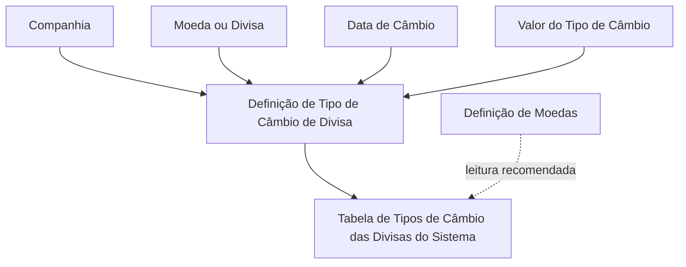

# Definição de Tipos de Câmbio das Divisas do Sistema — Documentação Reef

## 1. Metadados do Documento
- **Arquivo de Origem:** Não identificado no conteúdo extraído
- **Tipo de Documento:** Especificação Técnica / Documento Funcional
- **Domínio / Sistema:** Reef / Mapfre
- **Público-Alvo:** Analistas funcionais, desenvolvedores, operação e equipes responsáveis por configuração de divisas
- **Data/Versão Identificada:** Não identificada
- **Lifecycle Identificado:** Approved Source
- **Owner Identificado:** `user:agonzalez_mapfre.com`

---

## 2. Resumo Executivo & Contexto de Negócio

O documento define as propriedades utilizadas pelo sistema para cadastrar e operar os **Tipos de Câmbio das Divisas do Sistema**. A definição é associada a uma companhia e a uma moeda ou divisa específica.

A especificação distingue propriedades gerais, que identificam o contexto organizacional e monetário da definição, e propriedades operativas, que estabelecem a data de referência e o valor do tipo de câmbio aplicável à divisa.

O atributo de data representa a data na qual o sistema obtém o câmbio médio de compra e venda da divisa. O atributo de valor representa o montante do tipo de câmbio para uma data específica.

A principal restrição operacional explicitamente registrada é que o sistema permite a captura de **um único tipo de câmbio para uma determinada data**. O documento também recomenda a consulta ao documento relacionado **Definição de Moedas**, evitando interpretações isoladas da especificação de tipos de câmbio.

---

## 3. Arquitetura, Componentes & Tecnologias Envolvidas

O conteúdo não detalha arquitetura de software, APIs, bancos de dados, métodos HTTP, contratos JSON, microsserviços, ambientes técnicos ou tecnologias de implementação.

Os elementos funcionais explicitamente identificados são:

- **Sistema Reef:** Repositório ou sistema de documentação referido como “DOCUMENTACIÓN Reef”.
- **Mapfre:** Contexto corporativo identificado na navegação e no owner com domínio `mapfre.com`.
- **Tabela de Tipos de Câmbio das Divisas:** Estrutura funcional configurada por companhia, moeda/divisa, data de câmbio e valor de tipo de câmbio.
- **Definição de Moedas:** Documento funcional relacionado, recomendado para leitura complementar.
- **Documentación / DOCUMENTACIÓN Reef:** Área documental onde o material é classificado.
- **Lifecycle `Approved Source`:** Estado de ciclo de vida exibido para o documento.



> **Nota de Análise:** O documento não descreve componentes técnicos internos, fluxos de integração, armazenamento de dados, interfaces de usuário, APIs ou mecanismos de cálculo do câmbio médio.

---

## 4. Regras de Negócio, Especificações Funcionais & Processos

### 4.1 Propriedades gerais da definição

1. A propriedade **Companhia** informa ao sistema o código da companhia sobre a qual a definição da divisa está sendo realizada.
2. A propriedade **Moeda** informa o código da moeda ou divisa que está sendo definida.

### 4.2 Propriedades operativas da definição

1. A propriedade **Data de Câmbio** informa a data em que o sistema obtém o câmbio médio de compra e venda da divisa.
2. A propriedade **Valor do Tipo de Câmbio** informa o valor monetário do tipo de câmbio da divisa para uma data específica.

### 4.3 Restrição operacional

1. O sistema permite registrar ou capturar somente **um único tipo de câmbio** para uma determinada data.
2. Não há detalhamento adicional sobre o comportamento do sistema quando uma tentativa de registrar um segundo tipo de câmbio para a mesma data ocorre.
3. Não há detalhamento sobre moedas de origem e destino, fórmula de conversão, casas decimais, arredondamento, fuso horário, data de vigência ou fontes externas de cotação.

### 4.4 Dependência documental

1. A leitura do documento **Definição de Moedas** é recomendada.
2. A recomendação existe para reduzir o risco de interpretação incorreta caso o documento de tipos de câmbio seja consultado isoladamente.

---

## 5. Tabelas de Parâmetros, Ambientes e Estruturas de Dados

| Item / Parâmetro | Descrição / Função | Tipo / Valores / Formato | Ambiente / Observações |
| :--- | :--- | :--- | :--- |
| Companhia | Indica o código da companhia sobre a qual a definição da divisa está sendo realizada. | Código de companhia; formato não detalhado. | Propriedade geral. |
| Moeda | Indica o código da moeda ou divisa que está sendo definida. | Código de moeda ou divisa; formato não detalhado. | Propriedade geral. |
| Data de Câmbio | Indica a data em que o sistema obtém o câmbio médio de compra e venda da divisa. | Data; formato não detalhado. | Propriedade operativa. |
| Valor do Tipo de Câmbio | Indica o montante do tipo de câmbio da divisa para uma data específica. | Valor monetário; precisão e formato não detalhados. | Propriedade operativa. |
| Regra de unicidade | O sistema permite a captura de um único tipo de câmbio em uma data determinada. | Um único registro de tipo de câmbio por data. | Restrição operacional explícita. |
| Documento relacionado | Documento funcional recomendado para leitura complementar. | `Definição de Moedas`. | A leitura reduz risco de interpretação isolada. |
| Lifecycle | Estado documental exibido no conteúdo. | `Approved Source`. | Metadado da documentação. |
| Owner | Proprietário identificado no conteúdo. | `user:agonzalez_mapfre.com`. | Metadado da documentação. |
| Domínio documental | Área de documentação referenciada no conteúdo. | `DOCUMENTACIÓN Reef`. | Contexto Reef / Mapfre. |

---

## 6. Bateria de Perguntas & Respostas para RAG (FAQ Sintético)

### P1: Qual é a finalidade da definição de tipos de câmbio das divisas no sistema?
**R:** A definição de tipos de câmbio das divisas registra o contexto de companhia, a moeda ou divisa, a data de câmbio e o valor do tipo de câmbio aplicável. O documento não descreve fórmulas de conversão nem integrações externas.

### P2: O que representa a propriedade Companhia na definição de uma divisa?
**R:** A propriedade Companhia indica o código da companhia sobre a qual a definição da divisa está sendo realizada no sistema.

### P3: O que representa a propriedade Moeda?
**R:** A propriedade Moeda indica o código da moeda ou divisa que está sendo definida na tabela de tipos de câmbio das divisas do sistema.

### P4: O que é a Data de Câmbio?
**R:** A Data de Câmbio é o atributo que indica a data em que o sistema obtém o câmbio médio de compra e venda da divisa.

### P5: O que deve ser preenchido no Valor do Tipo de Câmbio?
**R:** O Valor do Tipo de Câmbio deve informar o montante do tipo de câmbio da divisa para uma data específica. O documento não define formato, moeda, precisão decimal ou regra de arredondamento para esse valor.

### P6: É possível registrar mais de um tipo de câmbio na mesma data?
**R:** Não. O documento estabelece que o sistema somente permite a captura de um único tipo de câmbio para uma data determinada.

### P7: Qual documento deve ser consultado junto com a definição de tipos de câmbio?
**R:** O documento recomenda a leitura de **Definição de Moedas**, pois a interpretação isolada da documentação de tipos de câmbio pode conduzir a erro.

### P8: O documento informa como o câmbio médio de compra e venda é calculado?
**R:** Não. O documento somente informa que a Data de Câmbio indica a data em que o sistema obtém o câmbio médio de compra e venda da divisa. A fórmula, fonte de dados e processo de obtenção não são detalhados.

### P9: O documento informa qual tecnologia, API ou microsserviço gerencia os tipos de câmbio?
**R:** Não. O conteúdo não identifica tecnologias, APIs, métodos HTTP, contratos JSON, bancos de dados, microsserviços ou rotas de integração responsáveis pela gestão de tipos de câmbio.

### P10: Quais são as propriedades gerais da definição de divisa?
**R:** As propriedades gerais são Companhia, que identifica o código da companhia, e Moeda, que identifica o código da moeda ou divisa definida.

### P11: Quais são as propriedades operativas da definição de divisa?
**R:** As propriedades operativas são Data de Câmbio, que identifica a data de obtenção do câmbio médio de compra e venda, e Valor do Tipo de Câmbio, que informa o montante do tipo de câmbio para uma data específica.

### P12: Qual é o estado de ciclo de vida identificado para o documento?
**R:** O conteúdo apresenta o lifecycle `Approved Source`.

---

## 7. Glossário de Termos, Siglas & Conceitos-Chave

- **Câmbio médio de compra e venda:** Valor mencionado como obtido pelo sistema na data indicada pelo atributo Data de Câmbio. A fórmula de cálculo não é detalhada.
- **Companhia:** Código da organização sobre a qual a definição da divisa é realizada.
- **Data de Câmbio:** Data em que o sistema obtém o câmbio médio de compra e venda da divisa.
- **Definição de Moedas:** Documento relacionado cuja leitura é recomendada.
- **Divisa:** Moeda configurada na definição de tipos de câmbio.
- **Lifecycle:** Metadado de ciclo de vida documental; o valor identificado é `Approved Source`.
- **Moeda:** Código da moeda ou divisa que está sendo definida.
- **Reef:** Nome presente na área documental “DOCUMENTACIÓN Reef”.
- **Tipo de Câmbio:** Valor aplicável a uma divisa em uma data específica.
- **Valor do Tipo de Câmbio:** Montante do tipo de câmbio da divisa para uma data específica.

---

## 8. Notas Críticas, Riscos & Limitações

- O documento não informa o nome do arquivo de origem, versão, data de publicação ou autor formal; somente apresenta o owner `user:agonzalez_mapfre.com`.
- O conteúdo não explica como o sistema calcula ou obtém o câmbio médio de compra e venda.
- Não há definição de formato de data, número de casas decimais, moeda de referência, arredondamento, regras de vigência ou validações de consistência.
- A restrição de unicidade informa um único tipo de câmbio por data, mas não define a chave completa da regra — por exemplo, se a unicidade considera companhia, moeda/divisa e data conjuntamente.
- Não há detalhe sobre alteração, exclusão, auditoria, aprovação, carga em massa ou tratamento de registros duplicados.
- Não são descritos ambientes, URLs, servidores, usuários técnicos, permissões, logs, APIs, bancos de dados ou integrações.
- A interpretação isolada apresenta risco funcional; o próprio documento recomenda a consulta à documentação de **Definição de Moedas**.

---

## 9. Conteúdo Bruto Estruturado (Referência Fiel)

```text
--- [PÁGINA 1 DE 1] ---

DEFINICIÓN de Tipos de Cambio de las Divisas del Sistema
Propiedades Generales
Compañía
Esta propiedad le indica al sistema el código de la compañía sobre la que se está realizando la denición de la Divisa.
Moneda
Esta propiedad indica el código de la Moneda o Divisa que se está deniendo.
Propiedades Operativas
Fecha de Cambio
Este Atributo indica en el Sistema la fecha en la que se obtiene el cambio medio de compra y venta de la Divisa.
Valor del Tipo de Cambio
Este Atributo indica en el Sistema el Importe del Tipo de cambio de la Divisa para una fecha especíca.
Vínculos
Relación de Directrices y Documentos funcionales cuya lectura recomendada para evitar que la interpretación aislada del presente
documento pueda conducir a error.
Denición de Monedas
Preguntas frecuentes
(1) ¿Existe alguna aclaración operativa que deba ser tomada en consideración en el uso y denición de la tabla de Tipos de Cambio de las
Divisas del Sistema?
El Sistema solamente permite la captura de un único tipo de cambio a una fecha determinada.
Documentation / DOCUMENTACIÓN Reef
DOCUMENTACIÓN Reef
Mapfredocument
DOCUMENTACIÓN Reef
Owner
user:agonzalez_mapfre.com
Lifecycle
Approved Source
 / 
 VL
Buscar Inicio Soluciones Arquitecturas APIs Componentes Cloud Documentación Zeus Reef Ayuda
ES
```
