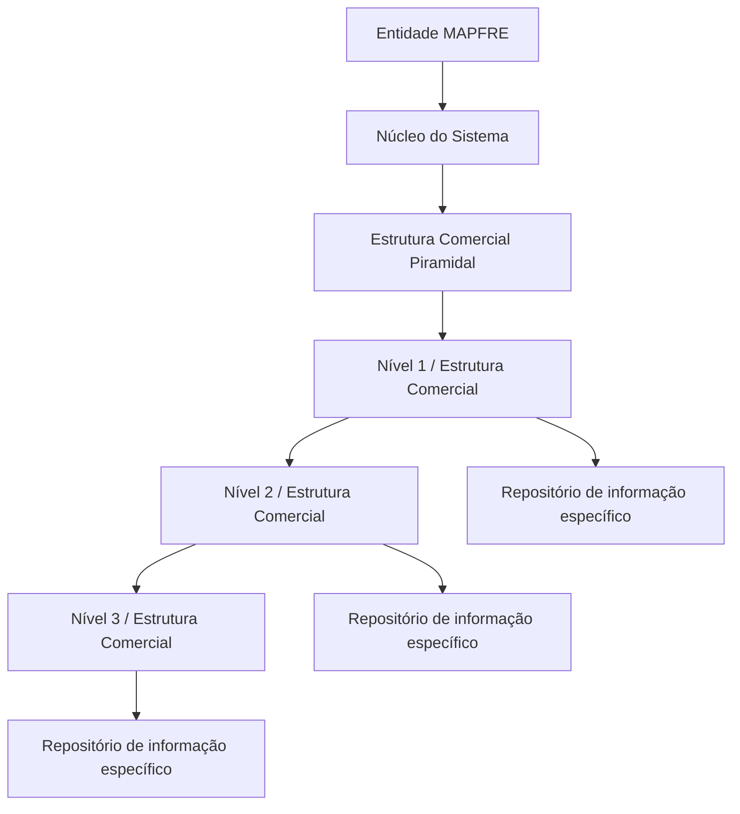

# Estrutura Comercial MAPFRE — Definição e Codificação Piramidal em Reef

## 1. Metadados do Documento
- **Arquivo de Origem:** `Não identificado no conteúdo fornecido`
- **Tipo de Documento:** `Documentação funcional`
- **Domínio / Sistema:** `MAPFRE / Reef / Estrutura Comercial`
- **Público-Alvo:** `Não explicitamente identificado`
- **Data/Versão Identificada:** `Não identificada`

---

## 2. Resumo Executivo & Contexto de Negócio

O documento descreve modelos de organização comercial aplicáveis a empresas e contextualiza a estrutura comercial utilizada por entidades seguradoras MAPFRE. A organização comercial deve ser adaptada aos objetivos, à estrutura, às necessidades, à dimensão e à atividade de cada empresa.

São apresentados cinco modelos usuais de organização comercial: por funções, por produtos, geográfica, por clientes e mista. Cada modelo estabelece um critério diferente para dividir departamentos, responsabilidades e especializações comerciais.

Para entidades seguradoras MAPFRE, o documento afirma que as organizações comerciais tradicionalmente possuem estrutura geográfica ou mista, dependendo do tamanho da companhia. A estrutura mista pode combinar zonas geográficas com segmentação posterior por clientes ou produtos.

No núcleo do Sistema, a estrutura comercial da entidade MAPFRE pode ser codificada em uma estrutura piramidal de três níveis. Os três níveis possuem repositórios de informação específicos e são entregues inicialmente às instalações sem conteúdo.

---

## 3. Arquitetura, Componentes & Tecnologias Envolvidas

Os elementos identificados no documento são:

| Componente / Conceito | Papel identificado |
| :--- | :--- |
| MAPFRE | Entidades seguradoras cujo modelo de organização comercial é contextualizado no documento. |
| Sistema | Núcleo funcional com capacidade de codificar a estrutura comercial MAPFRE. |
| Estrutura Comercial | Organização codificada em formato piramidal de três níveis. |
| Nível 1 / Estrutura Comercial | Primeiro nível da estrutura piramidal. |
| Nível 2 / Estrutura Comercial | Segundo nível da estrutura piramidal. |
| Nível 3 / Estrutura Comercial | Terceiro nível da estrutura piramidal. |
| Repositórios de informação específicos | Repositórios associados à codificação dos níveis da estrutura comercial. |
| Reef | Contexto documental apresentado na navegação como “DOCUMENTACIÓN Reef”. |
| Mapfredocument | Nome apresentado na navegação documental. |
| Zeus | Item apresentado na navegação documental. |



**Nota de Análise:** O documento não informa nomes técnicos dos repositórios, modelo de dados, métodos de integração, APIs, tecnologias de persistência, permissões ou regras de preenchimento dos três níveis.

---

## 4. Regras de Negócio, Especificações Funcionais & Processos

### 4.1 Critério geral para definição da organização comercial

Toda empresa possui uma organização comercial adaptada aos seguintes fatores:

- Objetivos.
- Estrutura.
- Necessidades.
- Dimensão.
- Atividade.

### 4.2 Organização Comercial por Funções

A organização comercial por funções separa as atividades da empresa em diferentes departamentos.

Regras e características descritas:

1. Cada departamento executa funções segundo o princípio de especialização.
2. Todos os departamentos são coordenados pela direção ou por níveis superiores.
3. A divisão organizacional é baseada em funções, e não em produtos, clientes ou territórios.

### 4.3 Organização Comercial por Produtos

A organização comercial por produtos é aplicada a companhias que comercializam:

- Produtos muito diferentes entre si; ou
- Várias linhas de produtos diferentes.

Regras e características descritas:

1. Um departamento é atribuído a cada produto ou linha de produto.
2. Cada produto é organizado funcionalmente.
3. A segmentação principal ocorre por produto ou linha de produtos.

### 4.4 Organização Comercial Geográfica

A organização comercial geográfica subdivide a empresa em vários departamentos.

Regras e características descritas:

1. Existe um departamento para cada zona geográfica na qual a empresa desenvolve a sua atividade.
2. O modelo é eficaz quando a empresa atua em territórios muito diferentes.
3. Circunstâncias territoriais podem justificar atuações comerciais diferenciadas.
4. A segmentação principal ocorre por zona geográfica.

### 4.5 Organização Comercial por Clientes

A organização comercial por clientes é estabelecida quando a empresa vende produtos para grupos de clientes muito diferenciados.

Exemplos de grupos citados:

- Grandes superfícies.
- Retalhistas.
- Agrupamentos de minoristas.
- Grandes empresas.
- Administração pública.

### 4.6 Organização Comercial Mista

A organização comercial mista tende a ocorrer quando as empresas alcançam grandes dimensões e a organização se torna mais complexa.

Regras e características descritas:

1. A estrutura pode combinar mais de um modelo organizacional.
2. A empresa pode adotar uma organização geográfica por zonas.
3. Dentro de cada zona geográfica, a empresa pode organizar-se por clientes ou por produtos.
4. A organização mista resulta da combinação de critérios geográficos, de clientes e/ou de produtos.

### 4.7 Contexto das entidades seguradoras MAPFRE

Para entidades seguradoras MAPFRE, o documento informa que as organizações comerciais costumam ter:

- Estrutura geográfica; ou
- Estrutura mista.

A escolha entre estrutura geográfica e mista depende do tamanho da companhia.

### 4.8 Codificação da estrutura comercial no Sistema

O núcleo do Sistema possui capacidade para codificar a estrutura comercial da entidade MAPFRE como uma pirâmide de três níveis:

1. Nível 1 / Estrutura Comercial.
2. Nível 2 / Estrutura Comercial.
3. Nível 3 / Estrutura Comercial.

Cada nível está associado a repositórios de informação específicos. Os repositórios são entregues inicialmente às instalações vazios de conteúdo.

---

## 5. Tabelas de Parâmetros, Ambientes e Estruturas de Dados

| Item / Parâmetro | Descrição / Função | Tipo / Valores / Formato | Ambiente / Observações |
| :--- | :--- | :--- | :--- |
| Organização Comercial por Funções | Separa atividades da empresa em departamentos especializados. | Modelo organizacional. | Departamentos coordenados pela direção ou níveis superiores. |
| Organização Comercial por Produtos | Atribui departamentos a produtos ou linhas de produtos. | Modelo organizacional. | Aplicável quando existem produtos muito diferentes ou várias linhas de produtos. |
| Organização Comercial Geográfica | Subdivide a empresa por zonas geográficas. | Modelo organizacional. | Indicada para territórios diferentes que exigem atuações comerciais diferenciadas. |
| Organização Comercial por Clientes | Organiza a atividade comercial por grupos de clientes diferenciados. | Modelo organizacional. | Exemplos: grandes superfícies, retalhistas, grandes empresas e administração pública. |
| Organização Comercial Mista | Combina critérios organizacionais. | Modelo organizacional. | Pode combinar zonas geográficas com organização por clientes ou produtos. |
| Estrutura Comercial MAPFRE | Estrutura comercial da entidade MAPFRE codificável pelo núcleo do Sistema. | Estrutura piramidal. | Possui três níveis. |
| Nível 1 / Estrutura Comercial | Primeiro nível da pirâmide comercial. | Nível estrutural. | Associado a repositório específico; conteúdo inicial vazio. |
| Nível 2 / Estrutura Comercial | Segundo nível da pirâmide comercial. | Nível estrutural. | Associado a repositório específico; conteúdo inicial vazio. |
| Nível 3 / Estrutura Comercial | Terceiro nível da pirâmide comercial. | Nível estrutural. | Associado a repositório específico; conteúdo inicial vazio. |
| Repositórios de informação específicos | Armazenam informação dos níveis da estrutura comercial. | Repositórios de informação. | Entregues inicialmente vazios de conteúdo. |
| Reef | Contexto de documentação exibido na navegação. | Plataforma ou área documental não detalhada. | O documento não especifica funcionalidades técnicas de Reef. |
| Mapfredocument | Item exibido na navegação documental. | Nome apresentado no conteúdo. | Sem detalhamento adicional. |
| Zeus | Item exibido na navegação documental. | Nome apresentado no conteúdo. | Sem detalhamento adicional. |

---

## 6. Bateria de Perguntas & Respostas para RAG (FAQ Sintético)

### P1: Quais modelos de organização comercial são apresentados no documento?
**R:** O documento apresenta cinco modelos de organização comercial: por funções, por produtos, geográfica, por clientes e mista. A escolha do modelo deve ser adaptada aos objetivos, à estrutura, às necessidades, à dimensão e à atividade da empresa.

### P2: Como funciona uma organização comercial por funções?
**R:** Na organização comercial por funções, as atividades da empresa são separadas em diferentes departamentos. Cada departamento realiza funções segundo o princípio de especialização, enquanto a direção ou níveis superiores coordenam todos os departamentos.

### P3: Em que situação uma empresa deve utilizar uma organização comercial por produtos?
**R:** A organização comercial por produtos aplica-se a companhias que comercializam produtos muito diferentes entre si ou diversas linhas de produtos. Nesse modelo, cada produto ou linha de produto recebe um departamento próprio, e cada produto é organizado funcionalmente.

### P4: Quando a organização comercial geográfica é considerada eficaz?
**R:** A organização comercial geográfica é eficaz quando a empresa atua em territórios muito diferentes e as circunstâncias desses territórios exigem atuações comerciais diferenciadas. A empresa é subdividida em departamentos, com um departamento para cada zona geográfica.

### P5: Quais grupos de clientes são citados como exemplo para a organização comercial por clientes?
**R:** O documento cita grandes superfícies, retalhistas, agrupamentos de minoristas, grandes empresas e administração pública como exemplos de grupos de clientes diferenciados que podem justificar uma organização comercial por clientes.

### P6: O que caracteriza uma organização comercial mista?
**R:** A organização comercial mista ocorre normalmente quando empresas atingem grandes dimensões e a estrutura organizacional se torna mais complexa. Ela pode combinar organização geográfica por zonas com organização interna por clientes ou por produtos.

### P7: Qual é a estrutura comercial tradicionalmente utilizada por entidades seguradoras MAPFRE?
**R:** O documento informa que as organizações comerciais das entidades seguradoras MAPFRE costumam possuir uma estrutura geográfica ou mista. A escolha depende do tamanho da companhia.

### P8: Quantos níveis existem na estrutura comercial codificável pelo núcleo do Sistema?
**R:** O núcleo do Sistema pode codificar a estrutura comercial da entidade MAPFRE em uma estrutura piramidal de três níveis: Nível 1 / Estrutura Comercial, Nível 2 / Estrutura Comercial e Nível 3 / Estrutura Comercial.

### P9: Como são entregues inicialmente os repositórios de informação dos níveis comerciais?
**R:** Os repositórios de informação específicos associados aos três níveis da estrutura comercial são entregues inicialmente às instalações vazios de conteúdo.

### P10: O documento detalha APIs, contratos JSON ou tecnologias dos repositórios da estrutura comercial?
**R:** Não. O documento afirma apenas que existem repositórios de informação específicos para os três níveis da estrutura comercial. Não são detalhados APIs, contratos JSON, tecnologias de persistência, nomes de bases de dados, métodos de integração ou regras de acesso.

---

## 7. Glossário de Termos, Siglas & Conceitos-Chave

- **MAPFRE:** Entidades seguradoras mencionadas como contexto de aplicação das estruturas comerciais geográfica ou mista.
- **Estrutura Comercial:** Organização da atividade comercial de uma empresa, adaptada a objetivos, estrutura, necessidades, dimensão e atividade.
- **Organização por Funções:** Modelo que divide atividades em departamentos especializados por função.
- **Organização por Produtos:** Modelo que divide departamentos por produto ou linha de produtos.
- **Organização Geográfica:** Modelo que divide departamentos por zonas geográficas.
- **Organização por Clientes:** Modelo que divide a atividade comercial por grupos de clientes diferenciados.
- **Organização Mista:** Modelo que combina dois ou mais critérios de organização comercial.
- **Estrutura Piramidal:** Estrutura hierárquica apresentada com três níveis de estrutura comercial.
- **Reef:** Nome apresentado no contexto de navegação da documentação.
- **Mapfredocument:** Nome apresentado no contexto de navegação documental.
- **Zeus:** Nome apresentado no contexto de navegação documental.

---

## 8. Notas Críticas, Riscos & Limitações

- O documento não identifica o arquivo de origem, data, versão, autor técnico ou responsável funcional; apenas apresenta o usuário `agonzalez_mapfre.com` como Owner no conteúdo extraído.
- O documento não especifica os nomes, atributos, chaves, relacionamentos ou regras de integridade dos repositórios associados aos níveis da estrutura comercial.
- Não há detalhamento de como os níveis 1, 2 e 3 se relacionam funcionalmente além da indicação de uma estrutura piramidal.
- Não há definição de operações de cadastro, atualização, exclusão, consulta, aprovação, auditoria ou controle de acesso para a estrutura comercial.
- Não são informados ambientes, URLs, servidores, APIs, formatos de integração, tecnologias, versões ou mecanismos de autenticação.
- **Nota de Análise:** O documento lista Reef, Mapfredocument e Zeus na navegação documental, mas não detalha os papéis técnicos ou funcionais desses elementos.
- **Nota de Análise:** O documento não estabelece critérios formais para escolher entre estrutura geográfica e estrutura mista nas entidades MAPFRE, além de indicar que a escolha depende do tamanho da companhia.

---

## 9. Conteúdo Bruto Estruturado (Referência Fiel)

```text
--- [PÁGINA 1 DE 2] ---

DEFINICIÓN de la ESTRUCTURA COMERCIAL
Contexto
Todas las Empresas tienen una Organización Comercial adaptada a sus objetivos, estructura, necesidades, dimensión y actividad.
Las formas más usuales de Organización Comercial de una compañía son:
Por Funciones.
Por Productos.
Geográca.
Por Clientes y
Mixta.
La Organización Comercial por Funciones consiste en separar las actividades de la empresa en diferentes departamentos, en cada uno de
ellos se realizan funciones según el principio de especialización y, a su vez, todos los departamentos están coordinados por la dirección o
niveles superiores.
La Organización Comercial por Productos se aplica a compañías que comercializan productos muy diferentes entre sí, o varias líneas de
productos diferentes. Consiste en asignar un departamento a cada producto o línea de productos y, a su vez, cada producto se organiza
funcionalmente.
La Organización Comercial Geográca consiste en subdividir la empresa en varios departamentos, uno para cada zona geográca en la que
la empresa desarrolla su actividad. Esta Organización es ecaz cuando la empresa actúa en territorios muy diferentes donde, por ejemplo, las
circunstancias motivan actuaciones comerciales diferenciadas.
La Organización Comercial por Clientes se establece cuando la empresa vende productos a grupos de clientes muy diferenciados, por
ejemplo, a grandes supercies, detallistas, agrupaciones de minoristas, a grandes empresas, a la administración pública,...
La Organización Comercial Mixta suele darse cuando las empresas alcanzan grandes dimensiones, la organización se va haciendo cada vez
más complicada y surgen las estructuras mixtas: pueden adoptar una Organización Geográca por zonas y dentro de cada una de ellas se
pueden organizar por Clientes o por Productos,...
Tradicionalmente en el caso de las entidades aseguradoras de MAPFRE las organizaciones comerciales suelen tener una estructura
Geográca o Mixta en función del tamaño de la compañía.
Denominaciones de los Niveles de la Estructura Comercial
Denominaciones de los Niveles de la Estructura Comercial
Documentation / DOCUMENTACIÓN Reef
DOCUMENTACIÓN Reef
Mapfredocument
DOCUMENTACIÓN Reef
Owner
user:agonzalez_mapfre.com
Lifecycle
Approved Source
 / 
 VL
Buscar Inicio Soluciones Arquitecturas APIs Componentes Cloud Documentación Zeus Reef Ayuda
ES


--- [PÁGINA 2 DE 2] ---

Niveles de la Estructura Comercial
Funcionalmente, el núcleo del Sistema cuenta con la posibilidad de codicar la estructura comercial de la entidad MAPFRE en una estructura
piramidal de tres niveles en repositorios de información especícos que se entregan inicialmente a las instalaciones vacíos de contenido:
Nivel 1 / Estructura Comercial
Nivel 2 / Estructura Comercial
Nivel 3 / Estructura Comercial
```
