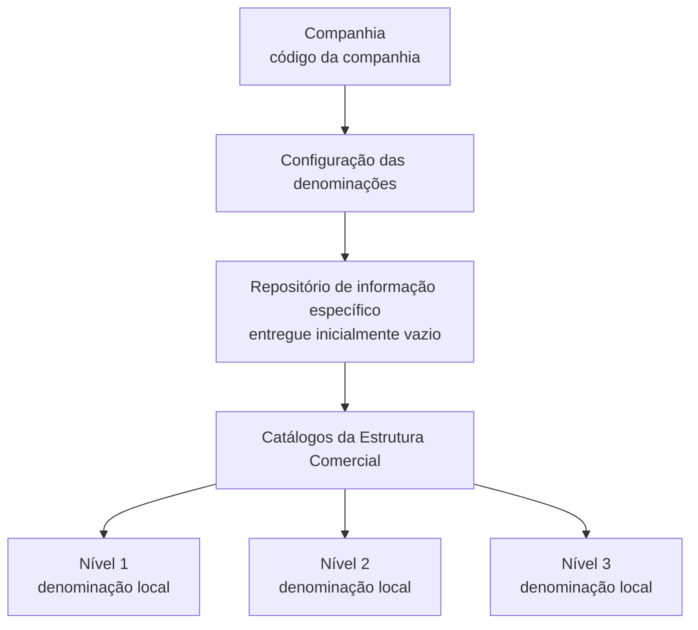

# Definição das Denominações dos Níveis da Estrutura Comercial

## 1. Metadados do Documento
- **Arquivo de Origem:** Não identificado no conteúdo fornecido
- **Tipo de Documento:** Especificação Funcional
- **Domínio / Sistema:** Reef — Estrutura Comercial
- **Público-Alvo:** Analistas funcionais, equipes de configuração e operação do sistema
- **Data/Versão Identificada:** Não identificada

---

## 2. Resumo Executivo & Contexto de Negócio

O documento descreve a funcionalidade de definição das denominações dos níveis da **Estrutura Comercial** no núcleo do sistema Reef. A funcionalidade permite que cada entidade configure os nomes locais dos três níveis presentes nos catálogos que compõem sua estrutura comercial.

A configuração é armazenada em um repositório de informação específico, entregue inicialmente sem conteúdo às instalações. Essa característica indica que as denominações dos níveis não são pré-preenchidas pelo sistema e devem ser definidas conforme os nomes, convenções e costumes locais da entidade.

A configuração considera uma companhia específica, identificada por seu código. Para cada nível da estrutura comercial, o documento apresenta atributos destinados à denominação local, à descrição e à descrição abreviada.

Como exemplo, o documento apresenta uma configuração aplicável à MAPFRE Espanha: nível 1 como “Territorial”, nível 2 como “Sub Central” e nível 3 como “Oficina / Sucursal”. O conteúdo também recomenda a consulta a diretrizes e documentos funcionais relacionados, pois a interpretação isolada pode conduzir a erro.

---

## 3. Arquitetura, Componentes & Tecnologias Envolvidas

Os elementos explicitamente citados são:

| Componente / Elemento | Papel descrito |
| :--- | :--- |
| **Reef** | Sistema cuja documentação contém a especificação da Estrutura Comercial. |
| **Núcleo do Sistema** | Contempla a facilidade de denominar os três níveis dos catálogos da Estrutura Comercial. |
| **Estrutura Comercial** | Estrutura composta por três níveis configuráveis com denominações locais. |
| **Catálogos** | Contêm a Estrutura Comercial da entidade. |
| **Repositório de informação específico** | Repositório onde a configuração das denominações é entregue inicialmente vazia. |
| **Companhia** | Contexto identificado por código para o qual a configuração é realizada. |
| **Mapfredocument** | Referência citada na seção de vínculos/documentação. |
| **Zeus** | Item presente na navegação da documentação, sem detalhamento funcional adicional. |
| **Cloud** | Item presente na navegação da documentação, sem detalhamento técnico adicional. |



> **Nota de Análise:** O conteúdo fornecido não detalha arquitetura de infraestrutura, integrações, APIs, métodos HTTP, contratos JSON, banco de dados, tecnologias de implementação ou ambientes técnicos.

---

## 4. Regras de Negócio, Especificações Funcionais & Processos

### 4.1 Configuração de denominações locais

1. O núcleo do sistema deve permitir denominar os três níveis existentes nos catálogos que contêm a Estrutura Comercial da entidade.
2. As denominações podem ser configuradas segundo nomes e costumes locais.
3. A informação de configuração deve residir em um repositório de informação específico.
4. O repositório de informação específico é entregue inicialmente às instalações sem conteúdo.
5. A configuração deve ser realizada no contexto de uma companhia, identificada por um código de companhia.

### 4.2 Atributos funcionais descritos

- **Companhia:** indica ao sistema o código da companhia sobre a qual é realizada a configuração da denominação do nível da estrutura comercial.
- **Chave do Nível da Estrutura:** contém a denominação local pela qual será identificado o primeiro nível da estrutura geográfica.
- **Descrição do Nível da Estrutura:** contém a denominação local pela qual será identificado o primeiro nível da estrutura geográfica.
- **Descrição Abreviada do Nível da Estrutura:** contém a abreviatura da denominação local pela qual será identificado o primeiro nível da estrutura geográfica.

> **Nota de Análise:** O texto fornecido associa os três atributos de nível à identificação do “Primeiro Nível” da estrutura geográfica. Não há detalhamento equivalente para os níveis 2 e 3, nem explicação sobre diferenças funcionais entre “Chave”, “Descrição” e “Descrição Abreviada”.

### 4.3 Exemplo de denominações locais

Para uma configuração de MAPFRE Espanha, o documento apresenta:

1. Nível 1: Territorial.
2. Nível 2: Sub Central.
3. Nível 3: Oficina / Sucursal.

### 4.4 Dependência documental

O documento informa que há relação com diretrizes e documentos funcionais cuja leitura é recomendada para evitar erro decorrente da interpretação isolada da especificação.

---

## 5. Tabelas de Parâmetros, Ambientes e Estruturas de Dados

| Item / Parâmetro | Descrição / Função | Tipo / Valores / Formato | Ambiente / Observações |
| :--- | :--- | :--- | :--- |
| Companhia | Indica o código da companhia para a qual a denominação de nível está sendo configurada. | Código de companhia; formato não especificado. | Aplicável à configuração da Estrutura Comercial. |
| Chave do Nível da Estrutura | Contém a denominação local pela qual será identificado o primeiro nível da estrutura geográfica. | Texto; formato não especificado. | O documento não esclarece uso para níveis 2 e 3. |
| Descrição do Nível da Estrutura | Contém a denominação local pela qual será identificado o primeiro nível da estrutura geográfica. | Texto; formato não especificado. | O documento não diferencia este atributo da chave do nível. |
| Descrição Abreviada do Nível da Estrutura | Contém a abreviatura da denominação local pela qual será identificado o primeiro nível da estrutura geográfica. | Texto abreviado; formato não especificado. | O documento não informa tamanho máximo, validações ou convenções. |
| Repositório de informação específico | Armazena as denominações dos três níveis dos catálogos da Estrutura Comercial. | Repositório; tecnologia não especificada. | Entregue inicialmente vazio às instalações. |

### Exemplo de configuração: MAPFRE Espanha

| Nível da Estrutura | Denominação Local | Observações |
| :--- | :--- | :--- |
| 1 | Territorial | Exemplo apresentado para MAPFRE Espanha. |
| 2 | Sub Central | Exemplo apresentado para MAPFRE Espanha. |
| 3 | Oficina / Sucursal | Exemplo apresentado para MAPFRE Espanha. |

### Referências documentais citadas

| Item / Referência | Descrição disponível no conteúdo |
| :--- | :--- |
| Documentation / DOCUMENTACIÓN Reef | Referência presente na seção de vínculos. |
| DOCUMENTACIÓN Reef | Referência repetida no conteúdo. |
| Mapfredocument | Referência presente na seção de vínculos. |
| Owner | `user:agonzalez_mapfre.com` |
| Lifecycle | `Approved Source` |
| VL | Valor exibido na área de navegação; significado não detalhado. |

---

## 6. Bateria de Perguntas & Respostas para RAG (FAQ Sintético)

### P1: Qual é o objetivo da funcionalidade de denominação dos níveis da Estrutura Comercial?
**R:** A funcionalidade permite que o núcleo do sistema denomine os três níveis presentes nos catálogos que contêm a Estrutura Comercial da entidade. As denominações podem seguir os nomes e costumes locais de cada entidade.

### P2: Onde são armazenadas as denominações locais da Estrutura Comercial?
**R:** As denominações são armazenadas em um repositório de informação específico. O documento informa que esse repositório é entregue inicialmente às instalações sem conteúdo.

### P3: Quantos níveis da Estrutura Comercial podem receber denominações locais?
**R:** O documento informa que existem três níveis nos catálogos que contêm a Estrutura Comercial e que o sistema permite definir denominações para esses três níveis.

### P4: Qual atributo identifica a companhia da configuração?
**R:** O atributo **Companhia** informa o código da companhia sobre a qual está sendo realizada a configuração da denominação do nível da Estrutura Comercial.

### P5: O que representa a Chave do Nível da Estrutura?
**R:** Segundo o documento, a Chave do Nível da Estrutura contém a denominação local pela qual será identificado o primeiro nível da estrutura geográfica.

### P6: Qual é a finalidade da Descrição Abreviada do Nível da Estrutura?
**R:** A Descrição Abreviada do Nível da Estrutura contém a abreviatura da denominação local pela qual será identificado o primeiro nível da estrutura geográfica.

### P7: Quais denominações locais são usadas no exemplo de MAPFRE Espanha?
**R:** O exemplo de MAPFRE Espanha apresenta “Territorial” para o nível 1, “Sub Central” para o nível 2 e “Oficina / Sucursal” para o nível 3.

### P8: O documento especifica métodos HTTP ou contratos de API para a configuração da Estrutura Comercial?
**R:** Não. O conteúdo fornecido não descreve APIs, métodos HTTP, endpoints, contratos JSON, integrações ou tecnologias de implementação.

### P9: Há recomendações para interpretar corretamente a especificação?
**R:** Sim. O documento recomenda a leitura das diretrizes e dos documentos funcionais relacionados para evitar que uma interpretação isolada da especificação conduza a erro.

### P10: O repositório de configuração já vem preenchido durante a instalação?
**R:** Não. O documento afirma que o repositório de informação específico é entregue inicialmente às instalações vazio de conteúdo.

---

## 7. Glossário de Termos, Siglas & Conceitos-Chave

- **Reef:** Sistema ou domínio documental no qual está inserida a especificação de Estrutura Comercial.
- **Estrutura Comercial:** Estrutura presente em catálogos da entidade e composta por três níveis configuráveis.
- **Estrutura Geográfica:** Termo usado pelo documento ao descrever a identificação do primeiro nível mediante denominação local.
- **Companhia:** Entidade identificada por código e usada como contexto da configuração das denominações.
- **Denominação Local:** Nome utilizado para identificar um nível segundo os nomes e costumes locais.
- **Descrição Abreviada:** Abreviatura da denominação local de um nível da estrutura.
- **MAPFRE Espanha:** Exemplo de configuração de denominações locais apresentado no documento.
- **Mapfredocument:** Referência documental citada; sem definição adicional no conteúdo.
- **VL:** Sigla ou valor apresentado na navegação do documento; significado não identificado no conteúdo.

---

## 8. Notas Críticas, Riscos & Limitações

- O documento não identifica o nome do arquivo de origem, data, versão ou autor do conteúdo.
- A especificação não apresenta detalhes de APIs, integrações, segurança, persistência, banco de dados, permissões, trilhas de auditoria ou infraestrutura.
- Não há definição de tipos de dados, formatos, tamanhos máximos, obrigatoriedade, unicidade ou regras de validação para os atributos apresentados.
- Embora a funcionalidade trate de três níveis, as descrições dos atributos “Chave”, “Descrição” e “Descrição Abreviada” mencionam explicitamente apenas o primeiro nível da estrutura geográfica.
- O documento não explica como os níveis 2 e 3 devem ser associados aos atributos descritos.
- A interpretação isolada é explicitamente considerada um risco pelo próprio documento; a consulta às diretrizes e documentos funcionais relacionados é recomendada.
- O texto apresenta caracteres de codificação corrompidos em palavras como “especíco”, “conguración” e “Geográca”. A preservação desses caracteres na referência bruta permite auditoria da extração original.

---

## 9. Conteúdo Bruto Estruturado (Referência Fiel)

```text
--- [PÁGINA 1 DE 2] ---

DEFINICIÓN de las Denominaciones de los Niveles de la Estructura
Comercial
Propiedades Generales
Funcionalmente, el núcleo del Sistema contempla la facilidad de poder denominar (de acuerdo con los nombres y costumbres locales) las
denominaciones de los Tres Niveles en los Catálogos que contienen la Estructura Comercial de la entidad, en un repositorio de información
especíco que se entrega inicialmente a las instalaciones vacío de contenido.
Compañía.
Esta propiedad le indica al sistema el código de la compañía sobre la que se está realizando la conguración de la Denominación del Nivel de
la estructura comercial.
Clave del Nivel de la Estructura
Este atributo contiene la denominación local por la cual será identicada el Primer Nivel de la estructura Geográca.
Descripción del Nivel de la Estructura
Este atributo contiene la denominación local por la cual será identicada el Primer Nivel de la estructura Geográca.
Descripción Abreviada del Nivel de la Estructura
Este atributo contiene la abreviatura de la denominación local por la cual será identicada el Primer Nivel de la estructura Geográca.
A modo de ejemplo y si la conguración fuera la realizada para MAPFRE España:
Nivel de la Estructura Denominación Local
1 Territorial
2 Sub Central
3 Ocina / Sucursal
Vínculos
Relación de Directrices y Documentos funcionales cuya lectura recomendada para evitar que la interpretación aislada del presente
documento pueda conducir a error.
Documentation / DOCUMENTACIÓN Reef
DOCUMENTACIÓN Reef
Mapfredocument
DOCUMENTACIÓN Reef
Owner
user:agonzalez_mapfre.com
Lifecycle
Approved Source
 / 
 VL
Buscar Inicio Soluciones Arquitecturas APIs Componentes Cloud Documentación Zeus Reef Ayuda
ES


--- [PÁGINA 2 DE 2] ---

Estructura Comercial
Preguntas frecuentes
```
