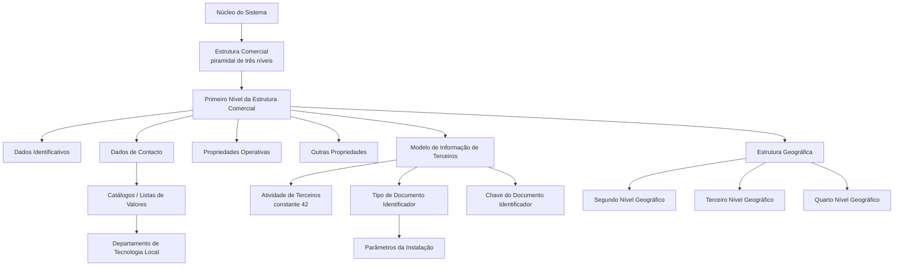

# Definição do Primeiro Nível da Estrutura Comercial — MAPFRE / Reef

## 1. Metadados do Documento
- **Arquivo de Origem:** Não identificado; conteúdo bruto extraído de documentação Reef / Mapfredocument.
- **Tipo de Documento:** Especificação Técnica / Funcional.
- **Domínio / Sistema:** Estrutura Comercial, Modelo de Informação de Terceiros, Estrutura Geográfica e Canais de Distribuição.
- **Público-Alvo:** Desenvolvedores, Arquitetos, Operação, Tecnologia Local e analistas funcionais.
- **Data/Versão Identificada:** Não identificada.
- **Owner identificado no conteúdo:** `user:agonzalez_mapfre.com`.
- **Lifecycle identificado no conteúdo:** `Approved Source`.

---

## 2. Resumo Executivo & Contexto de Negócio

O documento define os atributos e características do **Primeiro Nível da Estrutura Comercial** de uma entidade MAPFRE. O núcleo do sistema permite codificar a Estrutura Comercial em uma estrutura piramidal de três níveis, utilizando repositórios de informação específicos que são inicialmente entregues às instalações sem conteúdo.

O objetivo funcional explícito é conhecer os atributos que compõem o Primeiro Nível da Estrutura Comercial. Esses atributos estão organizados em quatro grupos: **Dados Identificativos**, **Dados de Contacto**, **Propriedades Operativas** e **Outras Propriedades**.

A identificação do Primeiro Nível está integrada ao Novo Modelo de Informação de Terceiros. Nesse modelo, os níveis da Estrutura Comercial são identificados por uma chave de atividade específica, por um tipo de documento identificador e por uma chave associada. A atividade associada ao Primeiro Nível é a constante `42`, classificada como atividade do núcleo e, portanto, não modificável.

O documento também estabelece que dados de endereço, localização geográfica, contato corporativo e responsável do nível devem ser registrados para a configuração do Primeiro Nível. Alguns campos, especialmente os relacionados a catálogos de valores locais, dependem de identificação e configuração pelo Departamento de Tecnologia Local.

A documentação diferencia a finalidade da Estrutura Comercial da finalidade da Estrutura de Canais de Distribuição. A Estrutura de Canais de Distribuição atende à necessidade corporativa de obtenção da Margem de Contribuição por Cliente Distribuidor. A Organização Comercial atende a funções que combinam fatores de produção, como capital, trabalho, recursos e tecnologia, para maximizar a criação de valor da entidade.

---

## 3. Arquitetura, Componentes & Tecnologias Envolvidas

### Componentes e conceitos identificados

| Componente / Conceito | Papel descrito no documento |
| :--- | :--- |
| Núcleo do Sistema | Permite codificar a Estrutura Comercial em estrutura piramidal de três níveis. |
| Estrutura Comercial | Estrutura piramidal de três níveis com repositórios de informação específicos. |
| Primeiro Nível da Estrutura Comercial | Entidade funcional detalhada pelo documento; possui dados identificativos, de contato, propriedades operativas e outras propriedades. |
| Modelo de Informação de Terceiros | Modelo no qual os níveis da Estrutura Comercial são identificados por chave de atividade, tipo de documento identificador e chave associada. |
| Atividade de Terceiros | Relação funcional recomendada para leitura; a atividade `42` é associada ao Primeiro Nível. |
| Documentos Identificadores | Relação funcional recomendada para leitura; participa da identificação dos níveis comerciais. |
| Estrutura Geográfica | Fornece referências de segundo, terceiro e quarto nível geográfico para localização do Primeiro Nível. |
| Parâmetros da Instalação | Definem o tipo de documento identificador atribuído pelo sistema quando a atividade `42` não possui documento identificador associado. |
| Catálogos do Sistema / Listas de Valores | Devem conter os valores locais de Tipo de Domicílio. |
| Departamento de Tecnologia Local | Deve identificar valores adequados de Tipo de Domicílio nos catálogos do sistema. |
| Estrutura de Canais de Distribuição | Configuração corporativa voltada à obtenção da Margem de Contribuição por Cliente Distribuidor. |
| Organização Comercial | Configuração associada à combinação de fatores de produção e à maximização da criação de valor. |
| Reef / Mapfredocument | Plataforma ou contexto documental exibido na extração. |

### Relações funcionais extraídas



> **Nota de Análise:** O documento descreve relações funcionais entre componentes e atributos, mas não detalha interfaces técnicas, métodos HTTP, contratos JSON, bancos de dados, protocolos de integração, versões de software ou ambientes de implantação.

---

## 4. Regras de Negócio, Especificações Funcionais & Processos

### 4.1 Estrutura Comercial

1. O núcleo do sistema permite codificar a Estrutura Comercial da entidade MAPFRE em uma estrutura piramidal de três níveis.
2. A estrutura utiliza repositórios de informação específicos.
3. Os repositórios são inicialmente entregues às instalações vazios de conteúdo.
4. O documento detalha exclusivamente atributos e características do Primeiro Nível da Estrutura Comercial.

### 4.2 Identificação do Primeiro Nível

1. O atributo **Companhia** contém o código da companhia sobre a qual é realizada a definição do Primeiro Nível da Estrutura Comercial.
2. O atributo **Código de Atividade do Terceiro** indica o código da Atividade do Terceiro associada ao Primeiro Nível da Estrutura Comercial.
3. No Novo Modelo de Informação de Terceiros, os níveis da Estrutura Comercial são identificados no sistema com uma chave de atividade específica.
4. O valor do Código de Atividade do Terceiro é a constante `42`.
5. A atividade `42` corresponde a uma das atividades do núcleo.
6. O valor `42` não pode ser modificado.
7. Os níveis da Estrutura Comercial devem ser identificados por um tipo de documento identificador e uma chave associada, em coerência com o restante das Pessoas Físicas ou Jurídicas.
8. O valor do Tipo de Documento Identificador é `THP` sempre que os níveis não possuírem documentos identificadores próprios.
9. Caso a atividade `42` não tenha nenhum tipo de documento identificador associado, o sistema atribuirá ao atributo Tipo de Documento Identificador o valor definido na configuração dos parâmetros da instalação.
10. A **Chave do Documento Identificador** contém o código do Tipo de Documento Identificador, conforme descrito no conteúdo original.
11. A **Chave do Primeiro Nível** contém o código que identifica o Primeiro Nível da Estrutura Comercial no sistema.
12. A **Denominação do Primeiro Nível** contém o nome pelo qual o Primeiro Nível é identificado no sistema.
13. A **Abreviatura do Primeiro Nível** contém o nome abreviado pelo qual o Primeiro Nível pode ser identificado.

### 4.3 Localização geográfica e endereço

1. O atributo **Segundo Nível da Estrutura Geográfica** contém a chave do segundo nível geográfico onde está localizado o Primeiro Nível da Estrutura Comercial.
2. O atributo **Terceiro Nível da Estrutura Geográfica** contém a chave do terceiro nível geográfico onde está localizado o Primeiro Nível da Estrutura Comercial.
3. O atributo **Quarto Nível da Estrutura Geográfica** contém a chave do quarto nível geográfico onde está localizado o Primeiro Nível da Estrutura Comercial.
4. O atributo **Nome do Quarto Nível da Estrutura Geográfica** pode conter informação correspondente ao quarto nível geográfico.
5. Como nem todos os países possuem o mesmo nível de detalhe geográfico, o Nome do Quarto Nível da Estrutura Geográfica pode conter informação complementar.
6. O atributo **Tipo de Domicílio** deve armazenar a tipologia do endereço do Primeiro Nível, de acordo com a configuração, uso e exploração local pretendidos.
7. Exemplos de Tipo de Domicílio apresentados: Calle, Avenida, Cerrada, Carretera e Paseo.
8. O Departamento de Tecnologia Local deve identificar os valores adequados de Tipo de Domicílio nos catálogos do sistema que identificam as Listas de Valores.
9. Os valores predefinidos pelo núcleo podem não ser os valores de uso comum no país.
10. Os valores de Tipo de Domicílio possuem uso transversal na aplicação; não são exclusivos da configuração do Primeiro Nível da Estrutura Comercial.
11. Os atributos de **Domicílio** armazenam os detalhes do endereço do Primeiro Nível de acordo com a localização geográfica e a tipologia de endereço capturadas.
12. O atributo **Código Postal** contém a chave do código postal onde está localizado o endereço do Primeiro Nível.
13. O atributo **Apartado Postal** contém a chave da caixa postal pertencente ao Primeiro Nível. A caixa postal normalmente fica em uma agência de correios e permite receber correspondências e pacotes sem informar o endereço físico concreto.

### 4.4 Dados corporativos de contato

1. A **Direção Correo Electrónico** contém o endereço de correio eletrônico corporativo do Primeiro Nível da Estrutura Comercial.
2. **Nome y Apellidos Responsable del nivel** contém o nome e os sobrenomes do responsável máximo pelo nível da Estrutura Comercial definida.
3. O **Prefijo Telefónico del País** contém o prefixo telefônico de país do número telefônico corporativo do nível.
4. Exemplos apresentados para Prefixo Telefônico do País:
   - Espanha: `+34`
   - México: `+52`
   - Argentina: `+54`
5. O **Prefijo Zonal Telefónico** contém o prefixo zonal associado ao telefone corporativo do nível.
6. Exemplos apresentados para Prefixo Zonal Telefônico:
   - Madrid, Espanha: `91`
   - Barcelona, Espanha: `93`
   - Monterrey, Nuevo León, México: `81`
   - Ciudad de México, México: `55`
7. O **Número Fax** contém o número telefônico do fax corporativo do nível.
8. O **Número Telefónico** contém o número telefônico corporativo do nível.

### 4.5 Propriedades operativas e outras propriedades

1. O atributo **Observaciones** pode conter informação adicional ou complementar considerada necessária na configuração do Primeiro Nível da Estrutura Comercial.
2. A propriedade **Inhabilitación** indica ao sistema que a chave do Primeiro Nível da Estrutura Comercial está inabilitada para utilização na captura e/ou modificação dos níveis da Estrutura Comercial.
3. A propriedade **Emisión** estabelece se o código é um Código Real ou um Nível Genérico.
4. Somente pode existir um único registro com a propriedade Emisión não ativada.
5. A propriedade Emisión é de uso interno.
6. A propriedade Emisión foi criada pelo núcleo e para uso do núcleo da aplicação.

### 4.6 Distinção entre Estrutura Comercial e Canais de Distribuição

| Tema | Finalidade descrita |
| :--- | :--- |
| Estrutura de Canais de Distribuição | Atender uma necessidade corporativa concreta para obtenção da Margem de Contribuição por Cliente Distribuidor. |
| Organização Comercial | Atender funções que combinam capital, trabalho, recursos, tecnologia e outros fatores de produção, maximizando o processo de criação de valor da entidade. |

---

## 5. Tabelas de Parâmetros, Ambientes e Estruturas de Dados

### 5.1 Dados identificativos

| Item / Parâmetro | Descrição / Função | Tipo / Valores / Formato | Ambiente / Observações |
| :--- | :--- | :--- | :--- |
| Companhia | Código da companhia sobre a qual está sendo definida a Estrutura Comercial. | Código de companhia; formato não detalhado. | Primeiro Nível da Estrutura Comercial. |
| Código de Atividade do Terceiro | Código da atividade do terceiro associada ao Primeiro Nível. | Constante `42`. | Corresponde a atividade do núcleo; não pode ser modificado. |
| Tipo de Documento Identificador | Tipo de documento usado para identificação dos níveis comerciais. | `THP` quando não existem documentos identificadores próprios. | Se a atividade `42` não possuir documento associado, o sistema usa o valor configurado nos parâmetros da instalação. |
| Chave do Documento Identificador | Contém o código do Tipo de Documento Identificador. | Código; formato não detalhado. | Associada ao Modelo de Informação de Terceiros. |
| Chave do Primeiro Nível | Código que identifica o Primeiro Nível no sistema. | Código; formato não detalhado. | Identificador sistêmico do Primeiro Nível. |
| Denominação do Primeiro Nível | Nome pelo qual o Primeiro Nível é identificado. | Texto; formato não detalhado. | Identificação funcional. |
| Abreviatura do Primeiro Nível | Nome abreviado pelo qual o Primeiro Nível pode ser identificado. | Texto; formato não detalhado. | Identificação abreviada. |

### 5.2 Dados de localização e endereço

| Item / Parâmetro | Descrição / Função | Tipo / Valores / Formato | Ambiente / Observações |
| :--- | :--- | :--- | :--- |
| Segundo Nível da Estrutura Geográfica | Chave do segundo nível geográfico em que o Primeiro Nível está localizado. | Chave; formato não detalhado. | Referência à Estrutura Geográfica. |
| Terceiro Nível da Estrutura Geográfica | Chave do terceiro nível geográfico em que o Primeiro Nível está localizado. | Chave; formato não detalhado. | Referência à Estrutura Geográfica. |
| Quarto Nível da Estrutura Geográfica | Chave do quarto nível geográfico em que o Primeiro Nível está localizado. | Chave; formato não detalhado. | Referência à Estrutura Geográfica. |
| Nome do Quarto Nível da Estrutura Geográfica | Informação referente ao quarto nível geográfico. | Texto; formato não detalhado. | Pode conter informação complementar quando o país não possuir esse nível de detalhe. |
| Tipo de Domicílio | Tipologia do endereço do Primeiro Nível. | Exemplos: Calle, Avenida, Cerrada, Carretera, Paseo. | Valores devem ser identificados localmente em catálogos/Listas de Valores; uso transversal na aplicação. |
| Domicílio | Informação detalhada do endereço. | Atributos de endereço; formato não detalhado. | Deve respeitar a localização geográfica e a tipologia do endereço capturadas. |
| Código Postal | Chave do código postal do endereço. | Chave; formato não detalhado. | Localização do endereço do Primeiro Nível. |
| Apartado Postal | Chave da caixa postal do Primeiro Nível. | Chave; formato não detalhado. | Normalmente localizado em agência de correios. |

### 5.3 Dados de contato

| Item / Parâmetro | Descrição / Função | Tipo / Valores / Formato | Ambiente / Observações |
| :--- | :--- | :--- | :--- |
| Direção Correo Electrónico | Endereço de e-mail corporativo do Primeiro Nível. | Endereço de e-mail; formato não detalhado. | Contato corporativo. |
| Nome y Apellidos Responsable del nivel | Nome e sobrenomes do responsável máximo pelo nível. | Texto; formato não detalhado. | Atributos do repositório de configuração. |
| Prefijo Telefónico del País | Prefixo internacional do telefone corporativo. | Exemplos: Espanha `+34`; México `+52`; Argentina `+54`. | Relacionado ao número corporativo do nível. |
| Prefijo Zonal Telefónico | Prefixo zonal do telefone corporativo. | Exemplos: Madrid `91`; Barcelona `93`; Monterrey `81`; Ciudad de México `55`. | Relacionado ao número corporativo do nível. |
| Número Fax | Número telefônico do fax corporativo. | Número telefônico; formato não detalhado. | Contato corporativo. |
| Número Telefónico | Número telefônico corporativo. | Número telefônico; formato não detalhado. | Contato corporativo. |

### 5.4 Propriedades e restrições

| Item / Parâmetro | Descrição / Função | Tipo / Valores / Formato | Ambiente / Observações |
| :--- | :--- | :--- | :--- |
| Observaciones | Informação adicional ou complementar capturada na configuração. | Texto livre; formato não detalhado. | Propriedade operativa. |
| Inhabilitación | Indica que a chave do Primeiro Nível está inabilitada para captura e/ou modificação de níveis comerciais. | Estado lógico; valores não detalhados. | Outras propriedades. |
| Emisión | Define se o código é Código Real ou Nível Genérico. | Estado ou classificação; valores técnicos não detalhados. | Somente um registro pode existir com esta propriedade sem ativar; uso interno do núcleo. |
| Código de Atividade do Terceiro | Identificação da atividade associada ao Primeiro Nível. | `42`. | Constante imutável do núcleo. |
| Tipo de Documento Identificador | Tipo atribuído em condições específicas. | `THP` ou valor definido nos parâmetros da instalação. | Depende da existência de documento identificador associado à atividade `42`. |

### 5.5 Relações documentais recomendadas

| Documento / Tema relacionado | Motivo da relação |
| :--- | :--- |
| Atividades de Terceiros | Relacionado à atividade `42` associada ao Primeiro Nível. |
| Documentos Identificadores | Relacionado ao Tipo e à Chave do Documento Identificador. |
| Estrutura Geográfica | Relacionada à localização geográfica e aos níveis segundo, terceiro e quarto. |
| Perguntas frequentes | Contém esclarecimentos operacionais sobre documentos identificadores e sobre a diferença entre Estrutura Comercial e Canais de Distribuição. |

---

## 6. Bateria de Perguntas & Respostas para RAG (FAQ Sintético)

### P1: Qual é o objetivo da documentação sobre o Primeiro Nível da Estrutura Comercial?
**R:** O objetivo é apresentar os atributos e as características do Primeiro Nível da Estrutura Comercial. O núcleo do sistema permite codificar a Estrutura Comercial em uma estrutura piramidal de três níveis, e o documento detalha os dados necessários para configurar o primeiro desses níveis.

### P2: Qual é o Código de Atividade do Terceiro do Primeiro Nível da Estrutura Comercial?
**R:** O Código de Atividade do Terceiro é a constante `42`. O documento informa que essa atividade pertence ao núcleo da aplicação e, por essa razão, seu valor não pode ser modificado.

### P3: Quando o Tipo de Documento Identificador recebe o valor THP?
**R:** O Tipo de Documento Identificador recebe o valor `THP` quando os níveis da Estrutura Comercial não possuem documentos identificadores próprios. Entretanto, se a atividade `42` não tiver nenhum documento identificador associado, o sistema atribuirá o valor configurado nos parâmetros da instalação.

### P4: Quais atributos identificam o Primeiro Nível da Estrutura Comercial no sistema?
**R:** Os atributos identificativos descritos são Companhia, Código de Atividade do Terceiro, Tipo de Documento Identificador, Chave do Documento Identificador, Chave do Primeiro Nível, Denominação do Primeiro Nível e Abreviatura do Primeiro Nível.

### P5: Como o endereço do Primeiro Nível é relacionado à Estrutura Geográfica?
**R:** O Primeiro Nível pode ser associado às chaves do segundo, terceiro e quarto níveis da Estrutura Geográfica. O Nome do Quarto Nível pode conter informação complementar quando o país não tiver esse nível de detalhe geográfico.

### P6: Quem deve definir os valores de Tipo de Domicílio utilizados localmente?
**R:** O Departamento de Tecnologia Local deve identificar os valores adequados nos catálogos do sistema que identificam as Listas de Valores. Os valores predefinidos pelo núcleo podem não corresponder aos valores comuns em cada país, e os valores configurados têm uso transversal na aplicação.

### P7: Quais exemplos de Tipo de Domicílio são apresentados no documento?
**R:** O documento apresenta como exemplos: Calle, Avenida, Cerrada, Carretera e Paseo. A lista é exemplificativa e o documento não define uma lista fechada de valores.

### P8: O que significa a propriedade Inhabilitación?
**R:** A propriedade Inhabilitación indica ao sistema que a chave do Primeiro Nível da Estrutura Comercial está inabilitada para ser utilizada na captura e/ou na modificação dos níveis da Estrutura Comercial.

### P9: O que controla a propriedade Emisión?
**R:** A propriedade Emisión determina se o código é um Código Real ou um Nível Genérico. Só pode existir um único registro com essa propriedade sem ativar. O documento informa ainda que essa propriedade é de uso interno, criada pelo núcleo e para uso do núcleo da aplicação.

### P10: Quais dados telefônicos podem ser registrados para o Primeiro Nível?
**R:** O documento prevê Prefixo Telefônico do País, Prefixo Zonal Telefônico, Número Fax e Número Telefônico. Como exemplos de prefixos de país, são citados `+34` para Espanha, `+52` para México e `+54` para Argentina.

### P11: Qual é a diferença entre Estrutura Comercial e Estrutura de Canais de Distribuição?
**R:** A Estrutura de Canais de Distribuição é configurada para atender à necessidade corporativa de obter a Margem de Contribuição por Cliente Distribuidor. A Organização Comercial atende funções que combinam fatores de produção, como capital, trabalho, recursos e tecnologia, para maximizar a criação de valor da entidade.

### P12: O documento especifica APIs, contratos JSON ou métodos HTTP para o Primeiro Nível da Estrutura Comercial?
**R:** Não. O documento descreve atributos funcionais, regras de identificação, localização, contato e propriedades operativas. Não há detalhamento de APIs, métodos HTTP, contratos JSON, protocolos de integração ou estruturas de persistência.

---

## 7. Glossário de Termos, Siglas & Conceitos-Chave

- **MAPFRE:** Entidade mencionada no documento como referência da Estrutura Comercial.
- **Reef:** Contexto documental exibido na extração como `DOCUMENTACIÓN Reef`.
- **Mapfredocument:** Nome apresentado no conteúdo como contexto da documentação.
- **Estrutura Comercial:** Estrutura piramidal de três níveis que pode ser codificada pelo núcleo do sistema.
- **Primeiro Nível da Estrutura Comercial:** Nível da Estrutura Comercial detalhado no documento.
- **Modelo de Informação de Terceiros:** Modelo que identifica os níveis comerciais mediante chave de atividade, tipo de documento identificador e chave associada.
- **Atividade de Terceiros:** Classificação associada ao Primeiro Nível; o documento fixa o valor `42`.
- **THP:** Valor de Tipo de Documento Identificador utilizado quando os níveis comerciais não possuem documentos identificadores próprios.
- **Documento Identificador:** Tipo de documento e chave associada utilizados para identificar níveis comerciais no sistema.
- **Estrutura Geográfica:** Estrutura que fornece as referências de segundo, terceiro e quarto nível geográfico para localização.
- **Tipo de Domicílio:** Tipologia do endereço, com exemplos como Calle, Avenida, Cerrada, Carretera e Paseo.
- **Listas de Valores:** Catálogos do sistema nos quais devem ser identificados valores locais de Tipo de Domicílio.
- **Apartado Postal:** Caixa postal que permite receber correspondências e pacotes sem informar o endereço físico concreto.
- **Inhabilitación:** Propriedade que inabilita uma chave do Primeiro Nível para captura e/ou modificação de níveis comerciais.
- **Emisión:** Propriedade interna que classifica um código como Código Real ou Nível Genérico.
- **Código Real:** Classificação possível do código segundo a propriedade Emisión; detalhamento adicional não informado.
- **Nível Genérico:** Classificação possível do código segundo a propriedade Emisión; detalhamento adicional não informado.
- **Margem de Contribuição por Cliente Distribuidor:** Resultado corporativo associado à configuração da Estrutura de Canais de Distribuição.

---

## 8. Notas Críticas, Riscos & Limitações

1. **Ausência de detalhes técnicos de integração:** O documento não especifica APIs, métodos HTTP, endpoints, contratos JSON, protocolos, esquemas de banco de dados, regras de autenticação ou mecanismos de autorização.
2. **Formato dos campos não detalhado:** Chaves, códigos, nomes, telefones, e-mails, endereços e demais atributos são descritos funcionalmente, mas não possuem tamanho, obrigatoriedade, máscara, validação sintática ou domínio técnico explícitos.
3. **Dependência de configuração local:** Os valores de Tipo de Domicílio dependem da identificação pelo Departamento de Tecnologia Local nos catálogos/Listas de Valores.
4. **Risco de inadequação de catálogo:** Os valores predefinidos pelo núcleo podem não ser usuais no país da instalação.
5. **Uso transversal de Tipo de Domicílio:** Alterações nos valores dessa lista podem afetar funcionalidades além da configuração do Primeiro Nível, pois o documento informa que seu uso é transversal na aplicação.
6. **Regra especial do documento identificador:** A seleção do Tipo de Documento Identificador depende da existência de documentos identificadores associados à atividade `42` e, em determinada condição, depende da configuração dos parâmetros da instalação.
7. **Restrição de unicidade de Emisión:** Apenas um registro pode existir com a propriedade Emisión não ativada. O documento não descreve como essa unicidade é tecnicamente garantida.
8. **Uso interno da propriedade Emisión:** A propriedade Emisión é declarada como interna do núcleo, mas o documento não esclarece se usuários locais podem visualizá-la, configurá-la ou alterá-la.
9. **Detalhamento incompleto de endereço:** O documento menciona atributos de Domicílio, porém não enumera todos os subcampos de endereço.
10. **Nota de Análise:** Não há data, versão, identificação inequívoca do arquivo original, autor formal ou histórico de revisões no conteúdo fornecido.

---

## 9. Conteúdo Bruto Estruturado (Referência Fiel)

```text
--- [PÁGINA 1 DE 4] ---

DEFINICIÓN del Primer Nivel de la Estructura Comercial
Contexto
Funcionalmente, el núcleo del Sistema cuenta con la posibilidad de codicar la estructura Comercial de la entidad MAPFRE en una estructura
piramidal de tres niveles con repositorios de información especícos que se entregan inicialmente a las instalaciones vacíos de contenido.
Objetivo
Conocer los atributos y características del Primer Nivel de la Estructura Comercial.
Datos Identicativos
Datos de Contacto
Propiedades Operativas
Otras Propiedades
Datos Identicativos
Compañía
Este Atributo del Primer Nivel de la Estructura Comercial contiene el código de la compañía sobre la que se está realizando su denición.
Código de Actividad del Tercero
Esta propiedad indicará el código de la Actividad del Tercero que se asocian al primer nivel de la estructura comercial puesto que en el Nuevo
Modelo de Información de Terceros, los niveles de la estructura se identican en el sistema con una clave de actividad especíca.
NOTA: Su valor es la constante '42' puesto que esta es una de las actividades que corresponden al núcleo y por ello no puede ser modicado.
Tipo Documento Identicador
En el nuevo Modelo de Información de Terceros y por coherencia con la información del del resto de Personas Físicas o Jurídicas los niveles
de la estructura comercial se deben identicar en el sistema con un tipo de documento identicativo y una clave asociada.
El valor del tipo de documento identicativo es THP siempre y cuando no tengan asociados documentos identicativos propios.
Clave del Documento Identicador
En el nuevo Modelo de Información de Terceros y por coherencia con la información del del resto de Personas Físicas o Jurídicas los niveles
de la estructura comercial se deben identicar en el sistema con un tipo de documento identicativo y una clave asociada.
Este atributo contendrá el código del Tipo de documento Identicador.
Documentation / DOCUMENTACIÓN Reef
DOCUMENTACIÓN Reef
Mapfredocument
DOCUMENTACIÓN Reef
Owner
user:agonzalez_mapfre.com
Lifecycle
Approved Source
 /
VL
Buscar Inicio Soluciones Arquitecturas APIs Componentes Cloud Documentación Zeus Reef Ayuda
ES

--- [PÁGINA 2 DE 4] ---

Clave del Primer Nivel
Este atributo contiene el código por el que se identicará el Primer Nivel de la Estructura Comercial en el Sistema.
Denominación del Primer Nivel
Este atributo contiene el nombre por el que se identica al Primer Nivel de la Estructura Comercial en el Sistema.
Abreviatura del Primer Nivel
Este atributo contiene el nombre abreviado por el que se puede identicar al Primer Nivel de la Estructura Comercial.
Datos de Contacto
Segundo Nivel de la Estructura Geográca
Este atributo contiene la clave del segundo nivel de la Estructura Geográca en la que está ubicado el primer nivel de la Estructura Comercial.
Tercer Nivel de la Estructura Geográca
Este atributo contiene la clave del tercer nivel de la Estructura Geográca en la que está ubicado el primer nivel de la Estructura Comercial.
Cuarto Nivel de la Estructura Geográca
Este atributo contiene la clave del cuarto nivel de la Estructura Geográca en la que está ubicado el primer nivel de la Estructura Comercial.
Nombre del Cuarto Nivel de la Estructura Geográca
Este atributo contiene información que corresponde al cuarto nivel de la estructura geográca si bien y puesto que no en todos los países se
cuenta con este nivel de detalle, puede contener información complementaria.
Tipo de Domicilio
Este atributo ha de contener la tipología del Domicilio del primer nivel de la Estructura Comercial de acuerdo con la conguración, uso y
explotación que posteriormente se quiera realizar localmente.
A modo de ejemplo sus valores podrían ser:
Calle.
Avenida.
Cerrada.
Carretera.
Paseo.
...
NOTA: Es necesario que el Departamento de Tecnología Local identique sus valores en los catálogos del Sistema que identican las Listas
de Valores puesto que los valores prejados por el núcleo pueden no ser aquellos de uso común en el país, teniendo en mente además que
los valores serán de uso transversal en la aplicación y no de uso especíco para la conguración del primer nivel de la estructura comercial.
Domicilio
Estos Atributos contienen la información de detalle del domicilio del primer nivel de la estructura comercial de acuerdo con la ubicación
geográca y tipología del domicilio capturados.
Código Postal
Este atributo contiene la clave del Código Postal en donde está ubicada el Domicilio del primer nivel de la estructura comercial.
Apartado Postal
Este atributo contiene la clave del Apartado Postal perteneciente al primer nivel de la estructura comercial, normalmente ubicado en una
ocina de Correos, que le permite recibir correspondencia y paquetes sin tener que entregar la dirección física concreta.
Dirección Correo Electrónico

--- [PÁGINA 3 DE 4] ---

Este atributo contiene la dirección de correo electrónico corporativo del primer nivel de la estructura comercial.
Nombre y Apellidos Responsable del nivel
Estos atributos del repositorio de conguración contienen el nombre y los apellidos del responsable máximo del nivel de la estructura
comercial denida.
Prejo Telefónico del País
Este atributo contiene el Prejo del País Telefónico correspondiente al número telefónico Corporativo del nivel de la estructura comercial.
A modo de ejemplo, en España el prejo es +34,**g en México **+52 y en Argentina +54.
Prejo Zonal Telefónico
Este atributo contiene el Prejo Zonal Telefónico que corresponde al número telefónico Corporativo del nivel de la estructura comercial.
A modo de ejemplo,
En España el prejo zonal de Madrid es el 91, el de Barcelona 93, ...
En México la Clave Lada local que corresponde a Monterrey, Nuevo León es 81, la de Ciudad de México es 55,...
Número Fax
Este atributo contiene el Número Telefónico del Fax Corporativo del nivel de la estructura comercial.
Número Telefónico
Este atributo contiene el Número Telefónico que corresponde al Teléfono Corporativo del nivel de la estructura comercial.
Propiedades Operativas
Observaciones
Este atributo puede contener información adicional/complementaria que se estime oportuno capturar en la conguración del primer nivel de
la estructura comercial.
Otras Propiedades
Inhabilitación
Esta propiedad indica en el Sistema que la clave del primer nivel de la estructura comercial está inhabilitada para ser utilizada en la captura
y/o modicación de los niveles de la estructura comercial.
Emisión
Este Atributo del Primer Nivel de la Estructura Comercial establece si el Código es un Código Real o un Nivel Genérico (solamente puede
existir un único Registro con esta Propiedad sin activar).
NOTA: Esta propiedad es de uso interno, creada por y para uso del núcleo de la Aplicación.
Vínculos
Relación de Directrices y Documentos funcionales cuya lectura recomendada para evitar que la interpretación aislada del presente
documento pueda conducir a error.
Actividades de Terceros
Documentos Identicadores
Estructura Geográca
Preguntas frecuentes
1 ¿Existe alguna aclaración operativa que deba ser tomada en consideración en la conguración, uso y denición de la tabla de primeros
niveles de la estructura comercial en el sistema?

--- [PÁGINA 4 DE 4] ---

Siempre y cuando la actividad 42 asignada al primer nivel de la estructura comercial no tuviera asociada ningún tipo de documento
identicador, el valor que el sistema asignará en el atributo del Tipo de Documento Identicador será aquel que se dene en la conguración
realizada en los parámetros de la instalación.
2 ¿Se pueden solapar los usos de la Estructura Comercial y la Estructura de canales de Distribución?
La Conguración de la Estructura de los Canales de distribución obedece a una necesidad Corporativa concreta para la obtención del Margen
de Contribución por Cliente Distribuidor, mientras que la Conguración de la Organización Comercial obedece a funciones en las que se
combinan factores de producción (capital, trabajo, recursos, tecnología, etc.) con actividades que maximizan el proceso de creación de valor
de la entidad.
```
