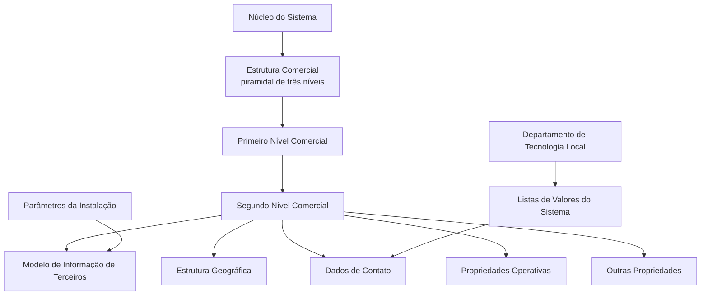

# Definição do Segundo Nível da Estrutura Comercial

## 1. Metadados do Documento
- **Arquivo de Origem:** Não identificado no conteúdo extraído
- **Tipo de Documento:** Especificação Técnica / Funcional
- **Domínio / Sistema:** Estrutura Comercial; Modelo de Informação de Terceiros; MAPFRE; Reef
- **Público-Alvo:** Configuração local, Departamento de Tecnologia Local, analistas funcionais e operação
- **Data/Versão Identificada:** Não identificada

---

## 2. Resumo Executivo & Contexto de Negócio

O documento define os atributos necessários para configurar o **Segundo Nível da Estrutura Comercial** da entidade MAPFRE no sistema. O núcleo do sistema suporta uma estrutura comercial piramidal de três níveis, inicialmente entregue com repositórios de informação sem conteúdo.

O Segundo Nível da Estrutura Comercial é associado a um Primeiro Nível e identificado por chaves, documento identificador, denominação e abreviatura. O modelo também prevê a associação do nível comercial a níveis da Estrutura Geográfica e a dados de contato corporativos.

O documento estabelece regras para atributos operacionais, incluindo a atividade de terceiros com valor constante `43`, a inabilitação de registros e a propriedade de emissão. A propriedade de emissão diferencia um código real de um nível genérico e possui restrições de unicidade por dupla Primeiro/Segundo Nível.

A configuração local possui responsabilidade explícita sobre os valores de tipo de domicílio utilizados nas listas de valores do sistema. Esses valores devem ser selecionados considerando que possuem uso transversal na aplicação, não sendo exclusivos da configuração da Estrutura Comercial.

---

## 3. Arquitetura, Componentes & Tecnologias Envolvidas

Os componentes conceituais identificados no documento são:

| Componente / Conceito | Função no documento |
| :--- | :--- |
| Núcleo do Sistema | Disponibiliza a estrutura comercial piramidal de três níveis e os repositórios de informação. |
| Estrutura Comercial | Estrutura organizacional composta por três níveis. |
| Primeiro Nível da Estrutura Comercial | Nível ao qual o Segundo Nível é associado por meio de chave. |
| Segundo Nível da Estrutura Comercial | Entidade funcional configurada pelo documento. |
| Modelo de Informação de Terceiros | Modelo no qual os níveis da estrutura são identificados por atividade, tipo de documento e chave associada. |
| Estrutura Geográfica | Estrutura de localização associada ao Segundo Nível Comercial por seus segundo, terceiro e quarto níveis. |
| Listas de Valores do Sistema | Catálogos que devem conter os valores locais de tipo de domicílio. |
| Departamento de Tecnologia Local | Responsável por identificar os valores locais de tipo de domicílio nos catálogos do sistema. |
| Parâmetros da Instalação | Fonte da configuração usada pelo sistema para atribuir o Tipo de Documento Identificador em condição específica. |
| Reef / DOCUMENTACIÓN Reef | Contexto documental exibido na extração. Não há detalhamento técnico adicional sobre a plataforma Reef. |



> **Nota de Análise:** O documento descreve a configuração funcional e os atributos da Estrutura Comercial, mas não especifica tecnologias de implementação, APIs, métodos HTTP, contratos JSON, bancos de dados, URLs, portas, logs ou ambientes técnicos.

---

## 4. Regras de Negócio, Especificações Funcionais & Processos

### 4.1 Estrutura comercial

1. O núcleo do sistema permite codificar a Estrutura Comercial da entidade MAPFRE em uma estrutura piramidal de três níveis.
2. Os repositórios de informação são inicialmente entregues às instalações sem conteúdo.
3. O documento trata especificamente da configuração do Segundo Nível da Estrutura Comercial.
4. O Segundo Nível da Estrutura Comercial deve estar associado a um Primeiro Nível por meio da respectiva chave.
5. O Segundo Nível possui código, denominação e abreviatura próprios.

### 4.2 Identificação no Modelo de Informação de Terceiros

1. Os níveis da Estrutura Comercial são identificados no sistema com uma chave de atividade específica.
2. O atributo **Código de Atividade do Terceiro** informa o código da atividade de terceiro associado ao Segundo Nível da Estrutura Comercial.
3. O valor do Código de Atividade do Terceiro é a constante `43`.
4. O valor `43` não pode ser modificado, pois corresponde a uma das atividades do núcleo.
5. Por coerência com as informações das demais pessoas físicas ou jurídicas, os níveis da Estrutura Comercial devem possuir um Tipo de Documento Identificador e uma chave associada.
6. Se a atividade `43` atribuída ao Primeiro Nível da Estrutura Comercial não tiver qualquer tipo de documento identificador associado, o sistema atribuirá ao atributo Tipo de Documento Identificador o valor definido nos parâmetros da instalação.

> **Nota Crítica:** O texto principal associa a atividade `43` ao Segundo Nível, enquanto a seção de perguntas frequentes menciona a atividade `43` atribuída ao Primeiro Nível. O documento extraído não resolve explicitamente essa divergência.

### 4.3 Localização e endereço

1. O Segundo Nível Comercial pode ser associado ao segundo, terceiro e quarto níveis da Estrutura Geográfica.
2. O atributo de nome do quarto nível geográfico pode conter informação complementar quando o país não possuir esse grau de detalhamento.
3. O Tipo de Domicílio deve refletir a configuração, o uso e a exploração pretendidos localmente.
4. Os exemplos apresentados para Tipo de Domicílio são: Calle, Avenida, Cerrada, Carretera e Paseo.
5. O Departamento de Tecnologia Local deve identificar os valores aplicáveis nos catálogos de Listas de Valores do sistema.
6. Os valores de Tipo de Domicílio definidos localmente devem ser transversais à aplicação, não específicos da configuração do Segundo Nível Comercial.
7. Os atributos de Domicílio armazenam o detalhe do endereço de acordo com a localização geográfica e a tipologia de endereço capturada.
8. O Código Postal representa a chave do código postal onde está localizado o domicílio do Segundo Nível Comercial.
9. O Apartado Postal representa a chave do apartado postal, normalmente localizado em uma agência de correios, para recebimento de correspondência e pacotes sem divulgar o endereço físico concreto.

### 4.4 Dados de contato

1. O endereço de e-mail deve corresponder ao endereço corporativo do Segundo Nível da Estrutura Comercial.
2. O nome e os sobrenomes do responsável representam o responsável máximo pelo nível configurado.
3. O Prefixo Telefônico do País corresponde ao prefixo do número telefônico corporativo.
4. Os exemplos de Prefixo Telefônico do País são `+34` para Espanha, `+52` para México e `+54` para Argentina.
5. O Prefixo Zonal Telefônico corresponde ao prefixo local ou zonal do telefone corporativo do Segundo Nível.
6. Os exemplos de Prefixo Zonal Telefônico incluem `91` para Madrid, `93` para Barcelona, `81` para Monterrey, Nuevo León, e `55` para Ciudad de México.
7. O Número Fax representa o telefone corporativo de fax.
8. O Número Telefônico representa o telefone corporativo do nível comercial.

### 4.5 Propriedades operativas e outras propriedades

1. O campo Observações pode registrar informação adicional ou complementar considerada relevante durante a configuração do Segundo Nível.
2. A propriedade Inabilitação determina que a chave do Segundo Nível Comercial está inabilitada para uso na captura e/ou modificação dos níveis da Estrutura Comercial.
3. A propriedade Emissão determina se o código identificador é um Código Real ou um Nível Genérico.
4. Pode existir somente um registro com a propriedade Emissão não ativada para cada dupla Primeiro/Segundo Nível existente.
5. A propriedade Emissão é de uso interno e foi criada para uso do núcleo da aplicação.

### 4.6 Documentos relacionados recomendados

A interpretação isolada do documento pode conduzir a erro. O texto recomenda a leitura das seguintes diretrizes e documentos funcionais relacionados:

- Actividades de Terceros
- Documentos Identificadores
- Estructura Geográfica

---

## 5. Tabelas de Parâmetros, Ambientes e Estruturas de Dados

| Item / Parâmetro | Descrição / Função | Tipo / Valores / Formato | Ambiente / Observações |
| :--- | :--- | :--- | :--- |
| Companhia | Código da companhia sobre a qual é realizada a definição do Segundo Nível. | Código não detalhado. | Dados identificativos. |
| Código de Atividade do Terceiro | Código da atividade de terceiro associado ao Segundo Nível Comercial. | Constante `43`. | Não pode ser modificado; atividade do núcleo. |
| Tipo de Documento Identificador | Tipo do documento usado para identificar o nível no Modelo de Informação de Terceiros. | Tipo de documento não detalhado. | Pode ser atribuído a partir dos parâmetros da instalação na condição descrita no FAQ. |
| Chave do Documento Identificador | Chave associada ao Tipo de Documento Identificador. | Chave não detalhada. | Dados identificativos. |
| Chave do Primeiro Nível | Código que identifica o Primeiro Nível ao qual o Segundo Nível está associado. | Código não detalhado. | Relacionamento hierárquico. |
| Chave do Segundo Nível | Código que identifica o Segundo Nível no sistema. | Código não detalhado. | Dados identificativos. |
| Denominação do Segundo Nível | Nome pelo qual o Segundo Nível é identificado no sistema. | Texto. | Dados identificativos. |
| Abreviatura do Segundo Nível | Descrição abreviada para identificar o Segundo Nível. | Texto. | Dados identificativos. |
| Segundo Nível da Estrutura Geográfica | Chave do segundo nível geográfico de localização. | Chave não detalhada. | Dados de contato. |
| Terceiro Nível da Estrutura Geográfica | Chave do terceiro nível geográfico de localização. | Chave não detalhada. | Dados de contato. |
| Quarto Nível da Estrutura Geográfica | Chave do quarto nível geográfico de localização. | Chave não detalhada. | Dados de contato. |
| Nome do Quarto Nível Geográfico | Informação correspondente ao quarto nível geográfico. | Texto. | Pode conter informação complementar quando o país não possuir esse detalhamento. |
| Tipo de Domicílio | Tipologia do endereço do Segundo Nível Comercial. | Exemplos: Calle, Avenida, Cerrada, Carretera, Paseo. | Valores devem ser identificados pela Tecnologia Local nas Listas de Valores. |
| Domicílio | Detalhe do endereço segundo localização geográfica e tipo de domicílio. | Atributos de endereço não detalhados. | Dados de contato. |
| Código Postal | Chave do código postal do domicílio. | Chave não detalhada. | Dados de contato. |
| Apartado Postal | Chave do apartado postal para recebimento de correspondência e pacotes. | Chave não detalhada. | Normalmente localizado em agência de correios. |
| Direção de Correio Eletrônico | Endereço de e-mail corporativo do Segundo Nível. | Endereço de e-mail. | Dados de contato. |
| Nome e Apelidos do Responsável | Nome e sobrenomes do responsável máximo pelo nível. | Texto. | Repositório de configuração. |
| Prefixo Telefônico do País | Prefixo internacional do telefone corporativo. | Exemplos: `+34`, `+52`, `+54`. | Espanha, México e Argentina, respectivamente. |
| Prefixo Zonal Telefônico | Prefixo geográfico/local do telefone corporativo. | Exemplos: `91`, `93`, `81`, `55`. | Madrid, Barcelona, Monterrey e Ciudad de México, respectivamente. |
| Número Fax | Número de fax corporativo. | Número telefônico. | Dados de contato. |
| Número Telefônico | Telefone corporativo do nível comercial. | Número telefônico. | Dados de contato. |
| Observações | Informações adicionais ou complementares. | Texto livre. | Propriedades operativas. |
| Inabilitação | Indica que a chave do Segundo Nível não pode ser usada na captura e/ou modificação dos níveis comerciais. | Propriedade booleana implícita; formato não detalhado. | Outras propriedades. |
| Emissão | Define se o código é real ou nível genérico. | Propriedade de ativação; formato não detalhado. | Somente um registro sem ativação por dupla Primeiro/Segundo Nível; uso interno do núcleo. |

---

## 6. Bateria de Perguntas & Respostas para RAG (FAQ Sintético)

### P1: Qual é o objetivo do documento sobre o Segundo Nível da Estrutura Comercial?
**R:** O documento define os atributos e regras para configurar o Segundo Nível da Estrutura Comercial no sistema. A Estrutura Comercial da entidade MAPFRE é modelada pelo núcleo como uma estrutura piramidal de três níveis, e o documento focaliza especificamente o segundo desses níveis.

### P2: Qual é o valor do Código de Atividade do Terceiro do Segundo Nível Comercial?
**R:** O Código de Atividade do Terceiro possui o valor constante `43`. O documento declara que esse valor não pode ser modificado porque corresponde a uma das atividades do núcleo.

### P3: Como o Segundo Nível da Estrutura Comercial é relacionado ao Primeiro Nível?
**R:** O atributo Chave do Primeiro Nível contém o código que identifica o Primeiro Nível da Estrutura Comercial no sistema. O Segundo Nível fica associado a esse Primeiro Nível por meio dessa chave.

### P4: Como o Tipo de Documento Identificador é determinado quando a atividade 43 não possui documento associado?
**R:** Segundo a pergunta frequente do documento, se a atividade `43` atribuída ao Primeiro Nível da Estrutura Comercial não tiver tipo de documento identificador associado, o sistema atribui ao atributo Tipo de Documento Identificador o valor definido nos parâmetros da instalação.

### P5: Quem deve configurar os valores de Tipo de Domicílio?
**R:** O Departamento de Tecnologia Local deve identificar os valores aplicáveis nos catálogos do sistema que representam as Listas de Valores. Esses valores devem considerar o uso comum no país e o fato de que serão usados transversalmente pela aplicação.

### P6: Quais são os exemplos de Tipo de Domicílio informados no documento?
**R:** O documento apresenta Calle, Avenida, Cerrada, Carretera e Paseo como exemplos de valores para o Tipo de Domicílio. A lista é exemplificativa e não define um catálogo completo.

### P7: Quais níveis da Estrutura Geográfica podem ser associados ao Segundo Nível Comercial?
**R:** O Segundo Nível Comercial pode ser associado ao segundo, terceiro e quarto níveis da Estrutura Geográfica. Também existe o atributo Nome do Quarto Nível da Estrutura Geográfica, que pode conter informação complementar quando esse nível não existir com o mesmo detalhamento em todos os países.

### P8: O que significa a propriedade Inabilitação no Segundo Nível Comercial?
**R:** A propriedade Inabilitação informa ao sistema que a chave do Segundo Nível da Estrutura Comercial está inabilitada para uso durante a captura e/ou modificação dos níveis da Estrutura Comercial.

### P9: Qual é a regra de unicidade da propriedade Emissão?
**R:** A propriedade Emissão indica se o código identificador do Segundo Nível é um Código Real ou um Nível Genérico. Para cada dupla Primeiro/Segundo Nível existente, somente pode haver um registro com a propriedade Emissão sem ativação.

### P10: A propriedade Emissão pode ser configurada livremente pelos usuários locais?
**R:** O documento informa que a propriedade Emissão é de uso interno, criada pelo núcleo e para uso do núcleo da aplicação. O texto não detalha permissões, telas ou mecanismos de alteração dessa propriedade.

### P11: Quais dados de contato corporativo podem ser cadastrados para o Segundo Nível?
**R:** O documento prevê endereço de correio eletrônico corporativo, nome e sobrenomes do responsável máximo, prefixo telefônico do país, prefixo zonal telefônico, número de fax, número telefônico, domicílio, código postal e apartado postal.

### P12: A Estrutura Comercial e a Estrutura de Canais de Distribuição possuem a mesma finalidade?
**R:** Não. A configuração da Estrutura dos Canais de Distribuição atende a uma necessidade corporativa de obtenção da Margem de Contribuição por Cliente Distribuidor. A Organização Comercial atende a funções que combinam fatores de produção, como capital, trabalho, recursos e tecnologia, com atividades que maximizam a criação de valor da entidade.

---

## 7. Glossário de Termos, Siglas & Conceitos-Chave

- **Estrutura Comercial:** Estrutura piramidal de três níveis usada pelo sistema para codificar a organização comercial da entidade MAPFRE.
- **Primeiro Nível:** Nível da Estrutura Comercial ao qual o Segundo Nível é associado.
- **Segundo Nível:** Nível da Estrutura Comercial cuja configuração é descrita no documento.
- **Modelo de Informação de Terceiros:** Modelo em que os níveis da estrutura são identificados por uma chave de atividade específica, tipo de documento identificador e chave associada.
- **Código de Atividade do Terceiro:** Código da atividade de terceiro associada a um nível da Estrutura Comercial.
- **Atividade 43:** Valor constante indicado para o Código de Atividade do Terceiro; não modificável por ser uma atividade do núcleo.
- **Documento Identificador:** Tipo de documento e chave associados para identificar níveis da estrutura no sistema.
- **Estrutura Geográfica:** Estrutura que organiza a localização do Segundo Nível Comercial por níveis geográficos.
- **Tipo de Domicílio:** Tipologia do endereço, configurada por valores de uso local e transversal na aplicação.
- **Apartado Postal:** Chave de caixa postal, normalmente localizada em agência de correios, usada para recebimento de correspondência e pacotes.
- **Inabilitação:** Propriedade que impede o uso da chave do Segundo Nível na captura e/ou modificação da Estrutura Comercial.
- **Emissão:** Propriedade que define se o código é real ou corresponde a um nível genérico.
- **Código Real:** Classificação possível do código conforme a propriedade Emissão; o documento não apresenta detalhamento adicional.
- **Nível Genérico:** Classificação possível do código conforme a propriedade Emissão; o documento não apresenta detalhamento adicional.
- **Listas de Valores:** Catálogos do sistema que contêm valores configuráveis, como os valores locais de Tipo de Domicílio.
- **Margem de Contribuição por Cliente Distribuidor:** Finalidade corporativa mencionada para a configuração dos Canais de Distribuição.
- **Reef:** Nome exibido no cabeçalho documental. O conteúdo extraído não define o significado ou as capacidades da plataforma.

---

## 8. Notas Críticas, Riscos & Limitações

- O documento não informa nome de arquivo, data, versão, autor técnico, ambiente, URL, API, tecnologia de implementação, banco de dados, logs ou mecanismos de integração.
- O texto principal indica que a atividade `43` está associada ao Segundo Nível, enquanto a pergunta frequente menciona a atividade `43` atribuída ao Primeiro Nível. Essa diferença deve ser validada antes da implementação ou parametrização.
- O tipo, tamanho, obrigatoriedade, validações de formato e domínio completo dos atributos não são detalhados.
- Os valores de Tipo de Domicílio dependem da identificação feita pelo Departamento de Tecnologia Local nos catálogos de Listas de Valores.
- A interpretação isolada do documento pode levar a erro; o próprio conteúdo recomenda consultar os documentos Actividades de Terceros, Documentos Identificadores e Estructura Geográfica.
- A propriedade Emissão é declarada como interna ao núcleo, mas o documento não detalha como ela é mantida, consultada ou protegida.
- Não há detalhamento adicional sobre a plataforma Reef, sobre o proprietário `user:agonzalez_mapfre.com` ou sobre o estado de ciclo de vida exibido como `Approved Source`.

---

## 9. Conteúdo Bruto Estruturado (Referência Fiel)

```text
--- [PÁGINA 1 DE 4] ---

DEFINICIÓN del Segundo Nivel de la Estructura Comercial
Objetivo
Funcionalmente, el núcleo del Sistema cuenta con la posibilidad de codicar la estructura Comercial de la entidad MAPFRE en una estructura
piramidal de tres niveles con repositorios de información especícos que se entregan inicialmente a las instalaciones vacíos de contenido.
En este documento concretamente nos referimos a la conguración en el sistema del segundo nivel de la estructura comercial
Datos Identicativos
Datos de Contacto
Propiedades Operativas
Otras Propiedades
Datos Identicativos
Compañía
Este Atributo del Segundo Nivel de la Estructura Comercial contiene el código de la compañía sobre la que se está realizando su denición.
Código de Actividad del Tercero
Esta propiedad indicará el código de la Actividad del Tercero que se asocian al segundo nivel de la estructura comercial puesto que en el
Nuevo Modelo de Información de Terceros, los niveles de la estructura se identican en el sistema con una clave de actividad especíca.
NOTA: Su valor es la constante '43' puesto que esta es una de las actividades que corresponden al núcleo y por ello no puede ser modicado.
Tipo Documento Identicador
En el nuevo Modelo de Información de Terceros y por coherencia con la información del del resto de Personas Físicas o Jurídicas los niveles
de la estructura comercial se deben identicar en el sistema con un tipo de documento identicativo y una clave asociada.
Este atributo contendrá el Tipo de documento Identicador.
Clave del Documento Identicador
En el nuevo Modelo de Información de Terceros y por coherencia con la información del del resto de Personas Físicas o Jurídicas los niveles
de la estructura comercial se deben identicar en el sistema con un tipo de documento identicativo y una clave asociada.
Este atributo contendrá la clave del Tipo de documento Identicador.
Clave del Primer Nivel
Documentation / DOCUMENTACIÓN Reef
DOCUMENTACIÓN Reef
Mapfredocument
DOCUMENTACIÓN Reef
Owner
user:agonzalez_mapfre.com
Lifecycle
Approved Source
 / 
 VL
Buscar Inicio Soluciones Arquitecturas APIs Componentes Cloud Documentación Zeus Reef Ayuda
ES

--- [PÁGINA 2 DE 4] ---

Este atributo contiene el código por el que se identica el Primer Nivel de la Estructura Comercial en el Sistema y al que estará asociado el
Segundo Nivel de la estructura.
Clave del Segundo Nivel
Este atributo contiene el código por el que se identicará el Segundo Nivel de la Estructura Comercial en el Sistema.
Denominación del Segundo Nivel
Este atributo contiene el nombre por el que se identica al Segundo Nivel de la Estructura Comercial en el Sistema.
Abreviatura del Segundo Nivel
Este atributo contiene la descripción abreviada por la cual se puede identicar al Segundo Nivel de la Estructura Comercial.
Datos de Contacto
Segundo Nivel de la Estructura Geográca
Este atributo contiene la clave del segundo nivel de la Estructura Geográca en la que está ubicado el Segundo nivel de la Estructura
Comercial.
Tercer Nivel de la Estructura Geográca
Este atributo contiene la clave del tercer nivel de la Estructura Geográca en la que está ubicado el Segundo nivel de la Estructura Comercial.
Cuarto Nivel de la Estructura Geográca
Este atributo contiene la clave del cuarto nivel de la Estructura Geográca en la que está ubicado el Segundo nivel de la Estructura Comercial.
Nombre del Cuarto Nivel de la Estructura Geográca
Este atributo contiene información que corresponde al cuarto nivel de la estructura geográca si bien y puesto que no en todos los países se
cuenta con este nivel de detalle, puede contener información complementaria.
Tipo de Domicilio
Este atributo ha de contener la tipología del Domicilio del Segundo nivel de la Estructura Comercial de acuerdo con la conguración, uso y
explotación que posteriormente se quiera realizar localmente.
A modo de ejemplo sus valores podrían ser:
Calle.
Avenida.
Cerrada.
Carretera.
Paseo.
...
NOTA: Es necesario que el Departamento de Tecnología Local identique sus valores en los catálogos del Sistema que identican las Listas
de Valores puesto que los valores prejados por el núcleo pueden no ser aquellos de uso común en el país, teniendo en mente además que
los valores serán de uso transversal en la aplicación y no de uso especíco para la conguración del Segundo nivel de la estructura
comercial.
Domicilio
Estos Atributos contienen la información de detalle del domicilio del Segundo nivel de la estructura comercial de acuerdo con la ubicación
geográca y tipología del domicilio capturados.
Código Postal
Este atributo contiene la clave del Código Postal en donde está ubicada el Domicilio del Segundo nivel de la estructura comercial.

--- [PÁGINA 3 DE 4] ---

Apartado Postal
Este atributo contiene la clave del Apartado Postal perteneciente al Segundo nivel de la estructura comercial, normalmente ubicado en una
ocina de Correos, que le permite recibir correspondencia y paquetes sin tener que entregar la dirección física concreta.
Dirección Correo Electrónico
Este atributo contiene la dirección de correo electrónico corporativo del Segundo nivel de la estructura comercial.
Nombre y Apellidos Responsable del nivel
Estos atributos del repositorio de conguración contienen el nombre y los apellidos del responsable máximo del nivel de la estructura
comercial denida.
Prejo Telefónico del País
Este atributo contiene el Prejo del País Telefónico correspondiente al número telefónico Corporativo del nivel de la estructura comercial.
A modo de ejemplo, en España el prejo es +34,**g en México **+52 y en Argentina +54.
Prejo Zonal Telefónico
Este atributo contiene el Prejo Zonal Telefónico que corresponde al número telefónico Corporativo del Segundo nivel de la estructura
comercial.
A modo de ejemplo,
En España el prejo zonal de Madrid es el 91, el de Barcelona 93, ...
En México la Clave Lada local que corresponde a Monterrey, Nuevo León es 81, la de Ciudad de México es 55,...
Número Fax
Este atributo contiene el Número Telefónico del Fax Corporativo del nivel de la estructura comercial.
Número Telefónico
Este atributo contiene el Número Telefónico que corresponde al Teléfono Corporativo del nivel de la estructura comercial.
Propiedades Operativas
Observaciones
Este atributo puede contener información adicional/complementaria que se estime oportuno capturar en la conguración del Segundo nivel
de la estructura comercial.
Otras Propiedades
Inhabilitación
Esta propiedad indica en el Sistema que la clave del Segundo nivel de la estructura comercial está inhabilitada para ser utilizada en la captura
y/o modicación de los niveles de la estructura comercial.
Emisión
Esta propiedad del Segundo Nivel de la Estructura Comercial establece si el Código que lo identica es un Código Real o un Nivel Genérico
(solamente puede existir un único Registro con esta Propiedad sin activar por cada dupla Primer/Segundo Nivel de la estructura existente).
NOTA: Esta propiedad es de uso interno, creada por y para uso del núcleo de la Aplicación.
Vínculos
Relación de Directrices y Documentos funcionales cuya lectura recomendada para evitar que la interpretación aislada del presente
documento pueda conducir a error.
Actividades de Terceros

--- [PÁGINA 4 DE 4] ---

Documentos Identicadores
Estructura Geográca
Preguntas frecuentes
1 ¿Existe alguna aclaración operativa que deba ser tomada en consideración en la conguración, uso y denición de la tabla de Segundos
niveles de la estructura comercial en el sistema?
Siempre y cuando la actividad 43 asignada al primer nivel de la estructura comercial no tuviera asociada ningún tipo de documento
identicador, el valor que el sistema asignará en el atributo del Tipo de Documento Identicador será aquel que se dene en la conguración
realizada en los parámetros de la instalación.
2. ¿Se pueden solapar los usos de la Estructura Comercial y la Estructura de canales de Distribución?
La Conguración de la Estructura de los Canales de distribución obedece a una necesidad Corporativa concreta para la obtención del Margen
de Contribución por Cliente Distribuidor, mientras que la Conguración de la Organización Comercial obedece a funciones en las que se
combinan factores de producción (capital, trabajo, recursos, tecnología, etc.) con actividades que maximizan el proceso de creación de valor
de la entidad.
Checking links...
```
