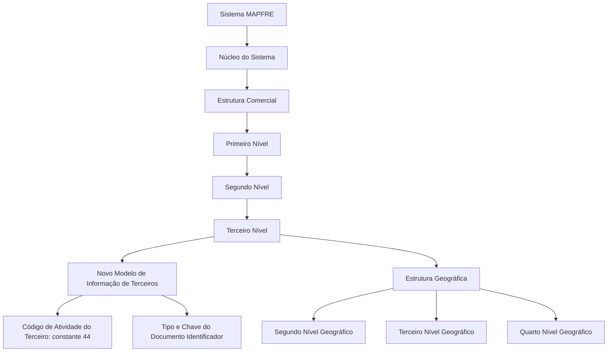

# Definição do Terceiro Nível da Estrutura Comercial MAPFRE

## 1. Metadados do Documento
- **Arquivo de Origem:** Não identificado no conteúdo extraído
- **Tipo de Documento:** Especificação Funcional
- **Domínio / Sistema:** Documentación Reef / MAPFRE — Estrutura Comercial
- **Público-Alvo:** Arquitetos, desenvolvedores, equipes de tecnologia local, operação e negócio
- **Data/Versão Identificada:** Não identificada
- **Lifecycle identificado:** Approved Source
- **Owner identificado:** `user:agonzalez_mapfre.com`

---

## 2. Resumo Executivo & Contexto de Negócio

O documento especifica a configuração do **Terceiro Nível da Estrutura Comercial** no sistema MAPFRE. O núcleo do sistema suporta a codificação da estrutura comercial da entidade em uma estrutura piramidal de três níveis, com repositórios de informação inicialmente entregues vazios às instalações.

A configuração do Terceiro Nível abrange dados identificativos, dados de contacto, propriedades operativas e outras propriedades. Os atributos permitem identificar o nível comercial, relacioná-lo aos Primeiro e Segundo Níveis da Estrutura Comercial, associá-lo à Estrutura Geográfica e registrar endereço, contactos corporativos, responsável e atributos operacionais.

O Terceiro Nível é identificado no Novo Modelo de Informação de Terceiros por uma atividade específica e por um tipo e uma chave de documento identificador. O atributo **Código de Atividade do Terceiro** possui valor constante `44`, não modificável, pois corresponde a uma atividade do núcleo do sistema.

O documento também estabelece restrições relevantes: a propriedade **Emissão** diferencia um código real de um nível genérico e permite somente um registro sem a propriedade ativada para cada combinação de Primeiro, Segundo e Terceiro Níveis. A propriedade **Tipo de Distribuição** está descontinuada e obsoleta, não podendo ser utilizada ou reutilizada localmente.

---

## 3. Arquitetura, Componentes & Tecnologias Envolvidas

### Componentes e estruturas identificados

| Componente / Estrutura | Papel descrito |
| :--- | :--- |
| Sistema MAPFRE | Sistema onde a Estrutura Comercial é configurada. |
| Núcleo do Sistema | Fornece estrutura piramidal de três níveis e controla propriedades internas, como Emissão. |
| Estrutura Comercial | Estrutura piramidal formada por Primeiro, Segundo e Terceiro Níveis. |
| Terceiro Nível da Estrutura Comercial | Entidade funcional detalhada pelo documento; pode representar escritório ou sucursal comercial. |
| Novo Modelo de Informação de Terceiros | Modelo no qual níveis da Estrutura Comercial são identificados por atividade, tipo de documento identificador e chave associada. |
| Estrutura Geográfica | Estrutura usada para localizar o Terceiro Nível por meio do Segundo, Terceiro e Quarto Níveis geográficos. |
| Listas de Valores do Sistema | Catálogos onde a Tecnologia Local deve identificar valores locais para Tipo de Domicílio. |
| Estrutura de Canais de Distribuição | Estrutura com necessidade corporativa voltada à obtenção da Margem de Contribuição por Cliente Distribuidor. |
| Organização Comercial | Configuração voltada à combinação de fatores de produção e atividades de criação de valor da entidade. |



> **Nota de Análise:** O documento não detalha interfaces técnicas, métodos HTTP, contratos JSON, persistência física, tecnologias de implementação, URLs, ambientes de execução ou integrações entre serviços.

---

## 4. Regras de Negócio, Especificações Funcionais & Processos

### 4.1 Identificação do Terceiro Nível

1. O Terceiro Nível pertence a uma estrutura comercial piramidal de três níveis.
2. O atributo **Compañía** contém o código da companhia sobre a qual a definição está sendo realizada.
3. O **Código de Actividad del Tercero** identifica a atividade associada ao Terceiro Nível no Novo Modelo de Informação de Terceiros.
4. O valor do Código de Actividad del Tercero é a constante `44`.
5. A constante `44` não pode ser modificada, pois corresponde a uma atividade do núcleo.
6. O Terceiro Nível deve possuir um **Tipo Documento Identificador** e uma **Clave del Documento Identificador**, em coerência com a identificação de Pessoas Físicas ou Jurídicas no Novo Modelo de Informação de Terceiros.
7. O Terceiro Nível é associado indiretamente ao Primeiro Nível por meio da **Clave del Primer Nivel**.
8. A **Clave del Segundo Nivel** identifica o Segundo Nível da Estrutura Comercial.
9. A **Clave del Tercer Nivel** identifica o Terceiro Nível da Estrutura Comercial.
10. A **Denominación del Tercer Nivel** contém o nome identificador do Terceiro Nível.
11. A **Abreviatura del Tercer Nivel** contém a descrição abreviada de identificação do Terceiro Nível.

### 4.2 Localização e contacto

1. O Terceiro Nível pode ser associado ao Segundo, Terceiro e Quarto Níveis da Estrutura Geográfica.
2. O **Nombre del Cuarto Nivel de la Estructura Geográfica** pode conter informação complementar quando o país não possuir Quarto Nível Geográfico detalhado.
3. O **Tipo de Domicilio** deve refletir a tipologia do endereço segundo a configuração, o uso e a exploração local pretendidos.
4. Valores de Tipo de Domicilio exemplificados no documento: Calle, Avenida, Cerrada, Carretera e Paseo.
5. A equipa de Tecnologia Local deve identificar os valores adequados nos catálogos do sistema que identificam Listas de Valores.
6. Valores predefinidos pelo núcleo podem não corresponder aos valores de uso comum em determinado país.
7. Os valores de Tipo de Domicilio têm uso transversal na aplicação e não são exclusivos da configuração do Terceiro Nível.
8. Os atributos de **Domicilio** registram o detalhe do endereço segundo a localização geográfica e a tipologia de endereço capturadas.
9. O **Código Postal** contém a chave do código postal onde está situado o endereço do Terceiro Nível.
10. O **Apartado Postal** contém a chave do apartado postal, normalmente localizado em uma agência de correios, permitindo receber correspondência e pacotes sem fornecer o endereço físico específico.
11. A **Dirección Correo Electrónico** contém o endereço de correio eletrónico corporativo do Terceiro Nível.
12. Os atributos **Nombre y Apellidos Responsable del nivel** registram nome e sobrenomes do responsável máximo pelo nível definido.
13. O **Prefijo Telefónico del País** corresponde ao prefixo de país do telefone corporativo.
14. O **Prefijo Zonal Telefónico** corresponde ao prefixo zonal do telefone corporativo do Terceiro Nível.
15. **Número Fax** contém o número telefónico do fax corporativo.
16. **Número Telefónico** contém o telefone corporativo do Terceiro Nível.

### 4.3 Propriedades operativas e outras propriedades

1. **Observaciones** pode armazenar informação adicional ou complementar considerada necessária na configuração do Terceiro Nível.
2. **Inhabilitación** indica que a chave do Terceiro Nível está inabilitada para uso na captura e/ou modificação dos níveis da Estrutura Comercial.
3. **Emisión** determina se o código identificador é um Código Real ou um Nível Genérico.
4. Para cada combinação existente de Primeiro, Segundo e Terceiro Níveis, somente pode existir um único registro com a propriedade Emisión sem ativação.
5. A propriedade Emisión é de uso interno, criada pelo núcleo e para uso do núcleo da aplicação.
6. **Tipo de Distribución** está descontinuada e obsoleta no núcleo do sistema.
7. Tipo de Distribución não pode ser utilizado nem reutilizado para propósitos de âmbito local.
8. Originalmente, Tipo de Distribución indicava a forma de distribuição contábil dos saldos de cosseguro/resseguro do escritório: por Entidad, Sector, Subsector ou Ramo Contable.
9. **Fecha de Apertura** contém a data oficial de abertura do escritório ou sucursal comercial.
10. **Marca Propia** informa se as sucursais ou escritórios do Terceiro Nível pertencem à companhia. Podem existir escritórios associados ou externos à Organização Comercial interna da MAPFRE.

### 4.4 Relação entre Estrutura Comercial e Canais de Distribuição

- A configuração da Estrutura de Canais de Distribuição atende a uma necessidade corporativa concreta de obter a **Margem de Contribuição por Cliente Distribuidor**.
- A configuração da Organização Comercial atende a funções que combinam capital, trabalho, recursos, tecnologia e outros fatores de produção, com atividades que maximizam o processo de criação de valor da entidade.
- O documento diferencia os objetivos das duas estruturas, sem detalhar uma regra de integração técnica entre elas.

---

## 5. Tabelas de Parâmetros, Ambientes e Estruturas de Dados

| Item / Parâmetro | Descrição / Função | Tipo / Valores / Formato | Ambiente / Observações |
| :--- | :--- | :--- | :--- |
| Compañía | Código da companhia em definição. | Código não detalhado. | Dados Identificativos. |
| Código de Actividad del Tercero | Código da atividade associada ao Terceiro Nível. | Constante `44`. | Não modificável; atividade do núcleo. |
| Tipo Documento Identificador | Tipo de documento usado para identificar o nível. | Valor não detalhado. | Novo Modelo de Informação de Terceiros. |
| Clave del Documento Identificador | Chave associada ao tipo de documento identificador. | Valor não detalhado. | Novo Modelo de Informação de Terceiros. |
| Clave del Primer Nivel | Código identificador do Primeiro Nível associado indiretamente ao Terceiro Nível. | Código não detalhado. | Estrutura Comercial. |
| Clave del Segundo Nivel | Código identificador do Segundo Nível. | Código não detalhado. | Estrutura Comercial. |
| Clave del Tercer Nivel | Código identificador do Terceiro Nível. | Código não detalhado. | Estrutura Comercial. |
| Denominación del Tercer Nivel | Nome de identificação do Terceiro Nível. | Texto. | Estrutura Comercial. |
| Abreviatura del Tercer Nivel | Descrição abreviada de identificação. | Texto. | Estrutura Comercial. |
| Segundo Nivel de la Estructura Geográfica | Chave do segundo nível geográfico de localização. | Chave não detalhada. | Dados de Contacto. |
| Tercer Nivel de la Estructura Geográfica | Chave do terceiro nível geográfico de localização. | Chave não detalhada. | Dados de Contacto. |
| Cuarto Nivel de la Estructura Geográfica | Chave do quarto nível geográfico de localização. | Chave não detalhada. | Dados de Contacto. |
| Nombre del Cuarto Nivel de la Estructura Geográfica | Informação do quarto nível geográfico. | Texto. | Pode complementar informação em países sem esse detalhe. |
| Tipo de Domicilio | Tipologia do endereço. | Exemplos: Calle, Avenida, Cerrada, Carretera, Paseo. | Valores devem ser identificados localmente nas Listas de Valores. |
| Domicilio | Detalhe do endereço. | Atributos não detalhados. | Conforme localização geográfica e tipo de endereço. |
| Código Postal | Chave do código postal do endereço. | Chave não detalhada. | Dados de Contacto. |
| Apartado Postal | Chave do apartado postal para correspondência e pacotes. | Chave não detalhada. | Normalmente localizado em agência de correios. |
| Dirección Correo Electrónico | Correio eletrónico corporativo do Terceiro Nível. | Endereço de e-mail. | Dados de Contacto. |
| Nombre y Apellidos Responsable del nivel | Nome e sobrenomes do responsável máximo. | Texto. | Repositório de configuração. |
| Prefijo Telefónico del País | Prefixo de país do telefone corporativo. | Exemplos: Espanha `+34`, México `+52`, Argentina `+54`. | Dados de Contacto. |
| Prefijo Zonal Telefónico | Prefixo zonal do telefone corporativo. | Exemplos: Madrid `91`, Barcelona `93`, Monterrey `81`, Ciudad de México `55`. | Dados de Contacto. |
| Número Fax | Número de fax corporativo. | Número telefónico. | Dados de Contacto. |
| Número Telefónico | Número de telefone corporativo. | Número telefónico. | Dados de Contacto. |
| Observaciones | Informação adicional ou complementar. | Texto. | Propriedades Operativas. |
| Inhabilitación | Inabilita a chave para captura e/ou modificação da Estrutura Comercial. | Estado não detalhado. | Outras Propriedades. |
| Emisión | Define Código Real ou Nível Genérico. | Estado ativado ou não ativado, sem formato detalhado. | Uso interno do núcleo. |
| Tipo de Distribución | Propriedade histórica de distribuição contábil. | Descontinuada e obsoleta. | Não usar nem reutilizar localmente. |
| Fecha de Apertura | Data oficial de abertura do escritório/sucursal. | Data; formato não detalhado. | Outras Propriedades. |
| Marca Propia | Indica pertencimento do escritório ou sucursal à companhia. | Valor não detalhado. | Pode distinguir escritórios próprios, associados ou externos. |

---

## 6. Bateria de Perguntas & Respostas para RAG (FAQ Sintético)

### P1: Qual é o objetivo do documento sobre o Terceiro Nível da Estrutura Comercial?
**R:** O documento descreve a configuração no sistema do Terceiro Nível da Estrutura Comercial MAPFRE. A configuração cobre dados identificativos, contacto, propriedades operativas e outras propriedades desse nível.

### P2: Qual é o valor do Código de Atividade do Terceiro para o Terceiro Nível?
**R:** O Código de Actividad del Tercero possui o valor constante `44`. Esse valor não pode ser modificado porque corresponde a uma das atividades do núcleo do sistema.

### P3: Como o Terceiro Nível é identificado no Novo Modelo de Informação de Terceiros?
**R:** O Terceiro Nível é identificado por uma atividade específica, por um Tipo Documento Identificador e por uma Clave del Documento Identificador associada.

### P4: Como o Terceiro Nível se relaciona aos demais níveis da Estrutura Comercial?
**R:** A Clave del Primer Nivel contém o código do Primeiro Nível ao qual o Terceiro Nível estará associado indiretamente. A Clave del Segundo Nivel identifica o Segundo Nível, e a Clave del Tercer Nivel identifica o próprio Terceiro Nível.

### P5: Quais níveis da Estrutura Geográfica podem localizar o Terceiro Nível?
**R:** O Terceiro Nível pode registrar a chave do Segundo, Terceiro e Quarto Níveis da Estrutura Geográfica. O nome do Quarto Nível pode armazenar informação complementar quando o país não possuir esse nível de detalhe.

### P6: Quem deve definir os valores locais de Tipo de Domicílio?
**R:** O Departamento de Tecnologia Local deve identificar os valores nos catálogos do sistema que representam as Listas de Valores. Os valores predefinidos pelo núcleo podem não ser os de uso comum no país, e os valores possuem uso transversal na aplicação.

### P7: O que acontece quando a propriedade Inhabilitación está aplicada?
**R:** A propriedade Inhabilitación indica que a chave do Terceiro Nível está inabilitada para ser usada na captura e/ou modificação dos níveis da Estrutura Comercial.

### P8: Qual é a regra da propriedade Emisión?
**R:** Emisión determina se o código do Terceiro Nível é um Código Real ou um Nível Genérico. Para cada combinação existente de Primeiro, Segundo e Terceiro Níveis, somente pode existir um registro com essa propriedade sem ativação. A propriedade é de uso interno do núcleo da aplicação.

### P9: A propriedade Tipo de Distribución pode ser usada em uma implementação local?
**R:** Não. A funcionalidade de Tipo de Distribución está descontinuada e obsoleta no núcleo do sistema, portanto não pode ser usada nem reutilizada para qualquer propósito de âmbito local.

### P10: Qual era a finalidade original de Tipo de Distribución?
**R:** Originalmente, Tipo de Distribución indicava ao sistema a forma de distribuição contábil dos saldos de cosseguro/resseguro do escritório: por Entidad, Sector, Subsector ou Ramo Contable.

### P11: O que indica o atributo Marca Propia?
**R:** Marca Propia indica se sucursais ou escritórios do Terceiro Nível pertencem à companhia. O documento reconhece a existência de escritórios associados ou externos à Organização Comercial interna da MAPFRE.

### P12: Os usos da Estrutura Comercial e da Estrutura de Canais de Distribuição são equivalentes?
**R:** Não. A Estrutura de Canais de Distribuição atende à obtenção da Margem de Contribuição por Cliente Distribuidor. A Organização Comercial atende a funções que combinam fatores de produção e atividades que maximizam a criação de valor da entidade.

---

## 7. Glossário de Termos, Siglas & Conceitos-Chave

- **MAPFRE:** Entidade corporativa referida no documento.
- **Estrutura Comercial:** Estrutura piramidal de três níveis configurada no sistema.
- **Primeiro Nível:** Primeiro nível da Estrutura Comercial.
- **Segundo Nível:** Segundo nível da Estrutura Comercial.
- **Terceiro Nível:** Nível da Estrutura Comercial tratado pela especificação.
- **Novo Modelo de Informação de Terceiros:** Modelo no qual níveis comerciais são identificados por atividade e documento identificador.
- **Estrutura Geográfica:** Estrutura utilizada para localizar geograficamente o Terceiro Nível.
- **Listas de Valores:** Catálogos do sistema usados para identificar valores aplicáveis, como Tipo de Domicílio.
- **Emisión:** Propriedade interna que indica Código Real ou Nível Genérico.
- **Tipo de Distribución:** Propriedade obsoleta de distribuição contábil de saldos de cosseguro/resseguro.
- **Marca Propia:** Atributo que informa se uma sucursal ou escritório pertence à companhia.
- **Apartado Postal:** Endereço postal associado normalmente a uma agência de correios.
- **Margem de Contribuição por Cliente Distribuidor:** Necessidade corporativa atendida pela Estrutura de Canais de Distribuição.

---

## 8. Notas Críticas, Riscos & Limitações

- O documento não identifica nome de arquivo, data, versão, formato de campos, obrigatoriedade, regras de validação técnicas ou fluxos de persistência.
- Não há detalhe sobre APIs, serviços, integrações, contratos de dados, banco de dados, ambientes ou mecanismos de auditoria.
- O texto de Perguntas Frequentes menciona a atividade `43` atribuída ao Primeiro Nível, enquanto a especificação do Terceiro Nível estabelece a constante `44`. O documento não explica a relação entre essas duas atividades.
- Valores de Tipo de Domicílio exigem ação da Tecnologia Local e podem variar por país.
- Valores de Tipo de Domicílio são transversais à aplicação; alterações locais podem ter impacto além da configuração do Terceiro Nível.
- A propriedade Emisión é de uso interno do núcleo e possui restrição de unicidade para registros sem ativação.
- Tipo de Distribución está explicitamente descontinuada e não deve ser reutilizada localmente.

---

## 9. Conteúdo Bruto Estruturado (Referência Fiel)

```text
--- [PÁGINA 1 DE 4] ---

DEFINICIÓN Nivel3 Estructura Comercial
Objetivo
Funcionalmente, el núcleo del Sistema cuenta con la posibilidad de codicar la estructura Comercial de la entidad MAPFRE en una estructura
piramidal de tres niveles con repositorios de información especícos que se entregan inicialmente a las instalaciones vacíos de contenido.
En este documento concretamente nos referimos a la conguración en el sistema del tercer nivel de la estructura comercial
Datos Identicativos
Datos de Contacto
Propiedades Operativas
Otras Propiedades
Datos Identicativos
Compañía
Este Atributo del Tercer Nivel de la Estructura Comercial contiene el código de la compañía sobre la que se está realizando su denición.
Código de Actividad del Tercero
Esta propiedad indicará el código de la Actividad del Tercero que se asocian al Tercer nivel de la estructura comercial puesto que en el Nuevo
Modelo de Información de Terceros, los niveles de la estructura se identican en el sistema con una clave de actividad especíca.
NOTA: Su valor es la constante '44' puesto que esta es una de las actividades que corresponden al núcleo y por ello no puede ser modicado.
Tipo Documento Identicador
En el nuevo Modelo de Información de Terceros y por coherencia con la información del del resto de Personas Físicas o Jurídicas los niveles
de la estructura comercial se deben identicar en el sistema con un tipo de documento identicativo y una clave asociada.
Este atributo contendrá el Tipo de documento Identicador.
Clave del Documento Identicador
En el nuevo Modelo de Información de Terceros y por coherencia con la información del del resto de Personas Físicas o Jurídicas los niveles
de la estructura comercial se deben identicar en el sistema con un tipo de documento identicativo y una clave asociada.
Este atributo contendrá la clave del Tipo de documento Identicador.
Clave del Primer Nivel
Documentation / DOCUMENTACIÓN Reef
DOCUMENTACIÓN Reef
Mapfredocument
DOCUMENTACIÓN Reef
Owner
user:agonzalez_mapfre.com
Lifecycle
Approved Source
 / 
 VL
Buscar Inicio Soluciones Arquitecturas APIs Componentes Cloud Documentación Zeus Reef Ayuda
ES


--- [PÁGINA 2 DE 4] ---

Este atributo contiene el código por el que se identica el Primer Nivel de la Estructura Comercial en el Sistema y al que estará asociado
indirectamente el Tercer Nivel de la estructura.
Clave del Segundo Nivel
Este atributo contiene el código por el que se identicará el Segundo Nivel de la Estructura Comercial en el Sistema.
Clave del Tercer Nivel
Este atributo contiene el código por el que se identicará el Tercer Nivel de la Estructura Comercial en el Sistema.
Denominación del Tercer Nivel
Este atributo contiene el nombre por el que se identica al Tercer Nivel de la Estructura Comercial en el Sistema.
Abreviatura del Tercer Nivel
Este atributo contiene la descripción abreviada por la cual se puede identicar al Tercer Nivel de la Estructura Comercial.
Datos de Contacto
Segundo Nivel de la Estructura Geográca
Este atributo contiene la clave del segundo nivel de la Estructura Geográca en la que está ubicado el Tercer nivel de la Estructura Comercial.
Tercer Nivel de la Estructura Geográca
Este atributo contiene la clave del tercer nivel de la Estructura Geográca en la que está ubicado el Tercer nivel de la Estructura Comercial.
Cuarto Nivel de la Estructura Geográca
Este atributo contiene la clave del cuarto nivel de la Estructura Geográca en la que está ubicado el Tercer nivel de la Estructura Comercial.
Nombre del Cuarto Nivel de la Estructura Geográca
Este atributo contiene información que corresponde al cuarto nivel de la estructura geográca si bien y puesto que no en todos los países se
cuenta con este nivel de detalle, puede contener información complementaria.
Tipo de Domicilio
Este atributo ha de contener la tipología del Domicilio del Tercer nivel de la Estructura Comercial de acuerdo con la conguración, uso y
explotación que posteriormente se quiera realizar localmente.
A modo de ejemplo sus valores podrían ser:
Calle.
Avenida.
Cerrada.
Carretera.
Paseo.
...
NOTA: Es necesario que el Departamento de Tecnología Local identique sus valores en los catálogos del Sistema que identican las Listas
de Valores puesto que los valores prejados por el núcleo pueden no ser aquellos de uso común en el país, teniendo en mente además que
los valores serán de uso transversal en la aplicación y no de uso especíco para la conguración del Tercer nivel de la estructura comercial.
Domicilio
Estos Atributos contienen la información de detalle del domicilio del Tercer nivel de la estructura comercial de acuerdo con la ubicación
geográca y tipología del domicilio capturados.
Código Postal
Este atributo contiene la clave del Código Postal en donde está ubicada el Domicilio del Tercer nivel de la estructura comercial.


--- [PÁGINA 3 DE 4] ---

Apartado Postal
Este atributo contiene la clave del Apartado Postal perteneciente al Tercer nivel de la estructura comercial, normalmente ubicado en una
ocina de Correos, que le permite recibir correspondencia y paquetes sin tener que entregar la dirección física concreta.
Dirección Correo Electrónico
Este atributo contiene la dirección de correo electrónico corporativo del Tercer nivel de la estructura comercial.
Nombre y Apellidos Responsable del nivel
Estos atributos del repositorio de conguración contienen el nombre y los apellidos del responsable máximo del nivel de la estructura
comercial denida.
Prejo Telefónico del País
Este atributo contiene el Prejo del País Telefónico correspondiente al número telefónico Corporativo del nivel de la estructura comercial.
A modo de ejemplo, en España el prejo es +34,**g en México **+52 y en Argentina +54.
Prejo Zonal Telefónico
Este atributo contiene el Prejo Zonal Telefónico que corresponde al número telefónico Corporativo del Tercer nivel de la estructura
comercial.
A modo de ejemplo,
En España el prejo zonal de Madrid es el 91, el de Barcelona 93, ...
En México la Clave Lada local que corresponde a Monterrey, Nuevo León es 81, la de Ciudad de México es 55,...
Número Fax
Este atributo contiene el Número Telefónico del Fax Corporativo del nivel de la estructura comercial.
Número Telefónico
Este atributo contiene el Número Telefónico que corresponde al Teléfono Corporativo del nivel de la estructura comercial.
Propiedades Operativas
Observaciones
Este atributo puede contener información adicional/complementaria que se estime oportuno capturar en la conguración del Tercer nivel de
la estructura comercial.
Otras Propiedades
Inhabilitación
Esta propiedad indica en el Sistema que la clave del Tercer nivel de la estructura comercial está inhabilitada para ser utilizada en la captura
y/o modicación de los niveles de la estructura comercial.
Emisión
Esta propiedad del Tercer Nivel de la Estructura Comercial establece si el Código que lo identica es un Código Real o un Nivel Genérico
(solamente puede existir un único Registro con esta Propiedad sin activar por cada combinación de Primer/Segundo y Tercer Nivel de la
estructura existente).
NOTA: Esta propiedad es de uso interno, creada por y para uso del núcleo de la Aplicación.
Tipo de Distribución
La funcionalidad de esta propiedad está descontinuada y obsoleta en el núcleo del sistema por lo que no se puede usar o reutilizar para
ningún propósito de ámbito local.


--- [PÁGINA 4 DE 4] ---

NOTA: Originalmente la denición de esta propiedad en el Tercer Nivel de la Estructura Comercial le indicaba al sistema la manera en la que
se iba a realizar a nivel contable la distribución de los saldos de coaseguro/reaseguro de la Ocina: Por Entidad, Sector, Subsector o Ramo
Contable,
Fecha de Apertura
Esta propiedad contiene la fecha ocial de apertura de la Ocina/Sucursal Comercial.
Marca Propia
Este atributo se utiliza para indicar si las sucursales/ocinas correspondientes al tercer nivel de la estructura comercial pertenecen o no a la
compañía puesto que pueden existir ocinas "asociadas" o "externas" a la Organización Comercial interna de MAPFRE.
Vínculos
Relación de Directrices y Documentos funcionales cuya lectura recomendada para evitar que la interpretación aislada del presente
documento pueda conducir a error.
Actividades de Terceros
Estructura Geográca
Preguntas frecuentes
1 ¿Existe alguna aclaración operativa que deba ser tomada en consideración en la conguración, uso y denición de la tabla de Segundos
niveles de la estructura comercial en el sistema?
Siempre y cuando la actividad 43 asignada al primer nivel de la estructura comercial no tuviera asociada ningún tipo de documento
identicador, el valor que el sistema asignará en el atributo del Tipo de Documento Identicador será aquel que se dene en la conguración
realizada en los parámetros de la instalación.
2 ¿Se pueden solapar los usos de la Estructura Comercial y la Estructura de canales de Distribución?
La Conguración de la Estructura de los Canales de distribución obedece a una necesidad Corporativa concreta para la obtención del Margen
de Contribución por Cliente Distribuidor, mientras que la Conguración de la Organización Comercial obedece a funciones en las que se
combinan factores de producción (capital, trabajo, recursos, tecnología, etc.) con actividades que maximizan el proceso de creación de valor
de la entidad.
```
