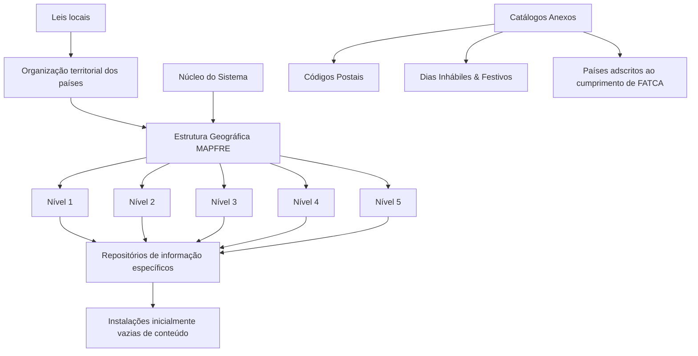

# Definição da Estrutura Geográfica MAPFRE no Sistema Reef

## 1. Metadados do Documento
- **Arquivo de Origem:** Não identificado no conteúdo fornecido
- **Tipo de Documento:** Especificação Funcional
- **Domínio / Sistema:** MAPFRE / Reef / Estrutura Geográfica
- **Público-Alvo:** Negócio, Desenvolvedores, Arquitetos e Operação
- **Data/Versão Identificada:** Não identificada

---

## 2. Resumo Executivo & Contexto de Negócio

O documento define o contexto funcional da estrutura geográfica da entidade MAPFRE. A organização territorial dos países é apresentada como uma divisão de territórios para finalidades políticas e administrativas, conforme definido pelas leis locais.

O núcleo do sistema oferece a capacidade de codificar a estrutura geográfica da entidade MAPFRE em uma estrutura piramidal de cinco níveis. Esses níveis são mantidos em repositórios de informação específicos, inicialmente entregues às instalações sem conteúdo.

Além dos cinco níveis da estrutura geográfica, o documento relaciona catálogos anexos para códigos postais, dias não úteis e feriados, e países vinculados ao cumprimento de FATCA.

O conteúdo fornecido não detalha regras de codificação, campos de cadastro, critérios de hierarquia entre os níveis, integrações, contratos de API, permissões ou procedimentos operacionais para preenchimento dos repositórios.

---

## 3. Arquitetura, Componentes & Tecnologias Envolvidas

### Componentes e conceitos identificados

| Componente / Conceito | Descrição sustentada pelo documento |
| :--- | :--- |
| MAPFRE | Entidade cuja estrutura geográfica pode ser codificada pelo núcleo do sistema. |
| Sistema | Núcleo que disponibiliza a possibilidade de codificar a estrutura geográfica. |
| Estrutura Geográfica | Estrutura piramidal composta por cinco níveis. |
| Repositórios de informação específicos | Repositórios que recebem os dados da estrutura geográfica; são entregues inicialmente vazios às instalações. |
| Catálogos Anexos | Conjunto de catálogos relacionados a códigos postais, dias não úteis e feriados, e países aderentes ao cumprimento de FATCA. |
| Reef | Contexto documental indicado como “DOCUMENTACIÓN Reef”. |
| Mapfredocument | Termo exibido no conteúdo bruto, sem detalhamento funcional ou técnico. |
| Zeus | Termo exibido no menu de navegação, sem detalhamento funcional ou técnico. |



> **Nota de Análise:** O documento descreve uma estrutura geográfica piramidal com cinco níveis, mas não especifica relações pai-filho, nomes locais concretos, formatos de código, mecanismos de persistência ou tecnologias de implementação.

---

## 4. Regras de Negócio, Especificações Funcionais & Processos

1. A organização territorial dos países corresponde à divisão realizada sobre os territórios para fins políticos e administrativos.
2. A organização territorial deve observar o que estiver definido pelas leis locais.
3. O núcleo do sistema permite codificar a estrutura geográfica da entidade MAPFRE.
4. A estrutura geográfica da entidade MAPFRE é organizada em uma estrutura piramidal de cinco níveis.
5. A estrutura geográfica é mantida em repositórios de informação específicos.
6. Os repositórios de informação específicos são entregues inicialmente às instalações sem conteúdo.
7. O documento identifica denominações dos níveis da estrutura geográfica.
8. O documento identifica denominações locais dos níveis da estrutura geográfica.
9. O documento lista cinco níveis: Nível 1, Nível 2, Nível 3, Nível 4 e Nível 5.
10. O documento lista catálogos anexos para códigos postais, dias não úteis e feriados, e países associados ao cumprimento de FATCA.

> **Nota de Análise:** Não há detalhamento adicional sobre validações, obrigatoriedade de campos, regras de manutenção dos cinco níveis, carga inicial, responsáveis pelo preenchimento ou fluxo de aprovação.

---

## 5. Tabelas de Parâmetros, Ambientes e Estruturas de Dados

| Item / Parâmetro | Descrição / Função | Tipo / Valores / Formato | Ambiente / Observações |
| :--- | :--- | :--- | :--- |
| Estrutura Geográfica | Estrutura usada para codificar a organização geográfica da entidade MAPFRE. | Estrutura piramidal. | Composta por cinco níveis. |
| Nível 1 | Primeiro nível da estrutura geográfica. | Nível geográfico. | Denominação específica não detalhada. |
| Nível 2 | Segundo nível da estrutura geográfica. | Nível geográfico. | Denominação específica não detalhada. |
| Nível 3 | Terceiro nível da estrutura geográfica. | Nível geográfico. | Denominação específica não detalhada. |
| Nível 4 | Quarto nível da estrutura geográfica. | Nível geográfico. | Denominação específica não detalhada. |
| Nível 5 | Quinto nível da estrutura geográfica. | Nível geográfico. | Denominação específica não detalhada. |
| Denominações dos Níveis | Denominações relacionadas aos níveis da estrutura geográfica. | Não detalhado. | O documento não apresenta os valores das denominações. |
| Denominações Locais dos Níveis | Denominações locais relacionadas aos níveis da estrutura geográfica. | Não detalhado. | O documento não apresenta os valores locais. |
| Repositórios de informação específicos | Repositórios destinados à estrutura geográfica. | Repositórios de informação. | Entregues inicialmente vazios de conteúdo às instalações. |
| Códigos Postais | Catálogo anexo identificado. | Catálogo. | Sem campos, formato ou regras descritos. |
| Dias Inhábiles & Festivos | Catálogo anexo de dias não úteis e feriados. | Catálogo. | Sem campos, calendário, país ou regras descritos. |
| Países adscritos ao cumprimento de FATCA | Catálogo anexo de países vinculados ao cumprimento de FATCA. | Catálogo. | Sem lista de países ou regras de aderência. |
| Owner | Identificação de proprietário exibida no conteúdo. | `user:agonzalez_mapfre.com` | Contexto de propriedade documental. |
| Lifecycle | Estado do ciclo de vida documental. | `Approved Source` | Exibido no conteúdo bruto. |
| Idioma | Idioma exibido na navegação. | `ES` | Interface ou portal em espanhol. |

---

## 6. Bateria de Perguntas & Respostas para RAG (FAQ Sintético)

### P1: Qual é o objetivo da estrutura geográfica descrita para a entidade MAPFRE?
**R:** A estrutura geográfica permite que o núcleo do sistema codifique a organização geográfica da entidade MAPFRE em uma estrutura piramidal de cinco níveis, mantida em repositórios de informação específicos.

### P2: Em que se baseia a organização territorial dos países?
**R:** A organização territorial dos países corresponde à divisão dos territórios para fins políticos e administrativos, de acordo com o que estiver definido pelas leis locais.

### P3: Quantos níveis possui a estrutura geográfica MAPFRE?
**R:** A estrutura geográfica MAPFRE possui cinco níveis: Nível 1, Nível 2, Nível 3, Nível 4 e Nível 5.

### P4: O documento informa os nomes concretos de cada nível geográfico?
**R:** Não. O documento menciona “Denominações dos Níveis da Estrutura Geográfica” e “Denominações Locais dos Níveis da Estrutura Geográfica”, mas não apresenta os nomes ou valores concretos dessas denominações.

### P5: Onde os dados da estrutura geográfica são mantidos?
**R:** Os dados são mantidos em repositórios de informação específicos destinados à estrutura geográfica da entidade MAPFRE.

### P6: Qual é o estado inicial dos repositórios de informação nas instalações?
**R:** Os repositórios de informação específicos são entregues inicialmente às instalações vazios de conteúdo.

### P7: Quais catálogos anexos são citados no documento?
**R:** Os catálogos anexos citados são Códigos Postais, Dias Inhábiles & Festivos e Países adscritos ao cumprimento de FATCA.

### P8: O documento detalha os campos ou o formato dos códigos postais?
**R:** Não. O documento apenas lista “Códigos Postais” como catálogo anexo, sem apresentar campos, formatos, validações ou regras de manutenção.

### P9: O documento apresenta regras de negócio para dias não úteis e feriados?
**R:** Não. O conteúdo apenas identifica o catálogo “Días Inhábiles & Festivos”; não há regras para cadastro, cálculo, calendário, abrangência territorial ou consumo desses dados.

### P10: O documento especifica como identificar os países aderentes ao cumprimento de FATCA?
**R:** Não. O documento cita “Países adscritos al cumplimento de FATCA” como catálogo anexo, mas não informa quais países o compõem nem os critérios de inclusão.

### P11: O que significa o estado documental “Approved Source”?
**R:** O conteúdo bruto exibe `Lifecycle Approved Source`, indicando um estado de ciclo de vida documental. O documento não fornece definição adicional para esse estado.

### P12: Há detalhes de APIs, microsserviços ou integrações para a estrutura geográfica?
**R:** Não. O conteúdo fornecido não informa APIs, métodos HTTP, contratos JSON, microsserviços, protocolos de integração ou tecnologias de persistência.

---

## 7. Glossário de Termos, Siglas & Conceitos-Chave

- **MAPFRE:** Entidade mencionada como titular da estrutura geográfica que pode ser codificada pelo núcleo do sistema.
- **Estrutura Geográfica:** Estrutura piramidal de cinco níveis usada para representar a organização geográfica da entidade MAPFRE.
- **Nível 1 a Nível 5:** Cinco níveis que compõem a estrutura geográfica piramidal.
- **Repositórios de informação específicos:** Repositórios destinados a armazenar a estrutura geográfica; inicialmente vazios nas instalações.
- **Catálogos Anexos:** Catálogos relacionados à estrutura geográfica, incluindo códigos postais, dias não úteis e feriados, e países associados ao cumprimento de FATCA.
- **FATCA:** Sigla mencionada no documento no contexto de países adscritos ao seu cumprimento. O significado expandido da sigla não é definido no conteúdo fornecido.
- **Reef:** Nome presente no contexto de documentação: “DOCUMENTACIÓN Reef”.
- **Mapfredocument:** Termo presente no conteúdo bruto, sem definição adicional.
- **Zeus:** Termo exibido na navegação do conteúdo bruto, sem definição adicional.
- **Lifecycle:** Campo de ciclo de vida documental exibido com o valor `Approved Source`.
- **Approved Source:** Valor de ciclo de vida documental exibido no conteúdo bruto, sem descrição adicional.

---

## 8. Notas Críticas, Riscos & Limitações

- O conteúdo não informa o nome do arquivo de origem, data, versão, autoria documental completa ou histórico de alterações.
- O documento não define a semântica individual dos cinco níveis geográficos.
- O documento não fornece valores para denominações globais ou locais dos níveis.
- Não há modelo de dados, campos, tipos, chaves, relacionamentos ou restrições de integridade.
- Não há informações sobre permissões, matriz de responsabilidades, trilha de auditoria ou processo de aprovação para alterações geográficas.
- Não são descritos mecanismos de carga inicial para os repositórios inicialmente vazios.
- Não são informadas tecnologias, bancos de dados, APIs, contratos de integração, URLs, ambientes, servidores, portas ou rotas de logs.
- Os catálogos de códigos postais, dias não úteis e feriados, e países associados ao cumprimento de FATCA são apenas listados, sem regras funcionais detalhadas.

---

## 9. Conteúdo Bruto Estruturado (Referência Fiel)

```text
--- [PÁGINA 1 DE 1] ---

DEFINICIÓN de la ESTRUCTURA GEOGRÁFICA
Contexto
La organización territorial de los países corresponde a la división que se hace de los territorios con nes políticos y administrativos, según lo
denido por las Leyes Locales.
Funcionalmente, el núcleo del Sistema cuenta con la posibilidad de codicar la estructura geográca de la entidad MAPFRE en una estructura
piramidal de cinco niveles en repositorios de información especícos que se entregan inicialmente a las instalaciones vacíos de contenido:
Denominaciones de los Niveles de la Estructura Geográca
Denominaciones Locales de los Niveles de la Estructura Geográca
Niveles de la Estructura Geográca
Nivel 1 / Estructura Geográca
Nivel 2 / Estructura Geográca
Nivel 3 / Estructura Geográca
Nivel 4 / Estructura Geográca
Nivel 5 / Estructura Geográca
Catálogos Anexos
Códigos Postales
Días Inhábiles & Festivos
Países adscritos al cumplimento de FATCA
Documentation / DOCUMENTACIÓN Reef
DOCUMENTACIÓN Reef
Mapfredocument
DOCUMENTACIÓN Reef
Owner
user:agonzalez_mapfre.com
Lifecycle
Approved Source
 / 
 VL
Buscar Inicio Soluciones Arquitecturas APIs Componentes Cloud Documentación Zeus Reef Ayuda
ES
```
