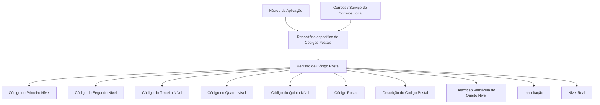

# Definição e Codificação de Códigos Postais na Estrutura Geográfica do Sistema Reef

## 1. Metadados do Documento
- **Arquivo de Origem:** Não identificado no conteúdo fornecido
- **Tipo de Documento:** Especificação Técnica / Documento Funcional
- **Domínio / Sistema:** Reef — Estrutura Geográfica e Códigos Postais
- **Público-Alvo:** Desenvolvedores, Arquitetos, Operação e equipes responsáveis pela manutenção de catálogos geográficos
- **Data/Versão Identificada:** Não identificada
- **Proprietário Identificado:** `user:agonzalez_mapfre.com`
- **Ciclo de Vida Identificado:** Approved Source

---

## 2. Resumo Executivo & Contexto de Negócio

O documento descreve a funcionalidade de definição, codificação e manutenção de Códigos Postais associados à Estrutura Geográfica do sistema Reef. O núcleo do sistema disponibiliza um repositório específico para armazenar essas informações, entregue inicialmente vazio nas instalações.

A associação de um Código Postal depende de cinco níveis da Estrutura Geográfica. Os cinco códigos de nível identificam a localização ou subconjunto geográfico ao qual o Código Postal pertence. O documento apresenta exemplos para Espanha, Madrid e diferentes combinações de chaves geográficas.

Além do identificador do Código Postal, o modelo contempla uma descrição do Código Postal, uma descrição vernácula do quarto nível geográfico, uma propriedade de inabilitação e uma propriedade interna denominada **Nivel Real**. Essas propriedades permitem distinguir códigos postais utilizáveis, registros genéricos e códigos vinculados a níveis específicos da estrutura.

A orientação operacional apresentada recomenda carregar e manter, ao longo do tempo, as codificações definidas pelo Serviço de Correios Local. O documento declara que as informações de exemplo foram obtidas de Correos.

---

## 3. Arquitetura, Componentes & Tecnologias Envolvidas

O conteúdo fornecido não apresenta uma arquitetura de software detalhada, APIs, protocolos, microsserviços, bases de dados, tecnologias de implementação ou ambientes técnicos. O documento descreve apenas o relacionamento funcional entre o núcleo do sistema, o repositório de Códigos Postais e os cinco níveis da Estrutura Geográfica.

### Componentes e entidades identificadas

| Componente / Entidade | Papel descrito |
| :--- | :--- |
| Sistema Reef | Sistema no qual a documentação está publicada e que contém a funcionalidade descrita. |
| Núcleo do Sistema / Aplicação | Componente que disponibiliza a possibilidade de codificar Códigos Postais e utiliza internamente a propriedade **Nivel Real**. |
| Repositório de Informação Específico | Repositório destinado à informação de Códigos Postais; é entregue inicialmente sem conteúdo. |
| Estrutura Geográfica | Estrutura organizada em cinco níveis, utilizada para associar Códigos Postais. |
| Código Postal | Chave associada aos cinco níveis da Estrutura Geográfica. |
| Serviço de Correios Local | Fonte operacional recomendada para carregamento e manutenção das codificações. |
| Correos | Fonte declarada para a informação exibida nos exemplos. |



> **Nota de Análise:** O documento não detalha modelo físico de dados, contratos de API, operações de manutenção, métodos HTTP, autenticação, integração com Correos ou mecanismo técnico de persistência do repositório.

---

## 4. Regras de Negócio, Especificações Funcionais & Processos

### 4.1. Disponibilidade inicial do repositório

1. O núcleo do sistema permite codificar Códigos Postais associados à Estrutura Geográfica.
2. As informações de Códigos Postais são armazenadas em um repositório de informação específico.
3. O repositório é entregue inicialmente vazio nas instalações.

### 4.2. Associação entre Código Postal e Estrutura Geográfica

1. Um Código Postal é associado a cinco níveis da Estrutura Geográfica.
2. Cada um dos cinco níveis possui uma chave de identificação:
   - Código do Primeiro Nível.
   - Código do Segundo Nível.
   - Código do Terceiro Nível.
   - Código do Quarto Nível.
   - Código do Quinto Nível.
3. A propriedade **Código Postal** contém a chave que identifica o Código Postal associado aos cinco níveis da Estrutura Geográfica.

### 4.3. Descrição e idioma

1. A propriedade **Descrição do Código Postal** contém a denominação ou descrição do Código Postal.
2. A denominação do Código Postal deveria ser coerente com o idioma utilizado na definição do Primeiro Nível da Estrutura Geográfica ao qual o Código Postal está associado.
3. A propriedade **Descrição Vernácula do Quarto Nível** contém a denominação ou descrição do Quarto Nível da Estrutura Geográfica.
4. A descrição vernácula deve corresponder ao idioma vernáculo do Primeiro Nível da Estrutura Geográfica ao qual pertence.

### 4.4. Inabilitação de Código Postal

1. A propriedade **Inabilitação** estabelece que determinado Código Postal está inabilitado.
2. Um Código Postal inabilitado não pode ser empregado na configuração dos catálogos da Estrutura Geográfica.

### 4.5. Nivel Real

1. A propriedade **Nivel Real** determina se um Código Postal é um Código Real ou um Nível Genérico.
2. Pode existir apenas um registro com a propriedade **Nivel Real** desativada para cada subconjunto formado pelo Primeiro, Terceiro e Quarto Níveis da Estrutura Geográfica.
3. A propriedade **Nivel Real** é de uso interno.
4. A propriedade **Nivel Real** foi criada pelo núcleo da Aplicação e para uso do núcleo da Aplicação.

### 4.6. Recomendação operacional

1. A prática recomendada é carregar as codificações realizadas pelo Serviço de Correios Local.
2. A prática recomendada inclui manter essas codificações ao longo do tempo.
3. A informação exibida no documento é declarada como obtida de Correos.

### 4.7. Documentação relacionada

O documento recomenda a leitura das seguintes referências para evitar interpretações incorretas decorrentes do uso isolado desta especificação:

- **Denominaciones Locales de los Niveles de la Estructura Geográfica**
- **Preguntas frecuentes**

---

## 5. Tabelas de Parâmetros, Ambientes e Estruturas de Dados

### 5.1. Propriedades do registro de Código Postal

| Item / Parâmetro | Descrição / Função | Tipo / Valores / Formato | Ambiente / Observações |
| :--- | :--- | :--- | :--- |
| Código do Primeiro Nível | Contém a chave que identifica o Primeiro Nível da Estrutura Geográfica. | Chave não detalhada | Associada ao Código Postal. |
| Código do Segundo Nível | Contém a chave que identifica o Segundo Nível da Estrutura Geográfica. | Chave não detalhada | Associada ao Código Postal. |
| Código do Terceiro Nível | Contém a chave que identifica o Terceiro Nível da Estrutura Geográfica. | Chave não detalhada | Associada ao Código Postal. |
| Código do Quarto Nível | Contém a chave que identifica o Quarto Nível da Estrutura Geográfica. | Chave não detalhada | Associada ao Código Postal. |
| Código do Quinto Nível | Contém a chave que identifica o Quinto Nível da Estrutura Geográfica. | Chave não detalhada | Associada ao Código Postal. |
| Código Postal | Contém a chave que identifica o Código Postal associado aos cinco níveis da Estrutura Geográfica. | Exemplos: `28607`, `28801`, `28802`, `28803`, `28100`, `28108`, `28921` | A composição e o tamanho do campo não são detalhados. |
| Descrição do Código Postal | Contém a denominação ou descrição do Código Postal. | Texto não detalhado | Deve ser coerente com o idioma usado na definição do Primeiro Nível associado. |
| Descrição Vernácula do Quarto Nível | Contém a denominação ou descrição do Quarto Nível. | Texto não detalhado | Deve utilizar o idioma vernáculo do Primeiro Nível correspondente. |
| Inabilitação | Indica que o Código Postal está inabilitado para uso na configuração dos catálogos geográficos. | Estado booleano ou formato não detalhado | O formato técnico não é especificado. |
| Nivel Real | Estabelece se o Código Postal é Código Real ou Nível Genérico. | Ativada ou desativada, conforme texto | Uso interno do núcleo da Aplicação. |

### 5.2. Restrição de unicidade para Nivel Real desativado

| Regra | Condição | Limitação |
| :--- | :--- | :--- |
| Registro genérico por subconjunto geográfico | Propriedade **Nivel Real** sem ativação | Pode existir apenas um registro para cada subconjunto formado pelo Primeiro, Terceiro e Quarto Níveis da Estrutura Geográfica. |

### 5.3. Exemplos de codificação geográfica e Códigos Postais

| Chaves de Níveis 1/2/3/4 | Chave / Nome do 5º Nível | Código Postal |
| :--- | :--- | :--- |
| `ESP - 13 - 28 - 0001` | `ZZZZ - Todas las Calles` | `28607` |
| `ESP - 13 - 28 - 0002` | `ZZZZ - Todos los Distritos` | `28801` |
| `ESP - 13 - 28 - 0002` | `ZZZZ - Todos los Distritos` | `28802` |
| `ESP - 13 - 28 - 0002` | `0001 - Barriada 1` | `28803` |
| `ESP - 13 - 28 - 0003` | `ZZZZ - Todos los Distritos` | `28100` |
| `ESP - 13 - 28 - 0003` | `ZZZZ - Todos los Distritos` | `28108` |
| `ESP - 13 - 28 - 0004` | `0A0B - No aplica` | `28921` |

### 5.4. Informação de ambiente, infraestrutura e logs

| Item / Parâmetro | Descrição / Função | Tipo / Valores / Formato | Ambiente / Observações |
| :--- | :--- | :--- | :--- |
| URLs de ambiente | Não identificadas no conteúdo fornecido. | Não aplicável | Não detalhado. |
| Servidores | Não identificados no conteúdo fornecido. | Não aplicável | Não detalhado. |
| Rotas de logs | Não identificadas no conteúdo fornecido. | Não aplicável | Não detalhado. |
| Tecnologias de implementação | Não identificadas no conteúdo fornecido. | Não aplicável | Não detalhado. |
| APIs ou contratos JSON | Não identificados no conteúdo fornecido. | Não aplicável | Não detalhado. |

---

## 6. Bateria de Perguntas & Respostas para RAG (FAQ Sintético)

### P1: Qual é a finalidade do repositório específico de Códigos Postais no sistema Reef?
**R:** O repositório específico armazena a informação de Códigos Postais associados à Estrutura Geográfica. O documento informa que o núcleo do sistema permite realizar essa codificação e que o repositório é entregue inicialmente vazio nas instalações.

### P2: Quais níveis geográficos participam da associação de um Código Postal?
**R:** Um Código Postal é associado aos cinco níveis da Estrutura Geográfica: Primeiro Nível, Segundo Nível, Terceiro Nível, Quarto Nível e Quinto Nível. Cada nível possui uma chave que identifica sua posição na estrutura.

### P3: O que a propriedade Código Postal representa no registro geográfico?
**R:** A propriedade Código Postal contém a chave que identifica o Código Postal associado aos cinco níveis da Estrutura Geográfica.

### P4: Como a descrição de um Código Postal deve considerar o idioma?
**R:** A descrição ou denominação do Código Postal deve manter coerência com o idioma utilizado na definição do Primeiro Nível da Estrutura Geográfica ao qual o Código Postal está associado.

### P5: Para que serve a Descrição Vernácula do Quarto Nível?
**R:** A Descrição Vernácula do Quarto Nível contém a denominação ou descrição do Quarto Nível da Estrutura Geográfica no idioma vernáculo do Primeiro Nível geográfico ao qual esse registro pertence.

### P6: O que acontece quando um Código Postal está marcado com a propriedade Inabilitação?
**R:** Um Código Postal marcado como inabilitado não pode ser empregado na configuração dos catálogos da Estrutura Geográfica.

### P7: O que significa a propriedade Nivel Real?
**R:** A propriedade Nivel Real estabelece se o Código Postal corresponde a um Código Real ou a um Nível Genérico. O documento informa que essa propriedade é de uso interno e foi criada pelo núcleo da Aplicação para o próprio núcleo da Aplicação.

### P8: Qual é a restrição para registros com Nivel Real desativado?
**R:** Pode existir apenas um registro com a propriedade Nivel Real sem ativação para cada subconjunto formado pelo Primeiro, Terceiro e Quarto Níveis da Estrutura Geográfica.

### P9: Qual prática operacional é recomendada para manter a codificação de Códigos Postais?
**R:** A recomendação é carregar e manter ao longo do tempo as codificações realizadas pelo Serviço de Correios Local.

### P10: Qual é a fonte informada para os exemplos de Códigos Postais?
**R:** O documento apresenta a nota “Información obtenida de Correos”, indicando que as informações utilizadas nos exemplos foram obtidas de Correos.

### P11: O documento define APIs, métodos HTTP ou contratos JSON para a manutenção de Códigos Postais?
**R:** Não. O conteúdo fornecido não detalha APIs, métodos HTTP, contratos JSON, autenticação, tecnologias de persistência ou procedimentos técnicos para inclusão e atualização dos registros.

### P12: Qual exemplo é apresentado para Espanha, Madrid e o quinto nível “Barriada 1”?
**R:** O exemplo exibido associa as chaves geográficas `ESP - 13 - 28 - 0002` ao quinto nível `0001 - Barriada 1` e ao Código Postal `28803`.

---

## 7. Glossário de Termos, Siglas & Conceitos-Chave

- **Código Postal:** Propriedade que contém a chave identificadora do Código Postal associado aos cinco níveis da Estrutura Geográfica.
- **Correos:** Fonte declarada da informação exibida nos exemplos do documento.
- **Descrição do Código Postal:** Denominação ou descrição de um Código Postal; deve ser coerente com o idioma do Primeiro Nível associado.
- **Descrição Vernácula do Quarto Nível:** Denominação ou descrição do Quarto Nível no idioma vernáculo do Primeiro Nível correspondente.
- **Estrutura Geográfica:** Estrutura composta por cinco níveis geográficos à qual um Código Postal é associado.
- **Inabilitação:** Propriedade que torna um Código Postal indisponível para uso na configuração dos catálogos da Estrutura Geográfica.
- **Nivel Real:** Propriedade interna que define se o Código Postal é um Código Real ou um Nível Genérico.
- **Nível Genérico:** Categoria de Código Postal citada no documento em oposição a Código Real; o documento não fornece definição adicional.
- **Código Real:** Categoria de Código Postal citada no documento em oposição a Nível Genérico; o documento não fornece definição adicional.
- **Reef:** Sistema ou contexto de documentação identificado no conteúdo fornecido.
- **Serviço de Correios Local:** Entidade cujas codificações devem ser carregadas e mantidas como prática operacional recomendada.
- **ESP:** Código exibido nos exemplos para Espanha.
- **ZZZZ:** Valor exibido em exemplos do quinto nível, como em `ZZZZ - Todas las Calles` e `ZZZZ - Todos los Distritos`; o documento não define tecnicamente esse valor.

---

## 8. Notas Críticas, Riscos & Limitações

- O repositório de Códigos Postais é entregue inicialmente vazio; a carga inicial e a manutenção dos dados são necessárias para disponibilidade funcional das codificações.
- O documento recomenda utilizar e manter as codificações do Serviço de Correios Local, criando dependência operacional da qualidade, atualização e disponibilidade dessa fonte.
- A propriedade **Nivel Real** possui uma restrição de unicidade para registros desativados, limitada a subconjuntos formados pelo Primeiro, Terceiro e Quarto Níveis. Implementações que não respeitem essa condição podem gerar inconsistência de registros genéricos.
- O documento não define o formato técnico, o tamanho, a obrigatoriedade ou regras de validação sintática dos campos de código dos cinco níveis e do Código Postal.
- O documento não informa procedimentos de carga, aprovação, atualização, auditoria, exclusão ou versionamento dos registros de Código Postal.
- O documento não especifica ambientes, URLs, servidores, bancos de dados, APIs, métodos HTTP, autenticação, autorização, rotas de logs, monitoramento ou tratamento de erros.
- O documento recomenda a leitura de documentação funcional relacionada para evitar interpretação isolada incorreta, mas o conteúdo dessas referências não foi fornecido.
- A terceira página é indicada como página em branco ou contendo apenas elementos visuais/imagem, sem conteúdo textual extraído.

---

## 9. Conteúdo Bruto Estruturado (Referência Fiel)

```text
--- [PÁGINA 1 DE 3] ---

DEFINICIÓN de Códigos Postales
Propiedades Generales
Funcionalmente, el núcleo del Sistema cuenta con la posibilidad de codicar los Códigos Postales asociados a la estructura Geográca en un
repositorio de información especíco que se entrega inicialmente a las instalaciones vacío de contenido.
Código del Primer Nivel
Este atributo contiene la clave que identicará el Primer Nivel de la estructura Geográca.
Código del Segundo Nivel
Este atributo contiene la clave que identicará el Segundo Nivel de la estructura Geográca.
Código del Tercer Nivel
Este atributo contiene la clave que identicará el Tercer Nivel de la estructura Geográca.
Código del Cuarto Nivel
Este atributo contiene la clave que identicará el Cuarto Nivel de la estructura Geográca.
Código del Quinto Nivel
Este atributo sostiene la clave que identica al Quinto Nivel de la estructura Geográca.
Código Postal
Esta Propiedad contiene la clave que identica el Código Postal asociado a los cinco niveles de la estructura geográca.
A modo de ejemplo y si el Idioma utilizado en la denición del Primer Nivel de la Estructura es el español para ESP - España / 13 - Madrid y 28
- Madrid:
Claves de Niveles ½/¾ Clave/Nombre 5º Nivel Código Postal
ESP - 13 - 28 - 0001 ZZZZ - Todas las Calles 28607
... ... ...
ESP - 13 - 28 - 0002 ZZZZ - Todos los Distritos 28801
Documentation / DOCUMENTACIÓN Reef
DOCUMENTACIÓN Reef
Mapfredocument
DOCUMENTACIÓN Reef
Owner
user:agonzalez_mapfre.com
Lifecycle
Approved Source
 /
VL
Buscar Inicio Soluciones Arquitecturas APIs Componentes Cloud Documentación Zeus Reef Ayuda
ES


--- [PÁGINA 2 DE 3] ---

Claves de Niveles ½/¾ Clave/Nombre 5º Nivel Código Postal
ESP - 13 - 28 - 0002 ZZZZ - Todos los Distritos 28802
ESP - 13 - 28 - 0002 0001 - Barriada 1 28803
... ... ...
ESP - 13 - 28 - 0003 ZZZZ - Todos los Distritos 28100
ESP - 13 - 28 - 0003 ZZZZ - Todos los Distritos 28108
... ... ...
ESP - 13 - 28 - 0004 0A0B - No aplica 28921
... ... ...
NOTA: Información obtenida de Correos
Descripción del Código Postal
Esta propiedad contiene la denominación o descripción del Código Postal (denominación que por coherencia debería estar en consonancia
con el idioma utilizado en la denición del primer nivel de la estructura al que está asociado).
Descripción Vernácula del Cuarto Nivel
Esta propiedad contiene la denominación o descripción del Cuarto Nivel de la Estructura Geográca de acuerdo con el idioma vernáculo del
Primer Nivel de la estructura geográca al que pertenezca.
Otras Propiedades
Inhabilitación
Esta propiedad establece que el Código Postal está inhabilitado para poder ser empleado en la conguración de los catálogos de la
Estructura Geográca.
Nivel Real
Esta propiedad establece que el Código Postal es un Código Real o un Nivel Genérico (puede existir un único Registro con esta Propiedad sin
activar por cada subconjunto conformado por el Primer, Tercer y Cuarto Niveles de la estructura Geográca)
NOTA: Esta propiedad es de uso interno, creada por y para uso del núcleo de la Aplicación.
Vínculos
Relación de Directrices y Documentos funcionales cuya lectura recomendada para evitar que la interpretación aislada del presente
documento pueda conducir a error.
Denominaciones Locales de los Niveles de la Estructura Geográca
Preguntas frecuentes
(1) ¿Existe alguna recomendación operativa que deba ser tomada en consideración localmente en la codicación, uso y denición de los
Códigos Postales de la Estructura Geográca?
Una práctica modélica es cargar y mantener en el tiempo las codicaciones realizadas por el Servicio de Correos Local.
Audiencia


--- [PÁGINA 3 DE 3] ---

[Página em branco ou apenas elementos visuais/imagem]
```
