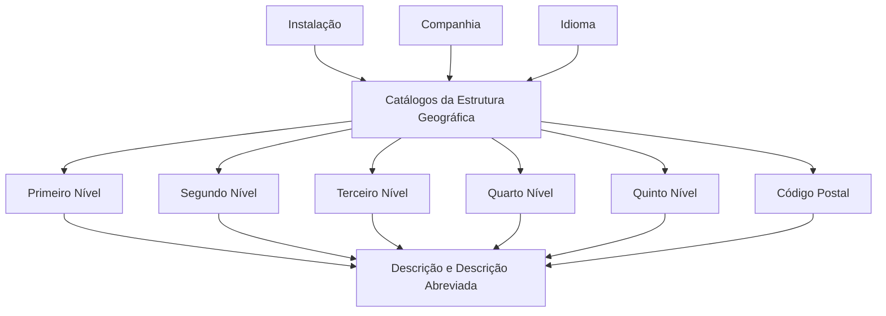

# Definição das Denominações dos Níveis da Estrutura Geográfica

## 1. Metadados do Documento
- **Arquivo de Origem:** Não identificado no conteúdo extraído
- **Tipo de Documento:** Especificação Funcional
- **Domínio / Sistema:** Reef / Estrutura Geográfica / MAPFRE
- **Público-Alvo:** Negócio, Analistas Funcionais e Equipas de Configuração
- **Data/Versão Identificada:** Não identificada
- **Estado identificado:** Approved
- **Owner identificado:** `user:agonzalez_mapfre.com`

---

## 2. Resumo Executivo & Contexto de Negócio

O documento descreve a definição das denominações dos cinco níveis da Estrutura Geográfica e do Código Postal no núcleo do sistema Reef. A funcionalidade permite que cada instalação utilize nomes locais, de acordo com os usos e costumes geográficos de cada país ou operação.

A configuração é armazenada em catálogos de Estrutura Geográfica localizados num repositório de informação específico. O repositório é inicialmente entregue às instalações sem conteúdo, exigindo a definição das denominações aplicáveis à instalação, companhia e idioma.

A definição contém atributos para a descrição completa e abreviada de cada nível geográfico: primeiro, segundo, terceiro, quarto e quinto nível, além do Código Postal. As denominações são configuráveis por idioma.

O documento apresenta exemplos em espanhol para as instalações TRN — Espanha/Núcleo, EUR — MAPFRE Chile e MMX — MAPFRE México. As diferenças demonstram que a estrutura lógica é comum, mas a designação local de cada nível varia por instalação.

---

## 3. Arquitetura, Componentes & Tecnologias Envolvidas

Os componentes e conceitos identificados são:

| Componente / Conceito | Papel identificado |
| :--- | :--- |
| **Reef** | Sistema ou domínio documental em que a definição da Estrutura Geográfica é apresentada. |
| **Núcleo do Sistema** | Contempla a facilidade de designar as denominações dos cinco níveis geográficos. |
| **Catálogos de Estrutura Geográfica** | Contêm a configuração das denominações dos níveis geográficos. |
| **Repositório de informação específico** | Repositório entregue inicialmente às instalações sem conteúdo. |
| **Instalação** | Contexto operacional que determina as denominações locais aplicáveis. |
| **Companhia** | Código da companhia para a qual é realizada a definição da Atividade do Terceiro. |
| **Idioma** | Chave do idioma usada para definir as descrições dos níveis geográficos. |
| **Código Postal** | Elemento da Estrutura Geográfica com denominação e abreviatura próprias. |



> **Nota de Análise:** O documento descreve a configuração funcional das denominações geográficas, mas não detalha interfaces de utilizador, APIs, contratos JSON, persistência física, métodos HTTP ou mecanismos de integração.

---

## 4. Regras de Negócio, Especificações Funcionais & Processos

1. O núcleo do sistema deve permitir designar as denominações dos cinco níveis da Estrutura Geográfica.
2. As denominações devem ser definidas de acordo com os nomes, usos e costumes locais.
3. As denominações são configuradas nos catálogos que contêm a Estrutura Geográfica.
4. Os catálogos residem num repositório de informação específico.
5. O repositório é entregue inicialmente às instalações vazio de conteúdo.
6. A propriedade **Companhia** identifica o código da companhia sobre a qual é realizada a definição da Atividade do Terceiro.
7. A propriedade **Idioma** é a chave do idioma utilizado na definição das descrições dos níveis geográficos.
8. O documento cita como exemplos de idioma: espanhol, inglês e turco.
9. Cada nível geográfico possui uma descrição local e uma descrição abreviada local.
10. A estrutura configurável contém cinco níveis geográficos e uma designação para Código Postal.
11. Para TRN — Espanha/Núcleo, as denominações locais em espanhol são: País, Comunidade/Cidade Autónoma, Província, Município/Localidade, Distrito e Código Postal.
12. Para EUR — MAPFRE Chile, as denominações locais em espanhol são: País, Região, Província, Comunas, Localidades e Código Postal.
13. Para MMX — MAPFRE México, as denominações locais em espanhol são: País, Entidades Federativas, Municípios/Demarcação Territorial, Localidades/Delegações, Colonias e Código Postal.
14. O documento recomenda a leitura de diretrizes e documentos funcionais relacionados para evitar que a interpretação isolada cause erro.

---

## 5. Tabelas de Parâmetros, Ambientes e Estruturas de Dados

| Item / Parâmetro | Descrição / Função | Tipo / Valores / Formato | Ambiente / Observações |
| :--- | :--- | :--- | :--- |
| Companhia | Indica o código da companhia sobre a qual é realizada a definição da Atividade do Terceiro. | Código de companhia | Não são apresentados valores ou formato técnico. |
| Idioma | Chave do idioma usado na definição das descrições dos níveis geográficos. | Chave de idioma | Exemplos citados: espanhol, inglês, turco. |
| Descrição do Primeiro Nível | Denominação local que identifica o primeiro nível da Estrutura Geográfica. | Texto | Configurável por idioma. |
| Descrição Abreviada do Primeiro Nível | Abreviatura da denominação local do primeiro nível. | Texto abreviado | Configurável por idioma. |
| Descrição do Segundo Nível | Denominação local que identifica o segundo nível da Estrutura Geográfica. | Texto | Configurável por idioma. |
| Descrição Abreviada do Segundo Nível | Abreviatura da denominação local do segundo nível. | Texto abreviado | Configurável por idioma. |
| Descrição do Terceiro Nível | Denominação local que identifica o terceiro nível da Estrutura Geográfica. | Texto | Configurável por idioma. |
| Descrição Abreviada do Terceiro Nível | Abreviatura da denominação local do terceiro nível. | Texto abreviado | Configurável por idioma. |
| Descrição do Quarto Nível | Denominação local que identifica o quarto nível da Estrutura Geográfica. | Texto | Configurável por idioma. |
| Descrição Abreviada do Quarto Nível | Abreviatura da denominação local do quarto nível. | Texto abreviado | Configurável por idioma. |
| Descrição do Quinto Nível | Denominação local que identifica o quinto nível da Estrutura Geográfica. | Texto | Configurável por idioma. |
| Descrição Abreviada do Quinto Nível | Abreviatura da denominação local do quinto nível. | Texto abreviado | Configurável por idioma. |
| Descrição do Código Postal | Denominação local que identifica o Código Postal da Estrutura Geográfica. | Texto | Configurável por idioma. |
| Descrição Abreviada do Código Postal | Abreviatura da denominação local do Código Postal. | Texto abreviado | Configurável por idioma. |

| Instalação | Nível da Estrutura | Denominação Local em Espanhol |
| :--- | :--- | :--- |
| TRN — Espanha/Núcleo | Primeiro Nível | País |
| TRN — Espanha/Núcleo | Segundo Nível | Comunidade/Cidade Autónoma |
| TRN — Espanha/Núcleo | Terceiro Nível | Província |
| TRN — Espanha/Núcleo | Quarto Nível | Município/Localidade |
| TRN — Espanha/Núcleo | Quinto Nível | Distrito |
| TRN — Espanha/Núcleo | Código Postal | Código Postal |
| EUR — MAPFRE Chile | Primeiro Nível | País |
| EUR — MAPFRE Chile | Segundo Nível | Região |
| EUR — MAPFRE Chile | Terceiro Nível | Província |
| EUR — MAPFRE Chile | Quarto Nível | Comunas |
| EUR — MAPFRE Chile | Quinto Nível | Localidades |
| EUR — MAPFRE Chile | Código Postal | Código Postal |
| MMX — MAPFRE México | Primeiro Nível | País |
| MMX — MAPFRE México | Segundo Nível | Entidades Federativas |
| MMX — MAPFRE México | Terceiro Nível | Municípios / Demarcação Territorial |
| MMX — MAPFRE México | Quarto Nível | Localidades / Delegações |
| MMX — MAPFRE México | Quinto Nível | Colonias |
| MMX — MAPFRE México | Código Postal | Código Postal |

---

## 6. Bateria de Perguntas & Respostas para RAG (FAQ Sintético)

### P1: Qual é o objetivo da definição das denominações da Estrutura Geográfica no Reef?
**R:** O objetivo é permitir que o núcleo do sistema Reef designe as denominações dos cinco níveis da Estrutura Geográfica conforme os nomes, usos e costumes locais de cada instalação.

### P2: Onde são configuradas as denominações dos níveis geográficos?
**R:** As denominações são configuradas nos catálogos que contêm a Estrutura Geográfica, localizados num repositório de informação específico entregue inicialmente às instalações sem conteúdo.

### P3: Qual é a função da propriedade Companhia?
**R:** A propriedade Companhia indica o código da companhia sobre a qual está a ser realizada a definição da Atividade do Terceiro.

### P4: Qual é a função da propriedade Idioma?
**R:** A propriedade Idioma corresponde à chave do idioma utilizada na definição das descrições dos níveis da Estrutura Geográfica. O documento cita espanhol, inglês e turco como exemplos.

### P5: Quais níveis geográficos podem ter descrição e descrição abreviada configuradas?
**R:** Podem ser configuradas descrições completas e abreviadas para o primeiro, segundo, terceiro, quarto e quinto níveis da Estrutura Geográfica, bem como para o Código Postal.

### P6: Como os níveis da Estrutura Geográfica são denominados em TRN — Espanha/Núcleo?
**R:** Em TRN — Espanha/Núcleo, os níveis são denominados País, Comunidade/Cidade Autónoma, Província, Município/Localidade, Distrito e Código Postal.

### P7: Como os níveis da Estrutura Geográfica são denominados em EUR — MAPFRE Chile?
**R:** Em EUR — MAPFRE Chile, os níveis são denominados País, Região, Província, Comunas, Localidades e Código Postal.

### P8: Como os níveis da Estrutura Geográfica são denominados em MMX — MAPFRE México?
**R:** Em MMX — MAPFRE México, os níveis são denominados País, Entidades Federativas, Municípios/Demarcação Territorial, Localidades/Delegações, Colonias e Código Postal.

### P9: O documento define APIs ou contratos técnicos para a Estrutura Geográfica?
**R:** Não. O conteúdo extraído descreve atributos e denominações funcionais da Estrutura Geográfica, sem detalhar APIs, métodos HTTP, contratos JSON, tabelas físicas ou mecanismos de integração.

### P10: Por que devem ser consultados documentos relacionados à Estrutura Geográfica?
**R:** O documento informa que a leitura de diretrizes e documentos funcionais relacionados é recomendada para evitar que uma interpretação isolada do conteúdo conduza a erro.

---

## 7. Glossário de Termos, Siglas & Conceitos-Chave

- **Reef:** Sistema ou contexto documental identificado no cabeçalho do conteúdo extraído.
- **Estrutura Geográfica:** Estrutura composta por cinco níveis geográficos e Código Postal, cujas denominações podem variar por instalação e idioma.
- **Instalação:** Contexto operacional para o qual as denominações locais da Estrutura Geográfica são definidas.
- **Companhia:** Código da companhia sobre a qual é realizada a definição da Atividade do Terceiro.
- **Idioma:** Chave utilizada para definir as descrições dos níveis geográficos.
- **Código Postal:** Elemento da Estrutura Geográfica com denominação local e abreviação configuráveis.
- **TRN:** Identificador apresentado para a instalação Espanha/Núcleo.
- **EUR:** Identificador apresentado para a instalação MAPFRE Chile.
- **MMX:** Identificador apresentado para a instalação MAPFRE México.

---

## 8. Notas Críticas, Riscos & Limitações

- O repositório de informação é entregue inicialmente vazio às instalações; a configuração das denominações locais é necessária para tornar a Estrutura Geográfica compreensível no contexto operacional local.
- O documento não define os formatos técnicos dos códigos de companhia, chaves de idioma ou campos de descrição.
- O documento não detalha validações, permissões, fluxos de aprovação, persistência, integrações ou interfaces de manutenção.
- As siglas TRN, EUR e MMX são associadas às instalações apresentadas, mas o documento não expande formalmente o significado das siglas.
- A interpretação isolada deste documento pode causar erro; a consulta à documentação relacionada de Estrutura Geográfica e Perguntas Frequentes é recomendada.
- A extração contém caracteres corrompidos, como `Geográca` e `denición`; o significado foi preservado quando inequívoco, sem introduzir conteúdo não presente na fonte.

---

## 9. Conteúdo Bruto Estruturado (Referência Fiel)

```text
--- [PÁGINA 1 DE 3] ---

DEFINICIÓN de las Denominaciones de los Niveles de la Estructura
Geográca
Propiedades Generales
Funcionalmente, el núcleo del Sistema contempla la facilidad de poder Designar (de acuerdo con los nombres, usos y costumbres locales)
las denominaciones de los Cinco Niveles en los Catálogos que contienen la Estructura Geográca en un repositorio de información especíco
que se entrega inicialmente a las instalaciones vacío de contenido.
Compañía.
Esta propiedad le indica al sistema el código de la compañía sobre la que se está realizando la denición de la Actividad del Tercero.
Idioma.
Esta propiedad es la clave del Idioma empleado en la denición de las descripciones de los niveles de la Estructura Geográca, como por
ejemplo: español, inglés, turco, ...
Descripción del Primer Nivel
Este atributo contiene la denominación local por la cual será identicada el Primer Nivel de la estructura Geográca.
Descripción Abreviada del Primer Nivel
Este atributo contiene la abreviatura de la denominación local por la cual será identicada el Primer Nivel de la estructura Geográca.
Descripción del Segundo Nivel
Este atributo contiene la denominación local por la cual será identicada el Segundo Nivel de la estructura Geográca.
Descripción Abreviada del Segundo Nivel
Este atributo contiene la abreviatura de la denominación local por la cual será identicada el Segundo Nivel de la estructura Geográca.
Descripción del Tercer Nivel
Este atributo contiene la denominación local por la cual será identicada el Tercer Nivel de la estructura Geográca.
Descripción Abreviada del Tercer Nivel
Este atributo contiene la abreviatura de la denominación local por la cual será identicada el Tercer Nivel de la estructura Geográca.
Descripción del Cuarto Nivel
Documentation / DOCUMENTACIÓN Reef
DOCUMENTACIÓN Reef
Mapfredocument
DOCUMENTACIÓN Reef
Owner
user:agonzalez_mapfre.com
Lifecycle
Approved Source
 / 
 VL
Buscar Inicio Soluciones Arquitecturas APIs Componentes Cloud Documentación Zeus Reef Ayuda
ES

--- [PÁGINA 2 DE 3] ---

Este atributo contiene la denominación local por la cual será identicada el Cuarto Nivel de la estructura Geográca.
Descripción Abreviada del Cuarto Nivel
Este atributo contiene la abreviatura de la denominación local por la cual será identicada el Cuarto Nivel de la estructura Geográca.
Descripción del Quinto Nivel
Este atributo contiene la denominación local por la cual será identicada el Quinto Nivel de la estructura Geográca.
Descripción Abreviada del Quinto Nivel
Este atributo contiene la abreviatura de la denominación local por la cual será identicada el Quinto Nivel de la estructura Geográca.
Descripción del Código Postal
Este atributo contiene la denominación local por la cual será identicada el Código Postal de la estructura Geográca.
Descripción Abreviada del Código Postal
Este atributo contiene la abreviatura de la denominación local por la cual será identicada el Código Postal de la estructura Geográca.
A modo de ejemplo y si el Idioma utilizado en la denición es el español:
Instalación Nivel de la Estructura Denominación Local
TRN - España/Núcleo Primer Nivel País
Segundo Nivel Comunidad/Ciudad Autónoma
Tercer Nivel Provincia
Cuarto Nivel Municipio/Localidad
Quinto Nivel Distrito
Código Postal Código Postal
EUR - MAPFRE Chile Primer Nivel País
Segundo Nivel Región
Tercer Nivel Provincia
Cuarto Nivel Comunas
Quinto Nivel Localidades
Código Postal Código Postal
MMX - MAPFRE México Primer Nivel País
Segundo Nivel Entidades Federativas
Tercer Nivel Municipios / Demarcación Territorial

--- [PÁGINA 3 DE 3] ---

Instalación Nivel de la Estructura Denominación Local
Cuarto Nivel Localidades / Delegaciones
Quinto Nivel Colonias
Código Postal Código Postal
Vínculos
Relación de Directrices y Documentos funcionales cuya lectura recomendada para evitar que la interpretación aislada del presente
documento pueda conducir a error.
Estructura Geográca
Preguntas frecuentes
(1)
Audiencia
```
