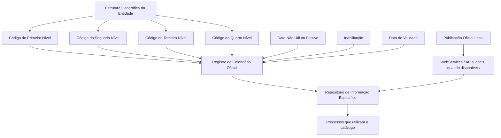

# Definição do Calendário Oficial — Dias Não Úteis e Festivos na Estrutura Geográfica

## 1. Metadados do Documento
- **Arquivo de Origem:** Não identificado no conteúdo fornecido
- **Tipo de Documento:** Especificação Funcional
- **Domínio / Sistema:** Reef / Calendário Oficial associado à Estrutura Geográfica da Entidade
- **Público-Alvo:** Analistas funcionais, operação e equipes responsáveis pela configuração de catálogos
- **Data/Versão Identificada:** Não identificada

---

## 2. Resumo Executivo & Contexto de Negócio

O documento define o catálogo de **Calendário Laboral Oficial**, utilizado para identificar dias não úteis e festividades aplicáveis aos diferentes níveis da Estrutura Geográfica de uma Entidade. O objetivo funcional é permitir que o núcleo do Sistema disponha de um repositório específico para codificar e consultar essas datas.

O repositório de informações do Calendário Oficial é entregue inicialmente sem conteúdo. Portanto, o calendário deve ser configurado pela organização, associando cada data não útil ou festiva aos códigos dos níveis geográficos correspondentes.

A configuração possui mecanismos para preservar histórico. A propriedade **Data de Validade** determina a partir de quando um registro de dia não útil ou festivo passa a estar operacional no Sistema. O uso correto dessa data permite registrar mudanças sucessivas na configuração do catálogo.

O documento também define uma propriedade de **Inabilitação**, que marca uma data registrada como indisponível para uso por processos que consumam informações configuradas no catálogo. Como recomendação operacional, as datas devem ser cadastradas conforme sua publicação oficial e, quando disponíveis localmente, por meio de WebServices, APIs ou mecanismos equivalentes.

---

## 3. Arquitetura, Componentes & Tecnologias Envolvidas

Os componentes e conceitos explicitamente citados são:

- **Núcleo do Sistema:** componente que possui a capacidade funcional de codificar o Calendário Laboral Oficial.
- **Repositório de informação específico:** local destinado ao armazenamento da configuração de dias não úteis e festividades.
- **Calendário Laboral Oficial:** catálogo que concentra as datas aplicáveis à Estrutura Geográfica.
- **Estrutura Geográfica da Entidade:** estrutura organizada em quatro níveis identificados por códigos.
- **Processos consumidores do catálogo:** processos que utilizam, de alguma forma, as informações configuradas no Calendário Oficial.
- **WebServices e APIs:** possíveis mecanismos locais recomendados para registrar datas do calendário conforme publicações oficiais.
- **Configuração da Estrutura Geográfica:** documento funcional relacionado cuja leitura é recomendada.



**Nota de Análise:** o documento não detalha o modelo físico do repositório, contratos de WebServices/APIs, métodos HTTP, formatos de integração, tecnologias de persistência, autenticação ou regras de precedência entre níveis geográficos.

---

## 4. Regras de Negócio, Especificações Funcionais & Processos

### 4.1 Objetivo funcional do Calendário Oficial

1. O núcleo do Sistema deve permitir a codificação do Calendário Laboral Oficial.
2. O Calendário Laboral Oficial deve identificar:
   - Dias não úteis.
   - Festividades.
3. Dias não úteis e festividades devem corresponder aos diferentes níveis da Estrutura Geográfica da Entidade.
4. As informações devem ser armazenadas em um repositório específico.
5. O repositório é entregue inicialmente vazio, sem conteúdo pré-configurado.

### 4.2 Associação geográfica

Cada registro de calendário pode identificar a localização organizacional ou territorial aplicável por meio de quatro códigos:

1. Código do Primeiro Nível da Estrutura Geográfica.
2. Código do Segundo Nível da Estrutura Geográfica.
3. Código do Terceiro Nível da Estrutura Geográfica.
4. Código do Quarto Nível da Estrutura Geográfica.

O documento declara que cada código contém a chave identificadora do respectivo nível da Estrutura Geográfica.

### 4.3 Registro de data não útil ou festividade

1. A propriedade **Data Não Útil ou Festivo** armazena a data considerada não útil ou uma festividade.
2. A classificação da data é aplicada à Estrutura Geográfica registrada no catálogo.
3. O documento não especifica se uma mesma data pode ser registrada simultaneamente como não útil e festividade, nem informa um atributo separado para distinguir formalmente essas duas classificações.

### 4.4 Inabilitação

1. A propriedade **Inabilitação** estabelece que a data registrada está inabilitada.
2. Quando uma data está inabilitada, ela não pode ser empregada por processos que utilizem, direta ou indiretamente, a informação configurada no catálogo.
3. O documento não detalha valores possíveis, formato do campo, comportamento de reativação ou critérios de auditoria da inabilitação.

### 4.5 Data de Validade e histórico

1. A propriedade **Data de Validade** informa a data a partir da qual o registro contendo uma data não útil ou festividade torna-se operacional no Sistema.
2. A utilização correta da Data de Validade permite manter histórico das mudanças realizadas nas configurações do catálogo.
3. O documento não informa uma data de fim de validade, mecanismo de versionamento, regra de substituição de registros ou comportamento diante de sobreposição entre registros ativos.

### 4.6 Recomendação operacional de carga

1. Recomenda-se registrar as datas do calendário conforme sua publicação oficial.
2. Quando existirem mecanismos locais disponíveis, recomenda-se utilizar WebServices, APIs ou recursos equivalentes para realizar o cadastro.
3. A recomendação é apresentada como prática operacional; o documento não estabelece obrigatoriedade técnica, periodicidade de sincronização, processo de aprovação ou responsável pela carga.

### 4.7 Dependência documental

A leitura da documentação de **Configuração da Estrutura Geográfica** é recomendada. O documento alerta que a interpretação isolada da definição do Calendário Oficial pode conduzir a erro.

---

## 5. Tabelas de Parâmetros, Ambientes e Estruturas de Dados

| Item / Parâmetro | Descrição / Função | Tipo / Valores / Formato | Ambiente / Observações |
| :--- | :--- | :--- | :--- |
| Calendário Laboral Oficial | Catálogo destinado a identificar dias não úteis e festividades. | Não especificado. | Associado aos níveis da Estrutura Geográfica da Entidade. |
| Repositório de informação específico | Repositório utilizado para armazenar a configuração do Calendário Oficial. | Não especificado. | Entregue inicialmente vazio. |
| Código do Primeiro Nível | Contém a chave que identifica o primeiro nível da Estrutura Geográfica. | Código/chave; formato não especificado. | Aplicável ao registro de calendário. |
| Código do Segundo Nível | Contém a chave que identifica o segundo nível da Estrutura Geográfica. | Código/chave; formato não especificado. | Aplicável ao registro de calendário. |
| Código do Terceiro Nível | Contém a chave que identifica o terceiro nível da Estrutura Geográfica. | Código/chave; formato não especificado. | Aplicável ao registro de calendário. |
| Código do Quarto Nível | Contém a chave que identifica o quarto nível da Estrutura Geográfica. | Código/chave; formato não especificado. | Aplicável ao registro de calendário. |
| Data Não Útil ou Festivo | Armazena a data considerada não útil ou festividade para a Estrutura Geográfica registrada. | Data; formato não especificado. | O documento não diferencia tecnicamente os tipos “não útil” e “festividade”. |
| Inabilitação | Indica que a data registrada não pode ser utilizada pelos processos que consomem o catálogo. | Não especificado. | Afeta processos que utilizem a informação configurada. |
| Data de Validade | Define a partir de quando o registro se torna operacional no Sistema. | Data; formato não especificado. | Permite histórico de alterações no catálogo. |
| WebServices / APIs locais | Possíveis meios para registrar localmente datas do calendário. | Não especificado. | Recomendados quando disponíveis. |
| Publicação oficial | Referência recomendada para o registro das datas de calendário. | Não aplicável. | Deve orientar a codificação das datas. |

---

## 6. Bateria de Perguntas & Respostas para RAG (FAQ Sintético)

### P1: Qual é o objetivo do Calendário Laboral Oficial?
**R:** O Calendário Laboral Oficial permite ao núcleo do Sistema codificar e manter datas não úteis e festividades correspondentes aos diferentes níveis da Estrutura Geográfica da Entidade, utilizando um repositório de informação específico.

### P2: O repositório do Calendário Oficial já possui datas configuradas na instalação inicial?
**R:** Não. O documento informa que o repositório específico de informações é entregue inicialmente vazio de conteúdo, exigindo configuração posterior das datas não úteis e festividades.

### P3: Quais níveis geográficos podem ser identificados em um registro do Calendário Oficial?
**R:** Um registro pode conter códigos para o Primeiro, Segundo, Terceiro e Quarto níveis da Estrutura Geográfica. Cada código contém a chave identificadora do respectivo nível.

### P4: Para que serve a propriedade “Data Não Útil ou Festivo”?
**R:** A propriedade armazena a data que deve ser considerada não útil ou uma festividade para a Estrutura Geográfica registrada no catálogo.

### P5: O que ocorre quando uma data está marcada com Inabilitação?
**R:** A Inabilitação estabelece que a data registrada não pode ser utilizada pelos processos que usem, de uma forma ou outra, a informação configurada no catálogo.

### P6: Qual é a função da Data de Validade no Calendário Oficial?
**R:** A Data de Validade informa a partir de qual data o registro que contém uma data não útil ou festividade está operacional no Sistema. Seu uso correto permite manter histórico das alterações efetuadas nas configurações do catálogo.

### P7: Como devem ser cadastradas as datas do Calendário Oficial?
**R:** A recomendação operacional é registrar as datas conforme sua publicação oficial. Quando houver disponibilidade local, o cadastro pode ser realizado mediante WebServices, APIs ou mecanismos equivalentes.

### P8: O documento define contratos ou métodos técnicos para integração via API?
**R:** Não. O documento apenas recomenda o uso de possíveis WebServices e APIs locais para realizar o registro das datas, mas não detalha métodos HTTP, contratos, autenticação, formatos de payload ou endpoints.

### P9: Existe documentação relacionada que deve ser consultada?
**R:** Sim. O documento recomenda a leitura da documentação de Configuração da Estrutura Geográfica, pois a interpretação isolada do documento de Calendário Oficial pode levar a erros.

### P10: O documento especifica como diferenciar tecnicamente uma festividade de um dia não útil?
**R:** Não. O texto menciona a propriedade “Data Não Útil ou Festivo”, mas não apresenta um campo, código, enumeração ou regra que diferencie tecnicamente as duas classificações.

---

## 7. Glossário de Termos, Siglas & Conceitos-Chave

- **API:** Interface de programação mencionada como possível mecanismo local para registrar datas do calendário.
- **Calendário Laboral Oficial:** catálogo de configuração de dias não úteis e festividades aplicáveis à Estrutura Geográfica da Entidade.
- **Data de Validade:** data a partir da qual o registro de uma data não útil ou festividade torna-se operacional no Sistema.
- **Estrutura Geográfica:** estrutura da Entidade organizada em Primeiro, Segundo, Terceiro e Quarto níveis.
- **Festividade:** data registrada no Calendário Oficial como festividade para uma Estrutura Geográfica.
- **Inabilitação:** propriedade que estabelece que uma data registrada não pode ser utilizada por processos que consumam o catálogo.
- **Reef:** nome exibido no cabeçalho da documentação fornecida.
- **WebService:** mecanismo de integração citado como possível recurso local para registrar datas no Sistema.

---

## 8. Notas Críticas, Riscos & Limitações

- O repositório de Calendário Oficial é inicialmente entregue vazio; a ausência de carga inicial pode afetar processos que dependam de dias não úteis ou festividades configurados.
- O documento recomenda registrar datas segundo sua publicação oficial, mas não detalha o processo de validação, aprovação, reconciliação ou atualização dessas publicações.
- WebServices e APIs são mencionados apenas como possibilidades locais; não há especificação de contrato, endpoint, autenticação, formato de mensagens ou tratamento de erros.
- Não há detalhamento sobre a precedência entre os quatro níveis da Estrutura Geográfica quando diferentes registros aplicáveis tiverem datas conflitantes.
- Não são especificados formatos de data, obrigatoriedade dos códigos geográficos, comportamento para campos vazios ou unicidade dos registros.
- Não há definição de uma data final de validade, de regras de expiração ou de mecanismo de substituição de registros históricos.
- A leitura isolada deste documento pode conduzir a interpretações incorretas; a documentação de Configuração da Estrutura Geográfica é explicitamente indicada como dependência funcional.
- **Nota de Análise:** o documento lista a possibilidade de uso de WebServices e APIs, porém não detalha quais integrações existem, como são disponibilizadas ou quais operações de cadastro suportam.

---

## 9. Conteúdo Bruto Estruturado (Referência Fiel)

```text
--- [PÁGINA 1 DE 2] ---

DEFINICIÓN del Calendario Ocial - Días Inhábiles y Festivos
Objetivo
Funcionalmente, el núcleo del Sistema cuenta con la posibilidad de codicar el Calendario Laboral Ocial identicando los días Inhábiles y las
Festividades que corresponden a los distintos niveles de la Estructura Geográca de la Entidad en un repositorio de información especíco
que se entrega inicialmente a las instalaciones vacío de contenido.
Propiedades
Otras Propiedades
Propiedades
Código del Primer Nivel
Este atributo contiene la clave que identicará el Primer Nivel de la estructura Geográca.
Código del Segundo Nivel
Este atributo contiene la clave que identicará el Segundo Nivel de la estructura Geográca.
Código del Tercer Nivel
Este atributo contiene la clave que identicará el Tercer Nivel de la estructura Geográca.
Código del Cuarto Nivel
Este atributo contiene la clave que identicará el Cuarto Nivel de la estructura Geográca.
Fecha Inhábil o Festivo
Esta Propiedad contiene la Fecha que se considera Inhábil o Festividad en la Estructura Geográca registrada.
Otras Propiedades
Inhabilitación
Esta propiedad establece que la Fecha registrada está inhabilitada para poder ser empleada en los procesos que utilicen de una u otra forma
la información congurada en el catálogo.
Fecha de Validez
Documentation / DOCUMENTACIÓN Reef
DOCUMENTACIÓN Reef
Mapfredocument
DOCUMENTACIÓN Reef
Owner
user:agonzalez_mapfre.com
Lifecycle
Approved Source
 /
VL
Buscar Inicio Soluciones Arquitecturas APIs Componentes Cloud Documentación Zeus Reef Ayuda
ES

--- [PÁGINA 2 DE 2] ---

Esta propiedad le indica al Sistema la fecha a partir de la cual el registro que contiene la fecha Inhábil o Festividad está operativa en el
sistema por lo que su correcto uso permite tener un histórico de los cambios efectuados en las conguraciones del catálogo.
Vínculos
Relación de Directrices y Documentos funcionales cuya lectura recomendada para evitar que la interpretación aislada del presente
documento pueda conducir a error.
Conguración de la Estructura Geográca
Preguntas frecuentes
(1) ¿Existe alguna recomendación operativa que deba ser tomada en consideración localmente en la codicación, uso y denición del
Calendario Ocial asociado a la Estructura Geográca?
Una práctica que se recomienda es registrar en el Sistema las fechas del calendario de acuerdo con su publicación ocial y mediante el uso
de los posibles WebServices, API's, ... que pudieran proporcionarse localmente para realizarlo.
```
