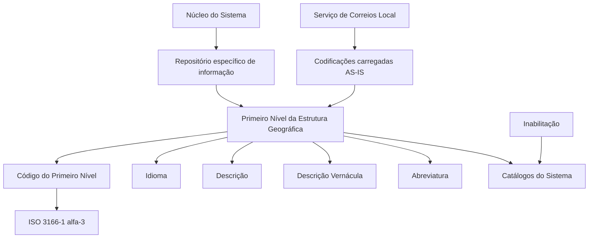

# Definição do Primeiro Nível da Estrutura Geográfica — Países

## 1. Metadados do Documento
- **Arquivo de Origem:** `Não identificado`
- **Tipo de Documento:** `Especificação Técnica`
- **Domínio / Sistema:** `Reef / Sistema de Estrutura Geográfica`
- **Público-Alvo:** `Negócio, analistas funcionais, operação e equipes responsáveis por catálogos do Sistema`
- **Data/Versão Identificada:** `Não identificada`

---

## 2. Resumo Executivo & Contexto de Negócio

O documento define as propriedades funcionais do **Primeiro Nível da Estrutura Geográfica**, correspondente ao catálogo de países no Sistema. O núcleo do Sistema disponibiliza um repositório específico para codificar esse nível geográfico.

A identificação dos países deve utilizar códigos da norma **ISO 3166-1 alfa-3**, publicada pela Organização Internacional de Normalização. A regra garante que países, territórios dependentes e zonas especiais de interesse geográfico sejam representados por uma codificação padronizada.

Cada registro do Primeiro Nível possui idioma, código, descrição, descrição vernácula e abreviatura. As propriedades permitem que uma mesma entidade geográfica seja identificada de acordo com o idioma utilizado na definição e com seu idioma vernáculo.

O documento também prevê a inabilitação de códigos para impedir seu uso nos catálogos do Sistema. Como recomendação operacional local, orienta-se utilizar as codificações do Serviço de Correios Local e carregá-las no Sistema **AS-IS**.

---

## 3. Arquitetura, Componentes & Tecnologias Envolvidas

Os elementos identificados são:

| Componente / Conceito | Função descrita |
| :--- | :--- |
| Núcleo do Sistema | Disponibiliza a possibilidade de codificar o Primeiro Nível da Estrutura Geográfica. |
| Repositório de informação específico | Armazena a codificação do Primeiro Nível da Estrutura Geográfica. |
| Primeiro Nível da Estrutura Geográfica | Nível que contém a informação de países. |
| Catálogos do Sistema | Consumem os códigos de nível que não estejam inabilitados. |
| ISO 3166-1 alfa-3 | Norma exigida para configurar códigos de países, territórios dependentes e zonas especiais de interesse geográfico. |
| Serviço de Correios Local | Fonte recomendada para codificações locais carregadas AS-IS. |
| Reef / Mapfredocument | Contexto documental exibido no conteúdo extraído. |



**Nota de Análise:** o documento não detalha tecnologias de implementação, banco de dados, APIs, contratos HTTP, formatos de integração, permissões ou fluxos de publicação dos catálogos.

---

## 4. Regras de Negócio, Especificações Funcionais & Processos

### 4.1 Escopo funcional do Primeiro Nível

1. O núcleo do Sistema possui capacidade para codificar o Primeiro Nível da Estrutura Geográfica.
2. A codificação é mantida em um repositório de informação específico.
3. O Primeiro Nível contém a informação relativa a países.

### 4.2 Regra de codificação de países

1. Os códigos configurados para o Primeiro Nível devem corresponder à norma **ISO 3166-1 alfa-3**.
2. A norma ISO 3166-1 alfa-3 é publicada pela Organização Internacional de Normalização.
3. A codificação deve representar:
   - Países;
   - Territórios dependentes;
   - Zonas especiais de interesse geográfico.

### 4.3 Propriedades do registro geográfico

1. **Idioma:** identifica o idioma empregado na definição do nível da estrutura.
2. **Código do Primeiro Nível:** identifica a chave do Primeiro Nível da Estrutura Geográfica no Sistema.
3. **Descrição do Primeiro Nível:** contém a denominação ou descrição da chave do nível, conforme o idioma usado na definição.
4. **Descrição Vernácula do Primeiro Nível:** contém a denominação ou descrição do Primeiro Nível de acordo com o idioma vernáculo.
5. **Abreviatura do Primeiro Nível:** contém a denominação ou descrição abreviada do Primeiro Nível, conforme o idioma utilizado na definição.
6. **Inabilitação:** determina que o código do nível fique inabilitado para emprego nos catálogos do Sistema.

### 4.4 Exemplos apresentados para definição em espanhol

Quando o idioma utilizado na definição é espanhol, o documento apresenta os seguintes exemplos:

| Chave do Primeiro Nível | Descrição | Vernáculo | Abreviatura |
| :--- | :--- | :--- | :--- |
| PAN | Panamá | Panamá | Pan. |
| USA | Estados Unidos | United States of America | USA |
| ESP | España | España | Esp. |
| MEX | México | Estados Unidos Mexicanos | Méx |

### 4.5 Recomendação operacional local

A pergunta frequente apresentada trata de recomendações locais para codificação, uso e definição de catálogo. A prática recomendada como modelo é:

1. Utilizar as codificações realizadas pelo **Serviço de Correios Local**.
2. Carregar essas codificações no Sistema **AS-IS**.

**Nota de Análise:** a pergunta frequente menciona “catálogo de Categorías”, enquanto o restante do documento trata da Estrutura Geográfica e de países. O conteúdo não explica se “catálogo de Categorías” é uma referência genérica, uma dependência funcional ou uma inconsistência editorial.

---

## 5. Tabelas de Parâmetros, Ambientes e Estruturas de Dados

| Item / Parâmetro | Descrição / Função | Tipo / Valores / Formato | Ambiente / Observações |
| :--- | :--- | :--- | :--- |
| Idioma | Identifica o idioma empregado na definição do nível da estrutura. | Códigos que identifiquem idiomas, como espanhol, inglês e turco. | O documento não define padrão de código para idiomas. |
| Código do Primeiro Nível | Chave que identifica o Primeiro Nível da Estrutura Geográfica no Sistema. | Código ISO 3166-1 alfa-3. | Aplicável a países, territórios dependentes e zonas especiais de interesse geográfico. |
| Descrição do Primeiro Nível | Denominação ou descrição da chave do nível. | Texto no idioma utilizado na definição. | Exemplo: `Panamá`, `Estados Unidos`, `España`, `México`. |
| Descrição Vernácula do Primeiro Nível | Denominação ou descrição no idioma vernáculo. | Texto no idioma vernáculo. | Exemplo: `United States of America` para `USA`. |
| Abreviatura do Primeiro Nível | Denominação ou descrição abreviada do nível. | Texto abreviado. | Exemplos: `Pan.`, `USA`, `Esp.`, `Méx`. |
| Inabilitação | Impede que o código do nível seja utilizado nos catálogos do Sistema. | Estado de inabilitação; formato não especificado. | O documento não define valores, interface ou processo de reabilitação. |
| Codificação local | Codificação recomendada para carregamento local. | Codificação do Serviço de Correios Local. | Deve ser carregada AS-IS no Sistema. |
| Vínculos | Relação de diretrizes e documentos funcionais de leitura recomendada. | Referências documentais. | É recomendado consultá-los para evitar interpretações isoladas incorretas. |

| Código | Descrição em espanhol | Descrição vernácula | Abreviatura |
| :--- | :--- | :--- | :--- |
| PAN | Panamá | Panamá | Pan. |
| USA | Estados Unidos | United States of America | USA |
| ESP | España | España | Esp. |
| MEX | México | Estados Unidos Mexicanos | Méx |

---

## 6. Bateria de Perguntas & Respostas para RAG (FAQ Sintético)

### P1: Qual é a finalidade do Primeiro Nível da Estrutura Geográfica no Sistema?
**R:** O Primeiro Nível da Estrutura Geográfica representa a informação de países. O núcleo do Sistema permite codificar esse nível em um repositório de informação específico.

### P2: Qual padrão deve ser utilizado para configurar o código de um país?
**R:** O código do Primeiro Nível deve utilizar a norma ISO 3166-1 alfa-3, publicada pela Organização Internacional de Normalização. Essa norma deve ser usada para representar países, territórios dependentes e zonas especiais de interesse geográfico.

### P3: O que identifica a propriedade Idioma no Primeiro Nível da Estrutura Geográfica?
**R:** A propriedade Idioma identifica o idioma empregado na definição do nível da estrutura. O documento cita, como exemplos, códigos que identifiquem espanhol, inglês e turco, mas não estabelece um formato técnico específico para esses códigos.

### P4: Qual é a diferença entre Descrição do Primeiro Nível e Descrição Vernácula do Primeiro Nível?
**R:** A Descrição do Primeiro Nível contém a denominação ou descrição da chave conforme o idioma utilizado na definição. A Descrição Vernácula contém a denominação ou descrição conforme o idioma vernáculo. Por exemplo, para `USA`, a descrição em espanhol é `Estados Unidos`, enquanto a descrição vernácula é `United States of America`.

### P5: Para que serve a Abreviatura do Primeiro Nível?
**R:** A Abreviatura do Primeiro Nível contém a denominação ou descrição abreviada do nível de acordo com o idioma utilizado na definição. Os exemplos incluem `Pan.` para Panamá, `Esp.` para España e `Méx` para México.

### P6: O que acontece quando um Código do Primeiro Nível está inabilitado?
**R:** A propriedade Inabilitação estabelece que o Código do Primeiro Nível fica inabilitado para ser utilizado nos catálogos do Sistema. O documento não detalha como a inabilitação é configurada ou como um código poderia ser reabilitado.

### P7: Qual prática operacional é recomendada para codificações locais?
**R:** O documento recomenda utilizar as codificações realizadas pelo Serviço de Correios Local e carregá-las no Sistema AS-IS. A recomendação é apresentada como um modelo operacional para codificação, uso e definição de catálogo.

### P8: Quais entidades geográficas são abrangidas pelos códigos ISO 3166-1 alfa-3 segundo o documento?
**R:** Os códigos ISO 3166-1 alfa-3 devem representar países, territórios dependentes e zonas especiais de interesse geográfico.

### P9: Quais exemplos de países e códigos são fornecidos no documento?
**R:** O documento apresenta `PAN` para Panamá, `USA` para Estados Unidos com descrição vernácula `United States of America`, `ESP` para España e `MEX` para México com descrição vernácula `Estados Unidos Mexicanos`.

### P10: O documento descreve APIs, endpoints ou contratos de integração para a Estrutura Geográfica?
**R:** Não. O documento descreve propriedades funcionais e regras de codificação do Primeiro Nível da Estrutura Geográfica, mas não detalha APIs, métodos HTTP, contratos JSON, banco de dados, tecnologias ou mecanismos de integração.

---

## 7. Glossário de Termos, Siglas & Conceitos-Chave

- **AS-IS:** expressão usada no documento para indicar que as codificações do Serviço de Correios Local devem ser carregadas no Sistema sem alteração.
- **ISO 3166-1 alfa-3:** norma publicada pela Organização Internacional de Normalização para representar países, territórios dependentes e zonas especiais de interesse geográfico por códigos de três caracteres.
- **Primeiro Nível da Estrutura Geográfica:** nível da estrutura geográfica que contém a informação de países.
- **Descrição Vernácula:** denominação ou descrição de uma entidade geográfica conforme o idioma vernáculo.
- **Inabilitação:** propriedade que impede o uso de um Código do Primeiro Nível nos catálogos do Sistema.
- **Serviço de Correios Local:** fonte de codificações locais cuja utilização e carga AS-IS são recomendadas.
- **Reef:** nome exibido no cabeçalho documental como `DOCUMENTACIÓN Reef`.
- **Mapfredocument:** termo exibido no cabeçalho documental.
- **PAN:** código apresentado para Panamá.
- **USA:** código apresentado para Estados Unidos.
- **ESP:** código apresentado para España.
- **MEX:** código apresentado para México.

---

## 8. Notas Críticas, Riscos & Limitações

- O documento exige ISO 3166-1 alfa-3 para o Código do Primeiro Nível, mas não especifica mecanismos de validação, tratamento de códigos inválidos ou periodicidade de atualização da norma.
- Não há detalhamento sobre banco de dados, interfaces de manutenção, serviços, APIs, integrações, eventos, autenticação ou autorização.
- A propriedade Inabilitação é definida funcionalmente, porém o documento não informa valores permitidos, regras de transição de estado ou critérios de reabilitação.
- A recomendação de utilizar codificações do Serviço de Correios Local não informa como tratar divergências entre a codificação postal local e a norma ISO 3166-1 alfa-3.
- A seção de vínculos recomenda a leitura de diretrizes e documentos funcionais relacionados, mas não fornece os nomes, identificadores ou URLs desses documentos.
- A pergunta frequente menciona “catálogo de Categorías”, embora o documento seja sobre Estrutura Geográfica. Não há explicação para essa diferença terminológica.
- A audiência do documento não foi informada no conteúdo extraído.

---

## 9. Conteúdo Bruto Estruturado (Referência Fiel)

```text
--- [PÁGINA 1 DE 2] ---

DEFINICIÓN del Primer Nivel de la Estructura Geográca (Países)
Propiedades Generales
Funcionalmente, el núcleo del Sistema cuenta con la posibilidad de codicar el Primer Nivel de la estructura Geográca en un repositorio de
información especíco.
Idioma
Esta propiedad identica el Idioma empleado en la denición del Nivel de la estructura, como por ejemplo con los códigos que identiquen a
los idiomas español, inglés, turco,...
Código del Primer Nivel
Este atributo identica la clave que identicará al Primer Nivel de la estructura Geográca en el Sistema.
NOTA: Puesto que este Primer Nivel contiene la información de los Países, los códigos que se han de congurar en el sistema son aquellos
correspondientes a la Norma ISO 3166-1 alfa-3 publicada por la Organización Internacional de Normalización, para representar países,
territorios dependientes y zonas especiales de interés geográco.
Descripción del Primer Nivel
Esta propiedad contiene la denominación o descripción de la clave del Nivel, de acuerdo con el idioma utilizado en la denición.
Descripción Vernácula del Primer Nivel
Esta propiedad contiene la denominación o descripción del Primer Nivel de la Estructura Geográca de acuerdo con el idioma vernáculo.
Abreviatura del Primer Nivel
Esta propiedad contiene la denominación o descripción abreviada del Primer Nivel, de acuerdo con el idioma utilizado en la denición.
A modo de ejemplo y si el Idioma utilizado en la denición es el español:
Clave del Primer Nivel Descripción Vernáculo Abreviatura
PAN Panamá Panamá Pan.
USA Estados Unidos United States of America USA
ESP España España Esp.
Documentation / DOCUMENTACIÓN Reef
DOCUMENTACIÓN Reef
Mapfredocument
DOCUMENTACIÓN Reef
Owner
user:agonzalez_mapfre.com
Lifecycle
Approved Source
 / 
 VL
Buscar Inicio Soluciones Arquitecturas APIs Componentes Cloud Documentación Zeus Reef Ayuda
ES


--- [PÁGINA 2 DE 2] ---

Clave del Primer Nivel Descripción Vernáculo Abreviatura
MEX México Estados Unidos Mexicanos Méx
... ... ...
Otras Propiedades
Inhabilitación
Esta propiedad establece que el Código del Nivel está inhabilitado para poder ser empleado en los catálogos del Sistema.
Vínculos
Relación de Directrices y Documentos funcionales cuya lectura recomendada para evitar que la interpretación aislada del presente
documento pueda conducir a error.
Denominaciones Locales de los Niveles de la Estructura Geográca
Preguntas frecuentes
(1) ¿Existe alguna recomendación operativa que deba ser tomada en consideración localmente en la codicación, uso y denición del
catálogo de Categorías en el Sistema?
Una práctica que se recomienda como modelo es utilizar las codicaciones realizadas por el Servicio de Correos Local y cargarlas AS-IS en el
Sistema.
Audiencia
```
