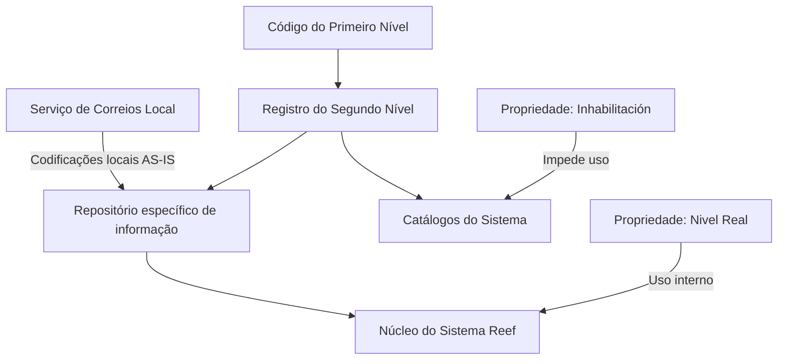

# Especificação do Segundo Nível da Estrutura Geográfica no Sistema Reef

## 1. Metadados do Documento
- **Arquivo de Origem:** Não identificado no conteúdo extraído
- **Tipo de Documento:** Especificação Técnica
- **Domínio / Sistema:** DOCUMENTACIÓN Reef / Mapfre
- **Público-Alvo:** Não identificado; a seção “Audiencia” não contém detalhamento
- **Data/Versão Identificada:** Não identificada

---

## 2. Resumo Executivo & Contexto de Negócio

O documento define o **Segundo Nível da Estrutura Geográfica**, referido como **Estados**, dentro do núcleo do Sistema Reef. O núcleo permite codificar esse segundo nível em um repositório de informação específico, inicialmente entregue vazio às instalações.

Cada registro de Segundo Nível é associado a um registro de Primeiro Nível da Estrutura Geográfica. A configuração inclui códigos de identificação, descrições em idioma de definição e idioma vernáculo, além de uma abreviatura coerente com o idioma empregado no Primeiro Nível associado.

A especificação também determina propriedades operacionais para inabilitar códigos e distinguir registros de **Nível Real** de registros de **Nível Genérico**. A propriedade de Nível Real possui uso interno do núcleo da aplicação.

Como recomendação operacional, o documento orienta que a codificação local utilize os códigos emitidos pelo Serviço de Correios Local e os carregue no Sistema **AS-IS**, isto é, sem transformação explicitamente descrita.

---

## 3. Arquitetura, Componentes & Tecnologias Envolvidas

Os componentes e conceitos explicitamente citados são:

| Componente / Conceito | Papel descrito |
| :--- | :--- |
| Sistema Reef | Sistema no qual a Estrutura Geográfica é configurada e utilizada. |
| Núcleo do Sistema / Aplicação | Componente que permite codificar o Segundo Nível e utiliza internamente a propriedade Nível Real. |
| Repositório de informação específico | Repositório destinado à codificação dos segundos níveis da Estrutura Geográfica; entregue inicialmente vazio. |
| Primeiro Nível da Estrutura Geográfica | Nível superior ao qual cada código do Segundo Nível é associado. |
| Segundo Nível da Estrutura Geográfica | Nível geográfico configurável, denominado como Estados no título do conteúdo. |
| Serviço de Correios Local | Fonte recomendada para obter codificações locais a serem carregadas no Sistema. |
| Catálogos do Sistema | Estruturas cuja configuração não pode utilizar códigos de Segundo Nível inabilitados. |



**Nota de Análise:** o conteúdo não descreve tecnologias de implementação, APIs, métodos HTTP, contratos JSON, servidores, bases de dados, URLs de ambiente ou mecanismos de integração.

---

## 4. Regras de Negócio, Especificações Funcionais & Processos

### 4.1 Configuração do Segundo Nível da Estrutura Geográfica

1. O núcleo do Sistema permite codificar os segundos níveis da Estrutura Geográfica em um repositório de informação específico.
2. O repositório de informação é inicialmente entregue às instalações sem conteúdo.
3. Cada chave de Segundo Nível deve estar associada a uma chave de Primeiro Nível.
4. A descrição do Segundo Nível deve manter coerência com o idioma utilizado na definição do Primeiro Nível ao qual está associado.
5. A abreviatura do Segundo Nível deve manter consonância com o idioma utilizado na definição do Primeiro Nível ao qual está associado.
6. A descrição vernácula deve representar a denominação do Segundo Nível no idioma vernáculo.
7. Quando a propriedade **Inhabilitación** estiver estabelecida, o código do Segundo Nível não poderá ser empregado na configuração dos catálogos do Sistema.
8. A propriedade **Nivel Real** indica se o código do Segundo Nível corresponde a um Nível Real ou a um Nível Genérico.
9. Pode existir apenas um registro com a propriedade **Nivel Real** desativada para cada Primeiro Nível da Estrutura.
10. A propriedade **Nivel Real** é de uso interno, criada pelo e para o núcleo da Aplicação.
11. A prática recomendada para codificação local é utilizar os códigos do Serviço de Correios Local e carregá-los no Sistema sem alteração explicitamente documentada.

### 4.2 Exemplo apresentado para idioma espanhol

O documento apresenta exemplos de chaves de Primeiro e Segundo Nível quando o idioma usado na definição do Primeiro Nível da Estrutura é o espanhol:

| Chaves do 1º e 2º Nível | Descrição | Vernáculo | Abreviatura |
| :--- | :--- | :--- | :--- |
| ESP - 001 | Andalucía | Andalucía | AN |
| ESP - 002 | Aragón | Albacete | AR |
| ESP - 009 | Cataluña | Catalunya | CAT |

**Nota de Análise:** o documento apresenta “ESP - 002 / Aragón / Albacete / AR” como exemplo literal. Não há explicação adicional sobre a relação entre os valores dessa linha.

---

## 5. Tabelas de Parâmetros, Ambientes e Estruturas de Dados

| Item / Parâmetro | Descrição / Função | Tipo / Valores / Formato | Ambiente / Observações |
| :--- | :--- | :--- | :--- |
| Código do Primeiro Nível | Chave que identifica o Primeiro Nível da Estrutura Geográfica ao qual pertence a chave de Segundo Nível configurada. | Chave/código; formato não detalhado. | Obrigatoriamente associado ao Segundo Nível. |
| Código do Segundo Nível | Chave que identifica especificamente o Segundo Nível da Estrutura Geográfica associado, no catálogo, a uma chave do Primeiro Nível. | Chave/código; formato não detalhado. | Associado a um Código do Primeiro Nível. |
| Descrição do Segundo Nível | Denominação ou descrição do Segundo Nível. | Texto; idioma coerente com o Primeiro Nível associado. | Exemplo: Andalucía, Aragón, Cataluña. |
| Descrição Vernácula do Segundo Nível | Denominação ou descrição do Segundo Nível no idioma vernáculo. | Texto. | Exemplo: Andalucía, Albacete, Catalunya. |
| Abreviatura do Segundo Nível | Denominação ou descrição abreviada do Segundo Nível. | Texto abreviado; formato não detalhado. | Deve estar em consonância com o idioma do Primeiro Nível associado. |
| Inhabilitación | Estabelece que o código do Segundo Nível está inabilitado para uso na configuração de catálogos. | Propriedade; valores não detalhados. | Impede o emprego do código nos catálogos do Sistema. |
| Nivel Real | Estabelece se o código do Segundo Nível é um Nível Real ou Nível Genérico. | Propriedade; ativada/desativada conforme regra descrita. | Uso interno do núcleo da Aplicação. Apenas um registro com a propriedade não ativada por Primeiro Nível. |
| Repositório de informação específico | Repositório que armazena a codificação dos segundos níveis da Estrutura Geográfica. | Repositório; tecnologia não detalhada. | Entregue inicialmente vazio. |
| Serviço de Correios Local | Origem recomendada das codificações locais. | Fonte externa; formato não detalhado. | Os códigos devem ser carregados AS-IS no Sistema. |

---

## 6. Bateria de Perguntas & Respostas para RAG (FAQ Sintético)

### P1: Qual é a finalidade do Segundo Nível da Estrutura Geográfica no Sistema Reef?
**R:** O Segundo Nível da Estrutura Geográfica, identificado no documento como Estados, permite codificar divisões geográficas associadas a um Primeiro Nível. Essa codificação é armazenada em um repositório de informação específico utilizado pelo núcleo do Sistema Reef.

### P2: O repositório de informação do Segundo Nível já possui dados quando é entregue?
**R:** Não. O documento afirma que o repositório específico de informação destinado aos segundos níveis da Estrutura Geográfica é entregue inicialmente às instalações vazio de conteúdo.

### P3: Como um registro de Segundo Nível é associado à Estrutura Geográfica?
**R:** Um registro de Segundo Nível deve possuir um Código do Primeiro Nível. Esse atributo identifica o Primeiro Nível da Estrutura Geográfica ao qual pertence a chave de Segundo Nível que está sendo configurada.

### P4: O que representa o Código do Segundo Nível?
**R:** O Código do Segundo Nível identifica especificamente a chave do Segundo Nível da Estrutura Geográfica. Essa chave fica associada, no catálogo, à chave do Primeiro Nível da Estrutura Geográfica.

### P5: Qual regra deve ser aplicada à descrição do Segundo Nível?
**R:** A Descrição do Segundo Nível deve conter a sua denominação e deve estar coerente com o idioma usado na definição do Primeiro Nível da Estrutura Geográfica ao qual o Segundo Nível está associado.

### P6: Para que serve a Descrição Vernácula do Segundo Nível?
**R:** A Descrição Vernácula do Segundo Nível armazena a denominação ou descrição do Segundo Nível da Estrutura Geográfica de acordo com o idioma vernáculo.

### P7: O que acontece quando um código possui a propriedade Inhabilitación?
**R:** Quando a propriedade Inhabilitación está estabelecida, o Código do Segundo Nível da Estrutura fica inabilitado e não pode ser empregado na configuração dos catálogos do Sistema.

### P8: Qual é a função da propriedade Nivel Real?
**R:** A propriedade Nivel Real determina se um Código do Segundo Nível da Estrutura Geográfica é classificado como Nível Real ou Nível Genérico. O documento informa que essa propriedade é de uso interno, criada pelo e para o núcleo da Aplicação.

### P9: Existe alguma restrição para registros com a propriedade Nivel Real desativada?
**R:** Sim. O documento estabelece que pode existir apenas um registro com a propriedade Nivel Real sem ativação para cada Primeiro Nível da Estrutura Geográfica.

### P10: Qual prática é recomendada para a codificação local do Segundo Nível?
**R:** A recomendação operacional é utilizar as codificações realizadas pelo Serviço de Correios Local e carregá-las no Sistema AS-IS. O documento não detalha transformações, validações ou mecanismos técnicos adicionais para essa carga.

### P11: Quais tecnologias, APIs ou formatos de integração são definidos para o repositório geográfico?
**R:** O documento não define tecnologias, APIs, métodos HTTP, contratos de dados, formatos de arquivo ou mecanismos de integração para o repositório de informação específico.

---

## 7. Glossário de Termos, Siglas & Conceitos-Chave

- **AS-IS:** Expressão utilizada no documento para recomendar o carregamento das codificações do Serviço de Correios Local sem alteração explicitamente descrita.
- **Catálogos do Sistema:** Estruturas de configuração do Sistema que não podem utilizar códigos de Segundo Nível inabilitados.
- **Código do Primeiro Nível:** Chave que identifica o Primeiro Nível ao qual pertence o Segundo Nível configurado.
- **Código do Segundo Nível:** Chave que identifica o Segundo Nível da Estrutura Geográfica.
- **Descrição Vernácula:** Denominação do Segundo Nível apresentada no idioma vernáculo.
- **Estrutura Geográfica:** Hierarquia geográfica composta, no conteúdo apresentado, por Primeiro Nível e Segundo Nível.
- **Inhabilitación:** Propriedade que impede o emprego do código de Segundo Nível na configuração dos catálogos do Sistema.
- **Nível Genérico:** Uma das classificações possíveis para um Código do Segundo Nível, conforme a propriedade Nivel Real.
- **Nível Real:** Classificação de um Código do Segundo Nível determinada pela propriedade Nivel Real.
- **Reef:** Nome presente na documentação e associado ao Sistema cujo núcleo administra a codificação geográfica.

---

## 8. Notas Críticas, Riscos & Limitações

- O repositório de informação específico é entregue vazio; a disponibilidade de dados geográficos depende de carga posterior.
- A qualidade e consistência da codificação local dependem do uso dos códigos fornecidos pelo Serviço de Correios Local.
- O documento não especifica o processo técnico de carga, validação, atualização, auditoria ou rejeição de códigos geográficos.
- O documento não detalha tecnologia de persistência, APIs, contratos, permissões, perfis de acesso, ambientes, URLs, logs ou procedimentos de operação.
- A propriedade Nivel Real é de uso interno do núcleo da Aplicação, o que limita o detalhamento funcional apresentado.
- A seção “Vínculos” recomenda a leitura de documentos de diretrizes e documentos funcionais relacionados para evitar interpretações isoladas incorretas; esses documentos não foram fornecidos no conteúdo bruto.
- A seção “Audiencia” é apresentada sem detalhamento de público-alvo.

---

## 9. Conteúdo Bruto Estruturado (Referência Fiel)

```text
--- [PÁGINA 1 DE 2] ---

DEFINICIÓN del Segundo Nivel de la Estructura Geográca (Estados)
Propiedades Generales
Funcionalmente, el núcleo del Sistema cuenta con la posibilidad de codicar los segundos niveles de la estructura Geográca en un
repositorio de información especíco que se entrega inicialmente a las instalaciones vacío de contenido.
Código del Primer Nivel
Este atributo contiene la clave que identicará al Primer Nivel de la estructura Geográca al que pertenecerá la clave del segundo Nivel de la
estructura que se esté congurando.
Código del Segundo Nivel
Este atributo identica especícamente la clave que identicará al Segundo Nivel de la estructura Geográca que estará asociada en el
catálogo a la clave del primer nivel de la estructura.
Descripción del Segundo Nivel
Esta propiedad contiene la denominación o descripción del Segundo Nivel (Descripción que debería estar en coherencia con el idioma
utilizado en la denición del primer nivel de la estructura al que está asociado).
Descripción Vernácula del Segundo Nivel
Esta propiedad contiene la denominación o descripción del Segundo Nivel de la Estructura Geográca de acuerdo con el idioma vernáculo.
Abreviatura del Segundo Nivel
Esta propiedad contiene la denominación o descripción abreviada del Segundo Nivel, (abreviatura que debería estar en consonancia con el
idioma utilizado en la denición del primer nivel de la estructura al que está asociado).
A modo de ejemplo y si el Idioma utilizado en la denición del Primer Nivel de la Estructura es el español:
Claves del 1er. y 2º Nivel Descripción Vernáculo Abreviatura
ESP - 001 Andalucía Andalucía AN
ESP - 002 Aragón Albacete AR
ESP - 009 Cataluña Catalunya CAT
Documentation / DOCUMENTACIÓN Reef
DOCUMENTACIÓN Reef
Mapfredocument
DOCUMENTACIÓN Reef
Owner
user:agonzalez_mapfre.com
Lifecycle
Approved Source
 / 
 VL
Buscar Inicio Soluciones Arquitecturas APIs Componentes Cloud Documentación Zeus Reef Ayuda
ES


--- [PÁGINA 2 DE 2] ---

Claves del 1er. y 2º Nivel Descripción Vernáculo Abreviatura
... ... ... ...
## Otras Propiedades
Inhabilitación
Esta propiedad establece que el Código del Segundo Nivel de la Estructura está inhabilitado para poder ser empleado en la conguración de
los catálogos del Sistema.
Nivel Real
Esta propiedad establece que el Código del Segundo Nivel de la Estructura Geográca es un Nivel Real o un Nivel Genérico (puede existir un
único Registro con esta Propiedad sin activar por cada Primer Nivel de la estructura)
NOTA: Esta propiedad es de uso interno, creada por y para uso del núcleo de la Aplicación.
Vínculos
Relación de Directrices y Documentos funcionales cuya lectura recomendada para evitar que la interpretación aislada del presente
documento pueda conducir a error.
Denominaciones Locales de los Niveles de la Estructura Geográca
Preguntas frecuentes
(1) ¿Existe alguna recomendación operativa que deba ser tomada en consideración localmente en la codicación, uso y denición del
Segundo Nivel de la Estructura Geográca?
Una práctica que se recomienda como modelo es utilizar las codicaciones realizadas por el Servicio de Correos Local y cargarlas AS-IS en el
Sistema.
Audiencia
```
