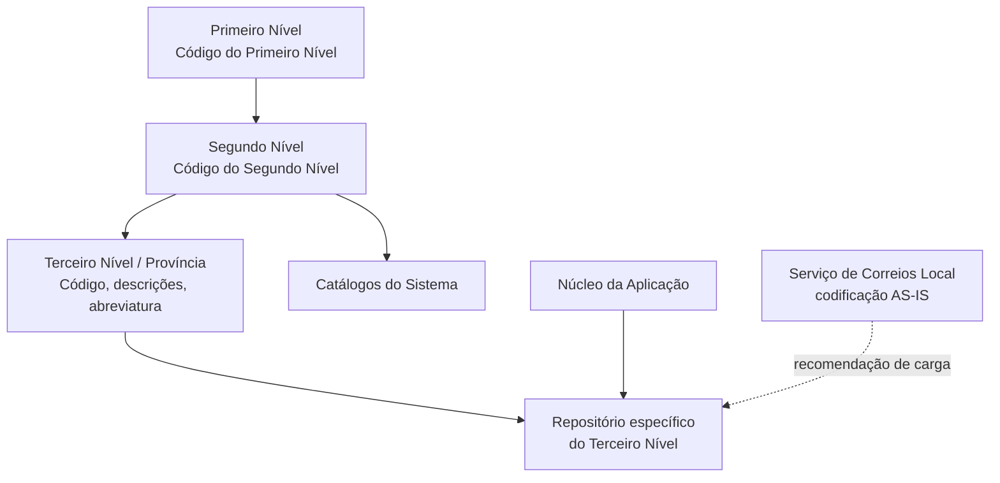

# Definição do Terceiro Nível da Estrutura Geográfica — Províncias no Reef

## 1. Metadados do Documento
- **Arquivo de Origem:** Não identificado no conteúdo extraído
- **Tipo de Documento:** Especificação Técnica / Documentação Funcional
- **Domínio / Sistema:** Reef / Estrutura Geográfica
- **Público-Alvo:** Não identificado
- **Data/Versão Identificada:** Não identificada

---

## 2. Resumo Executivo & Contexto de Negócio

O documento define o **Terceiro Nível da Estrutura Geográfica**, exemplificado como **Províncias**, no núcleo do sistema Reef. O núcleo permite codificar esse nível geográfico em um repositório de informação específico, entregue inicialmente sem conteúdo às instalações.

Cada registro do Terceiro Nível é associado hierarquicamente ao Primeiro e ao Segundo Nível da Estrutura Geográfica. A estrutura identifica os níveis por códigos e mantém propriedades textuais para descrição, denominação vernácula e abreviatura.

O documento apresenta exemplos de províncias espanholas vinculadas à combinação `ESP - 001`, incluindo Almería, Cádiz, Córdoba e Granada. A fonte indicada para essas informações é o Instituto Nacional de Estadística de España (I.N.E.).

Também são especificadas propriedades operacionais: **Inhabilitación**, relacionada à indisponibilização do Código do Segundo Nível em catálogos do sistema, e **Nivel Real**, que distingue registros reais de registros genéricos do Terceiro Nível. A propriedade Nivel Real é de uso interno do núcleo da aplicação.

Como recomendação operacional local, o documento orienta utilizar as codificações do Serviço de Correios Local e carregá-las no sistema **AS-IS**, sem detalhar processos de importação, validação técnica, APIs ou contratos de integração.

---

## 3. Arquitetura, Componentes & Tecnologias Envolvidas

O conteúdo descreve uma estrutura lógica de dados no sistema Reef, composta por um repositório específico para o Terceiro Nível da Estrutura Geográfica. Não são informadas tecnologias de implementação, banco de dados, interfaces, serviços, APIs, métodos HTTP, formatos de carga ou ambientes técnicos.

Componentes e conceitos identificados:

- **Núcleo do Sistema / Núcleo da Aplicação:** componente responsável pelo suporte à codificação da Estrutura Geográfica e pelo uso interno da propriedade Nivel Real.
- **Repositório de informação específico:** repositório destinado aos registros do Terceiro Nível da Estrutura Geográfica.
- **Primeiro Nível da Estrutura Geográfica:** nível identificado por código e associado indiretamente ao Terceiro Nível.
- **Segundo Nível da Estrutura Geográfica:** nível identificado por código, ao qual o Terceiro Nível é associado no catálogo.
- **Terceiro Nível da Estrutura Geográfica:** nível geográfico documentado; o exemplo apresentado corresponde a províncias.
- **Catálogos do Sistema:** estruturas de configuração que podem utilizar códigos da Estrutura Geográfica.
- **Serviço de Correios Local:** fonte recomendada para as codificações locais.
- **Instituto Nacional de Estadística de España (I.N.E.):** fonte informada para os exemplos de províncias espanholas.



> **Nota de Análise:** O documento não descreve protocolos, interfaces de integração, mecanismos de carga, persistência, autenticação, URLs, ambientes ou tecnologias empregadas pelo sistema Reef.

---

## 4. Regras de Negócio, Especificações Funcionais & Processos

### 4.1 Codificação do Terceiro Nível

1. O núcleo do sistema possui a capacidade de codificar os terceiros níveis da Estrutura Geográfica.
2. A codificação é armazenada em um repositório de informação específico.
3. Esse repositório é entregue inicialmente às instalações sem conteúdo.
4. O Código do Terceiro Nível deve estar associado no catálogo ao Código do Segundo Nível.
5. O Código do Segundo Nível associado deve estar, por sua vez, associado no catálogo ao Código do Primeiro Nível.

### 4.2 Regras para descrições e abreviaturas

1. A **Descrição do Terceiro Nível** contém a denominação ou descrição do Terceiro Nível.
2. A Descrição do Terceiro Nível deve manter coerência com o idioma usado na definição do Primeiro Nível associado.
3. A **Descrição Vernácula do Terceiro Nível** contém a denominação ou descrição no idioma vernáculo do Primeiro ou Segundo Nível ao qual a unidade geográfica pertence.
4. A **Abreviatura do Terceiro Nível** contém a denominação ou descrição abreviada do Terceiro Nível.
5. A abreviatura deve estar em consonância com o idioma usado na definição do Primeiro Nível associado.

### 4.3 Regra de inabilitação

A propriedade **Inhabilitación** estabelece que o Código do Segundo Nível da Estrutura fica inabilitado para ser empregado na configuração dos catálogos do sistema.

> **Nota de Análise:** Embora a propriedade Inhabilitación seja apresentada na seção referente ao Terceiro Nível, o texto declara explicitamente que o efeito recai sobre o Código do Segundo Nível. O documento não detalha estados, valores permitidos ou fluxo de ativação e desativação.

### 4.4 Regra de Nivel Real

1. A propriedade **Nivel Real** determina se o Código do Terceiro Nível da Estrutura Geográfica é um nível real ou um nível genérico.
2. Pode existir somente um registro com a propriedade Nivel Real não ativada para cada dupla formada pelo Primeiro e Segundo Nível da estrutura.
3. A propriedade Nivel Real é de uso interno.
4. A propriedade Nivel Real foi criada pelo e para o uso do núcleo da aplicação.

### 4.5 Recomendação operacional local

A prática recomendada como modelo para codificação, uso e definição local do Terceiro Nível da Estrutura Geográfica é:

1. Utilizar as codificações realizadas pelo Serviço de Correios Local.
2. Carregar as codificações no sistema **AS-IS**.

> **Nota de Análise:** O documento não define o significado operacional de AS-IS, nem detalha formato de arquivos, regras de transformação, responsável pela carga ou procedimento de validação.

### 4.6 Documentação vinculada

O documento recomenda a leitura de diretrizes e documentos funcionais relacionados, pois uma interpretação isolada pode conduzir a erro. É citada a documentação **Denominaciones Locales de los Niveles de la Estructura Geográfica**.

---

## 5. Tabelas de Parâmetros, Ambientes e Estruturas de Dados

| Item / Parâmetro | Descrição / Função | Tipo / Valores / Formato | Ambiente / Observações |
| :--- | :--- | :--- | :--- |
| Código do Primeiro Nível | Chave que identifica o Primeiro Nível da Estrutura Geográfica. | Código; formato não detalhado. | Associado hierarquicamente ao Segundo e ao Terceiro Nível. |
| Código do Segundo Nível | Chave que identifica especificamente o Segundo Nível da Estrutura Geográfica. | Código; formato não detalhado. | Pode ser inabilitado para uso na configuração dos catálogos do sistema. |
| Código do Terceiro Nível | Chave que identifica especificamente o Terceiro Nível da Estrutura Geográfica. | Código; exemplo: `04`, `11`, `14`, `18`. | Associado no catálogo ao Segundo Nível, que é associado ao Primeiro Nível. |
| Descrição do Terceiro Nível | Denominação ou descrição do Terceiro Nível. | Texto. | Deve ser coerente com o idioma da definição do Primeiro Nível associado. |
| Descrição Vernácula do Terceiro Nível | Denominação ou descrição do Terceiro Nível no idioma vernáculo correspondente. | Texto. | Relacionada ao idioma vernáculo do Primeiro ou Segundo Nível de pertencimento. |
| Abreviatura do Terceiro Nível | Denominação ou descrição abreviada do Terceiro Nível. | Texto; exemplos: `AL`, `CA`, `CO`, `GR`. | Deve estar em consonância com o idioma usado na definição do Primeiro Nível associado. |
| Inhabilitación | Estabelece a inabilitação do Código do Segundo Nível para configuração de catálogos. | Propriedade; valores não detalhados. | O documento não define comportamento técnico, valor padrão ou interface de gestão. |
| Nivel Real | Determina se o Código do Terceiro Nível é um nível real ou um nível genérico. | Propriedade; estados mencionados: real, genérico e não ativado. | Uso interno do núcleo da aplicação; somente um registro não ativado por dupla Primeiro/Segundo Nível. |
| Repositório específico | Armazena a codificação do Terceiro Nível da Estrutura Geográfica. | Repositório de informação; tecnologia não detalhada. | Entregue inicialmente vazio às instalações. |
| Fonte recomendada de codificação | Serviço de Correios Local. | Codificações locais. | Recomenda-se carregar os dados AS-IS no sistema. |
| Fonte dos exemplos espanhóis | Instituto Nacional de Estadística de España. | Referência externa. | Indicado como “Web del I.N.E”. |

### Exemplos de Terceiro Nível apresentados

| Chaves do 1º e 2º Nível | Chave do Terceiro Nível | Descrição | Vernáculo | Abreviatura |
| :--- | :--- | :--- | :--- | :--- |
| ESP - 001 | 04 | Almería | Almería | AL |
| ESP - 001 | 11 | Cádiz | Cádiz | CA |
| ESP - 001 | 14 | Córdoba | Córdoba | CO |
| ESP - 001 | 18 | Granada | Granada | GR |

---

## 6. Bateria de Perguntas & Respostas para RAG (FAQ Sintético)

### P1: Qual é o objetivo do repositório específico do Terceiro Nível da Estrutura Geográfica no Reef?
**R:** O repositório específico permite que o núcleo do sistema codifique e armazene os terceiros níveis da Estrutura Geográfica. O documento informa que esse repositório é entregue inicialmente às instalações sem conteúdo.

### P2: Como o Terceiro Nível da Estrutura Geográfica se relaciona aos níveis superiores?
**R:** O Código do Terceiro Nível é associado no catálogo ao Código do Segundo Nível. O Código do Segundo Nível, por sua vez, é associado no catálogo ao Código do Primeiro Nível, formando uma hierarquia entre os três níveis geográficos.

### P3: O que deve ser informado na Descrição do Terceiro Nível?
**R:** A Descrição do Terceiro Nível deve conter a denominação ou descrição do Terceiro Nível da Estrutura Geográfica. Essa denominação deve ser coerente com o idioma utilizado na definição do Primeiro Nível ao qual o Terceiro Nível está associado.

### P4: Qual é a finalidade da Descrição Vernácula do Terceiro Nível?
**R:** A Descrição Vernácula do Terceiro Nível contém a denominação ou descrição do Terceiro Nível no idioma vernáculo do Primeiro ou do Segundo Nível da Estrutura Geográfica ao qual pertence.

### P5: Qual regra se aplica à abreviatura do Terceiro Nível?
**R:** A Abreviatura do Terceiro Nível deve conter a denominação ou descrição abreviada do Terceiro Nível e deve estar em consonância com o idioma utilizado na definição do Primeiro Nível associado.

### P6: O que a propriedade Inhabilitación estabelece?
**R:** A propriedade Inhabilitación estabelece que o Código do Segundo Nível da Estrutura fica inabilitado para ser empregado na configuração dos catálogos do sistema. O documento não detalha os valores possíveis da propriedade nem o procedimento para sua alteração.

### P7: O que significa a propriedade Nivel Real?
**R:** A propriedade Nivel Real estabelece se o Código do Terceiro Nível da Estrutura Geográfica é um nível real ou um nível genérico. Para cada dupla formada pelo Primeiro e Segundo Nível, pode existir somente um registro com essa propriedade sem ativação.

### P8: Quem utiliza a propriedade Nivel Real?
**R:** A propriedade Nivel Real é de uso interno e foi criada pelo e para o núcleo da aplicação. O documento não descreve interfaces, usuários finais ou processos externos para sua manipulação.

### P9: Qual prática local é recomendada para a codificação do Terceiro Nível?
**R:** A recomendação é utilizar as codificações realizadas pelo Serviço de Correios Local e carregá-las no sistema AS-IS. O documento não especifica o formato de carga nem possíveis transformações de dados.

### P10: Quais exemplos de províncias são apresentados para a combinação ESP - 001?
**R:** O documento apresenta os exemplos `04 — Almería — AL`, `11 — Cádiz — CA`, `14 — Córdoba — CO` e `18 — Granada — GR`, todos vinculados às chaves de Primeiro e Segundo Nível `ESP - 001`.

### P11: Qual fonte é indicada para as informações das províncias espanholas?
**R:** As informações são indicadas como obtidas do Instituto Nacional de Estadística de España, citado no documento como “Web del I.N.E”.

### P12: Quais tecnologias, APIs ou contratos de integração são definidos para o repositório do Terceiro Nível?
**R:** Nenhuma tecnologia, API, método HTTP, contrato JSON, banco de dados, URL, ambiente ou mecanismo técnico de integração é definido no conteúdo apresentado.

---

## 7. Glossário de Termos, Siglas & Conceitos-Chave

- **AS-IS:** Expressão usada pelo documento para recomendar a carga das codificações do Serviço de Correios Local sem detalhamento adicional sobre transformação ou tratamento dos dados.
- **Estrutura Geográfica:** Hierarquia geográfica composta, no contexto do documento, por Primeiro, Segundo e Terceiro Nível.
- **I.N.E.:** Instituto Nacional de Estadística de España, indicado como fonte das informações sobre as províncias espanholas apresentadas.
- **Inhabilitación:** Propriedade que estabelece que o Código do Segundo Nível fica inabilitado para uso na configuração dos catálogos do sistema.
- **Nivel Real:** Propriedade interna do núcleo da aplicação que determina se o Código do Terceiro Nível é real ou genérico.
- **Primeiro Nível:** Primeiro nível da Estrutura Geográfica, identificado por uma chave própria.
- **Segundo Nível:** Segundo nível da Estrutura Geográfica, identificado por uma chave própria e associado ao Primeiro Nível.
- **Terceiro Nível:** Terceiro nível da Estrutura Geográfica, associado ao Segundo Nível; o documento usa províncias como exemplo.
- **Vernáculo:** Denominação ou descrição no idioma vernáculo do nível geográfico ao qual o Terceiro Nível pertence.

---

## 8. Notas Críticas, Riscos & Limitações

- O documento não identifica claramente o nome do arquivo de origem, data, versão, autor técnico ou público-alvo.
- O conteúdo não descreve tecnologias, mecanismos de persistência, APIs, serviços, métodos HTTP, contratos de dados, controles de acesso, rotinas de auditoria ou monitoramento.
- O repositório específico do Terceiro Nível é mencionado, mas seu modelo físico, mecanismo de carga e validações técnicas não são detalhados.
- A propriedade Inhabilitación é descrita como aplicável ao Código do Segundo Nível, embora apareça em uma seção sobre propriedades do Terceiro Nível.
- A propriedade Nivel Real possui uma restrição de unicidade para registros não ativados por dupla Primeiro/Segundo Nível, mas o documento não esclarece como essa restrição é aplicada.
- A recomendação de carga AS-IS não define significado técnico, procedimentos operacionais, tratamento de erros ou critérios de qualidade.
- O documento alerta que sua interpretação isolada pode conduzir a erro e recomenda a leitura de diretrizes e documentos funcionais vinculados, especialmente **Denominaciones Locales de los Niveles de la Estructura Geográfica**.

---

## 9. Conteúdo Bruto Estruturado (Referência Fiel)

```text
--- [PÁGINA 1 DE 2] ---

DEFINICIÓN del Tercer Nivel de la Estructura Geográca (Provincias)
Propiedades Generales
Funcionalmente, el núcleo del Sistema cuenta con la posibilidad de codicar los terceros niveles de la estructura Geográca en un repositorio
de información especíco que se entrega inicialmente a las instalaciones vacío de contenido.
Código del Primer Nivel
Este atributo contiene la clave que identicará al Primer Nivel de la estructura Geográca.
Código del Segundo Nivel
Este atributo identica especícamente la clave que identicará al Segundo Nivel de la estructura Geográca.
Código del Tercer Nivel
Este atributo identica especícamente la clave que identicará al Tercer Nivel de la estructura Geográca que estará asociada en el catálogo
a la clave del segundo nivel de la estructura y que estará a su vez asociada en el catálogo a la clave del primer nivel de la estructura.
Descripción del Tercer Nivel
Esta propiedad contiene la denominación o descripción del Tercer Nivel (denominación que debería estar en coherencia con el idioma
utilizado en la denición del primer nivel de la estructura al que está asociado).
Descripción Vernácula del Tercer Nivel
Esta propiedad contiene la denominación o descripción del Tercer Nivel de la Estructura Geográca de acuerdo con el idioma vernáculo del
primer o segundo nivel de la estructura geográca al que pertenezca.
Abreviatura del Tercer Nivel
Esta propiedad contiene la denominación o descripción abreviada del Tercer Nivel (abreviatura que debería estar en consonancia con el
idioma utilizado en la denición del primer nivel de la estructura al que está asociado)
A modo de ejemplo y si el Idioma utilizado en la denición del Primer Nivel de la Estructura es el español:
Claves del 1er. y 2º Nivel Clave del Tercer Nivel Descripción Vernáculo Abreviatura
ESP - 001 04 Almería Almería AL
ESP - 001 11 Cádiz Cádiz CA
Documentation / DOCUMENTACIÓN Reef
DOCUMENTACIÓN Reef
Mapfredocument
DOCUMENTACIÓN Reef
Owner
user:agonzalez_mapfre.com
Lifecycle
Approved Source
 / 
 VL
Buscar Inicio Soluciones Arquitecturas APIs Componentes Cloud Documentación Zeus Reef Ayuda
ES


--- [PÁGINA 2 DE 2] ---

Claves del 1er. y 2º Nivel Clave del Tercer Nivel Descripción Vernáculo Abreviatura
ESP - 001 14 Córdoba Córdoba CO
ESP - 001 18 Granada Granada GR
... ... ... ... ...
NOTA: Información obtenida del Instituto Nacional de Estadística de España: Web del I.N.E
Otras Propiedades
Inhabilitación
Esta propiedad establece que el Código del Segundo Nivel de la Estructura está inhabilitado para poder ser empleado en la conguración de
los catálogos del Sistema.
Nivel Real
Esta propiedad establece que el Código del Tercer Nivel de la Estructura Geográca es un Nivel Real o un Nivel Genérico (puede existir un
único Registro con esta Propiedad sin activar por cada dupla Primer/Segundo Nivel de la estructura)
NOTA: Esta propiedad es de uso interno, creada por y para uso del núcleo de la Aplicación.
Vínculos
Relación de Directrices y Documentos funcionales cuya lectura recomendada para evitar que la interpretación aislada del presente
documento pueda conducir a error.
Denominaciones Locales de los Niveles de la Estructura Geográca
Preguntas frecuentes
(1) ¿Existe alguna recomendación operativa que deba ser tomada en consideración localmente en la codicación, uso y denición del Tercer
Nivel de la Estructura Geográca?
Una práctica que se recomienda como modelo es utilizar las codicaciones realizadas por el Servicio de Correos Local y cargarlas AS-IS en el
Sistema.
Audiencia
```
