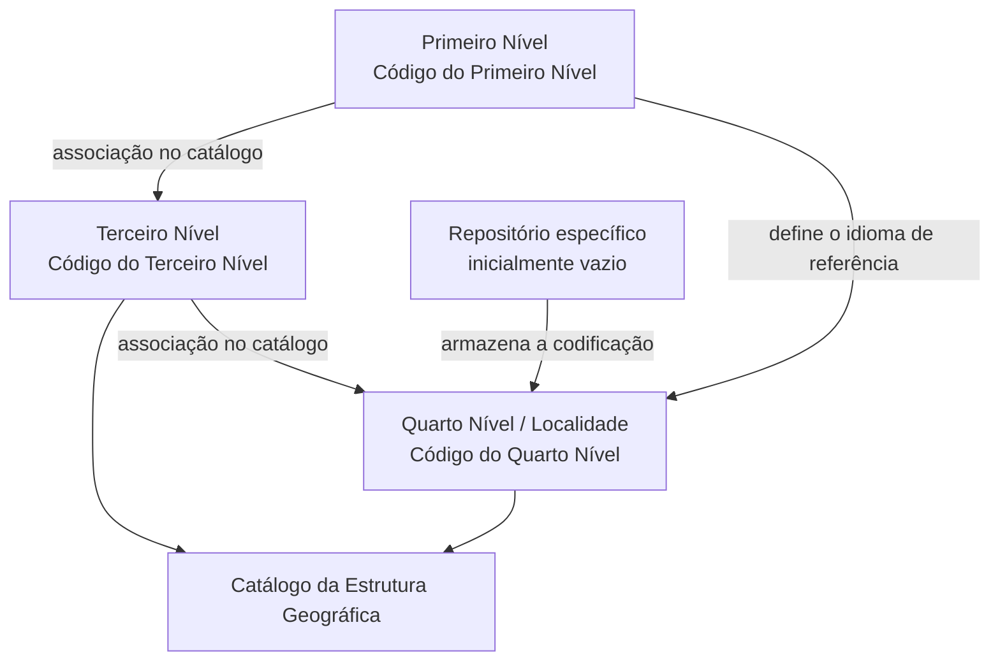
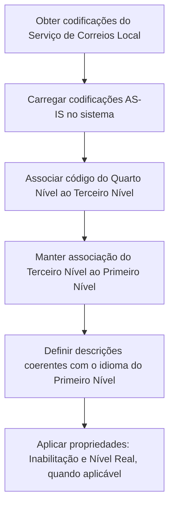

# Definição do Quarto Nível da Estrutura Geográfica — Localidades (Documentação Reef)

## 1. Metadados do Documento
- **Arquivo de Origem:** Não identificado no conteúdo extraído
- **Tipo de Documento:** Especificação Técnica
- **Domínio / Sistema:** Reef — Estrutura Geográfica
- **Público-Alvo:** Não identificado explicitamente; conteúdo direcionado à configuração e codificação da Estrutura Geográfica no sistema
- **Data/Versão Identificada:** Não identificada
- **Owner identificado:** `agonzalez_mapfre.com`
- **Lifecycle identificado:** Approved

---

## 2. Resumo Executivo & Contexto de Negócio

O documento descreve a definição do **Quarto Nível da Estrutura Geográfica**, denominado **Localidades**, no contexto do sistema Reef. O núcleo do sistema permite codificar esse nível geográfico em um repositório de informação específico, inicialmente entregue vazio de conteúdo para as instalações.

A estrutura de Localidades é organizada por associação hierárquica entre o **Primeiro Nível**, o **Terceiro Nível** e o **Quarto Nível**. O código do Quarto Nível é associado, no catálogo, ao código do Terceiro Nível, que por sua vez está associado ao código do Primeiro Nível.

O documento define atributos descritivos para a Localidade: descrição principal, descrição vernácula e abreviatura. As denominações devem manter coerência com o idioma adotado na definição ou configuração do Primeiro Nível geográfico associado.

Também são apresentadas propriedades operacionais para inabilitar códigos e identificar se um registro representa um nível real ou genérico. A propriedade **Nível Real** é de uso interno do núcleo da aplicação e possui uma restrição de unicidade para cada subconjunto de Primeiro, Terceiro e Quarto Níveis.

Como orientação de operação, o documento recomenda utilizar as codificações do Serviço de Correios Local e carregá-las no sistema **AS-IS**, isto é, sem alteração. O documento remete ainda à diretriz “Denominaciones Locales de los Niveles de la Estructura Geográfica” para evitar interpretações isoladas ou incorretas.

---

## 3. Arquitetura, Componentes & Tecnologias Envolvidas

### Componentes e conceitos identificados

| Componente / Conceito | Descrição baseada no documento |
| :--- | :--- |
| **Reef** | Sistema ou contexto documental no qual a Estrutura Geográfica é configurada. |
| **Núcleo do Sistema** | Componente que permite codificar os Quarto Níveis da Estrutura Geográfica em repositório específico. |
| **Repositório de informação específico** | Repositório destinado à codificação dos Quarto Níveis; é inicialmente entregue vazio de conteúdo às instalações. |
| **Estrutura Geográfica** | Estrutura hierárquica composta, no escopo deste documento, por Primeiro, Terceiro e Quarto Níveis. |
| **Primeiro Nível** | Nível geográfico identificado por uma chave; influencia o idioma das descrições associadas. |
| **Terceiro Nível** | Nível geográfico identificado por uma chave e associado ao Primeiro Nível. |
| **Quarto Nível / Localidades** | Nível geográfico codificado no repositório e associado ao Terceiro Nível. |
| **Catálogo da Estrutura Geográfica** | Catálogo onde as associações entre códigos dos níveis geográficos são mantidas. |
| **Serviço de Correios Local** | Fonte recomendada para codificação de localidades a ser carregada AS-IS. |
| **Denominaciones Locales de los Niveles de la Estructura Geográfica** | Documento funcional recomendado como leitura complementar. |

### Relação hierárquica dos níveis geográficos



### Fluxo operacional recomendado para codificação



> **Nota de Análise:** O documento não detalha interfaces, métodos HTTP, contratos JSON, tecnologia de persistência, formatos de integração, mecanismos de carga ou permissões de acesso ao repositório da Estrutura Geográfica.

---

## 4. Regras de Negócio, Especificações Funcionais & Processos

### 4.1 Codificação do Quarto Nível

1. O núcleo do sistema possui capacidade de codificar os Quarto Níveis da Estrutura Geográfica.
2. A codificação é armazenada em um repositório de informação específico.
3. O repositório é entregue inicialmente vazio de conteúdo às instalações.
4. O Quarto Nível representa uma **Localidade** no escopo do documento.
5. O código do Quarto Nível deve ser associado, no catálogo, ao código do Terceiro Nível.
6. O Terceiro Nível associado deve estar vinculado, no catálogo, ao código do Primeiro Nível.

### 4.2 Regra de associação hierárquica

A relação de dependência descrita no documento é:

```text
Primeiro Nível → Terceiro Nível → Quarto Nível
```

O Código do Quarto Nível não é apresentado como uma chave independente da estrutura; o Código do Quarto Nível deve estar associado ao Terceiro Nível, e o Terceiro Nível deve estar associado ao Primeiro Nível.

### 4.3 Regras de denominação e idioma

1. A **Descrição do Quarto Nível** contém a denominação ou descrição da Localidade.
2. A descrição do Quarto Nível deve ser coerente com o idioma usado na definição do Primeiro Nível ao qual a Localidade está associada.
3. A **Descrição Vernácula do Quarto Nível** contém a denominação ou descrição da Localidade na Estrutura Geográfica.
4. A Descrição Vernácula deve estar em consonância com o idioma usado na configuração do Primeiro Nível geográfico ao qual está conectada.
5. A **Abreviatura do Quarto Nível** contém a denominação ou descrição abreviada da Localidade.
6. A Abreviatura do Quarto Nível também deve estar em consonância com o idioma usado na definição do Primeiro Nível associado.

### 4.4 Regras de inabilitação

A propriedade **Inhabilitación** estabelece que um Código do Quarto Nível da Estrutura Geográfica está inabilitado para uso na configuração dos catálogos da Estrutura Geográfica definida no sistema.

O documento não especifica:
- o valor técnico usado para indicar inabilitação;
- o comportamento de registros já utilizados antes da inabilitação;
- os responsáveis autorizados a alterar a propriedade;
- qualquer fluxo de reabilitação.

### 4.5 Regras de Nível Real

1. A propriedade **Nivel Real** determina se o Código do Quarto Nível da Estrutura Geográfica é um **Nível Real** ou um **Nível Genérico**.
2. Pode existir somente um registro com essa propriedade não ativada para cada subconjunto formado por Primeiro Nível, Terceiro Nível e Quarto Nível.
3. A propriedade Nível Real é de uso interno.
4. A propriedade Nível Real foi criada pelo e para o uso do núcleo da aplicação.

> **Nota de Análise:** O documento não define a semântica operacional completa dos estados “Nível Real” e “Nível Genérico”, além da classificação indicada e da restrição de unicidade apresentada.

### 4.6 Prática operacional recomendada

A prática recomendada para codificação, uso e definição local do Quarto Nível é utilizar as codificações realizadas pelo **Serviço de Correios Local** e carregá-las no sistema **AS-IS**.

> **Nota de Análise:** O documento recomenda a carga AS-IS, mas não especifica o canal, formato, frequência, mecanismo de validação ou processo de aprovação da carga.

---

## 5. Tabelas de Parâmetros, Ambientes e Estruturas de Dados

### 5.1 Atributos do Quarto Nível da Estrutura Geográfica

| Item / Parâmetro | Descrição / Função | Tipo / Valores / Formato | Ambiente / Observações |
| :--- | :--- | :--- | :--- |
| Código do Primeiro Nível | Contém a chave que identifica o Primeiro Nível da Estrutura Geográfica. | Chave; formato não detalhado. | Define o contexto hierárquico e o idioma de referência das denominações. |
| Código do Terceiro Nível | Identifica especificamente a chave do Terceiro Nível da Estrutura Geográfica. | Chave; formato não detalhado. | Deve estar associado ao Código do Primeiro Nível no catálogo. |
| Código do Quarto Nível | Identifica especificamente a chave do Quarto Nível da Estrutura Geográfica. | Chave; formato não detalhado. | Deve estar associado ao Terceiro Nível no catálogo. |
| Descrição do Quarto Nível | Denominação ou descrição da Localidade. | Texto; formato não detalhado. | Deve ser coerente com o idioma usado na definição do Primeiro Nível associado. |
| Descrição Vernácula do Quarto Nível | Denominação ou descrição vernácula da Localidade da Estrutura Geográfica. | Texto; formato não detalhado. | Deve estar em consonância com o idioma usado na configuração do Primeiro Nível conectado. |
| Abreviatura do Quarto Nível | Denominação ou descrição abreviada da Localidade. | Texto abreviado; formato não detalhado. | Deve ser coerente com o idioma usado na definição do Primeiro Nível associado. |
| Inhabilitación | Indica que o Código do Quarto Nível está inabilitado para uso na configuração dos catálogos. | Propriedade; valores não detalhados. | Afeta o emprego do código na configuração da Estrutura Geográfica. |
| Nivel Real | Determina se o código representa um Nível Real ou um Nível Genérico. | Propriedade; valores não detalhados. | Uso interno do núcleo da aplicação. Há restrição de unicidade para o subconjunto Primeiro/Terceiro/Quarto Nível. |

### 5.2 Exemplo de codificação apresentado

| Chave de Níveis | Chave do Quarto Nível | Descrição |
| :--- | :--- | :--- |
| ESP - 28 | 0001 | Álamo, EL |
| ESP - 28 | 0002 | Alcalá de Henares |
| ESP - 28 | 0003 | Alcobendas |
| ESP - 28 | 0004 | Alcorcón |
| ... | ... | ... |

### 5.3 Dados contextuais identificados

| Item / Parâmetro | Descrição / Função | Tipo / Valores / Formato | Ambiente / Observações |
| :--- | :--- | :--- | :--- |
| Exemplo de Primeiro Nível | Espanha | `ESP` | O documento usa espanhol como idioma no exemplo de definição do Primeiro Nível. |
| Exemplo de Terceiro Nível | Madrid | `28` | Associado a `ESP - España`. |
| Lifecycle | Estado do documento na plataforma de documentação. | `Approved` | Identificado no conteúdo bruto. |
| Owner | Proprietário identificado na plataforma de documentação. | `agonzalez_mapfre.com` | Identificado no conteúdo bruto. |
| Documento complementar | Diretriz funcional recomendada. | `Denominaciones Locales de los Niveles de la Estructura Geográfica` | Deve ser consultada para reduzir risco de interpretação isolada. |

---

## 6. Bateria de Perguntas & Respostas para RAG (FAQ Sintético)

### P1: Qual é o objetivo do Quarto Nível da Estrutura Geográfica no Reef?
**R:** O Quarto Nível da Estrutura Geográfica representa Localidades. O núcleo do sistema Reef permite codificar essas Localidades em um repositório de informação específico, entregue inicialmente vazio de conteúdo às instalações.

### P2: Como o Código do Quarto Nível se relaciona com os outros níveis geográficos?
**R:** O Código do Quarto Nível deve estar associado, no catálogo, ao Código do Terceiro Nível. O Código do Terceiro Nível, por sua vez, deve estar associado ao Código do Primeiro Nível. A hierarquia apresentada é Primeiro Nível, Terceiro Nível e Quarto Nível.

### P3: O que representa o Código do Primeiro Nível?
**R:** O Código do Primeiro Nível contém a chave que identifica o Primeiro Nível da Estrutura Geográfica. Além do contexto hierárquico, o idioma utilizado na definição desse nível é a referência de coerência para as descrições da Localidade associada.

### P4: Como deve ser preenchida a Descrição do Quarto Nível?
**R:** A Descrição do Quarto Nível deve conter a denominação ou descrição da Localidade. Essa denominação deve estar em coerência com o idioma utilizado na definição do Primeiro Nível da Estrutura Geográfica ao qual o Quarto Nível está associado.

### P5: O que é a Descrição Vernácula do Quarto Nível?
**R:** A Descrição Vernácula do Quarto Nível é a denominação ou descrição da Localidade na Estrutura Geográfica. O documento determina que essa descrição deve estar em consonância com o idioma utilizado na configuração do Primeiro Nível geográfico ao qual a Localidade está conectada.

### P6: Qual é a finalidade da propriedade Inhabilitación?
**R:** A propriedade Inhabilitación estabelece que determinado Código do Quarto Nível está inabilitado para ser empregado na configuração dos catálogos da Estrutura Geográfica definida no sistema.

### P7: O que a propriedade Nivel Real determina?
**R:** A propriedade Nivel Real estabelece se o Código do Quarto Nível da Estrutura Geográfica é classificado como Nível Real ou Nível Genérico. O documento informa que essa propriedade é de uso interno do núcleo da aplicação.

### P8: Existe alguma restrição para a propriedade Nivel Real?
**R:** Sim. Pode existir somente um registro com a propriedade Nivel Real não ativada para cada subconjunto de Primeiro Nível, Terceiro Nível e Quarto Nível da Estrutura Geográfica.

### P9: Qual é a recomendação operacional para codificar Localidades?
**R:** A recomendação é utilizar as codificações realizadas pelo Serviço de Correios Local e carregá-las AS-IS no sistema, sem que o documento detalhe transformações, formatos ou mecanismos de carga.

### P10: Quais exemplos de Localidades são apresentados para ESP - 28?
**R:** Para a chave de níveis `ESP - 28`, o documento apresenta `0001 — Álamo, EL`, `0002 — Alcalá de Henares`, `0003 — Alcobendas` e `0004 — Alcorcón`.

### P11: O documento descreve APIs, métodos HTTP ou contratos de integração para Localidades?
**R:** Não. O documento descreve propriedades, relações hierárquicas e recomendações de codificação do Quarto Nível, mas não detalha APIs, métodos HTTP, contratos JSON, formatos de integração ou mecanismos técnicos de persistência.

### P12: Qual documentação complementar deve ser consultada?
**R:** O documento recomenda a leitura de “Denominaciones Locales de los Niveles de la Estructura Geográfica”, pois a interpretação isolada do presente documento pode conduzir a erro.

---

## 7. Glossário de Termos, Siglas & Conceitos-Chave

- **Reef:** Sistema ou contexto de documentação no qual é tratada a Estrutura Geográfica.
- **Estrutura Geográfica:** Estrutura de níveis geográficos configurada no sistema; o documento aborda a relação entre Primeiro, Terceiro e Quarto Níveis.
- **Primeiro Nível:** Nível geográfico identificado por uma chave e usado como referência de idioma para denominações associadas.
- **Terceiro Nível:** Nível geográfico identificado por uma chave, associado ao Primeiro Nível e pai do Quarto Nível no catálogo.
- **Quarto Nível:** Nível geográfico denominado Localidade no documento.
- **Localidade:** Denominação funcional do Quarto Nível da Estrutura Geográfica.
- **Catálogo:** Repositório de associações entre os códigos dos níveis da Estrutura Geográfica.
- **Código do Quarto Nível:** Chave que identifica especificamente uma Localidade e que deve ser associada ao Terceiro Nível.
- **Descrição Vernácula:** Denominação ou descrição da Localidade que deve estar em consonância com o idioma configurado no Primeiro Nível associado.
- **Inhabilitación:** Propriedade que impede o uso de um Código do Quarto Nível na configuração dos catálogos da Estrutura Geográfica.
- **Nivel Real:** Propriedade interna do núcleo da aplicação que classifica um Código do Quarto Nível como Nível Real ou Nível Genérico.
- **Nível Genérico:** Classificação possível para um Código do Quarto Nível; não há detalhamento funcional adicional no documento.
- **AS-IS:** Indicação de que as codificações do Serviço de Correios Local devem ser carregadas no sistema tal como foram realizadas, sem transformação descrita.
- **Serviço de Correios Local:** Fonte cuja codificação é recomendada como modelo para carga de Localidades.
- **ESP:** Código apresentado no exemplo para Espanha.
- **28:** Código apresentado no exemplo para Madrid.

---

## 8. Notas Críticas, Riscos & Limitações

- O repositório específico do Quarto Nível é entregue inicialmente vazio; o documento não apresenta um procedimento técnico de carga inicial.
- A recomendação de carga AS-IS a partir do Serviço de Correios Local não especifica formato de arquivo, integração, validações, frequência, responsáveis ou tratamento de divergências.
- A propriedade Nivel Real é declarada como interna ao núcleo da aplicação, mas a diferença operacional entre Nível Real e Nível Genérico não é detalhada.
- A regra “pode existir um único registro com esta propriedade sem ativar” é apresentada, mas o documento não especifica mecanismo de validação, mensagem de erro ou momento de aplicação da restrição.
- O documento não informa modelos de segurança, perfis de usuário, permissões, auditoria, APIs, banco de dados, ambientes técnicos, URLs, rotas de log ou procedimentos de contingência.
- O documento recomenda consultar “Denominaciones Locales de los Niveles de la Estructura Geográfica”; a interpretação isolada pode conduzir a erro.
- Há caracteres possivelmente corrompidos na extração bruta, como `codicar`, `denición` e `conguración`. Essas ocorrências foram preservadas na referência fiel para auditoria.

---

## 9. Conteúdo Bruto Estruturado (Referência Fiel)

```text
--- [PÁGINA 1 DE 2] ---

width="596" height="159" style="display: block; margin: 0 auto" }
DEFINICIÓN del Cuarto Nivel de la Estructura Geográca (Localidades)
Propiedades Generales
Funcionalmente, el núcleo del Sistema cuenta con la posibilidad de codicar los Cuartos niveles de la estructura Geográca en un repositorio
de información especíco que se entrega inicialmente a las instalaciones vacío de contenido.
Código del Primer Nivel
Este atributo contiene la clave que identicará al Primer Nivel de la estructura Geográca.
Código del Tercer Nivel
Este atributo identica especícamente la clave que identicará al Tercer Nivel de la estructura Geográca.
Código del Cuarto Nivel
Este atributo identica especícamente la clave que identicará al Cuarto Nivel de la estructura Geográca que estará asociada en el
catálogo a la clave del Tercer nivel de la estructura y que estará a su vez asociada en el catálogo a la clave del primer nivel de la estructura.
A modo de ejemplo y si el Idioma utilizado en la denición del Primer Nivel de la Estructura es el español para ESP - España / 28 - Madrid:
Clave de Niveles ⅓ Clave del Cuarto Nivel Descripción
ESP - 28 0001 Álamo, EL
ESP - 28 0002 Alcalá de Henares
ESP - 28 0003 Alcobendas
ESP - 28 0004 Alcorcón
... ... ...
Descripción del Cuarto Nivel
Documentation / DOCUMENTACIÓN Reef
DOCUMENTACIÓN Reef
Mapfredocument
DOCUMENTACIÓN Reef
Owner
user:agonzalez_mapfre.com
Lifecycle
Approved Source
 / 
 VL
Buscar Inicio Soluciones Arquitecturas APIs Componentes Cloud Documentación Zeus Reef Ayuda
ES


--- [PÁGINA 2 DE 2] ---

Esta propiedad contiene la denominación o descripción del Cuarto Nivel (denominación que debería estar en coherencia con el idioma
utilizado en la denición del primer nivel de la estructura al que está asociado).
Descripción Vernácula del Cuarto Nivel
Esta propiedad contiene la denominación o descripción del Cuarto Nivel de la Estructura Geográca (descripción que debería estar en
consonancia con el idioma utilizado en la conguración del primer nivel de la estructura geográca con el que está conectado).
Abreviatura del Cuarto Nivel
Esta propiedad contiene la denominación o descripción abreviada del Cuarto Nivel (al igual que con el Atributo anterior, debería estar en
consonancia con el idioma utilizado en la denición del primer nivel de la estructura al que está asociado)
Otras Propiedades
Inhabilitación
Esta propiedad establece que el Código del Cuarto Nivel de la Estructura está inhabilitado para poder ser empleado en la conguración de los
catálogos de la Estructura Geográca denida en el Sistema.
Nivel Real
Esta propiedad establece que el Código del Cuarto Nivel de la Estructura Geográca es un Nivel Real o un Nivel Genérico (puede existir un
único Registro con esta Propiedad sin activar por cada subconjunto de Primer/Tercer y Cuarto Nivel de la estructura)
NOTA: Esta propiedad es de uso interno, creada por y para uso del núcleo de la Aplicación.
Vínculos
Relación de Directrices y Documentos funcionales cuya lectura recomendada para evitar que la interpretación aislada del presente
documento pueda conducir a error.
Denominaciones Locales de los Niveles de la Estructura Geográca
Preguntas frecuentes
(1) ¿Existe alguna recomendación operativa que deba ser tomada en consideración localmente en la codicación, uso y denición del Cuarto
Nivel de la Estructura Geográca?
Una práctica que se recomienda como modelo es utilizar las codicaciones realizadas por el Servicio de Correos Local y cargarlas AS-IS en el
Sistema.
Audiencia
```
