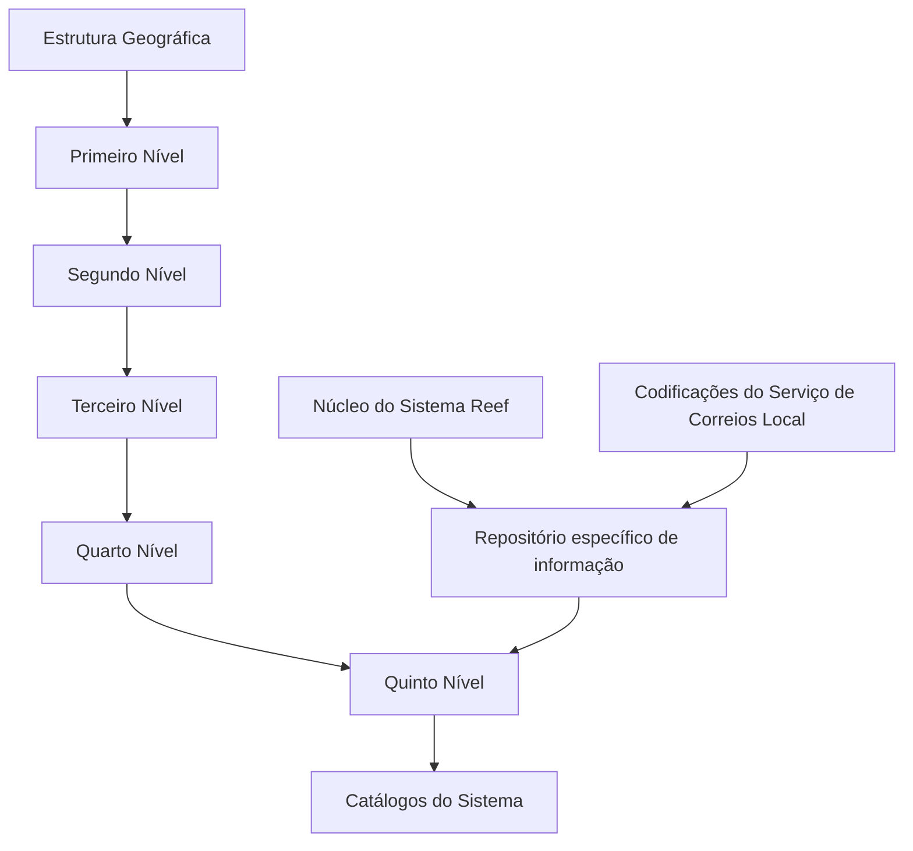

# Definição do Quinto Nível da Estrutura Geográfica no Sistema Reef

## 1. Metadados do Documento
- **Arquivo de Origem:** Não identificado no conteúdo extraído
- **Tipo de Documento:** Especificação Técnica
- **Domínio / Sistema:** Reef — Estrutura Geográfica
- **Público-Alvo:** Não identificado; o documento apresenta a seção “Audiencia” sem conteúdo associado
- **Data/Versão Identificada:** Não identificada

---

## 2. Resumo Executivo & Contexto de Negócio

O documento define o **Quinto Nível da Estrutura Geográfica**, aplicável a entidades como distritos, delegações e comunas. O núcleo do Sistema Reef permite codificar essas entidades em um repositório específico de informações, inicialmente entregue vazio às instalações.

A identificação de cada registro do quinto nível depende da associação com as chaves dos quatro níveis geográficos anteriores: primeiro, segundo, terceiro e quarto níveis. O documento apresenta como exemplo a estrutura geográfica espanhola composta por país, comunidade, província e cidade, associada a códigos de quinto nível como `AAA1`, `AAA2`, `AAA3` e `AAA4`.

A especificação também define propriedades funcionais e operacionais do quinto nível: idioma, descrição, classificação entre nível real ou genérico, inabilitação e data de validade. Essas propriedades permitem representar denominações localizadas, controlar a disponibilidade de uma chave nos catálogos do sistema e manter histórico de alterações.

Como recomendação operacional local, o documento orienta utilizar as codificações do Serviço de Correios Local e carregá-las no Sistema Reef **AS-IS**, sem transformação descrita. A leitura conjunta do documento “Denominaciones Locales de los Niveles de la Estructura Geográfica” é recomendada para evitar interpretações isoladas incorretas.

---

## 3. Arquitetura, Componentes & Tecnologias Envolvidas

Os elementos identificados no documento são:

| Componente / Conceito | Função descrita |
| :--- | :--- |
| Sistema Reef | Sistema no qual a estrutura geográfica e suas chaves são definidas e utilizadas. |
| Núcleo do Sistema | Componente funcional que permite codificar os quintos níveis em um repositório específico. |
| Repositório específico de informação | Repositório destinado ao cadastro dos quintos níveis da estrutura geográfica; inicialmente entregue vazio. |
| Catálogos do Sistema | Configurações do sistema nas quais códigos habilitados do quinto nível podem ser empregados. |
| Serviço de Correios Local | Fonte recomendada para codificações locais que devem ser carregadas no sistema. |
| Documento “Denominaciones Locales de los Niveles de la Estructura Geográfica” | Documento funcional vinculado, recomendado para leitura complementar. |

O documento não detalha tecnologias, protocolos, bancos de dados, APIs, contratos JSON, métodos HTTP, URLs, ambientes ou mecanismos de integração.



> **Nota de Análise:** O diagrama representa apenas relações explicitamente suportadas pelo conteúdo. O documento não especifica interfaces técnicas entre o Núcleo do Sistema Reef, o repositório e os catálogos.

---

## 4. Regras de Negócio, Especificações Funcionais & Processos

### 4.1 Cadastro do Quinto Nível

1. O núcleo do Sistema Reef permite codificar os quintos níveis da estrutura geográfica.
2. Os quintos níveis são armazenados em um repositório de informação específico.
3. O repositório específico é inicialmente entregue às instalações sem conteúdo.
4. O código do quinto nível deve estar associado às chaves dos quatro níveis anteriores da estrutura geográfica.
5. O quinto nível pode representar entidades como distritos, delegações ou comunas.

### 4.2 Identificação hierárquica

Cada registro de quinto nível contém referências à estrutura geográfica precedente:

1. **Código do Primeiro Nível:** identifica a chave do primeiro nível da estrutura geográfica.
2. **Código do Segundo Nível:** identifica especificamente a chave do segundo nível.
3. **Código do Terceiro Nível:** identifica especificamente a chave do terceiro nível.
4. **Código do Quarto Nível:** identifica especificamente a chave do quarto nível.
5. **Código do Quinto Nível:** identifica a chave do quinto nível associada no catálogo às chaves dos níveis geográficos anteriores.

### 4.3 Idioma e descrição

1. A propriedade **Idioma** identifica o idioma utilizado na definição de um nível da estrutura.
2. O documento cita como exemplos idiomas identificados por códigos para espanhol, inglês e turco.
3. A propriedade **Descripción del Quinto Nivel** contém a denominação ou descrição do quinto nível.
4. A denominação do quinto nível deve ser coerente com o idioma utilizado na definição à qual está associada.

### 4.4 Nível real e nível genérico

1. A propriedade **Nivel Real** determina se o código do quinto nível é um nível real ou um nível genérico.
2. Pode existir um único registro com esta propriedade não ativada para uma mesma combinação dos quatro níveis da estrutura.
3. A propriedade **Nivel Real** é de uso interno.
4. A propriedade foi criada pelo núcleo da Aplicação e é destinada ao uso interno desse núcleo.

### 4.5 Inabilitação

1. A propriedade **Inhabilitación** define que o código do quinto nível da estrutura está inabilitado.
2. Um código inabilitado não pode ser utilizado na configuração dos catálogos do Sistema.

### 4.6 Data de validade e histórico

1. A propriedade **Fecha de Validez** informa ao Sistema a data a partir da qual a chave do quinto nível está plenamente operacional.
2. O uso correto da data de validade permite manter histórico das alterações realizadas nas definições dos níveis.

### 4.7 Recomendação operacional local

1. Recomenda-se utilizar as codificações do Serviço de Correios Local como modelo operacional.
2. As codificações do Serviço de Correios Local devem ser carregadas no Sistema **AS-IS**.

---

## 5. Tabelas de Parâmetros, Ambientes e Estruturas de Dados

| Item / Parâmetro | Descrição / Função | Tipo / Valores / Formato | Ambiente / Observações |
| :--- | :--- | :--- | :--- |
| Código do Primeiro Nível | Chave identificadora do primeiro nível da estrutura geográfica. | Não especificado | Parte da chave hierárquica. |
| Código do Segundo Nível | Chave identificadora do segundo nível da estrutura geográfica. | Não especificado | Parte da chave hierárquica. |
| Código do Terceiro Nível | Chave identificadora do terceiro nível da estrutura geográfica. | Não especificado | Parte da chave hierárquica. |
| Código do Quarto Nível | Chave identificadora do quarto nível da estrutura geográfica. | Não especificado | Parte da chave hierárquica. |
| Código do Quinto Nível | Chave do quinto nível associada, no catálogo, às chaves dos níveis anteriores. | Exemplos: `AAA1`, `AAA2`, `AAA3`, `AAA4` | Representa distritos, delegações, comunas ou outras entidades equivalentes. |
| Idioma | Identifica o idioma usado na definição do nível da estrutura. | Códigos de idioma; exemplos citados: espanhol, inglês e turco | A descrição deve ser coerente com este idioma. |
| Descrição do Quinto Nível | Denominação ou descrição associada ao código do quinto nível. | Texto | Deve manter coerência com o idioma definido. |
| Nível Real | Define se o quinto nível é real ou genérico. | Ativado / não ativado, sem formato técnico especificado | Uso interno do núcleo da Aplicação. Pode existir um único registro não ativado para a mesma combinação dos quatro níveis anteriores. |
| Inabilitação | Indica que um código de quinto nível não pode ser utilizado. | Não especificado | Impede o uso na configuração dos catálogos do Sistema. |
| Data de Validade | Data a partir da qual uma chave de quinto nível está plenamente operacional. | Data; formato não especificado | Permite histórico das alterações nas definições dos níveis. |

### Exemplo de registros da estrutura geográfica

| Chaves Níveis 1/2/3/4 | Chave do Quinto Nível | Descrição |
| :--- | :--- | :--- |
| `ESP - 13 - 28 - 0001` | `AAA1` | Arganzuela |
| `ESP - 13 - 28 - 0001` | `AAA2` | Barajas |
| `ESP - 13 - 28 - 0001` | `AAA3` | Carabanchel |
| `ESP - 13 - 28 - 0001` | `AAA4` | Centro |

### Exemplo geográfico citado

| Nível | Valor do exemplo |
| :--- | :--- |
| País / Primeiro Nível | Espanha — `ESP` |
| Comunidade / Segundo Nível | Comunidade de Madrid — `13` |
| Província / Terceiro Nível | Província de Madrid — `28` |
| Cidade / Quarto Nível | Ciudad de Madrid — `0001` |

---

## 6. Bateria de Perguntas & Respostas para RAG (FAQ Sintético)

### P1: Qual é a finalidade do Quinto Nível da Estrutura Geográfica no Sistema Reef?
**R:** O Quinto Nível permite codificar entidades geográficas como distritos, delegações e comunas em um repositório de informação específico do Sistema Reef. Cada código de quinto nível é associado às chaves dos quatro níveis geográficos anteriores.

### P2: O repositório de quintos níveis já possui conteúdo quando é entregue às instalações?
**R:** Não. O documento informa que o repositório específico de informações para os quintos níveis é entregue inicialmente vazio de conteúdo.

### P3: Quais níveis geográficos devem estar associados a um código do quinto nível?
**R:** Um código de quinto nível deve estar associado aos códigos do primeiro, segundo, terceiro e quarto níveis da estrutura geográfica, além de possuir seu próprio código identificador.

### P4: Como o idioma influencia a descrição do quinto nível?
**R:** A propriedade Idioma identifica o idioma utilizado na definição do nível. A descrição do quinto nível deve estar em coerência com o idioma associado à definição.

### P5: O que significa a propriedade “Nivel Real”?
**R:** A propriedade “Nivel Real” estabelece se o código do quinto nível da estrutura geográfica é um nível real ou um nível genérico. Essa propriedade é de uso interno, criada para uso do núcleo da Aplicação.

### P6: Existe alguma restrição para registros de nível genérico?
**R:** Sim. O documento informa que pode existir somente um registro com a propriedade “Nivel Real” não ativada para a mesma combinação dos quatro níveis da estrutura geográfica.

### P7: O que ocorre quando um código de quinto nível está inabilitado?
**R:** Um código de quinto nível marcado pela propriedade “Inhabilitación” fica inabilitado para uso na configuração dos catálogos do Sistema.

### P8: Para que serve a data de validade de um quinto nível?
**R:** A data de validade informa a partir de quando a chave do quinto nível está plenamente operacional no Sistema. Seu uso correto permite manter um histórico dos ajustes efetuados nas definições dos níveis geográficos.

### P9: Qual prática é recomendada para a codificação local dos quintos níveis?
**R:** A recomendação é utilizar as codificações realizadas pelo Serviço de Correios Local e carregá-las no Sistema Reef AS-IS.

### P10: Quais exemplos de códigos de quinto nível são apresentados para Madrid?
**R:** Para a combinação `ESP - 13 - 28 - 0001`, o documento apresenta `AAA1` para Arganzuela, `AAA2` para Barajas, `AAA3` para Carabanchel e `AAA4` para Centro.

### P11: O documento define APIs, métodos HTTP ou contratos de integração para o quinto nível?
**R:** Não. O conteúdo descreve propriedades funcionais e regras de uso do quinto nível, mas não detalha APIs, métodos HTTP, contratos JSON, tecnologias de persistência ou mecanismos de integração.

---

## 7. Glossário de Termos, Siglas & Conceitos-Chave

- **AS-IS:** Indicação de que as codificações do Serviço de Correios Local devem ser carregadas no Sistema sem transformação descrita.
- **Catálogos do Sistema:** Configurações do Sistema Reef nas quais códigos habilitados da estrutura geográfica podem ser utilizados.
- **Código do Quinto Nível:** Identificador de uma entidade do quinto nível geográfico, associado aos quatro níveis anteriores.
- **Estrutura Geográfica:** Organização hierárquica composta, no documento, por primeiro, segundo, terceiro, quarto e quinto níveis.
- **Nivel Real:** Propriedade interna que determina se o código do quinto nível é real ou genérico.
- **Quinto Nível:** Nível geográfico destinado a representar entidades como distritos, delegações e comunas.
- **Reef:** Sistema citado como responsável pela codificação e uso da estrutura geográfica.
- **Serviço de Correios Local:** Fonte de codificações locais recomendada para carga no sistema.

---

## 8. Notas Críticas, Riscos & Limitações

- O documento não identifica o nome do arquivo de origem, data, versão ou público-alvo efetivo.
- A seção “Audiencia” é exibida sem conteúdo adicional no texto extraído.
- Não há detalhamento de modelo físico de dados, tipos técnicos, tamanhos de campos, chaves primárias, regras de unicidade completas ou formato de data.
- Não são descritos APIs, métodos HTTP, contratos de integração, ambientes, servidores, URLs, ferramentas de implantação ou mecanismos de autenticação.
- A propriedade **Nivel Real** possui regra de unicidade parcial: pode existir somente um registro não ativado para a mesma combinação dos quatro níveis anteriores. O documento não detalha como essa restrição é tecnicamente validada.
- A recomendação de carregar dados do Serviço de Correios Local AS-IS não descreve processo de carga, validações, responsáveis, periodicidade ou tratamento de erros.
- A leitura do documento vinculado “Denominaciones Locales de los Niveles de la Estructura Geográfica” é recomendada para evitar interpretação isolada incorreta.

---

## 9. Conteúdo Bruto Estruturado (Referência Fiel)

```text
--- [PÁGINA 1 DE 2] ---

DEFINICIÓN del Quinto Nivel de la Estructura Geográca (Distritos,
Delegaciones, Comunas,...)
Propiedades Generales
Funcionalmente, el núcleo del Sistema cuenta con la posibilidad de codicar los Quintos niveles de la estructura Geográca en un repositorio
de información especíco que se entrega inicialmente a las instalaciones vacío de contenido.
Código del Primer Nivel
Este atributo contiene la clave que identicará al Primer Nivel de la estructura Geográca.
Código del Segundo Nivel
Este atributo identica especícamente la clave que identicará al Segundo Nivel de la estructura Geográca.
Código del Tercer Nivel
Este atributo identica especícamente la clave que identicará al Tercer Nivel de la estructura Geográca.
Código del Cuarto Nivel
Este atributo identica especícamente la clave que identicará al Cuarto Nivel de la estructura Geográca.
Código del Quinto Nivel
Este atributo identica especícamente la clave que identicará al Quinto Nivel de la estructura Geográca que estará asociada en el
catálogo a las claves de los niveles de la estructura geográca.
A modo de ejemplo y si el Idioma utilizado en la denición del Primer Nivel de la Estructura es el español, para el país España - ESP, La
Comunidad de Madrid - 13, la Provincia de Madrid - 28 y La Ciudad de Madrid - 0001:
Claves Niveles ½/¾ Clave del Quinto Nivel Descripción
ESP - 13 - 28 - 0001 AAA1 Arganzuela
ESP - 13 - 28 - 0001 AAA2 Barajas
ESP - 13 - 28 - 0001 AAA3 Carabanchel
ESP - 13 - 28 - 0001 AAA4 Centro
Documentation / DOCUMENTACIÓN Reef
DOCUMENTACIÓN Reef
Mapfredocument
DOCUMENTACIÓN Reef
Owner
user:agonzalez_mapfre.com
Lifecycle
Approved Source
 /
 VL
Buscar Inicio Soluciones Arquitecturas APIs Componentes Cloud Documentación Zeus Reef Ayuda
ES


--- [PÁGINA 2 DE 2] ---

Claves Niveles ½/¾ Clave del Quinto Nivel Descripción
... ... ...
Idioma
Esta propiedad identica el Idioma empleado en la denición del Nivel de la estructura, como por ejemplo con los códigos que identiquen a
los idiomas español, inglés, turco,...
Descripción del Quinto Nivel
Esta propiedad contiene la denominación o descripción del Quinto Nivel, denominación que debería estar en coherencia con el idioma
utilizado en la denición al que está asociado.
Nivel Real
Esta propiedad establece que el Código del Quinto Nivel de la Estructura Geográca es un Nivel Real o un Nivel Genérico (puede existir un
único Registro con esta Propiedad sin activar a igualdad en los cuatro niveles de la estructura).
Esta propiedad es de uso interno, creada por y para uso del núcleo de la Aplicación.
Otras Propiedades
Inhabilitación
Esta propiedad establece que el Código del Quinto Nivel de la Estructura está inhabilitado para poder ser empleado en la conguración de los
catálogos del Sistema.
Fecha de Validez
Esta propiedad le indica al Sistema la fecha a partir de la cual la clave del quinto nivel de la estructura está plenamente operativa en el
sistema por lo que su correcto uso permite tener un histórico de los cambios efectuados en las deniciones de los niveles.
Vínculos
Relación de Directrices y Documentos funcionales cuya lectura recomendada para evitar que la interpretación aislada del presente
documento pueda conducir a error.
Denominaciones Locales de los Niveles de la Estructura Geográca
Preguntas frecuentes
(1) ¿Existe alguna recomendación operativa que deba ser tomada en consideración localmente en la codicación, uso y denición del Quinto
Nivel de la Estructura Geográca?
Una práctica que se recomienda como modelo es utilizar las codicaciones realizadas por el Servicio de Correos Local y cargarlas AS-IS en el
Sistema.
Audiencia
```
