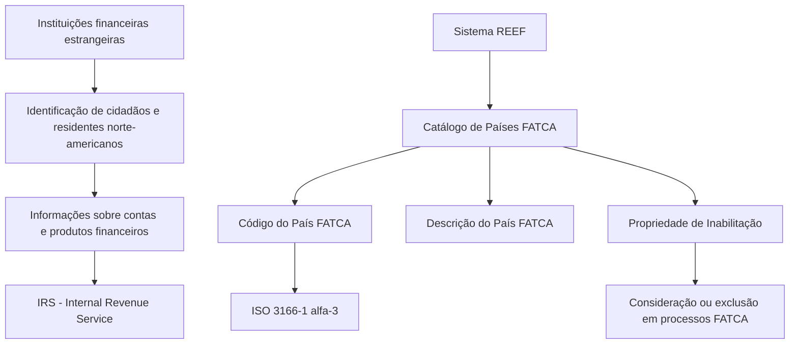

# Identificação dos Países Abrangidos pela FATCA no Sistema REEF

## 1. Metadados do Documento
- **Arquivo de Origem:** Não identificado no conteúdo fornecido
- **Tipo de Documento:** Especificação Técnica / Documento Funcional
- **Domínio / Sistema:** REEF / Catálogo de Países FATCA
- **Público-Alvo:** Negócio, Analistas Funcionais, Desenvolvedores e Operação
- **Data/Versão Identificada:** Não identificada
- **Owner identificado:** `user:agonzalez_mapfre.com`
- **Lifecycle identificado:** Approved

---

## 2. Resumo Executivo & Contexto de Negócio

O documento descreve a funcionalidade de identificação dos países sujeitos à norma FATCA no núcleo do sistema REEF. FATCA é apresentada como a sigla de *Foreign Account Tax Compliance Act*, uma lei dos Estados Unidos aprovada pelo Congresso em 2010, assinada pelo presidente Barack Obama e vigente desde 2013.

Segundo o conteúdo, o objetivo da FATCA é apoiar o controle da evasão fiscal pelo governo dos Estados Unidos. A norma busca identificar cidadãos e residentes norte-americanos que mantenham dinheiro, contas ou fundos depositados em instituições financeiras estrangeiras.

O documento informa que instituições financeiras de todo o mundo devem identificar e comunicar cidadãos e residentes norte-americanos que possuam depósitos e investimentos nessas instituições. Essas informações devem ser disponibilizadas ao IRS, identificado no documento como a autoridade fiscal dos Estados Unidos.

Funcionalmente, o sistema possibilita identificar os países nos quais a norma FATCA é aplicável. Essa identificação é suportada por um catálogo de países FATCA, no qual cada país possui um código e uma descrição. Os códigos configurados devem seguir a norma ISO 3166-1 alfa-3.

O documento não especifica telas, serviços, APIs, processos de carga, métodos HTTP, contratos JSON, persistência de dados ou regras de integração para o catálogo de países FATCA.

---

## 3. Arquitetura, Componentes & Tecnologias Envolvidas

### Componentes e entidades identificados

| Componente / Entidade | Papel descrito no documento | Observações |
| :--- | :--- | :--- |
| Sistema REEF | Núcleo do sistema com capacidade de identificar os países onde a norma FATCA vigora. | O documento não detalha arquitetura técnica do REEF. |
| Catálogo de Países FATCA | Catálogo que representa países sujeitos à consideração em processos FATCA. | Há referência relacionada a “Catálogo de Países”. |
| País FATCA | Entidade configurada no primeiro nível de informação de países. | Utiliza código ISO 3166-1 alfa-3. |
| Código do País FATCA | Chave que identifica o país que deve cumprir a norma. | Exemplos: `PAN`, `ESP`, `MEX`. |
| Descrição do Primeiro Nível | Denominação ou descrição associada ao código do País FATCA. | Exemplos: Panamá, Espanha e México. |
| Propriedade de Inabilitação | Indica que um Código do País FATCA está inabilitado para consideração ou inclusão nos processos FATCA. | O texto contém também uma descrição divergente relacionada a prefixo telefônico. |
| IRS | Autoridade fiscal dos Estados Unidos que recebe informações relativas a contas e produtos financeiros. | O documento explicita “Internal Revenue Service”. |
| ISO 3166-1 alfa-3 | Norma publicada pela Organização Internacional de Normalização para representar países, territórios dependentes e zonas especiais de interesse geográfico. | Norma exigida para os códigos configurados no sistema. |



**Nota de Análise:** O diagrama representa somente relações conceituais explicitamente sustentadas pelo conteúdo. O documento não descreve integrações diretas entre o sistema REEF, instituições financeiras ou o IRS.

---

## 4. Regras de Negócio, Especificações Funcionais & Processos

### 4.1. Finalidade regulatória da FATCA

1. FATCA significa *Foreign Account Tax Compliance Act*.
2. FATCA é descrita como uma lei dos Estados Unidos.
3. A lei foi aprovada pelo Congresso dos Estados Unidos em 2010.
4. A lei foi assinada pelo presidente Barack Obama.
5. A vigência da lei ocorreu em 2013.
6. A finalidade declarada é controlar a evasão fiscal pelo governo dos Estados Unidos.
7. O controle é realizado por meio da identificação de cidadãos e residentes dos Estados Unidos que possuam dinheiro, contas ou fundos em instituições financeiras estrangeiras.
8. Instituições financeiras de todo o mundo devem identificar e informar cidadãos e residentes norte-americanos que mantenham depósitos e investimentos nesses bancos.
9. As instituições financeiras devem disponibilizar ao IRS informações relacionadas às contas e aos produtos financeiros dessas pessoas.

### 4.2. Identificação de países FATCA no REEF

1. O núcleo do sistema REEF possui a capacidade funcional de identificar os países nos quais a norma FATCA vigora.
2. A informação de países é mantida em um primeiro nível de informação, denominado no texto como “Primer Nivel”.
3. O atributo **Código do País FATCA** identifica a chave do país que deve cumprir a norma.
4. Os códigos configurados no sistema devem corresponder à norma **ISO 3166-1 alfa-3**.
5. A norma ISO 3166-1 alfa-3 é indicada como publicada pela Organização Internacional de Normalização.
6. A norma é utilizada para representar países, territórios dependentes e zonas especiais de interesse geográfico.
7. A propriedade **Descrição do Primeiro Nível** armazena a denominação ou descrição do código do País FATCA.
8. A propriedade **Inabilitação**, conforme a seção “Outras Propriedades”, define que o Código do País FATCA está inabilitado para ser considerado ou incluído nos processos FATCA do sistema.

### 4.3. Exemplos de códigos e descrições

| Código do País FATCA | Descrição |
| :--- | :--- |
| `PAN` | Panamá |
| `ESP` | Espanha |
| `MEX` | México |

### 4.4. Documentos e diretrizes vinculados

O documento recomenda a leitura das diretrizes e dos documentos funcionais vinculados para evitar que uma interpretação isolada do conteúdo gere erro. São citados:

- Catálogo de Países
- Perguntas frequentes

### 4.5. Ponto de inconsistência no texto-fonte

O texto apresenta duas descrições diferentes para “Inhabilitación”:

1. Uma ocorrência afirma que o atributo “establece e identifica el código del prefijo telefónico del País FATCA”.
2. Outra ocorrência afirma que a propriedade estabelece que o Código do País FATCA está inabilitado para ser considerado ou incluído nos processos FATCA do sistema.

**Nota de Análise:** Não há elementos suficientes para determinar se a referência ao prefixo telefônico é um erro documental, uma propriedade distinta com nome repetido ou uma regra complementar. A interpretação funcional sustentada pela seção “Outras Propriedades” é a de inabilitação do código para processos FATCA.

---

## 5. Tabelas de Parâmetros, Ambientes e Estruturas de Dados

### 5.1. Estrutura funcional do País FATCA

| Item / Parâmetro | Descrição / Função | Tipo / Valores / Formato | Ambiente / Observações |
| :--- | :--- | :--- | :--- |
| Código do País FATCA | Chave que identifica o país que deve cumprir a norma FATCA. | Código ISO 3166-1 alfa-3. | Deve ser configurado no sistema. |
| Descrição do Primeiro Nível | Denominação ou descrição associada ao código do País FATCA. | Texto. | Exemplos identificados: Panamá, Espanha e México. |
| Inabilitação | Indica que o Código do País FATCA está inabilitado para ser considerado ou incluído nos processos FATCA. | Propriedade; valores não detalhados. | Não foram especificados valores, regras de alteração ou impacto técnico adicional. |
| Inhabilitación | O texto também a descreve como atributo que estabelece e identifica o código do prefixo telefônico do País FATCA. | Não detalhado. | Descrição inconsistente com a propriedade de inabilitação. |
| Norma de codificação | Regra de padronização para códigos de países. | ISO 3166-1 alfa-3. | Abrange países, territórios dependentes e zonas especiais de interesse geográfico. |

### 5.2. Exemplos de catálogo

| Item / Parâmetro | Descrição / Função | Tipo / Valores / Formato | Ambiente / Observações |
| :--- | :--- | :--- | :--- |
| `PAN` | Código do País FATCA para Panamá. | ISO 3166-1 alfa-3. | Exemplo apresentado no documento. |
| `ESP` | Código do País FATCA para Espanha. | ISO 3166-1 alfa-3. | Exemplo apresentado no documento. |
| `MEX` | Código do País FATCA para México. | ISO 3166-1 alfa-3. | Exemplo apresentado no documento. |

### 5.3. Informações de governança documental

| Item / Parâmetro | Descrição / Função | Tipo / Valores / Formato | Ambiente / Observações |
| :--- | :--- | :--- | :--- |
| Owner | Responsável identificado na página documental. | `user:agonzalez_mapfre.com` | Conforme conteúdo extraído. |
| Lifecycle | Estado de ciclo de vida documental. | `Approved` | Conforme conteúdo extraído. |
| Referência documental | Diretório ou contexto documental exibido. | `Documentation / DOCUMENTACIÓN Reef` | Conforme conteúdo extraído. |
| Referência adicional | Texto exibido no cabeçalho documental. | `Mapfredocument` | Não há detalhamento adicional. |

---

## 6. Bateria de Perguntas & Respostas para RAG (FAQ Sintético)

### P1: O que é FATCA segundo o documento?
**R:** FATCA é a sigla em inglês para *Foreign Account Tax Compliance Act*. O documento a descreve como uma lei dos Estados Unidos, aprovada pelo Congresso em 2010, assinada pelo presidente Barack Obama e vigente desde 2013.

### P2: Qual é o objetivo da FATCA descrito no documento?
**R:** O objetivo descrito é controlar a evasão fiscal pelo governo dos Estados Unidos mediante a identificação de cidadãos e residentes norte-americanos que possuam dinheiro, contas ou fundos depositados em instituições financeiras estrangeiras.

### P3: Que obrigação é atribuída às instituições financeiras no contexto da FATCA?
**R:** As instituições financeiras de todo o mundo devem identificar e informar cidadãos e residentes norte-americanos que tenham depósitos e investimentos nesses bancos. Também devem disponibilizar ao IRS informações relacionadas às contas e aos produtos financeiros dessas pessoas.

### P4: Qual é a funcionalidade do sistema REEF relacionada à FATCA?
**R:** O núcleo do sistema REEF possui a possibilidade de identificar em quais países a norma FATCA vigora. Essa identificação é suportada por informações de Países FATCA configuradas no sistema.

### P5: Qual padrão deve ser utilizado para configurar o Código do País FATCA?
**R:** Os códigos configurados devem seguir a norma ISO 3166-1 alfa-3, publicada pela Organização Internacional de Normalização para representar países, territórios dependentes e zonas especiais de interesse geográfico.

### P6: Qual é a função do atributo Código do País FATCA?
**R:** O atributo Código do País FATCA identifica a chave que identificará o país que deve cumprir a norma FATCA. O documento determina que esse código seja baseado no padrão ISO 3166-1 alfa-3.

### P7: O que armazena a Descrição do Primeiro Nível no catálogo de Países FATCA?
**R:** A propriedade Descrição do Primeiro Nível contém a denominação ou descrição correspondente ao código do País FATCA. Os exemplos apresentados incluem `PAN` para Panamá, `ESP` para Espanha e `MEX` para México.

### P8: O que significa a propriedade de Inabilitação para um Código do País FATCA?
**R:** Conforme a seção “Outras Propriedades”, a propriedade de Inabilitação estabelece que o Código do País FATCA está inabilitado para ser considerado ou incluído nos processos FATCA do sistema.

### P9: Existe uma definição inequívoca para o atributo Inhabilitación?
**R:** Não. O documento contém uma inconsistência: uma descrição relaciona “Inhabilitación” ao código do prefixo telefônico do País FATCA, enquanto outra define a propriedade como inabilitação do código nos processos FATCA. O texto não permite resolver essa divergência.

### P10: Quais exemplos de Países FATCA são apresentados?
**R:** O documento apresenta os exemplos `PAN` para Panamá, `ESP` para Espanha e `MEX` para México. Esses códigos são consistentes com o padrão ISO 3166-1 alfa-3 exigido para a configuração.

### P11: Qual é o papel do IRS no contexto apresentado?
**R:** O IRS, identificado como *Internal Revenue Service*, é a autoridade fiscal dos Estados Unidos. As instituições financeiras devem disponibilizar ao IRS informações relacionadas a contas e produtos financeiros de cidadãos e residentes norte-americanos identificados.

### P12: Quais documentos relacionados devem ser lidos para evitar interpretações incorretas?
**R:** O documento recomenda a leitura da relação de diretrizes e documentos funcionais vinculados, especificamente “Catálogo de Países” e “Perguntas frequentes”, para evitar que a interpretação isolada do documento conduza a erro.

---

## 7. Glossário de Termos, Siglas & Conceitos-Chave

- **FATCA:** *Foreign Account Tax Compliance Act*, lei dos Estados Unidos voltada ao controle da evasão fiscal mediante identificação de cidadãos e residentes norte-americanos com recursos em instituições financeiras estrangeiras.
- **IRS:** *Internal Revenue Service*, identificado no documento como a autoridade fiscal dos Estados Unidos.
- **ISO 3166-1 alfa-3:** Norma publicada pela Organização Internacional de Normalização para representar países, territórios dependentes e zonas especiais de interesse geográfico por códigos de três letras.
- **País FATCA:** País identificado no sistema como sujeito à consideração no contexto da norma FATCA.
- **Código do País FATCA:** Chave de identificação do País FATCA; deve usar a norma ISO 3166-1 alfa-3.
- **Descrição do Primeiro Nível:** Propriedade que contém a denominação ou descrição do código do País FATCA.
- **Inabilitação:** Propriedade que estabelece que o Código do País FATCA está inabilitado para consideração ou inclusão em processos FATCA do sistema.
- **REEF:** Sistema cujo núcleo possui a funcionalidade de identificar os países em que a norma FATCA vigora. O significado da sigla não é expandido no documento.
- **Catálogo de Países:** Documento ou referência vinculada citada como leitura recomendada.
- **Primer Nivel:** Termo presente no documento para indicar o primeiro nível que contém a informação dos países.

---

## 8. Notas Críticas, Riscos & Limitações

- O documento não identifica o nome do arquivo de origem, data, versão, autores técnicos ou histórico de alterações.
- O conteúdo não detalha a arquitetura técnica do sistema REEF, incluindo bancos de dados, serviços, APIs, integrações, autenticação, autorização ou mecanismos de auditoria.
- Não foram informados métodos HTTP, endpoints, contratos JSON, layouts de importação ou exportação, campos obrigatórios, regras de unicidade, validações de formato ou processos de manutenção do catálogo.
- Não há detalhamento sobre como os países são incluídos, alterados, removidos, aprovados ou inabilitados.
- Não foram apresentados ambientes, URLs, servidores, portas, diretórios de log ou procedimentos de operação.
- Há inconsistência documental na definição de “Inhabilitación”: uma descrição menciona prefixo telefônico, enquanto outra descreve inabilitação para processos FATCA.
- O documento recomenda a consulta a “Catálogo de Países” e “Perguntas frequentes”; a ausência desses materiais pode levar a interpretações incompletas ou incorretas.
- A seção de perguntas frequentes responde `N/A` à pergunta sobre recomendações operacionais locais para codificação, uso e definição do catálogo de Países FATCA.

---

## 9. Conteúdo Bruto Estruturado (Referência Fiel)

```text
--- [PÁGINA 1 DE 2] ---

IDENTIFICACIÓN de los Países adscritos al FATCA
Contexto
La Ley de cumplimiento tributario de cuentas extranjeras, conocida principalmente por sus siglas en inglés FATCA (Foreign Account Tax
Compliance Act) es una Ley de Estados Unidos, aprobada por el Congreso en 2010 y rmada por el presidente Barack Obama, que entró en
vigor en el año 2013.
El objetivo de esta disposición es el control de la evasión scal por el gobierno de Estados Unidos mediante la identicación de los
ciudadanos de este país y residentes en él que tengan dinero, cuentas o fondos depositados en instituciones nancieras extranjeras.
Para ello se requiere obligatoriamente a las instituciones nancieras de todo el mundo para que identiquen e informen de los ciudadanos y
residentes norteamericanos que tengan depósitos e inversiones en esos bancos. Las instituciones nancieras deben poner a disposición del
IRS (El Internal Revenue Service es la autoridad scal de Estados Unidos) información relacionada con cuentas y productos nancieros de
dichas personas
Objetivo
Funcionalmente, el núcleo del Sistema cuenta con la posibilidad de identicar en qué países rige esta Norma.
Datos Identicativos
Otras Propiedades
Datos Identicativos
Código del País FATCA
Este atributo identica la clave que identicará el País que ha de cumplir la norma.
NOTA: Puesto que este Primer Nivel contiene la información de los Países, los códigos que se han de congurar en el sistema son aquellos
correspondientes a la Norma ISO 3166-1 alfa-3 publicada por la Organización Internacional de Normalización, para representar países,
territorios dependientes y zonas especiales de interés geográco.
Descripción del Primer Nivel
Esta propiedad contiene la denominación o descripción del código del País FATCA
A modo de ejemplo:
PAÍS FATCA Descripción
PAN Panamá
Documentation / DOCUMENTACIÓN Reef
DOCUMENTACIÓN Reef
Mapfredocument
DOCUMENTACIÓN Reef
Owner
user:agonzalez_mapfre.com
Lifecycle
Approved Source
 /
VL
Buscar Inicio Soluciones Arquitecturas APIs Componentes Cloud Documentación Zeus Reef Ayuda
ES

--- [PÁGINA 2 DE 2] ---

PAÍS FATCA Descripción
ESP España
MEX México
... ...
Inhabilitación
Este Atributo establece e identica el código del prejo telefónico del País FATCA.
Otras Propiedades
Inhabilitación
Esta propiedad establece que el Código del País FATCA está inhabilitado para ser considerado o incluido en los procesos FATCA del Sistema.
Vínculos
Relación de Directrices y Documentos funcionales cuya lectura recomendada para evitar que la interpretación aislada del presente
documento pueda conducir a error.
Catálogo de Países
Preguntas frecuentes
(1) ¿Existe alguna recomendación operativa que deba ser tomada en consideración localmente en la codicación, uso y denición del
catálogo de Países FATCA en el Sistema?
N/A
Audiencia
```
