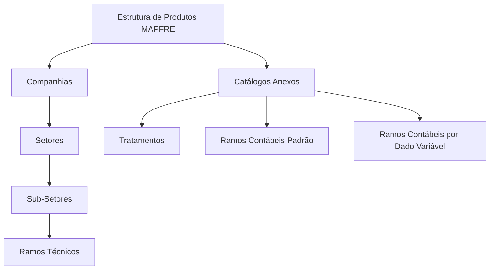

# Definição da Estrutura de Produtos MAPFRE

## 1. Metadados do Documento
- **Arquivo de Origem:** Não identificado
- **Tipo de Documento:** Especificação Técnica
- **Domínio / Sistema:** Estrutura de Produtos MAPFRE / Reef
- **Público-Alvo:** Negócio, Arquitetos, Desenvolvedores e Gestão de Produtos
- **Data/Versão Identificada:** Não identificada

---

## 2. Resumo Executivo & Contexto de Negócio

O documento define a **Estrutura de Produtos** como instrumento essencial para classificar riscos de seguro e assegurar a homogeneidade qualitativa entre produtos de uma entidade seguradora. A classificação considera modalidades de seguro associadas a riscos com características ou natureza semelhantes.

A Estrutura Técnica de Produtos abrange a relação sistemática e ordenada usada para descrever e classificar produtos e serviços oferecidos por uma companhia a clientes ou potenciais clientes. O conteúdo associa explicitamente essa estrutura à entidade **MAPFRE**.

O núcleo do sistema permite codificar e classificar a estrutura de produtos da MAPFRE por meio de repositórios de informação específicos. A organização apresentada possui uma estrutura piramidal de quatro níveis.

Os quatro níveis identificados são **Companhias**, **Setores**, **Sub-Setores** e **Ramos Técnicos**. O documento também enumera catálogos anexos: **Tratamentos**, **Ramos Contábeis Padrão** e **Ramos Contábeis por Dado Variável**.

---

## 3. Arquitetura, Componentes & Tecnologias Envolvidas

O documento descreve uma estrutura funcional de classificação de produtos no núcleo do sistema. Não são informadas tecnologias de implementação, interfaces, contratos, métodos HTTP, bancos de dados, URLs de ambiente ou mecanismos de integração.

### Componentes e estruturas identificadas

| Componente / Estrutura | Descrição baseada no documento |
| :--- | :--- |
| Núcleo do Sistema | Possui capacidade de codificar e classificar a estrutura de produtos da entidade MAPFRE. |
| Repositórios de informação específicos | Repositórios nos quais a estrutura piramidal de produtos é codificada e classificada. |
| Estrutura de Produtos | Organização técnica e sistemática de modalidades de seguro, produtos e serviços. |
| Companhias | Primeiro nível listado da estrutura piramidal. |
| Setores | Segundo nível listado da estrutura piramidal. |
| Sub-Setores | Terceiro nível listado da estrutura piramidal. |
| Ramos Técnicos | Quarto nível listado da estrutura piramidal. |
| Catálogos Anexos | Conjunto adicional de catálogos composto por Tratamentos, Ramos Contábeis Padrão e Ramos Contábeis por Dado Variável. |
| Reef | Ambiente/documentação citada na navegação e nos metadados de documentação. |
| Mapfredocument | Termo citado na área de documentação, sem detalhamento funcional adicional. |
| Zeus | Termo citado no menu de navegação, sem detalhamento adicional. |



> *Nota de Análise: O documento afirma que a estrutura de produtos é armazenada em repositórios de informação específicos, mas não identifica os repositórios, seus modelos de dados, tecnologias ou responsáveis técnicos.*

---

## 4. Regras de Negócio, Especificações Funcionais & Processos

### Princípios de classificação

1. A classificação de riscos em uma estrutura de produtos é considerada um instrumento fundamental para estabelecer a homogeneidade qualitativa dos riscos e produtos.
2. As entidades seguradoras possuem uma Estrutura Técnica de Produtos.
3. A Estrutura Técnica de Produtos compreende modalidades de seguro relacionadas a riscos de características ou natureza semelhantes.
4. A Estrutura Técnica de Produtos também compreende uma relação sistemática e ordenada para descrição e classificação de produtos e serviços oferecidos a clientes ou candidatos a clientes.
5. O núcleo do sistema permite codificar e classificar a estrutura de produtos da entidade MAPFRE.
6. A codificação e a classificação ocorrem em repositórios de informação específicos.
7. A estrutura apresentada é piramidal e possui quatro níveis:
   1. Companhias;
   2. Setores;
   3. Sub-Setores;
   4. Ramos Técnicos.
8. A estrutura possui catálogos anexos para:
   - Tratamentos;
   - Ramos Contábeis Padrão;
   - Ramos Contábeis por Dado Variável.

> *Nota de Análise: O documento não detalha regras de validação, critérios de criação ou alteração de códigos, relacionamentos obrigatórios entre níveis, responsáveis pelo cadastro, permissões de acesso ou fluxos de aprovação.*

---

## 5. Tabelas de Parâmetros, Ambientes e Estruturas de Dados

| Item / Parâmetro | Descrição / Função | Tipo / Valores / Formato | Ambiente / Observações |
| :--- | :--- | :--- | :--- |
| Estrutura de Produtos | Instrumento para classificação de riscos e produtos de seguro. | Estrutura técnica e sistemática. | Associada à entidade MAPFRE. |
| Homogeneidade qualitativa | Objetivo da classificação dos riscos dentro da estrutura de produtos. | Princípio de classificação. | Não há métricas ou critérios quantitativos informados. |
| Companhias | Nível da estrutura piramidal de produtos. | Nível 1 listado. | Sem definição adicional. |
| Setores | Nível da estrutura piramidal de produtos. | Nível 2 listado. | Sem definição adicional. |
| Sub-Setores | Nível da estrutura piramidal de produtos. | Nível 3 listado. | Sem definição adicional. |
| Ramos Técnicos | Nível da estrutura piramidal de produtos. | Nível 4 listado. | Sem definição adicional. |
| Tratamentos | Catálogo anexo da estrutura de produtos. | Catálogo. | Sem detalhamento funcional. |
| Ramos Contábeis Padrão | Catálogo anexo da estrutura de produtos. | Catálogo. | Sem valores ou regras informadas. |
| Ramos Contábeis por Dado Variável | Catálogo anexo da estrutura de produtos. | Catálogo. | Sem dados variáveis identificados. |
| Repositórios de informação específicos | Local lógico onde o núcleo do sistema codifica e classifica a estrutura de produtos. | Repositórios não identificados. | Tecnologia, localização e acesso não informados. |
| Reef | Referência de documentação e navegação. | Plataforma/área documental citada. | O conteúdo não especifica funcionalidade técnica. |
| Mapfredocument | Referência presente na área documental. | Termo identificado. | Sem detalhamento adicional. |
| Owner | Proprietário indicado nos metadados documentais. | `user:agonzalez_mapfre.com` | Valor literal apresentado no conteúdo. |
| Lifecycle | Estado do documento. | `Approved Source` | Conforme texto extraído. |
| Idioma | Idioma indicado na navegação. | `ES` | O corpo principal está em espanhol. |

---

## 6. Bateria de Perguntas & Respostas para RAG (FAQ Sintético)

### P1: Qual é o objetivo da Estrutura de Produtos na entidade MAPFRE?
**R:** A Estrutura de Produtos tem o objetivo de classificar riscos, produtos e serviços de forma sistemática e ordenada. Essa classificação é apresentada como instrumento fundamental para estabelecer a homogeneidade qualitativa dos riscos e produtos.

### P2: O que caracteriza uma Estrutura Técnica de Produtos segundo o documento?
**R:** A Estrutura Técnica de Produtos é o conjunto de modalidades de seguro relativas a riscos com características ou natureza semelhantes, além da relação sistemática e ordenada que descreve e classifica produtos e serviços oferecidos pela companhia.

### P3: Quais são os quatro níveis da estrutura piramidal de produtos MAPFRE?
**R:** Os quatro níveis listados são: Companhias, Setores, Sub-Setores e Ramos Técnicos.

### P4: Onde a estrutura de produtos MAPFRE pode ser codificada e classificada?
**R:** O documento informa que o núcleo do sistema permite codificar e classificar a estrutura de produtos da MAPFRE em repositórios de informação específicos. Os nomes, tecnologias e localizações desses repositórios não são detalhados.

### P5: Quais catálogos anexos fazem parte da Estrutura de Produtos?
**R:** Os catálogos anexos listados são Tratamentos, Ramos Contábeis Padrão e Ramos Contábeis por Dado Variável.

### P6: O documento define como relacionar Companhias, Setores, Sub-Setores e Ramos Técnicos?
**R:** Não. O documento informa que esses elementos compõem uma estrutura piramidal de quatro níveis, mas não especifica regras de relacionamento, cardinalidade, obrigatoriedade ou critérios de cadastro entre eles.

### P7: O documento especifica APIs, métodos HTTP ou contratos de integração para a Estrutura de Produtos?
**R:** Não. O conteúdo não apresenta APIs, métodos HTTP, contratos JSON, mensagens, protocolos ou mecanismos de integração.

### P8: Qual é a finalidade da classificação de riscos em uma estrutura de produtos?
**R:** A finalidade indicada é estabelecer a homogeneidade qualitativa dos riscos e produtos agrupados na estrutura de produtos.

### P9: Quais públicos podem se beneficiar da Estrutura Técnica de Produtos descrita?
**R:** Com base no conteúdo, a estrutura é relevante para áreas que classificam, descrevem, organizam ou mantêm produtos e modalidades de seguro, incluindo negócio, arquitetura, desenvolvimento e gestão de produtos. O documento não define formalmente papéis ou perfis de acesso.

### P10: O que significa “Ramos Contábeis por Dado Variável” no documento?
**R:** “Ramos Contábeis por Dado Variável” é listado como um catálogo anexo da Estrutura de Produtos. O documento não explica quais dados variáveis são usados, seus formatos, regras de cálculo ou impacto contábil.

### P11: Existe uma versão ou data identificável para o documento?
**R:** Não. O conteúdo extraído não apresenta uma data nem uma versão explícita do documento.

### P12: Qual é o status de ciclo de vida indicado para a documentação?
**R:** A área de documentação apresenta o valor `Approved Source` no campo `Lifecycle`.

---

## 7. Glossário de Termos, Siglas & Conceitos-Chave

- **Estrutura de Produtos:** Estrutura técnica usada para descrever, classificar e organizar modalidades de seguro, produtos e serviços.
- **Estrutura Técnica de Produtos:** Conjunto de modalidades de seguro relacionadas a riscos de natureza ou características semelhantes, organizado de forma sistemática.
- **Risco:** Elemento sujeito a classificação na estrutura de produtos, associado a modalidades de seguro.
- **Modalidade de Seguro:** Categoria de seguro relacionada a riscos com características ou natureza semelhantes.
- **Companhias:** Primeiro nível listado na estrutura piramidal de produtos.
- **Setores:** Segundo nível listado na estrutura piramidal de produtos.
- **Sub-Setores:** Terceiro nível listado na estrutura piramidal de produtos.
- **Ramos Técnicos:** Quarto nível listado na estrutura piramidal de produtos.
- **Catálogos Anexos:** Catálogos complementares da estrutura de produtos.
- **Tratamentos:** Catálogo anexo citado sem definição adicional.
- **Ramos Contábeis Padrão:** Catálogo anexo citado sem definição adicional.
- **Ramos Contábeis por Dado Variável:** Catálogo anexo citado sem definição adicional.
- **MAPFRE:** Entidade mencionada como detentora da estrutura de produtos classificada pelo núcleo do sistema.
- **Reef:** Referência a documentação e navegação presente no conteúdo extraído.
- **Zeus:** Termo presente no menu de navegação, sem detalhamento funcional.
- **Lifecycle:** Campo de ciclo de vida documental exibido com o valor `Approved Source`.

---

## 8. Notas Críticas, Riscos & Limitações

- O documento apresenta uma visão conceitual e estrutural, mas não fornece detalhes de implementação.
- Não há identificação dos repositórios de informação específicos mencionados.
- Não são informadas tecnologias, bancos de dados, serviços, APIs, URLs, ambientes, credenciais ou mecanismos de integração.
- Não há regras de governança para criação, alteração, exclusão ou aprovação de elementos da Estrutura de Produtos.
- Não são definidos modelos de dados, campos, códigos, chaves, cardinalidades ou relacionamentos entre os quatro níveis hierárquicos.
- Não há detalhamento dos conteúdos ou regras dos catálogos Tratamentos, Ramos Contábeis Padrão e Ramos Contábeis por Dado Variável.
- O documento não apresenta procedimentos operacionais, tratamento de erros, trilha de auditoria, matriz de permissões ou critérios de qualidade dos dados.
- A referência a Reef, Mapfredocument e Zeus aparece apenas em contexto de navegação/documentação; suas funções técnicas não podem ser inferidas do conteúdo.

---

## 9. Conteúdo Bruto Estruturado (Referência Fiel)

```text
--- [PÁGINA 1 DE 1] ---

DEFINICIÓN de la ESTRUCTURA de PRODUCTOS
Contexto
La clasicación de los riesgos en una estructura de productos es un instrumento fundamental para establecer la homogeneidad cualitativa de
los mismos.
Por ello, todas las Entidades Aseguradoras cuentan con una Estructura Técnica de sus Productos, entendiendo como tal al conjunto de
modalidades de seguro relativas a riesgos de características o naturaleza semejantes además de la relación sistemática y ordenada en la
que se describen y clasican los productos y servicios que una compañía ofrece a sus clientes o candidatos a clientes
Niveles de la Estructura de Productos
Funcionalmente, el núcleo del Sistema cuenta con la posibilidad de codicar y clasicar la estructura de Productos de la entidad MAPFRE en
una estructura piramidal de cuatro niveles en repositorios de información especícos,
Compañías
Sectores
Sub-Sectores
Ramos Técnicos
Catálogos Anexos
Tratamientos
Ramos Contables Estándar
Ramos Contables por Dato Variable
Documentation / DOCUMENTACIÓN Reef
DOCUMENTACIÓN Reef
Mapfredocument
DOCUMENTACIÓN Reef
Owner
user:agonzalez_mapfre.com
Lifecycle
Approved Source
 / 
 VL
Buscar Inicio Soluciones Arquitecturas APIs Componentes Cloud Documentación Zeus Reef Ayuda
ES
```
