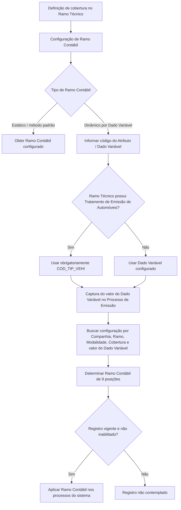

# Definición de Ramo Contable por Dato Variable — Documentación Reef / MAPFRE

## 1. Metadados do Documento
- **Arquivo de Origem:** Não informado; conteúdo extraído de documentação Reef.
- **Tipo de Documento:** Especificação Funcional.
- **Domínio / Sistema:** Reef / MAPFRE — configuração de Ramos Contábeis associados a coberturas.
- **Público-Alvo:** Analistas funcionais, configuradores do sistema, desenvolvedores, arquitetos e operação.
- **Data/Versão Identificada:** Não identificada.
- **Owner Identificado:** `user:agonzalez_mapfre.com`
- **Lifecycle Identificado:** Approved Source.

---

## 2. Resumo Executivo & Contexto de Negócio

O documento descreve a definição de **Ramo Contable por Dato Variable** no sistema Reef. Ramos contábeis são chaves associadas às coberturas que determinam a conta sobre a qual ocorrerá a contabilização. A associação entre ramo contábil e cobertura é realizada durante a definição da cobertura no ramo técnico.

A configuração permite que um ramo contábil seja obtido de forma estática pelo método padrão ou de forma dinâmica. Na modalidade dinâmica, o sistema utiliza o valor de um Dado Variável, previamente definido pela entidade MAPFRE e associado às apólices e aos riscos durante o Processo de Emissão.

A definição é contextualizada por Companhia, Ramo Técnico, Modalidade ou Produto Técnico/Comercial e Cobertura. Quando a determinação depende de dado variável, a configuração deve informar tanto o código do atributo/dado variável quanto o valor que será utilizado para localizar o ramo contábil aplicável.

Para ramos técnicos com Tratamento de Emissão de Automóveis, existe uma regra obrigatória: o atributo empregado deve possuir o valor `COD_TIP_VEHI`. O documento exemplifica a diferenciação contábil por tipo de veículo — automóveis, motocicletas e caminhões —, modalidade e cobertura.

O ramo contábil possui nove posições, organizadas em setor, subsetor, agrupamento e sequência. A vigência da configuração é controlada por uma data de validade, e registros podem ser inabilitados para que não sejam considerados pelos processos do sistema.

---

## 3. Arquitetura, Componentes & Tecnologias Envolvidas

### Componentes e conceitos identificados

| Componente / Conceito | Papel no processo |
| :--- | :--- |
| **Sistema Reef** | Sistema cuja documentação descreve a configuração de Ramos Contábeis. |
| **Entidade MAPFRE** | Entidade responsável pela definição de Dados Variáveis utilizados no processo. |
| **Ramo Contábil** | Chave associada à cobertura para determinar a conta de contabilização. |
| **Cobertura** | Elemento afetado pela definição do ramo contábil. |
| **Ramo Técnico** | Contexto técnico ao qual a definição se aplica. |
| **Modalidade / Produto Técnico-Comercial** | Contexto de produto que pode diferenciar a definição do ramo contábil. |
| **Dado Variável** | Atributo configurado pela entidade MAPFRE e associado a apólices e riscos durante a emissão. |
| **Processo de Emissão** | Processo no qual são capturados dados das apólices e riscos, incluindo valores de Dados Variáveis. |
| **Tratamento de Emissão de Automóveis** | Condição que exige o uso obrigatório do atributo `COD_TIP_VEHI`. |
| **Data de Validade** | Data a partir da qual o Ramo Contábil torna-se plenamente operacional. |
| **Inabilitação** | Estado que exclui o registro dos processos do sistema. |

### Fluxo funcional de determinação do Ramo Contábil



> **Nota de Análise:** O documento não detalha contratos de integração, métodos HTTP, APIs, persistência de dados, interfaces de usuário, tecnologias de implementação ou mecanismos técnicos de busca da configuração.

---

## 4. Regras de Negócio, Especificações Funcionais & Processos

### 4.1 Finalidade do Ramo Contábil

1. Ramos contábeis são chaves associadas às coberturas.
2. A chave de ramo contábil relaciona a cobertura à conta sobre a qual será realizada a contabilização.
3. A associação entre ramo contábil e cobertura é feita no momento da definição da cobertura no ramo.

### 4.2 Formas de obtenção do Ramo Contábil

| Tipo de obtenção | Regra |
| :--- | :--- |
| **Estática** | O ramo contábil é obtido pelo método padrão. |
| **Dinâmica por Dado Variável** | O ramo contábil é obtido conforme o valor de um Dado Variável definido pela entidade MAPFRE. |

### 4.3 Contexto de aplicação da configuração

A definição de Ramo Contábil é afetada pelos seguintes elementos:

1. **Companhia:** código da companhia para a qual o Ramo Contábil está sendo definido.
2. **Ramo:** código do Ramo Técnico afetado pela definição.
3. **Modalidade:** código da Modalidade ou Produto Técnico/Comercial afetado.
4. **Cobertura:** código da Cobertura afetada.
5. **Tipo de Ramo Contábil:** define se o ramo contábil será estático ou dinâmico por Dado Variável.

### 4.4 Regras para obtenção dinâmica

Quando o Tipo de Ramo Contábil indicar obtenção dinâmica:

1. O atributo **Nome do Atributo/Dado Variável** deve conter o código do Dado Variável utilizado para pesquisar o Ramo Contábil.
2. O atributo **Valor do Dado Variável** deve conter o valor utilizado na pesquisa do Ramo Contábil.
3. Os valores dos Dados Variáveis são associados às apólices e aos seus riscos durante a captura de informações no Processo de Emissão.
4. Para Ramo Técnico com Tratamento de Emissão de Automóveis, o atributo utilizado obrigatoriamente deve possuir o valor `COD_TIP_VEHI`.

### 4.5 Estrutura do código de Ramo Contábil

O código de Ramo Contábil possui nove posições:

| Posições | Componente |
| :--- | :--- |
| 1 | Setor |
| 2–3 | Subsetor |
| 4–6 | Agrupamento |
| 7–9 | Sequência |

### 4.6 Regras de vigência e inabilitação

1. A **Data de Validade** indica a data a partir da qual o Ramo Contábil estará plenamente operacional no sistema.
2. A propriedade **Inabilitação** indica que o registro está inabilitado e não pode ser contemplado nos processos do sistema.

### 4.7 Recomendação para codificação local

As posições destinadas ao **Agrupamento** — posições 4, 5 e 6 — podem ser definidas com qualquer sequência considerada conveniente pela entidade local. A prática mais usual identificada no documento é utilizar uma sequência que identifique univocamente o código do Ramo Técnico.

---

## 5. Tabelas de Parâmetros, Ambientes e Estruturas de Dados

### 5.1 Propriedades operacionais da definição

| Item / Parâmetro | Descrição / Função | Tipo / Valores / Formato | Ambiente / Observações |
| :--- | :--- | :--- | :--- |
| Companhia | Código da companhia para a qual o Ramo Contábil está sendo definido. | Código de companhia. | Aplicável à configuração no sistema. |
| Ramo | Código do Ramo Técnico afetado pela definição. | Código de ramo técnico. | Contexto técnico da definição. |
| Modalidade | Código da Modalidade ou Produto Técnico/Comercial afetado. | Código de modalidade/produto. | Pode diferenciar a determinação do ramo contábil. |
| Cobertura | Código da cobertura afetada pela definição. | Código de cobertura. | O ramo contábil é associado à cobertura. |
| Tipo de Ramo Contábil | Define se o ramo contábil será obtido estaticamente ou dinamicamente. | Estático pelo método padrão; dinâmico por Dado Variável. | Controla o mecanismo de obtenção. |
| Nome do Atributo/Dado Variável | Código do Dado Variável usado para buscar o Ramo Contábil. | Código de Dado Variável. | Obrigatório quando a obtenção for dinâmica. |
| Valor do Dado Variável | Valor do Dado Variável usado para buscar o Ramo Contábil. | Valor associado ao Dado Variável. | Obrigatório quando a obtenção for dinâmica. |
| Ramo Contábil | Código contábil associado à configuração. | Código de 9 posições. | Estruturado em setor, subsetor, agrupamento e sequência. |
| Data de Validade | Define quando o Ramo Contábil passa a estar plenamente operacional. | Data. | Controla a vigência operacional. |
| Inabilitação | Indica que o registro não deve participar dos processos do sistema. | Estado de inabilitação. | Registro inabilitado não é contemplado. |

### 5.2 Regra específica para emissão de automóveis

| Condição | Atributo/Dado Variável obrigatório | Observação |
| :--- | :--- | :--- |
| Ramo Técnico com Tratamento de Emissão de Automóveis | `COD_TIP_VEHI` | O documento estabelece que o atributo empregado obrigatoriamente deve ter esse valor. |

### 5.3 Exemplos de configuração apresentados

| Ramo | Modalidade | Cobertura | Dado Variável | Valor do Dado Variável | Ramo Contábil |
| :--- | :--- | :--- | :--- | :--- | :--- |
| 401 | Todo Riesgo | Daños Propios | `COD_TIP_VEHI` | AUTOMÓVILES | `101401001` |
| 401 | Todo Riesgo plus | Daños Propios | `COD_TIP_VEHI` | AUTOMÓVILES | `101401007` |
| 401 | Todo Riesgo | Daños Propios | `COD_TIP_VEHI` | MOTOCICLETAS | `101401002` |
| 401 | Todo Riesgo | Daños Propios | `COD_TIP_VEHI` | CAMIONES | `101401003` |
| 401 | Seguro Obligatorio | Resp. Civil | `COD_TIP_VEHI` | AUTOMÓVILES | `101401001` |
| 401 | Seguro Obligatorio | Resp. Civil | `COD_TIP_VEHI` | MOTOCICLETAS | `101401001` |
| 401 | Seguro Obligatorio | Resp. Civil | `COD_TIP_VEHI` | CAMIONES | `101401003` |

---

## 6. Bateria de Perguntas & Respostas para RAG (FAQ Sintético)

### P1: O que é um Ramo Contábil no contexto da documentação Reef?
**R:** Um Ramo Contábil é uma chave associada a uma cobertura que a relaciona à conta sobre a qual será realizada a contabilização. A associação do ramo contábil com a cobertura ocorre durante a definição da cobertura no ramo.

### P2: Em que momento o Ramo Contábil é associado à cobertura?
**R:** A associação entre Ramo Contábil e Cobertura é realizada no momento da definição da cobertura no Ramo Técnico.

### P3: Quais modalidades de obtenção do Ramo Contábil são previstas?
**R:** O documento prevê obtenção estática, pelo método padrão, e obtenção dinâmica, de acordo com o valor de um Dado Variável definido pela entidade MAPFRE.

### P4: Quais dados contextualizam uma definição de Ramo Contábil?
**R:** A definição é contextualizada pelos códigos de Companhia, Ramo Técnico, Modalidade ou Produto Técnico/Comercial, Cobertura, Tipo de Ramo Contábil, Nome do Atributo/Dado Variável, Valor do Dado Variável e Ramo Contábil.

### P5: Quando o campo Nome do Atributo/Dado Variável deve ser preenchido?
**R:** O campo deve ser preenchido quando o Tipo de Ramo Contábil indicar obtenção dinâmica em função de um Dado Variável. Nesse caso, ele deve conter o código do Dado Variável utilizado para realizar a busca do Ramo Contábil.

### P6: Qual atributo deve ser utilizado obrigatoriamente para Ramo Técnico com Tratamento de Emissão de Automóveis?
**R:** O atributo empregado obrigatoriamente deve possuir o valor `COD_TIP_VEHI`.

### P7: Como os valores dos Dados Variáveis são relacionados a apólices e riscos?
**R:** Os valores dos Dados Variáveis são associados às apólices e aos seus riscos durante a captura de informações realizada no Processo de Emissão.

### P8: Como é composto o código de Ramo Contábil?
**R:** O código de Ramo Contábil possui nove posições: a posição 1 representa o Setor; as posições 2 e 3 representam o Subsetor; as posições 4 a 6 representam o Agrupamento; e as posições 7 a 9 representam a Sequência.

### P9: O que significa a Data de Validade de um Ramo Contábil?
**R:** A Data de Validade indica a data a partir da qual o Ramo Contábil estará plenamente operacional no sistema.

### P10: Qual é o efeito da propriedade Inabilitação?
**R:** A propriedade Inabilitação estabelece que o registro está inabilitado e, portanto, não pode ser contemplado nos processos do sistema.

### P11: Como o Agrupamento do código de Ramo Contábil pode ser definido localmente?
**R:** As posições de Agrupamento podem receber qualquer sequência que a entidade local considere conveniente. A forma mais usual mencionada no documento é utilizar uma sequência que identifique univocamente o código do Ramo Técnico.

### P12: O mesmo Ramo Técnico pode gerar Ramos Contábeis diferentes conforme o tipo de veículo?
**R:** Sim. Os exemplos mostram que, para o Ramo `401`, a Cobertura `Daños Propios` e o Dado Variável `COD_TIP_VEHI`, valores como `AUTOMÓVILES`, `MOTOCICLETAS` e `CAMIONES` podem resultar em Ramos Contábeis distintos, como `101401001`, `101401002` e `101401003`.

---

## 7. Glossário de Termos, Siglas & Conceitos-Chave

- **Reef:** Sistema/documentação no qual está descrita a configuração de Ramos Contábeis.
- **MAPFRE:** Entidade mencionada como responsável pela definição dos Dados Variáveis utilizados na configuração.
- **Ramo Contábil:** Chave associada a uma cobertura e à conta sobre a qual será realizada sua contabilização.
- **Ramo Técnico:** Código de ramo afetado pela definição de Ramo Contábil.
- **Modalidade:** Código da modalidade ou do Produto Técnico/Comercial ao qual a definição se aplica.
- **Cobertura:** Elemento cuja definição pode ser associado a um Ramo Contábil.
- **Dado Variável:** Dado definido pela entidade MAPFRE, associado a apólices e riscos durante o Processo de Emissão, que pode determinar dinamicamente o Ramo Contábil.
- **`COD_TIP_VEHI`:** Valor obrigatório do atributo a ser empregado quando o Ramo Técnico possui Tratamento de Emissão de Automóveis.
- **Agrupamento:** Parte do código de Ramo Contábil localizada nas posições 4 a 6.
- **Inabilitação:** Propriedade que impede que um registro seja considerado nos processos do sistema.
- **Data de Validade:** Data a partir da qual um Ramo Contábil torna-se plenamente operacional no sistema.

---

## 8. Notas Críticas, Riscos & Limitações

- O documento não apresenta métodos HTTP, contratos JSON, APIs, tabelas físicas, banco de dados, interfaces de configuração ou detalhes de implementação técnica.
- O documento não especifica o algoritmo de resolução quando houver mais de uma configuração aplicável ao mesmo conjunto de Companhia, Ramo, Modalidade, Cobertura, Dado Variável e valor.
- O documento não detalha o comportamento do sistema quando não existir um Ramo Contábil correspondente ao valor do Dado Variável capturado.
- O documento não define formatos de data, regras de sobreposição de períodos de validade ou processo de reabilitação de registros inabilitados.
- O documento recomenda a leitura de diretrizes e documentos funcionais vinculados para evitar interpretações isoladas incorretas, mas não identifica tais documentos no conteúdo fornecido.
- **Nota de Análise:** O termo “Ramos Contables Estándar” aparece no conteúdo, mas não recebe detalhamento adicional.

---

## 9. Conteúdo Bruto Estruturado (Referência Fiel)

```text
--- [PÁGINA 1 DE 3] ---

DEFINICIÓN de Ramo Contable por Dato Variable
Contexto
Los ramos contables son claves, asociadas a las coberturas, que las relacionan con la cuenta sobre la que se va a realizar su contabilización.
La asociación del ramo contable con la cobertura se realiza en el momento de la definición de la cobertura en el ramo.
Por otra parte, el sistema contempla la posibilidad de poder configurar los ramos contables de las coberturas de acuerdo con los valores de
alguno de los datos variables que hayan sido definidos por la entidad MAPFRE, valores que se van a asociar a las pólizas y a sus riesgos en la
captura de su información durante el Proceso de Emisión.
Propiedades Operativas
Otras Propiedades
Propiedades Operativas
Compañía
Este atributo contiene el código de la compañía para la que se está definiendo el Ramo Contable en el Sistema.
Ramo
Esta propiedad contiene el código del Ramo Técnico al que afecta esta definición.
Modalidad
Esta propiedad contiene el código de la Modalidad o Producto 'Técnico/Comercial' a la que afecta esta definición.
Cobertura
Esta propiedad contiene el código de la Cobertura a la que afecta esta definición.
Tipo de Ramo Contable
Este atributo contiene el Tipo de Ramo Contable que se va a contemplar en la definición de la Cobertura, es decir, si el Ramo Contable se va a
obtener de forma estática por el método estándar o el ramo contable se va a obtener dinámicamente de acuerdo con el valor del Dato
Variable.
Nombre del Atributo/Dato Variable
Caso que el Tipo de Ramo Contable indique que va a ser obtenido dinámicamente en función de un Dato Variable, este atributo contendrá el
código del Dato Variable que se ha de utilizar para realizar la búsqueda del Ramo Contable.
Documentation / DOCUMENTACIÓN Reef
DOCUMENTACIÓN Reef
Mapfredocument
DOCUMENTACIÓN Reef
Owner
user:agonzalez_mapfre.com
Lifecycle
Approved Source
 /
 VL
Buscar Inicio Soluciones Arquitecturas APIs Componentes Cloud Documentación Zeus Reef Ayuda
ES

--- [PÁGINA 2 DE 3] ---

El Atributo que se ha de emplear si el Ramo Técnico tiene un Tratamiento de Emisión de Automóviles obligatoriamente ha de tener el valor:
'COD_TIP_VEHI'.
Valor del Dato Variable
Caso que el Tipo de Ramo Contable indique que vaya a ser obtenido dinámicamente en función de un Dato Variable, este atributo contendrá
el valor del Dato Variable que se ha de utilizar para realizar la búsqueda del Ramo Contable.
Ramo Contable
Este atributo contiene el código del Ramo Contable en el Sistema compuesto por 9 posiciones que usualmente se conforman de la siguiente
forma:
POSICIONES DESCRIPCIÓN
1 Sector
2 - 3 Sub Sector
4 - 5 - 6 Agrupamiento
7 - 8 - 9 Secuencia
De esta manera y como ejemplo, se podrían tener Ramos Contables distintos si se hubiera emitido una póliza para un Automóvil, para una
Motocicleta o para un Camión, para distintas Modalidades, para distintas coberturas, ...
RAMO MODALIDAD COBERTURA DATO VARIABLE VALOR DEL DATO VARIABLE RAMO CONTABLE
401 Todo Riesgo Daños Propios COD_TIP_VEHI AUTOMÓVILES 101401001
401 Todo Riesgo plus Daños Propios COD_TIP_VEHI AUTOMÓVILES 101401007
401 Todo Riesgo Daños Propios COD_TIP_VEHI MOTOCICLETAS 101401002
401 Todo Riesgo Daños Propios COD_TIP_VEHI CAMIONES 101401003
401 Seguro Obligatorio Resp. Civil COD_TIP_VEHI AUTOMÓVILES 101401001
401 Seguro Obligatorio Resp. Civil COD_TIP_VEHI MOTOCICLETAS 101401001
401 Seguro Obligatorio Resp. Civil COD_TIP_VEHI CAMIONES 101401003
Otras Propiedades
Fecha de Validez
Esta propiedad le indica al sistema la fecha a partir de la cual el Ramo Contable estará plenamente operativo en el sistema.
Inhabilitación
Esta propiedad establece que el Registro está inhabilitado para poder ser contemplado en los procesos del Sistema.
Vínculos
Relación de Directrices y Documentos funcionales cuya lectura recomendada para evitar que la interpretación aislada del presente
documento pueda conducir a error.

--- [PÁGINA 3 DE 3] ---

Ramos Contables Estándar
Preguntas frecuentes
(1) ¿Existe alguna recomendación que deba ser tomada en consideración localmente en la codificación, uso y definición del catálogo de
Ramos Contables por Tipo de Vehículo en el Sistema?
Las posiciones correspondientes al Agrupamiento pueden definirse como cualquier secuencia que se estime conveniente por parte de la
entidad local siendo la más usual aquella que identifica unívocamente el código del Ramo Técnico.
```
