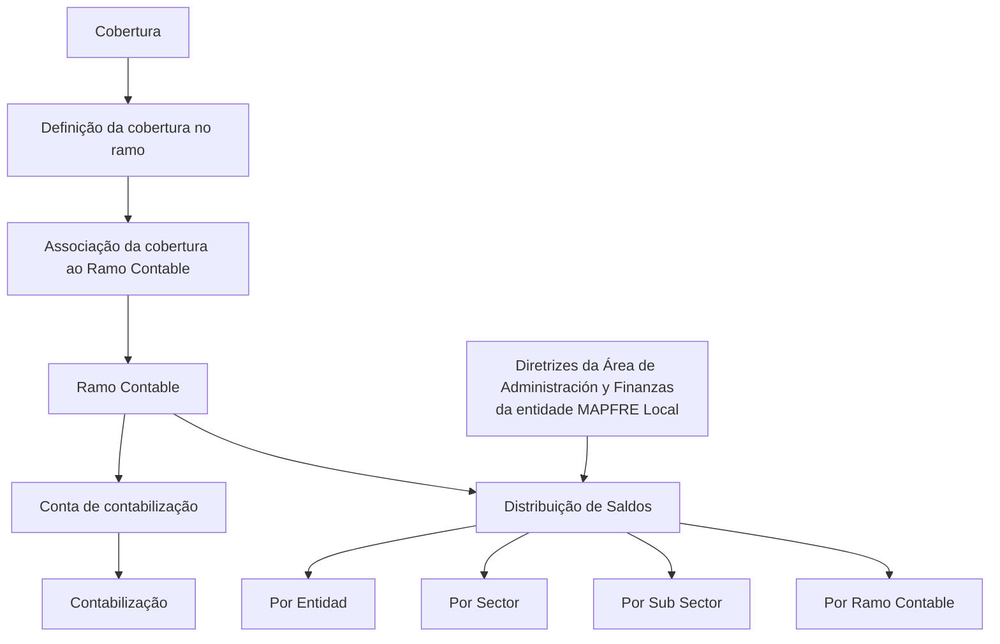

# Definição de Ramo Contable no Sistema — Propriedades Gerais, Operativas e Codificação

## 1. Metadados do Documento
- **Arquivo de Origem:** Não identificado no conteúdo fornecido
- **Tipo de Documento:** Especificação Técnica / Documentação Funcional
- **Domínio / Sistema:** Reef / MAPFRE — catálogo de Ramos Contables
- **Público-Alvo:** Analistas funcionais, desenvolvedores, arquitetura, administração e finanças das entidades MAPFRE locais
- **Data/Versão Identificada:** Não identificada
- **Estado documental identificado:** `Lifecycle: Approved`
- **Owner identificado:** `user:agonzalez_mapfre.com`

---

## 2. Resumo Executivo & Contexto de Negócio

O documento define o conceito de **Ramo Contable** no sistema Reef. Os Ramos Contables são chaves associadas às coberturas e têm a finalidade de relacionar cada cobertura à conta sobre a qual será realizada a respetiva contabilização.

A associação entre uma cobertura e um Ramo Contable ocorre durante a definição da cobertura no ramo. Portanto, a configuração do Ramo Contable participa da modelagem funcional necessária para que a contabilização das coberturas seja orientada pela conta correspondente.

A definição de um Ramo Contable contém propriedades gerais, incluindo companhia, setor, subsetor, código do Ramo Contable e descrição. O código do Ramo Contable é formado por nove posições e segue uma estrutura composta por setor, subsetor, agrupamento e sequência.

O documento também descreve propriedades operativas: o **Código Simplificado do Ramo Contable**, usado para facilitar a recordação e a captura do Ramo Contable no sistema, e a **Distribuição de Saldos**, que determina o nível pelo qual os saldos serão distribuídos conforme diretrizes da Área de Administração e Finanças da entidade MAPFRE local.

A documentação recomenda a leitura da diretriz ou documento funcional de **Estructura de Productos**, pois a interpretação isolada deste conteúdo pode levar a erros. Como recomendação local de codificação, o agrupamento pode ser definido pela entidade local segundo a sequência considerada conveniente; a prática mais usual identificada é usar o agrupamento para identificar univocamente o código do Ramo Técnico.

---

## 3. Arquitetura, Componentes & Tecnologias Envolvidas

### Sistemas, domínios e referências identificadas

| Componente / Termo | Papel identificado no documento |
| :--- | :--- |
| **Reef** | Sistema ou repositório documental no qual a definição de Ramo Contable está documentada. |
| **Ramo Contable** | Chave associada a uma cobertura para relacioná-la à conta de contabilização. |
| **Cobertura** | Elemento funcional associado ao Ramo Contable durante a definição da cobertura no ramo. |
| **Conta** | Conta sobre a qual é realizada a contabilização relacionada à cobertura. |
| **MAPFRE Local** | Entidade local cujas diretrizes de Administração e Finanças orientam a distribuição de saldos. |
| **Área de Administración y Finanzas** | Área que estabelece diretrizes para o tipo de distribuição de saldos. |
| **Estructura de Productos** | Documento funcional relacionado, cuja leitura é recomendada. |
| **Ramo Técnico** | Código que pode ser identificado univocamente pelas posições de agrupamento do Ramo Contable. |

### Fluxo funcional identificado



**Nota de Análise:** O conteúdo fornecido não descreve arquitetura de infraestrutura, APIs, métodos HTTP, bancos de dados, integrações entre microsserviços, URLs, ambientes de execução, tecnologias de implementação ou contratos JSON. O diagrama representa exclusivamente a relação funcional explicitamente descrita entre cobertura, Ramo Contable, conta e distribuição de saldos.

---

## 4. Regras de Negócio, Especificações Funcionais & Processos

### 4.1 Conceito e finalidade do Ramo Contable

1. Os Ramos Contables são chaves associadas às coberturas.
2. O Ramo Contable relaciona uma cobertura à conta sobre a qual será realizada a contabilização.
3. A associação entre o Ramo Contable e a cobertura é realizada no momento da definição da cobertura no ramo.

### 4.2 Propriedades gerais do Ramo Contable

1. **Compañía:** contém o código da companhia para a qual o Ramo Contable está sendo definido no sistema.
2. **Sector:** contém o código do setor da companhia para o qual o Ramo Contable está sendo definido no sistema.
3. **Sub Sector:** contém o código de um subsetor definido e associado ao código de setor da companhia para o qual o Ramo Contable está sendo definido no sistema.
4. **Ramo Contable:** contém o código do Ramo Contable no sistema.
5. **Descripción del Ramo Contable:** contém a descrição ou nomenclatura do Ramo Contable no sistema.

### 4.3 Estrutura do código de Ramo Contable

O código de Ramo Contable possui **nove posições** e normalmente é composto da seguinte forma:

- Posição `1`: setor.
- Posições `2–3`: subsetor.
- Posições `4–6`: agrupamento.
- Posições `7–9`: sequência.

### 4.4 Regra local para posições de agrupamento

As posições correspondentes ao agrupamento podem ser definidas como qualquer sequência considerada conveniente pela entidade local.

A forma mais usual de utilização das posições de agrupamento é aquela que identifica univocamente o código do **Ramo Técnico**.

### 4.5 Propriedades operativas

1. **Código Simplificado del Ramo Contable:** código simplificado que facilita a recordação do Ramo Contable e agiliza a sua captura no sistema.
2. **Distribución de Saldos:** estabelece o tipo de distribuição de saldos no sistema conforme as diretrizes definidas pela Área de Administración y Finanzas da entidade MAPFRE local.

### 4.6 Tipos permitidos de distribuição de saldos

A distribuição de saldos pode ser realizada:

1. Por **Entidad**.
2. Por **Sector**.
3. Por **Sub Sector**.
4. Diretamente por **Ramo Contable**.

### 4.7 Dependência documental

A documentação aponta uma relação com diretrizes e documentos funcionais cuja leitura é recomendada para evitar uma interpretação isolada que possa conduzir a erro. O documento relacionado explicitamente identificado é:

- **Estructura de Productos**

---

## 5. Tabelas de Parâmetros, Ambientes e Estruturas de Dados

### 5.1 Atributos do Ramo Contable

| Item / Parâmetro | Descrição / Função | Tipo / Valores / Formato | Ambiente / Observações |
| :--- | :--- | :--- | :--- |
| Compañía | Contém o código da companhia para a qual o Ramo Contable é definido. | Código de companhia; formato não detalhado. | Sistema Reef; escopo da companhia. |
| Sector | Contém o código do setor da companhia para o qual o Ramo Contable é definido. | Código de setor; formato não detalhado. | Associado à companhia. |
| Sub Sector | Contém o código de subsetor definido e associado ao código de setor da companhia. | Código de subsetor; formato não detalhado. | Associado ao Sector e à companhia. |
| Ramo Contable | Contém o código de Ramo Contable usado no sistema. | Código composto por 9 posições. | Estrutura detalhada na tabela de posições. |
| Descripción del Ramo Contable | Contém a descrição ou nomenclatura do Ramo Contable. | Texto; formato não detalhado. | Sistema Reef. |
| Código Simplificado del Ramo Contable | Facilita a recordação do Ramo Contable e agiliza sua captura no sistema. | Código simplificado; formato não detalhado. | Propriedade operativa. |
| Distribución de Saldos | Define o nível de distribuição de saldos. | Entidad, Sector, Sub Sector ou Ramo Contable. | Conforme diretrizes da Área de Administración y Finanzas da MAPFRE Local. |

### 5.2 Estrutura posicional do código de Ramo Contable

| Posição | Componente | Descrição / Função | Observações |
| :--- | :--- | :--- | :--- |
| 1 | Sector | Representa o setor. | Primeira posição do código de nove posições. |
| 2–3 | Sub Sector | Representa o subsetor. | Duas posições. |
| 4–6 | Agrupamiento | Representa o agrupamento. | Pode ser definido segundo a conveniência da entidade local; usualmente identifica univocamente o código do Ramo Técnico. |
| 7–9 | Secuencia | Representa a sequência. | Três posições. |

### 5.3 Alternativas de distribuição de saldos

| Item / Parâmetro | Descrição / Função | Tipo / Valores / Formato | Ambiente / Observações |
| :--- | :--- | :--- | :--- |
| Distribución de Saldos por Entidad | Distribui saldos por entidade. | Entidad | Sujeita às diretrizes da Área de Administración y Finanzas da MAPFRE Local. |
| Distribución de Saldos por Sector | Distribui saldos por setor. | Sector | Sujeita às diretrizes da Área de Administración y Finanzas da MAPFRE Local. |
| Distribución de Saldos por Sub Sector | Distribui saldos por subsetor. | Sub Sector | Sujeita às diretrizes da Área de Administración y Finanzas da MAPFRE Local. |
| Distribución de Saldos por Ramo Contable | Distribui saldos diretamente por Ramo Contable. | Ramo Contable | Sujeita às diretrizes da Área de Administración y Finanzas da MAPFRE Local. |

### 5.4 Informações documentais identificadas

| Item / Parâmetro | Descrição / Função | Tipo / Valores / Formato | Ambiente / Observações |
| :--- | :--- | :--- | :--- |
| Plataforma documental | Referência de navegação apresentada no conteúdo extraído. | Documentation / DOCUMENTACIÓN Reef | Também são exibidas referências a Mapfredocument e Zeus. |
| Lifecycle | Estado do documento. | Approved | Texto original: `Lifecycle Approved`. |
| Owner | Responsável identificado no conteúdo. | `user:agonzalez_mapfre.com` | Nenhuma função organizacional adicional foi detalhada. |
| Documento relacionado | Documento funcional de leitura recomendada. | Estructura de Productos | Recomendado para evitar erro de interpretação isolada. |
| Perguntas frequentes | Seção de FAQ do documento. | Uma pergunta e resposta identificadas. | Trata da codificação, uso e definição local do catálogo de Ramos Contables. |

---

## 6. Bateria de Perguntas & Respostas para RAG (FAQ Sintético)

### P1: O que é um Ramo Contable no sistema Reef?
**R:** Um Ramo Contable é uma chave associada às coberturas. A finalidade do Ramo Contable é relacionar uma cobertura à conta sobre a qual será realizada a respetiva contabilização.

### P2: Em que momento ocorre a associação entre uma cobertura e um Ramo Contable?
**R:** A associação entre o Ramo Contable e a cobertura é realizada no momento da definição da cobertura no ramo.

### P3: Quantas posições possui o código de Ramo Contable?
**R:** O código de Ramo Contable é composto por nove posições. A posição 1 representa o Sector, as posições 2 a 3 representam o Sub Sector, as posições 4 a 6 representam o Agrupamiento e as posições 7 a 9 representam a Secuencia.

### P4: Como as posições do código de Ramo Contable são estruturadas?
**R:** A estrutura usual do código é: posição 1 para Sector; posições 2–3 para Sub Sector; posições 4–6 para Agrupamiento; e posições 7–9 para Secuencia.

### P5: Qual é a recomendação para a codificação local das posições de agrupamento?
**R:** As posições de Agrupamiento podem ser definidas como qualquer sequência considerada conveniente pela entidade local. A forma mais usual é utilizar esse agrupamento para identificar univocamente o código do Ramo Técnico.

### P6: Qual é a finalidade do Código Simplificado del Ramo Contable?
**R:** O Código Simplificado del Ramo Contable facilita a recordação do Ramo Contable e permite agilizar a sua captura no sistema.

### P7: Quais opções de Distribución de Saldos são previstas?
**R:** A Distribución de Saldos pode ser realizada por Entidad, por Sector, por Sub Sector ou diretamente por Ramo Contable.

### P8: Quem define as diretrizes aplicáveis à Distribución de Saldos?
**R:** A Distribución de Saldos é estabelecida de acordo com as diretrizes marcadas pela Área de Administración y Finanzas da entidade MAPFRE Local.

### P9: O que representa o atributo Compañía na definição de um Ramo Contable?
**R:** O atributo Compañía contém o código da companhia para a qual o Ramo Contable está sendo definido no sistema.

### P10: Qual é a relação entre Sub Sector e Sector?
**R:** O atributo Sub Sector contém o código de um subsetor definido e associado ao código de Sector da companhia para a qual o Ramo Contable está sendo definido.

### P11: Que documento relacionado deve ser consultado para evitar uma interpretação incorreta do Ramo Contable?
**R:** A documentação recomenda a leitura do documento funcional **Estructura de Productos**, porque a interpretação isolada do documento de Ramo Contable pode conduzir a erro.

### P12: O documento descreve APIs, métodos HTTP ou contratos JSON do Ramo Contable?
**R:** Não. O conteúdo fornecido não detalha APIs, métodos HTTP, contratos JSON, integrações técnicas ou mecanismos de persistência relacionados ao Ramo Contable.

---

## 7. Glossário de Termos, Siglas & Conceitos-Chave

- **Ramo Contable:** Chave associada a uma cobertura para relacioná-la à conta sobre a qual será realizada a contabilização.
- **Cobertura:** Elemento associado a um Ramo Contable no momento da definição da cobertura no ramo.
- **Contabilização:** Processo realizado sobre a conta relacionada à cobertura pelo Ramo Contable.
- **Compañía:** Atributo que contém o código da companhia para a qual o Ramo Contable é definido.
- **Sector:** Atributo que contém o código de setor da companhia.
- **Sub Sector:** Atributo que contém o código de subsetor associado ao código de Sector da companhia.
- **Agrupamiento:** Componente composto pelas posições 4 a 6 do código de Ramo Contable.
- **Secuencia:** Componente composto pelas posições 7 a 9 do código de Ramo Contable.
- **Ramo Técnico:** Código que, na prática usual descrita, pode ser identificado univocamente pelo Agrupamiento.
- **Código Simplificado del Ramo Contable:** Código usado para facilitar a recordação e a captura do Ramo Contable no sistema.
- **Distribución de Saldos:** Propriedade operativa que define se a distribuição de saldos ocorre por Entidad, Sector, Sub Sector ou Ramo Contable.
- **MAPFRE Local:** Entidade local cujas diretrizes de Administração e Finanças orientam a distribuição de saldos.
- **Área de Administración y Finanzas:** Área responsável pelas diretrizes que determinam o tipo de distribuição de saldos.
- **Reef:** Sistema ou contexto documental identificado nos cabeçalhos da documentação.
- **Estructura de Productos:** Documento funcional relacionado cuja leitura é recomendada.

---

## 8. Notas Críticas, Riscos & Limitações

- **Dependência de leitura complementar:** O documento recomenda explicitamente a leitura de **Estructura de Productos**. A interpretação isolada da definição de Ramo Contable pode conduzir a erro.
- **Autonomia local de codificação:** As posições de Agrupamiento podem ser definidas conforme a conveniência da entidade local. Essa flexibilidade exige governança local para preservar consistência de catálogo.
- **Diretrizes externas ao documento:** A Distribución de Saldos depende das diretrizes da Área de Administración y Finanzas da entidade MAPFRE Local; essas diretrizes não são detalhadas no conteúdo fornecido.
- **Ausência de especificação técnica de integração:** O documento não informa APIs, endpoints, métodos HTTP, autenticação, contratos de dados, modelo físico de armazenamento, interfaces de usuário ou rotinas de processamento.
- **Ausência de validações formais:** O conteúdo não especifica regras de validação para os códigos de companhia, setor, subsetor, agrupamento, sequência ou código simplificado.
- **Possíveis artefatos de extração:** O texto original contém caracteres corrompidos em palavras como `denición`, `codicación` e `simplicado`. O contexto permite reconhecer os termos apresentados, mas a extração literal foi preservada na seção de referência fiel.

---

## 9. Conteúdo Bruto Estruturado (Referência Fiel)

```text
--- [PÁGINA 1 DE 2] ---

DEFINICIÓN de Ramo Contable
Contexto
Los ramos contables son claves, asociadas a las coberturas, que las relacionan con la cuenta sobre la que se va a realizar su contabilización.
La asociación del ramo contable con la cobertura se realiza en el momento de la denición de la cobertura en el ramo.
Propiedades Generales
Propiedades Operativas
Propiedades Generales
Compañía
Este atributo contiene el código de la compañía para la que se está deniendo el Ramo Contable en el Sistema.
Sector
Este atributo contiene el código del Sector de la compañía para el que se está deniendo el Ramo Contable en el Sistema.
Sub Sector
Este atributo contiene el código de un Sub Sector denido y asociado al Código de Sector de la compañía para el que se está deniendo el
Ramo Contable en el Sistema.
Ramo Contable
Este atributo contiene el código del Ramo Contable en el Sistema compuesto por 9 posiciones que usualmente se conforman de la siguiente
forma:
POSICIONES DESCRIPCIÓN
1 Sector
2 - 3 Sub Sector
4 - 5 - 6 Agrupamiento
7 - 8 - 9 Secuencia
Documentation / DOCUMENTACIÓN Reef
DOCUMENTACIÓN Reef
Mapfredocument
DOCUMENTACIÓN Reef
Owner
user:agonzalez_mapfre.com
Lifecycle
Approved Source
 / 
 VL
Buscar Inicio Soluciones Arquitecturas APIs Componentes Cloud Documentación Zeus Reef Ayuda
ES


--- [PÁGINA 2 DE 2] ---

Descripción del Ramo Contable
Este atributo contiene la Descripción o Nomenclatura del Ramo Contable en el Sistema.
Propiedades Operativas
Código Simplicado del Ramo Contable
Este atributo contiene el código simplicado que facilita y permite recordar el Ramo Contable en el Sistema a efectos de agilizar su captura
en el sistema.
Distribución de Saldos
Este atributo establece el tipo de distribución de Saldos en el sistema de acuerdo a las directrices marcadas por el Área de Administración y
Finanzas de la entidad MAPFRE Local: Si la distribución va a realizarse por Entidad, por Sector, por Sub Sector o directamente por Ramo
Contable,
Vínculos
Relación de Directrices y Documentos funcionales cuya lectura recomendada para evitar que la interpretación aislada del presente
documento pueda conducir a error.
Estructura de Productos
Preguntas frecuentes
(1) ¿Existe alguna recomendación que deba ser tomada en consideración localmente en la codicación, uso y denición del catálogo de
Ramos Contables en el Sistema?
Las posiciones correspondientes al Agrupamiento pueden denirse como cualquier secuencia que se estime conveniente por parte de la
entidad local siendo la más usual aquella que identica unívocamente el código del Ramo Técnico.
```
