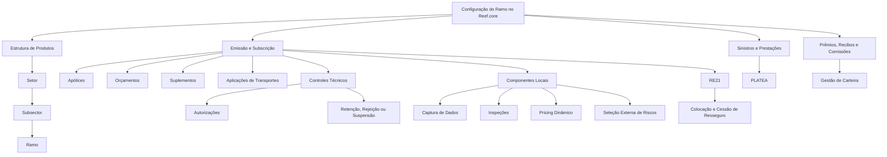
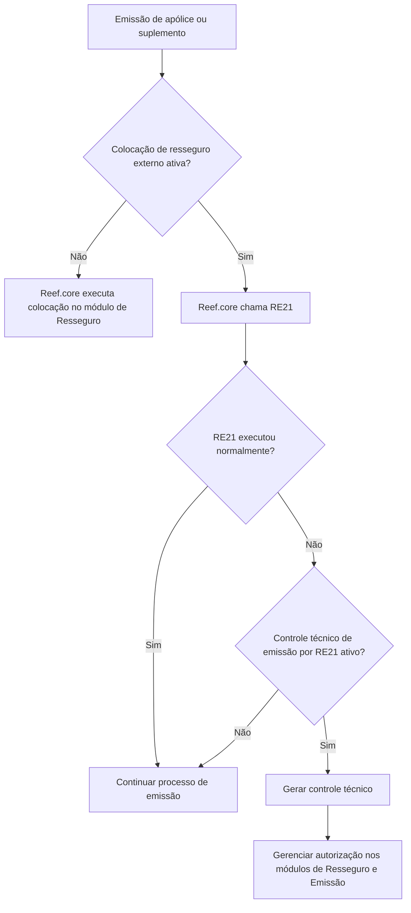

# Definição de Ramo no Reef.core — Propriedades Operacionais, Emissão, Sinistros, Prêmios, Recibos, Coasseguro e Resseguro

## 1. Metadados do Documento
- **Arquivo de Origem:** Não identificado no conteúdo extraído
- **Tipo de Documento:** Especificação Técnica / Manual Funcional
- **Domínio / Sistema:** Reef.core / MAPFRE
- **Público-Alvo:** Desenvolvedores, Arquitetos, Operação, Subscrição, Tecnologia e Processos, Negócio, Administração e Finanças
- **Data/Versão Identificada:** Não identificada

---

## 2. Resumo Executivo & Contexto de Negócio

O documento especifica o conceito de **ramo** no sistema **Reef.core**, utilizado para representar uma classificação de riscos de seguro com características homogêneas. Um ramo pode representar, por exemplo, Automóveis, Vida, Incêndios ou outros grupos de riscos semelhantes. A classificação em ramos é tratada como instrumento para estabelecer homogeneidade qualitativa dos riscos.

Para cada companhia, o Reef.core permite definir e codificar até **999 ramos**. Cada ramo possui código, descrição e abreviatura, devendo estar obrigatoriamente associado a um setor e, dentro desse setor, a um subsector da estrutura de produtos parametrizada no sistema.

A definição de ramo centraliza regras funcionais e operacionais que governam emissão de apólices, suplementos, inspeções, cálculo de prêmios, geração de recibos, comissões, sinistros, coasseguro, resseguro, antifraude, seleção de riscos e integração com soluções corporativas externas, como **RE21** e **PLATEA**.

Diversas propriedades dependem de implementação local pela área de Tecnologia e Processos da entidade MAPFRE. O Reef.core fornece pontos de extensão para chamadas a componentes ou subprogramas locais em tempo real, principalmente para captura de dados, associação de inspeções, distribuição de prêmios, cálculo de datas contábeis, seleção externa de riscos, pricing dinâmico e validações específicas.

O documento também identifica propriedades obsoletas ou descontinuadas. Essas propriedades não devem ser usadas nem reutilizadas para necessidades locais, embora continuem existentes no núcleo do sistema.

---

## 3. Arquitetura, Componentes & Tecnologias Envolvidas

### Componentes e sistemas citados

| Componente / Sistema | Papel identificado |
| :--- | :--- |
| **Reef.core** | Sistema núcleo para gestão de apólices, contratos, emissão, carteira, sinistros, resseguro, recibos, comissões e parametrização de ramos. |
| **Módulo de Emissão** | Executa emissão de apólices, orçamentos, suplementos, aplicações e controles técnicos. |
| **Módulo de Sinistros e Prestações** | Gerencia sinistros, expedientes e controles técnicos associados ao processo de sinistros. |
| **Módulo de Resseguro** | Realiza colocações e cessões de resseguro quando RE21 não é utilizado. |
| **RE21** | Solução corporativa externa chamada para resolver cessões de resseguro, usando coberturas contratadas e parametrizações de contratos, políticas, planos de colocação e regras de negócio. |
| **PLATEA** | Integração para identificação precoce de riscos potencialmente fraudulentos e prevenção de fraude em emissão e sinistros. |
| **ACO** | Área Corporativa de Operações; suas propriedades controlam dados de pessoas físicas, jurídicas e objetos segurados no processo de emissão. |
| **ITSEMAP** | Entidade citada como possível responsável pela inspeção presencial no domicílio do segurado ou localização do risco. |
| **Tesorería** | Módulo citado na lógica histórica de obtenção da data contábil padrão. |
| **Tecnologia e Processos local** | Área responsável por implementar componentes locais, nomenclaturas e associações de propriedades nos ramos. |
| **Direções de Negócio locais** | Áreas que definem critérios para lógicas de negócio locais. |
| **Administração e Finanças local** | Área responsável por diretrizes de cobrança, remessa, câmbio, aprovação de alterações cambiais e habilitação de cobranças. |



### Fluxo de emissão com resseguro externo e controles técnicos



---

## 4. Regras de Negócio, Especificações Funcionais & Processos

### Estrutura de produtos

A estrutura de produtos do Reef.core é piramidal:

1. **Setor:** nível superior da estrutura.
2. **Subsector:** nível intermediário, pertencente a um setor.
3. **Ramo:** nível inferior, associado obrigatoriamente a um único subsector.

Exemplo citado:
- Setor Vida.
- Setor Não Vida.
- Subsetores de Não Vida: Automóveis, Multirriscos, Saúde e Resto Não Vida.
- Possíveis produtos dentro de Resto Não Vida: Riscos Industriais, Roubo, Montagem e Perdas Pecuniárias.

### Propriedades operacionais comuns

- **Multirriscos:** permite contratar mais de um objeto segurado ou segurado na mesma apólice.
- **Identificador do objeto segurado:** define como objetos segurados são descritos e nomeados nas apólices. Exige lógica de negócio para obter o valor durante emissão ou subscrição, segundo critérios locais.
- **Multiperíodos:** para apólices com duração superior a um ano, registra informações econômicas separadamente por período quando ativo. Quando inativo, o registro econômico permanece em período único, independentemente da quantidade de períodos da apólice.
- **Registro de hora e minutos:** obriga captura de hora e minutos na data de efeito de apólice ou suplemento.
- **Respeitar dia de vencimento:** obriga o ramo a preservar o dia da data de vencimento.
- **Cláusulas:** permite associar cláusulas à apólice, objeto segurado ou cobertura, de forma automática ou manual. O processo local de impressão deve considerar textos e idiomas das cláusulas.
- **Anexos e anexos por objeto segurado:** permitem capturar textos livres ou textos baseados em modelos na apólice e/ou nos objetos segurados. A impressão local deve contemplar esses textos.
- **Arrastar anexos do orçamento:** transfere anexos do orçamento para a apólice emitida a partir dele.
- **Anexos multilíngues:** permite capturar modelos de anexos em qualquer idioma, independentemente do idioma configurado para o usuário emissor.
- **Emissão obrigatória de orçamento:** impede emissão de apólice se não existir orçamento prévio para o risco.
- **Reutilizar orçamento:** permite que apólices diferentes do mesmo ramo reutilizem o mesmo código de orçamento ou cotação.
- **Autorização obrigatória de orçamento:** permite usar orçamento na emissão apenas quando estiver completamente autorizado e quando houver controles técnicos de auditoria aplicáveis. Não exige que “emissão obrigatória de orçamento” também esteja ativa.
- **Apólice disponível para qualquer usuário:** permite que qualquer usuário habilitado retome uma emissão suspensa ou retida por controle técnico; quando desativada, apenas o usuário emissor original pode retomá-la.
- **Controles técnicos na anulação de suplementos:** define se controles técnicos podem ser executados em suplementos que anulam suplementos anteriores.
- **Mudança de numeração da apólice:** altera automaticamente a numeração em suplementos de renovação on-line ou batch, preservando rastreabilidade temporal.
- **Múltiplos motivos de suplemento:** por padrão o sistema exige um motivo para um suplemento; quando a propriedade é ativada, permite capturar mais de um motivo.
- **Registro de mudança de plano de pagamento:** registra a alteração como suplemento técnico de gestão de carteira, em vez de apenas modificar o financiamento dos recibos impactados.
- **Formação da modalidade:** define como coberturas e elementos associados são oferecidos ao cliente:
  - **Sem modalidade:** inicialmente oferece todas as coberturas definidas no ramo.
  - **Explícita:** as coberturas iniciais derivam da resposta a um único atributo; o contratante escolhe a modalidade conscientemente.
  - **Implícita:** as coberturas iniciais derivam de respostas a dois ou mais atributos; o contratante pode não saber que as respostas determinam a oferta.
- **Formação de imagem:** define a data usada para aplicar a versão do ramo na emissão de suplementos: data do sistema, data de efeito do suplemento ou data de efeito da apólice.

### Tratamentos especializados

- **Tratamento de emissão:** determina o comportamento do módulo de emissão.
- **Tratamento de sinistros:** define a variante do processo de sinistros e prestações.
- **Tratamento contábil:** determina a variante de gestão econômico-financeira dos elementos da apólice.
- Um ramo pode possuir tratamentos diferentes para emissão, sinistros e contabilidade.

### Inspeção e estruturas de captura

Quando uma cobertura exige inspeção visual, o sistema pode exigir associação de uma inspeção ao objeto segurado. A associação requer componente local capaz de localizar e associar códigos de inspeções nos processos de emissão, subscrição e carteira.

O Reef.core pode usar captura padrão em modo multirregistro para dados variáveis de apólice, objeto segurado e modalidade. Alternativamente, pode chamar subprogramas locais em tempo real para realizar capturas segundo critérios das Direções de Negócio.

A captura de acessórios só pode ser configurada em ramos cujo tratamento de emissão seja **Automóveis**.

A distribuição local do plano de pagamento não está descontinuada, mas é classificada como extremamente complexa e não deve ser reutilizada para propósito local.

### Transportes e Vida

Para ramos de **Transportes**:
- É possível reutilizar uma declaração prévia já convertida em aplicação.
- A emissão de aplicações pode exigir mudança automática da numeração da apólice.
- Aplicações representam declarações dos diferentes transportes ou viagens vinculadas a uma apólice marco.
- Declarações prévias funcionam como orçamentos com informação inicial parcial, complementada posteriormente para gerar a aplicação definitiva.

Para ramos de **Vida**:
- Certificados podem identificar adesões de segurados em apólices coletivas.
- Familiares de segurados em apólices coletivas devem ser capturados como tipos de terceiros do objeto segurado ou segurado principal.
- Gestão de fundos pode ser habilitada em seguros de poupança ou mistos.

### Coasseguro e resseguro

O tipo de coasseguro determina se o ramo permite coasseguro cedido, aceito, ambos ou nenhum. Coasseguro cedido significa MAPFRE como companhia líder; coasseguro aceito significa MAPFRE participando com percentual, enquanto outra companhia lidera.

O tipo de resseguro determina se MAPFRE atua diretamente perante o cliente ou como resseguradora em operação aceita por contrato ou facultativa. Quando RE21 é utilizado, o Reef.core envia dados de coberturas para que a solução externa resolva cessões conforme parametrizações externas.

### Sinistros

Nos suplementos, o sistema pode validar existência de sinistros ou expedientes pendentes na data de efeito do suplemento, bem como sinistros já terminados. A parametrização pode definir apenas aviso ou impedir emissão do suplemento.

### Prêmios e cálculos

- **Prorrata:** calcula valores proporcionalmente ao período de vigência em operações temporárias.
- **Escala:** alternativa à prorrata quando a propriedade de prorrata está desativada.
- **Alterar prorrata:** permite ao emissor escolher entre prorrata e escala em apólices temporárias.
- **Coeficiente de constituição:** pode substituir a lógica padrão do Reef.core por lógica específica do ramo.
- **Anulação de riscos:** pode aplicar às baixas de riscos as mesmas regras de anulação total da apólice.
- **29 de fevereiro:** pode ser considerado no cálculo de coeficientes.
- **Ano de 360/365 dias:** define a base anual de cálculo. Para 360 dias, todos os meses possuem 30 dias; ano bissexto não muda essa regra.
- **Prêmios manuais:** permite cálculo automático, automático ou manual, ou exclusivamente manual.
- **Taxa manual:** quando aplicável, permite capturar taxa em vez da prima anual da cobertura.
- **Alteração de câmbio:** permite modificar e validar câmbio contábil para emissão em moeda distinta da moeda local. O documento recomenda auditoria, aprovação expressa de Administração e Finanças e controle técnico quando houver diferença em relação ao câmbio oficial.
- **Pricing dinâmico:** após cálculo dos prêmios das coberturas, o Reef.core pode chamar serviço local para ajustar os valores calculados.

### Recibos, cobrança e remessa

A geração de recibos por período aplica-se quando:
1. A propriedade multiperíodos está ativa;
2. A apólice possui duração superior a um ano;
3. A propriedade de geração de recibos por período está ativa;
4. A definição do plano de pagamento é compatível.

A remessa altera o estado do recibo e registra a data da mudança de estado, colocando-o à disposição do gestor de cobrança para continuar o processo de cobrança manual ou automática definido pela entidade local.

A emissão sem recibos exige componente local que valide expressamente a situação em tempo real. A cobrança de recibos também exige componente local e validação de que o emissor/subscritor possui papel de caixa.

### Intermediários e comissões

Toda apólice deve possuir agente principal. O número máximo de intermediários permitido no ramo deve estar entre **1 e 4**.

O ramo pode permitir alteração de escritório de imputação, organizador, assessor, valores de comissões e percentuais de comissões por parcela. A alteração de percentuais de comissão apenas pode ocorrer quando a propriedade multiperíodos estiver desativada.

A regra de respeito às comissões de carteira determina:
- Sem suplemento de renovação: comissões sempre como Nova Produção.
- Com suplemento de renovação e propriedade desativada: comissões como Nova Produção.
- Com suplemento de renovação e propriedade ativada: comissões como Carteira.

### PLATEA, ACO e seleção de riscos

- **PLATEA:** pode aplicar controles antifraude no processo de emissão e/ou no processo de sinistros.
- **ACO:** pode executar controles técnicos proativos de marcas segundo tipologia, severidade e fatos a controlar.
- **Número de anos de marcas:** define quantos anos devem ser considerados nas buscas, desde que o processo proativo esteja ativo.
- **Serviço externo de seleção de riscos:** pode ser chamado no processo de emissão.
- **Lógica de negócio para seleção externa:** determina dinamicamente se o serviço externo deve ser executado.

---

## 5. Tabelas de Parâmetros, Ambientes e Estruturas de Dados

| Item / Parâmetro | Descrição / Função | Tipo / Valores / Formato | Ambiente / Observações |
| :--- | :--- | :--- | :--- |
| Código de ramo | Identifica o ramo na companhia. | Até 999 códigos por companhia. | Cada ramo possui descrição e abreviatura. |
| Associação de ramo | Vincula ramo à estrutura de produtos. | Setor e subsector obrigatórios. | Cada ramo pertence a um único subsector. |
| Multirriscos | Permite vários objetos segurados/segurados na apólice. | Ativo/Inativo. | Aplicável ao ramo. |
| Multiperíodos | Separa registro econômico por período para apólices superiores a um ano. | Ativo/Inativo. | Inativo: registro econômico em período único. |
| Formação de modalidade | Define oferta inicial de coberturas. | Sem modalidade; Explícita; Implícita. | Explícita usa um atributo; implícita usa dois ou mais. |
| Formação de imagem | Define a versão temporal do ramo para emissão/suplementos. | Data do sistema; data de efeito do suplemento; data de efeito da apólice. | Afeta emissão de suplementos após alterações do ramo. |
| Tratamento de emissão | Especializa o processo de emissão. | D, A, T, V. | D: Diversos; A: Automóvel; T: Transportes; V: Vida. |
| Tratamento de sinistros | Especializa sinistros e expedientes. | D, A, T, V. | Pode divergir do tratamento de emissão. |
| Tratamento contábil | Especializa gestão econômico-financeira. | D, A, T, V. | Pode divergir dos demais tratamentos. |
| Coasseguro permitido | Define operações de coasseguro disponíveis. | 0 Exento; 1 Só cedido; 2 Só aceito; 3 Cedido/Aceito. | MAPFRE líder em cedido; participante em aceito. |
| Resseguro permitido | Define a forma de atuação de MAPFRE. | 0 Direto; 1 Aceito contrato; 2 Aceito facultativo; 3 Cedido/Aceito. | Pode operar via RE21 ou módulo interno. |
| Prorrata | Calcula importes proporcionalmente à vigência. | Ativo/Inativo. | Inativo: usa escala. |
| Ano de cálculo | Define quantidade de dias para cálculos. | 360 ou 365 dias. | Em 360 dias, todos os meses têm 30 dias. |
| Prêmios manuais | Define modo de cálculo de prêmios. | 1 Automático; 2 Automático ou manual; 3 Manual. | Afeta coberturas e conceitos de detalhamento. |
| Taxa manual | Define captura manual de taxa ou prima anual. | Ativo/Inativo. | Requer propriedade Prêmios Manuais ativa. |
| Número máximo de agentes | Limita intermediários capturados na emissão. | Intervalo de 1 a 4. | Agente principal é obrigatório. |
| Geração de recibos por período | Gera recibos por cada período de apólice plurianual. | Ativo/Inativo. | Aplicável a planos de pagamento, não a formas de pagamento. |
| Remessa de recibos | Coloca recibos a cobrar quando suas datas forem menores ou iguais à data do sistema. | Ativo/Inativo. | Pode exigir componente local para lógica adicional. |
| PLATEA emissão | Aplica controles antifraude na emissão. | Ativo/Inativo. | Integração Reef.core–PLATEA. |
| PLATEA sinistros | Aplica controles antifraude em sinistros. | Ativo/Inativo. | Integração Reef.core–PLATEA. |
| Processo proativo de marcas | Executa controles técnicos relativos a marcas. | Ativo/Inativo. | Propriedade associada ao ACO. |
| Anos para marcas | Período de busca de fatos a controlar. | Número de anos. | Válido somente com processo proativo ativo. |
| Inabilitação | Bloqueia contratação de nova produção. | Ativo/Inativo. | Permite suplementos sobre apólices contratadas antes da inabilitação. |

### Propriedades explicitamente obsoletas ou descontinuadas

| Propriedade | Situação | Observação |
| :--- | :--- | :--- |
| Número máximo de riscos para emissão on-line | Obsoleta | Não deve ser usada ou reutilizada. |
| Número máximo de riscos para impressão on-line | Não recomendada para reutilização | Não deve ser usada para finalidade local. |
| Distribuição local do plano de pagamento | Não descontinuada, porém extremamente complexa | Não deve ser reutilizada para finalidade local. |
| Calcular fracionamento de pagamento | Descontinuada e obsoleta | Substituída pelo cálculo de juros nos recibos conforme planos de pagamento. |
| Distribuir comissões proporcionalmente | Descontinuada | Relacionada à obsolescência das formas de pagamento. |
| Regenerar suplementos retroativos | Descontinuada e obsoleta | Não deve ser usada nem reutilizada. |
| Data contábil padrão | Descontinuada e obsoleta | Não deve ser usada nem reutilizada. |

---

## 6. Bateria de Perguntas & Respostas para RAG (FAQ Sintético)

### P1: O que é um ramo no Reef.core?
**R:** Um ramo é uma classificação de riscos de seguro com características homogêneas, como Vida, Automóveis ou Incêndios. No Reef.core, cada ramo é identificado por código, descrição e abreviatura, podendo existir até 999 códigos de ramos por companhia. Todo ramo deve estar associado obrigatoriamente a um setor e a um subsector da estrutura de produtos.

### P2: Quando a propriedade Multiperíodos deve ser utilizada?
**R:** A propriedade Multiperíodos deve ser ativada quando apólices com duração superior a um ano precisarem registrar informação econômica separadamente para cada período. Quando a propriedade está desativada, o Reef.core registra a informação econômica em um único período, mesmo que a apólice tenha vários períodos de duração.

### P3: Qual é a diferença entre formação de modalidade explícita e implícita?
**R:** Na modalidade explícita, as coberturas inicialmente oferecidas são determinadas pela resposta a um único atributo, e a pessoa contratante escolhe conscientemente a oferta comercial. Na modalidade implícita, a oferta é determinada por respostas a dois ou mais atributos e a pessoa contratante pode não saber que essas respostas definem as coberturas e demais elementos oferecidos.

### P4: Quais tratamentos de emissão existem no Reef.core?
**R:** O documento identifica quatro tratamentos: Diversos (D), Automóvel (A), Transportes (T) e Vida (V). Diversos representa o comportamento padrão; Automóvel incorpora acessórios não incluídos na versão padrão de veículo; Transportes suporta apólices fixas, flutuantes e declarações de altas, baixas e modificações de risco; Vida inclui modalidades, suplementos específicos, resgates e questionários.

### P5: Um ramo pode ter tratamentos diferentes para emissão, sinistros e contabilidade?
**R:** Sim. O Reef.core permite que o mesmo ramo possua tipologias distintas para tratamento de emissão, tratamento de sinistros e tratamento contábil. O documento exemplifica um ramo com emissão de Diversos, sinistros de Automóveis e contabilidade de Transportes.

### P6: Como funciona a colocação de resseguro por meio do RE21?
**R:** Quando a propriedade de colocação de resseguro em sistema externo está ativada, o Reef.core chama a solução corporativa RE21 para resolver cessões de resseguro com base nas coberturas contratadas e na parametrização de contratos, políticas, planos de colocação e regras de negócio existente no RE21. Quando a propriedade está desativada, as colocações e cessões são realizadas pelo módulo de Resseguro do Reef.core.

### P7: O que ocorre se o RE21 falhar durante a colocação de resseguro?
**R:** Caso a colocação externa esteja ativada e o processo no RE21 não seja executado ou termine anormalmente, a propriedade de controle técnico de emissão por colocação externa pode gerar controles técnicos no processo de emissão. Esses controles devem ser tratados nos programas de autorizações dos módulos de Resseguro e Emissão do Reef.core.

### P8: Como o Reef.core calcula taxas de cobertura?
**R:** Segundo a seção de perguntas frequentes do documento, a taxa é sempre obtida pela relação entre capital e prima anual da cobertura: **Capital / Prima Anual da Cobertura**.

### P9: Como funciona a remessa de recibos no Reef.core?
**R:** A remessa é o processo pelo qual o Reef.core altera parte da informação do recibo, especificamente seu estado e a data da mudança de estado, colocando o recibo à disposição do gestor de cobrança. A partir desse ponto, o fluxo de cobrança definido pela entidade MAPFRE local pode continuar de modo manual ou automático.

### P10: Em quais condições o emissor pode modificar recibos manualmente?
**R:** A modificação manual de recibos depende da ativação da propriedade correspondente no ramo e dos privilégios concedidos ao papel do usuário subscritor/emissor. O usuário pode modificar datas de efeito e importes dos recibos gerados, e o Reef.core valida automaticamente a coerência das mudanças.

### P11: Como funciona o coasseguro cedido e aceito?
**R:** No coasseguro cedido, MAPFRE atua como companhia líder. No coasseguro aceito, MAPFRE participa em determinado percentual enquanto outra companhia lidera o seguro. O ramo pode ser configurado como isento, somente cedido, somente aceito ou cedido/aceito.

### P12: O que é uma declaração prévia em ramos de Transportes?
**R:** Uma declaração prévia é uma comunicação inicial do segurado sobre um transporte ou viagem, contendo apenas parte das informações antes da realização da viagem. No Reef.core, é capturada como orçamento e, após receber os dados complementares, é utilizada para emitir a declaração definitiva ou aplicação.

---

## 7. Glossário de Termos, Siglas & Conceitos-Chave

- **ACO:** Área Corporativa de Operações; solicita propriedades para controlar dados de pessoas e objetos segurados no processo de emissão.
- **Aplicação:** Em ramos de Transportes, declaração de viagem associada a uma apólice marco.
- **Cobertura:** Elemento contratual do seguro cuja contratação pode gerar prêmios, inspeções e outros efeitos operacionais.
- **Coasseguro aceito:** Operação em que MAPFRE participa com percentual do risco, sob liderança de outra companhia.
- **Coasseguro cedido:** Operação em que MAPFRE atua como companhia líder.
- **Controle técnico:** Resultado de regra de negócio que pode reter, exigir autorização, rejeitar ou suspender um movimento.
- **Emissão:** Processo de criação ou formalização de apólices, suplementos, aplicações ou outros movimentos no Reef.core.
- **ITSEMAP:** Entidade citada como possível responsável por realizar inspeção no domicílio do segurado ou na localização do risco.
- **PLATEA:** Solução integrada ao Reef.core para controles antifraude em emissão e sinistros.
- **Prorrata temporis:** Cálculo proporcional de importes conforme período de vigência.
- **RE21:** Solução corporativa externa de resseguro utilizada para resolver cessões de resseguro.
- **Ramo:** Conjunto de características de seguro relativas a riscos de propriedades ou natureza semelhantes.
- **Remessa:** Alteração do estado de recibo que o disponibiliza ao gestor de cobrança.
- **Suplemento:** Movimento posterior relacionado à apólice, como renovação, alteração, anulação ou mudança de agente.
- **Tomador:** Pessoa ou entidade associada à contratação da apólice.
- **Usuário emissor:** Usuário que realiza operações de emissão no Reef.core.

---

## 8. Notas Críticas, Riscos & Limitações

- O documento não identifica nome de arquivo, versão, data de publicação ou responsável formal além da referência visual a `user:agonzalez_mapfre.com`.
- Diversas propriedades dependem de componentes de software desenvolvidos localmente pela Direção de Tecnologia e Processos da entidade MAPFRE local.
- A ativação de propriedades relacionadas a impressão, captura de estruturas, inspeção, seleção externa de riscos, pricing dinâmico, datas contábeis e distribuição de prêmios exige definição local de nomenclatura, implementação e associação no ramo.
- Alterações de câmbio devem ser auditadas e aprovadas expressamente por Administração e Finanças; o documento recomenda controle técnico quando o câmbio divergir do câmbio oficial carregado no sistema.
- O uso de emissão sem recibos, cobrança de recibos e associação ou dispensa de inspeções exige validações por componentes locais.
- As propriedades obsoletas ou descontinuadas não devem ser reutilizadas para propósitos locais.
- A propriedade de distribuição local do plano de pagamento não está formalmente descontinuada, mas o documento afirma que é extremamente complexa e que não deve ser reutilizada localmente.
- O documento não detalha contratos HTTP, payloads, endpoints, protocolos, autenticação ou tratamento técnico de erros da integração entre Reef.core e RE21.
- **Nota de Análise:** O documento menciona serviços externos, subprogramas e componentes locais, mas não especifica interfaces técnicas, tecnologias de implementação, métodos de integração ou contratos de dados.

---

## 9. Conteúdo Bruto Estruturado (Referência Fiel)

```text
--- [PÁGINA 1 DE 19] ---

DEFINICIÓN de Ramo
Objetivo
Fijar un conjunto de características divididas en una serie de conceptos de seguro relativas a riesgos de propiedades o naturaleza semejantes. En este sentido se habla de ramo de vida, ramo de automóviles, ramo de incendios, etc. La clasificación de los riesgos en ramos es un instrumento fundamental para establecer la homogeneidad cualitativa de los mismos.

Propiedades generales
Propiedades operativas comunes
Propiedades operativas por tipo de tratamiento
Propiedades relacionadas con el coaseguro y reaseguro
Propiedades relacionadas con siniestros
Propiedades operativas relacionadas con el cálculo de las primas
Propiedades operativas relacionadas con la generación de los recibos
Propiedades operativas relacionadas con intermediarios y comisiones
Propiedades relacionadas con PLATEA
Propiedades relacionadas con ACO
Otras propiedades de los ramos

Ramo
El sistema permite definir y codificar por cada compañía hasta 999 códigos de ramos diferentes, pudiendo denominar e identificar individualmente cada uno de ellos mediante una descripción y una abreviatura.

Ejemplos:
Ramo 121 -- 'Automóviles' -- 'AUT'.
Ramo 317 -- 'Boiler & Machinery' -- 'B&M'.
Ramo 416 -- 'Vida Ahorro - Unit Linked'.

Todos los ramos definidos deben estar obligatoriamente asociados a uno de los sectores definidos y, dentro de ellos, a uno de sus subsectores.

--- [PÁGINAS 2 A 19] ---

A extração literal completa das páginas 2 a 19 foi fornecida como conteúdo de origem desta análise e compreende, sem acréscimos factuais:

- Propriedades operativas comuns: multirriscos, identificador do objeto segurado, multiperíodos, captura de hora/minutos, respeito ao dia de vencimento, cláusulas, anexos, orçamento, controles técnicos, numeração de apólice, motivos de suplemento, modalidade e formação de imagem.
- Tratamentos de emissão, sinistros e contabilidade: Diversos, Automóvel, Transportes e Vida.
- Processos de impressão, inspeção, captura de dados, acessórios, distribuição de plano de pagamento, certificados, fundos e aplicações.
- Propriedades de coasseguro, resseguro, integração RE21 e controles técnicos associados.
- Validações de sinistros pendentes e terminados em suplementos.
- Regras de prorrata, escala, coeficientes, ano de 360/365 dias, prêmios manuais, taxa manual, câmbio, importes totais, cálculos batch e pricing dinâmico.
- Geração, alteração, remessa, emissão e cobrança de recibos.
- Intermediários, escritório de imputação, organizador, assessor e comissões.
- Controles antifraude PLATEA e processo proativo de marcas ACO.
- Inabilitação de ramo, seleção externa de riscos, datas contábeis, estrutura de produtos, remessa, fórmula de taxa, inspeções e declarações prévias.
```
