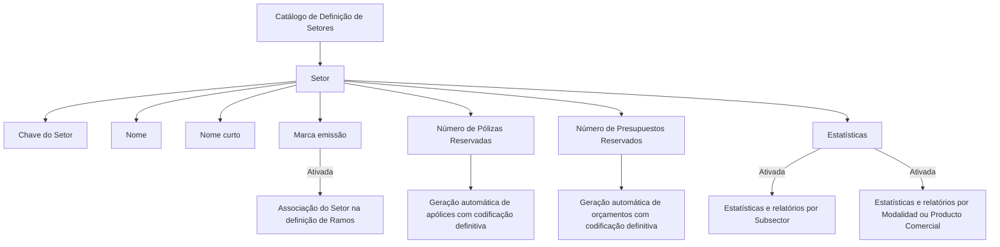

# Definição de Setores no Sistema Reef — Catálogo, Propriedades Operacionais e Reserva de Numeração

## 1. Metadados do Documento
- **Arquivo de Origem:** `Não identificado no conteúdo fornecido`
- **Tipo de Documento:** `Especificação Técnica / Documentação Funcional`
- **Domínio / Sistema:** `Reef / Mapfre — configuração de Setores para Ramos de seguros`
- **Público-Alvo:** `Analistas funcionais, configuradores do sistema, operação, negócio e responsáveis por estatísticas`
- **Data/Versão Identificada:** `Não identificada`
- **Lifecycle identificado:** `Approved`

---

## 2. Resumo Executivo & Contexto de Negócio

O documento define o conceito de **Setor** no sistema Reef como uma chave de agrupamento ou classificação de **Ramos** que possuem características técnicas similares. O objetivo da configuração de Setores é permitir uma análise estruturada dos Ramos da entidade e da composição da carteira de apólices que os integram.

A classificação por Setor pode atender tanto a finalidades internas quanto externas. O conteúdo indica que Setores são relevantes para a organização da carteira, para a emissão e associação de Ramos e para a geração de informações estatísticas e relatórios.

O catálogo de definição de Setores possui propriedades gerais, como a chave identificadora, o nome e o nome curto. Também contém propriedades operacionais que controlam a possibilidade de utilizar o Setor na definição de Ramos, a reserva automática de numeração para apólices e orçamentos e o nível de obtenção de estatísticas.

O documento recomenda que a codificação de chaves de Setor siga normas, usos e procedimentos da associação ou entidade que represente localmente a indústria seguradora, especialmente quando houver obrigação de fornecer informações estatísticas de forma recorrente.

---

## 3. Arquitetura, Componentes & Tecnologias Envolvidas

Os componentes e conceitos explicitamente citados são:

- **Reef:** sistema ou domínio de documentação no qual o catálogo de Setores é configurado.
- **Catálogo de Definição de Setores:** catálogo que contém as propriedades de configuração de cada Setor.
- **Setor:** chave de agrupamento ou classificação de Ramos com características técnicas semelhantes.
- **Ramo:** entidade que pode ser associada a um Setor quando a propriedade de emissão estiver ativada.
- **Subsector:** possível nível para obtenção de estatísticas e relatórios.
- **Modalidad ou Producto Comercial:** alternativa de nível para obtenção de estatísticas e relatórios.
- **Pólizas:** apólices cuja numeração definitiva pode ser gerada automaticamente mediante reserva.
- **Presupuestos:** orçamentos cuja numeração definitiva pode ser gerada automaticamente mediante reserva.
- **Mapfredocument:** elemento identificado no conteúdo de navegação/documentação.
- **Documentación Reef:** área ou referência documental identificada no texto.
- **Zeus, APIs, Componentes e Cloud:** termos presentes na navegação da página, sem detalhamento funcional ou arquitetural no conteúdo fornecido.



> **Nota de Análise:** O documento não descreve integrações técnicas, APIs, métodos HTTP, contratos JSON, infraestrutura, bancos de dados, autenticação ou tecnologias de implementação do sistema Reef.

---

## 4. Regras de Negócio, Especificações Funcionais & Processos

### 4.1 Definição funcional de Setor

Um **Setor** é uma chave de agrupamento ou classificação de Ramos que apresentam características técnicas similares. A estruturação por Setor permite:

1. Realizar análise estruturada dos Ramos da entidade.
2. Estudar a composição da carteira de apólices formada pelos Ramos.
3. Utilizar a classificação para finalidades internas.
4. Utilizar a classificação para finalidades externas.

### 4.2 Propriedades gerais do Setor

Cada Setor possui uma chave que o identifica no sistema e uma denominação ou descrição associada. O documento apresenta exemplos de Setores codificados:

- Setor `1`: Automóviles.
- Setor `2`: Vida.
- Setor `3`: Salud.
- Setor `4`: Generales.

### 4.3 Nome curto

A propriedade **Nombre corto** contém a denominação ou descrição abreviada do Setor definido.

### 4.4 Marca de emissão

A propriedade **Marca emisión** controla a associação de um Setor à definição de Ramos:

- Quando a propriedade está ativada no Catálogo de Definição, o sistema estabelece que a chave do Setor pode ser utilizada e associada na definição dos Ramos.
- O documento não descreve o comportamento do sistema quando a propriedade **Marca emisión** está desativada.

### 4.5 Reserva de numeração de apólices

O atributo **Número de Pólizas Reservadas** estabelece o número de apólices que são geradas automaticamente no sistema com sua codificação definitiva.

O documento não informa:

- O formato da codificação definitiva.
- A sequência de numeração.
- A regra de reinicialização de numeração.
- A validação de duplicidade.
- Os eventos que disparam a geração automática.

### 4.6 Reserva de numeração de orçamentos

O atributo **Número de Presupuestos Reservados** estabelece o número de orçamentos que são gerados automaticamente no sistema com sua codificação definitiva.

O documento não informa:

- O formato da codificação definitiva dos orçamentos.
- A relação entre a reserva de números de orçamentos e a reserva de números de apólices.
- A regra de consumo, expiração ou reutilização de números reservados.

### 4.7 Estatísticas e relatórios

A propriedade **Estadísticas** define o nível de obtenção de estatísticas e relatórios:

- Quando a propriedade está ativada no Catálogo de Definição, as estatísticas e os relatórios devem ser obtidos por **Subsector**; ou
- As estatísticas e os relatórios devem ser obtidos por **Modalidad ou Producto Comercial**.

O documento não especifica o critério que determina a escolha entre Subsector e Modalidad/Producto Comercial.

### 4.8 Diretriz de codificação local

A recomendação operacional apresentada é codificar as chaves de Setor de acordo com:

1. Normas locais.
2. Usos locais.
3. Procedimentos da associação ou entidade que representa localmente a indústria seguradora.
4. Necessidades de fornecimento regular de informação estatística à associação ou entidade correspondente.

### 4.9 Documentos e configurações vinculadas

O documento recomenda a leitura dos seguintes temas para evitar interpretação isolada e incorreta da definição de Setores:

1. Configuración de Subsectores.
2. Configuración de Ramos/Productos.
3. Numeración y Reserva de Pólizas.
4. Numeración y Reserva de Presupuestos.

---

## 5. Tabelas de Parâmetros, Ambientes e Estruturas de Dados

| Item / Parâmetro | Descrição / Função | Tipo / Valores / Formato | Ambiente / Observações |
| :--- | :--- | :--- | :--- |
| Setor | Chave de agrupamento ou classificação de Ramos com características técnicas similares. | Chave de classificação. | Utilizado para análise de Ramos e composição da carteira de apólices. |
| Sector | Propriedade que identifica a chave do Setor configurado no sistema. | Não detalhado. | Propriedade geral. |
| Nombre | Denominação ou descrição do Setor. | Texto. | Propriedade geral. |
| Nombre corto | Denominação ou descrição abreviada do Setor definido. | Texto abreviado. | Propriedade operativa. |
| Marca emisión | Permite utilizar e associar a chave do Setor na definição dos Ramos quando ativada. | Propriedade ativada/desativada; valores não detalhados. | Configurada no Catálogo de Definição. |
| Número de Pólizas Reservadas | Estabelece o número de apólices geradas automaticamente com codificação definitiva. | Número; formato não detalhado. | Configurado no catálogo de definição de Setores. |
| Número de Presupuestos Reservados | Estabelece o número de orçamentos gerados automaticamente com codificação definitiva. | Número; formato não detalhado. | Configurado no catálogo de definição de Setores. |
| Estadísticas | Define a obtenção de estatísticas e relatórios por Subsector ou por Modalidad/Producto Comercial quando ativada. | Propriedade ativada/desativada; critérios não detalhados. | Configurada no Catálogo de Definição. |
| Setor 1 | Automóviles. | Código `1`. | Exemplo apresentado no documento. |
| Setor 2 | Vida. | Código `2`. | Exemplo apresentado no documento. |
| Setor 3 | Salud. | Código `3`. | Exemplo apresentado no documento. |
| Setor 4 | Generales. | Código `4`. | Exemplo apresentado no documento. |
| Lifecycle | Estado documental identificado como Approved. | `Approved`. | Metadado exibido no conteúdo. |
| Owner | Proprietário identificado no conteúdo. | `user:agonzalez_mapfre.com`. | Metadado exibido no conteúdo. |

---

## 6. Bateria de Perguntas & Respostas para RAG (FAQ Sintético)

### P1: O que é um Setor no sistema Reef?
**R:** Um Setor é uma chave de agrupamento ou classificação de Ramos com características técnicas similares. A finalidade é permitir uma análise estruturada dos Ramos da entidade e o estudo da composição da carteira de apólices formada por esses Ramos, para usos internos e/ou externos.

### P2: Quais propriedades gerais existem na definição de um Setor?
**R:** As propriedades gerais identificadas no documento são a propriedade **Sector**, que identifica a chave do Setor configurado no sistema, e a propriedade **Nombre**, que contém a denominação ou descrição do Setor.

### P3: Para que serve a propriedade Nombre corto de um Setor?
**R:** A propriedade **Nombre corto** contém a denominação ou descrição abreviada do Setor definido. O documento não especifica tamanho máximo, obrigatoriedade ou regras de validação para esse campo.

### P4: Qual é o efeito de ativar a Marca emisión no Catálogo de Definição?
**R:** Quando a propriedade **Marca emisión** está ativada no Catálogo de Definição, o sistema permite que a chave do Setor seja utilizada e associada na definição dos Ramos.

### P5: O que define o parâmetro Número de Pólizas Reservadas?
**R:** O atributo **Número de Pólizas Reservadas** estabelece o número de apólices que são geradas automaticamente pelo sistema com sua codificação definitiva. O documento não detalha o formato dessa codificação nem a regra de sequência numérica.

### P6: O que define o parâmetro Número de Presupuestos Reservados?
**R:** O atributo **Número de Presupuestos Reservados** estabelece o número de orçamentos que são gerados automaticamente no sistema com sua codificação definitiva. O conteúdo não detalha o formato, o ciclo de vida ou a reutilização de numerações reservadas.

### P7: Como a propriedade Estadísticas influencia relatórios no sistema?
**R:** Quando a propriedade **Estadísticas** está ativada no Catálogo de Definição, a obtenção de estatísticas e relatórios deve ocorrer por Subsector ou por Modalidad/Producto Comercial. O documento não informa como o sistema escolhe entre esses dois níveis de agrupamento.

### P8: Quais exemplos de Setores são apresentados no documento?
**R:** O documento apresenta quatro exemplos: código `1` para Automóviles, código `2` para Vida, código `3` para Salud e código `4` para Generales.

### P9: Como deve ser definida a codificação local das chaves de Setor?
**R:** A recomendação é codificar as chaves conforme normas, usos e procedimentos da associação ou entidade que representa localmente a indústria seguradora, especialmente quando essa entidade precisa receber informações estatísticas regularmente.

### P10: Quais documentos relacionados devem ser consultados antes de interpretar isoladamente a definição de Setores?
**R:** O documento recomenda consultar Configuración de Subsectores, Configuración de Ramos/Productos, Numeración y Reserva de Pólizas e Numeración y Reserva de Presupuestos, pois a interpretação isolada do material pode levar a erros.

---

## 7. Glossário de Termos, Siglas & Conceitos-Chave

- **Reef:** Sistema ou contexto documental no qual é configurado o catálogo de definição de Setores.
- **Setor / Sector:** Chave de agrupamento ou classificação de Ramos com características técnicas similares.
- **Ramo / Ramos:** Entidade que pode ser associada a uma chave de Setor quando a propriedade Marca emisión está ativada.
- **Subsector:** Nível de agrupamento que pode ser utilizado para obtenção de estatísticas e relatórios.
- **Modalidad:** Nível alternativo citado para obtenção de estatísticas e relatórios.
- **Producto Comercial:** Produto comercial, citado como alternativa de nível para estatísticas e relatórios.
- **Póliza:** Apólice; entidade para a qual o sistema pode gerar numeração automática com codificação definitiva.
- **Presupuesto:** Orçamento; entidade para a qual o sistema pode gerar numeração automática com codificação definitiva.
- **Marca emisión:** Propriedade que, quando ativada, permite empregar e associar a chave do Setor na definição dos Ramos.
- **Catálogo de Definição:** Catálogo no qual são configuradas as propriedades de Setores.
- **Mapfredocument:** Termo exibido na área de documentação; o documento não fornece definição adicional.
- **Lifecycle Approved:** Estado de ciclo de vida documental identificado como aprovado.

---

## 8. Notas Críticas, Riscos & Limitações

- O documento não identifica o arquivo de origem, data de publicação, versão ou histórico de alterações.
- Não há detalhamento de implementação técnica, APIs, serviços, banco de dados, autenticação, infraestrutura ou ambientes.
- A propriedade **Marca emisión** é descrita somente para o estado ativado; o comportamento para o estado desativado não é informado.
- As propriedades **Número de Pólizas Reservadas** e **Número de Presupuestos Reservados** não possuem formato, limites, regras de consumo, validação ou critérios de sequenciamento detalhados.
- A propriedade **Estadísticas** cita Subsector e Modalidad/Producto Comercial, mas não define a regra de seleção entre essas alternativas.
- O conteúdo recomenda consultar documentos funcionais relacionados; portanto, a configuração de Setores não deve ser interpretada isoladamente.
- A codificação inadequada de Setores pode prejudicar a consistência das informações estatísticas fornecidas a associações ou entidades da indústria seguradora.
- O texto extraído contém caracteres de codificação corrompidos em palavras como `clasicación`, `congurando` e `codicación`; a interpretação semântica foi preservada sem acrescentar fatos ausentes.

---

## 9. Conteúdo Bruto Estruturado (Referência Fiel)

```text
--- [PÁGINA 1 DE 2] ---

DEFINICIÓN de Sectores
Objetivo
Un Sector es una clave de agrupación o clasicación de Ramos con características técnicas similares que permite realizar de una manera
estructurada el análisis de los Ramos de la entidad y el estudio de la composición de la Cartera de las pólizas que los conforman, sea este
para un uso interno y/o externo.
Propiedades Generales
Propiedades Operativas
Propiedades Generales
Sector
Esta propiedad identica la clave del Sector que se está congurando en el Sistema.
Nombre
Esta propiedad contendrá la denominación o descripción del Sector.
SECTOR NOMBRE
1 Automóviles
2 Vida
3 Salud
4 Generales
Propiedades Operativas
Nombre corto
Esta propiedad contiene la denominación o descripción abreviada del Sector denido.
Marca emisión
Si esta propiedad está activada en el Catálogo de Denición, el Sistema establecerá que la clave del Sector se puede emplear y asociar en la
denición de los Ramos.
Documentation / DOCUMENTACIÓN Reef
DOCUMENTACIÓN Reef
Mapfredocument
DOCUMENTACIÓN Reef
Owner
user:agonzalez_mapfre.com
Lifecycle
Approved Source
 / 
 VL
Buscar Inicio Soluciones Arquitecturas APIs Componentes Cloud Documentación Zeus Reef Ayuda
ES


--- [PÁGINA 2 DE 2] ---

Número de Pólizas Reservadas
Este Atributo del catálogo de denición de los Sectores, establece el número de pólizas que se generan automáticamente en el sistema con
su codicación denitiva.
Número de Presupuestos Reservados
Este Atributo del catálogo de denición de los Sectores, establece el número de presupuestos que se generan automáticamente en el
sistema con su codicación denitiva.
Estadísticas
Si esta propiedad está activada en el Catálogo de Denición, el Sistema establecerá que la obtención de las estadísticas y reportes deben
realizarse o bien por subsector o bien por Modalidad o Producto Comercial.
Vínculos
Relación de Directrices y Documentos funcionales cuya lectura recomendada para evitar que la interpretación aislada del presente
documento pueda conducir a error.
Conguración de Subsectores
Conguración de Ramos/Productos
Numeración y Reserva de Pólizas
Numeración y Reserva de Presupuestos
Preguntas frecuentes
(1) ¿Existe alguna recomendación operativa que deba ser tomada en consideración localmente en la codicación, uso y denición del
catálogo de Sectores en el Sistema?
Lo más habitual es codicar sus claves de acuerdo con las normas, usos y procedimientos de la Asociación o entidad que represente
localmente la industria aseguradora y a la que haya que proveer regularmente de información estadística.
```
