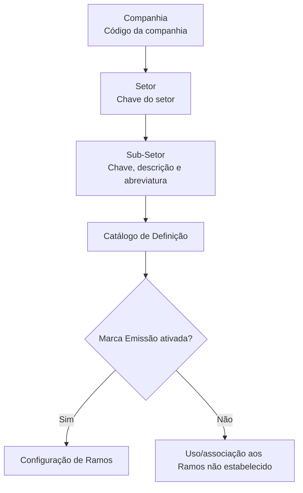

# Definição de Sub-Sectores no Catálogo Reef

## 1. Metadados do Documento
- **Arquivo de Origem:** Não identificado no conteúdo fornecido
- **Tipo de Documento:** Especificação Técnica
- **Domínio / Sistema:** Reef / Catálogo de Sub-Sectores / Setor de Seguros
- **Público-Alvo:** Configuração funcional, negócio segurador e operação do catálogo
- **Data/Versão Identificada:** Não identificada

---

## 2. Resumo Executivo & Contexto de Negócio

O documento define o conceito de **Sub-Setor** no sistema Reef. Um Sub-Setor é uma agrupação ou classificação de Ramos de seguros com características técnicas semelhantes, constituindo um subconjunto dos Ramos pertencentes a determinado Setor de Seguros.

A especificação descreve propriedades gerais usadas para identificar e cadastrar um Sub-Setor: Companhia, Setor, chave do Sub-Setor, descrição e descrição abreviada. Esses atributos estruturam o catálogo e estabelecem a relação hierárquica entre Companhia, Setor e Sub-Setor.

O documento também descreve a propriedade operacional **Marca Emissão**. Quando ativada no Catálogo de Definição, a Marca Emissão determina que a chave do Sub-Setor pode ser utilizada e associada à configuração dos Ramos.

Como recomendação de governança local, as chaves de Sub-Setores devem normalmente ser codificadas conforme normas, usos e procedimentos da associação ou entidade que representa localmente a indústria seguradora, especialmente quando há obrigação de fornecer informações estatísticas nesse nível de detalhe.

---

## 3. Arquitetura, Componentes & Tecnologias Envolvidas

Os componentes e conceitos explicitamente citados são:

- **Reef:** sistema/documentação no qual a definição de Sub-Setores está publicada.
- **Catálogo de Definição:** catálogo no qual a propriedade Marca Emissão pode ser ativada.
- **Companhia:** código da companhia para a qual o Sub-Setor é definido.
- **Setor:** entidade à qual o Sub-Setor está associado e da qual depende.
- **Sub-Setor:** classificação de Ramos com características técnicas similares.
- **Ramos:** elementos que podem ser associados ao Sub-Setor quando a Marca Emissão estiver ativada.
- **Configuração de Ramos/Produtos:** documento vinculado e contexto de uso dos Sub-Setores.
- **Definição de Setores:** documento vinculado para entendimento da estrutura superior do Sub-Setor.



> **Nota de Análise:** O documento não descreve tecnologias de implementação, banco de dados, APIs, métodos HTTP, contratos JSON, integrações ou ambientes técnicos.

---

## 4. Regras de Negócio, Especificações Funcionais & Processos

### Definição funcional de Sub-Setor

1. Um **Sub-Setor** é uma agrupação ou classificação de Ramos.
2. Os Ramos agrupados em um Sub-Setor devem possuir características técnicas similares.
3. Um Sub-Setor representa um subconjunto da totalidade dos Ramos que compõem o Setor de Seguros ao qual pertence.
4. Todo Sub-Setor depende de um Setor identificado por chave.
5. O cadastro do Sub-Setor é realizado para uma Companhia identificada por código.

### Propriedades gerais

1. **Companhia:** contém o código da companhia para a qual o Sub-Setor está sendo definido.
2. **Setor:** identifica a chave do Setor ao qual o Sub-Setor está associado e do qual depende.
3. **Sub-Setor:** identifica, no sistema, a chave do Sub-Setor.
4. **Descrição do Sub-Setor:** contém a denominação ou descrição do Sub-Setor configurado no catálogo.
5. **Descrição Abreviada do Sub-Setor:** contém a denominação ou descrição abreviada da chave do Sub-Setor.

### Propriedade operacional: Marca Emissão

1. A **Marca Emissão** é configurada no Catálogo de Definição.
2. Quando a Marca Emissão está ativada, o sistema estabelece que a chave do Sub-Setor pode ser utilizada e associada na configuração dos Ramos.
3. O documento registra a seguinte restrição: **somente pode existir um registro com esta marca inativa**.
4. O documento não detalha o escopo da unicidade do registro com Marca Emissão inativa, nem descreve como a validação é implementada.

### Recomendação para codificação local

1. A recomendação é codificar as chaves de Sub-Setores conforme normas, usos e procedimentos da associação ou entidade que representa localmente a indústria seguradora.
2. A recomendação é especialmente aplicável quando a organização deve fornecer regularmente informação estatística com esse nível de detalhe.
3. O documento não especifica um padrão universal de formato, comprimento ou composição da chave do Sub-Setor.

---

## 5. Tabelas de Parâmetros, Ambientes e Estruturas de Dados

| Item / Parâmetro | Descrição / Função | Tipo / Valores / Formato | Ambiente / Observações |
| :--- | :--- | :--- | :--- |
| Companhia | Código da companhia para a qual o Sub-Setor é definido. | Código; formato não detalhado. | Propriedade geral. |
| Setor | Chave do Setor ao qual o Sub-Setor está associado e do qual depende. | Chave; formato não detalhado. | Propriedade geral. |
| Sub-Setor | Chave que identifica o Sub-Setor no sistema. | Chave; exemplos numéricos com quatro dígitos. | Propriedade geral. |
| Descrição do Sub-Setor | Denominação ou descrição do Sub-Setor configurado no catálogo. | Texto. | Propriedade geral. |
| Descrição Abreviada do Sub-Setor | Denominação ou descrição abreviada da chave do Sub-Setor. | Texto abreviado. | Propriedade geral. |
| Marca Emissão | Determina se a chave do Sub-Setor pode ser utilizada e associada na configuração dos Ramos. | Ativada ou inativa. | Propriedade operativa do Catálogo de Definição. |
| Restrição da Marca Emissão | Somente pode existir um registro com a Marca Emissão inativa. | Regra de unicidade; escopo não detalhado. | Propriedade operativa. |
| Sub-Setor `0001` | Accidentes. | Abreviatura: `Acc.` | Exemplo associado ao Setor Resto Ramos No Vida. |
| Sub-Setor `0002` | Incendios. | Abreviatura: `Inc.` | Exemplo associado ao Setor Resto Ramos No Vida. |
| Sub-Setor `0003` | Otros Daños a los Bienes. | Abreviatura: `Otros` | Exemplo associado ao Setor Resto Ramos No Vida. |
| Sub-Setor `0004` | Multi-riesgos. | Abreviatura: `Mult.` | Exemplo associado ao Setor Resto Ramos No Vida. |
| Definición de Sectores | Documento funcional relacionado. | Referência documental. | Leitura recomendada. |
| Configuración de Ramos/Productos | Documento funcional relacionado. | Referência documental. | Leitura recomendada. |

---

## 6. Bateria de Perguntas & Respostas para RAG (FAQ Sintético)

### P1: O que é um Sub-Setor no sistema Reef?
**R:** Um Sub-Setor é uma agrupação ou classificação de Ramos com características técnicas similares. Um Sub-Setor constitui um subconjunto dos Ramos que compõem o Setor de Seguros ao qual o Sub-Setor pertence.

### P2: Qual é a relação entre Setor e Sub-Setor?
**R:** O Sub-Setor está associado a um Setor e depende desse Setor. A propriedade Setor identifica a chave do Setor ao qual o Sub-Setor está relacionado.

### P3: Quais propriedades gerais devem existir na definição de um Sub-Setor?
**R:** A definição de um Sub-Setor possui as propriedades Companhia, Setor, Sub-Setor, Descrição do Sub-Setor e Descrição Abreviada do Sub-Setor.

### P4: O que representa a propriedade Companhia no catálogo de Sub-Setores?
**R:** A propriedade Companhia contém o código da companhia para a qual o Sub-Setor está sendo definido.

### P5: Qual é a finalidade da Marca Emissão?
**R:** Quando a Marca Emissão está ativada no Catálogo de Definição, o sistema estabelece que a chave do Sub-Setor pode ser utilizada e associada na configuração dos Ramos.

### P6: Qual restrição existe para a Marca Emissão?
**R:** O documento determina que somente pode existir um registro com a Marca Emissão inativa. O conteúdo não esclarece se essa unicidade é global, por Companhia, por Setor ou por outro escopo.

### P7: Como as chaves de Sub-Setores devem ser codificadas localmente?
**R:** O documento recomenda que as chaves sejam normalmente codificadas de acordo com as normas, usos e procedimentos da associação ou entidade que represente localmente a indústria seguradora, sobretudo quando é necessário fornecer informação estatística com esse nível de detalhe.

### P8: Quais exemplos de Sub-Setores são apresentados para o Setor Resto Ramos No Vida?
**R:** São apresentados os seguintes exemplos: `0001` Accidentes, abreviatura `Acc.`; `0002` Incendios, abreviatura `Inc.`; `0003` Otros Daños a los Bienes, abreviatura `Otros`; e `0004` Multi-riesgos, abreviatura `Mult.`.

### P9: A documentação especifica APIs ou contratos de integração para o catálogo de Sub-Setores?
**R:** Não. O conteúdo fornecido descreve propriedades funcionais e regras de uso do Sub-Setor, mas não detalha APIs, métodos HTTP, contratos JSON, banco de dados, eventos ou integrações técnicas.

### P10: Quais documentos devem ser consultados para evitar interpretação isolada da definição de Sub-Setores?
**R:** O documento recomenda a leitura de **Definición de Sectores** e **Configuración de Ramos/Productos**, pois a interpretação isolada da presente definição pode conduzir a erro.

---

## 7. Glossário de Termos, Siglas & Conceitos-Chave

- **Reef:** Sistema ou área de documentação em que a definição de Sub-Setores está publicada.
- **Sub-Setor:** Agrupação ou classificação de Ramos com características técnicas similares dentro de um Setor de Seguros.
- **Setor:** Entidade superior à qual o Sub-Setor está associado e da qual depende.
- **Ramos:** Elementos do domínio segurador que podem ser configurados e associados a chaves de Sub-Setor.
- **Catálogo de Definição:** Catálogo no qual é configurada a propriedade operacional Marca Emissão.
- **Marca Emissão:** Propriedade que, quando ativada, permite empregar e associar a chave de Sub-Setor na configuração dos Ramos.
- **Resto Ramos No Vida:** Setor citado como exemplo para os Sub-Setores Accidentes, Incendios, Otros Daños a los Bienes e Multi-riesgos.
- **Acc.:** Abreviatura apresentada para o Sub-Setor Accidentes.
- **Inc.:** Abreviatura apresentada para o Sub-Setor Incendios.
- **Mult.:** Abreviatura apresentada para o Sub-Setor Multi-riesgos.

---

## 8. Notas Críticas, Riscos & Limitações

- O documento declara que a leitura isolada da definição de Sub-Setores pode conduzir a erro; por esse motivo, recomenda consultar os documentos **Definición de Sectores** e **Configuración de Ramos/Productos**.
- O escopo da regra “somente pode existir um registro com esta marca inativa” não é detalhado.
- Não há detalhamento de fluxos de cadastro, alteração, exclusão, aprovação ou validação de Sub-Setores.
- Não são especificados formato, tamanho, obrigatoriedade, validações ou domínio de valores para Companhia, Setor, Sub-Setor e descrições.
- Não há definição de APIs, persistência, tecnologia, ambientes, permissões, logs ou procedimentos operacionais.
- A recomendação de codificação é local e dependente das normas da entidade ou associação que representa a indústria seguradora em cada contexto.

---

## 9. Conteúdo Bruto Estruturado (Referência Fiel)

```text
--- [PÁGINA 1 DE 2] ---

DEFINICIÓN de Sub-Sectores
Objetivo
Un Sub-Sector es una agrupación o clasicación de Ramos con características técnicas similares como subconjunto de la totalidad de los
Ramos que conforman el Sector de Seguros al que pertenece.
Propiedades Generales
Propiedades Operativas
Propiedades Generales
Compañía
Este atributo contiene el código de la compañía para la que se está deniendo el Sub-Sector.
Sector
Esta propiedad identica la clave del Sector al que está asociado y del que depende el Sub-Sector.
Sub-Sector
Este atributo identica en el sistema la clave del Sub-Sector.
Descripción del Sub-Sector
Esta propiedad contiene la denominación o descripción del Subsector que se esté congurando en el catálogo.
Descripción Abreviada del Sub-Sector
Esta propiedad contiene la denominación o descripción abreviada de la Clave del Sub-Sector.
A modo de ejemplo, podemos denir los siguientes Subsectores asociados al Sector Resto Ramos No Vida:
Clave del Sub-Sector Descripción Abreviatura.
0001 Accidentes Acc.
0002 Incendios Inc.
0003 Otros Daños a los Bienes Otros
Documentation / DOCUMENTACIÓN Reef
DOCUMENTACIÓN Reef
Mapfredocument
DOCUMENTACIÓN Reef
Owner
user:agonzalez_mapfre.com
Lifecycle
Approved Source
 / 
 VL
Buscar Inicio Soluciones Arquitecturas APIs Componentes Cloud Documentación Zeus Reef Ayuda
ES


--- [PÁGINA 2 DE 2] ---

Clave del Sub-Sector Descripción Abreviatura.
0004 Multi-riesgos Mult.
... ... ...
Propiedades Operativas
Marca Emisión
Si esta propiedad está activada en el Catálogo de Denición, el Sistema establecerá que la clave del Sub-Sector se puede emplear y asociar
en la conguración de los Ramos.
NOTA: Solamente puede existir un registro con esta marca inactiva.
Vínculos
Relación de Directrices y Documentos funcionales cuya lectura recomendada para evitar que la interpretación aislada del presente
documento pueda conducir a error.
Denición de Sectores
Conguración de Ramos/Productos
Preguntas frecuentes
(1) ¿Existe alguna recomendación que deba ser contemplada localmente en la codicación, uso y denición del catálogo de Sub-sectores en
el Sistema?
Lo más habitual es codicar sus claves de acuerdo con las normas, usos y procedimientos de la Asociación o entidad que represente
localmente la industria aseguradora y a la que haya que proveer regularmente de información estadística con este nivel de detalle.
```
