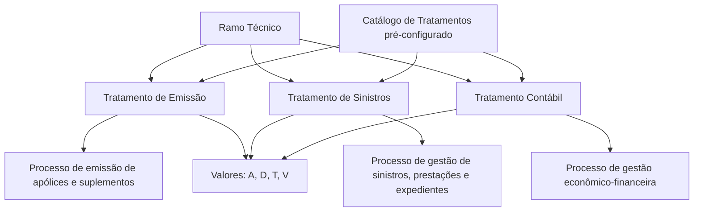

# Catálogo de Tratamentos — Documentação Reef

## 1. Metadados do Documento
- **Arquivo de Origem:** `Não identificado — trecho extraído fornecido`
- **Tipo de Documento:** `Especificação Técnica`
- **Domínio / Sistema:** `Reef / Configuração de Ramos Técnicos`
- **Público-Alvo:** `Desenvolvedores, Arquitetos, Operação e Negócio`
- **Data/Versão Identificada:** `Não identificada`

---

## 2. Resumo Executivo & Contexto de Negócio

O documento define o catálogo de **Tratamentos** do sistema Reef, utilizado na configuração de Ramos Técnicos. Os Tratamentos identificam a variante de processos que o sistema deve executar durante a emissão de apólices e suplementos, a gestão de sinistros ou expedientes e a gestão econômico-financeira das apólices.

Cada Ramo Técnico possui três propriedades independentes: **Tratamento de Emissão**, **Tratamento de Sinistros** e **Tratamento Contábil**. Essas propriedades permitem especializar a captura, o processamento e a gestão das informações segundo a tipologia de seguro coberta pelo ramo.

Os valores disponíveis para os três tipos de Tratamento são Automóveis, Diversos, Transportes e Vida & Acidentes. A seleção de um Tratamento influencia quais informações podem ser capturadas e quais processos ou suplementos podem ser utilizados no sistema.

O catálogo é entregue às instalações com conteúdo previamente definido. O documento declara explicitamente que não é possível ampliar localmente a relação de valores permitidos para essa propriedade.

---

## 3. Arquitetura, Componentes & Tecnologias Envolvidas

### Componentes e conceitos identificados

| Componente / Conceito | Papel no contexto documentado |
| :--- | :--- |
| Reef | Sistema no qual os Ramos Técnicos e seus Tratamentos são configurados. |
| Ramo Técnico | Entidade de configuração que associa três propriedades de Tratamento. |
| Tratamento de Emissão | Define a variante do processo de subscrição, emissão de apólices e suplementos. |
| Tratamento de Sinistros | Define a variante do processo de gestão de sinistros, prestações e expedientes. |
| Tratamento Contábil | Define a variante do processo de gestão econômico-financeira dos elementos das apólices emitidas. |
| Catálogo de Tratamentos | Catálogo pré-configurado que contém as chaves, nomes e abreviaturas dos Tratamentos permitidos. |
| Configuração de Ramos/Produtos | Documento vinculado e recomendado para interpretação complementar. |
| Perguntas frequentes | Documento vinculado e recomendado para interpretação complementar. |



**Nota de Análise:** O documento não detalha tecnologias de implementação, APIs, métodos HTTP, contratos JSON, servidores, URLs, portas ou integrações externas do sistema Reef.

---

## 4. Regras de Negócio, Especificações Funcionais & Processos

### 4.1. Finalidade dos Tratamentos

1. Existem três propriedades denominadas genericamente **Tratamentos** na definição de um Ramo Técnico.
2. Essas propriedades identificam univocamente a tipologia ou variante dos processos de:
   - gestão de apólices e contratos;
   - gestão de sinistros e prestações;
   - gestão econômico-financeira.
3. Os processos são executados ao:
   - subscrever ou emitir uma apólice;
   - emitir um suplemento;
   - gerir um sinistro ou expediente;
   - contabilizar os prêmios das apólices.
4. Os valores associados aos Tratamentos especializam a captura e a gestão das informações das apólices no sistema.

### 4.2. Tratamento de Emissão

O Tratamento de Emissão determina a tipologia do processo de emissão aplicável às apólices e suplementos de um Ramo Técnico.

| Tratamento de Emissão | Comportamento ou exemplo documentado |
| :--- | :--- |
| Vida | Indica que as apólices cobrem seguros de pessoas. Permite capturar informações específicas, como questionário médico. Permite emitir suplementos específicos, como Suplementos de Aportações Extraordinárias ou Resgates. |
| Diversos | Relacionado, no exemplo do documento, a Ramos Técnicos que cobrem seguros de danos materiais. Os suplementos específicos de Vida citados não podem ser utilizados nesse cenário. |
| Transportes | Relacionado, no exemplo do documento, a Ramos Técnicos que cobrem seguros de Mercadorias. Os suplementos específicos de Vida citados não podem ser utilizados nesse cenário. |
| Automóveis | Permite capturar nas apólices a relação e as informações de possíveis acessórios. Essa captura não é permitida pelos demais valores mencionados: Vida, Diversos ou Transportes. |

### 4.3. Tratamento de Sinistros

1. O Tratamento de Sinistros indica a tipologia ou variante do processo de gestão de sinistros e prestações aplicável às apólices de um Ramo Técnico.
2. O sistema especializa a tramitação e a gestão dos sinistros e respectivos expedientes conforme o Tratamento de Sinistros associado.
3. Os valores possíveis são os mesmos definidos para o Tratamento de Emissão:
   - Automóveis;
   - Diversos;
   - Transportes;
   - Vida & Acidentes.

### 4.4. Tratamento Contábil

1. O Tratamento Contábil indica a tipologia ou variante do processo de gestão econômico-financeira aplicável aos elementos econômicos das apólices emitidas.
2. Os valores possíveis para o Tratamento Contábil são os mesmos valores disponíveis para o Tratamento de Emissão.
3. O Tratamento Contábil é configurado de forma independente dos Tratamentos de Emissão e de Sinistros.

### 4.5. Independência entre os três Tratamentos

Um mesmo Ramo Técnico pode possuir tipologias distintas em cada uma das três propriedades. O documento apresenta o seguinte exemplo válido:

| Propriedade | Valor de exemplo |
| :--- | :--- |
| Tratamento de Emissão | Diversos |
| Tratamento de Sinistros | Automóveis |
| Tratamento Contábil | Transportes |

### 4.6. Restrições do catálogo

1. A propriedade **Tratamento** define a chave pela qual um Tratamento é identificado no sistema.
2. O catálogo de Tratamentos é entregue às instalações com conteúdo previamente estabelecido.
3. Não é possível ampliar no sistema a relação de valores possíveis dessa propriedade.

---

## 5. Tabelas de Parâmetros, Ambientes e Estruturas de Dados

### 5.1. Catálogo de Tratamentos

| Item / Parâmetro | Descrição / Função | Tipo / Valores / Formato | Ambiente / Observações |
| :--- | :--- | :--- | :--- |
| Tratamento | Chave de identificação do Tratamento no sistema. | `A`, `D`, `T`, `V` | Catálogo pré-configurado nas instalações. |
| Nome do Tratamento | Nome descritivo do Tratamento. | Automóveis; Diversos; Transportes; Vida & Acidentes | Associado à chave do catálogo. |
| Abreviatura do Tratamento | Nome abreviado ou descrição abreviada do Tratamento. | `Autos.`; `Div.`; `Trans.`; `Vida & Acc.` | Associada à chave e ao nome do catálogo. |
| Tratamento de Emissão | Define a variante de emissão, subscrição e suplementos. | Valores do catálogo de Tratamentos | Configurado no Ramo Técnico. |
| Tratamento de Sinistros | Define a variante de gestão de sinistros, prestações e expedientes. | Valores do catálogo de Tratamentos | Configurado no Ramo Técnico; independente dos demais Tratamentos. |
| Tratamento Contábil | Define a variante de gestão econômico-financeira. | Valores do catálogo de Tratamentos | Configurado no Ramo Técnico; independente dos demais Tratamentos. |

### 5.2. Valores permitidos

| Chave | Nome | Abreviatura | Aplicação documentada |
| :--- | :--- | :--- | :--- |
| `A` | Automóveis | `Autos.` | Em emissão, permite capturar relação e informações de possíveis acessórios da apólice. |
| `D` | Diversos | `Div.` | No exemplo apresentado, associado a seguros de danos materiais. |
| `T` | Transportes | `Trans.` | No exemplo apresentado, associado a seguros de Mercadorias. |
| `V` | Vida & Acidentes | `Vida & Acc.` | Em emissão, associado a seguros de pessoas; pode permitir questionário médico, Aportações Extraordinárias e Resgates. |

### 5.3. Ambientes, infraestrutura e logs

| Item / Parâmetro | Descrição / Função | Tipo / Valores / Formato | Ambiente / Observações |
| :--- | :--- | :--- | :--- |
| Ambientes | Não detalhados no trecho fornecido. | Não aplicável | O documento não informa DEV, QA, UAT, produção ou equivalentes. |
| Servidores | Não detalhados no trecho fornecido. | Não aplicável | Não há hostnames, endereços IP ou mapeamento de servidores. |
| Logs | Não detalhados no trecho fornecido. | Não aplicável | Não há caminhos, níveis, variáveis ou políticas de retenção de logs. |
| URLs / APIs | Não detalhadas no trecho fornecido. | Não aplicável | Não há URLs, endpoints, métodos HTTP ou contratos de integração. |

---

## 6. Bateria de Perguntas & Respostas para RAG (FAQ Sintético)

### P1: O que são Tratamentos na configuração de um Ramo Técnico no Reef?
**R:** Tratamentos são três propriedades do Ramo Técnico que identificam a tipologia ou variante dos processos de emissão de apólices e suplementos, gestão de sinistros e prestações, e gestão econômico-financeira. As propriedades são Tratamento de Emissão, Tratamento de Sinistros e Tratamento Contábil.

### P2: Quais são os três Tratamentos configuráveis para um Ramo Técnico?
**R:** Um Ramo Técnico possui Tratamento de Emissão, Tratamento de Sinistros e Tratamento Contábil. Cada propriedade pode receber uma tipologia de Tratamento independente das demais.

### P3: Quais valores podem ser usados no catálogo de Tratamentos?
**R:** O catálogo contém quatro valores: `A` para Automóveis, `D` para Diversos, `T` para Transportes e `V` para Vida & Acidentes. As abreviaturas documentadas são, respectivamente, `Autos.`, `Div.`, `Trans.` e `Vida & Acc.`.

### P4: Um Ramo Técnico pode ter Tratamento de Emissão, Sinistros e Contábil diferentes?
**R:** Sim. O documento declara que as três propriedades podem ter tipologias distintas. O exemplo fornecido configura Emissão como Diversos, Sinistros como Automóveis e Contábil como Transportes para o mesmo Ramo Técnico.

### P5: O que o Tratamento de Emissão Vida permite capturar ou emitir?
**R:** Quando um Ramo Técnico possui Tratamento de Emissão Vida, suas apólices correspondem a seguros de pessoas. O documento indica que esse cenário pode permitir a captura de informações específicas, como questionário médico, e a emissão de suplementos específicos, como Aportações Extraordinárias ou Resgates.

### P6: Qual Tratamento permite registrar acessórios na apólice?
**R:** O Tratamento de Emissão Automóveis permite capturar nas apólices a relação e as informações de possíveis acessórios. O documento diferencia esse comportamento dos Tratamentos Vida, Diversos e Transportes, que não permitem essa captura.

### P7: Como o Tratamento de Sinistros influencia a operação?
**R:** O Tratamento de Sinistros determina a tipologia ou variante do processo de gestão de sinistros e prestações aplicado às apólices pertencentes ao Ramo Técnico. Ele permite especializar a tramitação e a gestão dos sinistros e respectivos expedientes.

### P8: Qual é a função do Tratamento Contábil?
**R:** O Tratamento Contábil define a tipologia ou variante do processo de gestão econômico-financeira que deve ser seguida pelos elementos econômicos das apólices emitidas. Seus valores possíveis são os mesmos do Tratamento de Emissão.

### P9: É possível criar novos valores de Tratamento localmente no sistema?
**R:** Não. O documento afirma que o catálogo de Tratamentos é entregue às instalações com conteúdo previamente definido e que não é possível ampliar a relação de valores possíveis dessa propriedade no sistema.

### P10: Qual propriedade identifica a chave de um Tratamento no sistema?
**R:** A propriedade denominada Tratamento define a chave pela qual o Tratamento será identificado no sistema. As chaves documentadas são `A`, `D`, `T` e `V`.

---

## 7. Glossário de Termos, Siglas & Conceitos-Chave

- **Reef:** Sistema mencionado como contexto da documentação e da configuração de Ramos Técnicos.
- **Ramo Técnico:** Entidade de configuração que associa Tratamento de Emissão, Tratamento de Sinistros e Tratamento Contábil.
- **Tratamento:** Chave e tipologia que identifica uma variante de processo no sistema.
- **Tratamento de Emissão:** Propriedade que especializa o processo de subscrição, emissão de apólices e suplementos.
- **Tratamento de Sinistros:** Propriedade que especializa o processo de gestão de sinistros, prestações e expedientes.
- **Tratamento Contábil:** Propriedade que especializa o processo de gestão econômico-financeira dos elementos das apólices emitidas.
- **Apólice:** Documento ou contrato de seguro referido no processo de emissão, gestão de sinistros e contabilização de prêmios.
- **Suplemento:** Elemento emitido sobre uma apólice; o documento cita Aportações Extraordinárias e Resgates como exemplos específicos do contexto Vida.
- **Expediente:** Registro ou caso associado à gestão de sinistros.
- **Aportações Extraordinárias:** Tipo de suplemento citado como específico no contexto de Tratamento de Emissão Vida.
- **Resgates:** Tipo de suplemento citado como específico no contexto de Tratamento de Emissão Vida.
- **A:** Chave do Tratamento Automóveis.
- **D:** Chave do Tratamento Diversos.
- **T:** Chave do Tratamento Transportes.
- **V:** Chave do Tratamento Vida & Acidentes.

---

## 8. Notas Críticas, Riscos & Limitações

- O catálogo de Tratamentos é pré-configurado e não pode ser ampliado localmente; qualquer necessidade de nova tipologia não é atendida pelo mecanismo descrito.
- Os três Tratamentos de um Ramo Técnico são independentes. Essa flexibilidade exige governança de configuração para evitar combinações inconsistentes do ponto de vista operacional ou funcional.
- O documento cita documentos vinculados — **Configuração de Ramos/Produtos** e **Perguntas frequentes** — e recomenda sua leitura para evitar interpretações isoladas incorretas.
- O trecho não detalha critérios para validar combinações entre Tratamento de Emissão, Tratamento de Sinistros e Tratamento Contábil.
- O trecho não especifica APIs, contratos de dados, ambientes, servidores, mecanismos de autenticação, logs, procedimentos de implantação ou operação.
- **Nota de Análise:** O documento afirma que os valores possíveis de Sinistros e Contábil são os mesmos da Emissão, mas não descreve comportamentos específicos de Automóveis, Diversos, Transportes ou Vida & Acidentes para os processos de sinistros e contabilidade.

---

## 9. Conteúdo Bruto Estruturado (Referência Fiel)

```text
--- [PÁGINA 1 DE 2] ---

DEFINICIÓN de Tratamientos
Propiedades Generales
En la denición del Ramo Técnico existen tres propiedades a las que denominaremos genéricamente ‘Tratamientos’, que identican
unívocamente la tipología o variante de los procesos de gestión de pólizas y contratos, gestión de siniestros y prestaciones y gestión
Económica Financiera que se han de ejecutar al suscribir/emitir una póliza o un suplemento de este Ramo Técnico, gestionar un
siniestro/expediente y contabilizar las primas de sus pólizas (Tratamiento de Emisión, Tratamiento de Siniestros y Tratamiento Contable
respectivamente).
De esta manera estas tres propiedades permiten especializar la captura y gestión de la información de las pólizas en el sistema de acuerdo
con sus valores asociados.
A modo de ejemplo,
Si el Ramo técnico tuviera asociado un tratamiento de emisión de Vida estaríamos indicando al sistema que sus pólizas cubren seguros
de personas y por tanto en el proceso de emisión se podría capturar información especíca (como un cuestionario médico) o emitir
suplementos especícos (como Suplementos de Aportaciones Extraordinarias o Rescates) que no podrán ser utilizados en cambio si el
tratamiento de emisión correspondiera a un Ramo Técnico que cubriera seguros de daños materiales y por tanto tuviera asociado un
tratamiento de Diversos o a un Ramo Técnico que cubriera seguros de Mercancías y por tanto tuviera asociado un tratamiento de
Transportes.
De igual manera un ramo técnico cuyo tratamiento de emisión asociado fuera de Automóviles permitirá capturar en sus pólizas la
relación e información de sus posibles accesorios a diferencia de los otros valores de esta propiedad (Vida, Diversos o Transportes) que
no lo permitirían.
En el caso del tratamiento de siniestros, el valor de la propiedad indica en el sistema la tipología o variante del proceso de gestión de
siniestros y prestaciones que se ha de ejecutar sobre las pólizas pertenecientes al Ramo Técnico, siendo sus posibles valores los
mismos que los indicados en la denición del tratamiento de emisión.
De esta manera el sistema permite especializar la tramitación y gestión de los siniestros y sus expedientes en función de la tipología del
tratamiento de siniestros asociado en el ramo técnico.
Por último y en el caso del tratamiento contable, el valor indica la tipología o variante del proceso de gestión económica nanciera que
han de seguir los elementos económicos de las pólizas emitidas, siendo sus posibles valores los mismos que los de la propiedad
tratamiento de emisión.
NOTA: El sistema permite que un Ramo Técnico tenga diferentes tipologías de tratamientos en los tres propiedades indicadas: tratamiento de
emisión de Diversos, tenga en cambio un tratamiento de siniestros de Automóviles y un tratamiento contable de Transportes.
Tratamiento
Esta propiedad dene la clave con la que se identicará el Tratamiento en el Sistema.
NOTA: El catálogo de Tratamientos se entrega a las instalaciones con su contenido ya prejado.
Documentation / DOCUMENTACIÓN Reef
DOCUMENTACIÓN Reef
Mapfredocument
DOCUMENTACIÓN Reef
Owner
user:agonzalez_mapfre.com
Lifecycle
Approved Source
 / 
 VL
Buscar Inicio Soluciones Arquitecturas APIs Componentes Cloud Documentación Zeus Reef Ayuda
ES


--- [PÁGINA 2 DE 2] ---

Descripción del Tratamiento
Esta propiedad indica el nombre o la descripción del Tratamiento.
Abreviatura del Tratamiento
Esta propiedad indica la abreviatura o descripción abreviada del Tratamiento.
Por tanto y como recopilación de las deniciones, el contenido del este catálogo es:
TRATAMIENTO NOMBRE ABREVIATURA
A Automóviles Autos.
D Diversos Div.
T Transportes Trans.
V Vida & Accidentes Vida & Acc.
Vínculos
Relación de Directrices y Documentos funcionales cuya lectura recomendada para evitar que la interpretación aislada del presente
documento pueda conducir a error.
Conguración de Ramos/Productos
Preguntas frecuentes
(1) ¿Existe alguna recomendación operativa que deba ser tomada en consideración localmente en la codicación, uso y denición de los
Tratamientos en el Sistema?
No es posible ampliar en el sistema la relación de posibles valores de esta propiedad.
```
