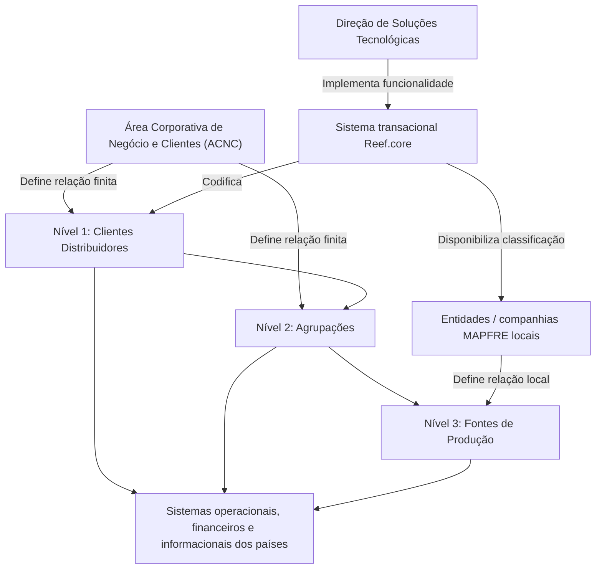

# Definição da Estrutura de Canais no Reef.core

## 1. Metadados do Documento
- **Arquivo de Origem:** Não identificado
- **Tipo de Documento:** Procedimento
- **Domínio / Sistema:** Reef.core / MAPFRE / Estrutura de Canais
- **Público-Alvo:** Negócio, desenvolvedores, arquitetura e entidades MAPFRE locais
- **Data/Versão Identificada:** Não identificada

---

## 2. Resumo Executivo & Contexto de Negócio

A Área Corporativa de Negócio e Clientes (ACNC) estabeleceu uma nova classificação operacional para clientes distribuidores. Essa classificação deve ser considerada pelos sistemas operacionais, financeiros e informacionais dos países.

A finalidade da estrutura de canais é facilitar a obtenção e o reporte de informações sobre índices de produtividade e rentabilidade por canal, incluindo o margem de contribuição. Para atender a essa necessidade, a Direção de Soluções Tecnológicas implementou funcionalidade no sistema transacional Reef.core.

A funcionalidade disponibilizada permite que companhias MAPFRE locais classifiquem clientes distribuidores e suas agrupações conforme as diretrizes definidas pela ACNC. Os dois primeiros níveis da estrutura são uma relação finita definida pelo corporativo; as entidades MAPFRE podem definir somente a relação das fontes de produção utilizadas localmente, correspondentes ao terceiro nível.

---

## 3. Arquitetura, Componentes & Tecnologias Envolvidas

O documento cita o sistema transacional **Reef.core** como o núcleo onde a estrutura de canais é codificada. A estrutura possui três níveis piramidais e utiliza repositórios de informação específicos.

| Componente / Entidade | Papel identificado no documento |
| :--- | :--- |
| ACNC | Estabelece a nova classificação operacional de clientes distribuidores e participa do consenso sobre os dois primeiros níveis da estrutura. |
| Direção de Soluções Tecnológicas | Implementou a funcionalidade de classificação no Reef.core. |
| Reef.core | Sistema transacional que disponibiliza a funcionalidade e permite codificar a estrutura de canais. |
| Companhias MAPFRE locais | Utilizam a funcionalidade para classificar clientes distribuidores e agrupações. |
| Entidades MAPFRE | Definem a relação das fontes de produção utilizadas localmente. |
| Sistemas operacionais, financeiros e informacionais dos países | Devem contemplar a classificação operacional estabelecida pela ACNC. |
| Repositórios de informação específicos | Armazenam a estrutura piramidal de canais. |



> *Nota de Análise: O documento não detalha métodos HTTP, contratos JSON, banco de dados, tecnologias de desenvolvimento, rotas, ambientes ou mecanismos de integração do Reef.core.*

---

## 4. Regras de Negócio, Especificações Funcionais & Processos

1. A ACNC estabeleceu uma nova classificação operacional para clientes distribuidores.
2. Sistemas operacionais, financeiros e informacionais dos países devem contemplar a classificação operacional.
3. A classificação busca apoiar a obtenção e o reporte de informações sobre:
   - Índices de produtividade por canal.
   - Rentabilidade por canal.
   - Margem de contribuição.
4. O Reef.core disponibiliza funcionalidade para classificar:
   - Clientes distribuidores.
   - Agrupações dos clientes distribuidores.
5. A estrutura de canais da entidade MAPFRE possui formato piramidal de três níveis.
6. Os níveis da estrutura são:
   1. Clientes distribuidores.
   2. Agrupações.
   3. Fontes de produção.
7. Os dois primeiros níveis — clientes distribuidores e agrupações — constituem uma relação finita definida pelo corporativo.
8. As entidades MAPFRE têm autorização para definir apenas a relação de fontes de produção que utilizam localmente.
9. A estrutura é mantida em repositórios de informação específicos.
10. As instalações recebem inicialmente informação da estrutura, exceto pelo terceiro nível.

### Processo identificado

| Etapa | Ação | Nível da estrutura | Responsabilidade identificada |
| :--- | :--- | :--- | :--- |
| 1 | Definir clientes distribuidores | Nível 1 | Corporativo / ACNC |
| 2 | Definir agrupações | Nível 2 | Corporativo / ACNC |
| 3 | Definir fontes de produção | Nível 3 | Entidades MAPFRE locais |

---

## 5. Tabelas de Parâmetros, Ambientes e Estruturas de Dados

| Item / Parâmetro | Descrição / Função | Tipo / Valores / Formato | Ambiente / Observações |
| :--- | :--- | :--- | :--- |
| Estrutura de Canais | Estrutura utilizada para codificar canais da entidade MAPFRE. | Estrutura piramidal de três níveis. | Codificada no núcleo do sistema. |
| Nível 1 | Clientes distribuidores. | Primeiro nível. | Relação finita definida pelo corporativo. |
| Nível 2 | Agrupações dos clientes distribuidores. | Segundo nível. | Relação finita definida pelo corporativo. |
| Nível 3 | Fontes de produção. | Terceiro nível. | Relação definida localmente pelas entidades MAPFRE. |
| Classificação operacional | Nova classificação de clientes distribuidores estabelecida pela ACNC. | Não detalhado. | Deve ser contemplada por sistemas dos países. |
| Índices de produtividade | Informação a ser obtida e reportada por canal. | Não detalhado. | Associado ao objetivo da estrutura de canais. |
| Rentabilidade por canal | Informação a ser obtida e reportada por canal. | Margem de contribuição. | Associada ao objetivo da estrutura de canais. |
| Repositórios de informação específicos | Repositórios onde a estrutura é mantida. | Não detalhado. | Entregues inicialmente às instalações com informação, exceto o terceiro nível. |
| Reef.core | Sistema transacional com funcionalidade de classificação. | Sistema transacional. | Disponibiliza a funcionalidade para companhias MAPFRE locais. |

> *Nota de Análise: O documento não informa nomes de servidores, URLs, portas, arquivos de configuração, variáveis de log, formatos de dados ou valores técnicos de parâmetros.*

---

## 6. Bateria de Perguntas & Respostas para RAG (FAQ Sintético)

### P1: Qual é o objetivo da nova estrutura de canais no Reef.core?
**R:** A estrutura de canais permite classificar clientes distribuidores, suas agrupações e fontes de produção. O objetivo é apoiar a obtenção e o reporte de índices de produtividade e rentabilidade por canal, incluindo a margem de contribuição.

### P2: Qual área corporativa definiu a nova classificação operacional de clientes distribuidores?
**R:** A Área Corporativa de Negócio e Clientes, identificada pela sigla ACNC, estabeleceu a nova classificação operacional de clientes distribuidores.

### P3: Quais sistemas devem contemplar a classificação operacional estabelecida pela ACNC?
**R:** A classificação deve ser contemplada pelos sistemas operacionais, financeiros e informacionais dos países.

### P4: Em qual sistema foi implementada a funcionalidade de classificação de canais?
**R:** A Direção de Soluções Tecnológicas implementou a funcionalidade no sistema transacional Reef.core.

### P5: Quantos níveis possui a estrutura de canais da entidade MAPFRE?
**R:** A estrutura possui três níveis piramidais: clientes distribuidores no nível 1, agrupações no nível 2 e fontes de produção no nível 3.

### P6: Quem define os clientes distribuidores e as agrupações da estrutura de canais?
**R:** Os clientes distribuidores e as agrupações, correspondentes aos dois primeiros níveis, são uma relação finita definida pelo corporativo, em consenso com a ACNC.

### P7: O que as entidades MAPFRE podem definir localmente?
**R:** As entidades MAPFRE podem definir a relação das fontes de produção que utilizam localmente. As fontes de produção correspondem ao terceiro nível da estrutura de canais.

### P8: Qual nível da estrutura não é entregue inicialmente às instalações com informação?
**R:** O terceiro nível da estrutura, correspondente às fontes de produção, não é incluído na entrega inicial de informação às instalações.

### P9: Onde a estrutura piramidal de canais é armazenada?
**R:** A estrutura é codificada em repositórios de informação específicos disponibilizados pelo núcleo do sistema.

### P10: O documento detalha os métodos HTTP ou contratos de integração do Reef.core?
**R:** Não. O documento identifica o Reef.core como sistema transacional e descreve a funcionalidade de classificação, mas não detalha métodos HTTP, contratos JSON, APIs ou protocolos de integração.

---

## 7. Glossário de Termos, Siglas & Conceitos-Chave

- **ACNC:** Área Corporativa de Negócio e Clientes.
- **Reef.core:** Sistema transacional citado como responsável por disponibilizar a funcionalidade de classificação.
- **Clientes Distribuidores:** Elementos do nível 1 da estrutura de canais.
- **Agrupações:** Elementos do nível 2 da estrutura de canais associados aos clientes distribuidores.
- **Fontes de Produção:** Elementos do nível 3 da estrutura de canais; sua relação é definida localmente pelas entidades MAPFRE.
- **Margem de Contribuição:** Indicador mencionado como parte da informação de rentabilidade por canal.
- **Estrutura Piramidal de Três Níveis:** Organização composta por clientes distribuidores, agrupações e fontes de produção.

---

## 8. Notas Críticas, Riscos & Limitações

- O documento não apresenta detalhes técnicos sobre interfaces, APIs, métodos HTTP, contratos de dados, persistência, autenticação ou integração entre sistemas.
- Não foram identificadas URLs de ambiente, servidores, portas, ferramentas de monitoramento ou rotas de logs.
- A definição centralizada dos dois primeiros níveis limita a autonomia local das entidades MAPFRE para clientes distribuidores e agrupações.
- A definição local do terceiro nível exige que cada entidade MAPFRE mantenha corretamente a relação de fontes de produção utilizada localmente.
- A entrega inicial de informação exclui o terceiro nível; o documento não descreve como a informação de fontes de produção é posteriormente cadastrada, importada ou validada.
- O identificador `VL` aparece no conteúdo bruto, mas não possui explicação contextual no documento.

---

## 9. Conteúdo Bruto Estruturado (Referência Fiel)

```text
--- [PÁGINA 1 DE 1] ---

DEFINICIÓN de la ESTRUCTURA de CANALES
Contexto
El área corporativa de negocio y clientes (ACNC) ha establecido una nueva clasicación operativa de clientes distribuidores que debe ser
contemplada en los sistemas operacionales, nancieros e informacionales de los países, facilitando el proceso de obtención y reporte de la
información de ratios de productividad y de rentabilidad por canal (margen de contribución).
Por dicha razón, desde la Dirección de Soluciones Tecnológicas se ha implementado en el sistema transaccional de Reef.core poniendo a
disposición de las compañías MAPFRE locales la funcionalidad de clasicar los clientes Distribuidores y sus Agrupaciones según las pautas
indicadas por el ACNC.
Se ha consensuado conjuntamente con el Área Corporativa de Negocio y Clientes (ACNC) el que los dos primeros niveles de la estructura, los
niveles correspondientes a los clientes distribuidores y a sus agrupaciones sean una relación nita y denida por el corporativo, delegando en
las entidades MAPFRE únicamente la facultad de denir la relación de fuentes de producción que utilizan localmente.
Objetivo
Funcionalmente, el núcleo del Sistema cuenta con la posibilidad de codicar la estructura de Canales de la entidad MAPFRE en una
estructura piramidal de tres niveles en repositorios de información especícos que se entregan inicialmente a las instalaciones con
información excepto el tercer nivel de la estructura.
Proceso a seguir
DEFINIR Clientes Distribuidores (1) DEFINIR Agrupaciones (2) DEFINIR Fuentes de Producción (3)
DEFINIR Nivel 1 - Clientes Distribuidores
DEFINIR Nivel 2 - Agrupaciones
DEFINIR Nivel 3 - Fuentes de Producción
Documentation / DOCUMENTACIÓN Reef
DOCUMENTACIÓN Reef
Mapfredocument
DOCUMENTACIÓN Reef
Owner
user:agonzalez_mapfre.com
Lifecycle
Approved Source
 /
 VL
Buscar Inicio Soluciones Arquitecturas APIs Componentes Cloud Documentación Zeus Reef Ayuda
ES
```
