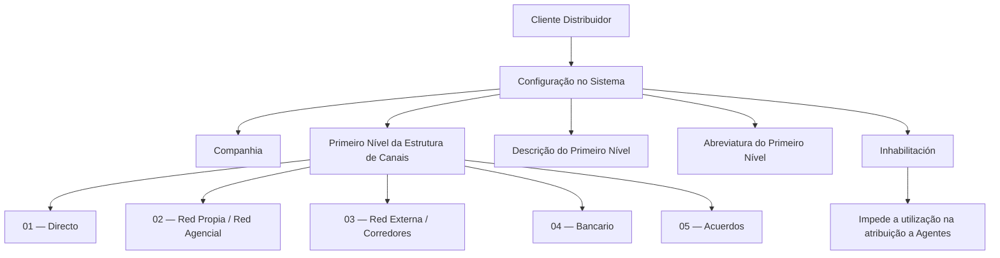

# Definição do Primeiro Nível da Estrutura de Canais — Clientes Distribuidores MAPFRE

## 1. Metadados do Documento
- **Arquivo de Origem:** `Não identificado no conteúdo fornecido`
- **Tipo de Documento:** Especificação Técnica / Documentação Funcional
- **Domínio / Sistema:** MAPFRE — Reef — Estrutura de Canais
- **Público-Alvo:** Analistas funcionais, desenvolvedores, arquitetos e equipes responsáveis pela configuração de clientes distribuidores
- **Data/Versão Identificada:** Não identificada
- **Estado do Documento Identificado:** `Lifecycle: Approved`

---

## 2. Resumo Executivo & Contexto de Negócio

O documento define o primeiro nível da Estrutura de Canais para configuração de Clientes Distribuidores no sistema MAPFRE. Um Cliente Distribuidor é uma pessoa ou entidade jurídica que distribui, ou pode distribuir, produtos seguradores, financeiros ou serviços para a MAPFRE ou para entidades concorrentes.

A classificação corporativa de Clientes Distribuidores é estruturada em cinco tipos: Directo, Red Propia/Red Agencial, Red Externa/Corredores, Bancario e Acuerdos. Cada tipo representa uma modalidade de distribuição com características próprias relativas à exclusividade, atividade de venda, ambiente comercial e forma de remuneração.

O objetivo funcional é configurar os Clientes Distribuidores de acordo com a classificação corporativa no primeiro nível da Estrutura de Canais. Para isso, a definição possui propriedades gerais — Companhia, Código do Primeiro Nível, Descrição do Primeiro Nível e Abreviatura do Primeiro Nível — e uma propriedade adicional de inabilitação.

A codificação corporativa do primeiro nível é preestabelecida no sistema e não pode ser modificada localmente. Essa restrição assegura padronização corporativa na identificação dos canais e impede alterações locais na codificação, no uso ou na definição do catálogo de Clientes Distribuidores nesse nível.

---

## 3. Arquitetura, Componentes & Tecnologias Envolvidas

### Componentes e conceitos identificados

| Componente / Conceito | Descrição baseada no documento |
| :--- | :--- |
| MAPFRE | Organização para a qual os produtos seguradores, financeiros ou serviços podem ser distribuídos. |
| Sistema | Sistema no qual é definido o Cliente Distribuidor e configurado o primeiro nível da Estrutura de Canais. O nome técnico do sistema não é detalhado. |
| Reef | Ambiente ou repositório de documentação identificado na interface apresentada. |
| Estrutura de Canais | Estrutura corporativa utilizada para classificar Clientes Distribuidores. |
| Primeiro Nível da Estrutura de Canais | Nível de classificação configurado por meio de código, descrição e abreviatura corporativamente definidos. |
| Cliente Distribuidor | Pessoa ou entidade jurídica que distribui ou pode distribuir produtos seguradores, financeiros ou serviços. |
| Companhia | Atributo que contém o código da companhia para a qual o Cliente Distribuidor é definido no sistema. |
| Agentes | Entidades às quais um Tipo de Cliente Distribuidor pode ser atribuído, salvo quando estiver inabilitado. |



> **Nota de Análise:** O documento descreve atributos funcionais e a classificação corporativa da Estrutura de Canais, mas não detalha arquitetura de software, APIs, métodos HTTP, contratos JSON, banco de dados, tecnologias de implementação ou integrações entre sistemas.

---

## 4. Regras de Negócio, Especificações Funcionais & Processos

### 4.1 Definição de Cliente Distribuidor

Um Cliente Distribuidor é uma pessoa ou entidade jurídica que:

- Distribui produtos seguradores, financeiros ou serviços para a MAPFRE;
- Pode distribuir produtos seguradores, financeiros ou serviços para a MAPFRE;
- Pode distribuir produtos seguradores, financeiros ou serviços para uma entidade concorrente da MAPFRE.

### 4.2 Objetivo funcional

O sistema deve permitir configurar os Clientes Distribuidores conforme a Classificação Corporativa no primeiro nível da Estrutura de Canais.

### 4.3 Classificação corporativa de Clientes Distribuidores

1. **Directo**
   - Pessoas, normalmente empregados, ou meios de distribuição.
   - Realizam vendas para a MAPFRE.
   - Não recebem retribuição variável direta em troca das vendas.

2. **Red Propia / Red Agencial**
   - Pessoas ou organizações.
   - Dedicam-se à venda de seguros como atividade principal ou complementar.
   - Distribuem produtos exclusivamente para a MAPFRE.

3. **Red Externa / Corredores**
   - Indivíduos ou organizações.
   - Dedicam-se à venda de seguros como atividade principal ou complementar.
   - Distribuem produtos para diversas companhias de seguros.

4. **Bancario**
   - Entidades bancárias.
   - Cooperativas de crédito ao consumo.
   - Produção proveniente de operações societárias com parceiros bancários.
   - Qualquer pessoa ou organização que desenvolva atividade comercial no ambiente de escritórios bancários ou nos sistemas de distribuição dessas entidades.

5. **Acuerdos**
   - Acordos de distribuição com organizações cuja principal atividade econômica não é a venda de seguros.
   - Essas organizações recebem comissão pelo acesso ao cliente final.
   - O acesso ao cliente final pode ocorrer por meio da estrutura de distribuição da organização ou pela cessão da exploração da carteira à MAPFRE.

### 4.4 Regras de atributos gerais

| Regra | Detalhamento |
| :--- | :--- |
| Companhia | Deve conter o código da companhia para a qual o Cliente Distribuidor está sendo definido no sistema. |
| Código do Primeiro Nível | Deve identificar a chave do primeiro nível da Estrutura de Canais no sistema. |
| Descrição do Primeiro Nível | Deve conter a denominação ou descrição da chave do primeiro nível da Estrutura de Canais. |
| Abreviatura do Primeiro Nível | Deve conter a denominação ou descrição da chave do primeiro nível da Estrutura de Canais em formato abreviado. |

### 4.5 Regra de inabilitação

A propriedade **Inhabilitación** estabelece que o Tipo de Cliente Distribuidor está inabilitado para ser utilizado na atribuição a Agentes.

### 4.6 Restrição corporativa de codificação

Não é possível alterar localmente a codificação preestabelecida no sistema para o primeiro nível da Estrutura de Canais.

Essa restrição se aplica à:

- Codificação;
- Utilização;
- Definição do catálogo de Clientes Distribuidores no sistema;
- Configuração local do primeiro nível da Estrutura de Canais.

---

## 5. Tabelas de Parâmetros, Ambientes e Estruturas de Dados

### 5.1 Estrutura corporativa do primeiro nível

| Item / Parâmetro | Descrição / Função | Tipo / Valores / Formato | Ambiente / Observações |
| :--- | :--- | :--- | :--- |
| Código `01` | Identifica o canal Directo. | Código corporativo predefinido. | Não pode ser alterado localmente. |
| Descrição `Directo` | Pessoas, normalmente empregados, ou meios de distribuição que realizam vendas para a MAPFRE sem retribuição variável direta. | Descrição corporativa. | Abreviatura: `Dir.r`. |
| Código `02` | Identifica o canal Red Propia - Agencial. | Código corporativo predefinido. | Não pode ser alterado localmente. |
| Descrição `Red Propia - Agencial` | Pessoas ou organizações que vendem seguros como atividade principal ou complementar e distribuem exclusivamente para a MAPFRE. | Descrição corporativa. | Abreviatura: `Prop.`. |
| Código `03` | Identifica o canal Red Externa - Corredores. | Código corporativo predefinido. | Não pode ser alterado localmente. |
| Descrição `Red Externa - Corredores` | Indivíduos ou organizações que vendem seguros como atividade principal ou complementar e distribuem para várias seguradoras. | Descrição corporativa. | Abreviatura: `Ext.`. |
| Código `04` | Identifica o canal Bancario. | Código corporativo predefinido. | Não pode ser alterado localmente. |
| Descrição `Bancario` | Entidades bancárias, cooperativas de crédito ao consumo, operações societárias com parceiros bancários e organizações atuantes no ambiente bancário. | Descrição corporativa. | Abreviatura: `Ban.`. |
| Código `05` | Identifica o canal Acuerdos. | Código corporativo predefinido. | Não pode ser alterado localmente. |
| Descrição `Acuerdos` | Acordos com organizações cuja atividade principal não é venda de seguros e que recebem comissão pelo acesso ao cliente final. | Descrição corporativa. | Abreviatura: `Acu.`. |

### 5.2 Propriedades do Cliente Distribuidor

| Item / Parâmetro | Descrição / Função | Tipo / Valores / Formato | Ambiente / Observações |
| :--- | :--- | :--- | :--- |
| Companhia | Código da companhia para a qual o Cliente Distribuidor é definido. | Código de companhia. | Propriedade geral. |
| Código do Primeiro Nível | Chave identificadora do primeiro nível da Estrutura de Canais. | Código corporativo: `01`, `02`, `03`, `04` ou `05`. | Codificação preestabelecida e não alterável localmente. |
| Descrição do Primeiro Nível | Denominação ou descrição da chave do primeiro nível. | Texto descritivo. | Propriedade geral. |
| Abreviatura do Primeiro Nível | Denominação ou descrição abreviada da chave do primeiro nível. | Texto abreviado. | Propriedade geral. |
| Inhabilitación | Define que o Tipo de Cliente Distribuidor não pode ser usado na atribuição a Agentes. | Estado de inabilitação. | Propriedade adicional. |

### 5.3 Referências documentais identificadas

| Item / Parâmetro | Descrição / Função | Tipo / Valores / Formato | Ambiente / Observações |
| :--- | :--- | :--- | :--- |
| Estructura de Canales | Documento ou diretriz relacionada cuja leitura é recomendada. | Referência funcional. | Deve ser consultada para evitar interpretação isolada incorreta. |
| Perguntas frequentes | Seção de perguntas frequentes relacionada ao tema. | Referência funcional. | Contém a regra de imutabilidade da codificação local. |
| Reef | Ambiente de documentação identificado. | Portal de documentação. | O conteúdo não detalha funcionalidades técnicas da plataforma Reef. |
| Owner | `user:agonzalez_mapfre.com` | Identificador exibido na origem. | O papel ou responsabilidade do owner não é detalhado. |
| Lifecycle | `Approved` | Estado documental. | Exibido na origem. |

---

## 6. Bateria de Perguntas & Respostas para RAG (FAQ Sintético)

### P1: O que é um Cliente Distribuidor no contexto da Estrutura de Canais MAPFRE?
**R:** Um Cliente Distribuidor é uma pessoa ou entidade jurídica que distribui, ou pode distribuir, produtos seguradores, financeiros ou serviços para a MAPFRE ou para alguma entidade concorrente.

### P2: Qual é o objetivo da definição do primeiro nível da Estrutura de Canais?
**R:** O objetivo é configurar os Clientes Distribuidores conforme a Classificação Corporativa no primeiro nível da Estrutura de Canais do sistema.

### P3: Quais tipos corporativos de Clientes Distribuidores existem no primeiro nível da Estrutura de Canais?
**R:** A estrutura corporativa possui cinco tipos: `01 Directo`, `02 Red Propia - Agencial`, `03 Red Externa - Corredores`, `04 Bancario` e `05 Acuerdos`.

### P4: Qual código deve ser utilizado para o canal Directo?
**R:** O canal Directo utiliza o código corporativo `01`, possui a descrição `Directo` e a abreviatura `Dir.r`.

### P5: O que caracteriza o canal Red Propia - Agencial?
**R:** Red Propia - Agencial é formada por pessoas ou organizações que vendem seguros como atividade principal ou complementar e distribuem exclusivamente para a MAPFRE. O código corporativo desse canal é `02` e a abreviatura é `Prop.`.

### P6: Quando um Cliente Distribuidor deve ser classificado como Red Externa - Corredores?
**R:** A classificação Red Externa - Corredores aplica-se a indivíduos ou organizações que vendem seguros como atividade principal ou complementar e distribuem produtos para várias companhias de seguros. O código é `03` e a abreviatura é `Ext.`.

### P7: O que está incluído na classificação Bancario?
**R:** Bancario inclui entidades bancárias, cooperativas de crédito ao consumo, produção oriunda de operações societárias com parceiros bancários e pessoas ou organizações que atuam comercialmente no ambiente de escritórios bancários ou nos sistemas de distribuição dessas entidades. O código é `04` e a abreviatura é `Ban.`.

### P8: Como o documento define a classificação Acuerdos?
**R:** Acuerdos corresponde a acordos de distribuição com organizações cuja atividade econômica principal não é a venda de seguros. Essas organizações recebem comissão pelo acesso ao cliente final, seja por sua estrutura de distribuição, seja pela cessão da exploração da carteira à MAPFRE. O código é `05` e a abreviatura é `Acu.`.

### P9: É permitido alterar localmente os códigos do primeiro nível da Estrutura de Canais?
**R:** Não. O documento afirma que não é possível alterar a codificação preestabelecida no sistema para esse nível da Estrutura de Canais.

### P10: Qual é a função do atributo Companhia?
**R:** O atributo Companhia contém o código da companhia para a qual o Cliente Distribuidor está sendo definido no sistema.

### P11: Para que serve a propriedade Inhabilitación?
**R:** A propriedade Inhabilitación estabelece que o Tipo de Cliente Distribuidor está inabilitado e, portanto, não pode ser utilizado na atribuição a Agentes.

### P12: O documento descreve APIs, contratos JSON ou métodos HTTP da Estrutura de Canais?
**R:** Não. O documento apresenta regras funcionais de classificação e atributos do primeiro nível da Estrutura de Canais, mas não detalha APIs, métodos HTTP, contratos JSON, tecnologias ou integrações técnicas.

---

## 7. Glossário de Termos, Siglas & Conceitos-Chave

- **MAPFRE:** Organização para a qual os produtos seguradores, financeiros ou serviços podem ser distribuídos no contexto do documento.
- **Cliente Distribuidor:** Pessoa ou entidade jurídica que distribui, ou pode distribuir, produtos seguradores, financeiros ou serviços para a MAPFRE ou concorrentes.
- **Estrutura de Canais:** Estrutura corporativa utilizada para classificar Clientes Distribuidores.
- **Primeiro Nível:** Primeiro nível de classificação da Estrutura de Canais, identificado por código, descrição e abreviatura.
- **Directo:** Tipo de canal para pessoas, normalmente empregados, ou meios de distribuição que vendem para a MAPFRE sem retribuição variável direta.
- **Red Propia / Red Agencial:** Tipo de canal de pessoas ou organizações que distribuem seguros exclusivamente para a MAPFRE.
- **Red Externa / Corredores:** Tipo de canal de indivíduos ou organizações que distribuem seguros para várias companhias.
- **Bancario:** Tipo de canal vinculado a entidades bancárias, cooperativas de crédito ao consumo, operações com parceiros bancários e ambientes de distribuição bancária.
- **Acuerdos:** Tipo de canal baseado em acordos de distribuição com organizações cuja atividade principal não é venda de seguros.
- **Agentes:** Entidades às quais os Tipos de Cliente Distribuidor podem ser atribuídos, exceto quando inabilitados.
- **Inhabilitación:** Propriedade que impede a utilização de um Tipo de Cliente Distribuidor na atribuição a Agentes.
- **Reef:** Ambiente ou portal de documentação identificado no conteúdo de origem.

---

## 8. Notas Críticas, Riscos & Limitações

- A codificação do primeiro nível da Estrutura de Canais é corporativa e preestabelecida; alterações locais não são permitidas.
- A leitura isolada do documento pode levar a interpretações incorretas. O documento recomenda consultar as diretrizes e documentos funcionais relacionados, especialmente **Estructura de Canales**.
- A propriedade **Inhabilitación** impede o uso do Tipo de Cliente Distribuidor na atribuição a Agentes; processos de atribuição devem considerar esse estado.
- O documento não informa mecanismos técnicos de validação, tela de manutenção, permissões de alteração, persistência de dados, integração, API, contrato de serviço ou tratamento de erro.
- O documento não detalha regras para criação, atualização, exclusão, auditoria ou versionamento de Clientes Distribuidores.
- Alguns caracteres do conteúdo bruto apresentam falhas de codificação, como `nancieros`, `clasicación` e `deniendo`. Esta estrutura preserva o sentido textual sem inferir conteúdo técnico inexistente.

---

## 9. Conteúdo Bruto Estruturado (Referência Fiel)

```text
--- [PÁGINA 1 DE 2] ---

DEFINICIÓN del Primer Nivel de la Estructura de Canales
Contexto
Un Cliente Distribuidor es aquella persona o entidad jurídica que distribuye o puede distribuir productos aseguradores, nancieros o servicios
para MAPFRE o para alguna entidad competidora.
La clasicación corporativa de clientes distribuidores se conforma con los siguientes tipos:
Directo: personas, normalmente empleados, o medios de distribución que realizan ventas para MAPFRE sin percibir una retribución
variable directa a cambio.
Red Propia/Red Agencial: personas u organizaciones que se dedican a la venta de seguros como actividad principal o complementaria y
que distribuyen en exclusividad para MAPFRE.
Red Externa/Corredores: individuos u organizaciones que se dedican a la venta de seguros como actividad principal o complementaria y
que distribuyen para varias compañías de seguros.
Bancario: entidades bancarias, cooperativas de crédito al consumo, producción proveniente de operaciones societarias con socios
bancarios y cualquier otra persona u organización que desarrolle su actividad comercial en el entorno de ocinas bancarias o los
sistemas de distribución de estas entidades.
Acuerdos: acuerdos de distribución con organizaciones cuya principal actividad económica no es la venta de seguros y cobran una
comisión por acceder al cliente nal bien a través de su estructura de distribución, o cediendo la explotación de la cartera a MAPFRE.
Objetivo
Congurar a los clientes distribuidores de acuerdo con la Clasicación Corporativa en el primer nivel de la estructura de canales.
Propiedades Generales
Otras Propiedades
Propiedades Generales
Compañía
Este atributo contiene el código de la compañía para la que se está deniendo el Cliente Distribuidor en el sistema.
Código del Primer Nivel
Este atributo identica la clave que identicará al Primer Nivel de la estructura de canales en el Sistema.
Descripción del Primer Nivel
Documentation / DOCUMENTACIÓN Reef
DOCUMENTACIÓN Reef
Mapfredocument
DOCUMENTACIÓN Reef
Owner
user:agonzalez_mapfre.com
Lifecycle
Approved Source
 / 
 VL
Buscar Inicio Soluciones Arquitecturas APIs Componentes Cloud Documentación Zeus Reef Ayuda
ES


--- [PÁGINA 2 DE 2] ---

Esta propiedad contiene la denominación o descripción de la clave del Primer Nivel de la estructura de Canales.
Abreviatura del Primer Nivel
Este Atributo contiene la denominación o descripción de la clave del Primer Nivel de la estructura de Canales en formato abreviado.
La estructura denida corporativamente es:
CLAVE DEL PRIMER NIVEL DESCRIPCIÓN ABREVIATURA
01 Directo Dir.r
02 Red Propia - Agencial Prop.
03 Red Externa - Corredores Ext.
04 Bancario Ban.
05 Acuerdos Acu.
Otras Propiedades
Inhabilitación
Esta propiedad establece que el Tipo de Cliente Distribuidor está inhabilitado para poder ser utilizado en la asignación a los Agentes.
Vínculos
Relación de Directrices y Documentos funcionales cuya lectura recomendada para evitar que la interpretación aislada del presente
documento pueda conducir a error.
Estructura de Canales
Preguntas frecuentes
1 ¿Existe alguna premisa que deba ser tomada en consideración localmente en la codicación, uso y denición del catálogo de Clientes
Distribuidores en el Sistema?
No es posible alterar la codicación preestablecida en el sistema para este Nivel de la Estructura de Canales.
```
