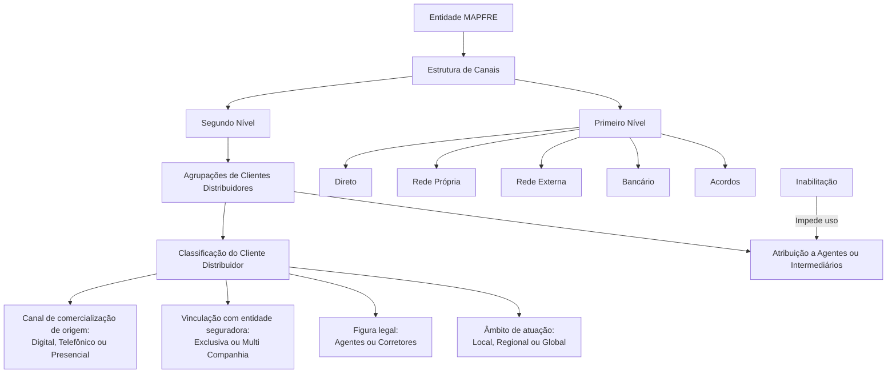

# Definição do Segundo Nível da Estrutura de Canais — Agrupações de Clientes Distribuidores

## 1. Metadados do Documento
- **Arquivo de Origem:** Não identificado no conteúdo fornecido
- **Tipo de Documento:** Especificação Técnica / Documentação Funcional
- **Domínio / Sistema:** Estrutura de Canais; Clientes Distribuidores; MAPFRE; Reef
- **Público-Alvo:** Desenvolvedores, Arquitetos, Analistas Funcionais e Operação
- **Data/Versão Identificada:** Não identificada
- **Owner identificado:** `user:agonzalez_mapfre.com`
- **Lifecycle identificado:** Approved

---

## 2. Resumo Executivo & Contexto de Negócio

O documento define o **segundo nível da Estrutura de Canais** utilizado para classificar Clientes Distribuidores no sistema. Essa classificação é denominada **Agrupações** e permite aprofundar a tipologia dos distribuidores segundo o canal de comercialização de origem, o vínculo com a entidade seguradora, a figura legal e o âmbito de atuação.

As Agrupações identificam características como origem Digital, Telefônica ou Presencial; vínculo Exclusivo ou Multi Companhia; natureza legal de Agentes ou Corretores; e atuação Local, Regional ou Global. O objetivo é permitir uma categorização corporativa padronizada dos distribuidores.

A relação de Agrupações principais, determinada corporativamente, deve ser configurada no segundo nível da Estrutura de Canais pelas entidades MAPFRE. O documento estabelece atributos gerais para definição desse nível, incluindo Companhia, Código do Primeiro Nível, Código do Segundo Nível, Descrição e Abreviatura.

A codificação do segundo nível é predefinida e não pode ser alterada localmente. O documento também estabelece que uma Agrupação pode ser inabilitada, impedindo seu uso na atribuição a Agentes ou Intermediários da Entidade.

---

## 3. Arquitetura, Componentes & Tecnologias Envolvidas

### Componentes e conceitos identificados

| Componente / Conceito | Descrição baseada no documento |
| :--- | :--- |
| Estrutura de Canais | Estrutura organizacional de canais que possui, no mínimo, Primeiro Nível e Segundo Nível. |
| Primeiro Nível | Nível da estrutura identificado pelas chaves: Direto, Rede Própria, Rede Externa, Bancário e Acordos. |
| Segundo Nível | Nível no qual devem ser configuradas as Agrupações corporativas de Clientes Distribuidores. |
| Cliente Distribuidor | Entidade classificada segundo canal de comercialização, vínculo com seguradora, figura legal e âmbito de atuação. |
| Agrupações | Tipologia utilizada para aprofundar a classificação dos Clientes Distribuidores. |
| Entidade MAPFRE | Entidade responsável por informar/configurar a relação de Agrupações no segundo nível. |
| Agentes ou Intermediários | Entidades às quais uma Agrupação pode ser atribuída, desde que não esteja inabilitada. |
| Reef | Plataforma ou repositório de documentação exibido no conteúdo fornecido. |



> **Nota de Análise:** O documento identifica o Reef como fonte de documentação, mas não descreve integrações técnicas, métodos HTTP, contratos JSON, bancos de dados, protocolos, ambientes de execução ou tecnologias de implementação.

---

## 4. Regras de Negócio, Especificações Funcionais & Processos

### 4.1 Finalidade das Agrupações

As Agrupações permitem aprofundar a tipologia de Clientes Distribuidores, identificando:

1. O canal de comercialização de origem do cliente:
   - Digital;
   - Telefônico;
   - Presencial.

2. A vinculação do Cliente Distribuidor com a entidade seguradora:
   - Exclusiva;
   - Multi Companhia.

3. A figura legal do Cliente Distribuidor:
   - Agentes;
   - Corretores.

4. O âmbito de atuação do Cliente Distribuidor:
   - Local;
   - Regional;
   - Global.

### 4.2 Configuração corporativa obrigatória

- As Agrupações principais foram determinadas corporativamente.
- A relação dessas Agrupações deve ser configurada no **segundo nível da Estrutura de Canais**.
- A configuração deve ser informada pelas entidades MAPFRE.
- A codificação preestabelecida para esse nível da Estrutura de Canais não pode ser alterada localmente, nem minimamente.

### 4.3 Atributos gerais do Segundo Nível

Para definir um Cliente Distribuidor no sistema, devem ser considerados os seguintes atributos:

1. **Companhia:** contém o código da companhia para a qual o Cliente Distribuidor está sendo definido no sistema.
2. **Código do Primeiro Nível:** identifica a chave do Primeiro Nível da Estrutura de Canais.
3. **Código do Segundo Nível:** identifica a chave do Segundo Nível da Estrutura de Canais.
4. **Descrição do Segundo Nível:** contém a denominação ou descrição da chave do nível da Estrutura de Canais.
5. **Abreviatura do Segundo Nível:** contém a denominação ou descrição da chave em formato abreviado.

> **Nota de Análise:** O conteúdo extraído apresenta uma inconsistência textual: as descrições de “Descrição do Segundo Nível” e “Abreviatura do Segundo Nível” mencionam “Primeiro Nível”, embora os próprios rótulos dos atributos indiquem que pertencem ao Segundo Nível. Esta observação não altera o texto-fonte nem permite inferir uma correção oficial.

### 4.4 Inabilitação

- A propriedade **Inabilitação** define que a Agrupação do Cliente Distribuidor está inabilitada.
- Uma Agrupação inabilitada não pode ser utilizada em sua atribuição a Agentes ou Intermediários da Entidade.

### 4.5 Documentos vinculados e leitura recomendada

O documento recomenda consultar os seguintes materiais para evitar interpretações isoladas e incorretas:

- Estrutura de Canais;
- Perguntas Frequentes.

---

## 5. Tabelas de Parâmetros, Ambientes e Estruturas de Dados

### 5.1 Atributos do Segundo Nível da Estrutura de Canais

| Item / Parâmetro | Descrição / Função | Tipo / Valores / Formato | Ambiente / Observações |
| :--- | :--- | :--- | :--- |
| Companhia | Contém o código da companhia para a qual o Cliente Distribuidor é definido no sistema. | Código de companhia; formato não especificado. | Aplicável à definição do Cliente Distribuidor. |
| Código do Primeiro Nível | Identifica a chave do Primeiro Nível da Estrutura de Canais. | Chave de canal. | Valores listados: Direto, Rede Própria, Rede Externa, Bancário e Acordos. |
| Código do Segundo Nível | Identifica a chave do Segundo Nível da Estrutura de Canais. | Chave numérica predefinida. | A codificação não pode ser alterada localmente. |
| Descrição do Segundo Nível | Contém a denominação ou descrição da chave do nível da Estrutura de Canais. | Texto. | O texto-fonte menciona “Primeiro Nível” na descrição, apesar do rótulo indicar Segundo Nível. |
| Abreviatura do Segundo Nível | Contém a denominação ou descrição da chave em formato abreviado. | Texto abreviado. | O texto-fonte menciona “Primeiro Nível” na descrição, apesar do rótulo indicar Segundo Nível. |
| Inabilitação | Define que uma Agrupação não pode ser utilizada. | Estado de inabilitação; valores não especificados. | Impede atribuição da Agrupação a Agentes ou Intermediários da Entidade. |

### 5.2 Valores do Código do Primeiro Nível

| Item / Parâmetro | Descrição / Função | Tipo / Valores / Formato | Ambiente / Observações |
| :--- | :--- | :--- | :--- |
| Código do Primeiro Nível | Identifica o primeiro nível da Estrutura de Canais. | Direto | Valor listado no documento. |
| Código do Primeiro Nível | Identifica o primeiro nível da Estrutura de Canais. | Rede Própria | Valor listado no documento. |
| Código do Primeiro Nível | Identifica o primeiro nível da Estrutura de Canais. | Rede Externa | Valor listado no documento. |
| Código do Primeiro Nível | Identifica o primeiro nível da Estrutura de Canais. | Bancário | Valor listado no documento. |
| Código do Primeiro Nível | Identifica o primeiro nível da Estrutura de Canais. | Acordos | Valor listado no documento. |

### 5.3 Catálogo de Códigos do Segundo Nível

| Item / Parâmetro | Descrição / Função | Tipo / Valores / Formato | Ambiente / Observações |
| :--- | :--- | :--- | :--- |
| Código do Segundo Nível | Oficinas Diretas | `10` / `OFD.` | Codificação corporativa preestabelecida. |
| Código do Segundo Nível | Direto Grandes Contas | `11` / `DGC.` | Codificação corporativa preestabelecida. |
| Código do Segundo Nível | Direto Digital | `12` / `DD.` | Codificação corporativa preestabelecida. |
| Código do Segundo Nível | Direto Telefônico | `13` / `DT.` | Codificação corporativa preestabelecida. |
| Código do Segundo Nível | Delegados | `24` / `DEL.` | Codificação corporativa preestabelecida. |
| Código do Segundo Nível | Agentes Exclusivos | `25` / `AG.EX.` | Codificação corporativa preestabelecida. |
| Código do Segundo Nível | Agentes Vinculados | `36` / `AG.V.` | Codificação corporativa preestabelecida. |
| Código do Segundo Nível | Agentes Não Vinculados | `37` / `AGNV.` | Codificação corporativa preestabelecida. |
| Código do Segundo Nível | Corretores Locais | `38` / `CORL.` | Codificação corporativa preestabelecida. |
| Código do Segundo Nível | Corretores Globais | `39` / `CORG.` | Codificação corporativa preestabelecida. |
| Código do Segundo Nível | Bancário | `410` / `BANC.` | Codificação corporativa preestabelecida. |
| Código do Segundo Nível | Acordos | `511` / `ACU.` | Codificação corporativa preestabelecida. |

### 5.4 Restrições de codificação

| Item / Parâmetro | Descrição / Função | Tipo / Valores / Formato | Ambiente / Observações |
| :--- | :--- | :--- | :--- |
| Codificação do catálogo de Agrupações | Define os códigos utilizados no Segundo Nível da Estrutura de Canais. | Códigos corporativamente preestabelecidos. | Não é possível alterar minimamente a codificação localmente. |
| Uso das Agrupações | Permite atribuir Agrupações a Agentes ou Intermediários. | Permitido somente para Agrupações não inabilitadas. | Uma Agrupação inabilitada não pode ser atribuída. |

---

## 6. Bateria de Perguntas & Respostas para RAG (FAQ Sintético)

### P1: Qual é o objetivo das Agrupações no Segundo Nível da Estrutura de Canais?
**R:** As Agrupações aprofundam a tipologia dos Clientes Distribuidores. Elas permitem classificá-los segundo o canal de comercialização de origem, o vínculo com a entidade seguradora, a figura legal e o âmbito de atuação.

### P2: Quais características de um Cliente Distribuidor podem ser identificadas pelas Agrupações?
**R:** As Agrupações permitem identificar o canal de origem — Digital, Telefônico ou Presencial —, o vínculo com a entidade seguradora — Exclusiva ou Multi Companhia —, a figura legal — Agentes ou Corretores — e o âmbito de atuação — Local, Regional ou Global.

### P3: Em qual nível da Estrutura de Canais devem ser configuradas as Agrupações corporativas?
**R:** A relação de Agrupações principais determinada corporativamente deve ser configurada no Segundo Nível da Estrutura de Canais.

### P4: As entidades MAPFRE podem alterar localmente os códigos do Segundo Nível?
**R:** Não. O documento estabelece que não é possível alterar, nem minimamente, a codificação preestabelecida no sistema para esse nível da Estrutura de Canais.

### P5: Quais são os valores citados para o Código do Primeiro Nível da Estrutura de Canais?
**R:** Os valores citados são: Direto, Rede Própria, Rede Externa, Bancário e Acordos.

### P6: O que representa o atributo Companhia na definição de um Cliente Distribuidor?
**R:** O atributo Companhia contém o código da companhia para a qual o Cliente Distribuidor está sendo definido no sistema.

### P7: Qual código e abreviatura devem ser usados para Direto Digital?
**R:** Direto Digital possui Código do Segundo Nível `12` e abreviatura `DD.`.

### P8: Qual código e abreviatura devem ser usados para Agentes Exclusivos?
**R:** Agentes Exclusivos possuem Código do Segundo Nível `25` e abreviatura `AG.EX.`.

### P9: Qual código identifica Corretores Globais no catálogo do Segundo Nível?
**R:** Corretores Globais são identificados pelo código `39` e pela abreviatura `CORG.`.

### P10: O que ocorre quando uma Agrupação está inabilitada?
**R:** Uma Agrupação inabilitada não pode ser utilizada em sua atribuição a Agentes ou Intermediários da Entidade.

### P11: Qual código e abreviatura devem ser usados para o canal Bancário?
**R:** O canal Bancário possui Código do Segundo Nível `410` e abreviatura `BANC.`.

### P12: Quais documentos devem ser consultados para evitar interpretação isolada da especificação?
**R:** O documento recomenda a leitura de “Estrutura de Canais” e “Perguntas frequentes”, pois a interpretação isolada do documento atual pode conduzir a erro.

---

## 7. Glossário de Termos, Siglas & Conceitos-Chave

- **Agrupações:** Classificações utilizadas para aprofundar a tipologia dos Clientes Distribuidores.
- **Cliente Distribuidor:** Cliente classificado conforme canal de comercialização, vínculo com entidade seguradora, figura legal e âmbito de atuação.
- **Estrutura de Canais:** Estrutura que organiza canais em níveis, incluindo Primeiro Nível e Segundo Nível.
- **Primeiro Nível:** Nível de classificação de canais com os valores Direto, Rede Própria, Rede Externa, Bancário e Acordos.
- **Segundo Nível:** Nível da Estrutura de Canais em que as Agrupações corporativas devem ser configuradas.
- **OFD.:** Abreviatura de Oficinas Diretas.
- **DGC.:** Abreviatura de Direto Grandes Contas.
- **DD.:** Abreviatura de Direto Digital.
- **DT.:** Abreviatura de Direto Telefônico.
- **DEL.:** Abreviatura de Delegados.
- **AG.EX.:** Abreviatura de Agentes Exclusivos.
- **AG.V.:** Abreviatura de Agentes Vinculados.
- **AGNV.:** Abreviatura de Agentes Não Vinculados.
- **CORL.:** Abreviatura de Corretores Locais.
- **CORG.:** Abreviatura de Corretores Globais.
- **BANC.:** Abreviatura de Bancário.
- **ACU.:** Abreviatura de Acordos.
- **Reef:** Nome exibido no cabeçalho da documentação fornecida; o documento não detalha seu significado ou função técnica.
- **MAPFRE:** Nome mencionado como entidade que deve informar/configurar a relação de Agrupações; o documento não expande a sigla.

---

## 8. Notas Críticas, Riscos & Limitações

- A codificação do Segundo Nível é corporativamente preestabelecida e não pode ser modificada localmente. Alterações locais representam desconformidade com a regra documentada.
- Uma Agrupação marcada como inabilitada não pode ser atribuída a Agentes ou Intermediários da Entidade.
- O documento recomenda consultar “Estrutura de Canais” e “Perguntas frequentes”, pois a leitura isolada pode conduzir a interpretações incorretas.
- O conteúdo não detalha como a configuração é criada, validada, persistida, publicada ou integrada a outros sistemas.
- O conteúdo não informa formatos técnicos, APIs, contratos de dados, responsáveis operacionais, fluxos de aprovação, ambientes, URLs, credenciais ou procedimentos de reversão.
- Há inconsistência textual nas descrições de “Descrição do Segundo Nível” e “Abreviatura do Segundo Nível”, que se referem à chave do “Primeiro Nível” apesar de os atributos estarem nomeados como pertencentes ao Segundo Nível.
- **Nota de Análise:** O documento lista códigos e abreviaturas, mas não explicita o mapeamento formal entre cada código do Segundo Nível e um valor específico do Primeiro Nível.

---

## 9. Conteúdo Bruto Estruturado (Referência Fiel)

```text
--- [PÁGINA 1 DE 2] ---

DEFINICIÓN del Segundo Nivel de la Estructura de Canales
Contexto
Las Agrupaciones nos permiten ahondar en la tipología de los clientes distribuidores identicando en ellos el canal de comercialización
origen del cliente (Digital, Telefónico o Presencial), su vinculación con la entidad aseguradora (si esta es exclusiva o multi compañía), su
gura legal (agentes o corredores) así como su ámbito de actuación (locales, regionales o globales).
Objetivo
Puesto que Corporativamente se han determinado las Agrupaciones principales por las cuales se debe informar desde las entidades
MAPFRE, esta relación se debe congurar en el segundo nivel de la estructura de canales.
Propiedades Generales
Otras Propiedades
Propiedades Generales
Compañía
Este atributo contiene el código de la compañía para la que se está deniendo el Cliente Distribuidor en el sistema.
Código del Primer Nivel
Este atributo identica la clave que identicará al Primer Nivel de la estructura de canales en el Sistema:
Directo.
Red Propia.
Red Externa.
Bancario.
Acuerdos.
Código del Segundo Nivel
Este atributo identica la clave que identicará al Segundo Nivel de la estructura de canales en el Sistema.
Descripción del Segundo Nivel
Esta propiedad contiene la denominación o descripción de la clave del Primer Nivel de la estructura de Canales.
Abreviatura del Segundo Nivel
Documentation / DOCUMENTACIÓN Reef
DOCUMENTACIÓN Reef
Mapfredocument
DOCUMENTACIÓN Reef
Owner
user:agonzalez_mapfre.com
Lifecycle
Approved Source
 / 
 VL
Buscar Inicio Soluciones Arquitecturas APIs Componentes Cloud Documentación Zeus Reef Ayuda
ES


--- [PÁGINA 2 DE 2] ---

Este Atributo contiene la denominación o descripción de la clave del Primer Nivel de la estructura de Canales en formato abreviado.
La codicación y nomenclatura de la estructura quedaría como:
Clave del Segundo Nivel Descripción Abreviatura
10 Ocinas Directas OFD.
11 Directo Grandes Cuentas DGC.
12 Directo Digital DD.
13 Directo Telefónico DT.
24 Delegados DEL.
25 Agentes Exclusivos AG.EX.
36 Agentes Vinculados AG.V.
37 Agentes No Vinculados AGNV.
38 Corredores Locales CORL.
39 Corredores Globales CORG.
410 Bancario BANC.
511 Acuerdos ACU.
Otras Propiedades
Inhabilitación
Esta propiedad establece que la Agrupación del Cliente Distribuidor está inhabilitada para poder ser utilizada en su asignación a los Agentes
o Intermediarios de la Entidad.
Vínculos
Relación de Directrices y Documentos funcionales cuya lectura recomendada para evitar que la interpretación aislada del presente
documento pueda conducir a error.
Estructura de Canales
Preguntas frecuentes
1 ¿Existe alguna premisa que deba ser tomada en consideración localmente en la codicación, uso y denición del catálogo de Agrupaciones
en el Sistema?
No es posible alterar la codicación mínimamente preestablecida en el sistema para este Nivel de la Estructura de Canales.
```
