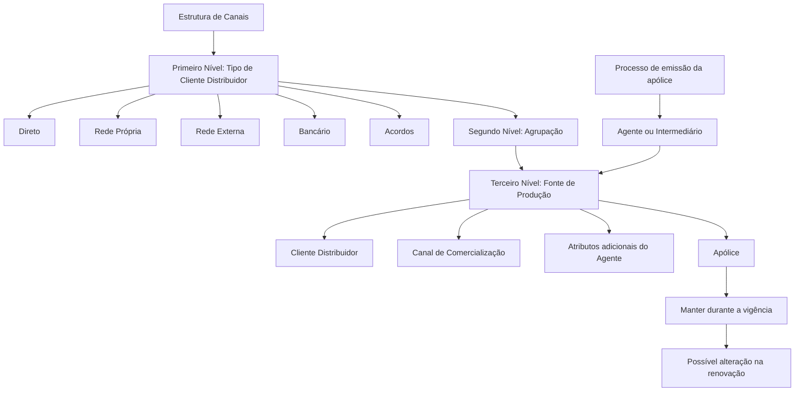

# Definição do Terceiro Nível da Estrutura de Canais — Fontes de Produção

## 1. Metadados do Documento
- **Arquivo de Origem:** Não identificado no conteúdo extraído
- **Tipo de Documento:** Especificação Funcional
- **Domínio / Sistema:** Reef / Estrutura de Canais / Fontes de Produção
- **Público-Alvo:** Arquitetos, analistas funcionais, desenvolvedores, operação e equipes locais das entidades MAPFRE
- **Data/Versão Identificada:** Não identificada

---

## 2. Resumo Executivo & Contexto de Negócio

O documento define as **Fontes de Produção** como o terceiro nível da Estrutura de Canais. Uma Fonte de Produção identifica, classifica operacionalmente e diferencia subconjuntos de agentes da rede comercial com características semelhantes. A finalidade é permitir que uma apólice registre, de forma unívoca e inequívoca, o Cliente Distribuidor, o Canal de Comercialização e atributos adicionais do agente responsável pela comercialização.

Cada Fonte de Produção deve pertencer univocamente a um Cliente Distribuidor e a uma de suas Agrupações. Fontes de Produção distintas devem diferenciar-se por pelo menos um critério considerado relevante localmente pela entidade seguradora para classificar a rede comercial. A granularidade do catálogo é responsabilidade das entidades MAPFRE, desde que permaneça sincronizada com as classificações corporativas de Agrupações e Clientes Distribuidores.

O modelo apresenta critérios gerais de classificação aplicáveis às tipologias de Clientes Distribuidores: vínculo com a entidade seguradora, localização física de fechamento da venda, oferta ou portfólio de produtos do agente e canal de comercialização de origem do cliente. Os canais de comercialização explicitamente citados são Presencial, Digital e Telefônico.

As Fontes de Produção são vinculadas aos Agentes durante o processo de emissão de apólices. Essa associação deve ser mantida durante toda a vigência da apólice e até uma eventual renovação; somente no momento da renovação a Fonte de Produção poderá ser modificada. O objetivo funcional declarado é configurar essas fontes no terceiro nível da Estrutura de Canais.

---

## 3. Arquitetura, Componentes & Tecnologias Envolvidas

Os componentes funcionais identificados são:

| Componente | Papel no domínio |
| :--- | :--- |
| Estrutura de Canais | Estrutura organizacional composta por níveis de classificação de canais. |
| Primeiro Nível | Tipo de Cliente Distribuidor: Direto, Rede Própria, Rede Externa, Bancário ou Acordos. |
| Segundo Nível | Agrupação associada ao Tipo de Cliente Distribuidor. |
| Terceiro Nível | Fonte de Produção que identifica a classificação operacional específica no sistema. |
| Cliente Distribuidor | Entidade à qual uma Fonte de Produção pertence univocamente. |
| Agente ou Intermediário | Entidade à qual a Fonte de Produção pode ser atribuída no processo de emissão. |
| Apólice | Registro para o qual a Fonte de Produção identifica Cliente Distribuidor, canal e atributos do agente. |
| Entidade MAPFRE | Responsável por analisar e determinar a granularidade local das Fontes de Produção. |
| Reef | Repositório ou contexto documental identificado no conteúdo como “DOCUMENTACIÓN Reef”. |



**Nota de Análise:** O documento descreve a estrutura funcional e exemplos de codificação, mas não detalha APIs, métodos HTTP, contratos JSON, banco de dados, tecnologias de implementação, ambientes de execução ou mecanismos de integração.

---

## 4. Regras de Negócio, Especificações Funcionais & Processos

### 4.1 Definição e unicidade da Fonte de Produção

1. Uma Fonte de Produção identifica e classifica operacionalmente subconjuntos de agentes da rede comercial que possuem características similares.
2. Cada Fonte de Produção deve pertencer univocamente:
   - A um Cliente Distribuidor.
   - A uma Agrupação pertencente ao respectivo Cliente Distribuidor.
3. Uma Fonte de Produção deve distinguir-se das demais Fontes de Produção por pelo menos um critério considerado relevante pela entidade seguradora local.
4. Uma Fonte de Produção é um atributo que identifica, no sistema e para uma apólice determinada:
   - O Cliente Distribuidor.
   - O Canal de Comercialização.
   - Outros atributos adicionais do Agente responsável pela comercialização.

### 4.2 Critérios gerais de classificação

Os quatro critérios comuns às tipologias de Clientes Distribuidores são:

1. Vínculo com a entidade seguradora.
2. Localização física onde a venda é concluída.
3. Oferta ou portfólio de produtos do agente.
4. Canal de comercialização de origem do cliente:
   - Presencial.
   - Digital.
   - Telefônico.

O documento informa que nem todos os cruzamentos entre os critérios são necessariamente possíveis ou relevantes.

### 4.3 Critérios por Tipo de Cliente Distribuidor

#### Cliente Distribuidor Direto

A classificação pode considerar:

- Marca da entidade seguradora, incluindo exemplos como MAPFRE, VERTI e INSURED&GO.
- Tipo de cliente de origem, incluindo Governo, grandes contas, coletivos e affinities.

#### Cliente Distribuidor Rede Própria — Agencial

A classificação pode considerar:

- Se o agente é ou não subvencionado.
- Se o agente é ou não empregado da entidade seguradora.

#### Cliente Distribuidor Rede Externa — Corretores

A classificação pode considerar:

- Figura legal: Agentes ou Corretores.
- Âmbito de atuação do agente: Locais ou Globais.

#### Cliente Distribuidor Bancário

A classificação pode considerar:

- Estrutura societária:
  - Joint Venture.
  - Joint Venture virtual.
  - Acordo de distribuição.
- Responsabilidade pela exploração operacional do cliente:
  - Banco.
  - MAPFRE.
- Exclusividade do acordo de distribuição:
  - Total.
  - Parcial.
- Existência de cosseguro no acordo de distribuição.

#### Cliente Distribuidor Acordos

A classificação pode considerar:

- Setor de atividade:
  - Automotivo.
  - Retailers.
  - Financeiras.
  - Utilities.
- Responsabilidade pela exploração operacional do cliente:
  - Distribuidor.
  - MAPFRE.

### 4.4 Ciclo de vida da associação com a apólice

1. A Fonte de Produção é vinculada ao Agente no processo de emissão da apólice.
2. A associação deve ser mantida durante o período de vigência da apólice.
3. A associação deve ser mantida até a possível renovação.
4. A Fonte de Produção poderá ser modificada no momento da renovação.


### 4.5 Inabilitação

A propriedade **Inhabilitación** determina que a Fonte de Produção do Cliente Distribuidor está inabilitada para utilização na atribuição a Agentes ou Intermediários da Entidade.

### 4.6 Responsabilidade local

As entidades MAPFRE devem analisar e determinar a granularidade de suas Fontes de Produção conforme as necessidades operacionais locais. Essa definição local não deve perder de vista a sincronização com as classificações corporativas de Agrupações e Clientes Distribuidores.

---

## 5. Tabelas de Parâmetros, Ambientes e Estruturas de Dados

### 5.1 Propriedades gerais do Terceiro Nível

| Item / Parâmetro | Descrição / Função | Tipo / Valores / Formato | Ambiente / Observações |
| :--- | :--- | :--- | :--- |
| Companhia | Contém o código da companhia para a qual a chave da Fonte de Produção é definida no sistema. | Código de companhia | Propriedade geral. |
| Código do Primeiro Nível | Identifica a chave do Primeiro Nível da Estrutura de Canais ou Tipo de Cliente Distribuidor. | Direto; Rede Própria; Rede Externa; Bancário; Acordos | Propriedade geral. |
| Código do Segundo Nível | Identifica a chave do Segundo Nível da Estrutura de Canais ou Agrupação. | Ver agrupações documentadas | Propriedade geral. |
| Código do Terceiro Nível | Identifica a chave do Terceiro Nível da Estrutura de Canais ou Fonte de Produção. | Chave/código | Propriedade geral. |
| Descrição do Terceiro Nível | Contém a denominação ou descrição da chave do Terceiro Nível ou Fonte de Produção do Cliente Distribuidor. | Texto descritivo | Propriedade geral. |
| Abreviatura do Terceiro Nível | Contém a denominação ou descrição abreviada da chave do Terceiro Nível. | Texto abreviado | Propriedade geral. |
| Inhabilitación | Determina que a Fonte de Produção não pode ser utilizada na atribuição a Agentes ou Intermediários. | Estado de inabilitação | Outras propriedades. |

### 5.2 Tipos de Cliente Distribuidor — Primeiro Nível

| Item / Parâmetro | Descrição / Função | Tipo / Valores / Formato | Ambiente / Observações |
| :--- | :--- | :--- | :--- |
| Direto | Tipo de Cliente Distribuidor no Primeiro Nível. | Direto | Pode considerar marca e tipo de cliente de origem. |
| Rede Própria | Tipo de Cliente Distribuidor no Primeiro Nível. | Rede Própria | Inclui contexto agencial. |
| Rede Externa | Tipo de Cliente Distribuidor no Primeiro Nível. | Rede Externa | Inclui agentes, corretores, atuação local ou global. |
| Bancário | Tipo de Cliente Distribuidor no Primeiro Nível. | Bancário | Considera estrutura societária, responsabilidade, exclusividade e cosseguro. |
| Acordos | Tipo de Cliente Distribuidor no Primeiro Nível. | Acordos | Considera setor e responsabilidade operacional. |

### 5.3 Agrupações — Segundo Nível

| Item / Parâmetro | Descrição / Função | Tipo / Valores / Formato | Ambiente / Observações |
| :--- | :--- | :--- | :--- |
| Oficinas Diretas | Agrupação do Segundo Nível. | Agrupação | Associada à Estrutura de Canais. |
| Direto Grandes Contas | Agrupação do Segundo Nível. | Agrupação | Associada à Estrutura de Canais. |
| Direto Digital | Agrupação do Segundo Nível. | Agrupação | Associada à Estrutura de Canais. |
| Direto Telefônico | Agrupação do Segundo Nível. | Agrupação | Associada à Estrutura de Canais. |
| Delegados | Agrupação do Segundo Nível. | Agrupação | Associada à Estrutura de Canais. |
| Agentes Exclusivos | Agrupação do Segundo Nível. | Agrupação | Associada à Estrutura de Canais. |
| Agentes Vinculados | Agrupação do Segundo Nível. | Agrupação | Associada à Estrutura de Canais. |
| Agentes Não Vinculados | Agrupação do Segundo Nível. | Agrupação | Associada à Estrutura de Canais. |
| Corretores Locais | Agrupação do Segundo Nível. | Agrupação | Associada à Estrutura de Canais. |
| Corretores Globais | Agrupação do Segundo Nível. | Agrupação | Associada à Estrutura de Canais. |
| Bancário | Agrupação do Segundo Nível. | Agrupação | Associada à Estrutura de Canais. |
| Acordos | Agrupação do Segundo Nível. | Agrupação | Associada à Estrutura de Canais. |

### 5.4 Exemplos ilustrativos de Fontes de Produção — Cliente Distribuidor Direto

| Item / Parâmetro | Descrição / Função | Tipo / Valores / Formato | Ambiente / Observações |
| :--- | :--- | :--- | :--- |
| 1001 | Produção Telefônica - Oficina Direta - Multi Produto | Chave do Terceiro Nível | Exemplo ilustrativo; Cliente Distribuidor Direto, canal Telefônico e vínculo Exclusivo. |
| 1002 | Produção Telefônica - Oficina Direta - Específica | Chave do Terceiro Nível | Exemplo ilustrativo; Cliente Distribuidor Direto, canal Telefônico e vínculo Exclusivo. |
| 1003 | Contact Center Próprio | Chave do Terceiro Nível | Exemplo ilustrativo. |
| 1004 | Contact Center Próprio Exclusivo | Chave do Terceiro Nível | Exemplo ilustrativo. |
| 1005 | Contact Center Próprio | Chave do Terceiro Nível | Exemplo ilustrativo. |
| 1006 | Contact Center Próprio Exclusivo | Chave do Terceiro Nível | Exemplo ilustrativo. |

### 5.5 Exemplos ilustrativos de Fontes de Produção — Rede Própria

| Item / Parâmetro | Descrição / Função | Tipo / Valores / Formato | Ambiente / Observações |
| :--- | :--- | :--- | :--- |
| 2401 | Delegado MAPFRE | Chave do Terceiro Nível | Exemplo ilustrativo; Rede Própria, canal Presencial e vínculo Exclusivo. |
| 2402 | Delegado Específico MAPFRE | Chave do Terceiro Nível | Exemplo ilustrativo; Rede Própria, canal Presencial e vínculo Exclusivo. |
| 2501 | Agente Exclusivo | Chave do Terceiro Nível | Exemplo ilustrativo; Rede Própria, canal Presencial e vínculo Exclusivo. |
| 2502 | Agente Exclusivo Específico | Chave do Terceiro Nível | Exemplo ilustrativo; Rede Própria, canal Presencial e vínculo Exclusivo. |

---

## 6. Bateria de Perguntas & Respostas para RAG (FAQ Sintético)

### P1: O que é uma Fonte de Produção na Estrutura de Canais?
**R:** Uma Fonte de Produção é o atributo do Terceiro Nível da Estrutura de Canais que identifica, de forma unívoca e inequívoca no sistema e para uma apólice determinada, o Cliente Distribuidor, o Canal de Comercialização e atributos adicionais do Agente que comercializou a apólice.

### P2: A que entidades uma Fonte de Produção deve estar vinculada?
**R:** Cada Fonte de Produção deve pertencer univocamente a um Cliente Distribuidor e a uma Agrupação desse Cliente Distribuidor.

### P3: Quais são os critérios gerais usados para classificar Fontes de Produção?
**R:** Os critérios gerais são: vínculo com a entidade seguradora, localização física onde a venda é concluída, oferta ou portfólio de produtos do agente e canal de comercialização de origem do cliente. Os canais explicitamente citados são Presencial, Digital e Telefônico.

### P4: Quais valores compõem o Primeiro Nível da Estrutura de Canais?
**R:** O Primeiro Nível, denominado Tipo de Cliente Distribuidor, possui os valores Direto, Rede Própria, Rede Externa, Bancário e Acordos.

### P5: Quando a Fonte de Produção pode ser modificada para uma apólice?
**R:** A Fonte de Produção é vinculada ao Agente durante a emissão da apólice e deve permanecer durante toda a vigência. A modificação da Fonte de Produção poderá ocorrer no momento de uma possível renovação da apólice.

### P6: Quais critérios podem ser usados para classificar um Cliente Distribuidor Bancário?
**R:** Um Cliente Distribuidor Bancário pode ser classificado pela estrutura societária — Joint Venture, Joint Venture virtual ou Acordo de distribuição —, pela responsabilidade operacional atribuída ao Banco ou à MAPFRE, pela exclusividade total ou parcial do acordo e pela existência ou não de cosseguro.

### P7: O que ocorre quando a propriedade Inhabilitación é aplicada a uma Fonte de Produção?
**R:** A propriedade Inhabilitación estabelece que a Fonte de Produção do Cliente Distribuidor fica inabilitada para ser utilizada na sua atribuição a Agentes ou Intermediários da Entidade.

### P8: Quem define a granularidade local das Fontes de Produção?
**R:** As entidades MAPFRE são responsáveis por analisar e determinar a granularidade das Fontes de Produção segundo as necessidades operacionais locais, mantendo a sincronização com as classificações corporativas de Agrupações e Clientes Distribuidores.

### P9: Como a Rede Externa — Corretores pode ser classificada?
**R:** A Rede Externa — Corretores pode ser classificada pela figura legal, distinguindo Agentes de Corretores, e pelo âmbito de atuação do agente, distinguindo atuação Local de Global.

### P10: Quais são os exemplos de Fontes de Produção para Rede Própria com canal Presencial e vínculo Exclusivo?
**R:** Os exemplos apresentados são: código 2401, Delegado MAPFRE; código 2402, Delegado Específico MAPFRE; código 2501, Agente Exclusivo; e código 2502, Agente Exclusivo Específico.

### P11: Quais critérios podem diferenciar fontes de produção de um Cliente Distribuidor Direto?
**R:** Para o Cliente Distribuidor Direto, os critérios incluem a marca da entidade seguradora, como MAPFRE, VERTI e INSURED&GO, e o tipo de cliente de origem, como Governo, grandes contas, coletivos e affinities.

### P12: O documento detalha integrações técnicas, APIs ou contratos de dados para Fontes de Produção?
**R:** Não. O documento define a classificação funcional, as propriedades e exemplos de codificação das Fontes de Produção, mas não apresenta métodos HTTP, APIs, contratos JSON, tecnologias de implementação ou estruturas físicas de dados.

---

## 7. Glossário de Termos, Siglas & Conceitos-Chave

- **Agrupação:** Segundo Nível da Estrutura de Canais associado a um Tipo de Cliente Distribuidor.
- **Canal de Comercialização:** Canal de origem ou realização da comercialização; o documento cita Presencial, Digital e Telefônico.
- **Cliente Distribuidor:** Entidade à qual uma Fonte de Produção pertence univocamente.
- **Cosseguro:** Característica indicada para verificar se um acordo de distribuição bancário está ou não em cosseguro.
- **Fonte de Produção:** Terceiro Nível da Estrutura de Canais que identifica Cliente Distribuidor, Canal de Comercialização e atributos adicionais do Agente para uma apólice.
- **Inhabilitación:** Propriedade que impede o uso de uma Fonte de Produção na atribuição a Agentes ou Intermediários.
- **Joint Venture:** Estrutura societária citada como critério de classificação do Cliente Distribuidor Bancário.
- **MAPFRE:** Entidade seguradora mencionada no documento e responsável, em suas entidades locais, pela definição da granularidade das Fontes de Produção.
- **Reef:** Contexto documental identificado como “DOCUMENTACIÓN Reef”.
- **Rede Externa:** Tipo de Cliente Distribuidor associado, no documento, a Agentes ou Corretores.
- **Rede Própria:** Tipo de Cliente Distribuidor associado ao contexto agencial.
- **Terceiro Nível:** Nível da Estrutura de Canais correspondente à Fonte de Produção.

---

## 8. Notas Críticas, Riscos & Limitações

- A granularidade das Fontes de Produção é definida localmente pelas entidades MAPFRE; variações locais devem continuar sincronizadas com as classificações corporativas de Agrupações e Clientes Distribuidores.
- Nem todos os cruzamentos entre os critérios de classificação são necessariamente possíveis ou relevantes.
- A interpretação isolada do documento pode conduzir a erro; o próprio conteúdo recomenda a leitura dos documentos vinculados **Estrutura de Canais**, **Relação de Agentes e Fontes de Produção** e **Perguntas frequentes**.
- A Fonte de Produção deve permanecer associada à apólice durante toda a vigência, limitando alterações antes da renovação.
- A propriedade Inhabilitación impede atribuição da Fonte de Produção a Agentes ou Intermediários.
- O documento não detalha o gráfico mencionado para as Fontes de Produção mais utilizadas na Rede Externa.
- **Nota de Análise:** Não há detalhamento de interfaces técnicas, persistência, validações de campos, regras de geração de códigos, permissões de usuários, integrações ou contratos de dados.

---

## 9. Conteúdo Bruto Estruturado (Referência Fiel)

```text
--- [PÁGINA 1 DE 4] ---

DEFINICIÓN del Tercer Nivel de la Estructura de Canales
Contexto
Las Fuentes de Producción identifican y clasifican operativamente a los subconjuntos de agentes de la red comercial que cuentan con
similares características.
Cada fuente de producción definida debe pertenecer unívocamente a un cliente distribuidor y a una de sus agrupaciones debiendo
distinguirse del resto de sus fuentes de producción por al menos uno de los criterios que localmente la entidad aseguradora haya
considerado relevantes para clasificar a su red comercial.”
Los cuatro criterios comunes a todas las tipologías de Clientes Distribuidores (si bien no todos sus cruces son posibles o relevantes) son:
Por su vinculación con la entidad aseguradora.
Por la ubicación física en la que se cierra la venta.
Por la oferta o porfolio de productos del agente.
Por el canal de comercialización origen del cliente (Presencial, Digital o Telefónico).
En el caso del Tipo de Cliente Distribuidor Directo los criterios son:
Por la marca de la entidad aseguradora ( MAPFRE, VERTI, INSURED&GO,…).
Por el tipo de cliente origen (Gobierno, grandes cuentas, colectivos, affinities,…).
En el caso del Tipo de Cliente Distribuidor Red Propia - Agencial:
Si el agente está o no subvencionado.
Si el agente es o no un empleado de la entidad aseguradora.
En el caso del Tipo de Cliente Distribuidor Red Externa - Corredores:
Por su figura legal (Agentes o Corredores)
Por el ámbito de actuación del agente (Locales o Globales)
En el caso del Tipo de Cliente Distribuidor Bancario:
Por la estructura societaria: Joint Venture, Joint Venture virtual, Acuerdo de distribución.
Si la responsabilidad en la explotación operativa del cliente la tiene el Banco o MAPFRE.
Si la exclusividad del acuerdo de distribución es Total o Parcial.
Si el acuerdo de distribución está o no en Coaseguro.
En el caso del Tipo de Cliente Distribuidor Acuerdos:
Por el sector de actividad: Automoción, Retailers, Financieras, Utilities,…
Documentation / DOCUMENTACIÓN Reef
DOCUMENTACIÓN Reef
Mapfredocument
DOCUMENTACIÓN Reef
Owner
user:agonzalez_mapfre.com
Lifecycle
Approved Source
 /
VL
Buscar Inicio Soluciones Arquitecturas APIs Componentes Cloud Documentación Zeus Reef Ayuda
ES

--- [PÁGINA 2 DE 4] ---

Si la responsabilidad en la explotación operativa del cliente recae en el Distribuidor o en MAPFRE.
Una Fuente de Producción es un atributo que identifica unívoca e inequívocamente en el sistema y para una póliza determinada cual es el
Cliente Distribuidor, el [Canal de Comercialización] y otros atributos adicionales del Agente que la ha comercializado.
Las Fuentes de Producción están vinculadas a los Agentes en el proceso de emisión de las pólizas debiendo mantenerse durante su
periodo de vigencia y hasta su posible renovación, momento en el cual podrá ser modificada.
Objetivo
Configurar las Fuentes de Producción en el tercer nivel de la estructura de canales.
Propiedades Generales
Otras Propiedades
Propiedades Generales
Compañía
Este atributo contiene el código de la compañía para la que se está definiendo la clave de la Fuente de Producción en el sistema.
Código del Primer Nivel
Este atributo identifica la clave que identificará al Primer Nivel de la estructura de canales o Tipos de Clientes Distribuidores en el Sistema:
Directo.
Red Propia.
Red Externa.
Bancario.
Acuerdos.
Código del Segundo Nivel
Este atributo identifica la clave que identificará al Segundo Nivel de la estructura de canales o Agrupaciones en el Sistema:
Oficinas Directas.
Directo Grandes Cuentas.
Directo Digital.
Directo Telefónico.
Delegados.
Agentes Exclusivos.
Agentes Vinculados.
Agentes No Vinculados.
Corredores Locales.
Corredores Globales.
Bancario.
Acuerdos.
Código del Tercer Nivel
Este atributo identificará la clave del Tercer Nivel de la estructura de canales o Fuentes de Producción en el Sistema.
Descripción del Tercer Nivel
Esta propiedad contiene la denominación o descripción de la clave del Tercer Nivel de la estructura de Canales o Fuente de Producción del
Cliente Distribuidor.

--- [PÁGINA 3 DE 4] ---

Abreviatura del Tercer Nivel
Este Atributo contiene la denominación o descripción de la clave del Tercer Nivel de la estructura de Canales en formato abreviado.
De manera ilustrativa y no exhaustiva, la codificación y nomenclatura de las Fuentes de Producción en el sistema para un Cliente Distribuidor
de tipo 'Directo', un canal de venta 'Telefónico' y una vinculación 'Exclusiva', atendiendo a su ubicación y oferta de productos podría quedar
como:
Clave del Tercer Nivel Descripción
1001 Producción Telefónica - Oficina Directa - Multi Producto
1002 Producción Telefónica - Oficina Directa - Específica
1003 Contact Center Propio
1004 Contact Center Propio Exclusivo
1005 Contact Center Propio
1006 Contact Center Propio Exclusivo
En cambio, la codificación y nomenclatura de las Fuentes de Producción en el sistema para un Cliente Distribuidor de tipo 'Red Propia', un
canal de venta 'Presencial' y una vinculación 'Exclusiva', atendiendo a su ubicación y oferta de productos podría quedar como:
Clave del Tercer Nivel Descripción
2401 Delegado MAPFRE
2402 Delegado Específico MAPFRE
2501 Agente Exclusivo
2502 Agente Exclusivo Específico
De manera gráfica, las Fuentes de Producción más comunmente utilizadas en la RED EXTERNA de las compañías podrían contemplar los
criterios:

--- [PÁGINA 4 DE 4] ---

Otras Propiedades
Inhabilitación
Esta propiedad establece que la Fuente de Producción del Cliente Distribuidor está inhabilitada para poder ser utilizada en su asignación a los
Agentes o Intermediarios de la Entidad.
Vínculos
Relación de Directrices y Documentos funcionales cuya lectura recomendada para evitar que la interpretación aislada del presente
documento pueda conducir a error.
Estructura de Canales
Relación de Agentes y Fuentes de Producción
Preguntas frecuentes
1 ¿Existe alguna premisa que deba ser tomada en consideración localmente en la codificación, uso y definición del catálogo de Fuentes de
Producción en el Sistema?
En las entidades MAPFRE recae la responsabilidad de analizar y determinar la granularidad de sus Fuentes de Producción de acuerdo con las
necesidades operativas locales pero sin perder de vista que tienen que estar sincronizadas con las clasificaciones corporativas de
Agrupaciones y Clientes Distribuidores.
```
