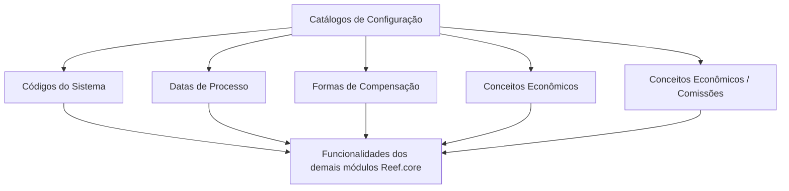

# Definição de Outros Catálogos Gerais/Transversais do Sistema Reef.core

## 1. Metadados do Documento
- **Arquivo de Origem:** Não identificado no conteúdo fornecido
- **Tipo de Documento:** Documentação funcional / guia de configuração
- **Domínio / Sistema:** Reef.core
- **Público-Alvo:** Equipes responsáveis por configuração de entidades e módulos Reef.core
- **Data/Versão Identificada:** Não identificada

---

## 2. Resumo Executivo & Contexto de Negócio

O documento apresenta o tema **“Definición de Otros CATÁLOGOS GENERALES/TRANSVERSALES del SISTEMA”**, relacionado ao sistema Reef.core. O propósito declarado é permitir o conhecimento dos catálogos e da ordem de configuração necessária para habilitar funcionalidades dos demais módulos da plataforma Reef.core em uma entidade.

Os catálogos citados são tratados como elementos de configuração gerais ou transversais. O conteúdo disponível identifica explicitamente os seguintes grupos: **Códigos do Sistema**, **Datas de Processo**, **Formas de Compensação**, **Conceitos Econômicos** e **Conceitos Econômicos / Comissões**.

O documento sugere uma dependência operacional entre a configuração desses catálogos e a habilitação de funcionalidades em outros módulos Reef.core. Entretanto, o trecho não descreve a sequência concreta de configuração, regras de preenchimento, responsáveis, interfaces, telas, contratos de integração ou critérios de validação.

A origem aparente está associada ao repositório de documentação Reef, com referência a **Mapfredocument**, ciclo de vida **Approved**, proprietário `user:agonzalez_mapfre.com` e marcador `VL`.

---

## 3. Arquitetura, Componentes & Tecnologias Envolvidas

Os componentes e domínios explicitamente mencionados são:

| Componente / Elemento | Papel identificado no conteúdo |
| :--- | :--- |
| Reef.core | Sistema ao qual pertencem os catálogos transversais e os módulos cuja funcionalidade pode ser habilitada. |
| Outros módulos de Reef.core | Módulos que dependem da configuração dos catálogos citados. |
| Catálogos de Configuração | Grupo de catálogos gerais/transversais do sistema. |
| Mapfredocument | Referência apresentada na navegação/documentação. |
| DOCUMENTACIÓN Reef | Área ou repositório documental apresentado no conteúdo. |
| Zeus | Item exibido na navegação; o papel técnico não é detalhado. |
| Cloud | Item exibido na navegação; o papel técnico não é detalhado. |



**Nota de Análise:** O diagrama representa exclusivamente a relação declarada entre catálogos de configuração e habilitação de funcionalidades dos módulos Reef.core. O documento não detalha fluxos técnicos, APIs, bancos de dados, protocolos, tecnologias de implementação ou ordem efetiva de configuração.

---

## 4. Regras de Negócio, Especificações Funcionais & Processos

### Objetivo funcional declarado

O objetivo do conteúdo é:

> Conhecer os catálogos e a ordem de configuração dos mesmos para habilitar na entidade as funcionalidades do restante dos módulos de Reef.core.

### Catálogos de configuração identificados

1. **Códigos do Sistema**
2. **Datas de Processo**
3. **Formas de Compensação**
4. **Conceitos Econômicos**
5. **Conceitos Econômicos / Comissões**

### Dependência funcional identificada

- A configuração dos catálogos é apresentada como necessária para habilitar funcionalidades dos demais módulos Reef.core em uma entidade.
- O conteúdo indica que existe uma **ordem de configuração**, mas não especifica qual catálogo deve ser configurado primeiro, nem as dependências entre cada catálogo.
- O conteúdo não informa campos, valores permitidos, regras de cálculo, validações, permissões, exceções ou comportamento em caso de configuração incompleta.

**Nota de Análise:** O documento lista os catálogos de configuração, porém não detalha o processo operacional, os critérios de validação ou a sequência de configuração aplicável a cada catálogo.

---

## 5. Tabelas de Parâmetros, Ambientes e Estruturas de Dados

| Item / Parâmetro | Descrição / Função | Tipo / Valores / Formato | Ambiente / Observações |
| :--- | :--- | :--- | :--- |
| Códigos do Sistema | Catálogo de configuração mencionado para Reef.core. | Não detalhado. | A relação com módulos específicos não é detalhada. |
| Datas de Processo | Catálogo de configuração mencionado para Reef.core. | Não detalhado. | Não são informados formatos de data, calendário ou regras de processo. |
| Formas de Compensação | Catálogo de configuração mencionado para Reef.core. | Não detalhado. | Não são apresentadas opções, códigos ou regras de elegibilidade. |
| Conceitos Econômicos | Catálogo de configuração mencionado para Reef.core. | Não detalhado. | Não são descritos atributos, cálculos ou integrações. |
| Conceitos Econômicos / Comissões | Catálogo de configuração relacionado a conceitos econômicos e comissões. | Não detalhado. | Não são apresentadas regras de comissão. |
| Owner | Proprietário informado na documentação. | `user:agonzalez_mapfre.com` | Exibido no cabeçalho documental. |
| Lifecycle | Estado de ciclo de vida da documentação. | `Approved` | Exibido no cabeçalho documental. |
| Marcador | Identificador ou rótulo exibido no cabeçalho. | `VL` | Sem detalhamento adicional. |
| Idioma | Idioma apresentado na interface documental. | `ES` | O conteúdo principal está em espanhol. |

---

## 6. Bateria de Perguntas & Respostas para RAG (FAQ Sintético)

### P1: Qual é o objetivo da documentação sobre outros catálogos gerais/transversais do sistema?
**R:** O objetivo é conhecer os catálogos e a ordem de configuração necessária para habilitar, em uma entidade, as funcionalidades do restante dos módulos de Reef.core.

### P2: Qual sistema é mencionado como consumidor dos catálogos de configuração?
**R:** O sistema mencionado é o Reef.core. O conteúdo afirma que a configuração dos catálogos permite habilitar funcionalidades dos demais módulos Reef.core.

### P3: Quais catálogos de configuração são listados no documento?
**R:** O documento lista Códigos do Sistema, Datas de Processo, Formas de Compensação, Conceitos Econômicos e Conceitos Econômicos / Comissões.

### P4: O documento informa a sequência detalhada para configurar os catálogos Reef.core?
**R:** Não. O documento afirma que existe uma ordem de configuração, mas o trecho fornecido não apresenta a sequência entre Códigos do Sistema, Datas de Processo, Formas de Compensação, Conceitos Econômicos e Conceitos Econômicos / Comissões.

### P5: O documento especifica quais campos devem ser preenchidos no catálogo Códigos do Sistema?
**R:** Não. Códigos do Sistema é apenas listado como catálogo de configuração; não há atributos, formatos, valores permitidos ou regras de validação descritos.

### P6: Existem regras de cálculo de comissões na documentação fornecida?
**R:** Não. O conteúdo cita o catálogo Conceitos Econômicos / Comissões, mas não define fórmulas, percentuais, condições, faixas ou critérios para cálculo de comissões.

### P7: Há informações sobre APIs, métodos HTTP ou contratos de integração para Reef.core?
**R:** Não. O trecho não descreve APIs, métodos HTTP, payloads JSON, integrações, protocolos ou contratos técnicos.

### P8: Qual é o ciclo de vida identificado para a documentação Reef?
**R:** O ciclo de vida exibido é `Approved`.

### P9: Quem é o proprietário identificado no cabeçalho da documentação?
**R:** O proprietário exibido é `user:agonzalez_mapfre.com`.

### P10: O documento apresenta detalhes de ambientes, servidores, URLs ou rotas de log?
**R:** Não. O trecho fornecido não contém URLs de ambiente, nomes de servidores, portas, rotas de log ou variáveis de configuração.

### P11: Qual é a finalidade dos catálogos gerais/transversais no contexto descrito?
**R:** A finalidade declarada é apoiar a habilitação das funcionalidades dos demais módulos Reef.core dentro de uma entidade, por meio da configuração dos catálogos mencionados.

### P12: O que é informado sobre Mapfredocument?
**R:** Mapfredocument aparece como referência no conteúdo de documentação/navegação. O documento não detalha sua função técnica, integração ou responsabilidade operacional.

---

## 7. Glossário de Termos, Siglas & Conceitos-Chave

- **Reef.core:** Sistema citado como contexto dos catálogos de configuração e dos módulos cujas funcionalidades podem ser habilitadas.
- **Catálogos de Configuração:** Conjunto de catálogos gerais ou transversais mencionados como necessários para habilitar funcionalidades de módulos Reef.core.
- **Códigos do Sistema:** Catálogo de configuração listado; sem detalhamento adicional.
- **Datas de Processo:** Catálogo de configuração listado; sem detalhamento adicional.
- **Formas de Compensação:** Catálogo de configuração listado; sem detalhamento adicional.
- **Conceitos Econômicos:** Catálogo de configuração listado; sem detalhamento adicional.
- **Conceitos Econômicos / Comissões:** Catálogo de configuração listado; sem detalhamento de regras de comissão.
- **Mapfredocument:** Referência apresentada no conteúdo; significado ou função não detalhados.
- **Lifecycle:** Campo de ciclo de vida documental, apresentado com o valor `Approved`.
- **VL:** Marcador exibido no cabeçalho documental; significado não identificado no conteúdo.

---

## 8. Notas Críticas, Riscos & Limitações

- O conteúdo fornecido é resumido e não apresenta a ordem concreta de configuração dos catálogos.
- Não há detalhamento de campos, tipos de dados, valores permitidos, regras de negócio ou critérios de validação para nenhum catálogo.
- Não são identificadas APIs, integrações, contratos técnicos, banco de dados, tecnologias, ambientes, servidores ou URLs.
- Não há matriz de permissões, responsabilidades operacionais ou procedimento de correção para falhas de configuração.
- A relação entre cada catálogo e cada módulo Reef.core não é especificada.
- **Nota de Análise:** O documento lista o catálogo **Conceitos Econômicos / Comissões**, porém não detalha regras de cálculo, percentuais, condições de aplicação ou processos de manutenção.
- **Nota de Análise:** O documento declara a existência de uma ordem de configuração, porém não fornece etapas suficientes para executar o processo sem fonte complementar.

---

## 9. Conteúdo Bruto Estruturado (Referência Fiel)

```text
--- [PÁGINA 1 DE 1] ---

DEFINICIÓN de Otros CATÁLOGOS GENERALES/TRANSVERSALES del
SISTEMA

Objetivo
Conocer los catálogos y el orden de configuración de los mismos para habilitar en la entidad las funcionalidades del resto de Módulos de
Reef.core.

Catálogos de Configuración
Códigos del Sistema
Fechas de Proceso
Formas de Compensación
Conceptos Económicos
Conceptos Económicos / Comisiones

Documentation / DOCUMENTACIÓN Reef
DOCUMENTACIÓN Reef
Mapfredocument
DOCUMENTACIÓN Reef

Owner
user:agonzalez_mapfre.com

Lifecycle
Approved

Source
/
VL

Buscar Inicio Soluciones Arquitecturas APIs Componentes Cloud Documentación Zeus Reef Ayuda
ES
```
