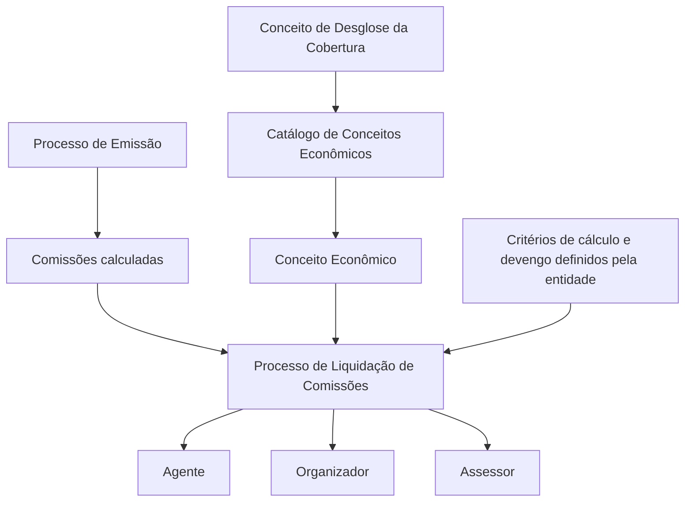

# REEF Core — Definição de Conceitos Econômicos para Liquidação de Comissões

## 1. Metadados do Documento
- **Arquivo de Origem:** `Não identificado`
- **Tipo de Documento:** `Especificação Técnica`
- **Domínio / Sistema:** `REEF Core — Liquidação de Comissões`
- **Público-Alvo:** `Negócio, Desenvolvedores e Arquitetos`
- **Data/Versão Identificada:** `Não identificada`

---

## 2. Resumo Executivo & Contexto de Negócio

O documento descreve o catálogo de **Conceitos Econômicos** do REEF Core, utilizado como complemento às comissões calculadas no processo de emissão. O catálogo permite identificar e registrar importes econômicos que serão posteriormente liquidados no processo de Liquidação de Comissões.

Os importes associados a conceitos econômicos podem ser liquidados para as figuras de intermediação classificadas como **Agente**, **Organizador** ou **Assessor**. Os critérios de cálculo e de devengo aplicáveis à liquidação são determinados pela entidade, sem detalhamento adicional no material analisado.

A definição de cada registro considera a companhia, o conceito econômico agregador, o conceito de desagregação de cobertura, a atuação do intermediário e a tipologia de agrupamento. O catálogo também possui mecanismos de inabilitação e validade temporal, permitindo desativar registros e manter histórico de alterações.

A documentação alerta que a leitura isolada deste conteúdo pode levar a interpretações incorretas. Por essa razão, recomenda a consulta às diretrizes e documentos funcionais vinculados ao tema de Conceitos Econômicos.

---

## 3. Arquitetura, Componentes & Tecnologias Envolvidas

Os componentes e processos explicitamente citados são:

| Componente / Processo | Papel descrito |
| :--- | :--- |
| REEF Core | Sistema que identifica e registra conceitos econômicos complementares às comissões calculadas. |
| Processo de Emissão | Processo no qual as comissões são calculadas. |
| Catálogo de Conceitos Econômicos | Estrutura de configuração dos conceitos econômicos sujeitos à liquidação de comissões. |
| Conceito de Desglose | Origem parcial ou total do importe associado ao conceito econômico. |
| Processo de Liquidação de Comissões | Processo que liquida os importes ao Agente, Organizador ou Assessor. |
| Entidade | Responsável por determinar os critérios de cálculo e devengo. |



**Nota de Análise:** O documento não detalha interfaces, tecnologias de implementação, métodos HTTP, contratos JSON, bancos de dados, integrações ou ambientes técnicos do REEF Core.

---

## 4. Regras de Negócio, Especificações Funcionais & Processos

### Objetivo funcional

O REEF Core permite identificar e registrar conceitos econômicos complementares às comissões calculadas durante o Processo de Emissão. Os importes desses conceitos econômicos são liquidados ao Agente, Organizador ou Assessor durante o Processo de Liquidação de Comissões.

### Regras de configuração do catálogo

1. Cada registro deve estar associado a uma **companhia**, identificada pelo código da companhia para a qual está sendo realizada a definição dos conceitos econômicos afetos à Liquidação de Comissões.
2. Cada registro deve identificar um **conceito econômico** sobre o qual serão acumulados os importes dos conceitos de desglose associados.
3. Cada registro deve identificar um **conceito de desglose da cobertura**, origem do importe parcial ou total do conceito econômico.
4. A propriedade **Atuação do Intermediário** determina a figura de intermediação afetada pelo conceito econômico.
5. A propriedade **Tipologia de Agrupamento** esclarece a procedência comercial do conteúdo econômico do conceito e aceita valores configurados corporativamente.
6. A propriedade **Inabilitação** permite indicar que o registro configurado está desativado ou inabilitado para uso.
7. A propriedade **Data de Validade** estabelece a data a partir da qual o registro se torna operacional no sistema.
8. O uso correto da Data de Validade permite manter histórico das alterações efetuadas ao longo do tempo.
9. Os critérios de cálculo e devengo aplicáveis aos importes são determinados pela entidade.
10. A documentação recomenda consultar diretrizes e documentos funcionais relacionados para evitar interpretações incorretas decorrentes da leitura isolada deste catálogo.

### Valores permitidos para Atuação do Intermediário

| Código | Figura de intermediação |
| :--- | :--- |
| `P` | Produtor |
| `O` | Organizador |
| `A` | Assessor |

---

## 5. Tabelas de Parâmetros, Ambientes e Estruturas de Dados

| Item / Parâmetro | Descrição / Função | Tipo / Valores / Formato | Ambiente / Observações |
| :--- | :--- | :--- | :--- |
| Companhia | Código da companhia sobre a qual é definida a configuração de conceitos econômicos para Liquidação de Comissões. | Código de companhia; formato não detalhado. | Aplicável ao catálogo de conceitos econômicos. |
| Conceito Econômico | Conceito sobre o qual são acumulados os importes dos conceitos de desglose associados. | Identificador de conceito; formato não detalhado. | Aplicável ao catálogo de conceitos econômicos. |
| Conceito de Desglose | Conceito de desglose da cobertura do qual procede o importe parcial ou total do conceito econômico. | Identificador de conceito; formato não detalhado. | Origem do importe associado. |
| Atuação do Intermediário | Identifica a figura de intermediação afetada pelo conceito econômico definido. | `P` = Produtor; `O` = Organizador; `A` = Assessor. | Valor explicitamente definido no documento. |
| Tipologia de Agrupamento | Esclarece a procedência comercial do conteúdo econômico do conceito. | Valores configurados corporativamente; valores específicos não detalhados. | Dependente de configuração corporativa. |
| Inabilitação | Indica que o registro configurado para o conceito econômico está desativado ou inabilitado para uso. | Estado de habilitação; formato não detalhado. | Impede a utilização do registro. |
| Data de Validade | Informa a data a partir da qual o registro configurado passa a estar operacional no sistema. | Data; formato não detalhado. | Permite manter histórico de alterações. |
| Critérios de cálculo e devengo | Critérios aplicáveis à liquidação dos importes dos conceitos econômicos. | Determinados pela entidade; detalhes não informados. | Aplicáveis ao Processo de Liquidação de Comissões. |
| Processo de Emissão | Processo no qual as comissões são calculadas. | Processo funcional. | Origem das comissões complementadas pelos conceitos econômicos. |
| Processo de Liquidação de Comissões | Processo no qual os importes dos conceitos econômicos são liquidados. | Processo funcional. | Destinatários: Agente, Organizador ou Assessor. |

---

## 6. Bateria de Perguntas & Respostas para RAG (FAQ Sintético)

### P1: Qual é o objetivo do catálogo de Conceitos Econômicos no REEF Core?
**R:** O catálogo de Conceitos Econômicos permite ao REEF Core identificar e registrar conceitos econômicos complementares às comissões calculadas no Processo de Emissão. Os importes desses conceitos são posteriormente liquidados no Processo de Liquidação de Comissões.

### P2: Para quais figuras podem ser liquidados os importes dos conceitos econômicos?
**R:** Os importes dos conceitos econômicos podem ser liquidados ao Agente, Organizador ou Assessor, de acordo com os critérios de cálculo e devengo definidos pela entidade.

### P3: Qual é a finalidade do atributo Companhia?
**R:** O atributo Companhia contém o código da companhia sobre a qual está sendo realizada a definição dos conceitos econômicos afetos ao Processo de Liquidação de Comissões.

### P4: O que representa o atributo Conceito Econômico?
**R:** O atributo Conceito Econômico identifica o conceito sobre o qual serão acumulados os importes provenientes dos conceitos de desglose associados.

### P5: Qual é a origem do importe associado a um Conceito Econômico?
**R:** O importe parcial ou total de um Conceito Econômico procede do Conceito de Desglose da Cobertura associado ao registro do catálogo.

### P6: Quais valores podem ser utilizados na propriedade Atuação do Intermediário?
**R:** A propriedade Atuação do Intermediário aceita `P` para Produtor, `O` para Organizador e `A` para Assessor. Essa propriedade identifica a figura de intermediação afetada pelo conceito econômico definido.

### P7: O que define a Tipologia de Agrupamento?
**R:** A Tipologia de Agrupamento esclarece a procedência comercial do conteúdo econômico do conceito. Os seus valores possíveis são aqueles configurados corporativamente, sem detalhamento dos valores específicos no documento.

### P8: O que acontece quando um registro está marcado com Inabilitação?
**R:** A propriedade Inabilitação indica que o registro configurado para o Conceito Econômico está desativado ou inabilitado e, portanto, não deve ser utilizado.

### P9: Como a Data de Validade influencia um registro de Conceito Econômico?
**R:** A Data de Validade informa ao sistema a partir de qual data o registro configurado para o Conceito Econômico se torna operacional. O uso adequado dessa propriedade permite manter um histórico das alterações realizadas ao longo do tempo.

### P10: O documento define os critérios de cálculo e devengo dos conceitos econômicos?
**R:** Não. O documento informa que os critérios de cálculo e devengo são determinados pela entidade, mas não apresenta fórmulas, regras detalhadas ou exemplos de cálculo.

### P11: Existem informações sobre APIs, contratos JSON ou métodos HTTP do REEF Core?
**R:** Não. O documento não detalha APIs, métodos HTTP, contratos JSON, integrações técnicas, tecnologias de implementação ou configurações de infraestrutura.

---

## 7. Glossário de Termos, Siglas & Conceitos-Chave

- **REEF Core:** Sistema citado como responsável por identificar e registrar conceitos econômicos complementares às comissões calculadas no Processo de Emissão.
- **Conceito Econômico:** Conceito do catálogo sobre o qual se acumulam os importes dos conceitos de desglose associados.
- **Conceito de Desglose:** Conceito de desglose da cobertura do qual procede o importe parcial ou total do Conceito Econômico.
- **Liquidação de Comissões:** Processo no qual os importes dos conceitos econômicos são liquidados ao Agente, Organizador ou Assessor.
- **Devengo:** Critério mencionado para a liquidação dos importes; o documento não apresenta definição adicional.
- **Produtor (`P`):** Figura de intermediação permitida na propriedade Atuação do Intermediário.
- **Organizador (`O`):** Figura de intermediação permitida na propriedade Atuação do Intermediário.
- **Assessor (`A`):** Figura de intermediação permitida na propriedade Atuação do Intermediário.
- **Tipologia de Agrupamento:** Propriedade que identifica a procedência comercial do conteúdo econômico do conceito.
- **Inabilitação:** Propriedade que indica que um registro está desativado ou inabilitado para utilização.
- **Data de Validade:** Data a partir da qual um registro configurado passa a estar operacional no sistema.

---

## 8. Notas Críticas, Riscos & Limitações

- O documento não detalha os critérios de cálculo e devengo determinados pela entidade.
- Não há informação sobre fórmulas, periodicidade, eventos disparadores, exceções ou reconciliação da Liquidação de Comissões.
- Os valores corporativos permitidos para Tipologia de Agrupamento não são apresentados.
- Não há especificação de formato, obrigatoriedade, unicidade ou relacionamento técnico dos atributos do catálogo.
- Não são descritos APIs, serviços, tecnologias, URLs, ambientes, logs, permissões ou contratos de integração.
- A própria documentação recomenda a consulta a diretrizes e documentos funcionais vinculados, pois a interpretação isolada do conteúdo pode conduzir a erro.
- A resposta à pergunta frequente sobre circunstâncias operativas do catálogo é `N/A`.

---

## 9. Conteúdo Bruto Estruturado (Referência Fiel)

```text
--- [PÁGINA 1 DE 2] ---

DEFINICIÓN de CONCEPTOS ECONÓMICOS / LIQUIDACIÓN de
COMISIONES
Objetivo
Funcionalmente Reef.core cuenta con la posibilidad de identicar y registrar, como complemento a las comisiones calculadas en el Proceso
de Emisión, conceptos económicos cuyos importes serán liquidados por su importe al Agente, Organizador o Asesor en el Proceso de
Liquidación de Comisiones de acuerdo con los criterios de cálculo y devengo que determine la entidad.
Propiedades Operativas
Otras Propiedades
Propiedades Operativas
Compañía
Este Atributo del catálogo contiene el código de la compañía sobre la que se está realizando la denición de los conceptos económicos
afectos al proceso de Liquidación de Comisiones.
Concepto Económico
Este Atributo del Catálogo identica el Concepto Económico sobre el que se acumularán los importes de los conceptos de desglose
asociados.
Concepto de Desglose
Este Atributo del Catálogo identica el Concepto de Desglose de la Cobertura del que procede el importe parcial o total del Concepto
Económico.
Actuación del Intermediario
Esta propiedad del Catálogo identica la gura de intermediación afectada por el concepto económico denido. Sus posibles valores son:
"P" - Productor.
"O" - Organizador.
"A" - Asesor.
Tipología de Agrupamiento
Esta Propiedad clarica la procedencia comercial del contenido económico del concepto siendo sus posibles valores aquellos congurados
corporativamente.
Documentation / DOCUMENTACIÓN Reef
DOCUMENTACIÓN Reef
Mapfredocument
DOCUMENTACIÓN Reef
Owner
user:agonzalez_mapfre.com
Lifecycle
Approved Source
 / 
 VL
Buscar Inicio Soluciones Arquitecturas APIs Componentes Cloud Documentación Zeus Reef Ayuda
ES


--- [PÁGINA 2 DE 2] ---

Otras Propiedades
Inhabilitación
Esta propiedad establece que el Registro congurado para el Concepto Económico en el Catálogo está desactivado o inhabilitado para ser
utilizado.
Fecha de Validez
Esta propiedad le indica al Sistema la fecha a partir de la cual el registro congurado para el Concepto Económico está operativo en el
sistema por lo que su correcto uso permite tener un histórico de los cambios efectuados a lo largo del tiempo.
Vínculos
Relación de Directrices y Documentos funcionales cuya lectura recomendada para evitar que la interpretación aislada del presente
documento pueda conducir a error.
Conceptos Económicos
Preguntas frecuentes
(1) ¿Existe alguna circunstancia operativa que deba ser tomada en consideración sobre este catálogo?
N/A
```
