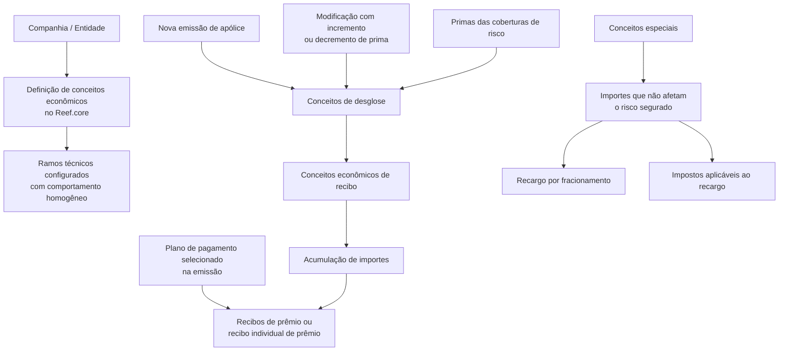

# Definição de Conceitos Econômicos de Recibo no Reef.core

## 1. Metadados do Documento
- **Arquivo de Origem:** Não identificado no conteúdo extraído
- **Tipo de Documento:** Especificação Técnica
- **Domínio / Sistema:** Reef.core / Documentación Reef / Mapfre
- **Público-Alvo:** Não identificado; conteúdo orientado à configuração de conceitos econômicos de recibo
- **Data/Versão Identificada:** Não identificada

---

## 2. Resumo Executivo & Contexto de Negócio

O documento descreve a definição de conceitos econômicos de recibo no sistema Reef.core. Essa definição é realizada no nível da companhia e possui comportamento homogêneo para todos os ramos técnicos configurados na entidade.

A função dos conceitos econômicos de recibo é acumular os valores dos conceitos de desglose nos quais são detalhadas as primas das coberturas de risco. A acumulação permite gerar recibos de prêmio conforme o plano de pagamento selecionado durante a emissão da apólice.

Os conceitos de desglose são gerados em novas emissões e em modificações cujo resultado implique aumento ou redução do prêmio. Portanto, os conceitos econômicos atuam como contenedores dos valores obtidos nos conceitos de desglose.

O sistema permite definir e codificar até 999 conceitos econômicos de recibo. Cada conceito econômico pode ser denominado e individualizado por meio de descrição e abreviatura. O documento também diferencia conceitos especiais, reservados para valores que não afetam o risco segurado, como recargo por fracionamento e impostos aplicáveis a esse recargo.

---

## 3. Arquitetura, Componentes & Tecnologias Envolvidas

| Componente / Elemento | Papel identificado no documento |
| :--- | :--- |
| **Reef.core** | Sistema no qual a definição dos conceitos econômicos de recibo é realizada. |
| **Companhia / entidade** | Nível organizacional no qual os conceitos econômicos são definidos. |
| **Ramos técnicos** | Configurações da entidade que recebem comportamento homogêneo para os conceitos econômicos. |
| **Coberturas de risco** | Origem das primas detalhadas por conceitos de desglose. |
| **Conceitos de desglose** | Estruturas que contêm valores das primas das coberturas de risco e alimentam os conceitos econômicos. |
| **Conceitos econômicos de recibo** | Contenedores que acumulam valores dos conceitos de desglose para composição de recibos. |
| **Plano de pagamento** | Seleção realizada no processo de emissão da apólice; determina a geração de recibos de prêmio ou de um recibo individual. |
| **Recibo de prêmio** | Documento resultante da acumulação dos importes dos conceitos econômicos. |
| **Mapfredocument** | Termo exibido no cabeçalho da documentação. |
| **Documentation / DOCUMENTACIÓN Reef** | Identificação da documentação de origem. |



**Nota de Análise:** O documento não detalha interfaces, métodos HTTP, contratos JSON, banco de dados, tecnologias de infraestrutura ou integração entre sistemas externos.

---

## 4. Regras de Negócio, Especificações Funcionais & Processos

1. A definição dos conceitos econômicos de recibo no Reef.core é realizada sempre no nível da companhia.
2. O comportamento dos conceitos econômicos é homogêneo para todos os ramos técnicos configurados na entidade.
3. Um recibo é composto por uma série de importes que, somados, informam ao cliente o montante que deve ser pago.
4. Esses importes são denominados conceitos econômicos.
5. Os conceitos econômicos são alimentados pelos conceitos de desglose de apólices e aplicações.
6. Os conceitos de desglose detalham as primas das coberturas dos riscos.
7. Os conceitos de desglose são gerados:
   - Em novas emissões.
   - Em modificações cujo resultado implique incremento da prima.
   - Em modificações cujo resultado implique decremento da prima.
8. Conceitos econômicos são contenedores dos importes encontrados nos conceitos de desglose.
9. A acumulação dos importes permite gerar, de acordo com o plano de pagamento selecionado na emissão da apólice:
   - Recibos de prêmio; ou
   - Um recibo individual de prêmio resultante.
10. O sistema permite definir e codificar até **999 conceitos econômicos de recibo**.
11. Cada conceito econômico pode ser denominado e individualizado por:
   - Descrição;
   - Abreviatura.
12. Existem conceitos especiais que podem conter importes.
13. Os conceitos especiais são reservados para importes que não afetam o risco segurado.
14. Exemplos explicitamente citados de valores em conceitos especiais:
   - Recargo aplicado quando o custo do seguro do risco é fracionado;
   - Impostos aplicáveis ao recargo por fracionamento.

**Nota de Análise:** O documento menciona a seção “Propiedades”, mas não apresenta propriedades, campos, regras de validação ou configurações adicionais na extração fornecida.

---

## 5. Tabelas de Parâmetros, Ambientes e Estruturas de Dados

| Item / Parâmetro | Descrição / Função | Tipo / Valores / Formato | Ambiente / Observações |
| :--- | :--- | :--- | :--- |
| Conceito econômico de recibo | Contenedor dos importes encontrados nos conceitos de desglose. | Até 999 conceitos econômicos podem ser definidos e codificados. | Definido no nível da companhia no Reef.core. |
| Descrição | Permite denominar e individualizar um conceito econômico. | Texto; formato não especificado. | Associada a cada conceito econômico. |
| Abreviatura | Permite denominar e individualizar um conceito econômico. | Texto; formato não especificado. | Associada a cada conceito econômico. |
| Conceito de desglose | Alimenta os conceitos econômicos com importes das primas de coberturas de risco. | Importes; formato monetário não especificado. | Gerado em novas emissões e em modificações com incremento ou decremento de prima. |
| Plano de pagamento | Direciona a geração de recibos a partir dos valores acumulados. | Valores permitidos não especificados. | Selecionado no processo de emissão da apólice. |
| Recibo de prêmio | Resultado gerado a partir da acumulação de importes. | Um ou mais recibos, conforme plano de pagamento. | Relacionado ao processo de emissão da apólice. |
| Conceito especial | Contém importes que não afetam o risco segurado. | Pode conter recargo por fracionamento e impostos relacionados. | Regras adicionais não especificadas. |
| Recargo por fracionamento | Recargo aplicado quando o custo do seguro do risco é fracionado. | Importe; cálculo não especificado. | Exemplo de valor em conceito especial. |
| Impostos sobre recargo | Impostos aplicáveis ao recargo por fracionamento. | Importe; impostos e cálculo não especificados. | Exemplo de valor em conceito especial. |

---

## 6. Bateria de Perguntas & Respostas para RAG (FAQ Sintético)

### P1: Em qual nível organizacional os conceitos econômicos de recibo são definidos no Reef.core?
**R:** Os conceitos econômicos de recibo são definidos sempre no nível da companhia. Essa definição possui comportamento homogêneo para todos os ramos técnicos configurados na entidade.

### P2: Qual é a função dos conceitos econômicos de recibo no Reef.core?
**R:** Os conceitos econômicos de recibo acumulam a soma dos importes dos conceitos de desglose que detalham as primas das coberturas dos riscos. Essa acumulação permite a geração de recibos de prêmio ou de um recibo individual de prêmio.

### P3: O que alimenta os conceitos econômicos de recibo?
**R:** Os conceitos econômicos são alimentados pelos conceitos de desglose de apólices e aplicações. Os conceitos de desglose contêm os importes associados às primas das coberturas de risco.

### P4: Em quais situações os conceitos de desglose são gerados?
**R:** Os conceitos de desglose são gerados em novas emissões e em modificações cujo resultado implique incremento ou decremento da prima.

### P5: Como o plano de pagamento afeta a geração de recibos?
**R:** O plano de pagamento é selecionado durante o processo de emissão da apólice. De acordo com esse plano, a acumulação dos importes dos conceitos econômicos permite gerar recibos de prêmio ou o recibo individual de prêmio resultante.

### P6: Quantos conceitos econômicos de recibo podem ser definidos e codificados?
**R:** O sistema permite definir e codificar até 999 conceitos econômicos de recibo.

### P7: Como um conceito econômico pode ser identificado individualmente?
**R:** Cada conceito econômico pode ser denominado e individualizado por uma descrição e uma abreviatura.

### P8: O que são conceitos especiais no contexto dos conceitos econômicos?
**R:** Conceitos especiais são conceitos que podem conter importes reservados para valores que não afetam o risco segurado.

### P9: Quais exemplos de valores podem ser mantidos em conceitos especiais?
**R:** O documento cita como exemplos o recargo aplicado quando o custo do seguro do risco é fracionado e os impostos aplicáveis a esse recargo por fracionamento.

### P10: O documento especifica como calcular o recargo por fracionamento ou os impostos aplicáveis?
**R:** Não. O documento apenas informa que o recargo por fracionamento e os impostos associados podem ser armazenados em conceitos especiais. Fórmulas de cálculo, alíquotas e critérios de aplicação não são detalhados.

---

## 7. Glossário de Termos, Siglas & Conceitos-Chave

- **Reef.core:** Sistema em que a definição dos conceitos econômicos de recibo é realizada.
- **Conceito econômico:** Importe que compõe um recibo e informa ao cliente o montante a satisfazer; atua como contenedor de valores de conceitos de desglose.
- **Conceito econômico de recibo:** Conceito econômico utilizado para acumular importes e compor recibos de prêmio.
- **Conceito de desglose:** Estrutura que detalha importes das primas das coberturas de risco e alimenta conceitos econômicos.
- **Prêmio / prima:** Valor associado às coberturas de risco, mencionado como origem dos importes de desglose.
- **Recibo de prêmio:** Recibo gerado a partir da acumulação dos importes dos conceitos econômicos.
- **Recibo individual de prêmio:** Resultado possível da geração de recibos conforme o plano de pagamento selecionado.
- **Ramo técnico:** Ramo configurado na entidade que recebe comportamento homogêneo na definição de conceitos econômicos.
- **Recargo por fracionamento:** Recargo aplicado quando o custo do seguro do risco é fracionado.
- **Conceito especial:** Conceito reservado a importes que não afetam o risco segurado.

---

## 8. Notas Críticas, Riscos & Limitações

- O documento está identificado como **“EN CONSTRUCCIÓN”**, indicando conteúdo em construção.
- A extração fornecida apresenta uma seção intitulada **“Propiedades”**, sem detalhamento subsequente de propriedades.
- Não há detalhamento de cálculo de primas, recargos, impostos ou regras de arredondamento.
- Não há descrição de códigos, estrutura de dados, persistência, telas, APIs, interfaces ou contratos de integração.
- Não são informados valores permitidos, obrigatoriedade, unicidade ou validações para descrição e abreviatura.
- Não há detalhamento do plano de pagamento nem dos critérios que determinam a geração de múltiplos recibos ou de recibo individual.
- Não são especificados os impostos aplicáveis, as alíquotas ou as regras de incidência sobre o recargo por fracionamento.

---

## 9. Conteúdo Bruto Estruturado (Referência Fiel)

```text
--- [PÁGINA 1 DE 2] ---

EN CONSTRUCCIÓN
DEFINICIÓN de CONCEPTOS ECONÓMICOS
Contexto
La denición de los conceptos económicos del recibo en Reef.core se realiza siempre a nivel de la compañía teniendo un comportamiento
homogéneo para todos los ramos técnicos congurados en la entidad.
Conceptualmente la función de los conceptos económicos del recibo en Reef.core no es otra que acumular la suma de los importes de los
conceptos de desglose en los que se desgranan las primas de las coberturas de los riesgos para poder generar, de acuerdo al plan de pago
seleccionado en el proceso de emisión de la póliza, los recibos de prima o el recibo individual de prima resultante.
El sistema permite denir y codicar hasta 999 conceptos económicos de recibo pudiendo denominar e individualizar cada uno de ellos
mediante una descripción y una abreviatura.
Objetivo
Un recibo está compuesto por una serie de importes que sumados informan al cliente del monto que debe satisfacer. A estos importes se les
denomina conceptos económicos. Los conceptos económicos se alimentan de los conceptos de desglose de pólizas y aplicaciones. Estos
conceptos de desglose se generan en las nuevas emisiones y en aquellas modicaciones cuyo resultado implica un incremento o
decremento en la prima. Es decir, los conceptos económicos son contenedores de los importes hallados en los conceptos de desglose.
Documentation / DOCUMENTACIÓN Reef
DOCUMENTACIÓN Reef
Mapfredocument
DOCUMENTACIÓN Reef
Owner
user:agonzalez_mapfre.com
Lifecycle
Approved Source
 /
VL
Buscar Inicio Soluciones Arquitecturas APIs Componentes Cloud Documentación Zeus Reef Ayuda
ES


--- [PÁGINA 2 DE 2] ---

Existen unos conceptos especiales que SI pueden hallar importes. Estos conceptos están reservados para contener aquellos importes que no
afectan al riesgo asegurado, contendrían por ejemplo el recargo que se quiere aplicar si se fracciona el coste del seguro del riesgo y
elementos adicionales como los impuestos que aplican a ese recargo por fraccionamiento.
-Propiedades
Propiedades
```
