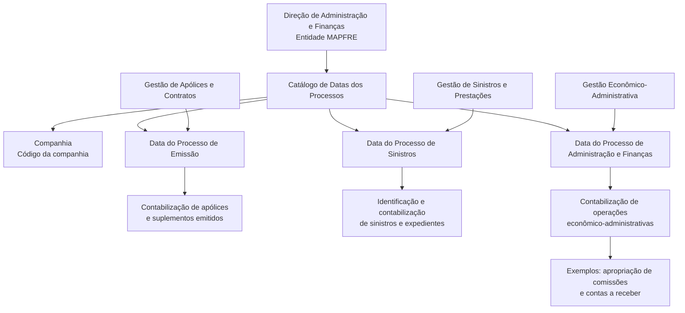

# Definição das Datas dos Processos Contábeis para Companhias Seguradoras

## 1. Metadados do Documento
- **Arquivo de Origem:** Não identificado no conteúdo fornecido
- **Tipo de Documento:** Especificação Funcional
- **Domínio / Sistema:** DOCUMENTACIÓN Reef / MAPFRE / atividade contábil de companhias seguradoras
- **Público-Alvo:** Administração e Finanças, Operação Contábil, Analistas Funcionais
- **Data/Versão Identificada:** Não identificada
- **Owner identificado:** `user:agonzalez_mapfre.com`
- **Lifecycle identificado:** Approved Source

---

## 2. Resumo Executivo & Contexto de Negócio

O documento define um catálogo específico para registrar e manter as datas contábeis associadas aos processos macro de uma companhia seguradora. O catálogo é entregue inicialmente vazio às instalações e deve ser configurado antes de suportar a contabilização operacional.

A atividade contábil das companhias seguradoras é apresentada como responsável por registrar, classificar, resumir e analisar, quantitativa e qualitativamente, as operações financeiras realizadas. Nesse contexto, as datas dos processos determinam o período de fechamento utilizado para contabilizar eventos oriundos dos processos corporativos.

O catálogo contém o código da companhia e três datas principais: a data do Processo de Emissão, a data do Processo de Sinistros e a data do Processo de Administração e Finanças. Cada data vincula as operações do processo correspondente a um período contábil de fechamento.

A configuração inicial e a manutenção posterior do catálogo são responsabilidade da Direção de Administração e Finanças da entidade MAPFRE. O documento também recomenda a leitura de diretrizes e documentos funcionais relacionados para evitar interpretações isoladas ou incorretas.

---

## 3. Arquitetura, Componentes & Tecnologias Envolvidas

Os elementos funcionais explicitamente identificados são:

- **Catálogo de Datas dos Processos:** repositório de informação específica para registrar as datas contábeis dos processos macro.
- **Companhia:** código da companhia para a qual as datas são definidas ou mantidas.
- **Processo de Gestão de Apólices e Contratos:** origem de apólices e suplementos contabilizados segundo a Data do Processo de Emissão.
- **Processo de Gestão de Sinistros e Prestações:** origem de sinistros e expedientes contabilizados segundo a Data do Processo de Sinistros.
- **Processos de Gestão Econômico-Administrativa:** origem de operações contabilizadas segundo a Data do Processo de Administração e Finanças, incluindo exemplos como apropriação de comissões e contas a receber.
- **Direção de Administração e Finanças da entidade MAPFRE:** área responsável pela configuração e manutenção do catálogo.
- **DOCUMENTACIÓN Reef / Mapfredocument:** referências de documentação e navegação identificadas no conteúdo.



> **Nota de Análise:** o conteúdo não detalha tecnologias de implementação, banco de dados, interfaces, métodos HTTP, contratos JSON, integrações técnicas, URLs de ambiente ou mecanismos de auditoria do catálogo.

---

## 4. Regras de Negócio, Especificações Funcionais & Processos

1. A atividade contábil das companhias seguradoras deve registrar, classificar, resumir e analisar as operações financeiras realizadas, tanto em termos quantitativos quanto qualitativos.

2. O núcleo do sistema dispõe de um catálogo específico para registrar as datas contábeis dos processos macro da entidade.

3. O catálogo de Datas dos Processos é inicialmente entregue vazio às instalações. Portanto, a configuração inicial é uma atividade necessária para que o catálogo possua conteúdo operacional.

4. O atributo **Companhia** deve conter o código da companhia sobre a qual está sendo realizada a definição ou manutenção das Datas dos Processos Macro.

5. O atributo **Data do Processo de Emissão** deve especificar a data do período de fechamento usada para contabilizar:
   - Apólices emitidas;
   - Suplementos emitidos;
   - Operações originadas no Processo de Gestão de Apólices e Contratos.

6. O atributo **Data do Processo de Sinistros** deve conter a data do período de fechamento usada para:
   - Identificar sinistros;
   - Contabilizar sinistros;
   - Identificar e contabilizar os expedientes de sinistros;
   - Processar resultados do Processo de Gestão de Sinistros e Prestações da entidade.

7. O atributo **Data do Processo de Administração e Finanças** deve conter a data do período de fechamento usada para contabilizar operações resultantes dos processos de gestão econômico-administrativa da entidade MAPFRE.

8. Entre os exemplos explícitos de operações da gestão econômico-administrativa estão:
   - Apropriação de comissões;
   - Contas a receber.

9. A configuração inicial do catálogo e sua manutenção posterior devem ser realizadas pela **Direção de Administração e Finanças da entidade MAPFRE**.

10. A leitura de diretrizes e documentos funcionais vinculados é recomendada, pois a interpretação isolada do documento pode conduzir a erro.

---

## 5. Tabelas de Parâmetros, Ambientes e Estruturas de Dados

| Item / Parâmetro | Descrição / Função | Tipo / Valores / Formato | Ambiente / Observações |
| :--- | :--- | :--- | :--- |
| Catálogo de Datas dos Processos | Catálogo específico para registrar datas contábeis dos processos macro da entidade. | Catálogo de informação; estrutura detalhada não informada. | Entregue inicialmente vazio às instalações. |
| Companhia | Identifica a companhia sobre a qual ocorre a definição ou manutenção das datas dos processos macro. | Código da companhia; formato não informado. | Atributo do catálogo. |
| Data do Processo de Emissão | Define a data do período de fechamento para contabilizar apólices e suplementos emitidos. | Data de período de fechamento; formato não informado. | Associada ao Processo de Gestão de Apólices e Contratos. |
| Data do Processo de Sinistros | Define a data do período de fechamento para identificar e contabilizar sinistros e seus expedientes. | Data de período de fechamento; formato não informado. | Associada ao Processo de Gestão de Sinistros e Prestações. |
| Data do Processo de Administração e Finanças | Define a data do período de fechamento para contabilizar operações de gestão econômico-administrativa. | Data de período de fechamento; formato não informado. | Inclui exemplos como apropriação de comissões e contas a receber. |
| Responsável por configuração e manutenção | Área responsável por configurar inicialmente o catálogo e mantê-lo posteriormente. | Direção organizacional. | Direção de Administração e Finanças da entidade MAPFRE. |
| Owner | Proprietário identificado nos metadados de documentação. | `user:agonzalez_mapfre.com` | Identificado em DOCUMENTACIÓN Reef. |
| Lifecycle | Estado do ciclo de vida documental. | `Approved Source` | Identificado em DOCUMENTACIÓN Reef. |

---

## 6. Bateria de Perguntas & Respostas para RAG (FAQ Sintético)

### P1: Qual é o objetivo do catálogo de Datas dos Processos?
**R:** O catálogo de Datas dos Processos permite registrar e manter as datas contábeis dos processos macro de uma entidade seguradora. Essas datas determinam o período de fechamento utilizado para contabilizar operações originadas nos processos de emissão, sinistros e administração e finanças.

### P2: O catálogo de Datas dos Processos já possui informações quando é entregue a uma instalação?
**R:** Não. O documento informa que o catálogo específico é entregue inicialmente vazio de conteúdo às instalações. A configuração inicial deve ser realizada posteriormente pela Direção de Administração e Finanças da entidade MAPFRE.

### P3: Qual atributo identifica a companhia no catálogo?
**R:** O atributo **Companhia** contém o código da companhia sobre a qual está sendo realizada a definição e/ou manutenção das Datas dos Processos Macro.

### P4: Para que serve a Data do Processo de Emissão?
**R:** A Data do Processo de Emissão especifica a data do período de fechamento com a qual serão contabilizadas as apólices e os suplementos emitidos no Processo de Gestão de Apólices e Contratos.

### P5: Quais eventos são tratados pela Data do Processo de Sinistros?
**R:** A Data do Processo de Sinistros contém a data do período de fechamento usada para identificar e contabilizar sinistros e seus expedientes, como resultado do Processo de Gestão de Sinistros e Prestações da entidade.

### P6: Que operações utilizam a Data do Processo de Administração e Finanças?
**R:** A Data do Processo de Administração e Finanças é usada para contabilizar operações resultantes dos processos de gestão econômico-administrativa da entidade MAPFRE. O documento cita como exemplos a apropriação de comissões e as contas a receber.

### P7: Quem é responsável pela configuração inicial e manutenção do catálogo?
**R:** A configuração inicial e a manutenção posterior do catálogo de Datas dos Processos devem ser realizadas pela Direção de Administração e Finanças da entidade MAPFRE.

### P8: O documento informa o formato técnico das datas ou o banco de dados do catálogo?
**R:** Não. O documento define a finalidade funcional das datas como datas de períodos de fechamento, mas não informa formato de data, banco de dados, tecnologia de implementação, API, interface de usuário ou modelo físico de dados.

### P9: Por que é recomendada a leitura de diretrizes e documentos funcionais vinculados?
**R:** A leitura é recomendada para evitar que a interpretação isolada do documento leve a erro. O conteúdo menciona uma relação de diretrizes e documentos funcionais relacionados, mas não apresenta seus títulos ou conteúdos detalhados.

### P10: Qual é a relação entre o processo contábil e os processos macro da seguradora?
**R:** A atividade contábil registra, classifica, resume e analisa as operações financeiras das companhias seguradoras. As datas registradas no catálogo conectam os resultados dos processos macro aos respectivos períodos contábeis de fechamento.

---

## 7. Glossário de Termos, Siglas & Conceitos-Chave

- **Administração e Finanças:** área responsável pela configuração inicial e manutenção do catálogo de Datas dos Processos na entidade MAPFRE.
- **Catálogo de Datas dos Processos:** catálogo específico que registra as datas contábeis dos processos macro da entidade.
- **Companhia:** entidade identificada por código no atributo correspondente do catálogo.
- **Data do período de fechamento:** data utilizada para determinar o período contábil aplicável à contabilização das operações de um processo.
- **Expedientes de Sinistros:** expedientes associados aos sinistros, identificados e contabilizados no Processo de Gestão de Sinistros e Prestações.
- **MAPFRE:** entidade mencionada como contexto dos processos econômico-administrativos e da área responsável pela manutenção do catálogo.
- **Processo de Emissão:** processo relacionado à emissão de apólices e suplementos.
- **Processo de Gestão de Apólices e Contratos:** processo de origem das apólices e suplementos contabilizados pela Data do Processo de Emissão.
- **Processo de Gestão de Sinistros e Prestações:** processo de origem dos sinistros e respectivos expedientes.
- **Processos de Gestão Econômico-Administrativa:** processos que originam operações como apropriação de comissões e contas a receber.
- **Reef:** referência presente na documentação identificada como “DOCUMENTACIÓN Reef”.
- **Suplementos:** itens emitidos no Processo de Gestão de Apólices e Contratos e contabilizados conforme a Data do Processo de Emissão.

---

## 8. Notas Críticas, Riscos & Limitações

- A configuração inicial do catálogo é entregue vazia; a ausência de configuração pela área responsável pode impedir a definição dos períodos contábeis aplicáveis aos processos macro.
- O documento atribui explicitamente a configuração e manutenção à Direção de Administração e Finanças da entidade MAPFRE, criando uma dependência operacional dessa área.
- A interpretação isolada do documento pode conduzir a erro; a consulta a diretrizes e documentos funcionais vinculados é recomendada.
- Não são detalhados formatos de data, critérios de validação, regras para alteração de uma data já utilizada, trilha de auditoria, perfis de acesso, telas, APIs ou integrações.
- Não há detalhamento de como conflitos entre datas de emissão, sinistros e administração e finanças devem ser tratados.
- **Nota de Análise:** o conteúdo identifica processos e atributos funcionais, mas não descreve contratos técnicos, tecnologias, ambientes, servidores, URLs ou rotas de logs.

---

## 9. Conteúdo Bruto Estruturado (Referência Fiel)

```text
--- [PÁGINA 1 DE 1] ---

DEFINICIÓN de las Fechas de los Procesos
La actividad contable de las compañías aseguradoras está diseñada para registrar, clasicar, resumir y analizar en forma cuantitativa y
cualitativa las operaciones nancieras realizadas en las compañías de seguros.
Funcionalmente, el núcleo del Sistema cuenta con la posibilidad de registrar las fechas contables de los Procesos macro de la entidad en un
catálogo de información especíco que se entrega inicialmente a las instalaciones vacío de contenido.
Compañía
Este Atributo del catálogo contiene el código de la compañía sobre la que se está realizando la denición y/o mantenimiento de las Fechas
de los Procesos Macro.
Fecha del Proceso de Emisión
Este Atributo especica la Fecha del periodo de cierre con la que se van a contabilizar las pólizas y los suplementos emitidos en el Proceso
de Gestión de Pólizas y Contratos.
Fecha del Proceso de Siniestros
Esta propiedad contiene la Fecha del periodo de cierre en la que se van a identicar y contabilizar los Siniestros y sus Expedientes, como
resultado del Proceso de Gestión de Siniestros y Prestaciones de la Entidad.
Fecha del Proceso de Administración y Finanzas
Esta propiedad contiene la Fecha del periodo de cierre con la que se van a contabilizar todas aquellas operaciones resultantes de los
Procesos de Gestión Económico administrativo de la entidad MAPFRE, como por ejemplo el devengo de las Comisiones, cuentas por cobrar,
...
Vínculos
Relación de Directrices y Documentos funcionales cuya lectura recomendada para evitar que la interpretación aislada del presente
documento pueda conducir a error.
Preguntas frecuentes
(1) ¿Existe alguna circunstancia operativa que deba ser tomada en consideración sobre este catálogo?
La conguración inicial y su mantenimiento posterior lo debe realizar la Dirección de Administración y Finanzas de la Entidad MAPFRE.
Documentation / DOCUMENTACIÓN Reef
DOCUMENTACIÓN Reef
Mapfredocument
DOCUMENTACIÓN Reef
Owner
user:agonzalez_mapfre.com
Lifecycle
Approved Source
 /
VL
Buscar Inicio Soluciones Arquitecturas APIs Componentes Cloud Documentación Zeus Reef Ayuda
ES
```
